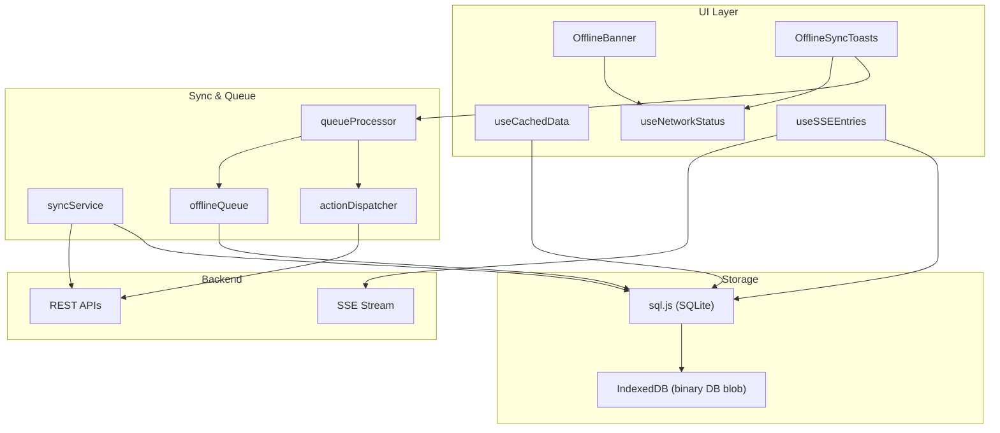
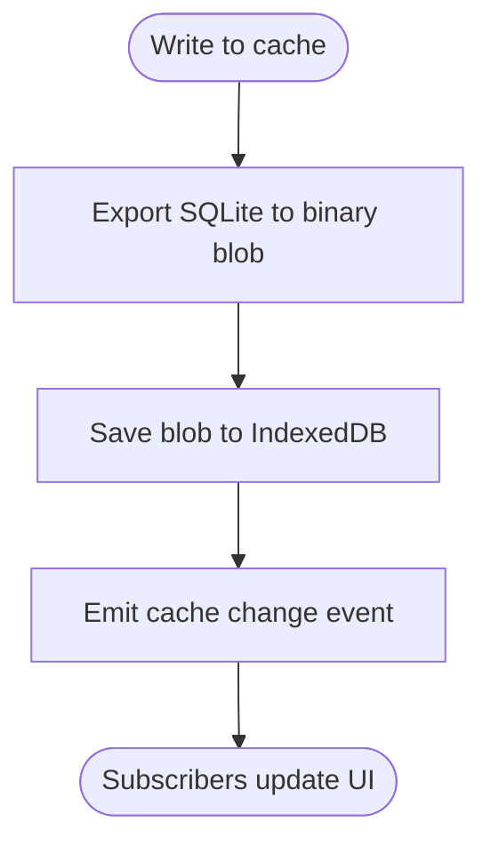
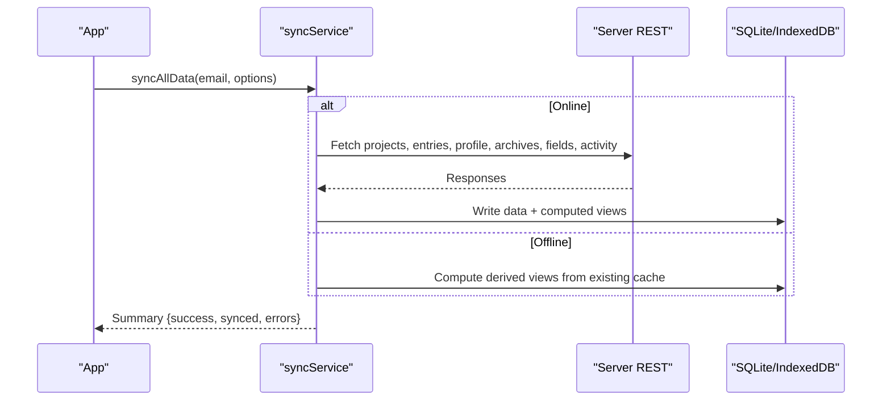
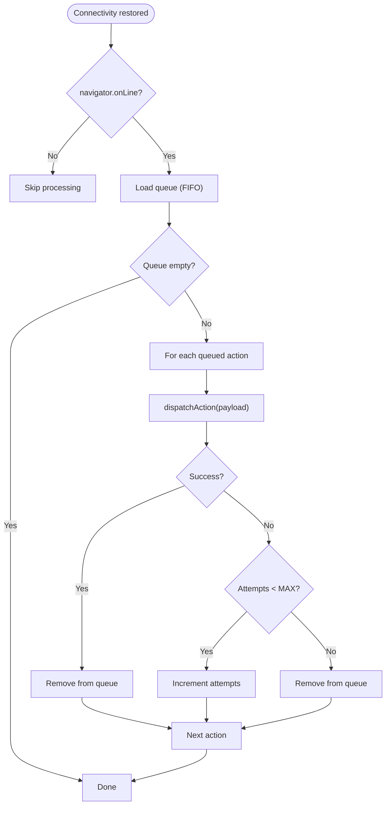
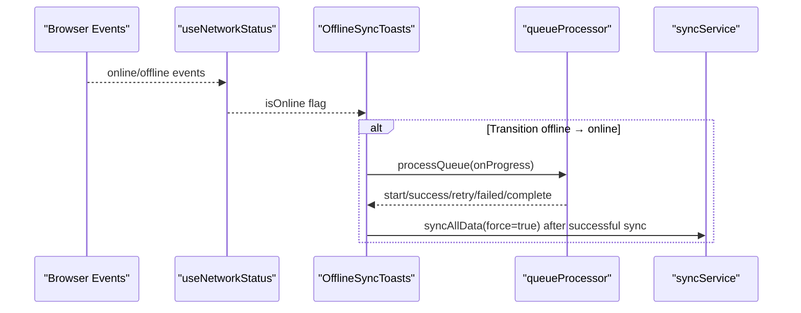
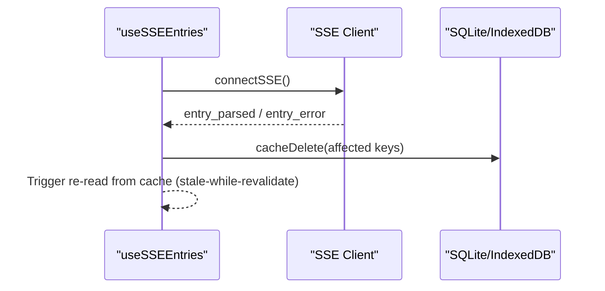
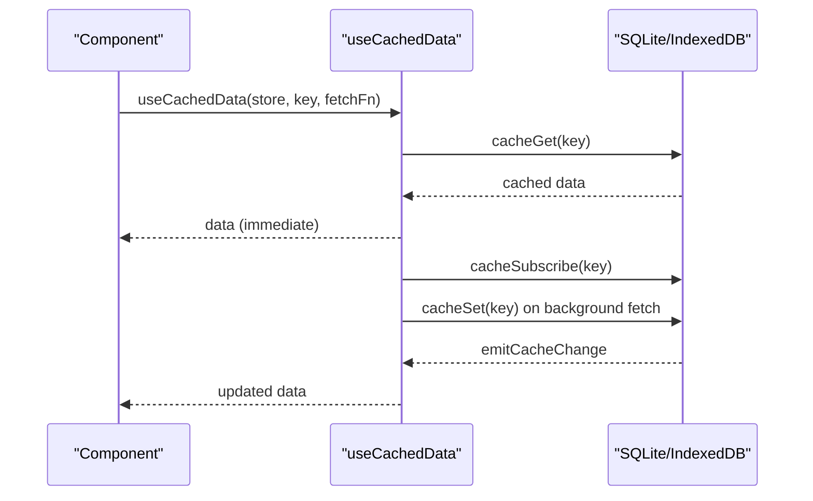
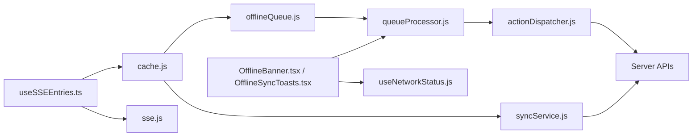

# Offline Support & Synchronization

<cite>
**Referenced Files in This Document**
- [index.js](file://frontend/src/CacheFunctions/index.js)
- [syncService.js](file://frontend/src/CacheFunctions/syncService.js)
- [offlineQueue.js](file://frontend/src/CacheFunctions/offlineQueue.js)
- [queueProcessor.js](file://frontend/src/CacheFunctions/queueProcessor.js)
- [actionDispatcher.js](file://frontend/src/CacheFunctions/actionDispatcher.js)
- [cache.js](file://frontend/src/lib/cache.js)
- [useNetworkStatus.js](file://frontend/src/hooks/useNetworkStatus.js)
- [OfflineBanner.tsx](file://frontend/src/components/OfflineBanner.tsx)
- [OfflineSyncToasts.tsx](file://frontend/src/components/OfflineSyncToasts.tsx)
- [useCachedData.js](file://frontend/src/hooks/useCachedData.js)
- [sse.js](file://frontend/src/lib/sse.js)
- [useSSEEntries.ts](file://frontend/src/hooks/useSSEEntries.ts)
</cite>

## Table of Contents

1. Introduction
2. Project Structure
3. Core Components
4. Architecture Overview
5. Detailed Component Analysis
6. Dependency Analysis
7. Performance Considerations
8. Troubleshooting Guide
9. Conclusion
10. Appendices

## Introduction

This document explains Codacaine’s offline-first architecture and data synchronization system. It covers how the app caches data locally using a SQLite database persisted to IndexedDB, how mutations are applied optimistically and synced later, how offline actions are queued and processed when connectivity returns, and how the UI reflects network status and sync progress. It also details consistency guarantees, retry policies, error handling, performance characteristics for large datasets, browser compatibility, storage limits, and migration strategies for cache updates.

## Project Structure

The offline-first layer is implemented in the frontend with clear separation of concerns:

- Cache layer: SQLite via sql.js with persistence to IndexedDB
- Sync service: orchestrates full and partial data syncs from server to cache
- Offline queue: stores pending actions while offline and processes them online
- Action dispatcher: maps queued actions to server mutation functions
- React hooks and components: provide cached reads, network detection, and user feedback



**Diagram sources**

- [OfflineBanner.tsx:1-52](file://frontend/src/components/OfflineBanner.tsx#L1-L52)
- [OfflineSyncToasts.tsx:1-147](file://frontend/src/components/OfflineSyncToasts.tsx#L1-L147)
- [useCachedData.js:1-100](file://frontend/src/hooks/useCachedData.js#L1-L100)
- [useNetworkStatus.js:1-41](file://frontend/src/hooks/useNetworkStatus.js#L1-L41)
- [useSSEEntries.ts:1-108](file://frontend/src/hooks/useSSEEntries.ts#L1-L108)
- [syncService.js:1-466](file://frontend/src/CacheFunctions/syncService.js#L1-L466)
- [queueProcessor.js:1-156](file://frontend/src/CacheFunctions/queueProcessor.js#L1-L156)
- [offlineQueue.js:1-145](file://frontend/src/CacheFunctions/offlineQueue.js#L1-L145)
- [actionDispatcher.js:1-127](file://frontend/src/CacheFunctions/actionDispatcher.js#L1-L127)
- [cache.js:1-389](file://frontend/src/lib/cache.js#L1-L389)
- [sse.js:1-185](file://frontend/src/lib/sse.js#L1-L185)

**Section sources**

- [index.js:1-31](file://frontend/src/CacheFunctions/index.js#L1-L31)
- [cache.js:1-389](file://frontend/src/lib/cache.js#L1-L389)

## Core Components

- Local-first cache: A SQLite database runs in-memory via sql.js and is persisted as a binary blob to IndexedDB for durability across page reloads. All reads go through this cache; writes update it immediately (optimistic), then sync to the server.
- Sync service: On login or refresh triggers, fetches all relevant data from the server and populates the local cache. It computes derived views (due-soon, stats, streaks) from cached entries without extra server calls.
- Offline queue: When offline or a server call fails, mutations are queued with metadata (action, module, payload, timestamp, attempts). The queue is FIFO and persists in SQLite.
- Queue processor: When connectivity returns, processes queued actions sequentially with retries and progress callbacks. On success, removes the action; on failure beyond max attempts, discards it.
- Action dispatcher: Maps queued action names to actual server mutation functions so the same code path executes both online and offline.
- Network detection and UI: Hooks and components detect online/offline state and show banners and toast notifications during sync operations.
- Real-time updates: SSE invalidates relevant cache keys when server-side changes occur, prompting re-reads from cache.

**Section sources**

- [syncService.js:1-466](file://frontend/src/CacheFunctions/syncService.js#L1-L466)
- [offlineQueue.js:1-145](file://frontend/src/CacheFunctions/offlineQueue.js#L1-L145)
- [queueProcessor.js:1-156](file://frontend/src/CacheFunctions/queueProcessor.js#L1-L156)
- [actionDispatcher.js:1-127](file://frontend/src/CacheFunctions/actionDispatcher.js#L1-L127)
- [cache.js:1-389](file://frontend/src/lib/cache.js#L1-L389)
- [useNetworkStatus.js:1-41](file://frontend/src/hooks/useNetworkStatus.js#L1-L41)
- [OfflineBanner.tsx:1-52](file://frontend/src/components/OfflineBanner.tsx#L1-L52)
- [OfflineSyncToasts.tsx:1-147](file://frontend/src/components/OfflineSyncToasts.tsx#L1-L147)
- [useSSEEntries.ts:1-108](file://frontend/src/hooks/useSSEEntries.ts#L1-L108)

## Architecture Overview

Codacaine uses a local-first pattern:

- Reads: Immediate from SQLite/IndexedDB; background refresh if stale
- Writes: Optimistic write to SQLite; server sync; queue if offline/failure
- Sync: Full sync warms cache on login; partial sync per project when navigating
- Derived data: Computed locally from cached entries (no server calls)
- Real-time: SSE invalidates cache keys; UI re-renders from cache

```mermaid
sequenceDiagram
participant UI as "UI Components"
participant Cache as "SQLite + IndexedDB"
participant Sync as "syncService"
participant API as "Server REST"
participant SSE as "Server SSE"
UI->>Cache : Read cached data (instant)
UI->>Sync : syncAllData(email) on login/refresh
Sync->>API : Fetch projects, entries, profile, archives, fields, activity
API-->>Sync : Data payloads
Sync->>Cache : Write data + compute derived views
Note over UI,Cache : Pages render from cache; no spinner after first load
UI->>SSE : Connect (auth token)
SSE-->>UI : entry_parsed / entry_error events
UI->>Cache : Invalidate affected keys on events
UI->>Cache : Re-read invalidated keys
```

**Diagram sources**

- [syncService.js:75-386](file://frontend/src/CacheFunctions/syncService.js#L75-L386)
- [cache.js:179-223](file://frontend/src/lib/cache.js#L179-L223)
- [useSSEEntries.ts:41-108](file://frontend/src/hooks/useSSEEntries.ts#L41-L108)
- [sse.js:37-101](file://frontend/src/lib/sse.js#L37-L101)

## Detailed Component Analysis

### Local-First Cache (SQLite + IndexedDB)

- Storage model: Each table stores JSON blobs keyed by logical keys (e.g., email, email:project). An offline_queue table persists queued actions.
- Persistence: After every write, the SQLite database is exported to a binary blob and saved to IndexedDB for durability across sessions.
- Subscriptions: A pub/sub mechanism notifies subscribers when a key changes, enabling reactive UI updates without polling.
- Utilities: Functions to get/set/delete cache entries, clear user data, and implement stale-while-revalidate patterns.



**Diagram sources**

- [cache.js:78-94](file://frontend/src/lib/cache.js#L78-L94)
- [cache.js:199-223](file://frontend/src/lib/cache.js#L199-L223)
- [cache.js:249-263](file://frontend/src/lib/cache.js#L249-L263)

**Section sources**

- [cache.js:1-389](file://frontend/src/lib/cache.js#L1-L389)

### Sync Service (Full and Partial Sync)

- Entry point: syncAllData performs a full sync with throttling and concurrency guards.
- Offline behavior: If offline, skips server calls and computes derived views from existing cache.
- Data flow: Sequentially fetches projects, entries, profile, archives, fields, and activity; handles failures per step; avoids clobbering cache with empty server responses when cache has data.
- Derived views: Computes due-soon, stats, and streaks locally from cached entries and writes them back to cache.
- Partial sync: syncProjectEntries refreshes a specific project’s entries and archived view.



**Diagram sources**

- [syncService.js:75-386](file://frontend/src/CacheFunctions/syncService.js#L75-L386)

**Section sources**

- [syncService.js:1-466](file://frontend/src/CacheFunctions/syncService.js#L1-L466)

### Offline Queue and Queue Processor

- Queue storage: Actions are stored in SQLite with fields for action name, module, payload, timestamp, and attempt count.
- Enqueue: Mutations enqueue an action when offline or when server sync fails.
- Process: On reconnect, processQueue iterates FIFO, dispatches each action, and manages retries up to a maximum. Success removes the item; repeated failures remove it after max attempts.
- Progress: Provides structured progress events (start, success, failed, retry, complete) for UI feedback.



**Diagram sources**

- [queueProcessor.js:21-90](file://frontend/src/CacheFunctions/queueProcessor.js#L21-L90)
- [offlineQueue.js:21-145](file://frontend/src/CacheFunctions/offlineQueue.js#L21-L145)
- [actionDispatcher.js:112-118](file://frontend/src/CacheFunctions/actionDispatcher.js#L112-L118)

**Section sources**

- [offlineQueue.js:1-145](file://frontend/src/CacheFunctions/offlineQueue.js#L1-L145)
- [queueProcessor.js:1-156](file://frontend/src/CacheFunctions/queueProcessor.js#L1-L156)
- [actionDispatcher.js:1-127](file://frontend/src/CacheFunctions/actionDispatcher.js#L1-L127)

### Network Status Detection and UI Feedback

- Network hook: useNetworkStatus listens to browser online/offline events and exposes current status.
- Offline banner: Displays a persistent banner when offline.
- Sync toasts: On offline→online transition, shows progress toasts while processing the queue and triggers a post-sync full refresh.



**Diagram sources**

- [useNetworkStatus.js:14-40](file://frontend/src/hooks/useNetworkStatus.js#L14-L40)
- [OfflineSyncToasts.tsx:28-109](file://frontend/src/components/OfflineSyncToasts.tsx#L28-L109)
- [queueProcessor.js:21-90](file://frontend/src/CacheFunctions/queueProcessor.js#L21-L90)
- [syncService.js:75-101](file://frontend/src/CacheFunctions/syncService.js#L75-L101)

**Section sources**

- [useNetworkStatus.js:1-41](file://frontend/src/hooks/useNetworkStatus.js#L1-L41)
- [OfflineBanner.tsx:1-52](file://frontend/src/components/OfflineBanner.tsx#L1-L52)
- [OfflineSyncToasts.tsx:1-147](file://frontend/src/components/OfflineSyncToasts.tsx#L1-L147)

### Real-Time Updates via SSE and Cache Invalidation

- SSE connection: Establishes a persistent stream with exponential backoff on errors.
- Event handling: Listens for entry_parsed and entry_error events.
- Cache invalidation: Deletes affected cache keys (all-entries, per-project entries, projects) so subsequent reads pull fresh data from the server via the normal read path.



**Diagram sources**

- [useSSEEntries.ts:41-108](file://frontend/src/hooks/useSSEEntries.ts#L41-L108)
- [sse.js:37-101](file://frontend/src/lib/sse.js#L37-L101)
- [cache.js:249-263](file://frontend/src/lib/cache.js#L249-L263)

**Section sources**

- [useSSEEntries.ts:1-108](file://frontend/src/hooks/useSSEEntries.ts#L1-L108)
- [sse.js:1-185](file://frontend/src/lib/sse.js#L1-L185)

### React Integration: Cached Reads

- Hook: useCachedData reads from cache immediately, subscribes to future changes, and triggers background fetch via provided fetcher.
- Convenience hooks: Provide typed accessors for projects, entries, and profile.



**Diagram sources**

- [useCachedData.js:23-76](file://frontend/src/hooks/useCachedData.js#L23-L76)
- [cache.js:45-72](file://frontend/src/lib/cache.js#L45-L72)
- [cache.js:199-223](file://frontend/src/lib/cache.js#L199-L223)

**Section sources**

- [useCachedData.js:1-100](file://frontend/src/hooks/useCachedData.js#L1-L100)

## Dependency Analysis

- Cache layer depends on sql.js and IndexedDB for persistence.
- Sync service depends on server functions under functions/* and writes to cache.
- Queue processor depends on offline queue and action dispatcher.
- Action dispatcher depends on server mutation modules.
- UI components depend on network hook and queue processor.
- SSE integration depends on SSE client and cache invalidation.



**Diagram sources**

- [cache.js:1-389](file://frontend/src/lib/cache.js#L1-L389)
- [syncService.js:1-466](file://frontend/src/CacheFunctions/syncService.js#L1-L466)
- [offlineQueue.js:1-145](file://frontend/src/CacheFunctions/offlineQueue.js#L1-L145)
- [queueProcessor.js:1-156](file://frontend/src/CacheFunctions/queueProcessor.js#L1-L156)
- [actionDispatcher.js:1-127](file://frontend/src/CacheFunctions/actionDispatcher.js#L1-L127)
- [useNetworkStatus.js:1-41](file://frontend/src/hooks/useNetworkStatus.js#L1-L41)
- [OfflineBanner.tsx:1-52](file://frontend/src/components/OfflineBanner.tsx#L1-L52)
- [OfflineSyncToasts.tsx:1-147](file://frontend/src/components/OfflineSyncToasts.tsx#L1-L147)
- [useSSEEntries.ts:1-108](file://frontend/src/hooks/useSSEEntries.ts#L1-L108)
- [sse.js:1-185](file://frontend/src/lib/sse.js#L1-L185)

**Section sources**

- [index.js:1-31](file://frontend/src/CacheFunctions/index.js#L1-L31)

## Performance Considerations

- First-load cost: Initial sync can be heavy; subsequent navigations are near-instant because they read from SQLite/IndexedDB.
- Throttling: Full sync is throttled to avoid excessive requests; force option allows explicit refresh.
- Concurrency control: Duplicate concurrent syncs are prevented to avoid redundant work.
- Batched writes: Derived views are computed locally from cached entries to minimize server calls.
- Large datasets: Per-project caching reduces payload size; archive and field caches are split by key to keep queries efficient.
- SSE invalidation: Targeted cache deletions ensure only necessary re-fetches occur.

[No sources needed since this section provides general guidance]

## Troubleshooting Guide

- No data after login: Ensure syncAllData is called and that cache tables exist; check for throttle skipping recent syncs.
- Stale data: Verify SSE invalidation is deleting correct keys; confirm re-reads happen after invalidation.
- Queue not processing: Confirm navigator.onLine is true; check queue length and logs for errors; verify action handlers are registered.
- Repeated failures: Inspect action payload and handler; consider adjusting retry policy or fixing server-side issues.
- Storage issues: Monitor IndexedDB usage; clear user cache on logout or account deletion; handle quota exceeded gracefully.

**Section sources**

- [syncService.js:75-101](file://frontend/src/CacheFunctions/syncService.js#L75-L101)
- [queueProcessor.js:21-90](file://frontend/src/CacheFunctions/queueProcessor.js#L21-L90)
- [cache.js:249-290](file://frontend/src/lib/cache.js#L249-L290)

## Conclusion

Codacaine’s offline-first design delivers fast, reliable UI interactions by reading from a local SQLite cache persisted to IndexedDB, applying optimistic writes, and syncing to the server when possible. The offline queue ensures no user action is lost, and real-time SSE updates keep the cache consistent. With robust error handling, retry policies, and clear user feedback, the system remains resilient under poor connectivity and scales well for larger datasets.

[No sources needed since this section summarizes without analyzing specific files]

## Appendices

### Data Consistency Guarantees

- Read consistency: Pages always read from the latest cached version; SSE invalidation ensures timely updates.
- Write consistency: Mutations are applied locally first; server sync is best-effort with retries; failures are queued until connectivity returns.
- Conflict handling: Current implementation does not implement server-side conflict resolution; conflicts are resolved by last-write-wins semantics on the server. Future enhancements can add version vectors or timestamps for merge strategies.

**Section sources**

- [syncService.js:217-386](file://frontend/src/CacheFunctions/syncService.js#L217-L386)
- [queueProcessor.js:40-90](file://frontend/src/CacheFunctions/queueProcessor.js#L40-L90)

### Retry Policies and Error Handling

- Retry limit: Maximum attempts per queued action is fixed; exceeded actions are removed from the queue.
- Error propagation: Errors are logged and surfaced via progress callbacks; UI displays warnings or errors accordingly.
- Graceful degradation: Offline mode computes derived views from cache; pages remain functional without network.

**Section sources**

- [queueProcessor.js:11-90](file://frontend/src/CacheFunctions/queueProcessor.js#L11-L90)
- [syncService.js:156-213](file://frontend/src/CacheFunctions/syncService.js#L156-L213)

### Browser Compatibility and Storage Limits

- Compatibility: Uses standard Web APIs (IndexedDB, EventSource) and sql.js WASM; supported in modern browsers.
- Storage limits: IndexedDB quotas vary by browser; monitor usage and implement cleanup strategies (e.g., clear user cache on logout).
- Migration strategy: Schema changes require careful migration; persistDB saves the entire DB blob, so schema upgrades must be backward-compatible or include migration scripts to transform stored blobs.

**Section sources**

- [cache.js:78-119](file://frontend/src/lib/cache.js#L78-L119)
- [cache.js:129-171](file://frontend/src/lib/cache.js#L129-L171)
