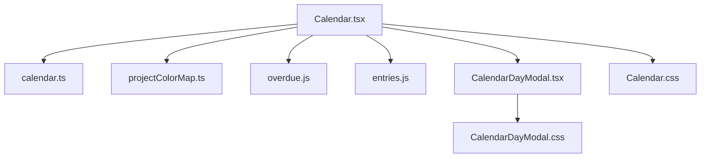
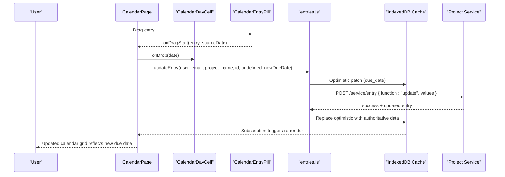
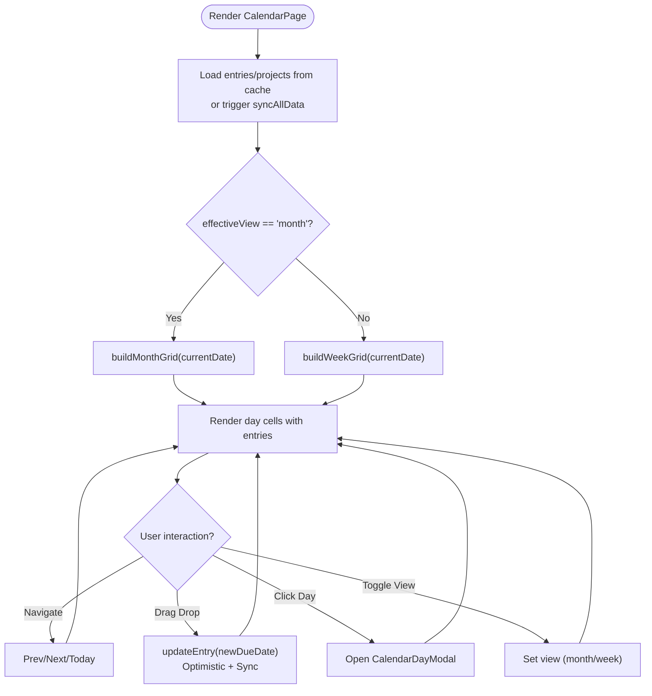
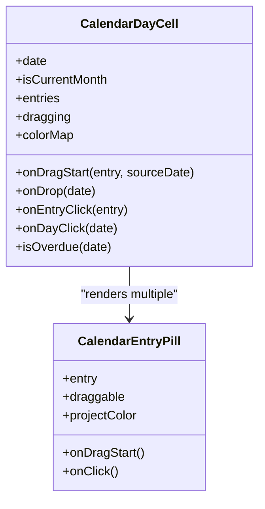
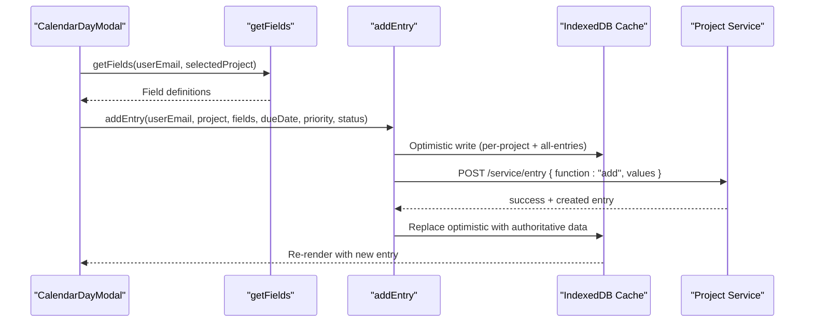
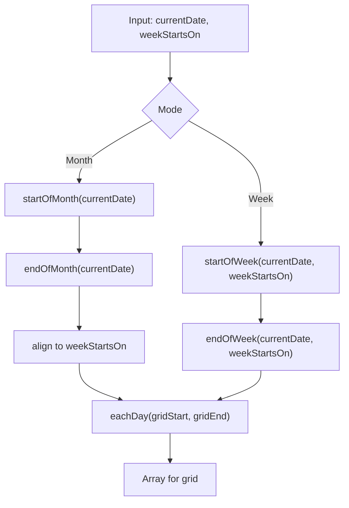
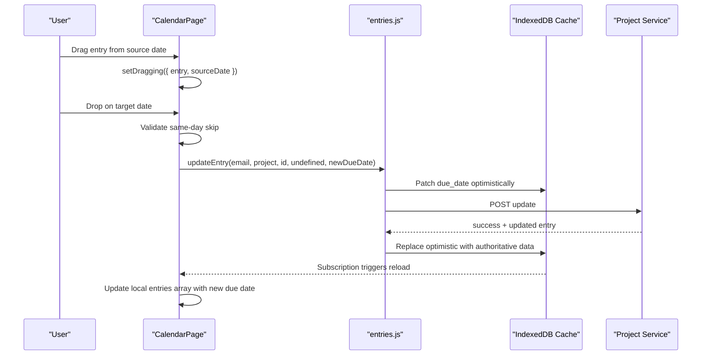
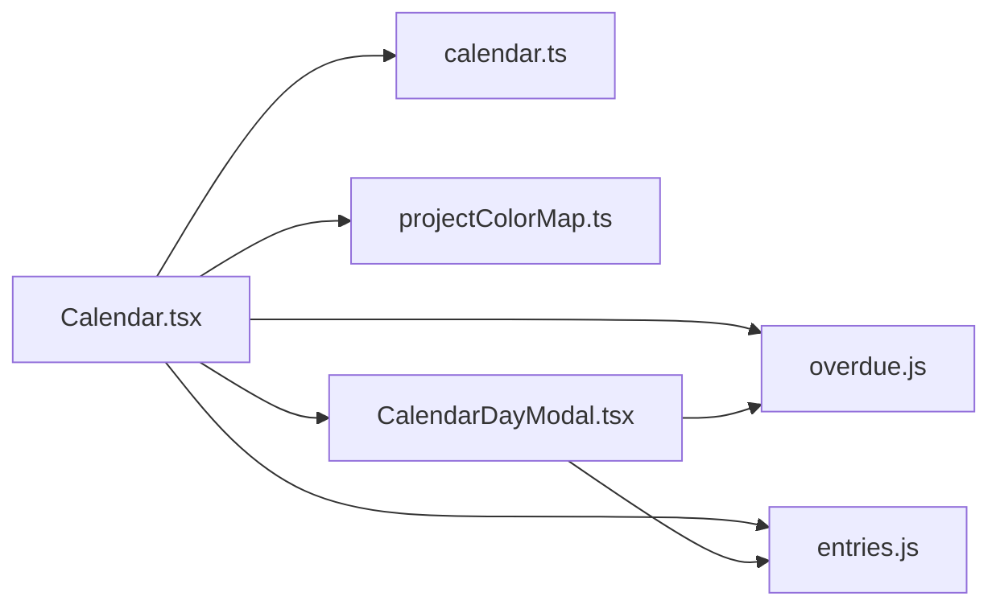

# Calendar View

<cite>
**Referenced Files in This Document**
- [Calendar.tsx](file://frontend/src/pages/Calendar.tsx)
- [Calendar.css](file://frontend/src/pages/Calendar.css)
- [CalendarDayModal.tsx](file://frontend/src/pages/CalendarDayModal.tsx)
- [CalendarDayModal.css](file://frontend/src/pages/CalendarDayModal.css)
- [calendar.ts](file://frontend/src/lib/calendar.ts)
- [projectColorMap.ts](file://frontend/src/lib/projectColorMap.ts)
- [overdue.js](file://frontend/src/functions/dashboard/overdue.js)
- [entries.js](file://frontend/src/functions/project/entries.js)
</cite>

## Table of Contents

1. Introduction
2. Project Structure
3. Core Components
4. Architecture Overview
5. Detailed Component Analysis
6. Dependency Analysis
7. Performance Considerations
8. Troubleshooting Guide
9. Conclusion
10. Appendices

## Introduction

This document explains Codacaine’s Calendar view implementation, focusing on the dual-mode calendar (month and week), responsive behavior that switches to week view on mobile, drag-and-drop rescheduling with full state management and database updates, overdue highlighting, compact day display with a “+more” button, and the CalendarDayModal for detailed day viewing. It also covers grid building functions, date navigation, project color mapping integration, performance optimizations for large datasets, keyboard accessibility, touch interactions, and responsive design considerations.

## Project Structure

The Calendar feature is implemented primarily in the following files:

- Page and UI logic: Calendar.tsx
- Styles: Calendar.css
- Day detail modal: CalendarDayModal.tsx and CalendarDayModal.css
- Date utilities and grid builders: calendar.ts
- Project color mapping: projectColorMap.ts
- Overdue detection: overdue.js
- Entry CRUD and optimistic caching: entries.js

**Diagram sources**

- [Calendar.tsx:1-516](file://frontend/src/pages/Calendar.tsx#L1-L516)
- [calendar.ts:1-158](file://frontend/src/lib/calendar.ts#L1-L158)
- [projectColorMap.ts:1-37](file://frontend/src/lib/projectColorMap.ts#L1-L37)
- [overdue.js:1-37](file://frontend/src/functions/dashboard/overdue.js#L1-L37)
- [entries.js:283-400](file://frontend/src/functions/project/entries.js#L283-L400)
- [CalendarDayModal.tsx:1-436](file://frontend/src/pages/CalendarDayModal.tsx#L1-L436)
- [Calendar.css:1-595](file://frontend/src/pages/Calendar.css#L1-L595)
- [CalendarDayModal.css:1-418](file://frontend/src/pages/CalendarDayModal.css#L1-L418)

**Section sources**

- [Calendar.tsx:1-516](file://frontend/src/pages/Calendar.tsx#L1-L516)
- [calendar.ts:1-158](file://frontend/src/lib/calendar.ts#L1-L158)
- [projectColorMap.ts:1-37](file://frontend/src/lib/projectColorMap.ts#L1-L37)
- [overdue.js:1-37](file://frontend/src/functions/dashboard/overdue.js#L1-L37)
- [entries.js:283-400](file://frontend/src/functions/project/entries.js#L283-L400)
- [CalendarDayModal.tsx:1-436](file://frontend/src/pages/CalendarDayModal.tsx#L1-L436)
- [Calendar.css:1-595](file://frontend/src/pages/Calendar.css#L1-L595)
- [CalendarDayModal.css:1-418](file://frontend/src/pages/CalendarDayModal.css#L1-L418)

## Core Components

- CalendarPage: Main container handling data loading, view mode, navigation, drag-and-drop, and rendering the month/week grid and day cells.
- CalendarDayCell: Renders each day cell, shows up to four tasks, handles drop targets, overdue styling, and opens the day modal.
- CalendarEntryPill: Draggable entry pill with project color accent, overdue/completed states, and keyboard support.
- CalendarDayModal: Modal for viewing all entries for a selected day, adding new entries with dynamic fields, due date, priority, and status.
- calendar.ts: Pure helpers for date math, grid generation, title extraction, and filtering entries by day.
- projectColorMap.ts: Builds a project name to color map and resolves colors for entries.
- overdue.js: Determines if an entry is overdue based on due date and status.
- entries.js: Optimistic update flow for changing due dates via drag-and-drop, including offline queuing and cache synchronization.

**Section sources**

- [Calendar.tsx:56-191](file://frontend/src/pages/Calendar.tsx#L56-L191)
- [Calendar.tsx:193-516](file://frontend/src/pages/Calendar.tsx#L193-L516)
- [calendar.ts:26-158](file://frontend/src/lib/calendar.ts#L26-L158)
- [projectColorMap.ts:1-37](file://frontend/src/lib/projectColorMap.ts#L1-L37)
- [overdue.js:1-37](file://frontend/src/functions/dashboard/overdue.js#L1-L37)
- [entries.js:283-400](file://frontend/src/functions/project/entries.js#L283-L400)
- [CalendarDayModal.tsx:86-436](file://frontend/src/pages/CalendarDayModal.tsx#L86-L436)

## Architecture Overview

The Calendar page orchestrates data fetching from IndexedDB cache, subscribes to changes, builds grids using pure date helpers, renders the appropriate view (month or week), and manages user interactions like navigation, dragging, and modal opening. Drag-and-drop triggers an optimistic update to the local cache and synchronizes with the server via the entries service. The CalendarDayModal provides a focused interface to add entries and view details for a specific day.

**Diagram sources**

- [Calendar.tsx:309-343](file://frontend/src/pages/Calendar.tsx#L309-L343)
- [entries.js:283-400](file://frontend/src/functions/project/entries.js#L283-L400)

**Section sources**

- [Calendar.tsx:193-516](file://frontend/src/pages/Calendar.tsx#L193-L516)
- [entries.js:283-400](file://frontend/src/functions/project/entries.js#L283-L400)

## Detailed Component Analysis

### CalendarPage

Responsibilities:

- Loads entries and projects from cache; triggers initial sync if empty.
- Persists view preference (month/week) in localStorage.
- Forces week view on mobile devices via responsive hook.
- Builds grid arrays using buildMonthGrid/buildWeekGrid and computes header days.
- Handles navigation (prev/next/today) and view toggling.
- Manages drag-and-drop state and performs rescheduling with optimistic updates.
- Opens CalendarDayModal for day details and adds entries.

Key behaviors:

- Responsive view: effectiveView becomes 'week' when viewport width ≤ 480px.
- Compact day display: only first 4 entries shown per cell; “+more” button opens the day modal.
- Overdue highlighting: days before today are visually marked; entries marked overdue via overdue utility.
- Project color accents: left border color applied per project using projectColorMap.

**Diagram sources**

- [Calendar.tsx:280-307](file://frontend/src/pages/Calendar.tsx#L280-L307)
- [Calendar.tsx:309-343](file://frontend/src/pages/Calendar.tsx#L309-L343)
- [Calendar.tsx:345-359](file://frontend/src/pages/Calendar.tsx#L345-L359)
- [Calendar.tsx:367-516](file://frontend/src/pages/Calendar.tsx#L367-L516)

**Section sources**

- [Calendar.tsx:193-516](file://frontend/src/pages/Calendar.tsx#L193-L516)

### CalendarDayCell and CalendarEntryPill

- CalendarDayCell:
  - Displays up to 4 entries per day; hides extras behind “+more”.
  - Highlights drop target during drag operations.
  - Applies overdue styling to the day cell.
  - Forwards clicks to open the day modal or entry click to navigate to project.
- CalendarEntryPill:
  - Draggable with effectAllowed set to move; stores entry id in drag data.
  - Shows completed and overdue styles; applies project color accent.
  - Keyboard accessible: Enter/Space triggers click.

**Diagram sources**

- [Calendar.tsx:56-191](file://frontend/src/pages/Calendar.tsx#L56-L191)

**Section sources**

- [Calendar.tsx:56-191](file://frontend/src/pages/Calendar.tsx#L56-L191)

### CalendarDayModal

Responsibilities:

- Displays all entries for a selected day with status indicators and overdue/completed styling.
- Provides an add-entry form with dynamic fields fetched from the project schema.
- Supports due date selection, priority, and status configuration.
- Validates required fields and submits via addEntry with optimistic updates.
- Closes on backdrop click or Escape key; supports keyboard navigation.

**Diagram sources**

- [CalendarDayModal.tsx:124-215](file://frontend/src/pages/CalendarDayModal.tsx#L124-L215)
- [entries.js:129-215](file://frontend/src/functions/project/entries.js#L129-L215)

**Section sources**

- [CalendarDayModal.tsx:86-436](file://frontend/src/pages/CalendarDayModal.tsx#L86-L436)
- [entries.js:129-215](file://frontend/src/functions/project/entries.js#L129-L215)

### Grid Building Functions (buildMonthGrid, buildWeekGrid)

- buildMonthGrid: Computes the visible grid for a month by finding the start/end of the month and aligning to the configured week start day, then enumerating each day in that range.
- buildWeekGrid: Computes the seven-day range around the current date aligned to the week start day.
- Helpers used: startOfWeek, endOfWeek, startOfMonth, endOfMonth, eachDay, formatShortDay, formatDayNumber, parseDueDate, getEntriesForDay.

**Diagram sources**

- [calendar.ts:38-82](file://frontend/src/lib/calendar.ts#L38-L82)
- [calendar.ts:145-158](file://frontend/src/lib/calendar.ts#L145-L158)

**Section sources**

- [calendar.ts:26-158](file://frontend/src/lib/calendar.ts#L26-L158)

### Date Navigation Controls

- Previous/Next buttons adjust the current date by one month (month view) or one week (week view).
- Today button resets to the current date.
- Header displays formatted month/year; weekday headers show short day names.

**Section sources**

- [Calendar.tsx:297-307](file://frontend/src/pages/Calendar.tsx#L297-L307)
- [Calendar.tsx:457-461](file://frontend/src/pages/Calendar.tsx#L457-L461)

### Project Color Mapping Integration

- buildProjectColorMap creates a map from project names to their custom colors.
- resolveProjectColor returns the project color or a deterministic fallback hash-based color.
- Applied as left border color on entry pills and modal entries for visual distinction.

**Section sources**

- [projectColorMap.ts:1-37](file://frontend/src/lib/projectColorMap.ts#L1-L37)
- [Calendar.tsx:116-127](file://frontend/src/pages/Calendar.tsx#L116-L127)
- [CalendarDayModal.tsx:258-275](file://frontend/src/pages/CalendarDayModal.tsx#L258-L275)

### Overdue Highlighting System

- Day-level overdue: days prior to today receive a distinct border style.
- Entry-level overdue: entries where due_date has passed and status is not completed are highlighted with red accents and strikethrough in some contexts.
- Uses isOverdue from overdue.js which considers due date and status.

**Section sources**

- [Calendar.tsx:291-295](file://frontend/src/pages/Calendar.tsx#L291-L295)
- [Calendar.tsx:159-169](file://frontend/src/pages/Calendar.tsx#L159-L169)
- [overdue.js:1-37](file://frontend/src/functions/dashboard/overdue.js#L1-L37)

### Compact Day Display and “+more” Button

- Each day cell shows at most four entries; additional items are hidden.
- A “+more” button appears when there are hidden entries; clicking it opens the CalendarDayModal for that day.

**Section sources**

- [Calendar.tsx:81-83](file://frontend/src/pages/Calendar.tsx#L81-L83)
- [Calendar.tsx:128-140](file://frontend/src/pages/Calendar.tsx#L128-L140)
- [Calendar.tsx:349-351](file://frontend/src/pages/Calendar.tsx#L349-L351)

### Drag-and-Drop Rescheduling: State Management, Drop Targets, Database Updates

- Drag state:
  - dragging holds the entry being dragged and its source date.
  - When dragging starts, effectAllowed is set to move and entry id is stored in drag data.
- Drop target handling:
  - Days accept drops; on drop, the target date is compared to the original due date to avoid no-op updates.
- Database updates:
  - updateEntry performs an optimistic patch to IndexedDB caches (both per-project and all-entries), then synchronizes with the server.
  - On success, the server response replaces the optimistic entry; on failure, the action is queued for retry when online.
  - The CalendarPage updates local state immediately after successful update to reflect changes without waiting for subscription.

**Diagram sources**

- [Calendar.tsx:309-343](file://frontend/src/pages/Calendar.tsx#L309-L343)
- [entries.js:283-400](file://frontend/src/functions/project/entries.js#L283-L400)

**Section sources**

- [Calendar.tsx:309-343](file://frontend/src/pages/Calendar.tsx#L309-L343)
- [entries.js:283-400](file://frontend/src/functions/project/entries.js#L283-L400)

### Keyboard Accessibility and Touch Interactions

- Keyboard:
  - Entry pills are focusable and respond to Enter/Space to open project details.
  - Modal closes on Escape; backdrops close on click.
  - Form inputs use standard semantics and labels for screen readers.
- Touch:
  - Mobile breakpoint forces week view; grid scrolls horizontally on small screens.
  - Drag-and-drop uses native HTML5 drag events; touch drag behavior depends on platform support.
  - Modal adapts to bottom sheet style on small screens for better touch ergonomics.

**Section sources**

- [Calendar.tsx:179-183](file://frontend/src/pages/Calendar.tsx#L179-L183)
- [CalendarDayModal.tsx:115-122](file://frontend/src/pages/CalendarDayModal.tsx#L115-L122)
- [Calendar.css:470-595](file://frontend/src/pages/Calendar.css#L470-L595)
- [CalendarDayModal.css:381-418](file://frontend/src/pages/CalendarDayModal.css#L381-L418)

### Responsive Design Considerations

- Mobile breakpoint at 480px:
  - Forces week view regardless of saved preference.
  - Hides view toggle controls; presents a horizontal scrollable week strip.
  - Reduces padding, font sizes, and hides non-essential text to fit compact layouts.
- Medium screens (up to 768px):
  - Adjusts toolbar layout, grid gaps, and entry visibility.
- Modal:
  - On small screens, modal becomes a bottom sheet with full-width and reduced max-height.

**Section sources**

- [Calendar.tsx:33-45](file://frontend/src/pages/Calendar.tsx#L33-L45)
- [Calendar.tsx:204-215](file://frontend/src/pages/Calendar.tsx#L204-L215)
- [Calendar.css:376-595](file://frontend/src/pages/Calendar.css#L376-L595)
- [CalendarDayModal.css:381-418](file://frontend/src/pages/CalendarDayModal.css#L381-L418)

## Dependency Analysis

- CalendarPage depends on:
  - calendar.ts for date/grid utilities.
  - projectColorMap.ts for project color resolution.
  - overdue.js for overdue checks.
  - entries.js for updating due dates and optimistic caching.
  - CalendarDayModal.tsx for day detail and entry creation.
  - CSS modules for styling and responsive behavior.
- CalendarDayModal depends on:
  - entries.js for adding entries.
  - project field retrieval for dynamic forms.
  - overdue.js for overdue status display.

**Diagram sources**

- [Calendar.tsx:1-28](file://frontend/src/pages/Calendar.tsx#L1-L28)
- [CalendarDayModal.tsx:1-6](file://frontend/src/pages/CalendarDayModal.tsx#L1-L6)
- [entries.js:129-215](file://frontend/src/functions/project/entries.js#L129-L215)
- [overdue.js:1-37](file://frontend/src/functions/dashboard/overdue.js#L1-L37)
- [projectColorMap.ts:1-37](file://frontend/src/lib/projectColorMap.ts#L1-L37)
- [calendar.ts:1-158](file://frontend/src/lib/calendar.ts#L1-L158)

**Section sources**

- [Calendar.tsx:1-28](file://frontend/src/pages/Calendar.tsx#L1-L28)
- [CalendarDayModal.tsx:1-6](file://frontend/src/pages/CalendarDayModal.tsx#L1-L6)
- [entries.js:129-215](file://frontend/src/functions/project/entries.js#L129-L215)
- [overdue.js:1-37](file://frontend/src/functions/dashboard/overdue.js#L1-L37)
- [projectColorMap.ts:1-37](file://frontend/src/lib/projectColorMap.ts#L1-L37)
- [calendar.ts:1-158](file://frontend/src/lib/calendar.ts#L1-L158)

## Performance Considerations

- Data loading:
  - Reads from IndexedDB cache; triggers initial sync only if cache is empty.
  - Subscribes to cache changes to re-render efficiently without redundant network calls.
  - Guards against overlapping load calls using a sequence ref to prevent race conditions.
- Rendering:
  - Uses useMemo for grid calculations and color map to avoid recomputation on every render.
  - Limits visible entries per day to four to reduce DOM size and improve scrolling performance.
- Network:
  - Optimistic updates provide immediate UI feedback; background sync ensures consistency.
  - Offline queueing ensures updates are retried when connectivity resumes.
- Responsiveness:
  - Enforces week view on mobile to minimize layout complexity and improve touch interactions.

[No sources needed since this section provides general guidance]

## Troubleshooting Guide

Common issues and resolutions:

- Entries not updating after drag-and-drop:
  - Check that the target date differs from the original due date; same-day drops are skipped intentionally.
  - Verify server response and ensure cache subscriptions are active; errors will be displayed in the error banner.
- Modal not closing:
  - Ensure Escape key handler is attached; verify backdrop click handler is bound.
- Dynamic fields not loading:
  - Confirm project selection and user email are present; check getFields call and error handling.
- Overdue visuals not appearing:
  - Ensure due_date is valid and status is not completed; verify isOverdue logic and date parsing.

**Section sources**

- [Calendar.tsx:313-343](file://frontend/src/pages/Calendar.tsx#L313-L343)
- [CalendarDayModal.tsx:115-122](file://frontend/src/pages/CalendarDayModal.tsx#L115-L122)
- [CalendarDayModal.tsx:124-156](file://frontend/src/pages/CalendarDayModal.tsx#L124-L156)
- [overdue.js:1-37](file://frontend/src/functions/dashboard/overdue.js#L1-L37)

## Conclusion

Codacaine’s Calendar view delivers a robust, responsive scheduling experience with dual month/week modes, intuitive drag-and-drop rescheduling, clear overdue indicators, and a comprehensive day modal for managing entries. The implementation emphasizes performance through caching and optimistic updates, accessibility via keyboard support, and adaptability across device sizes. The modular architecture separates concerns between UI, date utilities, and data services, enabling maintainability and scalability.

[No sources needed since this section summarizes without analyzing specific files]

## Appendices

### Key Implementation Details Summary

- Dual-mode calendar:
  - Month view: builds a full month grid aligned to the configured week start.
  - Week view: builds a seven-day grid; forced on mobile for usability.
- Drag-and-drop rescheduling:
  - Full state management for dragging; drop target validation; optimistic updates; server sync; cache replacement.
- Overdue highlighting:
  - Day-level and entry-level overdue styles based on due date and status.
- Compact day display:
  - Shows up to four entries per day; “+more” button opens the day modal.
- CalendarDayModal:
  - Lists all entries for a day; supports adding new entries with dynamic fields, due date, priority, and status.
- Grid building:
  - Pure functions compute grid ranges and enumerate days; helpers handle date arithmetic and formatting.
- Project color mapping:
  - Maps project names to colors; applies accents to entry pills and modal entries.
- Performance:
  - IndexedDB caching, subscription-driven re-renders, memoization, and offline queueing.
- Accessibility and responsiveness:
  - Keyboard navigation, modal dismissal via Escape/backdrop, and mobile-first responsive styles.

[No sources needed since this section aggregates previously analyzed content]
