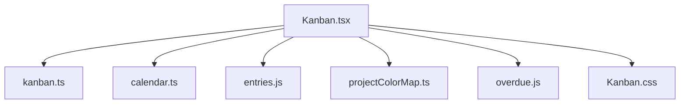
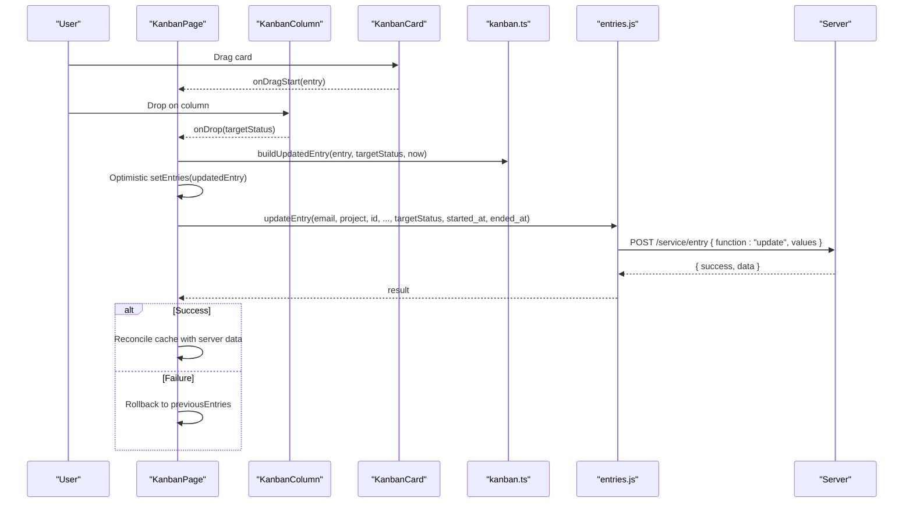
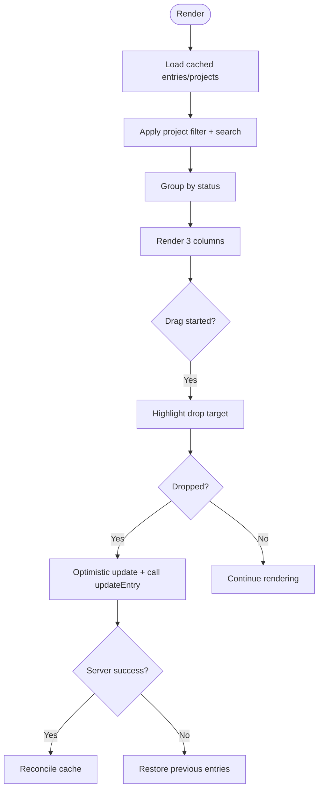
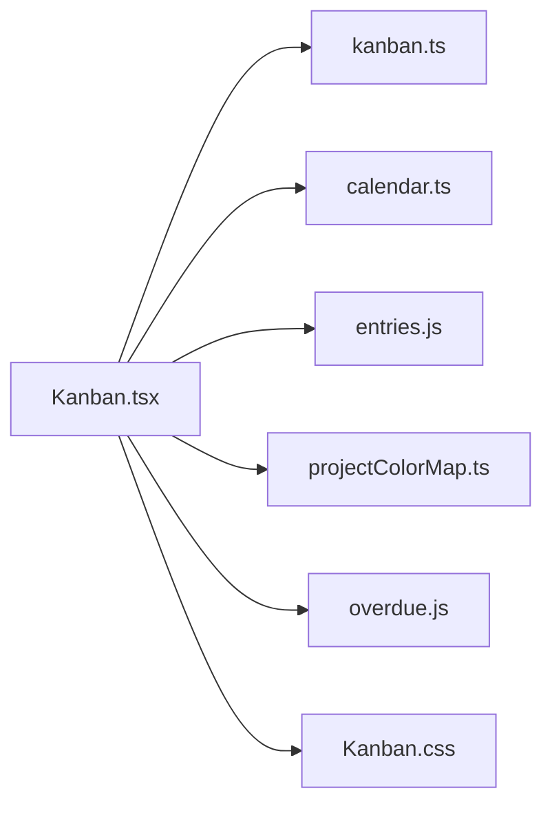

# Kanban Board

<cite>
**Referenced Files in This Document**
- [Kanban.tsx](file://frontend/src/pages/Kanban.tsx)
- [Kanban.css](file://frontend/src/pages/Kanban.css)
- [kanban.ts](file://frontend/src/lib/kanban.ts)
- [calendar.ts](file://frontend/src/lib/calendar.ts)
- [entries.js](file://frontend/src/functions/project/entries.js)
- [projectColorMap.ts](file://frontend/src/lib/projectColorMap.ts)
- [overdue.js](file://frontend/src/functions/dashboard/overdue.js)
</cite>

## Table of Contents

1. [Introduction](#introduction)
2. [Project Structure](#project-structure)
3. [Core Components](#core-components)
4. [Architecture Overview](#architecture-overview)
5. [Detailed Component Analysis](#detailed-component-analysis)
6. [Dependency Analysis](#dependency-analysis)
7. [Performance Considerations](#performance-considerations)
8. [Troubleshooting Guide](#troubleshooting-guide)
9. [Conclusion](#conclusion)

## Introduction

This document explains Codacaine’s Kanban board implementation, focusing on the three-column workflow (Up Next, In Motion, Done & Dusted), drag-and-drop status changes, visual project indicators, filtering, responsive layout, entry cards, real-time updates, performance considerations, user interactions, keyboard navigation, and accessibility features.

## Project Structure

The Kanban feature is implemented as a React page with supporting utilities:

- Page component renders columns, toolbar, and cards
- Utility module defines statuses, grouping, filtering, and timestamp logic
- Calendar helpers provide title parsing and due date handling
- Entries API functions handle optimistic updates and server sync
- Color map utility resolves per-project accent colors
- Overdue helper marks overdue items visually

**Diagram sources**

- [Kanban.tsx:1-407](file://frontend/src/pages/Kanban.tsx#L1-L407)
- [kanban.ts:1-130](file://frontend/src/lib/kanban.ts#L1-L130)
- [calendar.ts:1-158](file://frontend/src/lib/calendar.ts#L1-L158)
- [entries.js:1-596](file://frontend/src/functions/project/entries.js#L1-L596)
- [projectColorMap.ts:1-37](file://frontend/src/lib/projectColorMap.ts#L1-L37)
- [overdue.js:1-37](file://frontend/src/functions/dashboard/overdue.js#L1-L37)
- [Kanban.css:1-393](file://frontend/src/pages/Kanban.css#L1-L393)

**Section sources**

- [Kanban.tsx:1-407](file://frontend/src/pages/Kanban.tsx#L1-L407)
- [Kanban.css:1-393](file://frontend/src/pages/Kanban.css#L1-L393)

## Core Components

- KanbanPage: Orchestrates data loading, filtering, grouping, drag-and-drop state, and rendering
- KanbanColumn: Renders a column header, count, and card list; handles drop target highlighting
- KanbanCard: Displays task title, project name, due date, priority badge, and project color accent; supports drag start and keyboard activation
- Utilities: Status labels/ordering, filtering by project/search, grouping by status, timestamp computation for status transitions, due date sorting, overdue detection

Key responsibilities:

- Three-column workflow: Up Next, In Motion, Done & Dusted
- Drag-and-drop to change status
- Real-time UI updates via optimistic state and cache subscriptions
- Visual indicators: project color accents, overdue highlights, priority badges
- Filtering: by project and free-text search
- Responsive layout: grid collapses to single column on small screens

**Section sources**

- [Kanban.tsx:35-144](file://frontend/src/pages/Kanban.tsx#L35-L144)
- [kanban.ts:3-18](file://frontend/src/lib/kanban.ts#L3-L18)
- [kanban.ts:29-68](file://frontend/src/lib/kanban.ts#L29-L68)
- [overdue.js:1-37](file://frontend/src/functions/dashboard/overdue.js#L1-L37)
- [projectColorMap.ts:1-37](file://frontend/src/lib/projectColorMap.ts#L1-L37)

## Architecture Overview

The Kanban board uses a local-first approach:

- Data is loaded from IndexedDB cache and subscribed to for live updates
- Dragging a card triggers an optimistic update in memory and cache, then persists to the server
- On success, cache is reconciled with authoritative server data; on failure, previous state is restored
- Columns are grouped and filtered client-side for instant responsiveness

**Diagram sources**

- [Kanban.tsx:246-286](file://frontend/src/pages/Kanban.tsx#L246-L286)
- [kanban.ts:75-106](file://frontend/src/lib/kanban.ts#L75-L106)
- [entries.js:287-448](file://frontend/src/functions/project/entries.js#L287-L448)

**Section sources**

- [Kanban.tsx:146-286](file://frontend/src/pages/Kanban.tsx#L146-L286)
- [entries.js:287-448](file://frontend/src/functions/project/entries.js#L287-L448)

## Detailed Component Analysis

### KanbanPage

- Loads entries and projects from cache, subscribes to cache changes for real-time updates
- Maintains filter state (project, search query) and dragging/updating states
- Computes filtered and grouped entries using memoized functions
- Handles drag-and-drop: sets dragging entry, builds updated entry, optimistically updates UI, calls updateEntry, and rolls back on error
- Renders toolbar with project filter, search input, and clear filters button
- Shows loading spinner, empty state, error banner, and updating toast

**Diagram sources**

- [Kanban.tsx:165-244](file://frontend/src/pages/Kanban.tsx#L165-L244)
- [Kanban.tsx:246-286](file://frontend/src/pages/Kanban.tsx#L246-L286)

**Section sources**

- [Kanban.tsx:146-286](file://frontend/src/pages/Kanban.tsx#L146-L286)
- [Kanban.tsx:292-406](file://frontend/src/pages/Kanban.tsx#L292-L406)

### KanbanColumn

- Receives status, entries, dragging reference, and callbacks
- Prevents default drag behavior and forwards drop to parent
- Highlights itself as a drop target when a different-status entry is being dragged
- Renders header with status label and count, and maps entries to cards

**Section sources**

- [Kanban.tsx:88-144](file://frontend/src/pages/Kanban.tsx#L88-L144)

### KanbanCard

- Displays title, project name, due date, and priority badge
- Applies overdue styling and priority classes
- Supports drag start by setting effectAllowed and carrying entry id
- Keyboard accessible: role="button", tabIndex, Enter/Space activation
- Adds left border accent based on project color

**Section sources**

- [Kanban.tsx:35-86](file://frontend/src/pages/Kanban.tsx#L35-L86)
- [projectColorMap.ts:30-36](file://frontend/src/lib/projectColorMap.ts#L30-L36)

### Status and Grouping Utilities

- Defines EntryStatus type, labels, and order
- Normalizes entry status to one of the three columns
- Filters entries by project and search query
- Groups entries into the three columns
- Computes timestamps for status transitions (started_at, ended_at)
- Sorts entries by due date ascending

**Section sources**

- [kanban.ts:3-18](file://frontend/src/lib/kanban.ts#L3-L18)
- [kanban.ts:22-26](file://frontend/src/lib/kanban.ts#L22-L26)
- [kanban.ts:29-68](file://frontend/src/lib/kanban.ts#L29-L68)
- [kanban.ts:75-106](file://frontend/src/lib/kanban.ts#L75-L106)
- [kanban.ts:112-129](file://frontend/src/lib/kanban.ts#L112-L129)

### Data Persistence and Real-Time Updates

- Uses cacheGet to read from IndexedDB and cacheSubscribe to re-render on changes
- Optimistic updates patch both per-project and all-entries caches immediately
- updateEntry sends PATCH-like request to server; on success, cache is reconciled with server data; on failure, queued for retry or rollback applied in UI
- Guard against overlapping loadData calls ensures consistent state across multiple triggers (mount, cache subscribers, SSE, visibilitychange)

**Section sources**

- [Kanban.tsx:165-233](file://frontend/src/pages/Kanban.tsx#L165-L233)
- [entries.js:287-448](file://frontend/src/functions/project/entries.js#L287-L448)

### Visual Project Indicators

- Builds a project-name to color map from cached projects
- Resolves each card’s left border color using custom project color or hash-based fallback
- Column headers use status-specific color accents for quick scanning

**Section sources**

- [projectColorMap.ts:1-37](file://frontend/src/lib/projectColorMap.ts#L1-L37)
- [Kanban.css:168-219](file://frontend/src/pages/Kanban.css#L168-L219)

### Filtering and Search

- Project filter dropdown populated from cached projects
- Free-text search matches against entry titles and project names
- Clear filters button resets both filters

**Section sources**

- [Kanban.tsx:308-350](file://frontend/src/pages/Kanban.tsx#L308-L350)
- [kanban.ts:29-52](file://frontend/src/lib/kanban.ts#L29-L52)

### Responsive Layout

- Desktop: three-column grid
- Tablet/mobile: single column stack; toolbar stacks vertically; reduced padding and font sizes

**Section sources**

- [Kanban.css:129-134](file://frontend/src/pages/Kanban.css#L129-L134)
- [Kanban.css:344-392](file://frontend/src/pages/Kanban.css#L344-L392)

### Entry Cards Details

- Title derived from summary or structured entries fields
- Due date formatted short and highlighted if overdue
- Priority badge with color-coded classes for urgent/high/low
- Project name shown with truncation

**Section sources**

- [calendar.ts:109-143](file://frontend/src/lib/calendar.ts#L109-L143)
- [overdue.js:1-37](file://frontend/src/functions/dashboard/overdue.js#L1-L37)
- [Kanban.tsx:23-33](file://frontend/src/pages/Kanban.tsx#L23-L33)
- [Kanban.tsx:69-83](file://frontend/src/pages/Kanban.tsx#L69-L83)

## Dependency Analysis

**Diagram sources**

- [Kanban.tsx:1-22](file://frontend/src/pages/Kanban.tsx#L1-L22)
- [kanban.ts:1-18](file://frontend/src/lib/kanban.ts#L1-L18)
- [calendar.ts:1-24](file://frontend/src/lib/calendar.ts#L1-L24)
- [entries.js:1-5](file://frontend/src/functions/project/entries.js#L1-L5)
- [projectColorMap.ts:1-8](file://frontend/src/lib/projectColorMap.ts#L1-L8)
- [overdue.js:1-8](file://frontend/src/functions/dashboard/overdue.js#L1-L8)
- [Kanban.css:1-6](file://frontend/src/pages/Kanban.css#L1-L6)

**Section sources**

- [Kanban.tsx:1-22](file://frontend/src/pages/Kanban.tsx#L1-L22)

## Performance Considerations

- Local-first caching: reads from IndexedDB and subscribes to changes to avoid unnecessary network requests
- Memoization: useMemo for filtered/grouped entries and color map reduces recomputation
- Optimistic UI: immediate state update before server confirmation improves perceived performance
- Overlap guard: loadSeq ref prevents race conditions from concurrent loads
- Efficient filtering: simple string includes checks for search; project filter exact match
- No virtualization currently: consider virtualization for very large datasets to limit DOM nodes

[No sources needed since this section provides general guidance]

## Troubleshooting Guide

Common issues and where to look:

- Drag-and-drop does not change status: verify drag start sets dataTransfer and that drop handler calls onDrop; check console for errors during updateEntry
- Status reverts after move: indicates server update failed; UI restores previousEntries; inspect error message in banner
- Entries not appearing: ensure cache has data; first visit triggers initial sync; confirm cacheSubscribe listeners are active
- Overdue not highlighted: ensure due_date is valid and status is not done_and_dusted; check overdue helper logic
- Project color not showing: confirm projects cache contains project_color; resolveProjectColor falls back to hash-based color

**Section sources**

- [Kanban.tsx:250-286](file://frontend/src/pages/Kanban.tsx#L250-L286)
- [entries.js:287-448](file://frontend/src/functions/project/entries.js#L287-L448)
- [overdue.js:1-37](file://frontend/src/functions/dashboard/overdue.js#L1-L37)

## Conclusion

Codacaine’s Kanban board delivers a responsive, accessible, and performant three-column workflow with drag-and-drop status changes, visual project indicators, filtering, and real-time updates powered by local-first caching and optimistic UI. The implementation balances simplicity with robustness, providing clear feedback and recovery paths for network failures while maintaining a smooth user experience across devices.

[No sources needed since this section summarizes without analyzing specific files]
