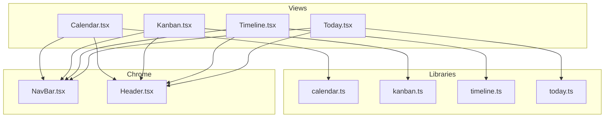
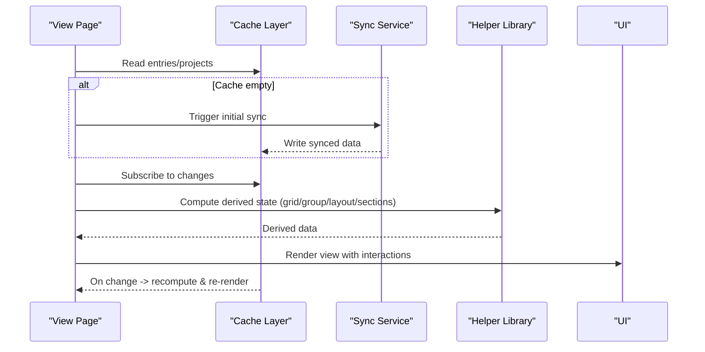
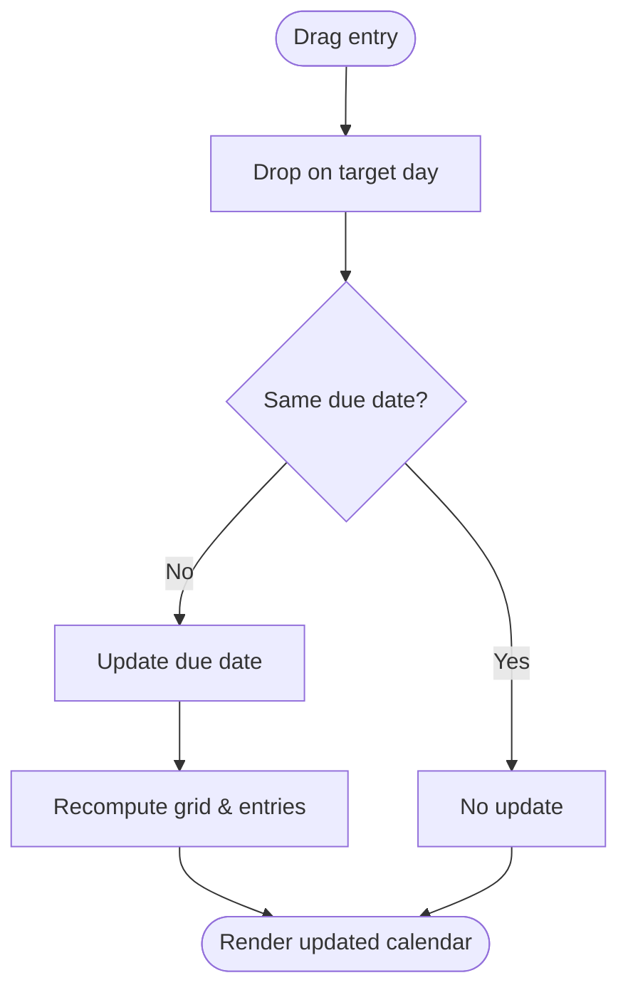
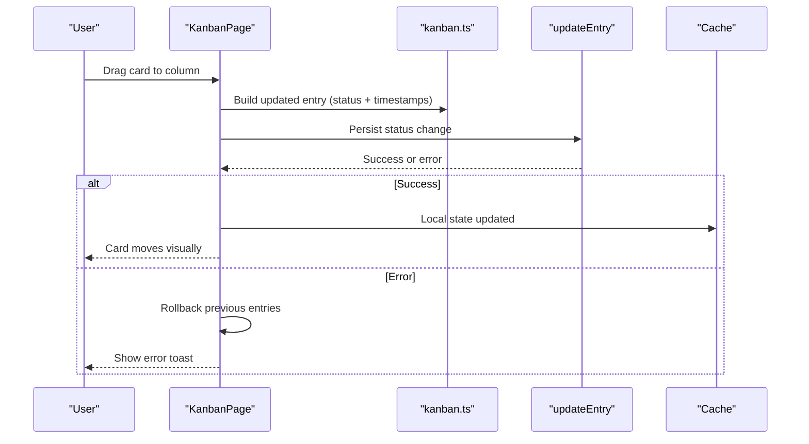
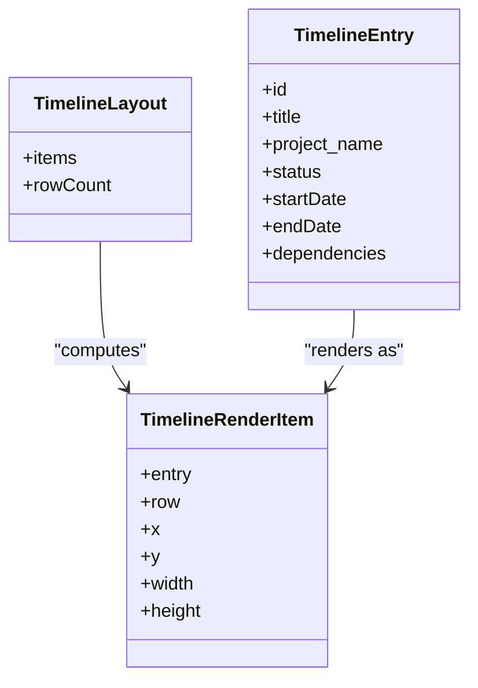
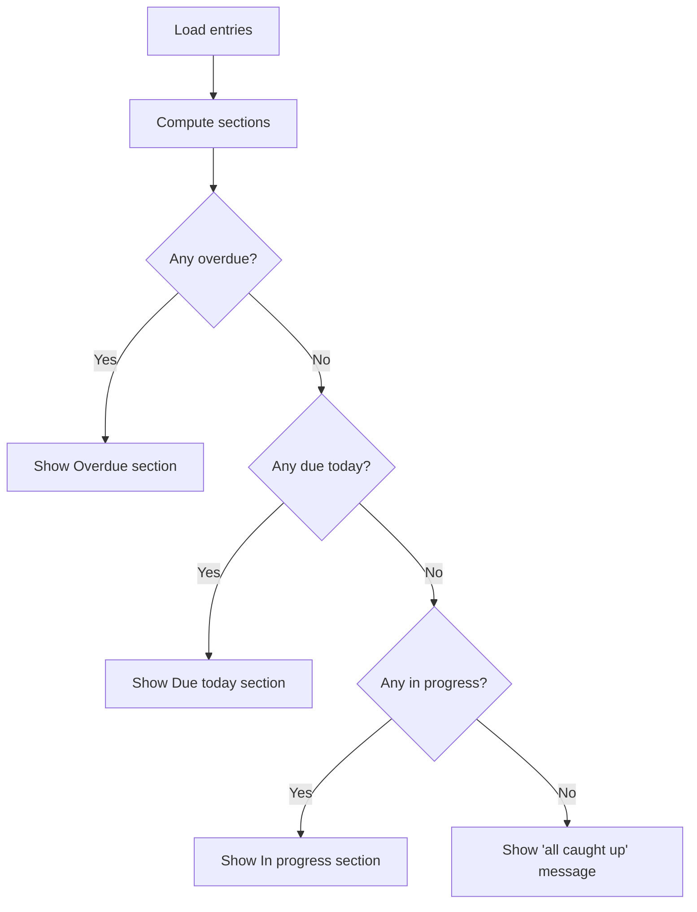
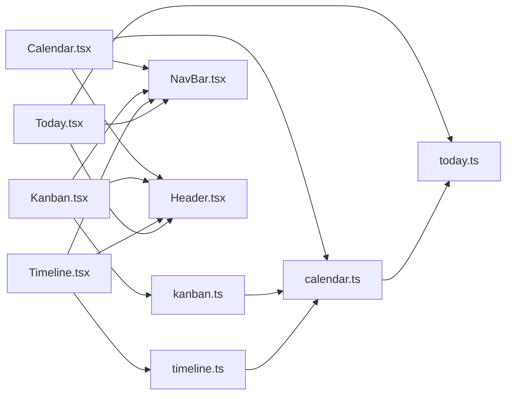

# Task Management Views

<cite>
**Referenced Files in This Document**
- [Calendar.tsx](file://frontend/src/pages/Calendar.tsx)
- [Calendar.css](file://frontend/src/pages/Calendar.css)
- [calendar.ts](file://frontend/src/lib/calendar.ts)
- [Kanban.tsx](file://frontend/src/pages/Kanban.tsx)
- [Kanban.css](file://frontend/src/pages/Kanban.css)
- [kanban.ts](file://frontend/src/lib/kanban.ts)
- [Timeline.tsx](file://frontend/src/pages/Timeline.tsx)
- [Timeline.css](file://frontend/src/pages/Timeline.css)
- [timeline.ts](file://frontend/src/lib/timeline.ts)
- [Today.tsx](file://frontend/src/pages/Today.tsx)
- [Today.css](file://frontend/src/pages/Today.css)
- [today.ts](file://frontend/src/lib/today.ts)
- [NavBar.tsx](file://frontend/src/components/NavBar.tsx)
- [Header.tsx](file://frontend/src/components/Header.tsx)
</cite>

## Table of Contents

1. [Introduction](#introduction)
2. [Project Structure](#project-structure)
3. [Core Components](#core-components)
4. [Architecture Overview](#architecture-overview)
5. [Detailed Component Analysis](#detailed-component-analysis)
6. [Dependency Analysis](#dependency-analysis)
7. [Performance Considerations](#performance-considerations)
8. [Troubleshooting Guide](#troubleshooting-guide)
9. [Conclusion](#conclusion)

## Introduction

This document explains Codacaine’s multi-view task management system with a focus on four primary views: Calendar, Kanban, Timeline, and Today. It covers how each view presents data, supports user interactions such as drag-and-drop rescheduling and status changes, highlights overdue items, and adapts to different screen sizes. It also documents the underlying libraries that compute grids, groupings, timelines, and sections, along with performance strategies for large datasets and responsive design considerations.

## Project Structure

The views are implemented as React pages under frontend/src/pages, with shared logic in frontend/src/lib and shared chrome (navigation and header) in frontend/src/components. Each view reads from a local cache layer and subscribes to updates to keep the UI consistent without unnecessary network calls.

**Diagram sources**

- [Calendar.tsx:1-516](file://frontend/src/pages/Calendar.tsx#L1-L516)
- [Kanban.tsx:1-407](file://frontend/src/pages/Kanban.tsx#L1-L407)
- [Timeline.tsx:1-398](file://frontend/src/pages/Timeline.tsx#L1-L398)
- [Today.tsx:1-275](file://frontend/src/pages/Today.tsx#L1-L275)
- [calendar.ts:1-158](file://frontend/src/lib/calendar.ts#L1-L158)
- [kanban.ts:1-130](file://frontend/src/lib/kanban.ts#L1-L130)
- [timeline.ts:1-276](file://frontend/src/lib/timeline.ts#L1-L276)
- [today.ts:1-98](file://frontend/src/lib/today.ts#L1-L98)
- [NavBar.tsx:1-607](file://frontend/src/components/NavBar.tsx#L1-L607)
- [Header.tsx:1-106](file://frontend/src/components/Header.tsx#L1-L106)

**Section sources**

- [Calendar.tsx:1-516](file://frontend/src/pages/Calendar.tsx#L1-L516)
- [Kanban.tsx:1-407](file://frontend/src/pages/Kanban.tsx#L1-L407)
- [Timeline.tsx:1-398](file://frontend/src/pages/Timeline.tsx#L1-L398)
- [Today.tsx:1-275](file://frontend/src/pages/Today.tsx#L1-L275)
- [NavBar.tsx:1-607](file://frontend/src/components/NavBar.tsx#L1-L607)
- [Header.tsx:1-106](file://frontend/src/components/Header.tsx#L1-L106)

## Core Components

- Calendar view: month and week modes, compact day display, drag-and-drop rescheduling, overdue highlighting, project color indicators.
- Kanban board: three-column workflow (Up Next, In Motion, Done), drag-and-drop status changes, filtering by project and search text, visual project indicators.
- Timeline view: dependency tracking, zoom controls, SVG-based bars, timeline navigation via grid lines and today marker.
- Today view: immediate task completion focus, sections for overdue, due today, and in progress; quick entry via navigation to dashboard or project detail.

**Section sources**

- [Calendar.tsx:193-516](file://frontend/src/pages/Calendar.tsx#L193-L516)
- [Kanban.tsx:146-407](file://frontend/src/pages/Kanban.tsx#L146-L407)
- [Timeline.tsx:78-398](file://frontend/src/pages/Timeline.tsx#L78-L398)
- [Today.tsx:119-275](file://frontend/src/pages/Today.tsx#L119-L275)

## Architecture Overview

Each view follows a consistent pattern:

- Load entries and projects from IndexedDB cache; if empty, trigger initial sync.
- Subscribe to cache updates to refresh the UI when data changes.
- Compute derived data using pure helpers (calendar grids, kanban grouping, timeline layout, today sections).
- Render interactive UI with drag-and-drop, filters, and navigation.

**Diagram sources**

- [Calendar.tsx:220-278](file://frontend/src/pages/Calendar.tsx#L220-L278)
- [Kanban.tsx:165-233](file://frontend/src/pages/Kanban.tsx#L165-L233)
- [Timeline.tsx:120-163](file://frontend/src/pages/Timeline.tsx#L120-L163)
- [Today.tsx:135-185](file://frontend/src/pages/Today.tsx#L135-L185)

## Detailed Component Analysis

### Calendar View

- Modes: Month and Week, persisted in localStorage and forced to week on mobile.
- Grid generation: Pure functions build month or week grids and map entries per day.
- Drag-and-drop rescheduling: Entries are draggable; dropping onto a day updates the due date via an update function and immediately reflects in the UI.
- Overdue highlighting: Days and entries are highlighted based on current date and status.
- Compact day display: Limited visible tasks per cell with a “more” button to open a day modal.
- Project indicators: Left border color mapped from project colors.

**Diagram sources**

- [Calendar.tsx:309-343](file://frontend/src/pages/Calendar.tsx#L309-L343)
- [calendar.ts:145-158](file://frontend/src/lib/calendar.ts#L145-L158)

**Section sources**

- [Calendar.tsx:29-516](file://frontend/src/pages/Calendar.tsx#L29-L516)
- [Calendar.css:181-374](file://frontend/src/pages/Calendar.css#L181-L374)
- [Calendar.css:376-595](file://frontend/src/pages/Calendar.css#L376-L595)
- [calendar.ts:1-158](file://frontend/src/lib/calendar.ts#L1-L158)

### Kanban Board

- Columns: Up Next, In Motion, Done & Dusted, ordered and labeled.
- Filtering: By project name and free-text search across title and project.
- Grouping: Entries grouped by normalized status.
- Drag-and-drop status changes: Cards are draggable; dropping into a column updates status and timestamps, then persists and rolls back on error.
- Visual project indicators: Left border color from project color mapping.
- Priority badges: Urgent/high/low styling applied to cards.

**Diagram sources**

- [Kanban.tsx:246-286](file://frontend/src/pages/Kanban.tsx#L246-L286)
- [kanban.ts:70-106](file://frontend/src/lib/kanban.ts#L70-L106)

**Section sources**

- [Kanban.tsx:1-407](file://frontend/src/pages/Kanban.tsx#L1-L407)
- [Kanban.css:136-326](file://frontend/src/pages/Kanban.css#L136-L326)
- [kanban.ts:1-130](file://frontend/src/lib/kanban.ts#L1-L130)

### Timeline View

- Data parsing: Converts entries to timeline entries with start/end dates and dependencies.
- Layout: Assigns rows to avoid overlaps; computes pixel coordinates for bars based on zoom level.
- Dependencies: Draws SVG arrows between dependent tasks.
- Zoom controls: Discrete zoom levels adjust day width and bar rendering.
- Navigation: Grid lines and labels show dates; today marker indicates current time.

**Diagram sources**

- [timeline.ts:3-11](file://frontend/src/lib/timeline.ts#L3-L11)
- [timeline.ts:142-201](file://frontend/src/lib/timeline.ts#L142-L201)
- [timeline.ts:187-238](file://frontend/src/lib/timeline.ts#L187-L238)

**Section sources**

- [Timeline.tsx:78-398](file://frontend/src/pages/Timeline.tsx#L78-L398)
- [Timeline.css:133-220](file://frontend/src/pages/Timeline.css#L133-L220)
- [timeline.ts:76-276](file://frontend/src/lib/timeline.ts#L76-L276)

### Today View

- Sections: Overdue, Due today, In progress; computed by helper functions.
- Overdue and due today detection: Uses local timezone bounds to avoid UTC shifts.
- In-progress detection: Considers explicit status and started/ended timestamps.
- Quick actions: Clicking a card navigates to the project detail page; empty state encourages planning via dashboard.

**Diagram sources**

- [today.ts:66-86](file://frontend/src/lib/today.ts#L66-L86)
- [Today.tsx:187-269](file://frontend/src/pages/Today.tsx#L187-L269)

**Section sources**

- [Today.tsx:1-275](file://frontend/src/pages/Today.tsx#L1-L275)
- [Today.css:123-269](file://frontend/src/pages/Today.css#L123-L269)
- [today.ts:1-98](file://frontend/src/lib/today.ts#L1-L98)

## Dependency Analysis

- Shared types and utilities:
  - Calendar helpers provide date math, grid building, and title extraction used by Calendar and Timeline.
  - Kanban helpers normalize statuses, filter/group entries, and compute timestamps for status transitions.
  - Timeline helpers parse dependencies, compute bounds, assign rows, and render layouts.
  - Today helpers partition entries into actionable sections.
- Chrome components:
  - NavBar provides navigation to all views and displays project lists with counts.
  - Header shows view titles and stats, plus settings panel integration.

**Diagram sources**

- [calendar.ts:1-158](file://frontend/src/lib/calendar.ts#L1-L158)
- [kanban.ts:1-130](file://frontend/src/lib/kanban.ts#L1-L130)
- [timeline.ts:1-276](file://frontend/src/lib/timeline.ts#L1-L276)
- [today.ts:1-98](file://frontend/src/lib/today.ts#L1-L98)
- [NavBar.tsx:1-607](file://frontend/src/components/NavBar.tsx#L1-L607)
- [Header.tsx:1-106](file://frontend/src/components/Header.tsx#L1-L106)

**Section sources**

- [calendar.ts:1-158](file://frontend/src/lib/calendar.ts#L1-L158)
- [kanban.ts:1-130](file://frontend/src/lib/kanban.ts#L1-L130)
- [timeline.ts:1-276](file://frontend/src/lib/timeline.ts#L1-L276)
- [today.ts:1-98](file://frontend/src/lib/today.ts#L1-L98)
- [NavBar.tsx:1-607](file://frontend/src/components/NavBar.tsx#L1-L607)
- [Header.tsx:1-106](file://frontend/src/components/Header.tsx#L1-L106)

## Performance Considerations

- Local-first data loading: All views read from IndexedDB cache and subscribe to changes, minimizing network calls and ensuring fast renders.
- Concurrency guards: Each view uses sequence counters to prevent stale updates from overlapping async loads and subscriptions.
- Efficient computations:
  - Calendar: Memoized grids and filtered entries per day; limited visible tasks per cell to reduce DOM size.
  - Kanban: Filter and group operations run on memoized inputs; status changes update local state before persisting.
  - Timeline: Row assignment and render layout computed once per entries set; zoom changes only recompute geometry.
  - Today: Section computation is linear over entries and avoids redundant checks.
- Responsive design: CSS media queries adapt layouts for medium and small screens, including forced week mode on mobile for Calendar and stacked columns for Kanban.

[No sources needed since this section provides general guidance]

## Troubleshooting Guide

- Loading states and errors:
  - Each view displays loading spinners and dismissable error banners; errors are captured during load and mutation flows.
  - If no data exists, views present empty states with guidance to navigate to Dashboard or add items.
- Drag-and-drop issues:
  - Ensure drop targets accept events and prevent default behavior; verify source and target differ before updating.
  - On failure, views roll back local state to maintain consistency.
- Timezone-related discrepancies:
  - Today view uses local timezone bounds to determine “today,” preventing UTC midnight edge cases.
- Cache subscription storms:
  - Sequence guards prevent late-arriving updates from clobbering fresher state after sync bursts.

**Section sources**

- [Calendar.tsx:423-447](file://frontend/src/pages/Calendar.tsx#L423-L447)
- [Kanban.tsx:352-401](file://frontend/src/pages/Kanban.tsx#L352-L401)
- [Timeline.tsx:272-313](file://frontend/src/pages/Timeline.tsx#L272-L313)
- [Today.tsx:203-241](file://frontend/src/pages/Today.tsx#L203-L241)

## Conclusion

Codacaine’s multi-view task management system delivers a cohesive experience across Calendar, Kanban, Timeline, and Today. Each view leverages pure helper libraries for robust computations, maintains a local-first architecture for speed and resilience, and offers rich interactions like drag-and-drop and filtering. Responsive styles ensure usability across devices, while concurrency safeguards and efficient rendering keep performance stable even with larger datasets.

[No sources needed since this section summarizes without analyzing specific files]
