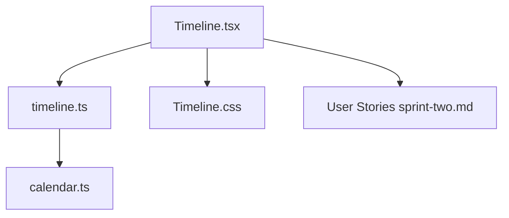
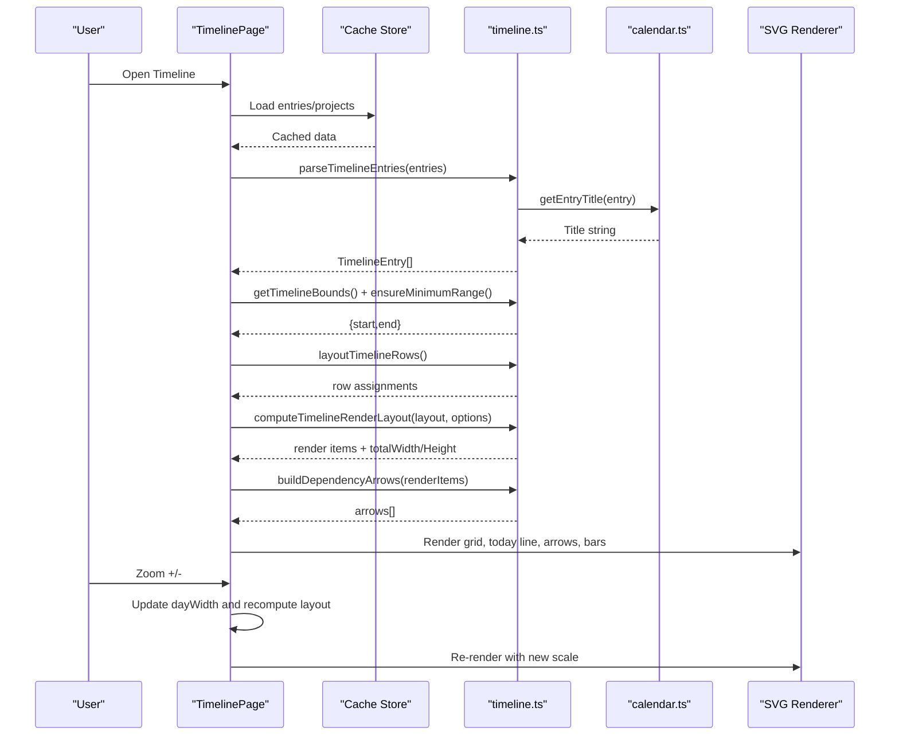
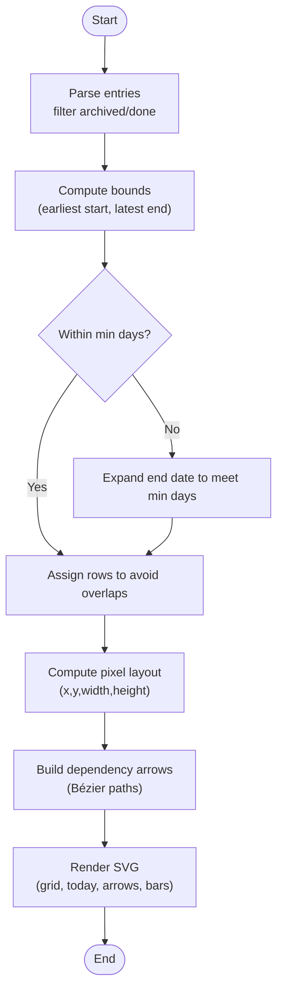
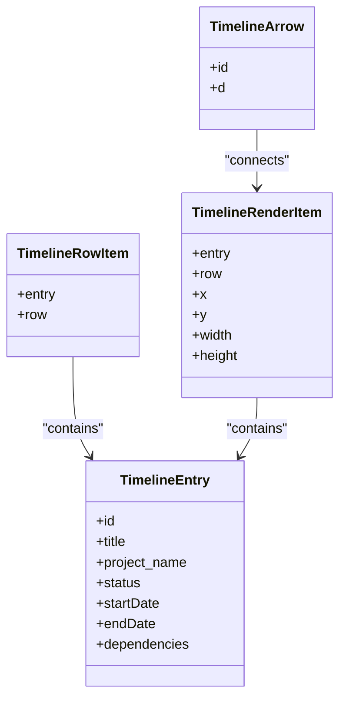
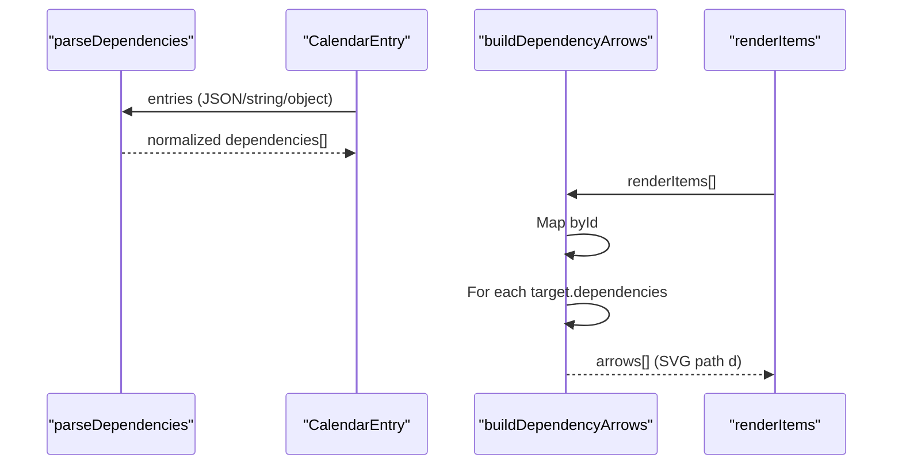
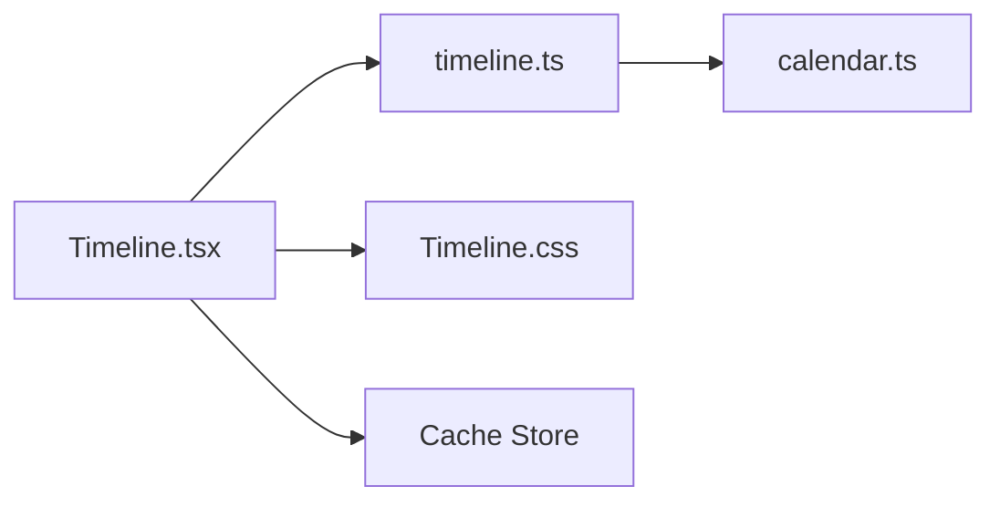

# Timeline View

<cite>
**Referenced Files in This Document**
- [Timeline.tsx](file://frontend/src/pages/Timeline.tsx)
- [timeline.ts](file://frontend/src/lib/timeline.ts)
- [calendar.ts](file://frontend/src/lib/calendar.ts)
- [Timeline.css](file://frontend/src/pages/Timeline.css)
- [sprint-two.md](file://docs-site/docs/User_Stories/sprint-two.md)
</cite>

## Table of Contents

1. [Introduction](#introduction)
2. [Project Structure](#project-structure)
3. [Core Components](#core-components)
4. [Architecture Overview](#architecture-overview)
5. [Detailed Component Analysis](#detailed-component-analysis)
6. [Dependency Analysis](#dependency-analysis)
7. [Performance Considerations](#performance-considerations)
8. [Troubleshooting Guide](#troubleshooting-guide)
9. [Conclusion](#conclusion)
10. [Appendices](#appendices)

## Introduction

This document explains Codacaine’s Timeline view, which visualizes tasks as horizontal bars across time and shows dependencies between tasks with curved arrows. It covers zoom controls (from days to months), visual bars representing task duration and progress, timeline navigation via horizontal scrolling, dependency tracking, project-based grouping, interactive selection, rendering engine details, date calculations, bar positioning algorithms, performance optimizations, responsive behavior, touch gestures for navigation, and accessibility features such as keyboard navigation and screen reader support.

## Project Structure

The Timeline feature is implemented primarily in a React page component and a pure logic library:

- Page component: renders the UI, handles state, zoom, loading, error states, and SVG rendering.
- Library module: parses entries, computes layout, calculates dates, builds dependency arrows, and provides render coordinates.
- Calendar helpers: provide entry title extraction and date utilities used by the timeline parser.
- Styles: define responsive layout, toolbar, grid lines, today marker, arrows, and bar styling.

**Diagram sources**

- [Timeline.tsx:1-398](file://frontend/src/pages/Timeline.tsx#L1-L398)
- [timeline.ts:1-276](file://frontend/src/lib/timeline.ts#L1-L276)
- [calendar.ts:1-158](file://frontend/src/lib/calendar.ts#L1-L158)
- [Timeline.css:1-253](file://frontend/src/pages/Timeline.css#L1-L253)
- [sprint-two.md:190-231](file://docs-site/docs/User_Stories/sprint-two.md#L190-L231)

**Section sources**

- [Timeline.tsx:1-398](file://frontend/src/pages/Timeline.tsx#L1-L398)
- [timeline.ts:1-276](file://frontend/src/lib/timeline.ts#L1-L276)
- [calendar.ts:1-158](file://frontend/src/lib/calendar.ts#L1-L158)
- [Timeline.css:1-253](file://frontend/src/pages/Timeline.css#L1-L253)
- [sprint-two.md:190-231](file://docs-site/docs/User_Stories/sprint-two.md#L190-L231)

## Core Components

- TimelinePage: React component that loads data from cache, subscribes to updates, computes timeline bounds and layout, renders an SVG timeline with grid lines, today marker, dependency arrows, and task bars, and exposes zoom controls.
- parseTimelineEntries: Normalizes raw entries into timeline entries with resolved start/end dates and parsed dependencies.
- getTimelineBounds and ensureMinimumRange: Compute visible date range and enforce a minimum span for readability.
- layoutTimelineRows: Assigns non-overlapping rows to avoid collisions and keep dependency chains readable.
- computeTimelineRenderLayout: Converts logical layout into pixel coordinates for each bar and total canvas size.
- buildDependencyArrows: Generates SVG path strings for Bézier arrows connecting dependent tasks.
- calendar.getEntryTitle: Extracts a human-readable title from entry payloads or summaries.

Key responsibilities:

- Data normalization and filtering (skip archived/done items).
- Date resolution with fallbacks when explicit fields are missing.
- Row assignment algorithm to prevent overlapping bars.
- Pixel coordinate computation based on zoom level and day width.
- Dependency arrow generation using source/target bar positions.

**Section sources**

- [Timeline.tsx:78-398](file://frontend/src/pages/Timeline.tsx#L78-L398)
- [timeline.ts:80-104](file://frontend/src/lib/timeline.ts#L80-L104)
- [timeline.ts:109-140](file://frontend/src/lib/timeline.ts#L109-L140)
- [timeline.ts:157-185](file://frontend/src/lib/timeline.ts#L157-L185)
- [timeline.ts:219-238](file://frontend/src/lib/timeline.ts#L219-L238)
- [timeline.ts:250-275](file://frontend/src/lib/timeline.ts#L250-L275)
- [calendar.ts:109-143](file://frontend/src/lib/calendar.ts#L109-L143)

## Architecture Overview

The Timeline view follows a clear separation of concerns:

- UI layer (Timeline.tsx): manages user interactions (zoom, click-to-navigate), state (loading, error, entries), and renders SVG elements.
- Logic layer (timeline.ts): pure functions for parsing, layout, and arrow generation; no DOM side effects.
- Utilities (calendar.ts): shared date and title helpers.
- Styling (Timeline.css): responsive design, visual hierarchy, and interaction feedback.

**Diagram sources**

- [Timeline.tsx:165-186](file://frontend/src/pages/Timeline.tsx#L165-L186)
- [timeline.ts:80-104](file://frontend/src/lib/timeline.ts#L80-L104)
- [timeline.ts:109-140](file://frontend/src/lib/timeline.ts#L109-L140)
- [timeline.ts:157-185](file://frontend/src/lib/timeline.ts#L157-L185)
- [timeline.ts:219-238](file://frontend/src/lib/timeline.ts#L219-L238)
- [timeline.ts:250-275](file://frontend/src/lib/timeline.ts#L250-L275)
- [calendar.ts:109-143](file://frontend/src/lib/calendar.ts#L109-L143)

## Detailed Component Analysis

### TimelinePage (UI and Interaction)

- Loads entries from cache and triggers initial sync if needed.
- Subscribes to cache changes to refresh the timeline reactively.
- Computes zoom level via discrete steps (0.5x to 4x) and recalculates day width.
- Renders:
  - Toolbar with zoom controls and subtitle.
  - Error banner with dismiss action.
  - Loading spinner and empty state with guidance.
  - SVG timeline with grid lines, month-start markers, today marker, dependency arrows, and task bars.
- Clicking a bar navigates to the related project route.

Accessibility highlights:

- Zoom buttons include aria-label attributes for screen readers.
- Error banner uses role="alert" to announce errors to assistive technologies.
- Interactive bars are clickable groups with cursor pointer styling.

Responsive behavior:

- Toolbar stacks vertically on small screens.
- Empty state icons and text scale down on mobile breakpoints.

**Section sources**

- [Timeline.tsx:78-398](file://frontend/src/pages/Timeline.tsx#L78-L398)
- [Timeline.css:7-52](file://frontend/src/pages/Timeline.css#L7-L52)
- [Timeline.css:133-144](file://frontend/src/pages/Timeline.css#L133-L144)
- [Timeline.css:222-252](file://frontend/src/pages/Timeline.css#L222-L252)

### Rendering Engine and Layout Algorithms

- parseTimelineEntries filters out archived or completed entries and resolves start/end dates with robust fallbacks.
- getTimelineBounds finds the earliest start and latest end among entries.
- ensureMinimumRange expands the visible window to at least a configured number of days for better context.
- layoutTimelineRows sorts entries by start date and assigns them to rows greedily to avoid overlaps; this keeps dependency chains legible.
- computeTimelineRenderLayout converts logical layout to pixel coordinates:
  - Calculates total width from total days and day width.
  - Calculates total height from row count and row height.
  - Computes x, y, width, and height for each bar based on start offset and duration.
- buildDependencyArrows creates Bézier paths from predecessor right edge to successor left edge, with mid control points for smooth curves.

**Diagram sources**

- [timeline.ts:80-104](file://frontend/src/lib/timeline.ts#L80-L104)
- [timeline.ts:109-140](file://frontend/src/lib/timeline.ts#L109-L140)
- [timeline.ts:157-185](file://frontend/src/lib/timeline.ts#L157-L185)
- [timeline.ts:219-238](file://frontend/src/lib/timeline.ts#L219-L238)
- [timeline.ts:250-275](file://frontend/src/lib/timeline.ts#L250-L275)

**Section sources**

- [timeline.ts:80-104](file://frontend/src/lib/timeline.ts#L80-L104)
- [timeline.ts:109-140](file://frontend/src/lib/timeline.ts#L109-L140)
- [timeline.ts:157-185](file://frontend/src/lib/timeline.ts#L157-L185)
- [timeline.ts:219-238](file://frontend/src/lib/timeline.ts#L219-L238)
- [timeline.ts:250-275](file://frontend/src/lib/timeline.ts#L250-L275)

### Date Calculations and Bar Positioning

- Date parsing tolerates invalid inputs and returns null when necessary.
- Start date resolution prefers started_at, then created_at, then one day before due_date; falls back to null if none available.
- End date resolution prefers due_date, then ended_at, then one day after start date.
- Day width is derived from zoom levels multiplied by a base pixel value; changing zoom recalculates all bar positions proportionally.
- Today marker position is computed from the current date relative to the range start and scaled by day width.

**Diagram sources**

- [timeline.ts:3-11](file://frontend/src/lib/timeline.ts#L3-L11)
- [timeline.ts:142-150](file://frontend/src/lib/timeline.ts#L142-L150)
- [timeline.ts:187-201](file://frontend/src/lib/timeline.ts#L187-L201)
- [timeline.ts:240-243](file://frontend/src/lib/timeline.ts#L240-L243)

**Section sources**

- [timeline.ts:15-74](file://frontend/src/lib/timeline.ts#L15-L74)
- [timeline.ts:212-238](file://frontend/src/lib/timeline.ts#L212-L238)
- [Timeline.tsx:188-214](file://frontend/src/pages/Timeline.tsx#L188-L214)

### Dependency Tracking System

- Dependencies are parsed from flexible JSON structures within entry payloads, supporting multiple field names for compatibility.
- Only valid numeric or string IDs are retained; malformed or non-array values are ignored safely.
- Arrows are drawn only when both source and target exist in the rendered set; missing dependencies are skipped gracefully.
- The row assignment algorithm helps maintain readability by placing sequential tasks on different rows where possible.

**Diagram sources**

- [timeline.ts:21-43](file://frontend/src/lib/timeline.ts#L21-L43)
- [timeline.ts:250-275](file://frontend/src/lib/timeline.ts#L250-L275)

**Section sources**

- [timeline.ts:21-43](file://frontend/src/lib/timeline.ts#L21-L43)
- [timeline.ts:250-275](file://frontend/src/lib/timeline.ts#L250-L275)

### Visual Hierarchy and Grouping by Project

- Each timeline entry carries a project_name field; while the current rendering does not group visually by project sections, the presence of project_name enables future grouping or filtering enhancements.
- Bars are styled by status and priority:
  - Status classes differentiate upcoming, active, and done states.
  - Priority classes highlight urgent/high-priority tasks with distinct colors.
- Labels inside bars appear conditionally when width allows, improving readability at higher zoom levels.

**Section sources**

- [Timeline.tsx:29-40](file://frontend/src/pages/Timeline.tsx#L29-L40)
- [Timeline.tsx:48-76](file://frontend/src/pages/Timeline.tsx#L48-L76)
- [timeline.ts:92-100](file://frontend/src/lib/timeline.ts#L92-L100)
- [Timeline.css:190-220](file://frontend/src/pages/Timeline.css#L190-L220)

### Interactive Features

- Zoom controls:
  - Discrete zoom levels from 0.5x to 4x adjust day width and recompute layout.
  - Buttons are disabled at boundaries to prevent invalid operations.
- Navigation:
  - Horizontal scrolling through the timeline container allows viewing past/future periods without changing zoom.
  - Clicking a bar navigates to the associated project route.
- Touch gestures:
  - Native touch scrolling is supported by the scrollable container; no custom gesture handlers are required.

**Section sources**

- [Timeline.tsx:216-229](file://frontend/src/pages/Timeline.tsx#L216-L229)
- [Timeline.tsx:247-269](file://frontend/src/pages/Timeline.tsx#L247-L269)
- [Timeline.css:133-144](file://frontend/src/pages/Timeline.css#L133-L144)
- [sprint-two.md:213-231](file://docs-site/docs/User_Stories/sprint-two.md#L213-L231)

### Accessibility Features

- Keyboard navigation:
  - Zoom buttons are standard <button> elements and receive focus naturally; they include aria-label for clarity.
  - Error banner uses role="alert" to be announced by screen readers.
- Screen reader compatibility:
  - Descriptive labels and roles improve context for assistive technologies.
  - Interactive bars are grouped under a clickable group element; adding explicit roles could further enhance semantics if needed.

**Section sources**

- [Timeline.tsx:247-278](file://frontend/src/pages/Timeline.tsx#L247-L278)
- [Timeline.css:186-188](file://frontend/src/pages/Timeline.css#L186-L188)

## Dependency Analysis

The Timeline view depends on:

- Cache store for entries and projects, enabling offline-first behavior and reactive updates.
- Pure logic functions for parsing, layout, and arrow generation, ensuring predictable computations independent of UI state.
- Calendar helpers for title extraction and date utilities.
- CSS for responsive layout and visual styling.

**Diagram sources**

- [Timeline.tsx:1-18](file://frontend/src/pages/Timeline.tsx#L1-L18)
- [timeline.ts:1-2](file://frontend/src/lib/timeline.ts#L1-L2)
- [calendar.ts:1-24](file://frontend/src/lib/calendar.ts#L1-L24)
- [Timeline.css:1-253](file://frontend/src/pages/Timeline.css#L1-L253)

**Section sources**

- [Timeline.tsx:1-18](file://frontend/src/pages/Timeline.tsx#L1-L18)
- [timeline.ts:1-2](file://frontend/src/lib/timeline.ts#L1-L2)
- [calendar.ts:1-24](file://frontend/src/lib/calendar.ts#L1-L24)
- [Timeline.css:1-253](file://frontend/src/pages/Timeline.css#L1-L253)

## Performance Considerations

- Memoization:
  - useMemo is used to compute timeline entries, bounds, layout, arrows, grid lines, and today marker position, minimizing recomputation on re-renders.
- Efficient parsing:
  - parseTimelineEntries filters and normalizes entries once per change; dependencies are parsed safely with minimal overhead.
- Row assignment complexity:
  - layoutTimelineRows sorts entries and checks overlaps per row; for typical datasets this remains efficient, but very large timelines may benefit from spatial indexing or virtualization.
- SVG rendering:
  - All elements are rendered as SVG nodes; for extremely large timelines, consider virtualizing visible rows or batching updates to reduce DOM cost.
- Minimum range:
  - ensureMinimumRange prevents overly narrow views that can cause dense rendering and poor usability.

[No sources needed since this section provides general guidance]

## Troubleshooting Guide

Common issues and resolutions:

- No timeline data:
  - Ensure entries have valid start/end dates and are not archived or completed.
  - Check that dependencies reference existing entries; missing dependencies are ignored.
- Arrows not appearing:
  - Verify that both source and target entries exist in the rendered set and have valid IDs.
- Bars too narrow or overlapping:
  - Increase zoom level to spread bars horizontally; verify row assignment avoids overlaps.
- Today marker misaligned:
  - Confirm range calculation includes current date; check dayWidth scaling and padding.

**Section sources**

- [timeline.ts:80-104](file://frontend/src/lib/timeline.ts#L80-L104)
- [timeline.ts:250-275](file://frontend/src/lib/timeline.ts#L250-L275)
- [Timeline.tsx:281-313](file://frontend/src/pages/Timeline.tsx#L281-L313)

## Conclusion

Codacaine’s Timeline view provides a clear, interactive visualization of tasks over time with robust dependency tracking. The architecture separates UI concerns from pure logic, enabling reliable rendering and easy maintenance. Zoom controls, horizontal scrolling, and responsive styles deliver a smooth user experience across devices. Future enhancements could include project-based grouping, advanced virtualization for large datasets, and richer accessibility semantics for bars.

[No sources needed since this section summarizes without analyzing specific files]

## Appendices

### User Story Alignment

- Horizontal bars spanning start to due date with temporal context (today marker, grid lines).
- Dependency arrows between linked tasks with separate rows for readability.
- Zoom from 50% to 400% with horizontal scrolling and stable rendering.
- Helpful empty state guiding users to add dated tasks and dependencies.

**Section sources**

- [sprint-two.md:191-231](file://docs-site/docs/User_Stories/sprint-two.md#L191-L231)
