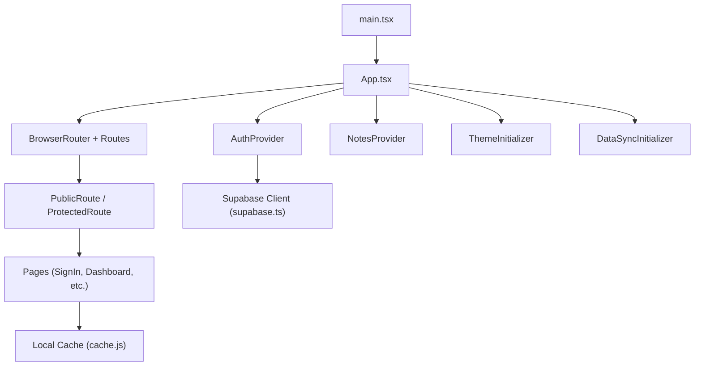
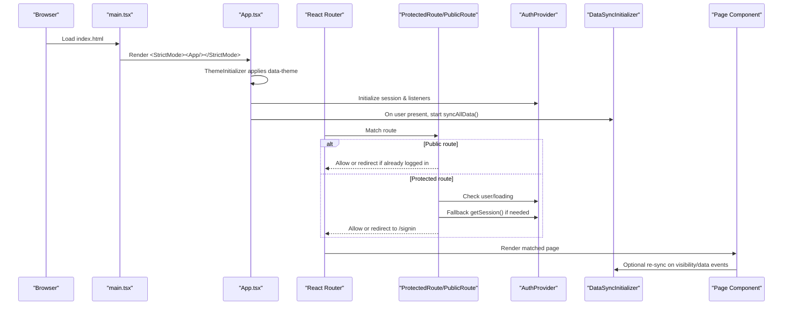
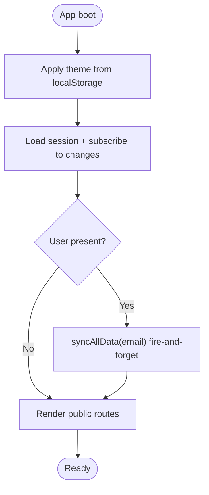
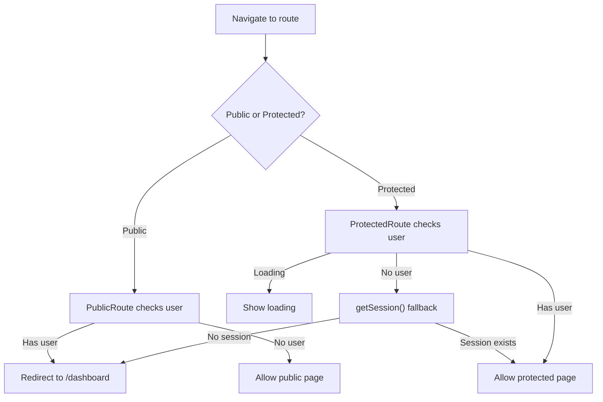
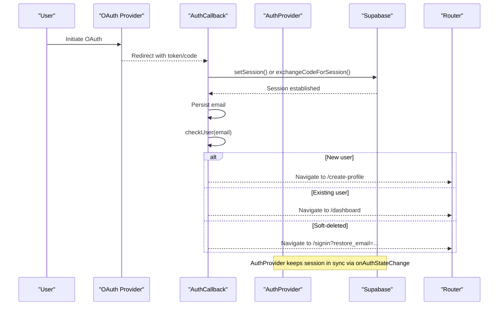
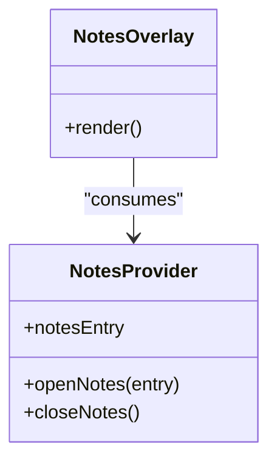
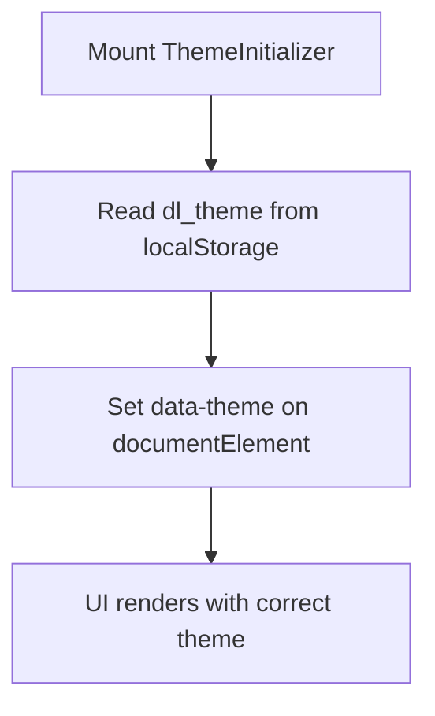
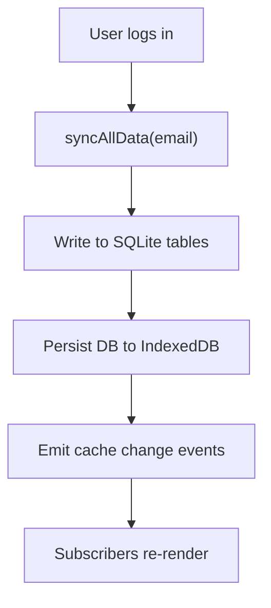
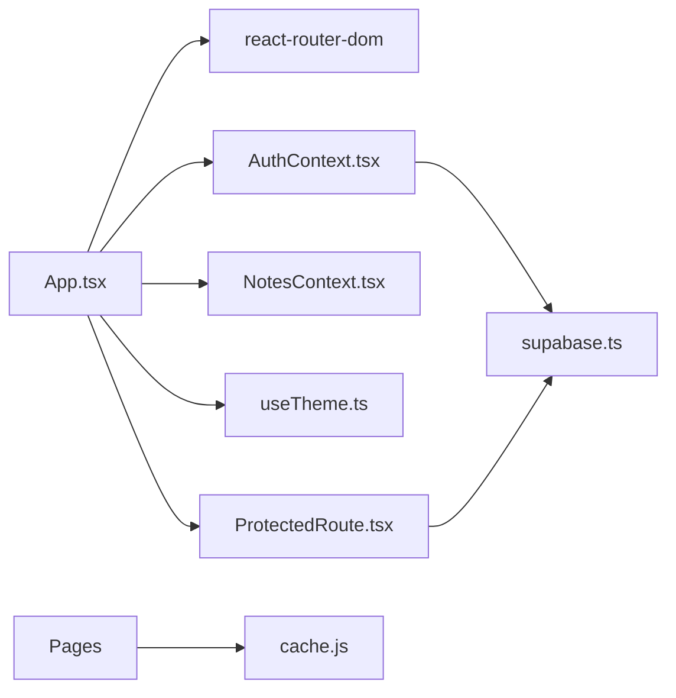

# Application Architecture

<cite>
**Referenced Files in This Document**
- [main.tsx](file://frontend/src/main.tsx)
- [App.tsx](file://frontend/src/App.tsx)
- [ProtectedRoute.tsx](file://frontend/src/components/ProtectedRoute.tsx)
- [AuthContext.tsx](file://frontend/src/context/AuthContext.tsx)
- [NotesContext.tsx](file://frontend/src/context/NotesContext.tsx)
- [useTheme.ts](file://frontend/src/hooks/useTheme.ts)
- [supabase.ts](file://frontend/src/lib/supabase.ts)
- [AuthCallback.tsx](file://frontend/src/pages/AuthCallback.tsx)
- [vite.config.ts](file://frontend/vite.config.ts)
- [package.json](file://frontend/package.json)
- [tsconfig.json](file://frontend/tsconfig.json)
- [cache.js](file://frontend/src/lib/cache.js)
</cite>

## Table of Contents

1. Introduction
2. Project Structure
3. Core Components
4. Architecture Overview
5. Detailed Component Analysis
6. Dependency Analysis
7. Performance Considerations
8. Troubleshooting Guide
9. Conclusion

## Introduction

This document explains the Codacaine React application architecture built with React 19, TypeScript, and Vite. It covers the application bootstrap process, component hierarchy, routing configuration using React Router, provider pattern implementation (AuthProvider, NotesProvider, ThemeInitializer), protected vs public routes, authentication flow integration, build configuration, development setup, optimization strategies, and how different layers interact.

## Project Structure

The frontend is organized into feature-oriented directories:

- Entry point and root app shell: main.tsx, App.tsx
- Routing and guards: App.tsx (Routes), ProtectedRoute.tsx
- Global state via providers: AuthContext.tsx, NotesContext.tsx
- UI hooks and theming: useTheme.ts
- External integrations: supabase.ts
- Pages: pages/* (e.g., SignIn, Dashboard, AuthCallback)
- Local-first data layer: cache.js (SQLite over IndexedDB)
- Build and tooling: vite.config.ts, package.json, tsconfig.json

**Diagram sources**

- [main.tsx:1-23](file://frontend/src/main.tsx#L1-L23)
- [App.tsx:1-355](file://frontend/src/App.tsx#L1-L355)
- [ProtectedRoute.tsx:1-82](file://frontend/src/components/ProtectedRoute.tsx#L1-L82)
- [AuthContext.tsx:1-240](file://frontend/src/context/AuthContext.tsx#L1-L240)
- [NotesContext.tsx:1-47](file://frontend/src/context/NotesContext.tsx#L1-L47)
- [useTheme.ts:1-48](file://frontend/src/hooks/useTheme.ts#L1-L48)
- [supabase.ts:1-34](file://frontend/src/lib/supabase.ts#L1-L34)
- [cache.js:1-389](file://frontend/src/lib/cache.js#L1-L389)

**Section sources**

- [main.tsx:1-23](file://frontend/src/main.tsx#L1-L23)
- [App.tsx:1-355](file://frontend/src/App.tsx#L1-L355)
- [package.json:1-45](file://frontend/package.json#L1-L45)
- [vite.config.ts:1-16](file://frontend/vite.config.ts#L1-L16)
- [tsconfig.json:1-29](file://frontend/tsconfig.json#L1-L29)

## Core Components

- AppShell and layout are provided by page-level shells; navigation and global chrome are composed within pages and shared components.
- Providers wrap the entire app to supply auth state, notes overlay state, and theme initialization.
- Routing uses React Router v7 with a mix of public and protected routes.
- Data layer uses a local-first SQLite cache persisted to IndexedDB with event-driven subscriptions.

Key responsibilities:

- Bootstrap: mount React 19 root, restore UI preferences before first paint.
- Providers: initialize theme, manage auth session, open notes overlay.
- Routing: define public and protected routes, redirect unauthenticated users.
- Auth flow: OAuth/email sign-in, callback handling, soft-deleted account handling.
- Cache: read from SQLite immediately, background refresh, offline queue support.

**Section sources**

- [App.tsx:38-131](file://frontend/src/App.tsx#L38-L131)
- [AuthContext.tsx:38-231](file://frontend/src/context/AuthContext.tsx#L38-L231)
- [NotesContext.tsx:22-47](file://frontend/src/context/NotesContext.tsx#L22-L47)
- [useTheme.ts:24-48](file://frontend/src/hooks/useTheme.ts#L24-L48)
- [cache.js:1-389](file://frontend/src/lib/cache.js#L1-L389)

## Architecture Overview

High-level flow:

- The entrypoint mounts StrictMode and renders App.
- App configures BrowserRouter, wraps children with ThemeInitializer, AuthProvider, NotesProvider, and DataSyncInitializer.
- Routes declare public and protected endpoints. Public routes guard against authenticated users; protected routes enforce authentication with a fallback Supabase session check.
- On login, DataSyncInitializer triggers an initial sync to populate IndexedDB for fast first render.
- Pages consume contexts and the cache layer for data access.

**Diagram sources**

- [main.tsx:1-23](file://frontend/src/main.tsx#L1-L23)
- [App.tsx:123-355](file://frontend/src/App.tsx#L123-L355)
- [ProtectedRoute.tsx:7-82](file://frontend/src/components/ProtectedRoute.tsx#L7-L82)
- [AuthContext.tsx:45-80](file://frontend/src/context/AuthContext.tsx#L45-L80)
- [cache.js:305-346](file://frontend/src/lib/cache.js#L305-L346)

## Detailed Component Analysis

### Application Bootstrap and Root Provider Chain

- main.tsx creates the React 19 root and restores font/corner preferences before rendering to avoid FOUC.
- App.tsx composes:
  - ThemeInitializer: calls useTheme to apply data-theme on mount.
  - AuthProvider: initializes session and listens for auth changes.
  - NotesProvider: manages overlay state for inline notes.
  - DataSyncInitializer: triggers initial data sync when a user is present.
  - OfflineBanner and OfflineSyncToasts for UX during connectivity issues.
  - TourNavigator: listens for tour navigation events to drive programmatic routing.

**Diagram sources**

- [App.tsx:38-61](file://frontend/src/App.tsx#L38-L61)
- [App.tsx:123-131](file://frontend/src/App.tsx#L123-L131)
- [useTheme.ts:24-48](file://frontend/src/hooks/useTheme.ts#L24-L48)
- [AuthContext.tsx:45-80](file://frontend/src/context/AuthContext.tsx#L45-L80)

**Section sources**

- [main.tsx:6-22](file://frontend/src/main.tsx#L6-L22)
- [App.tsx:38-131](file://frontend/src/App.tsx#L38-L131)

### Routing Configuration and Route Guards

- Public routes:
  - /, /signin, /reset-password, /auth/update-password allow unauthenticated access.
  - PublicRoute redirects to /dashboard if a user is already authenticated.
- Protected routes:
  - All dashboard and feature routes are wrapped in ProtectedRoute.
  - ProtectedRoute shows a loading spinner while auth state resolves.
  - If no user, it performs a direct Supabase getSession() fallback to handle race conditions during OAuth callbacks.
  - Redirects to /signin when not authenticated.

**Diagram sources**

- [App.tsx:63-89](file://frontend/src/App.tsx#L63-L89)
- [App.tsx:133-344](file://frontend/src/App.tsx#L133-L344)
- [ProtectedRoute.tsx:7-82](file://frontend/src/components/ProtectedRoute.tsx#L7-L82)

**Section sources**

- [App.tsx:63-89](file://frontend/src/App.tsx#L63-L89)
- [App.tsx:133-344](file://frontend/src/App.tsx#L133-L344)
- [ProtectedRoute.tsx:7-82](file://frontend/src/components/ProtectedRoute.tsx#L7-L82)

### Authentication Flow and Callback Handling

- AuthProvider:
  - Dev mode bypass allows mock user for local testing.
  - Initializes session and subscribes to onAuthStateChange.
  - Provides methods for Google/GitHub OAuth, email sign-in/sign-up, sign-out, password reset/update, account deletion, and restoration.
  - Sign-out clears per-user cache and disconnects SSE.
- AuthCallback:
  - Handles hash-based tokens and PKCE code exchange.
  - Persists email to storage and routes new users to create-profile or existing users to dashboard.
  - Detects soft-deleted accounts and redirects to restore prompt.

**Diagram sources**

- [AuthCallback.tsx:40-133](file://frontend/src/pages/AuthCallback.tsx#L40-L133)
- [AuthContext.tsx:45-80](file://frontend/src/context/AuthContext.tsx#L45-L80)
- [AuthContext.tsx:82-151](file://frontend/src/context/AuthContext.tsx#L82-L151)

**Section sources**

- [AuthContext.tsx:8-16](file://frontend/src/context/AuthContext.tsx#L8-L16)
- [AuthContext.tsx:45-80](file://frontend/src/context/AuthContext.tsx#L45-L80)
- [AuthContext.tsx:82-208](file://frontend/src/context/AuthContext.tsx#L82-L208)
- [AuthCallback.tsx:40-133](file://frontend/src/pages/AuthCallback.tsx#L40-L133)

### Notes Overlay Provider

- NotesProvider maintains a single notesEntry and exposes open/close actions.
- App renders NotesOverlay conditionally based on context, allowing notes to appear as an overlay without navigating away.

**Diagram sources**

- [NotesContext.tsx:22-47](file://frontend/src/context/NotesContext.tsx#L22-L47)
- [App.tsx:95-101](file://frontend/src/App.tsx#L95-L101)

**Section sources**

- [NotesContext.tsx:22-47](file://frontend/src/context/NotesContext.tsx#L22-L47)
- [App.tsx:95-101](file://frontend/src/App.tsx#L95-L101)

### Theme Initialization

- useTheme reads persisted theme from localStorage, applies data-theme attribute, and provides set/toggle helpers.
- ThemeInitializer ensures theme is applied before any page renders to prevent flash of incorrect theme.

**Diagram sources**

- [useTheme.ts:8-22](file://frontend/src/hooks/useTheme.ts#L8-L22)
- [App.tsx:38-41](file://frontend/src/App.tsx#L38-L41)

**Section sources**

- [useTheme.ts:8-48](file://frontend/src/hooks/useTheme.ts#L8-L48)
- [App.tsx:38-41](file://frontend/src/App.tsx#L38-L41)

### Data Synchronization and Local-First Cache

- DataSyncInitializer triggers syncAllData on login to warm IndexedDB.
- cache.js implements a local-first SQLite cache persisted to IndexedDB with:
  - Event-driven subscriptions for reactive updates.
  - Stale-while-revalidate strategy for reads.
  - Per-user cache clearing on logout/account deletion.
  - Tables mirroring server schema for projects, entries, archives, fields, notes, etc.

**Diagram sources**

- [App.tsx:47-61](file://frontend/src/App.tsx#L47-L61)
- [cache.js:74-127](file://frontend/src/lib/cache.js#L74-L127)
- [cache.js:179-223](file://frontend/src/lib/cache.js#L179-L223)
- [cache.js:305-346](file://frontend/src/lib/cache.js#L305-L346)

**Section sources**

- [App.tsx:47-61](file://frontend/src/App.tsx#L47-L61)
- [cache.js:1-389](file://frontend/src/lib/cache.js#L1-L389)

## Dependency Analysis

- App depends on:
  - React Router for routing and navigation.
  - AuthProvider for auth state and actions.
  - NotesProvider for overlay state.
  - useTheme for theme management.
  - ProtectedRoute/PublicRoute for access control.
  - Supabase client for auth and RPC calls.
  - Cache layer for local-first data access.

**Diagram sources**

- [App.tsx:1-355](file://frontend/src/App.tsx#L1-L355)
- [AuthContext.tsx:1-240](file://frontend/src/context/AuthContext.tsx#L1-L240)
- [ProtectedRoute.tsx:1-82](file://frontend/src/components/ProtectedRoute.tsx#L1-L82)
- [supabase.ts:1-34](file://frontend/src/lib/supabase.ts#L1-L34)
- [cache.js:1-389](file://frontend/src/lib/cache.js#L1-L389)

**Section sources**

- [App.tsx:1-355](file://frontend/src/App.tsx#L1-L355)
- [AuthContext.tsx:1-240](file://frontend/src/context/AuthContext.tsx#L1-L240)
- [ProtectedRoute.tsx:1-82](file://frontend/src/components/ProtectedRoute.tsx#L1-L82)
- [supabase.ts:1-34](file://frontend/src/lib/supabase.ts#L1-L34)
- [cache.js:1-389](file://frontend/src/lib/cache.js#L1-L389)

## Performance Considerations

- Initial render optimization:
  - Restore theme and UI preferences before first paint to avoid FOUC.
  - Use strict mode and minimal work in root to keep startup fast.
- Routing performance:
  - Keep route definitions flat and co-located in App for clarity.
  - Use lazy loading for heavy pages if needed (not currently implemented).
- Auth performance:
  - Avoid redundant network calls by relying on cached sessions and provider state.
  - Use fallback getSession only when necessary to resolve race conditions.
- Data layer performance:
  - Local-first reads from SQLite provide immediate UI responsiveness.
  - Background refresh via stale-while-revalidate reduces perceived latency.
  - Event-driven subscriptions minimize unnecessary re-renders.
- Network resilience:
  - Offline banner and toast notifications improve UX during outages.
  - Graceful degradation when offline prevents errors and shows appropriate states.

[No sources needed since this section provides general guidance]

## Troubleshooting Guide

Common issues and resolutions:

- Supabase client not configured:
  - Ensure VITE_SUPABASE_URL and VITE_SUPABASE_ANON_KEY are set in environment variables.
  - The client creation validates credentials and warns if missing or invalid.
- OAuth callback fails:
  - Verify redirect URLs match your domain and that tokens are correctly parsed from hash or code.
  - Check for soft-deleted accounts and ensure restore flow is triggered when needed.
- Protected route loops or redirects unexpectedly:
  - Confirm AuthProvider has loaded session and that ProtectedRoute’s fallback getSession resolves correctly.
  - Ensure dev mode bypass is disabled in production builds.
- Cache inconsistencies:
  - Clear per-user cache on logout or account deletion to avoid stale data.
  - Use cache subscribers to ensure UI reflects latest data after sync operations.

**Section sources**

- [supabase.ts:6-21](file://frontend/src/lib/supabase.ts#L6-L21)
- [AuthCallback.tsx:40-133](file://frontend/src/pages/AuthCallback.tsx#L40-L133)
- [ProtectedRoute.tsx:12-26](file://frontend/src/components/ProtectedRoute.tsx#L12-L26)
- [AuthContext.tsx:137-151](file://frontend/src/context/AuthContext.tsx#L137-L151)
- [cache.js:271-290](file://frontend/src/lib/cache.js#L271-L290)

## Conclusion

Codacaine’s frontend follows a clear, layered architecture:

- Bootstrap and providers establish theme, auth, and notes context early.
- Routing separates public and protected flows with robust guards.
- Authentication integrates seamlessly with Supabase and handles edge cases like soft-deleted accounts.
- Local-first caching delivers responsive UI and resilient offline behavior.
- Build and development tooling are straightforward with Vite and TypeScript, enabling rapid iteration and optimized production builds.

[No sources needed since this section summarizes without analyzing specific files]
