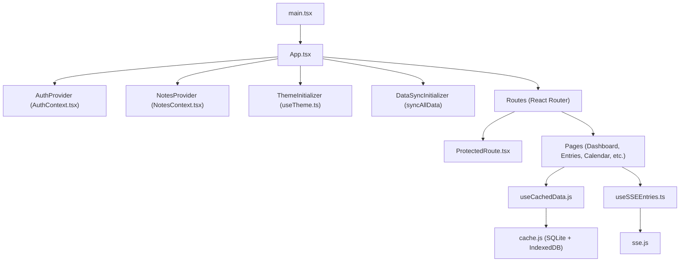
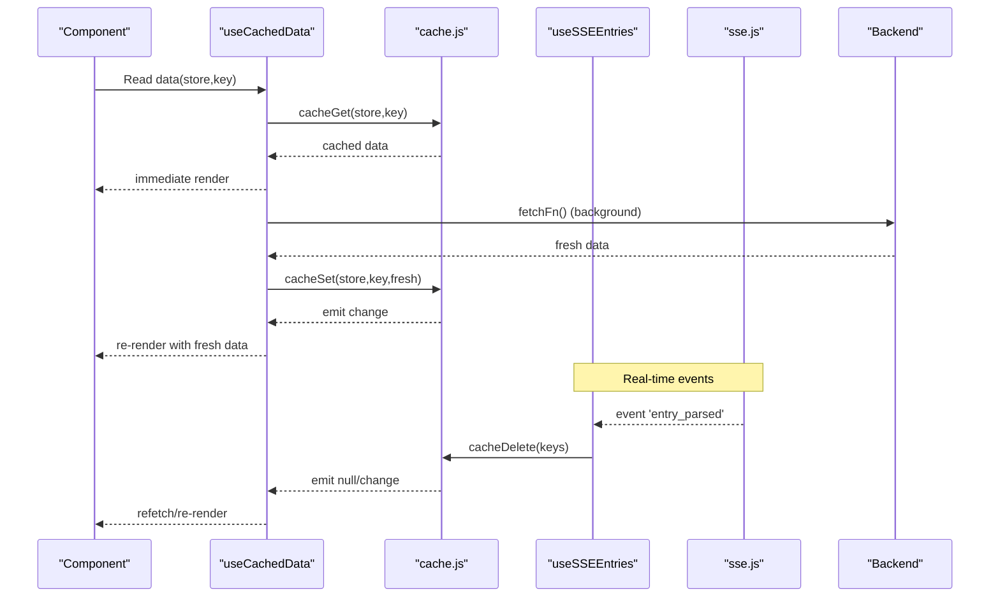
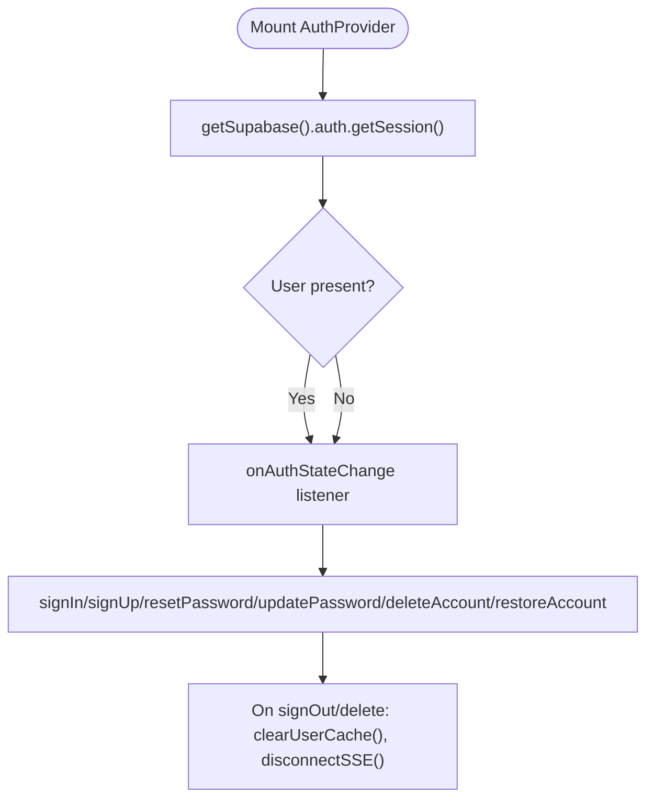
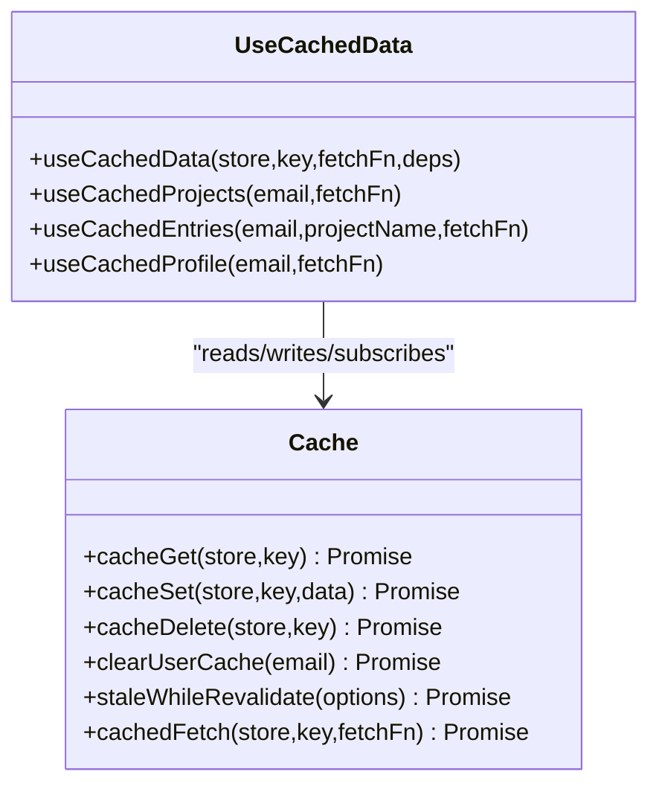
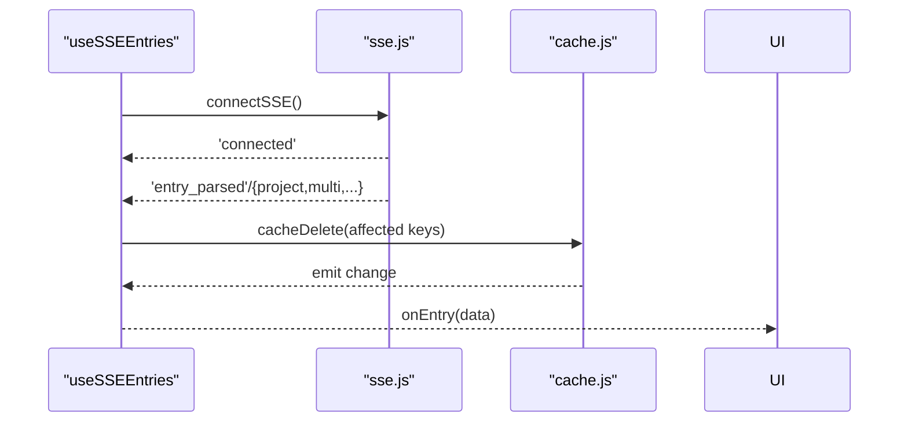
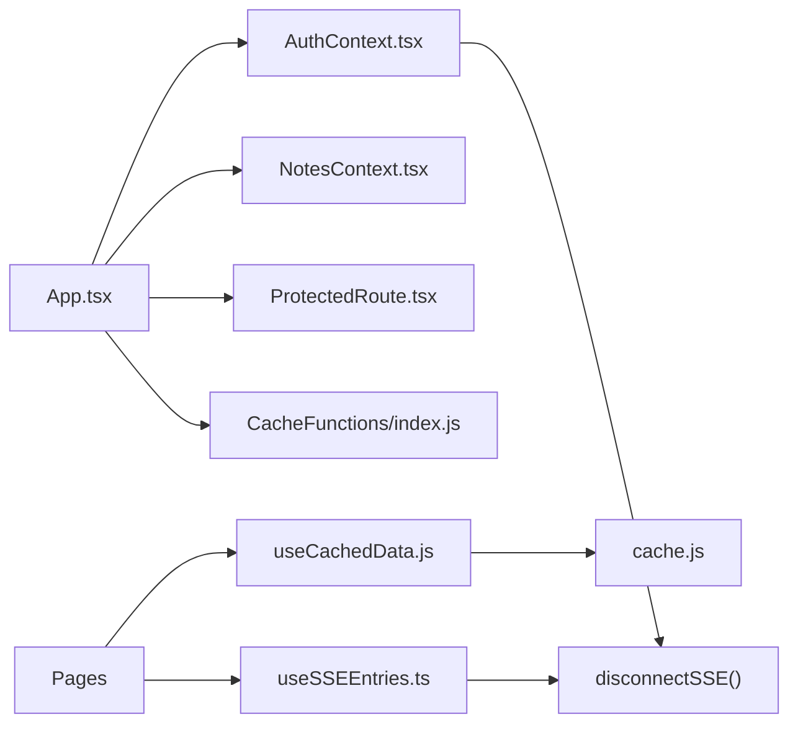

# Frontend Application

<cite>
**Referenced Files in This Document**
- [package.json](file://frontend/package.json)
- [vite.config.ts](file://frontend/vite.config.ts)
- [tsconfig.json](file://frontend/tsconfig.json)
- [main.tsx](file://frontend/src/main.tsx)
- [App.tsx](file://frontend/src/App.tsx)
- [AuthContext.tsx](file://frontend/src/context/AuthContext.tsx)
- [NotesContext.tsx](file://frontend/src/context/NotesContext.tsx)
- [ProtectedRoute.tsx](file://frontend/src/components/ProtectedRoute.tsx)
- [useCachedData.js](file://frontend/src/hooks/useCachedData.js)
- [useSSEEntries.ts](file://frontend/src/hooks/useSSEEntries.ts)
- [cache.js](file://frontend/src/lib/cache.js)
- [sse.js](file://frontend/src/lib/sse.js)
- [index.js](file://frontend/src/CacheFunctions/index.js)
- [AppShell.tsx](file://frontend/src/components/AppShell.tsx)
- [useTheme.ts](file://frontend/src/hooks/useTheme.ts)
</cite>

## Table of Contents

1. Introduction
2. Project Structure
3. Core Components
4. Architecture Overview
5. Detailed Component Analysis
6. Dependency Analysis
7. Performance Considerations
8. Troubleshooting Guide
9. Conclusion

## Introduction

This document describes the Codacaine React frontend application built with TypeScript and Vite. It explains the component-based architecture using React 19, routing and protected routes, global state via React Context, local-first data caching with IndexedDB-backed SQLite, background synchronization, offline queueing, real-time updates via Server-Sent Events (SSE), UI composition, styling approach, responsive design patterns, accessibility considerations, and testing strategies using Vitest.

## Project Structure

The frontend is a Vite + React 19 application with TypeScript. The root entry renders the app inside StrictMode and applies initial theme settings before first paint. Routing is centralized in App, which composes providers for authentication, notes overlay, theme initialization, and data synchronization. Pages are organized under src/pages, shared UI components under src/components, reusable hooks under src/hooks, cross-cutting utilities under src/lib, and cache orchestration under src/CacheFunctions.

**Diagram sources**

- [main.tsx:1-23](file://frontend/src/main.tsx#L1-L23)
- [App.tsx:123-355](file://frontend/src/App.tsx#L123-L355)
- [AuthContext.tsx:38-230](file://frontend/src/context/AuthContext.tsx#L38-L230)
- [NotesContext.tsx:22-38](file://frontend/src/context/NotesContext.tsx#L22-L38)
- [useTheme.ts:24-47](file://frontend/src/hooks/useTheme.ts#L24-L47)
- [useCachedData.js:23-76](file://frontend/src/hooks/useCachedData.js#L23-L76)
- [cache.js:129-171](file://frontend/src/lib/cache.js#L129-L171)
- [useSSEEntries.ts:41-107](file://frontend/src/hooks/useSSEEntries.ts#L41-L107)
- [sse.js:37-101](file://frontend/src/lib/sse.js#L37-L101)

**Section sources**

- [package.json:1-45](file://frontend/package.json#L1-L45)
- [vite.config.ts:1-16](file://frontend/vite.config.ts#L1-L16)
- [tsconfig.json:1-29](file://frontend/tsconfig.json#L1-L29)
- [main.tsx:1-23](file://frontend/src/main.tsx#L1-L23)
- [App.tsx:123-355](file://frontend/src/App.tsx#L123-L355)

## Core Components

- Authentication context: Provides user/session state, sign-in/out, password reset/update, account delete/restore, and dev-mode bypass. Cleans up cache and SSE on logout/delete.
- Notes overlay context: Manages an overlay state to render NotesPage over the current page without navigation.
- Protected route: Guards routes by checking auth context and falling back to a direct session check to avoid race conditions during OAuth callbacks.
- Theme hook: Persists and applies theme to document attributes; exposes toggle and dark detection.
- App shell: Top-level layout with navigation drawer and profile menu; integrates with router and auth.

Key responsibilities:

- Global state: AuthContext holds user/session; NotesContext manages overlay state.
- Navigation guards: ProtectedRoute ensures authenticated access.
- UI composition: App orchestrates providers, sync initializer, banners, and routes.

**Section sources**

- [AuthContext.tsx:18-239](file://frontend/src/context/AuthContext.tsx#L18-L239)
- [NotesContext.tsx:4-47](file://frontend/src/context/NotesContext.tsx#L4-L47)
- [ProtectedRoute.tsx:7-82](file://frontend/src/components/ProtectedRoute.tsx#L7-L82)
- [useTheme.ts:1-48](file://frontend/src/hooks/useTheme.ts#L1-L48)
- [AppShell.tsx:10-132](file://frontend/src/components/AppShell.tsx#L10-L132)
- [App.tsx:38-121](file://frontend/src/App.tsx#L38-L121)

## Architecture Overview

The application follows a local-first architecture:

- Reads from IndexedDB-backed SQLite immediately for instant UI.
- Background fetches refresh data and update cache.
- Writes are optimistic (update cache first), then synced to server.
- Offline actions are queued and processed when connectivity returns.
- Real-time updates arrive via SSE and invalidate or update relevant caches.

**Diagram sources**

- [useCachedData.js:23-76](file://frontend/src/hooks/useCachedData.js#L23-L76)
- [cache.js:179-223](file://frontend/src/lib/cache.js#L179-L223)
- [useSSEEntries.ts:41-107](file://frontend/src/hooks/useSSEEntries.ts#L41-L107)
- [sse.js:37-101](file://frontend/src/lib/sse.js#L37-L101)

## Detailed Component Analysis

### Authentication and Session Management

- Initializes session and listens for changes.
- Supports Google/GitHub OAuth and email/password flows.
- On sign-out or account deletion, clears user-specific cache and disconnects SSE.
- Dev mode allows mock user for local development.

**Diagram sources**

- [AuthContext.tsx:45-80](file://frontend/src/context/AuthContext.tsx#L45-L80)
- [AuthContext.tsx:82-208](file://frontend/src/context/AuthContext.tsx#L82-L208)

**Section sources**

- [AuthContext.tsx:18-239](file://frontend/src/context/AuthContext.tsx#L18-L239)

### Notes Overlay

- Maintains a single overlay entry and provides open/close methods.
- Rendered conditionally in App to overlay NotesPage while preserving the current page.

**Section sources**

- [NotesContext.tsx:4-47](file://frontend/src/context/NotesContext.tsx#L4-L47)
- [App.tsx:91-101](file://frontend/src/App.tsx#L91-L101)

### Protected Routes

- Guards routes by checking auth context and performing a direct Supabase session check to handle race conditions during OAuth callback flow.
- Shows loading spinner while resolving auth state.

**Section sources**

- [ProtectedRoute.tsx:7-82](file://frontend/src/components/ProtectedRoute.tsx#L7-L82)

### Local-First Data Caching (IndexedDB + SQLite)

- Uses sql.js (WASM) with tables mirroring server schema; persists DB blob to IndexedDB for durability.
- Provides get/set/delete/subscribe APIs and stale-while-revalidate pattern.
- useCachedData hook reads from cache immediately, subscribes to changes, and triggers background fetch.

**Diagram sources**

- [cache.js:179-389](file://frontend/src/lib/cache.js#L179-L389)
- [useCachedData.js:23-100](file://frontend/src/hooks/useCachedData.js#L23-L100)

**Section sources**

- [cache.js:1-389](file://frontend/src/lib/cache.js#L1-L389)
- [useCachedData.js:1-100](file://frontend/src/hooks/useCachedData.js#L1-L100)

### Offline Queue and Synchronization

- Central module exports sync functions, queue operations, and processors.
- Initial full sync runs after login to warm IndexedDB cache.

**Section sources**

- [index.js:1-31](file://frontend/src/CacheFunctions/index.js#L1-L31)
- [App.tsx:43-61](file://frontend/src/App.tsx#L43-L61)

### Real-Time Updates via SSE

- Establishes a persistent EventSource connection with token-based auth.
- Reconnects with exponential backoff on errors.
- useSSEEntries hook listens for parsed entries and invalidates relevant cache keys, notifying UI via callback.

**Diagram sources**

- [useSSEEntries.ts:41-107](file://frontend/src/hooks/useSSEEntries.ts#L41-L107)
- [sse.js:37-101](file://frontend/src/lib/sse.js#L37-L101)
- [cache.js:249-263](file://frontend/src/lib/cache.js#L249-L263)

**Section sources**

- [useSSEEntries.ts:1-108](file://frontend/src/hooks/useSSEEntries.ts#L1-L108)
- [sse.js:1-185](file://frontend/src/lib/sse.js#L1-L185)

### Routing and Navigation

- Centralized routes in App with public and protected pages.
- PublicRoute redirects authenticated users away from auth pages.
- TourNavigator listens for custom window events to navigate mid-tour.
- AppShell provides top nav and drawer for quick navigation between views.

**Section sources**

- [App.tsx:123-355](file://frontend/src/App.tsx#L123-L355)
- [AppShell.tsx:10-132](file://frontend/src/components/AppShell.tsx#L10-L132)

### Styling, Responsive Design, and Accessibility

- Theme management via useTheme sets data-theme on the document element; supports multiple themes and persistence in localStorage.
- AppShell uses accessible labels for interactive elements and keyboard-friendly navigation patterns.
- CSS modules or scoped styles are used across components and pages (e.g., Calendar.css, Kanban.css, Today.css).

**Section sources**

- [useTheme.ts:1-48](file://frontend/src/hooks/useTheme.ts#L1-L48)
- [AppShell.tsx:31-132](file://frontend/src/components/AppShell.tsx#L31-L132)

## Dependency Analysis

High-level dependencies among core modules:

**Diagram sources**

- [App.tsx:123-355](file://frontend/src/App.tsx#L123-L355)
- [AuthContext.tsx:137-151](file://frontend/src/context/AuthContext.tsx#L137-L151)
- [useCachedData.js:23-76](file://frontend/src/hooks/useCachedData.js#L23-L76)
- [cache.js:179-223](file://frontend/src/lib/cache.js#L179-L223)
- [useSSEEntries.ts:41-107](file://frontend/src/hooks/useSSEEntries.ts#L41-L107)
- [sse.js:37-101](file://frontend/src/lib/sse.js#L37-L101)
- [index.js:1-31](file://frontend/src/CacheFunctions/index.js#L1-L31)

**Section sources**

- [App.tsx:123-355](file://frontend/src/App.tsx#L123-L355)
- [AuthContext.tsx:137-151](file://frontend/src/context/AuthContext.tsx#L137-L151)
- [useCachedData.js:23-76](file://frontend/src/hooks/useCachedData.js#L23-L76)
- [cache.js:179-223](file://frontend/src/lib/cache.js#L179-L223)
- [useSSEEntries.ts:41-107](file://frontend/src/hooks/useSSEEntries.ts#L41-L107)
- [sse.js:37-101](file://frontend/src/lib/sse.js#L37-L101)
- [index.js:1-31](file://frontend/src/CacheFunctions/index.js#L1-L31)

## Performance Considerations

- Immediate UI responsiveness via IndexedDB-backed SQLite cache; reads do not block on network.
- Stale-while-revalidate reduces perceived latency by serving cached data while refreshing in background.
- SSE-driven cache invalidation avoids unnecessary full refetches and keeps UI consistent.
- Exponential backoff for SSE reconnect prevents thundering herds on transient failures.
- Avoid redundant subscriptions by unmounting listeners in hooks and clearing timers on disconnect.

[No sources needed since this section provides general guidance]

## Troubleshooting Guide

Common issues and where to investigate:

- Auth race conditions during OAuth callback: ProtectedRoute performs a direct session check to guard against delayed context updates.
- SSE connectivity problems: sse.js logs connection errors and schedules reconnects; ensure token is available and backend endpoint accepts query token.
- Cache inconsistencies: SSE handler deletes affected cache keys; verify cacheDelete calls and subscription emissions.
- Logout/cleanup: Ensure signOut triggers cache cleanup and SSE disconnect; verify clearUserCache and disconnectSSE paths.

**Section sources**

- [ProtectedRoute.tsx:15-26](file://frontend/src/components/ProtectedRoute.tsx#L15-L26)
- [sse.js:60-101](file://frontend/src/lib/sse.js#L60-L101)
- [useSSEEntries.ts:55-88](file://frontend/src/hooks/useSSEEntries.ts#L55-L88)
- [AuthContext.tsx:137-151](file://frontend/src/context/AuthContext.tsx#L137-L151)

## Conclusion

The Codacaine frontend combines React 19, TypeScript, and Vite into a robust, local-first application. It leverages React Context for global state, IndexedDB-backed SQLite for fast and durable caching, background synchronization, offline queueing, and SSE for real-time updates. Routing is centralized with protected routes, and the UI is composed with reusable components and hooks. Testing is supported via Vitest and React Testing Library, enabling unit and integration tests for hooks, components, and caching behavior.
