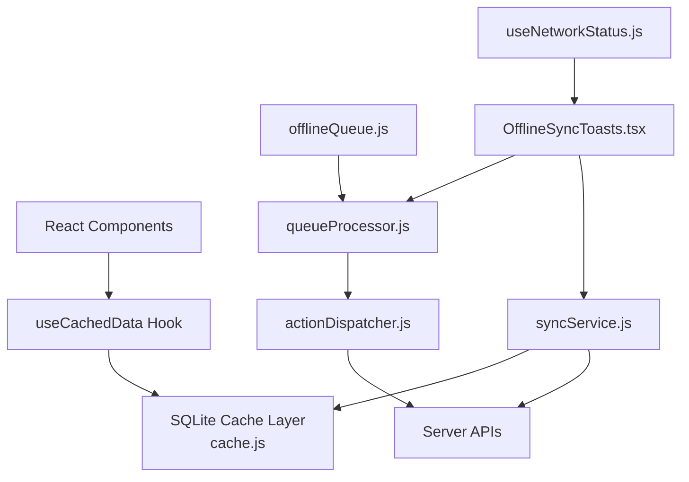
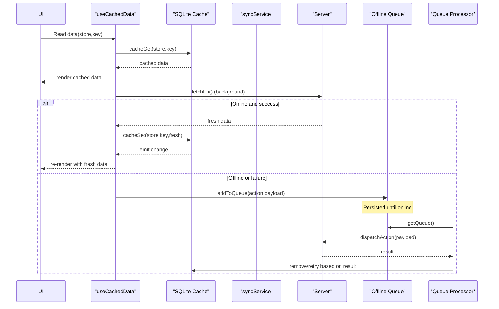
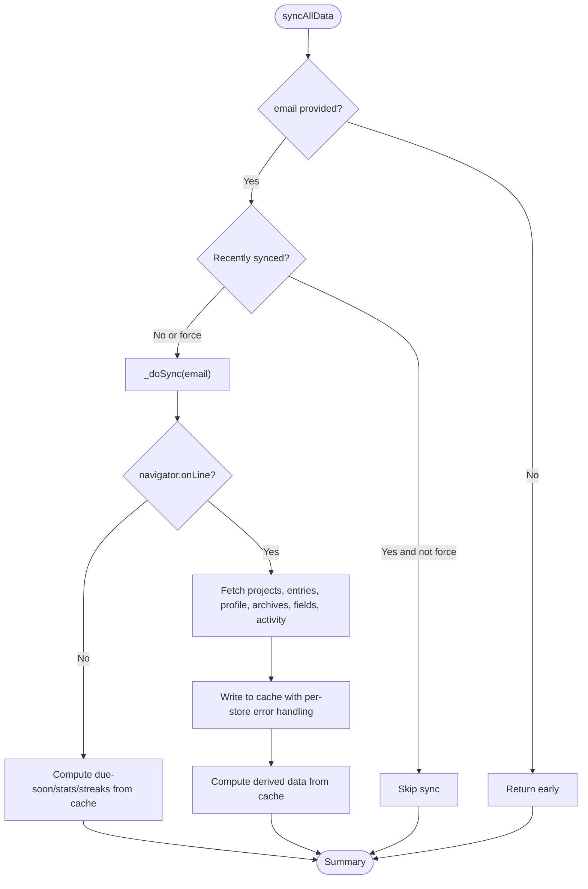
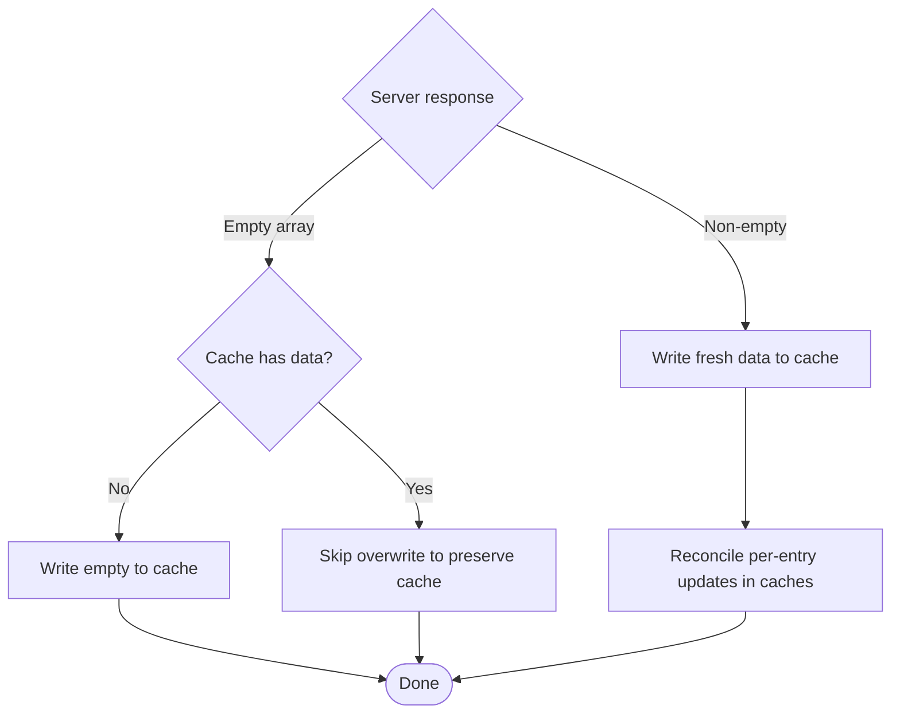
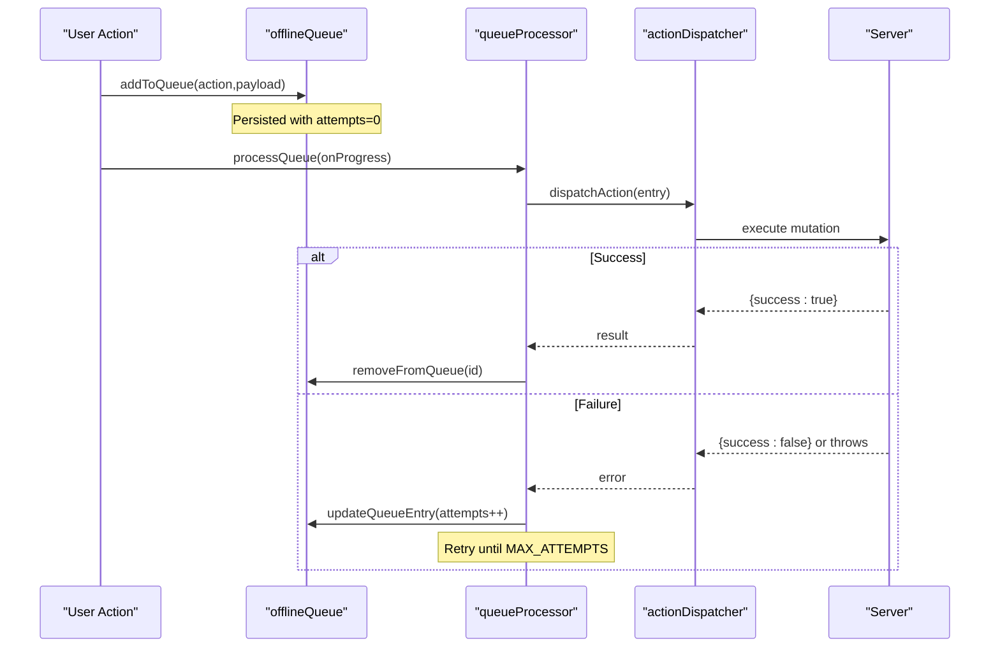
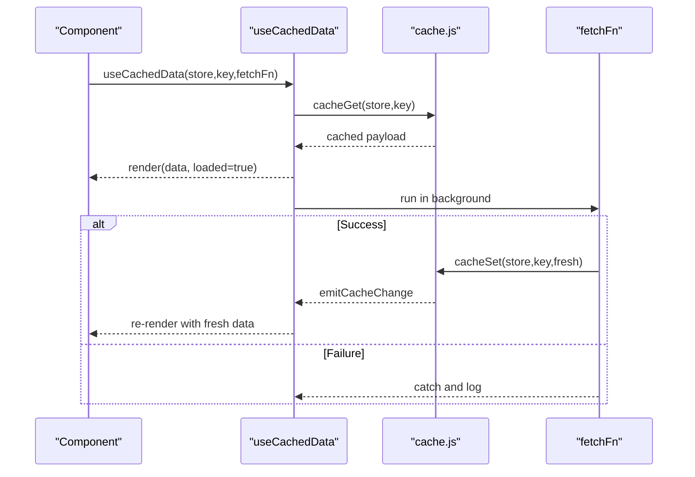
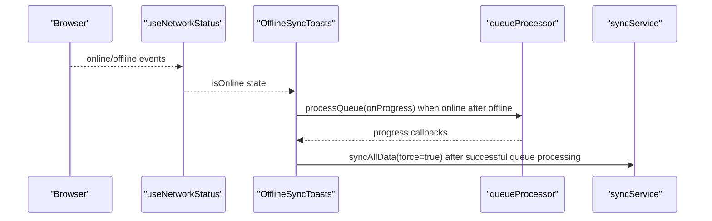
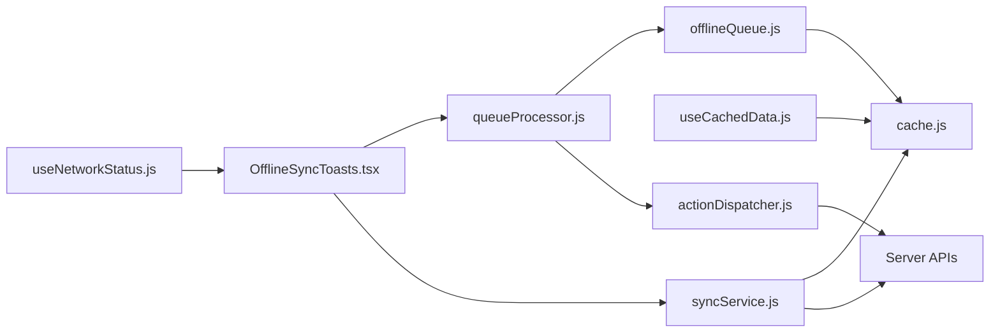
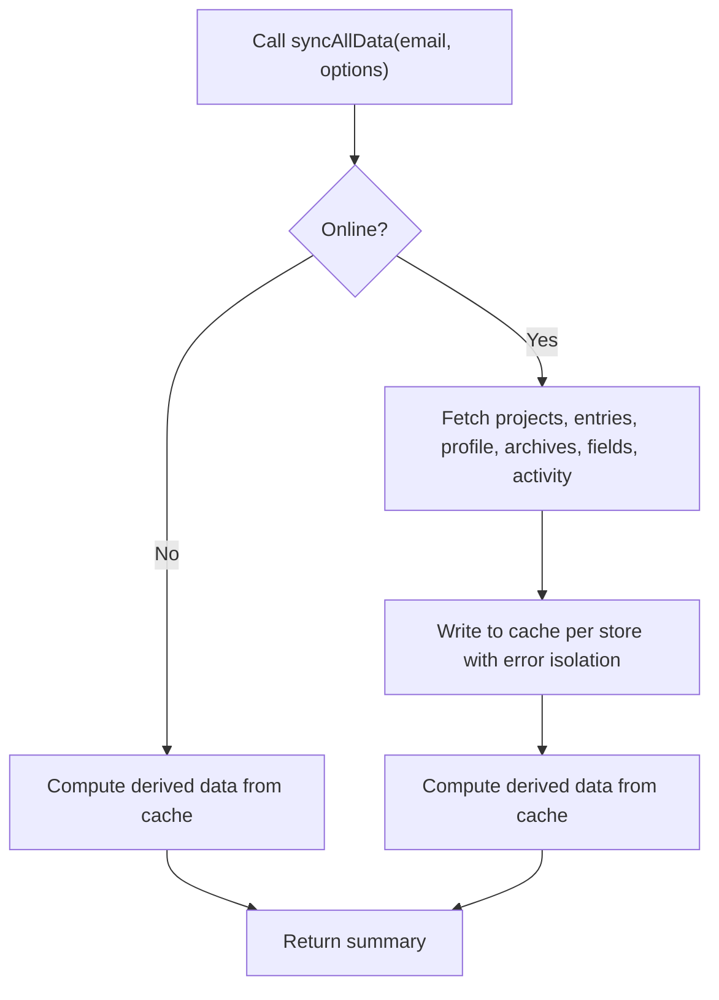
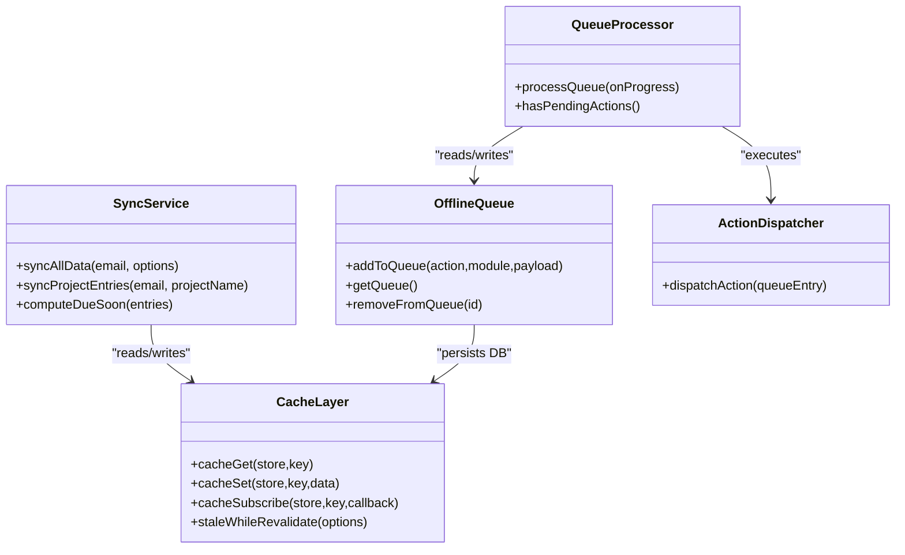

# Background Synchronization Service

<cite>
**Referenced Files in This Document**
- [syncService.js](file://frontend/src/CacheFunctions/syncService.js)
- [useCachedData.js](file://frontend/src/hooks/useCachedData.js)
- [useNetworkStatus.js](file://frontend/src/hooks/useNetworkStatus.js)
- [offlineQueue.js](file://frontend/src/CacheFunctions/offlineQueue.js)
- [queueProcessor.js](file://frontend/src/CacheFunctions/queueProcessor.js)
- [actionDispatcher.js](file://frontend/src/CacheFunctions/actionDispatcher.js)
- [cache.js](file://frontend/src/lib/cache.js)
- [OfflineSyncToasts.tsx](file://frontend/src/components/OfflineSyncToasts.tsx)
- [entries.js](file://frontend/src/functions/project/entries.js)
- [priority.js](file://frontend/src/functions/project/priority.js)
</cite>

## Table of Contents

1. [Introduction](#introduction)
2. [Project Structure](#project-structure)
3. [Core Components](#core-components)
4. [Architecture Overview](#architecture-overview)
5. [Detailed Component Analysis](#detailed-component-analysis)
6. [Dependency Analysis](#dependency-analysis)
7. [Performance Considerations](#performance-considerations)
8. [Troubleshooting Guide](#troubleshooting-guide)
9. [Conclusion](#conclusion)
10. [Appendices](#appendices)

## Introduction

This document explains the background synchronization service that maintains data consistency between a local SQLite cache and the server. It covers the sync lifecycle, conflict handling when local and remote data diverge, retry mechanisms for failed operations, integration with the useCachedData hook for automatic fetching and reactive UI updates, network status detection, automatic and manual sync triggers, error handling, timeout management, graceful degradation offline, configuration options (sync frequency, batch behavior), examples of custom sync handlers, and debugging guidance.

## Project Structure

The synchronization system is implemented in the frontend layer using a local-first pattern:

- A persistent SQLite database (via sql.js) backed by IndexedDB provides durable caching.
- A central sync service orchestrates full and partial data refreshes from the server into the cache.
- React hooks read from the cache immediately and subscribe to changes for reactive UI updates.
- An offline queue persists user actions taken while offline and replays them when connectivity returns.
- Network status hooks detect online/offline transitions to trigger or pause syncing.

**Diagram sources**

- [syncService.js:75-101](file://frontend/src/CacheFunctions/syncService.js#L75-L101)
- [cache.js:179-223](file://frontend/src/lib/cache.js#L179-L223)
- [useCachedData.js:23-76](file://frontend/src/hooks/useCachedData.js#L23-L76)
- [offlineQueue.js:21-44](file://frontend/src/CacheFunctions/offlineQueue.js#L21-L44)
- [queueProcessor.js:21-89](file://frontend/src/CacheFunctions/queueProcessor.js#L21-L89)
- [actionDispatcher.js:18-118](file://frontend/src/CacheFunctions/actionDispatcher.js#L18-L118)
- [OfflineSyncToasts.tsx:28-109](file://frontend/src/components/OfflineSyncToasts.tsx#L28-L109)
- [useNetworkStatus.js:14-40](file://frontend/src/hooks/useNetworkStatus.js#L14-L40)

**Section sources**

- [syncService.js:1-101](file://frontend/src/CacheFunctions/syncService.js#L1-L101)
- [cache.js:1-171](file://frontend/src/lib/cache.js#L1-L171)
- [useCachedData.js:1-76](file://frontend/src/hooks/useCachedData.js#L1-L76)
- [offlineQueue.js:1-145](file://frontend/src/CacheFunctions/offlineQueue.js#L1-L145)
- [queueProcessor.js:1-156](file://frontend/src/CacheFunctions/queueProcessor.js#L1-L156)
- [actionDispatcher.js:1-127](file://frontend/src/CacheFunctions/actionDispatcher.js#L1-L127)
- [OfflineSyncToasts.tsx:1-147](file://frontend/src/components/OfflineSyncToasts.tsx#L1-L147)
- [useNetworkStatus.js:1-41](file://frontend/src/hooks/useNetworkStatus.js#L1-L41)

## Core Components

- Sync Service: Orchestrates full and partial syncs, enforces throttling, handles offline mode gracefully, and computes derived data locally.
- Cache Layer: Provides SQLite-backed storage with event-driven subscriptions and persistence to IndexedDB.
- Hooks: Provide immediate cached reads, background fetches, and reactive updates via subscriptions.
- Offline Queue: Persists mutations made offline and replays them on reconnect.
- Queue Processor: Executes queued actions with retries and progress callbacks.
- Action Dispatcher: Maps action names to concrete server functions.
- Network Status Hook: Detects browser online/offline events.
- UI Integration: Displays toast notifications and triggers post-sync refresh.

**Section sources**

- [syncService.js:58-101](file://frontend/src/CacheFunctions/syncService.js#L58-L101)
- [cache.js:35-72](file://frontend/src/lib/cache.js#L35-L72)
- [useCachedData.js:23-76](file://frontend/src/hooks/useCachedData.js#L23-L76)
- [offlineQueue.js:21-44](file://frontend/src/CacheFunctions/offlineQueue.js#L21-L44)
- [queueProcessor.js:21-89](file://frontend/src/CacheFunctions/queueProcessor.js#L21-L89)
- [actionDispatcher.js:18-118](file://frontend/src/CacheFunctions/actionDispatcher.js#L18-L118)
- [useNetworkStatus.js:14-40](file://frontend/src/hooks/useNetworkStatus.js#L14-L40)
- [OfflineSyncToasts.tsx:28-109](file://frontend/src/components/OfflineSyncToasts.tsx#L28-L109)

## Architecture Overview

The system follows a local-first architecture with stale-while-revalidate semantics:

- Reads come from the local cache instantly; components subscribe to cache changes for reactive updates.
- Writes are optimistic: they update the cache first, then attempt server sync; failures are queued for later replay.
- Full syncs are throttled and can be forced; partial syncs target specific resources.
- Derived data (due-soon, stats, streaks) is computed locally from cached entries.
- On reconnect, queued actions are processed with retries; successful syncs trigger a full refresh.

**Diagram sources**

- [useCachedData.js:23-76](file://frontend/src/hooks/useCachedData.js#L23-L76)
- [cache.js:179-223](file://frontend/src/lib/cache.js#L179-L223)
- [syncService.js:75-101](file://frontend/src/CacheFunctions/syncService.js#L75-L101)
- [offlineQueue.js:21-44](file://frontend/src/CacheFunctions/offlineQueue.js#L21-L44)
- [queueProcessor.js:21-89](file://frontend/src/CacheFunctions/queueProcessor.js#L21-L89)
- [actionDispatcher.js:18-118](file://frontend/src/CacheFunctions/actionDispatcher.js#L18-L118)

## Detailed Component Analysis

### Sync Lifecycle

- Entry point: syncAllData(email, options). Prevents duplicate concurrent syncs and throttles frequent calls.
- Offline path: If navigator.onLine is false, skip server requests and compute derived data from existing cache.
- Online path: Fetch projects, all entries, profile, archives, fields, activity; write to cache with per-store error isolation; compute derived data (due-soon, stats, streaks) from cache.
- Partial sync: syncProjectEntries(email, projectName) refreshes a single project’s entries and archived entries.

**Diagram sources**

- [syncService.js:75-101](file://frontend/src/CacheFunctions/syncService.js#L75-L101)
- [syncService.js:106-387](file://frontend/src/CacheFunctions/syncService.js#L106-L387)

**Section sources**

- [syncService.js:58-101](file://frontend/src/CacheFunctions/syncService.js#L58-L101)
- [syncService.js:106-387](file://frontend/src/CacheFunctions/syncService.js#L106-L387)
- [syncService.js:396-407](file://frontend/src/CacheFunctions/syncService.js#L396-L407)
- [syncService.js:417-449](file://frontend/src/CacheFunctions/syncService.js#L417-L449)

### Conflict Resolution Strategies

- Empty-server guard: When the server returns empty arrays but the cache has data, the sync skips overwriting to avoid race conditions (e.g., after SSE deletes cache and before server persists new state).
- Optimistic writes with server reconciliation: Mutations update cache first; if server succeeds, cache is updated with authoritative data; if server fails, the mutation is queued for retry without rolling back the optimistic change.
- Per-store error isolation: Individual store sync failures do not block others; errors are recorded in the summary.

**Diagram sources**

- [syncService.js:217-281](file://frontend/src/CacheFunctions/syncService.js#L217-L281)
- [entries.js:386-412](file://frontend/src/functions/project/entries.js#L386-L412)

**Section sources**

- [syncService.js:217-281](file://frontend/src/CacheFunctions/syncService.js#L217-L281)
- [entries.js:386-412](file://frontend/src/functions/project/entries.js#L386-L412)

### Retry Mechanisms for Failed Operations

- Offline queue: Actions performed offline are persisted with an attempts counter.
- Queue processor: Processes actions in FIFO order; on failure, increments attempts and either retries or removes after reaching MAX_ATTEMPTS.
- Post-sync refresh: After successful queue processing, a full sync is triggered to reconcile state.

**Diagram sources**

- [offlineQueue.js:21-44](file://frontend/src/CacheFunctions/offlineQueue.js#L21-L44)
- [queueProcessor.js:21-89](file://frontend/src/CacheFunctions/queueProcessor.js#L21-L89)
- [actionDispatcher.js:18-118](file://frontend/src/CacheFunctions/actionDispatcher.js#L18-L118)

**Section sources**

- [offlineQueue.js:21-44](file://frontend/src/CacheFunctions/offlineQueue.js#L21-L44)
- [queueProcessor.js:21-89](file://frontend/src/CacheFunctions/queueProcessor.js#L21-L89)
- [actionDispatcher.js:18-118](file://frontend/src/CacheFunctions/actionDispatcher.js#L18-L118)

### Integration with useCachedData Hook

- Immediate read: The hook reads from IndexedDB synchronously via cacheGet to render instantly.
- Reactive updates: Subscribes to cache changes; any cacheSet triggers re-renders across components.
- Background fetch: Optionally runs a fetchFn to refresh data from the server; writes to cache to propagate updates.
- Convenience hooks: useCachedProjects, useCachedEntries, useCachedProfile simplify common patterns.

**Diagram sources**

- [useCachedData.js:23-76](file://frontend/src/hooks/useCachedData.js#L23-L76)
- [cache.js:179-223](file://frontend/src/lib/cache.js#L179-L223)

**Section sources**

- [useCachedData.js:23-76](file://frontend/src/hooks/useCachedData.js#L23-L76)
- [cache.js:179-223](file://frontend/src/lib/cache.js#L179-L223)

### Network Status Detection and Automatic Sync Triggers

- Network hook: Listens to window online/offline events to track connectivity.
- Automatic triggers:
  - Offline path in sync service avoids server calls and computes derived data from cache.
  - OfflineSyncToasts component detects offline→online transitions and processes the queue; on completion, triggers a full sync refresh.

**Diagram sources**

- [useNetworkStatus.js:14-40](file://frontend/src/hooks/useNetworkStatus.js#L14-L40)
- [OfflineSyncToasts.tsx:28-109](file://frontend/src/components/OfflineSyncToasts.tsx#L28-L109)
- [queueProcessor.js:21-89](file://frontend/src/CacheFunctions/queueProcessor.js#L21-L89)
- [syncService.js:75-101](file://frontend/src/CacheFunctions/syncService.js#L75-L101)

**Section sources**

- [useNetworkStatus.js:14-40](file://frontend/src/hooks/useNetworkStatus.js#L14-L40)
- [OfflineSyncToasts.tsx:28-109](file://frontend/src/components/OfflineSyncToasts.tsx#L28-L109)
- [syncService.js:114-154](file://frontend/src/CacheFunctions/syncService.js#L114-L154)

### Manual Sync Controls

- Force sync: Call syncAllData with force=true to bypass throttle and refresh all stores.
- Partial sync: Use syncProjectEntries to refresh a specific project’s entries and archived entries.
- Progress tracking: Pass onProgress callback to observe per-store sync events.

**Section sources**

- [syncService.js:75-101](file://frontend/src/CacheFunctions/syncService.js#L75-L101)
- [syncService.js:417-449](file://frontend/src/CacheFunctions/syncService.js#L417-L449)

### Error Handling, Timeout Management, and Graceful Degradation

- Per-store error isolation: Each fetch/write is wrapped so one failure does not block others; errors are collected in the summary.
- Offline resilience: When offline, sync computes derived data from cache and avoids server calls.
- Retry policy: Offline queue entries increment attempts and retry up to MAX_ATTEMPTS; beyond that, they are removed and reported as failed.
- Timeouts: No explicit request-level timeouts are implemented in the sync service; rely on underlying fetch/network behavior and queue retries.

**Section sources**

- [syncService.js:156-213](file://frontend/src/CacheFunctions/syncService.js#L156-L213)
- [syncService.js:217-387](file://frontend/src/CacheFunctions/syncService.js#L217-L387)
- [queueProcessor.js:59-89](file://frontend/src/CacheFunctions/queueProcessor.js#L59-L89)

### Configuration Options

- Sync frequency: MIN_SYNC_INTERVAL controls throttle between full syncs; set force=true to bypass.
- Batch behavior: Archives and fields are fetched in parallel batches to reduce latency.
- Priority queuing: Queue processor executes actions in FIFO order; no priority levels are currently supported.
- Stale-while-revalidate: cache.staleWhileRevalidate supports maxAge tuning for background refresh policies.

**Section sources**

- [syncService.js:58-62](file://frontend/src/CacheFunctions/syncService.js#L58-L62)
- [syncService.js:181-203](file://frontend/src/CacheFunctions/syncService.js#L181-L203)
- [cache.js:305-346](file://frontend/src/lib/cache.js#L305-L346)

### Examples of Custom Sync Handlers

- Add a new action to the offline queue by registering it in the action dispatcher and calling addToQueue from your feature module when offline or on server failure.
- Example reference: priority.setPriority queues when offline or on failure; similar patterns apply to other modules.

**Section sources**

- [actionDispatcher.js:18-118](file://frontend/src/CacheFunctions/actionDispatcher.js#L18-L118)
- [priority.js:37-71](file://frontend/src/functions/project/priority.js#L37-L71)
- [offlineQueue.js:21-44](file://frontend/src/CacheFunctions/offlineQueue.js#L21-L44)

### Debugging Sync Issues

- Inspect sync summaries: syncAllData returns a summary with synced stores and errors; use this to identify failing stores.
- Monitor progress: Provide onProgress to observe which stores are being written.
- Check offline queue: Use getQueueLength/getQueue to inspect pending actions; clearQueue for testing.
- Verify cache subscriptions: Ensure cacheSet is called during background fetches to trigger re-renders.

**Section sources**

- [syncService.js:106-112](file://frontend/src/CacheFunctions/syncService.js#L106-L112)
- [syncService.js:128-139](file://frontend/src/CacheFunctions/syncService.js#L128-L139)
- [offlineQueue.js:135-144](file://frontend/src/CacheFunctions/offlineQueue.js#L135-L144)
- [cache.js:179-223](file://frontend/src/lib/cache.js#L179-L223)

## Dependency Analysis

**Diagram sources**

- [syncService.js:75-101](file://frontend/src/CacheFunctions/syncService.js#L75-L101)
- [cache.js:179-223](file://frontend/src/lib/cache.js#L179-L223)
- [useCachedData.js:23-76](file://frontend/src/hooks/useCachedData.js#L23-L76)
- [offlineQueue.js:21-44](file://frontend/src/CacheFunctions/offlineQueue.js#L21-L44)
- [queueProcessor.js:21-89](file://frontend/src/CacheFunctions/queueProcessor.js#L21-L89)
- [actionDispatcher.js:18-118](file://frontend/src/CacheFunctions/actionDispatcher.js#L18-L118)
- [OfflineSyncToasts.tsx:28-109](file://frontend/src/components/OfflineSyncToasts.tsx#L28-L109)
- [useNetworkStatus.js:14-40](file://frontend/src/hooks/useNetworkStatus.js#L14-L40)

**Section sources**

- [syncService.js:75-101](file://frontend/src/CacheFunctions/syncService.js#L75-L101)
- [cache.js:179-223](file://frontend/src/lib/cache.js#L179-L223)
- [useCachedData.js:23-76](file://frontend/src/hooks/useCachedData.js#L23-L76)
- [offlineQueue.js:21-44](file://frontend/src/CacheFunctions/offlineQueue.js#L21-L44)
- [queueProcessor.js:21-89](file://frontend/src/CacheFunctions/queueProcessor.js#L21-L89)
- [actionDispatcher.js:18-118](file://frontend/src/CacheFunctions/actionDispatcher.js#L18-L118)
- [OfflineSyncToasts.tsx:28-109](file://frontend/src/components/OfflineSyncToasts.tsx#L28-L109)
- [useNetworkStatus.js:14-40](file://frontend/src/hooks/useNetworkStatus.js#L14-L40)

## Performance Considerations

- Throttling: MIN_SYNC_INTERVAL prevents excessive full syncs; use force=true sparingly.
- Parallel batches: Archives and fields are fetched concurrently to reduce total sync time.
- Local computation: Derived data (due-soon, stats, streaks) is computed from cache, avoiding extra server calls.
- Stale-while-revalidate: Allows serving cached data immediately while refreshing in background; tune maxAge as needed.
- Avoid redundant writes: Empty-server guard prevents clobbering good cache data.

[No sources needed since this section provides general guidance]

## Troubleshooting Guide

- Symptom: UI shows stale data after reconnect.
  - Check: OfflineSyncToasts triggers processQueue and then syncAllData(force=true); verify progress callbacks and final refresh.
- Symptom: Actions not syncing.
  - Check: offlineQueue length and entries; ensure processQueue runs only after real offline→online transition.
- Symptom: Frequent full syncs causing network load.
  - Check: MIN_SYNC_INTERVAL usage; ensure callers pass force=true only when necessary.
- Symptom: Components not updating after background fetch.
  - Check: fetchFn calls cacheSet; cacheSubscribe emits changes; verify store/key match.

**Section sources**

- [OfflineSyncToasts.tsx:55-109](file://frontend/src/components/OfflineSyncToasts.tsx#L55-L109)
- [queueProcessor.js:21-89](file://frontend/src/CacheFunctions/queueProcessor.js#L21-L89)
- [syncService.js:75-101](file://frontend/src/CacheFunctions/syncService.js#L75-L101)
- [cache.js:179-223](file://frontend/src/lib/cache.js#L179-L223)

## Conclusion

The background synchronization service implements a robust local-first strategy with resilient offline support, reactive UI updates, and reliable retry mechanisms. By combining immediate cached reads, background fetches, and a persistent offline queue, the system ensures consistent data availability and smooth user experiences even under intermittent connectivity. Configuration knobs like sync throttling and stale-while-revalidate allow tuning performance and freshness according to application needs.

[No sources needed since this section summarizes without analyzing specific files]

## Appendices

### Data Flow Diagram: Full Sync

**Diagram sources**

- [syncService.js:75-101](file://frontend/src/CacheFunctions/syncService.js#L75-L101)
- [syncService.js:106-387](file://frontend/src/CacheFunctions/syncService.js#L106-L387)

### Class-like Relationships

**Diagram sources**

- [syncService.js:75-101](file://frontend/src/CacheFunctions/syncService.js#L75-L101)
- [cache.js:179-223](file://frontend/src/lib/cache.js#L179-L223)
- [offlineQueue.js:21-44](file://frontend/src/CacheFunctions/offlineQueue.js#L21-L44)
- [queueProcessor.js:21-89](file://frontend/src/CacheFunctions/queueProcessor.js#L21-L89)
- [actionDispatcher.js:18-118](file://frontend/src/CacheFunctions/actionDispatcher.js#L18-L118)
