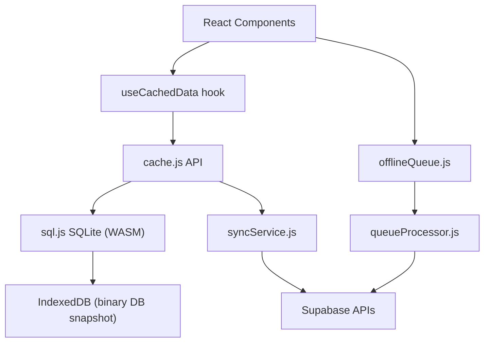
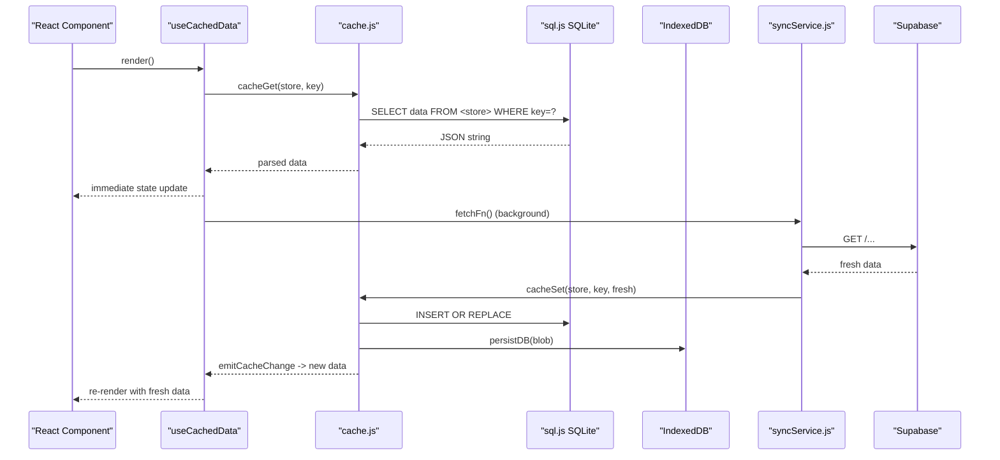
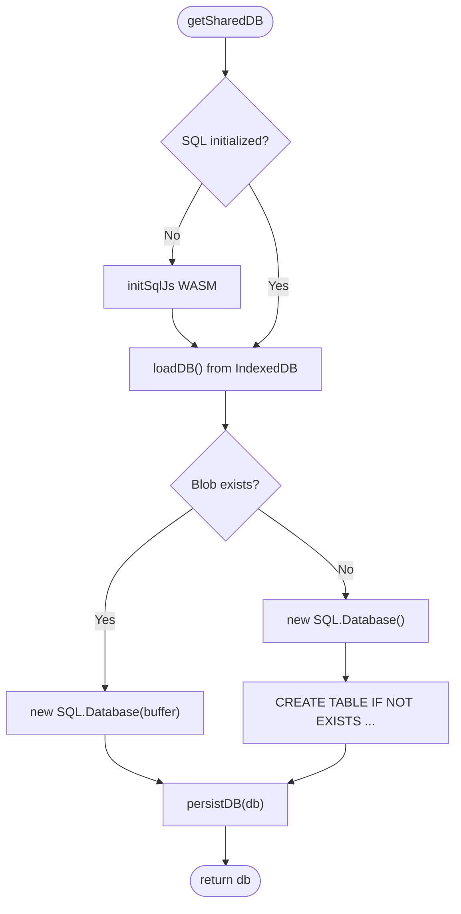
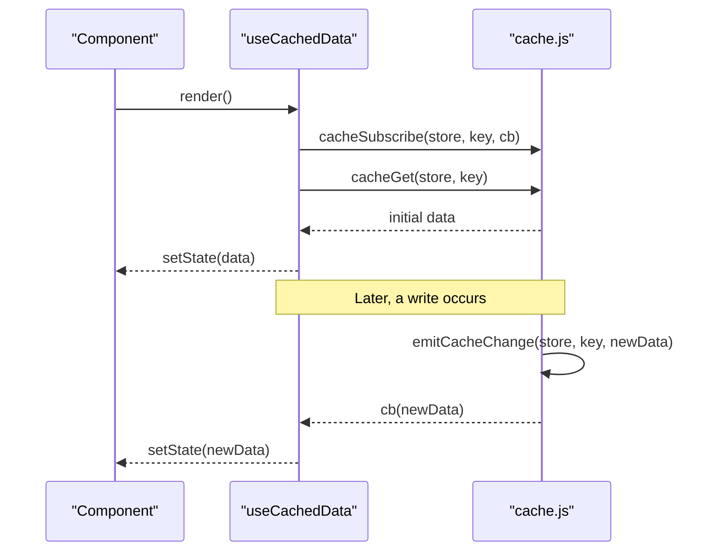
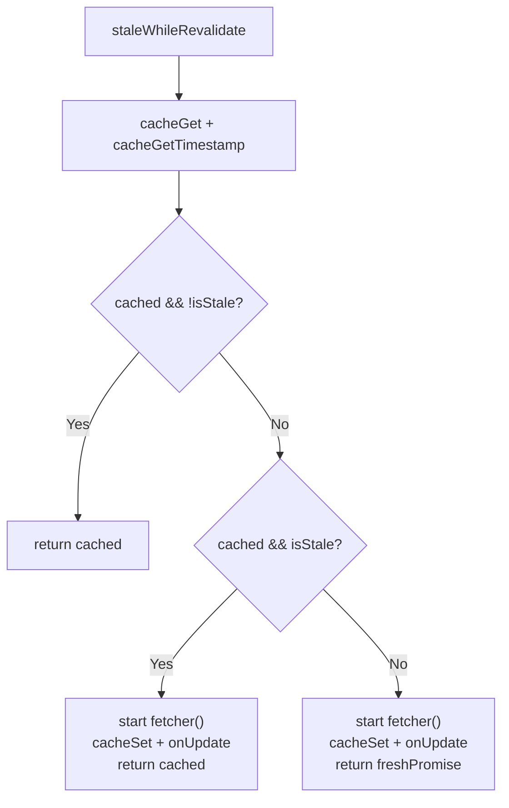
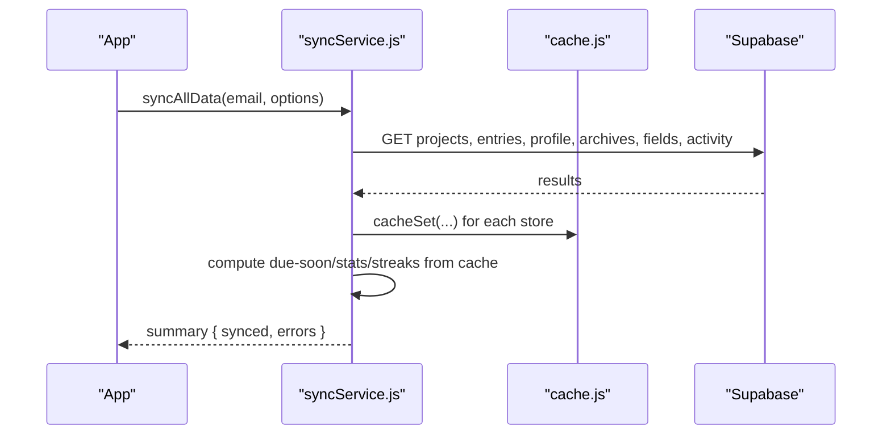
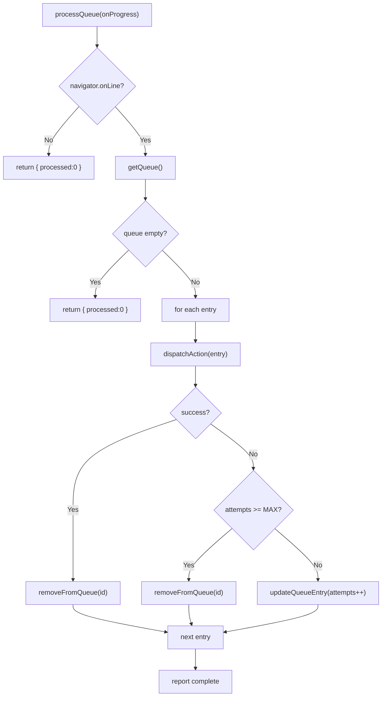
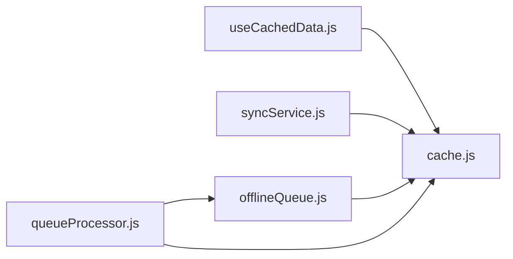

# IndexedDB Caching Layer

<cite>
**Referenced Files in This Document**
- [cache.js](file://frontend/src/lib/cache.js)
- [useCachedData.js](file://frontend/src/hooks/useCachedData.js)
- [syncService.js](file://frontend/src/CacheFunctions/syncService.js)
- [offlineQueue.js](file://frontend/src/CacheFunctions/offlineQueue.js)
- [queueProcessor.js](file://frontend/src/CacheFunctions/queueProcessor.js)
- [index.js](file://frontend/src/CacheFunctions/index.js)
- [000_baseline_full_schema.sql](file://supabase/migrations/000_baseline_full_schema.sql)
- [database.md](file://docs-site/docs/Architecture/database.md)
- [cache.integration.test.js](file://frontend/src/__integration__/cache.integration.test.js)
- [entries-crud.integration.test.js](file://frontend/src/__integration__/entries-crud.integration.test.js)
</cite>

## Table of Contents

1. [Introduction](#introduction)
2. [Project Structure](#project-structure)
3. [Core Components](#core-components)
4. [Architecture Overview](#architecture-overview)
5. [Detailed Component Analysis](#detailed-component-analysis)
6. [Dependency Analysis](#dependency-analysis)
7. [Performance Considerations](#performance-considerations)
8. [Troubleshooting Guide](#troubleshooting-guide)
9. [Conclusion](#conclusion)

## Introduction

This document explains Codacaine’s offline-first caching layer that powers instant UI and resilient operation when the network is unavailable or slow. The system uses SQLite compiled to WebAssembly (sql.js) for fast, queryable local storage, with a binary snapshot persisted to IndexedDB for durability across sessions. It mirrors the server-side Supabase schema into logical “stores” and provides a simple cache API plus an event-driven subscription model so React components can react to cache updates without polling.

Key characteristics:

- Local-first reads: return cached data immediately; background refresh fetches fresh data.
- Optimistic writes: update SQLite first, then sync to server via queued actions.
- Event-driven UI: subscribers are notified whenever cache entries change.
- Stale-while-revalidate: serve stale cache while refreshing in the background.
- Offline queue: persist mutations locally and replay them when connectivity returns.

## Project Structure

The caching layer spans several modules:

- Core cache engine and persistence: frontend/src/lib/cache.js
- React integration hook: frontend/src/hooks/useCachedData.js
- Data synchronization orchestration: frontend/src/CacheFunctions/syncService.js
- Offline mutation queue: frontend/src/CacheFunctions/offlineQueue.js
- Queue processor with retry logic: frontend/src/CacheFunctions/queueProcessor.js
- Public re-exports: frontend/src/CacheFunctions/index.js
- Server schema reference: supabase/migrations/000_baseline_full_schema.sql and docs-site/docs/Architecture/database.md

**Diagram sources**

- [cache.js:129-171](file://frontend/src/lib/cache.js#L129-L171)
- [useCachedData.js:23-75](file://frontend/src/hooks/useCachedData.js#L23-L75)
- [syncService.js:75-101](file://frontend/src/CacheFunctions/syncService.js#L75-L101)
- [offlineQueue.js:21-44](file://frontend/src/CacheFunctions/offlineQueue.js#L21-L44)
- [queueProcessor.js:21-90](file://frontend/src/CacheFunctions/queueProcessor.js#L21-L90)

**Section sources**

- [cache.js:1-389](file://frontend/src/lib/cache.js#L1-L389)
- [useCachedData.js:1-100](file://frontend/src/hooks/useCachedData.js#L1-L100)
- [syncService.js:1-466](file://frontend/src/CacheFunctions/syncService.js#L1-L466)
- [offlineQueue.js:1-145](file://frontend/src/CacheFunctions/offlineQueue.js#L1-L145)
- [queueProcessor.js:1-156](file://frontend/src/CacheFunctions/queueProcessor.js#L1-L156)
- [index.js:1-31](file://frontend/src/CacheFunctions/index.js#L1-L31)
- [000_baseline_full_schema.sql:1-318](file://supabase/migrations/000_baseline_full_schema.sql#L1-L318)
- [database.md:57-490](file://docs-site/docs/Architecture/database.md#L57-L490)

## Core Components

- SQLite-backed cache engine: initializes sql.js, loads or creates tables mirroring Supabase entities, persists to IndexedDB, and exposes cacheGet, cacheSet, cacheDelete, clearUserCache, staleWhileRevalidate, and cachedFetch.
- Event system: per-store+key subscriber map; emits changes on write/delete/clear.
- React hook: useCachedData reads from cache immediately, subscribes to updates, and triggers background fetch via provided fetcher.
- Sync service: orchestrates full or partial data syncs, computes derived views offline, and populates stores.
- Offline queue: queues mutations in SQLite; processor replays them with retries when online.

**Section sources**

- [cache.js:35-72](file://frontend/src/lib/cache.js#L35-L72)
- [cache.js:179-290](file://frontend/src/lib/cache.js#L179-L290)
- [useCachedData.js:23-75](file://frontend/src/hooks/useCachedData.js#L23-L75)
- [syncService.js:75-101](file://frontend/src/CacheFunctions/syncService.js#L75-L101)
- [offlineQueue.js:21-44](file://frontend/src/CacheFunctions/offlineQueue.js#L21-L44)
- [queueProcessor.js:21-90](file://frontend/src/CacheFunctions/queueProcessor.js#L21-L90)

## Architecture Overview

The system follows a local-first pattern:

- Reads: cacheGet returns instantly; staleWhileRevalidate may start a background fetch and call onUpdate when fresh data arrives.
- Writes: cacheSet updates SQLite immediately and persists; mutations can also be queued for later server sync.
- Subscriptions: emitCacheChange notifies all listeners for a store:key pair, enabling reactive UI updates.
- Persistence: the entire SQLite database is exported as a blob and stored in IndexedDB to survive reloads.

**Diagram sources**

- [useCachedData.js:23-75](file://frontend/src/hooks/useCachedData.js#L23-L75)
- [cache.js:179-223](file://frontend/src/lib/cache.js#L179-L223)
- [cache.js:78-119](file://frontend/src/lib/cache.js#L78-L119)
- [syncService.js:156-213](file://frontend/src/CacheFunctions/syncService.js#L156-L213)

## Detailed Component Analysis

### SQLite Initialization and Schema Mirroring

- Database initialization: getSharedDB lazily initializes sql.js, loads an existing binary from IndexedDB if present, otherwise creates a new in-memory SQLite instance and runs CREATE TABLE statements for each logical store.
- Tables mirror Supabase entities: projects, entries, all_entries, profile, search, archives, fields, notes, cache_meta, and offline_queue. Each table uses a key column and a JSON data column to store arbitrary payloads, plus metadata like timestamps where needed.
- Persistence: after creation or any mutation, persistDB exports the SQLite database to a Blob and saves it under a single key in IndexedDB. On next load, loadDB retrieves the blob and reconstructs the SQLite instance.

**Diagram sources**

- [cache.js:129-171](file://frontend/src/lib/cache.js#L129-L171)
- [cache.js:78-119](file://frontend/src/lib/cache.js#L78-L119)

**Section sources**

- [cache.js:129-171](file://frontend/src/lib/cache.js#L129-L171)
- [000_baseline_full_schema.sql:29-106](file://supabase/migrations/000_baseline_full_schema.sql#L29-L106)
- [database.md:57-207](file://docs-site/docs/Architecture/database.md#L57-L207)

### Cache API Methods

- cacheGet(store, key): reads JSON data from the specified SQLite table by key; returns null if not found.
- cacheSet(store, key, data): inserts or replaces the record, wraps non-object/array data with { key, data }, updates cache_meta timestamp, persists to IndexedDB, and emits cache change events.
- cacheDelete(store, key): deletes the row and its metadata, persists, and emits null to subscribers.
- clearUserCache(email): deletes rows matching the email across multiple stores and their metadata, persists, and emits null to subscribers for affected stores.
- cacheGetTimestamp(key): returns last updated timestamp for a key or null.
- staleWhileRevalidate({ store, key, fetcher, onUpdate, maxAge }): returns cached data immediately if available and within maxAge; starts a background fetch to refresh and calls onUpdate with fresh data; if no cache exists, waits for fetch.
- cachedFetch(store, key, fetchFn): resolves with cached data if available, otherwise fetches fresh data and caches it.

Usage examples (conceptual):

- Read projects: await cacheGet(CACHE_STORES.PROJECTS, userEmail);
- Write entry: await cacheSet(CACHE_STORES.ENTRIES, `${userEmail}:${projectName}`, { success: true, data: entries });
- Invalidate user data: await clearUserCache(userEmail);
- Refresh with staleness control: const data = await staleWhileRevalidate({ store: 'projects', key: userEmail, fetcher: () => fetchProjects(), onUpdate: setFreshProjects, maxAge: 5 * 60 * 1000 });

**Section sources**

- [cache.js:179-290](file://frontend/src/lib/cache.js#L179-L290)
- [cache.js:305-385](file://frontend/src/lib/cache.js#L305-L385)
- [cache.integration.test.js:26-178](file://frontend/src/__integration__/cache.integration.test.js#L26-L178)

### Event-Driven Subscription System

- Subscribers: cacheSubscribe(store, key, callback) registers a listener for a specific store:key combination and returns an unsubscribe function.
- Emission: emitCacheChange dispatches the latest payload to all listeners for that key. Writers (cacheSet, cacheDelete, clearUserCache) trigger emissions automatically.
- React integration: useCachedData subscribes on mount, sets initial state from cache, and updates state when new data arrives.

**Diagram sources**

- [cache.js:35-72](file://frontend/src/lib/cache.js#L35-L72)
- [useCachedData.js:23-75](file://frontend/src/hooks/useCachedData.js#L23-L75)

**Section sources**

- [cache.js:35-72](file://frontend/src/lib/cache.js#L35-L72)
- [useCachedData.js:23-75](file://frontend/src/hooks/useCachedData.js#L23-L75)

### Stale-While-Revalidate Pattern

- Behavior:
  - If cache exists and is younger than maxAge, return cached data immediately.
  - If cache exists but is stale, return cached data and still refresh in background.
  - If no cache exists, wait for fresh data.
- Updates: onUpdate receives fresh data once the background fetch completes successfully.
- Error handling: background fetch failures are logged and do not break the returned cached value.

**Diagram sources**

- [cache.js:305-346](file://frontend/src/lib/cache.js#L305-L346)

**Section sources**

- [cache.js:305-346](file://frontend/src/lib/cache.js#L305-L346)

### Data Synchronization Strategy

- Full sync: syncAllData orchestrates fetching projects, entries, profile, archives, fields, and activity, then computes derived views (due-soon, stats, streaks) locally from cached entries.
- Throttling: prevents duplicate concurrent syncs and skips recent syncs unless forced.
- Offline mode: when navigator.onLine is false, computed views are generated from existing cache without server calls.
- Per-project sync: syncProjectEntries fetches sorted unarchived and archived entries for a project and enriches overdue text.

**Diagram sources**

- [syncService.js:75-101](file://frontend/src/CacheFunctions/syncService.js#L75-L101)
- [syncService.js:156-387](file://frontend/src/CacheFunctions/syncService.js#L156-L387)

**Section sources**

- [syncService.js:75-101](file://frontend/src/CacheFunctions/syncService.js#L75-L101)
- [syncService.js:156-387](file://frontend/src/CacheFunctions/syncService.js#L156-L387)

### Offline Queue and Reconciliation

- Queuing: addToQueue persists a mutation action with payload and attempts counter in SQLite.
- Processing: processQueue iterates FIFO, dispatches actions, removes on success, increments attempts on failure, and removes after MAX_ATTEMPTS.
- Progress: callbacks report start, success, retry, and complete phases.

**Diagram sources**

- [queueProcessor.js:21-90](file://frontend/src/CacheFunctions/queueProcessor.js#L21-L90)
- [offlineQueue.js:21-44](file://frontend/src/CacheFunctions/offlineQueue.js#L21-L44)

**Section sources**

- [offlineQueue.js:21-145](file://frontend/src/CacheFunctions/offlineQueue.js#L21-L145)
- [queueProcessor.js:21-156](file://frontend/src/CacheFunctions/queueProcessor.js#L21-L156)

## Dependency Analysis

High-level dependencies:

- cache.js depends on sql.js and IndexedDB for persistence.
- useCachedData.js depends on cache.js for read/write and subscriptions.
- syncService.js imports cache functions and server fetchers to populate stores.
- offlineQueue.js and queueProcessor.js depend on cache.js for shared SQLite access and persistence.

**Diagram sources**

- [useCachedData.js:20-22](file://frontend/src/hooks/useCachedData.js#L20-L22)
- [syncService.js:38-53](file://frontend/src/CacheFunctions/syncService.js#L38-L53)
- [offlineQueue.js:9-12](file://frontend/src/CacheFunctions/offlineQueue.js#L9-L12)
- [queueProcessor.js:8-9](file://frontend/src/CacheFunctions/queueProcessor.js#L8-L9)

**Section sources**

- [useCachedData.js:20-22](file://frontend/src/hooks/useCachedData.js#L20-L22)
- [syncService.js:38-53](file://frontend/src/CacheFunctions/syncService.js#L38-L53)
- [offlineQueue.js:9-12](file://frontend/src/CacheFunctions/offlineQueue.js#L9-L12)
- [queueProcessor.js:8-9](file://frontend/src/CacheFunctions/queueProcessor.js#L8-L9)

## Performance Considerations

- Large datasets:
  - Use per-project keys (e.g., `${email}:${projectName}`) to avoid loading all entries globally when not needed.
  - Prefer targeted syncs like syncProjectEntries for detail pages instead of full syncAllData.
  - Compute derived views (due-soon, stats, streaks) locally from cached entries to minimize server round-trips.
- Memory management:
  - sql.js operates in memory; large datasets increase memory usage. Keep payloads lean and avoid storing unnecessary fields.
  - Persist only essential data; consider splitting large arrays into smaller chunks keyed appropriately.
- Browser storage limits:
  - IndexedDB has generous quotas compared to localStorage, but still finite. Monitor size and prune old or redundant entries.
  - Avoid storing very large blobs in cache_meta or repeated structures.
- Concurrency:
  - syncAllData prevents duplicate concurrent syncs and throttles frequent full syncs.
  - Background fetches via staleWhileRevalidate do not block UI rendering.

[No sources needed since this section provides general guidance]

## Troubleshooting Guide

Common issues and debugging techniques:

- Cache not updating in UI:
  - Ensure cacheSet is called with the correct store and key; verify emitCacheChange is triggered.
  - Confirm useCachedData is subscribed to the same store:key and that fetchFn writes back to cache.
- Stale data persists too long:
  - Adjust maxAge in staleWhileRevalidate to force more frequent refreshes.
  - Verify cache_get_timestamp behavior and ensure cacheSet updates timestamps.
- Offline mutations not syncing:
  - Check offlineQueue entries and ensure processQueue is invoked when connectivity returns.
  - Inspect attempt counts and error logs in queueProcessor.
- Corrupted or missing cache:
  - Use clearUserCache to reset a user’s cache and re-run syncAllData.
  - Validate IndexedDB persistence by checking blob storage and recovery on reload.
- Integration test references:
  - See cache.integration.test.js for expected behaviors of cacheSet/get/delete/timestamp/clearUserCache.
  - See entries-crud.integration.test.js for resilience guarantees when server requests fail.

**Section sources**

- [cache.integration.test.js:26-178](file://frontend/src/__integration__/cache.integration.test.js#L26-L178)
- [entries-crud.integration.test.js:306-319](file://frontend/src/__integration__/entries-crud.integration.test.js#L306-L319)
- [queueProcessor.js:59-83](file://frontend/src/CacheFunctions/queueProcessor.js#L59-L83)
- [syncService.js:114-154](file://frontend/src/CacheFunctions/syncService.js#L114-L154)

## Conclusion

Codacaine’s caching layer delivers a robust offline-first experience by combining a lightweight SQLite engine with durable IndexedDB persistence, an event-driven subscription model, and a pragmatic stale-while-revalidate strategy. The sync service centralizes data population and derived computations, while the offline queue ensures mutations survive connectivity gaps. Together, these components provide responsive UIs, reliable data consistency, and graceful degradation under poor network conditions.

[No sources needed since this section summarizes without analyzing specific files]
