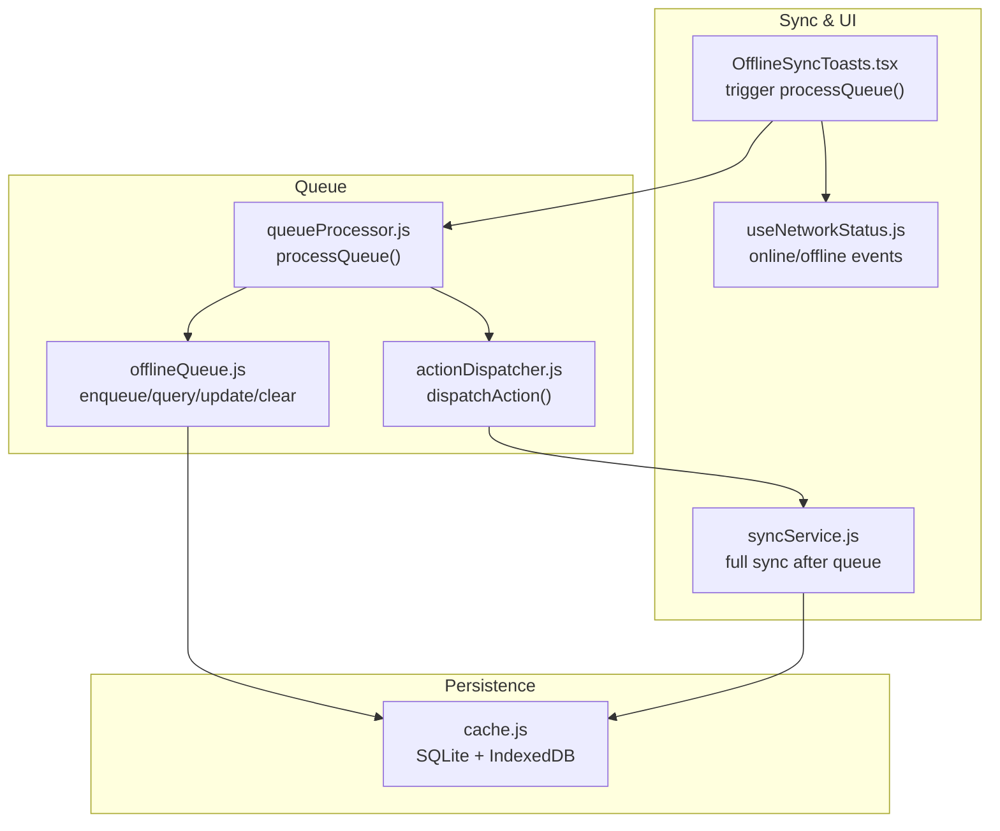
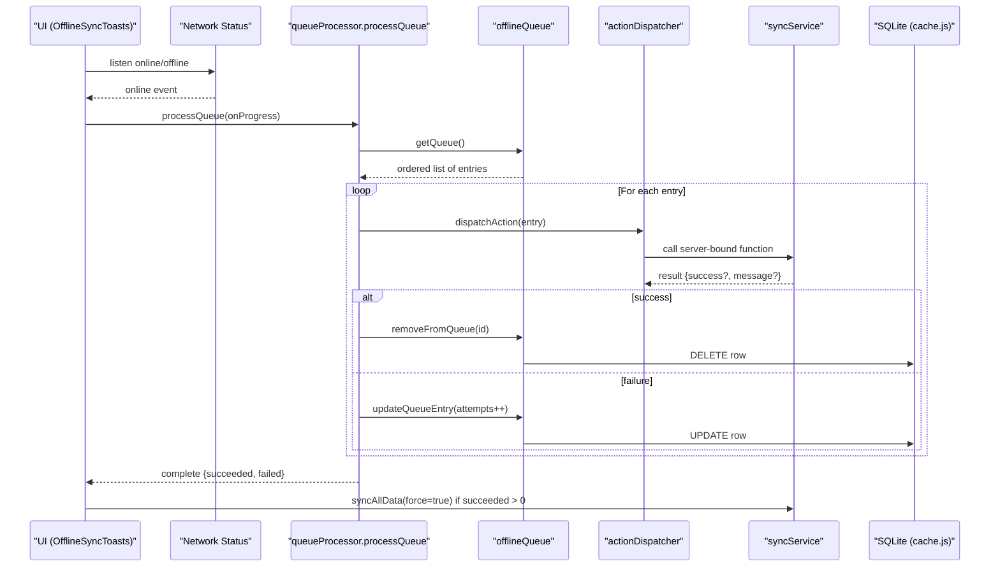
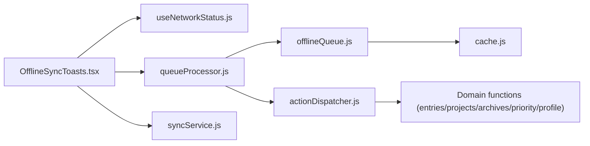

# Offline Operation Queue

<cite>
**Referenced Files in This Document**
- [offlineQueue.js](file://frontend/src/CacheFunctions/offlineQueue.js)
- [queueProcessor.js](file://frontend/src/CacheFunctions/queueProcessor.js)
- [actionDispatcher.js](file://frontend/src/CacheFunctions/actionDispatcher.js)
- [syncService.js](file://frontend/src/CacheFunctions/syncService.js)
- [cache.js](file://frontend/src/lib/cache.js)
- [useNetworkStatus.js](file://frontend/src/hooks/useNetworkStatus.js)
- [OfflineSyncToasts.tsx](file://frontend/src/components/OfflineSyncToasts.tsx)
</cite>

## Table of Contents

1. [Introduction](#introduction)
2. [Project Structure](#project-structure)
3. [Core Components](#core-components)
4. [Architecture Overview](#architecture-overview)
5. [Detailed Component Analysis](#detailed-component-analysis)
6. [Dependency Analysis](#dependency-analysis)
7. [Performance Considerations](#performance-considerations)
8. [Troubleshooting Guide](#troubleshooting-guide)
9. [Conclusion](#conclusion)
10. [Appendices](#appendices)

## Introduction

This document explains the offline operation queue system that ensures user actions are preserved during network disconnection and reliably executed when connectivity is restored. It covers queue architecture, serialization, retry behavior, conflict handling, validation, rollback strategies, monitoring, size limits, cleanup policies, and performance considerations for large queues.

## Project Structure

The offline queue spans a small set of focused modules:

- Persistence layer (SQLite via sql.js) with IndexedDB-backed persistence
- Queue manager for enqueueing, querying, updating, and removing entries
- Action dispatcher mapping queued actions to server-bound functions
- Queue processor that executes queued actions on reconnect with retries
- UI integration that triggers processing on online transitions and shows progress

**Diagram sources**

- [cache.js:15-30](file://frontend/src/lib/cache.js#L15-L30)
- [offlineQueue.js:21-44](file://frontend/src/CacheFunctions/offlineQueue.js#L21-L44)
- [queueProcessor.js:21-90](file://frontend/src/CacheFunctions/queueProcessor.js#L21-L90)
- [actionDispatcher.js:18-118](file://frontend/src/CacheFunctions/actionDispatcher.js#L18-L118)
- [syncService.js:75-101](file://frontend/src/CacheFunctions/syncService.js#L75-L101)
- [useNetworkStatus.js:14-40](file://frontend/src/hooks/useNetworkStatus.js#L14-L40)
- [OfflineSyncToasts.tsx:55-109](file://frontend/src/components/OfflineSyncToasts.tsx#L55-L109)

**Section sources**

- [cache.js:15-30](file://frontend/src/lib/cache.js#L15-L30)
- [offlineQueue.js:21-44](file://frontend/src/CacheFunctions/offlineQueue.js#L21-L44)
- [queueProcessor.js:21-90](file://frontend/src/CacheFunctions/queueProcessor.js#L21-L90)
- [actionDispatcher.js:18-118](file://frontend/src/CacheFunctions/actionDispatcher.js#L18-L118)
- [syncService.js:75-101](file://frontend/src/CacheFunctions/syncService.js#L75-L101)
- [useNetworkStatus.js:14-40](file://frontend/src/hooks/useNetworkStatus.js#L14-L40)
- [OfflineSyncToasts.tsx:55-109](file://frontend/src/components/OfflineSyncToasts.tsx#L55-L109)

## Core Components

- Offline Queue Manager: persists operations to SQLite and provides CRUD over queued items.
- Queue Processor: runs queued operations in FIFO order with retry logic and progress callbacks.
- Action Dispatcher: maps action names to concrete server-bound functions.
- Sync Service: performs full data synchronization from server to local cache; used post-sync to refresh derived data.
- Network Status Hook: detects online/offline transitions.
- UI Integration: triggers queue processing on reconnect and displays progress via toasts.

**Section sources**

- [offlineQueue.js:21-144](file://frontend/src/CacheFunctions/offlineQueue.js#L21-L144)
- [queueProcessor.js:21-156](file://frontend/src/CacheFunctions/queueProcessor.js#L21-L156)
- [actionDispatcher.js:18-127](file://frontend/src/CacheFunctions/actionDispatcher.js#L18-L127)
- [syncService.js:75-101](file://frontend/src/CacheFunctions/syncService.js#L75-L101)
- [useNetworkStatus.js:14-40](file://frontend/src/hooks/useNetworkStatus.js#L14-L40)
- [OfflineSyncToasts.tsx:55-109](file://frontend/src/components/OfflineSyncToasts.tsx#L55-L109)

## Architecture Overview

The system follows an optimistic local-first pattern:

- Mutations update local SQLite immediately and enqueue a corresponding action for later sync.
- When the browser reports online, the UI triggers queue processing.
- The processor executes actions in FIFO order, dispatches them to server-bound handlers, and updates queue state based on success or failure.
- After successful sync, a full data refresh may be performed to reconcile derived views.

**Diagram sources**

- [OfflineSyncToasts.tsx:55-109](file://frontend/src/components/OfflineSyncToasts.tsx#L55-L109)
- [queueProcessor.js:21-90](file://frontend/src/CacheFunctions/queueProcessor.js#L21-L90)
- [offlineQueue.js:50-114](file://frontend/src/CacheFunctions/offlineQueue.js#L50-L114)
- [actionDispatcher.js:112-118](file://frontend/src/CacheFunctions/actionDispatcher.js#L112-L118)
- [syncService.js:75-101](file://frontend/src/CacheFunctions/syncService.js#L75-L101)
- [cache.js:125-171](file://frontend/src/lib/cache.js#L125-L171)

## Detailed Component Analysis

### Offline Queue Manager

Responsibilities:

- Enqueue actions with metadata (action, module, payload, timestamp, attempts).
- Query pending actions in FIFO order by created_at.
- Remove entries on success, update attempts on retry, clear all for testing.
- Persist changes to IndexedDB to ensure durability across reloads.

Key behaviors:

- Insert uses JSON serialization and auto-increment id.
- Queries parse JSON back into objects.
- All mutations persist the SQLite database snapshot to IndexedDB.

Complexity:

- Enqueue: O(1) insert plus persistence overhead.
- Get queue: O(n) scan with ORDER BY created_at.
- Update/remove: O(1) per row.

Error handling:

- Errors are logged and propagated where appropriate; read methods return safe defaults.

**Section sources**

- [offlineQueue.js:21-44](file://frontend/src/CacheFunctions/offlineQueue.js#L21-L44)
- [offlineQueue.js:50-114](file://frontend/src/CacheFunctions/offlineQueue.js#L50-L114)
- [offlineQueue.js:120-144](file://frontend/src/CacheFunctions/offlineQueue.js#L120-L144)
- [cache.js:75-94](file://frontend/src/lib/cache.js#L75-L94)

### Queue Processor

Responsibilities:

- Execute queued actions when online.
- Enforce FIFO ordering.
- Retry failed actions up to a maximum number of attempts.
- Emit progress events for UI feedback.
- Return summary counts of processed/succeeded/failed.

Retry strategy:

- Each failure increments attempts; if attempts reach the configured maximum, the entry is removed and counted as failed.
- Otherwise, the entry is updated in place for future retries.

Validation and rollback:

- Actions returning explicit failure are treated as errors and retried until max attempts.
- Successful actions are removed from the queue, effectively committing the change.

Edge cases:

- If offline at start, returns early without processing.
- Empty queue returns immediately.

**Section sources**

- [queueProcessor.js:21-90](file://frontend/src/CacheFunctions/queueProcessor.js#L21-L90)
- [queueProcessor.js:97-156](file://frontend/src/CacheFunctions/queueProcessor.js#L97-L156)

### Action Dispatcher

Responsibilities:

- Map action strings to handler functions.
- Forward payloads to server-bound functions under project/profile/archives/priority domains.
- Throw on unknown actions to fail fast.

Extensibility:

- New actions can be added by registering a handler in the map and ensuring the payload shape matches expectations.

**Section sources**

- [actionDispatcher.js:18-118](file://frontend/src/CacheFunctions/actionDispatcher.js#L18-L118)

### Sync Service

Responsibilities:

- Centralized data synchronization from server to local cache.
- Throttles full syncs to avoid excessive network usage.
- Computes derived data locally (e.g., due-soon, stats, streaks) when offline or after sync.

Integration with queue:

- After successful queue processing, the UI triggers a forced full sync to refresh derived views and ensure consistency.

**Section sources**

- [syncService.js:75-101](file://frontend/src/CacheFunctions/syncService.js#L75-L101)
- [syncService.js:106-387](file://frontend/src/CacheFunctions/syncService.js#L106-L387)

### Network Status Hook and UI Integration

Responsibilities:

- Track online/offline state using browser events.
- Trigger queue processing only after a real offline→online transition.
- Show toast notifications for progress and results.
- Perform post-sync refresh when applicable.

**Section sources**

- [useNetworkStatus.js:14-40](file://frontend/src/hooks/useNetworkStatus.js#L14-L40)
- [OfflineSyncToasts.tsx:55-109](file://frontend/src/components/OfflineSyncToasts.tsx#L55-L109)

## Dependency Analysis

High-level dependencies:

- offlineQueue depends on cache.js for shared SQLite instance and persistence.
- queueProcessor depends on offlineQueue and actionDispatcher.
- actionDispatcher depends on domain functions (entries, projects, archives, priority, profile).
- OfflineSyncToasts depends on useNetworkStatus, queueProcessor, and syncService.

**Diagram sources**

- [OfflineSyncToasts.tsx:55-109](file://frontend/src/components/OfflineSyncToasts.tsx#L55-L109)
- [queueProcessor.js:21-90](file://frontend/src/CacheFunctions/queueProcessor.js#L21-L90)
- [offlineQueue.js:21-44](file://frontend/src/CacheFunctions/offlineQueue.js#L21-L44)
- [actionDispatcher.js:18-118](file://frontend/src/CacheFunctions/actionDispatcher.js#L18-L118)
- [cache.js:125-171](file://frontend/src/lib/cache.js#L125-L171)

**Section sources**

- [OfflineSyncToasts.tsx:55-109](file://frontend/src/components/OfflineSyncToasts.tsx#L55-L109)
- [queueProcessor.js:21-90](file://frontend/src/CacheFunctions/queueProcessor.js#L21-L90)
- [offlineQueue.js:21-44](file://frontend/src/CacheFunctions/offlineQueue.js#L21-L44)
- [actionDispatcher.js:18-118](file://frontend/src/CacheFunctions/actionDispatcher.js#L18-L118)
- [cache.js:125-171](file://frontend/src/lib/cache.js#L125-L171)

## Performance Considerations

- Storage backend: SQLite via sql.js with IndexedDB-backed persistence reduces I/O overhead and enables durable storage across sessions.
- Queue ordering: ORDER BY created_at ensures stable FIFO execution; consider indexing created_at for very large queues.
- Processing loop: Sequential execution avoids race conditions but can be slow for large queues; batching or chunked processing could reduce UI blocking.
- Retry policy: Fixed maximum attempts prevents infinite loops; consider exponential backoff for transient failures.
- Post-sync refresh: Full sync after queue completion reconciles derived views; throttle this to avoid redundant work.

[No sources needed since this section provides general guidance]

## Troubleshooting Guide

Common issues and diagnostics:

- Unknown action error: Indicates a mismatch between queued action name and registered handlers. Check action registration and payload shape.
- Persistent failures: Entries will be retried up to the configured maximum; inspect logs for repeated failures and verify server-side constraints.
- Stuck queue: Ensure processQueue is triggered on online transitions and that navigator.onLine reflects actual connectivity.
- Data inconsistency: After successful queue processing, trigger a full sync to refresh derived caches.

Operational tips:

- Use queue length and pending count utilities to monitor backlog.
- Clear queue in development to reset state quickly.
- Inspect persisted SQLite via exported blob for deep debugging.

**Section sources**

- [actionDispatcher.js:112-118](file://frontend/src/CacheFunctions/actionDispatcher.js#L112-L118)
- [queueProcessor.js:21-90](file://frontend/src/CacheFunctions/queueProcessor.js#L21-L90)
- [offlineQueue.js:120-144](file://frontend/src/CacheFunctions/offlineQueue.js#L120-L144)
- [cache.js:75-94](file://frontend/src/lib/cache.js#L75-L94)

## Conclusion

The offline operation queue provides robust, persistent queuing of user actions with reliable replay upon reconnection. It combines optimistic local updates, FIFO execution, bounded retries, and post-sync reconciliation to maintain data integrity and responsiveness even in unstable network conditions.

[No sources needed since this section summarizes without analyzing specific files]

## Appendices

### Queue Schema and Fields

- id: auto-increment primary key
- data: JSON object containing action, module, payload, timestamp, attempts
- created_at: integer timestamp used for FIFO ordering

**Section sources**

- [cache.js:148-163](file://frontend/src/lib/cache.js#L148-L163)
- [offlineQueue.js:21-44](file://frontend/src/CacheFunctions/offlineQueue.js#L21-L44)

### Enqueueing Custom Operations

Steps:

- Define a new action name and register it in the action dispatcher with a handler that calls the appropriate server-bound function.
- Ensure the payload includes required fields expected by the handler.
- Call the enqueue function with the action name, module, and payload to persist the operation.

References:

- Registering handlers and dispatching actions
- Enqueueing operations to the queue

**Section sources**

- [actionDispatcher.js:18-118](file://frontend/src/CacheFunctions/actionDispatcher.js#L18-L118)
- [offlineQueue.js:21-44](file://frontend/src/CacheFunctions/offlineQueue.js#L21-L44)

### Handling Queue Overflow

Current implementation does not enforce a hard size limit. To prevent unbounded growth:

- Implement a pre-enqueue check against a configurable maximum queue size.
- On overflow, either drop oldest entries, reject new enqueues, or degrade functionality with user feedback.
- Add periodic cleanup jobs to remove stale or failed entries beyond a threshold.

[No sources needed since this section proposes enhancements not present in current code]

### Conflict Detection and Resolution Strategies

- Server responses indicating failure are treated as errors and retried up to the configured maximum.
- After successful queue processing, a full sync refreshes derived data to reconcile any conflicts introduced by concurrent edits.
- For advanced conflict resolution (e.g., last-write-wins or merge strategies), extend the processor to interpret server conflict codes and apply domain-specific resolution before finalizing queue entries.

**Section sources**

- [queueProcessor.js:40-90](file://frontend/src/CacheFunctions/queueProcessor.js#L40-L90)
- [syncService.js:75-101](file://frontend/src/CacheFunctions/syncService.js#L75-L101)

### Operation Validation and Rollback Mechanisms

- Validation: Handlers should validate payloads before calling server APIs; invalid payloads will cause failures and retries.
- Rollback: On failure, entries remain in the queue for retry; on success, they are removed. For critical operations requiring atomicity, wrap multiple enqueued actions in a transaction-like sequence or implement compensating actions.

**Section sources**

- [queueProcessor.js:40-90](file://frontend/src/CacheFunctions/queueProcessor.js#L40-L90)
- [offlineQueue.js:88-114](file://frontend/src/CacheFunctions/offlineQueue.js#L88-L114)

### Monitoring, Size Limits, and Cleanup Policies

- Monitoring: Use queue length and pending count utilities to track backlog; integrate with UI to show status.
- Size limits: Not enforced currently; add checks at enqueue time and/or periodic cleanup routines.
- Cleanup: Provide a clear-all utility for development; implement retention policies for production (e.g., age-based pruning, failed-attempt thresholds).

**Section sources**

- [offlineQueue.js:120-144](file://frontend/src/CacheFunctions/offlineQueue.js#L120-L144)
- [queueProcessor.js:143-156](file://frontend/src/CacheFunctions/queueProcessor.js#L143-L156)

### Debugging Queue Processing Issues

- Verify online detection and that processQueue is invoked on reconnect.
- Inspect queue contents and attempt counts to identify problematic entries.
- Review action mappings to ensure all queued actions have registered handlers.
- Use progress callbacks to trace each step of processing and pinpoint failures.

**Section sources**

- [useNetworkStatus.js:14-40](file://frontend/src/hooks/useNetworkStatus.js#L14-L40)
- [OfflineSyncToasts.tsx:55-109](file://frontend/src/components/OfflineSyncToasts.tsx#L55-L109)
- [queueProcessor.js:21-90](file://frontend/src/CacheFunctions/queueProcessor.js#L21-L90)
- [actionDispatcher.js:112-118](file://frontend/src/CacheFunctions/actionDispatcher.js#L112-L118)
