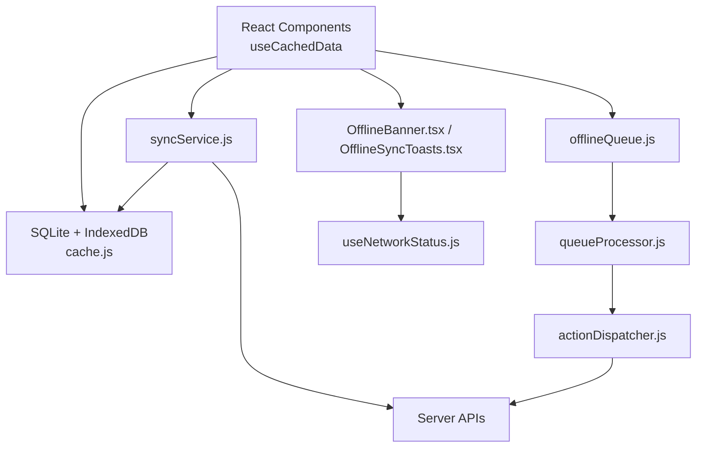
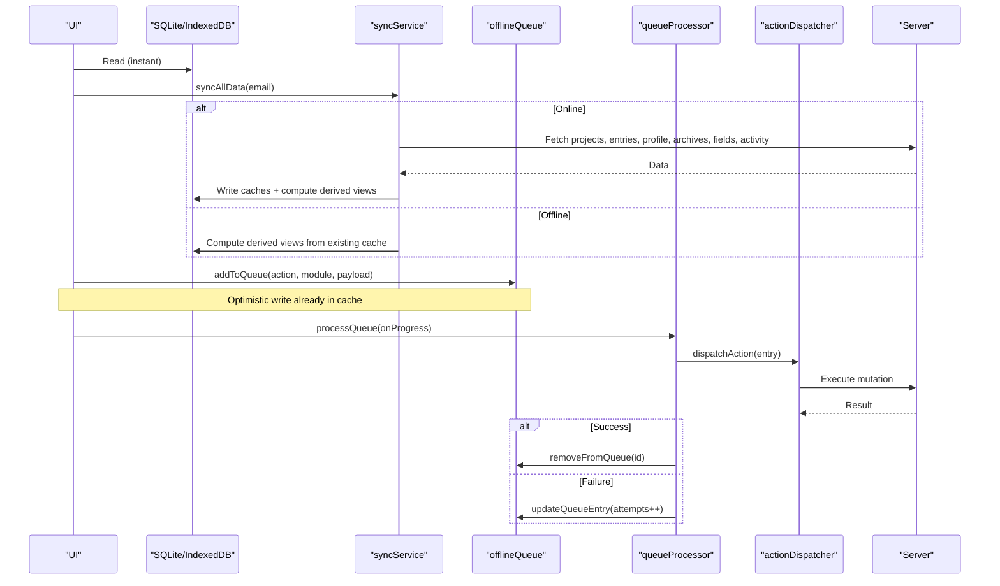
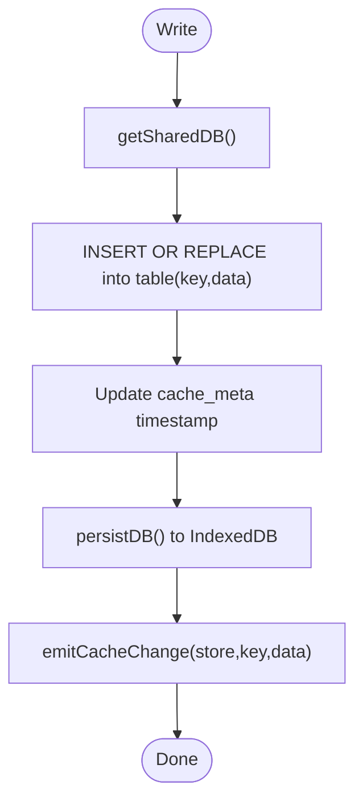
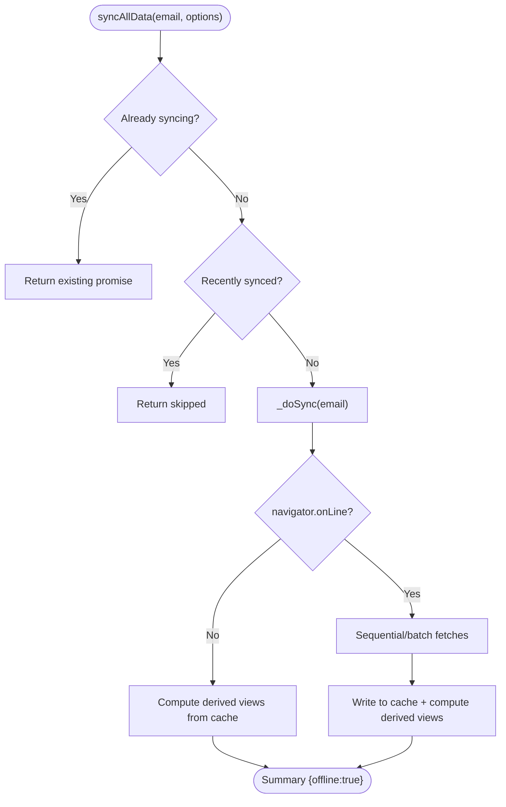
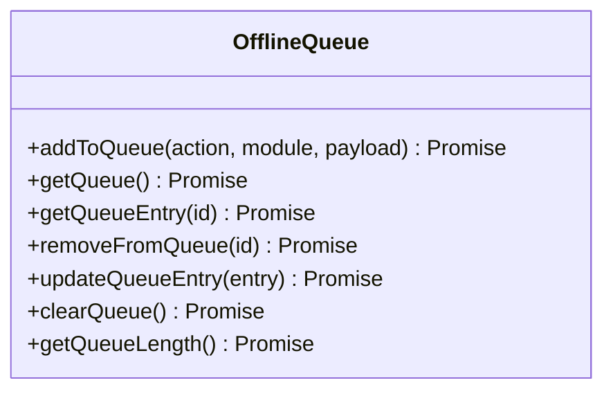
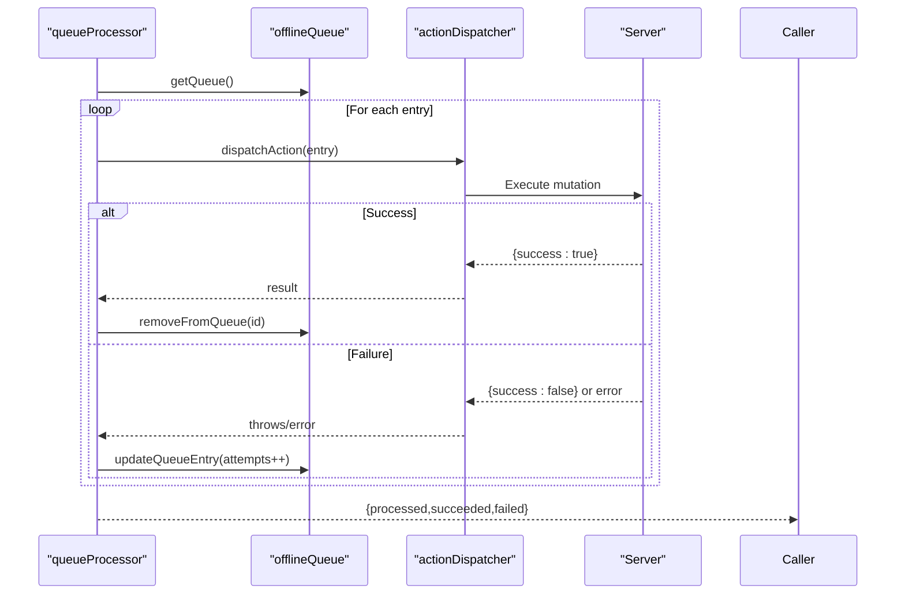
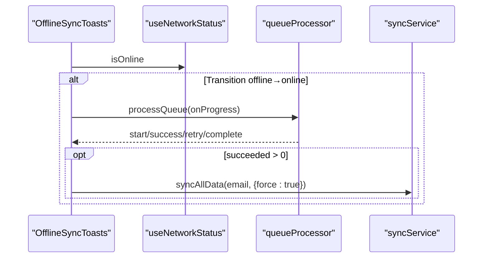
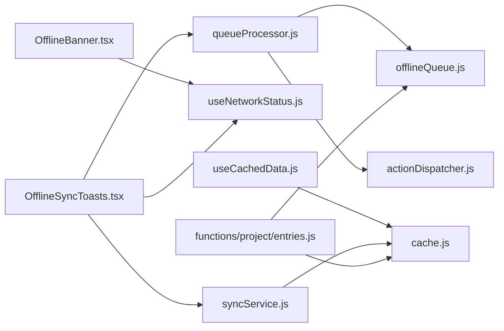

# Offline Support & Caching

<cite>
**Referenced Files in This Document**
- [index.js](file://frontend/src/CacheFunctions/index.js)
- [syncService.js](file://frontend/src/CacheFunctions/syncService.js)
- [offlineQueue.js](file://frontend/src/CacheFunctions/offlineQueue.js)
- [queueProcessor.js](file://frontend/src/CacheFunctions/queueProcessor.js)
- [actionDispatcher.js](file://frontend/src/CacheFunctions/actionDispatcher.js)
- [cache.js](file://frontend/src/lib/cache.js)
- [useCachedData.js](file://frontend/src/hooks/useCachedData.js)
- [useNetworkStatus.js](file://frontend/src/hooks/useNetworkStatus.js)
- [OfflineBanner.tsx](file://frontend/src/components/OfflineBanner.tsx)
- [OfflineSyncToasts.tsx](file://frontend/src/components/OfflineSyncToasts.tsx)
- [entries.js](file://frontend/src/functions/project/entries.js)
</cite>

## Table of Contents

1. Introduction
2. Project Structure
3. Core Components
4. Architecture Overview
5. Detailed Component Analysis
6. Dependency Analysis
7. Performance Considerations
8. Troubleshooting Guide
9. Conclusion

## Introduction

This document explains Codacaine’s offline-first architecture and how it delivers a seamless user experience when connectivity is intermittent or absent. The system centers on an IndexedDB-backed SQLite cache, a background sync service that warms and refreshes the cache, and an offline queue that persists mutations until reconnection. It also covers conflict handling, data consistency models, cache invalidation patterns, offline detection, user feedback via banners and toasts, graceful degradation, performance considerations, storage management, and troubleshooting.

## Project Structure

The offline-first stack is organized into clear layers:

- Cache layer (SQLite over IndexedDB): durable local storage with event-driven subscriptions and persistence.
- Sync service: orchestrates full and partial data synchronization from server to cache; computes derived views locally.
- Offline queue: stores pending mutations for later replay.
- Queue processor: replays queued actions with retry logic and progress callbacks.
- Action dispatcher: maps queued action names to concrete server mutation functions.
- UI integration: hooks and components that read from cache, show offline status, and surface sync progress.

**Diagram sources**

- [cache.js:129-170](file://frontend/src/lib/cache.js#L129-L170)
- [syncService.js:75-101](file://frontend/src/CacheFunctions/syncService.js#L75-L101)
- [offlineQueue.js:21-44](file://frontend/src/CacheFunctions/offlineQueue.js#L21-L44)
- [queueProcessor.js:21-90](file://frontend/src/CacheFunctions/queueProcessor.js#L21-L90)
- [actionDispatcher.js:18-118](file://frontend/src/CacheFunctions/actionDispatcher.js#L18-L118)
- [useCachedData.js:23-76](file://frontend/src/hooks/useCachedData.js#L23-L76)
- [OfflineBanner.tsx:7-51](file://frontend/src/components/OfflineBanner.tsx#L7-L51)
- [OfflineSyncToasts.tsx:28-109](file://frontend/src/components/OfflineSyncToasts.tsx#L28-L109)
- [useNetworkStatus.js:14-40](file://frontend/src/hooks/useNetworkStatus.js#L14-L40)

**Section sources**

- [index.js:1-31](file://frontend/src/CacheFunctions/index.js#L1-L31)
- [cache.js:1-31](file://frontend/src/lib/cache.js#L1-L31)

## Core Components

- SQLite/IndexedDB cache: Provides persistent, queryable storage with change subscriptions and stale-while-revalidate utilities.
- Sync service: Centralized data synchronization that populates and refreshes caches, computes derived views, and avoids clobbering good cache with empty server responses.
- Offline queue: Stores mutations as JSON records with timestamps and attempt counters for reliable replay.
- Queue processor: Executes queued actions in FIFO order with retries and progress reporting.
- Action dispatcher: Maps action strings to actual server mutation functions.
- UI integration: Hooks read from cache first and subscribe to updates; network status drives banners and toast notifications.

**Section sources**

- [cache.js:179-223](file://frontend/src/lib/cache.js#L179-L223)
- [syncService.js:75-101](file://frontend/src/CacheFunctions/syncService.js#L75-L101)
- [offlineQueue.js:21-44](file://frontend/src/CacheFunctions/offlineQueue.js#L21-L44)
- [queueProcessor.js:21-90](file://frontend/src/CacheFunctions/queueProcessor.js#L21-L90)
- [actionDispatcher.js:18-118](file://frontend/src/CacheFunctions/actionDispatcher.js#L18-L118)
- [useCachedData.js:23-76](file://frontend/src/hooks/useCachedData.js#L23-L76)

## Architecture Overview

Codacaine follows a local-first pattern:

- Reads: UI reads immediately from cache; background fetch may update cache later.
- Writes: UI writes optimistically to cache; if online, syncs to server; if offline or server fails, queues the mutation for later.
- Sync: A central service warms the cache on login and can be triggered to refresh; it computes derived views (due-soon, stats, streaks) from cached entries without extra server calls.
- Offline behavior: When offline, sync skips server requests but still computes derived views from existing cache.

**Diagram sources**

- [syncService.js:106-386](file://frontend/src/CacheFunctions/syncService.js#L106-L386)
- [offlineQueue.js:21-44](file://frontend/src/CacheFunctions/offlineQueue.js#L21-L44)
- [queueProcessor.js:21-90](file://frontend/src/CacheFunctions/queueProcessor.js#L21-L90)
- [actionDispatcher.js:18-118](file://frontend/src/CacheFunctions/actionDispatcher.js#L18-L118)
- [cache.js:179-223](file://frontend/src/lib/cache.js#L179-L223)

## Detailed Component Analysis

### SQLite/IndexedDB Cache Layer

- Storage model: A single SQLite database persisted to IndexedDB as a binary blob. Tables mirror application domains (projects, entries, all_entries, profile, search, archives, fields, notes, offline_queue, cache_meta).
- Persistence: Every write updates cache_meta timestamps and persists the DB snapshot to IndexedDB for durability across sessions.
- Subscriptions: An event system notifies subscribers when a store+key changes, enabling reactive UI updates without polling.
- Utilities: Stale-while-revalidate and cachedFetch helpers support immediate reads with background refresh.

**Diagram sources**

- [cache.js:125-170](file://frontend/src/lib/cache.js#L125-L170)
- [cache.js:194-223](file://frontend/src/lib/cache.js#L194-L223)
- [cache.js:74-94](file://frontend/src/lib/cache.js#L74-L94)

**Section sources**

- [cache.js:129-170](file://frontend/src/lib/cache.js#L129-L170)
- [cache.js:179-223](file://frontend/src/lib/cache.js#L179-L223)
- [cache.js:292-346](file://frontend/src/lib/cache.js#L292-L346)

### Sync Service

- Responsibilities:
  - Warm cache on login by fetching projects, entries, profile, archives, fields, and activity.
  - Compute derived views (due-soon, stats, streaks) from cached entries without additional server calls.
  - Prevent duplicate concurrent syncs and throttle repeated full syncs.
  - Avoid clobbering good cache with empty server responses using a sentinel skip mechanism.
- Offline mode: Skips server requests and computes derived views from existing cache.

**Diagram sources**

- [syncService.js:75-101](file://frontend/src/CacheFunctions/syncService.js#L75-L101)
- [syncService.js:106-386](file://frontend/src/CacheFunctions/syncService.js#L106-L386)

**Section sources**

- [syncService.js:75-101](file://frontend/src/CacheFunctions/syncService.js#L75-L101)
- [syncService.js:106-386](file://frontend/src/CacheFunctions/syncService.js#L106-L386)
- [syncService.js:389-407](file://frontend/src/CacheFunctions/syncService.js#L389-L407)
- [syncService.js:417-449](file://frontend/src/CacheFunctions/syncService.js#L417-L449)

### Offline Queue System

- Purpose: Persist mutations when offline or when server returns failure, then replay them when connectivity returns.
- Storage: Each entry includes action name, module, payload, timestamp, and attempts counter. Stored in SQLite offline_queue table and persisted to IndexedDB.
- Operations: Add, get, get-by-id, remove, update attempts, clear, count.

**Diagram sources**

- [offlineQueue.js:21-144](file://frontend/src/CacheFunctions/offlineQueue.js#L21-L144)

**Section sources**

- [offlineQueue.js:21-144](file://frontend/src/CacheFunctions/offlineQueue.js#L21-L144)

### Queue Processor and Action Dispatcher

- Queue processor:
  - Processes queue in FIFO order when online.
  - Dispatches each action and handles success/failure.
  - Retries up to a fixed maximum number of attempts, updating attempts and keeping failed items in queue until max retries.
  - Emits progress events for UI feedback.
- Action dispatcher:
  - Maps action strings to concrete server mutation functions (entries, projects, archives, priority, profile).
  - Throws on unknown actions to fail fast.

**Diagram sources**

- [queueProcessor.js:21-90](file://frontend/src/CacheFunctions/queueProcessor.js#L21-L90)
- [actionDispatcher.js:18-118](file://frontend/src/CacheFunctions/actionDispatcher.js#L18-L118)
- [offlineQueue.js:21-144](file://frontend/src/CacheFunctions/offlineQueue.js#L21-L144)

**Section sources**

- [queueProcessor.js:21-90](file://frontend/src/CacheFunctions/queueProcessor.js#L21-L90)
- [actionDispatcher.js:18-118](file://frontend/src/CacheFunctions/actionDispatcher.js#L18-L118)

### UI Integration: Offline Detection, Banners, and Toasts

- Network status hook: Tracks browser online/offline events and exposes a boolean state.
- Offline banner: Renders a top-of-page banner when offline to inform users.
- Sync toasts: On offline→online transition, shows toasts while processing the queue and triggers a full cache refresh after successful sync.

**Diagram sources**

- [OfflineSyncToasts.tsx:28-109](file://frontend/src/components/OfflineSyncToasts.tsx#L28-L109)
- [useNetworkStatus.js:14-40](file://frontend/src/hooks/useNetworkStatus.js#L14-L40)
- [queueProcessor.js:21-90](file://frontend/src/CacheFunctions/queueProcessor.js#L21-L90)
- [syncService.js:75-101](file://frontend/src/CacheFunctions/syncService.js#L75-L101)

**Section sources**

- [useNetworkStatus.js:14-40](file://frontend/src/hooks/useNetworkStatus.js#L14-L40)
- [OfflineBanner.tsx:7-51](file://frontend/src/components/OfflineBanner.tsx#L7-L51)
- [OfflineSyncToasts.tsx:28-109](file://frontend/src/components/OfflineSyncToasts.tsx#L28-L109)

### Data Consistency, Conflict Resolution, and Cache Invalidation

- Consistency model:
  - Local-first with optimistic writes: UI updates cache immediately; server sync happens asynchronously.
  - Derived views are recomputed from cached base data (entries), ensuring consistent stats/streaks/due-soon even offline.
- Conflict resolution:
  - On successful server response, cache is updated with authoritative server data for affected entries.
  - On server failure or network error, mutations are queued for retry rather than rolling back, preserving user intent.
  - Empty server responses do not overwrite non-empty cache to avoid race conditions during SSE-triggered refreshes.
- Cache invalidation:
  - Explicit delete clears both data and metadata and notifies subscribers.
  - Per-project and all-entries caches are updated together for mutations affecting multiple scopes.
  - Full sync can be forced to refresh all caches when needed.

**Section sources**

- [entries.js:386-447](file://frontend/src/functions/project/entries.js#L386-L447)
- [entries.js:454-517](file://frontend/src/functions/project/entries.js#L454-L517)
- [entries.js:524-579](file://frontend/src/functions/project/entries.js#L524-L579)
- [cache.js:243-290](file://frontend/src/lib/cache.js#L243-L290)
- [syncService.js:217-281](file://frontend/src/CacheFunctions/syncService.js#L217-L281)

## Dependency Analysis

High-level dependencies between modules:

**Diagram sources**

- [useCachedData.js:23-76](file://frontend/src/hooks/useCachedData.js#L23-L76)
- [cache.js:179-223](file://frontend/src/lib/cache.js#L179-L223)
- [OfflineBanner.tsx:7-51](file://frontend/src/components/OfflineBanner.tsx#L7-L51)
- [useNetworkStatus.js:14-40](file://frontend/src/hooks/useNetworkStatus.js#L14-L40)
- [OfflineSyncToasts.tsx:28-109](file://frontend/src/components/OfflineSyncToasts.tsx#L28-L109)
- [queueProcessor.js:21-90](file://frontend/src/CacheFunctions/queueProcessor.js#L21-L90)
- [offlineQueue.js:21-144](file://frontend/src/CacheFunctions/offlineQueue.js#L21-L144)
- [actionDispatcher.js:18-118](file://frontend/src/CacheFunctions/actionDispatcher.js#L18-L118)
- [syncService.js:75-101](file://frontend/src/CacheFunctions/syncService.js#L75-L101)
- [entries.js:386-447](file://frontend/src/functions/project/entries.js#L386-L447)

**Section sources**

- [index.js:1-31](file://frontend/src/CacheFunctions/index.js#L1-L31)

## Performance Considerations

- Immediate reads: UI reads from SQLite instantly; background fetch updates cache without blocking.
- Batched sync: Sync service groups independent fetches (archives, fields) to reduce round-trips.
- Derived view computation: Stats, streaks, and due-soon computed locally from cached entries to avoid extra network calls.
- Throttling: Full sync is throttled to prevent excessive refreshes; duplicate concurrent syncs are prevented.
- Persistence strategy: SQLite DB persisted to IndexedDB on every write ensures durability with minimal overhead.
- Memory footprint: Single shared DB instance reduces duplication; tables are keyed per user/email to scope data.

[No sources needed since this section provides general guidance]

## Troubleshooting Guide

Common issues and remedies:

- No data after login:
  - Ensure syncAllData is called with a valid email and that cache stores are populated.
  - Verify that sync is not being throttled or blocked by a previous in-flight sync.
- UI not updating after server changes:
  - Confirm that cacheSet is invoked with correct store/key and that subscribers are registered via useCachedData or cacheSubscribe.
- Mutations not syncing:
  - Check offline queue length and contents; ensure processQueue runs on reconnect and that actions are registered in the dispatcher.
- Conflicts or missing entries:
  - Review server response handling in mutation functions; failures should enqueue retries rather than rollback.
- Excessive sync traffic:
  - Use force flag judiciously; rely on stale-while-revalidate and derived computations to minimize network usage.

**Section sources**

- [syncService.js:75-101](file://frontend/src/CacheFunctions/syncService.js#L75-L101)
- [useCachedData.js:23-76](file://frontend/src/hooks/useCachedData.js#L23-L76)
- [queueProcessor.js:21-90](file://frontend/src/CacheFunctions/queueProcessor.js#L21-L90)
- [actionDispatcher.js:18-118](file://frontend/src/CacheFunctions/actionDispatcher.js#L18-L118)
- [entries.js:386-447](file://frontend/src/functions/project/entries.js#L386-L447)

## Conclusion

Codacaine’s offline-first design delivers a responsive, resilient user experience by prioritizing local data, computing derived views offline, and reliably reconciling changes with the server when connectivity returns. The combination of a robust SQLite/IndexedDB cache, a centralized sync service, and a persistent offline queue with retry logic ensures data consistency and graceful degradation. User feedback through banners and toasts keeps users informed, while throttling, batching, and derived computations optimize performance and storage usage.

[No sources needed since this section summarizes without analyzing specific files]
