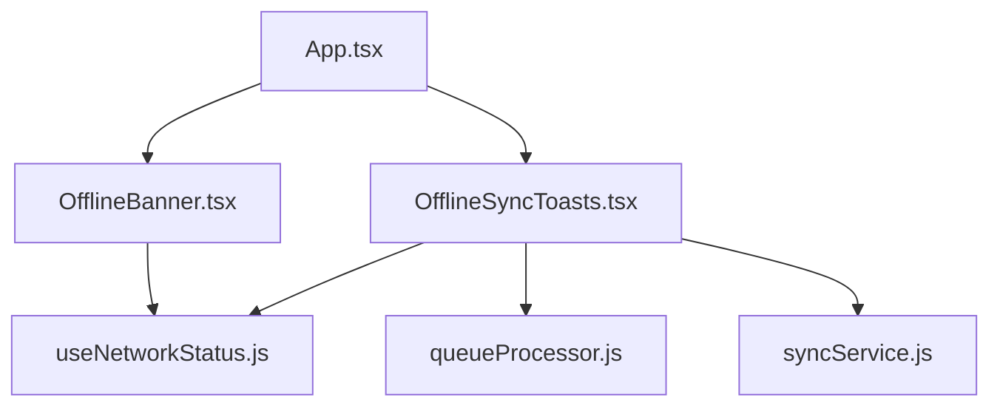
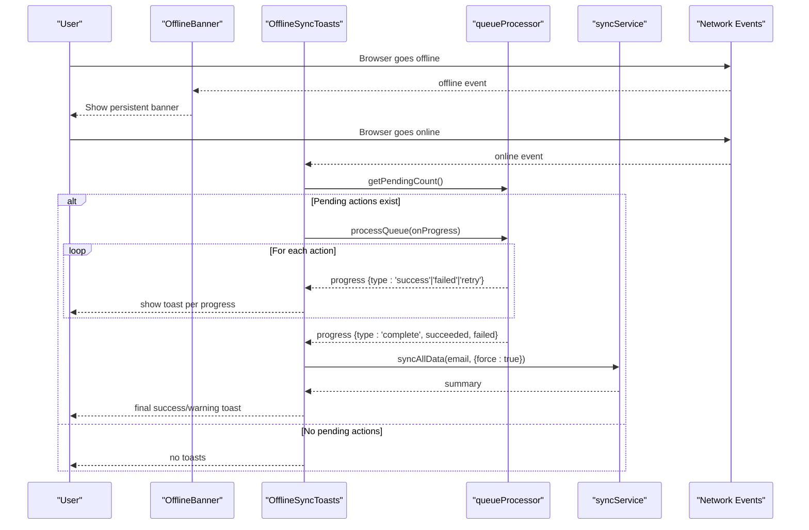
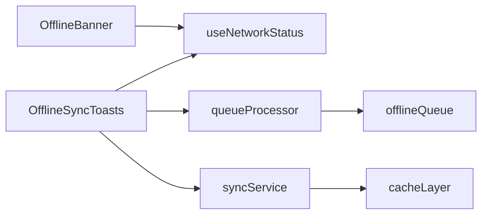

# Offline User Interface Feedback

<cite>
**Referenced Files in This Document**
- [App.tsx](file://frontend/src/App.tsx)
- [OfflineBanner.tsx](file://frontend/src/components/OfflineBanner.tsx)
- [OfflineSyncToasts.tsx](file://frontend/src/components/OfflineSyncToasts.tsx)
- [useNetworkStatus.js](file://frontend/src/hooks/useNetworkStatus.js)
- [queueProcessor.js](file://frontend/src/CacheFunctions/queueProcessor.js)
- [syncService.js](file://frontend/src/CacheFunctions/syncService.js)
</cite>

## Table of Contents

1. [Introduction](#introduction)
2. [Project Structure](#project-structure)
3. [Core Components](#core-components)
4. [Architecture Overview](#architecture-overview)
5. [Detailed Component Analysis](#detailed-component-analysis)
6. [Dependency Analysis](#dependency-analysis)
7. [Performance Considerations](#performance-considerations)
8. [Troubleshooting Guide](#troubleshooting-guide)
9. [Conclusion](#conclusion)
10. [Appendices](#appendices)

## Introduction

This document explains the user interface components that provide feedback about offline status and synchronization progress. It focuses on:

- OfflineBanner: a persistent banner shown when the application detects network disconnection.
- OfflineSyncToasts: temporary notifications for background sync operations, success confirmations, and error states.

It also covers accessibility considerations, responsive design implications, internationalization support, customization options (styling, positioning, behavior), and examples for integrating these components into custom views and handling user interactions with offline indicators.

## Project Structure

The offline feedback system is composed of:

- A network status hook that listens to browser online/offline events.
- A persistent top-of-page banner component for offline state.
- A toast notification component that triggers queue processing and displays progress updates.
- Queue processing and data synchronization services that power the toasts.

**Diagram sources**

- [App.tsx:123-131](file://frontend/src/App.tsx#L123-L131)
- [App.tsx:346-347](file://frontend/src/App.tsx#L346-L347)
- [OfflineBanner.tsx:1-51](file://frontend/src/components/OfflineBanner.tsx#L1-L51)
- [OfflineSyncToasts.tsx:8-11](file://frontend/src/components/OfflineSyncToasts.tsx#L8-L11)
- [useNetworkStatus.js:14-39](file://frontend/src/hooks/useNetworkStatus.js#L14-L39)
- [queueProcessor.js:21-90](file://frontend/src/CacheFunctions/queueProcessor.js#L21-L90)
- [syncService.js:75-101](file://frontend/src/CacheFunctions/syncService.js#L75-L101)

**Section sources**

- [App.tsx:123-131](file://frontend/src/App.tsx#L123-L131)
- [App.tsx:346-347](file://frontend/src/App.tsx#L346-L347)

## Core Components

- useNetworkStatus: Provides a boolean indicating online/offline by listening to window online/offline events.
- OfflineBanner: Renders a full-width banner at the top of the page when offline; hides itself when online.
- OfflineSyncToasts: Detects offline→online transitions, checks for pending actions, processes the queue, and shows temporary toasts for progress, success, retry, and completion.

Key responsibilities:

- Network detection via a shared hook ensures consistent state across components.
- Persistent banner communicates immediate offline status to users.
- Toasts coordinate background sync and inform users of outcomes without blocking interaction.

**Section sources**

- [useNetworkStatus.js:14-39](file://frontend/src/hooks/useNetworkStatus.js#L14-L39)
- [OfflineBanner.tsx:7-50](file://frontend/src/components/OfflineBanner.tsx#L7-L50)
- [OfflineSyncToasts.tsx:28-109](file://frontend/src/components/OfflineSyncToasts.tsx#L28-L109)

## Architecture Overview

The offline feedback architecture combines UI components with backend-agnostic queue processing and synchronization services.

**Diagram sources**

- [useNetworkStatus.js:19-36](file://frontend/src/hooks/useNetworkStatus.js#L19-L36)
- [OfflineBanner.tsx:7-50](file://frontend/src/components/OfflineBanner.tsx#L7-L50)
- [OfflineSyncToasts.tsx:28-109](file://frontend/src/components/OfflineSyncToasts.tsx#L28-L109)
- [queueProcessor.js:21-90](file://frontend/src/CacheFunctions/queueProcessor.js#L21-L90)
- [syncService.js:75-101](file://frontend/src/CacheFunctions/syncService.js#L75-L101)

## Detailed Component Analysis

### OfflineBanner

Purpose:

- Displays a persistent, high-visibility banner at the top of the page when the app is offline.
- Uses inline styles to ensure visibility and consistency.

Behavior:

- Subscribes to network status via useNetworkStatus.
- Renders nothing when online; renders banner when offline.

Customization points:

- Message text can be externalized for internationalization.
- Styling can be adapted via CSS variables or theme tokens if desired.
- Positioning is fixed to the top of the viewport; z-index ensures it overlays content.

Accessibility notes:

- The banner uses semantic HTML and an icon; consider adding aria-live or role attributes for screen readers if needed.
- Ensure sufficient color contrast for the banner background and text.

Responsive considerations:

- Full-width layout adapts naturally to mobile and desktop.
- Font size and padding are compact to avoid excessive vertical space on small screens.

Integration example:

- Already mounted globally in the application root so all pages receive offline feedback.

**Section sources**

- [OfflineBanner.tsx:7-50](file://frontend/src/components/OfflineBanner.tsx#L7-L50)
- [App.tsx:123-131](file://frontend/src/App.tsx#L123-L131)

### OfflineSyncToasts

Purpose:

- Shows temporary notifications during background synchronization after reconnecting.
- Reports progress, retries, successes, failures, and completion summaries.

Behavior:

- Tracks offline→online transitions to avoid unnecessary processing.
- Checks for pending actions and starts queue processing when available.
- Adds toasts with auto-dismiss timers and manual dismissal.
- After successful sync, triggers a full data refresh to keep caches current.

Queue processing integration:

- Uses queueProcessor to execute queued actions with retry logic and progress callbacks.
- Handles start, success, failed, retry, and complete progress types.

Post-sync refresh:

- Calls syncAllData with force option to rehydrate local cache from the server after sync completes.

Customization points:

- Toast styling (colors, radius, shadow) can be adjusted.
- Auto-dismiss duration can be tuned.
- Positioning is fixed to bottom-right; can be moved or stacked differently if needed.

Accessibility notes:

- Toasts are clickable to dismiss; ensure focus management and keyboard accessibility for removal.
- Consider using aria-live regions for dynamic announcements to assistive technologies.

Responsive considerations:

- Max width prevents overflow on narrow screens.
- Stacked toasts maintain readability on mobile.

Integration example:

- Mounted once in the application root to cover all routes.

**Section sources**

- [OfflineSyncToasts.tsx:28-109](file://frontend/src/components/OfflineSyncToasts.tsx#L28-L109)
- [queueProcessor.js:21-90](file://frontend/src/CacheFunctions/queueProcessor.js#L21-L90)
- [syncService.js:75-101](file://frontend/src/CacheFunctions/syncService.js#L75-L101)
- [App.tsx:346-347](file://frontend/src/App.tsx#L346-L347)

### Network Status Hook

Purpose:

- Centralizes network connectivity detection using browser events.

Behavior:

- Initializes state from navigator.onLine.
- Listens to online/offline events and updates state accordingly.
- Cleans up event listeners on unmount.

Usage:

- Consumed by both OfflineBanner and OfflineSyncToasts to react to connectivity changes.

**Section sources**

- [useNetworkStatus.js:14-39](file://frontend/src/hooks/useNetworkStatus.js#L14-L39)

### Queue Processor

Purpose:

- Processes the offline action queue in FIFO order with retry logic and progress reporting.

Behavior:

- Skips processing if offline.
- Executes actions via dispatchAction and removes entries on success.
- Retries failed actions up to a maximum number of attempts.
- Emits progress events for success, failure, retry, and completion.

Message formatting:

- Produces human-readable messages based on action type and payload context.

**Section sources**

- [queueProcessor.js:21-90](file://frontend/src/CacheFunctions/queueProcessor.js#L21-L90)
- [queueProcessor.js:97-137](file://frontend/src/CacheFunctions/queueProcessor.js#L97-L137)

### Sync Service

Purpose:

- Centralizes data synchronization between server and IndexedDB.
- Warms up local cache on login and supports forced refreshes.

Behavior:

- Prevents duplicate concurrent syncs and throttles frequent syncs.
- Performs sequential fetches with individual error handling.
- Computes derived data (due-soon, stats, streaks) from cached entries.
- Supports offline mode by computing derived data locally without server calls.

Integration with toasts:

- Triggered after queue processing to refresh all data and ensure UI reflects latest server state.

**Section sources**

- [syncService.js:75-101](file://frontend/src/CacheFunctions/syncService.js#L75-L101)
- [syncService.js:106-387](file://frontend/src/CacheFunctions/syncService.js#L106-L387)

## Dependency Analysis

The offline feedback system has clear dependencies:

- Components depend on the network status hook for real-time connectivity.
- Toasts depend on queue processing and sync services to drive background operations.
- Queue processor depends on action dispatcher and offline queue storage.
- Sync service depends on various data-fetch functions and caching layer.

**Diagram sources**

- [OfflineBanner.tsx:1-51](file://frontend/src/components/OfflineBanner.tsx#L1-L51)
- [OfflineSyncToasts.tsx:8-11](file://frontend/src/components/OfflineSyncToasts.tsx#L8-L11)
- [queueProcessor.js:8-9](file://frontend/src/CacheFunctions/queueProcessor.js#L8-L9)
- [syncService.js:52-54](file://frontend/src/CacheFunctions/syncService.js#L52-L54)

**Section sources**

- [OfflineBanner.tsx:1-51](file://frontend/src/components/OfflineBanner.tsx#L1-L51)
- [OfflineSyncToasts.tsx:8-11](file://frontend/src/components/OfflineSyncToasts.tsx#L8-L11)
- [queueProcessor.js:8-9](file://frontend/src/CacheFunctions/queueProcessor.js#L8-L9)
- [syncService.js:52-54](file://frontend/src/CacheFunctions/syncService.js#L52-L54)

## Performance Considerations

- Avoid redundant syncs: The sync service throttles full syncs and prevents concurrent requests.
- Efficient queue processing: Actions are processed sequentially with retry limits to minimize server load.
- Toast auto-dismiss reduces memory pressure from long-lived notifications.
- Offline computation: Derived data is computed locally when offline to avoid unnecessary network calls.

[No sources needed since this section provides general guidance]

## Troubleshooting Guide

Common issues and resolutions:

- Toasts not appearing after reconnect:
  - Verify that there are pending actions in the queue before reconnect.
  - Check that the offline→online transition is detected and wasOffline flag resets correctly.
- Excessive retries:
  - Review action failures and adjust retry limits or error handling in queue processing.
- Post-sync refresh not updating UI:
  - Ensure syncAllData is called with force option after successful queue processing.
  - Confirm that session retrieval succeeds and email is available.

Operational tips:

- Inspect console logs for network events and queue processing steps.
- Validate that event listeners are properly attached and removed to prevent leaks.

**Section sources**

- [OfflineSyncToasts.tsx:28-109](file://frontend/src/components/OfflineSyncToasts.tsx#L28-L109)
- [queueProcessor.js:21-90](file://frontend/src/CacheFunctions/queueProcessor.js#L21-L90)
- [syncService.js:75-101](file://frontend/src/CacheFunctions/syncService.js#L75-L101)

## Conclusion

The offline feedback system provides robust user signaling through a persistent banner and contextual toasts. It integrates seamlessly with queue processing and synchronization services to keep the application functional and informative under varying network conditions. With thoughtful customization and accessibility enhancements, these components can deliver a reliable and user-friendly experience across devices and locales.

[No sources needed since this section summarizes without analyzing specific files]

## Appendices

### Accessibility Features

- Semantic markup: Use appropriate roles and labels for banners and toasts.
- Keyboard navigation: Ensure toasts are dismissible via keyboard and focus is managed.
- Screen reader support: Consider aria-live regions for dynamic toast announcements.
- Color contrast: Maintain WCAG AA compliance for banner and toast colors.

[No sources needed since this section provides general guidance]

### Responsive Design Considerations

- Banner: Full-width and compact to avoid layout shifts on small screens.
- Toasts: Constrained max width and stacked layout for readability on mobile.
- Touch targets: Ensure interactive elements meet minimum touch target sizes.

[No sources needed since this section provides general guidance]

### Internationalization Support

- Externalize message strings for both banner and toasts to support multiple languages.
- Use locale-aware formatting for numbers and dates in messages where applicable.
- Provide translation keys for action-specific messages generated by queue processing.

[No sources needed since this section provides general guidance]

### Customization Options

Styling:

- Adjust banner gradient, font size, and padding to match brand guidelines.
- Customize toast colors, border radius, and shadows for different states (success, error, warning).

Positioning:

- Move banner to other positions (e.g., sticky below header) if needed.
- Reposition toasts (e.g., top-center) and adjust stacking order.

Behavior:

- Modify auto-dismiss duration for toasts.
- Add retry prompts or manual retry buttons within toasts for failed actions.
- Integrate analytics or logging for user interactions with offline indicators.

[No sources needed since this section provides general guidance]

### Integration Examples

Mounting globally:

- Place OfflineBanner and OfflineSyncToasts in the application root to ensure coverage across all routes.

Adding to custom views:

- Import and render OfflineBanner near the top of a view if you need localized offline messaging.
- Use OfflineSyncToasts only once at the app level; avoid duplicating instances.

Handling user interactions:

- Make toasts dismissible via click or keyboard.
- Provide explicit retry actions for failed actions if required by UX.

**Section sources**

- [App.tsx:123-131](file://frontend/src/App.tsx#L123-L131)
- [App.tsx:346-347](file://frontend/src/App.tsx#L346-L347)
