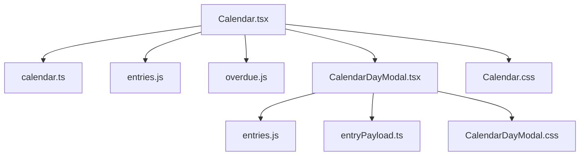
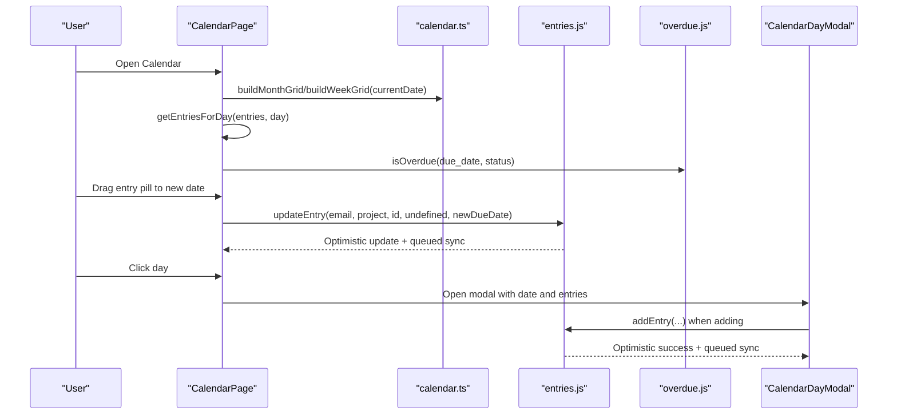
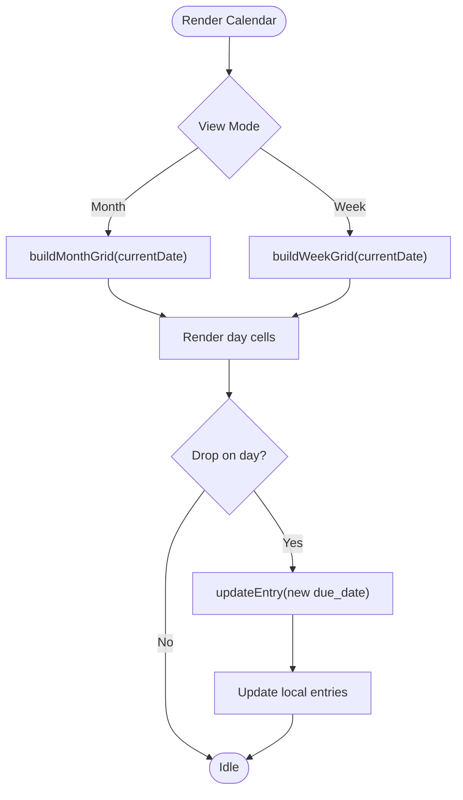
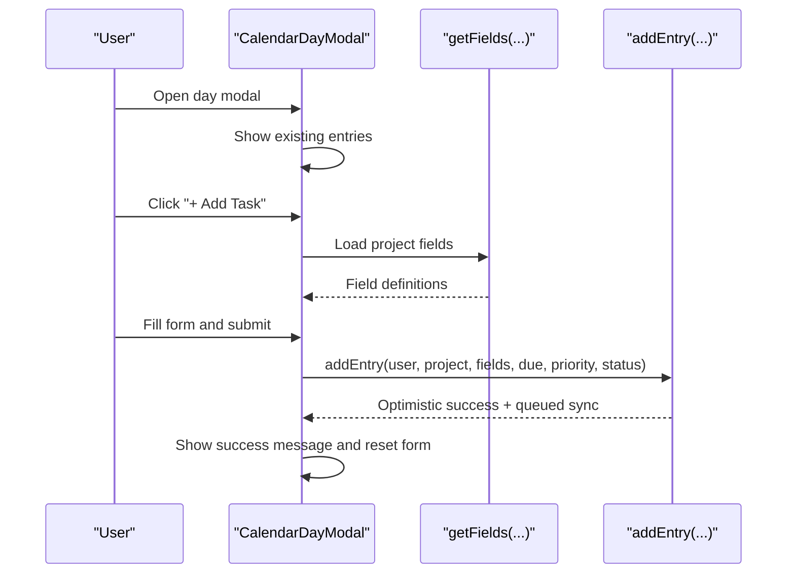
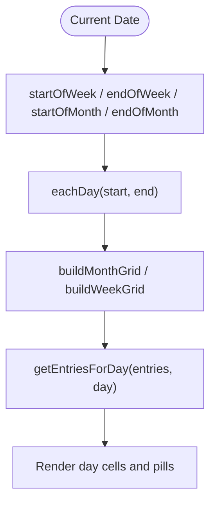
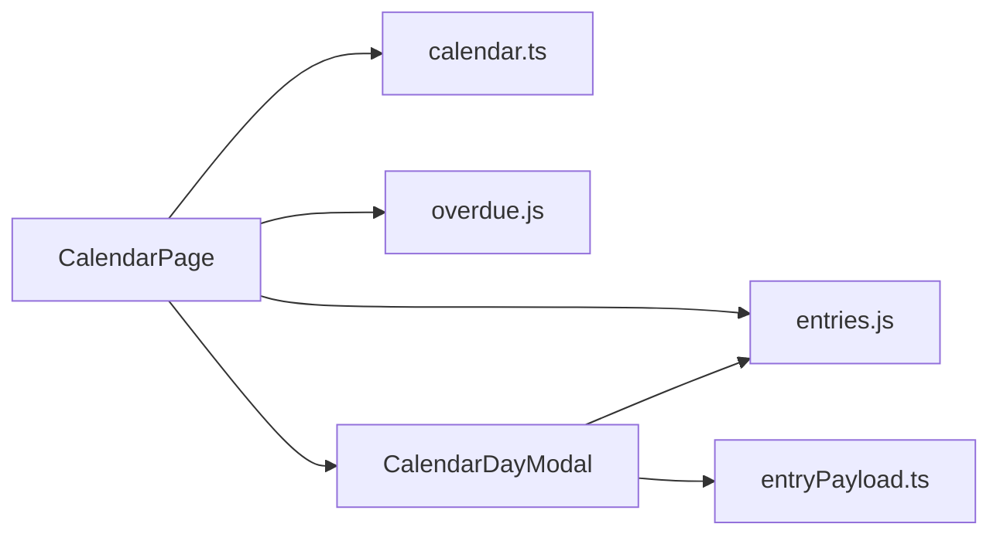

# Calendar View

<cite>
**Referenced Files in This Document**
- [Calendar.tsx](file://frontend/src/pages/Calendar.tsx)
- [Calendar.css](file://frontend/src/pages/Calendar.css)
- [CalendarDayModal.tsx](file://frontend/src/pages/CalendarDayModal.tsx)
- [CalendarDayModal.css](file://frontend/src/pages/CalendarDayModal.css)
- [calendar.ts](file://frontend/src/lib/calendar.ts)
- [entries.js](file://frontend/src/functions/project/entries.js)
- [overdue.js](file://frontend/src/functions/dashboard/overdue.js)
- [entryPayload.ts](file://frontend/src/lib/entryPayload.ts)
</cite>

## Table of Contents

1. Introduction
2. Project Structure
3. Core Components
4. Architecture Overview
5. Detailed Component Analysis
6. Dependency Analysis
7. Performance Considerations
8. Troubleshooting Guide
9. Conclusion

## Introduction

This document explains the Calendar view implementation in Codacaine, focusing on month and week views, drag-and-drop rescheduling, event visualization, grid generation, date calculations, entry positioning logic, day modal functionality (view/edit), form handling and validation, CSS styling for responsive layouts, overdue highlighting, navigation, date formatting utilities, and integration with the entry management system.

## Project Structure

The Calendar feature is implemented as a React page with supporting utilities and styles:

- Page component: renders toolbar, grid, entries, and modal trigger
- Utility module: pure date helpers and grid builders
- Day modal: view existing entries and add new ones with dynamic fields
- Styles: responsive calendar grid, pills, and modal UI
- Integration: reads/writes via cache and project service functions

**Diagram sources**

- [Calendar.tsx:1-516](file://frontend/src/pages/Calendar.tsx#L1-L516)
- [calendar.ts:1-158](file://frontend/src/lib/calendar.ts#L1-L158)
- [entries.js:1-596](file://frontend/src/functions/project/entries.js#L1-L596)
- [overdue.js:1-37](file://frontend/src/functions/dashboard/overdue.js#L1-L37)
- [entryPayload.ts:1-66](file://frontend/src/lib/entryPayload.ts#L1-L66)
- [Calendar.css:1-595](file://frontend/src/pages/Calendar.css#L1-L595)
- [CalendarDayModal.css:1-418](file://frontend/src/pages/CalendarDayModal.css#L1-L418)

**Section sources**

- [Calendar.tsx:1-516](file://frontend/src/pages/Calendar.tsx#L1-L516)
- [calendar.ts:1-158](file://frontend/src/lib/calendar.ts#L1-L158)
- [entries.js:1-596](file://frontend/src/functions/project/entries.js#L1-L596)
- [overdue.js:1-37](file://frontend/src/functions/dashboard/overdue.js#L1-L37)
- [entryPayload.ts:1-66](file://frontend/src/lib/entryPayload.ts#L1-L66)
- [Calendar.css:1-595](file://frontend/src/pages/Calendar.css#L1-L595)
- [CalendarDayModal.css:1-418](file://frontend/src/pages/CalendarDayModal.css#L1-L418)

## Core Components

- CalendarPage: main container that loads entries from cache, builds month/week grids, handles navigation, drag-and-drop rescheduling, and opens the day modal.
- CalendarDayCell and CalendarEntryPill: render per-day cells and draggable entry pills with status and overdue indicators.
- CalendarDayModal: shows entries for a selected date, allows adding new entries with dynamic project fields, due date, priority, and status; validates required fields before submission.
- calendar.ts: pure date helpers for grid generation, date math, formatting, and title extraction.
- entries.js: optimistic CRUD operations with IndexedDB caching and background server sync; used by both CalendarPage (update due date) and CalendarDayModal (add entry).
- overdue.js: determines if an entry or day is overdue based on due date and status.
- entryPayload.ts: protects against rendering raw notes payloads as summaries.

**Section sources**

- [Calendar.tsx:193-516](file://frontend/src/pages/Calendar.tsx#L193-L516)
- [CalendarDayModal.tsx:86-436](file://frontend/src/pages/CalendarDayModal.tsx#L86-L436)
- [calendar.ts:26-158](file://frontend/src/lib/calendar.ts#L26-L158)
- [entries.js:129-448](file://frontend/src/functions/project/entries.js#L129-L448)
- [overdue.js:8-17](file://frontend/src/functions/dashboard/overdue.js#L8-L17)
- [entryPayload.ts:16-64](file://frontend/src/lib/entryPayload.ts#L16-L64)

## Architecture Overview

The Calendar view follows a unidirectional data flow:

- Load entries from IndexedDB cache; subscribe to changes to re-render.
- Build a grid of dates using pure helpers.
- Render each day cell with visible entry pills; hide overflow behind a “more” button.
- Dragging an entry pill updates its due_date via updateEntry; optimistic UI updates are applied immediately and synced to the server.
- Clicking a day opens the day modal to view/add entries; adding triggers optimistic writes and background sync.

**Diagram sources**

- [Calendar.tsx:280-343](file://frontend/src/pages/Calendar.tsx#L280-L343)
- [calendar.ts:145-158](file://frontend/src/lib/calendar.ts#L145-L158)
- [entries.js:287-448](file://frontend/src/functions/project/entries.js#L287-L448)
- [overdue.js:8-17](file://frontend/src/functions/dashboard/overdue.js#L8-L17)
- [CalendarDayModal.tsx:158-215](file://frontend/src/pages/CalendarDayModal.tsx#L158-L215)

## Detailed Component Analysis

### Calendar Page: Grid, Navigation, and Drag-and-Drop

- Month and week modes:
  - Month mode uses buildMonthGrid to generate a full month grid aligned to the configured week start.
  - Week mode uses buildWeekGrid to generate seven days starting at the week boundary.
- Header days are computed from the first grid day to show consistent weekday labels.
- Navigation:
  - Previous/Next buttons move by one month in month view and by seven days in week view.
  - Today button resets to current date.
- Entry loading and subscriptions:
  - Reads ALL_ENTRIES from IndexedDB; if empty, triggers initial syncAllData then reloads.
  - Subscribes to cache changes to refresh when entries/projects change.
- Overdue highlighting:
  - Days are marked overdue if the date is before today (ignoring time).
  - Entries use isOverdue to mark individual pills as overdue or completed.
- Drag-and-drop rescheduling:
  - Each entry pill is draggable; dropping onto a day calls updateEntry with the target date as the new due_date.
  - Optimistic state updates the local entries array immediately; errors are surfaced in the error banner.
- Entry click behavior:
  - Navigates to the project detail page for the entry’s project.
- Day modal trigger:
  - Clicking a day sets selectedDate and opens CalendarDayModal with entries for that day.

**Diagram sources**

- [Calendar.tsx:280-343](file://frontend/src/pages/Calendar.tsx#L280-L343)
- [calendar.ts:145-158](file://frontend/src/lib/calendar.ts#L145-L158)
- [entries.js:287-448](file://frontend/src/functions/project/entries.js#L287-L448)

**Section sources**

- [Calendar.tsx:28-516](file://frontend/src/pages/Calendar.tsx#L28-L516)
- [calendar.ts:26-158](file://frontend/src/lib/calendar.ts#L26-L158)
- [entries.js:287-448](file://frontend/src/functions/project/entries.js#L287-L448)
- [overdue.js:8-17](file://frontend/src/functions/dashboard/overdue.js#L8-L17)

### CalendarDayModal: Viewing and Editing Entries

- Displays entries for the selected date with status indicators and overdue/completed styling.
- Add entry form:
  - Select project to load dynamic fields via getFields.
  - Renders inputs based on field definitions (text, number, boolean, date).
  - Validates required fields before submission.
  - Submits via addEntry with due date, priority, and status; shows success/error messages.
- Keyboard and backdrop interactions close the modal safely.

**Diagram sources**

- [CalendarDayModal.tsx:124-215](file://frontend/src/pages/CalendarDayModal.tsx#L124-L215)
- [entries.js:129-215](file://frontend/src/functions/project/entries.js#L129-L215)

**Section sources**

- [CalendarDayModal.tsx:86-436](file://frontend/src/pages/CalendarDayModal.tsx#L86-L436)
- [entries.js:129-215](file://frontend/src/functions/project/entries.js#L129-L215)

### Date Calculations and Grid Generation

- Pure helpers compute:
  - Start/end of weeks and months
  - Day ranges for grids
  - Formatting for month/year, short weekdays, and day numbers
  - Filtering entries for a specific day
  - Title extraction prioritizing summary or structured fields

**Diagram sources**

- [calendar.ts:38-82](file://frontend/src/lib/calendar.ts#L38-L82)
- [calendar.ts:145-158](file://frontend/src/lib/calendar.ts#L145-L158)
- [calendar.ts:102-107](file://frontend/src/lib/calendar.ts#L102-L107)

**Section sources**

- [calendar.ts:26-158](file://frontend/src/lib/calendar.ts#L26-L158)

### Entry Visualization Techniques

- Entry pills:
  - Draggable with visual feedback on hover/active states.
  - Left border color reflects project color when available.
  - Completed entries are strikethrough and dimmed; overdue entries highlighted in red tones.
- Overflow handling:
  - Only a fixed number of tasks are shown per cell; additional count is exposed via a “+N more” button that opens the day modal.
- Legend:
  - Visual legend indicates overdue, completed, and upcoming statuses.

**Section sources**

- [Calendar.tsx:146-191](file://frontend/src/pages/Calendar.tsx#L146-L191)
- [Calendar.css:281-374](file://frontend/src/pages/Calendar.css#L281-L374)

### CSS Styling Approach and Responsive Layouts

- Desktop:
  - 7-column grid with compact day cells and scrollable entry lists.
  - Today highlight, drop target dashed borders, and overdue borders.
- Medium screens:
  - Reduced spacing, smaller fonts, hidden project names on pills, compact entry height.
- Small screens:
  - Force week strip layout with horizontal scrolling; hide non-current-week days; compact pills with minimal text.
- Modal:
  - Backdrop blur, slide-up animation, mobile bottom sheet behavior, accessible focus states.

**Section sources**

- [Calendar.css:181-595](file://frontend/src/pages/Calendar.css#L181-L595)
- [CalendarDayModal.css:1-418](file://frontend/src/pages/CalendarDayModal.css#L1-L418)

### Calendar Navigation and Date Formatting Utilities

- Navigation:
  - Previous/Next adjust currentDate by month or week depending on view.
  - Today resets to current date.
- Formatting:
  - Month/year header uses locale-aware formatting.
  - Short weekday headers and numeric day badges.
  - Due date input formatted to datetime-local with morning default time.

**Section sources**

- [Calendar.tsx:297-307](file://frontend/src/pages/Calendar.tsx#L297-L307)
- [calendar.ts:84-94](file://frontend/src/lib/calendar.ts#L84-L94)
- [CalendarDayModal.tsx:70-84](file://frontend/src/pages/CalendarDayModal.tsx#L70-L84)

### Integration with Entry Management System

- Reading entries:
  - Loads ALL_ENTRIES from IndexedDB; subscribes to cache updates to keep UI in sync.
- Writing entries:
  - Drag-and-drop reschedule calls updateEntry with new due_date; optimistic patch updates local state and queues server sync.
  - Adding entries via modal calls addEntry with dynamic fields; optimistic write followed by background sync.
- Safety:
  - Summary display cleans potential notes payloads to avoid leaking JSON arrays into UI.

**Section sources**

- [Calendar.tsx:220-278](file://frontend/src/pages/Calendar.tsx#L220-L278)
- [Calendar.tsx:313-343](file://frontend/src/pages/Calendar.tsx#L313-L343)
- [CalendarDayModal.tsx:158-215](file://frontend/src/pages/CalendarDayModal.tsx#L158-L215)
- [entries.js:129-215](file://frontend/src/functions/project/entries.js#L129-L215)
- [entries.js:287-448](file://frontend/src/functions/project/entries.js#L287-L448)
- [entryPayload.ts:16-64](file://frontend/src/lib/entryPayload.ts#L16-L64)

## Dependency Analysis

- CalendarPage depends on:
  - calendar.ts for grid building and date helpers
  - entries.js for updating due dates
  - overdue.js for overdue checks
  - CalendarDayModal for day details and adding entries
- CalendarDayModal depends on:
  - entries.js for adding entries
  - entryPayload.ts for safe summary handling
- Shared concerns:
  - Cache-based data layer ensures offline-first behavior and optimistic UI updates
  - Consistent overdue logic across components

**Diagram sources**

- [Calendar.tsx:1-516](file://frontend/src/pages/Calendar.tsx#L1-L516)
- [CalendarDayModal.tsx:1-436](file://frontend/src/pages/CalendarDayModal.tsx#L1-L436)
- [calendar.ts:1-158](file://frontend/src/lib/calendar.ts#L1-L158)
- [entries.js:1-596](file://frontend/src/functions/project/entries.js#L1-L596)
- [overdue.js:1-37](file://frontend/src/functions/dashboard/overdue.js#L1-L37)
- [entryPayload.ts:1-66](file://frontend/src/lib/entryPayload.ts#L1-L66)

**Section sources**

- [Calendar.tsx:1-516](file://frontend/src/pages/Calendar.tsx#L1-L516)
- [CalendarDayModal.tsx:1-436](file://frontend/src/pages/CalendarDayModal.tsx#L1-L436)
- [calendar.ts:1-158](file://frontend/src/lib/calendar.ts#L1-L158)
- [entries.js:1-596](file://frontend/src/functions/project/entries.js#L1-L596)
- [overdue.js:1-37](file://frontend/src/functions/dashboard/overdue.js#L1-L37)
- [entryPayload.ts:1-66](file://frontend/src/lib/entryPayload.ts#L1-L66)

## Performance Considerations

- Efficient grid computation:
  - useMemo for gridDays and headerDays avoids recomputation on unrelated renders.
- Minimal DOM updates:
  - Slice visible entries to a fixed count per cell to limit list size.
- Optimistic updates:
  - Immediate UI feedback via IndexedDB cache; background sync reduces perceived latency.
- Subscription-driven re-renders:
  - Subscribe only to relevant stores to minimize unnecessary updates.
- Mobile responsiveness:
  - Compact layouts reduce layout thrashing and improve scrolling performance.

[No sources needed since this section provides general guidance]

## Troubleshooting Guide

- No entries displayed:
  - Ensure cache has data; if not, initial syncAllData should be triggered on first visit.
  - Check that entries have due_date and are not archived.
- Drag-and-drop does not update due date:
  - Verify updateEntry returns success; check error banner for messages.
  - Confirm source and target dates differ; same-day drops are ignored.
- Modal form validation errors:
  - Required fields must be filled; boolean fields require explicit true selection.
  - Dynamic fields depend on selected project; ensure getFields resolves successfully.
- Overdue highlights incorrect:
  - Confirm due_date format and status; completed entries are never overdue.
  - Day-level overdue considers date only (time stripped).

**Section sources**

- [Calendar.tsx:220-278](file://frontend/src/pages/Calendar.tsx#L220-L278)
- [Calendar.tsx:313-343](file://frontend/src/pages/Calendar.tsx#L313-L343)
- [CalendarDayModal.tsx:158-215](file://frontend/src/pages/CalendarDayModal.tsx#L158-L215)
- [overdue.js:8-17](file://frontend/src/functions/dashboard/overdue.js#L8-L17)

## Conclusion

The Calendar view provides a robust, responsive interface for managing scheduled entries with clear visual indicators, efficient grid rendering, and seamless drag-and-drop rescheduling. The day modal enhances productivity by enabling quick addition and review of entries with dynamic forms. The architecture leverages pure date utilities, optimistic caching, and background synchronization to deliver a fast and reliable user experience across devices.

[No sources needed since this section summarizes without analyzing specific files]
