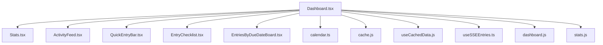
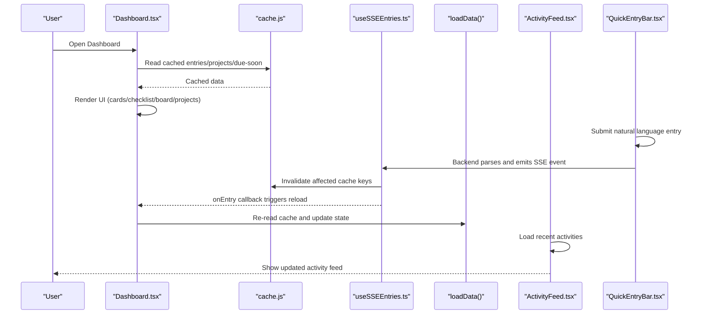
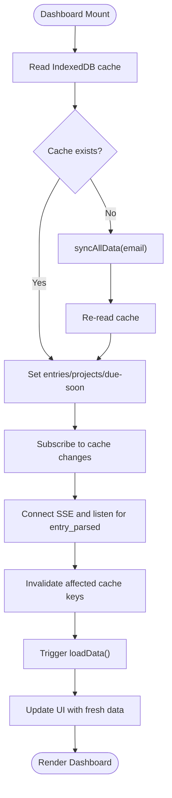
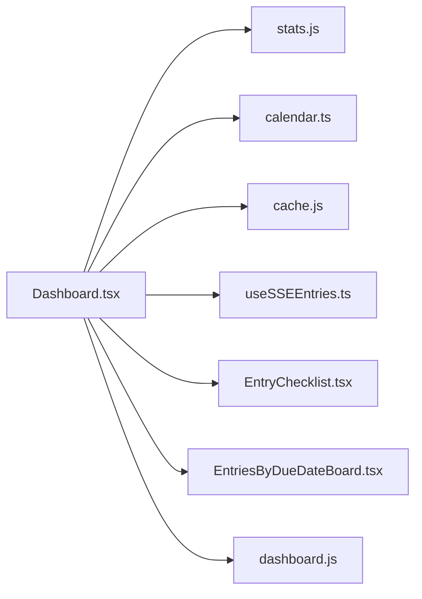

# Dashboard View

<cite>
**Referenced Files in This Document**
- [Dashboard.tsx](file://frontend/src/pages/Dashboard.tsx)
- [Stats.tsx](file://frontend/src/components/Stats.tsx)
- [ActivityFeed.tsx](file://frontend/src/components/ActivityFeed.tsx)
- [QuickEntryBar.tsx](file://frontend/src/components/QuickEntryBar.tsx)
- [useCachedData.js](file://frontend/src/hooks/useCachedData.js)
- [useSSEEntries.ts](file://frontend/src/hooks/useSSEEntries.ts)
- [cache.js](file://frontend/src/lib/cache.js)
- [calendar.ts](file://frontend/src/lib/calendar.ts)
- [dashboard.js](file://frontend/src/functions/dashboard.js)
- [stats.js](file://frontend/src/functions/dashboard/stats.js)
- [EntryChecklist.tsx](file://frontend/src/Templates/EntryTemplates/EntryChecklist.tsx)
- [EntriesByDueDateBoard.tsx](file://frontend/src/Templates/ProjectTemplates/EntriesByDueDateBoard.tsx)
</cite>

## Table of Contents

1. Introduction
2. Project Structure
3. Core Components
4. Architecture Overview
5. Detailed Component Analysis
6. Dependency Analysis
7. Performance Considerations
8. Troubleshooting Guide
9. Conclusion

## Introduction

The Dashboard is the central hub of the Codacaine application. After authentication, it serves as the main landing page that provides:

- Overview statistics and time tracking
- Quick actions to add entries or projects
- Project management capabilities (create, archive, view)
- Multiple display modes for tasks: cards, checklist, board, and projects
- Sorting by priority or date and filtering by due soon and project scope
- An integrated calendar view within the dashboard
- Recent entries tracking and an activity feed
- AI-powered greeting system and contextual empty-state messages
- Real-time updates via Server-Sent Events (SSE) and local-first data loading using IndexedDB caching

## Project Structure

The Dashboard is implemented as a React component that composes several subcomponents and hooks:

- Data loading and state are managed locally with IndexedDB-backed cache subscriptions and SSE-driven invalidation
- Display modes switch between different templates for rendering entries
- Calendar utilities provide month grids and entry grouping
- Stats and Activity components render overview metrics and recent actions
- Quick Entry Bar enables natural language entry creation

**Diagram sources**

- [Dashboard.tsx:1-54](file://frontend/src/pages/Dashboard.tsx#L1-L54)
- [Stats.tsx:1-20](file://frontend/src/components/Stats.tsx#L1-L20)
- [ActivityFeed.tsx:1-15](file://frontend/src/components/ActivityFeed.tsx#L1-L15)
- [QuickEntryBar.tsx:1-25](file://frontend/src/components/QuickEntryBar.tsx#L1-L25)
- [cache.js:1-30](file://frontend/src/lib/cache.js#L1-L30)
- [useCachedData.js:1-20](file://frontend/src/hooks/useCachedData.js#L1-L20)
- [useSSEEntries.ts:1-40](file://frontend/src/hooks/useSSEEntries.ts#L1-L40)
- [dashboard.js:1-15](file://frontend/src/functions/dashboard.js#L1-L15)
- [stats.js:1-30](file://frontend/src/functions/dashboard/stats.js#L1-L30)
- [calendar.ts:1-25](file://frontend/src/lib/calendar.ts#L1-L25)

**Section sources**

- [Dashboard.tsx:1-120](file://frontend/src/pages/Dashboard.tsx#L1-L120)

## Core Components

- Dashboard: Main orchestrator managing state, views, sorting, filtering, calendar, AI greetings, and user interactions
- Stats: Displays total entries, projects, due soon count, time tracked, and per-project breakdown; supports AI reflection
- ActivityFeed: Loads and renders recent activities with human-readable labels and relative timestamps
- QuickEntryBar: Natural language entry creation with voice input support and feedback
- Templates: Checklist and Board views for task organization; Board groups by weekday based on due dates
- Utilities: Calendar helpers, stats computations, due-soon filtering, and IndexedDB cache layer

Key responsibilities:

- Local-first data loading from IndexedDB with background refresh
- Real-time updates via SSE invalidating caches and triggering re-renders
- User interactions: create projects, add entries, manage archives, navigate to other views
- Display modes and sorting/filtering for flexible task management

**Section sources**

- [Dashboard.tsx:111-183](file://frontend/src/pages/Dashboard.tsx#L111-L183)
- [Stats.tsx:19-25](file://frontend/src/components/Stats.tsx#L19-L25)
- [ActivityFeed.tsx:381-404](file://frontend/src/components/ActivityFeed.tsx#L381-L404)
- [QuickEntryBar.tsx:38-45](file://frontend/src/components/QuickEntryBar.tsx#L38-L45)
- [EntriesByDueDateBoard.tsx:81-115](file://frontend/src/Templates/ProjectTemplates/EntriesByDueDateBoard.tsx#L81-L115)
- [EntryChecklist.tsx:325-363](file://frontend/src/Templates/EntryTemplates/EntryChecklist.tsx#L325-L363)

## Architecture Overview

The Dashboard uses a local-first architecture:

- Reads immediately from IndexedDB cache
- Subscribes to cache changes for reactive UI updates
- Uses SSE to invalidate relevant caches when backend processes entries
- Triggers re-reads to reflect real-time changes without blocking the UI

**Diagram sources**

- [Dashboard.tsx:341-461](file://frontend/src/pages/Dashboard.tsx#L341-L461)
- [useSSEEntries.ts:46-89](file://frontend/src/hooks/useSSEEntries.ts#L46-L89)
- [cache.js:179-223](file://frontend/src/lib/cache.js#L179-L223)
- [ActivityFeed.tsx:387-404](file://frontend/src/components/ActivityFeed.tsx#L387-L404)
- [QuickEntryBar.tsx:61-134](file://frontend/src/components/QuickEntryBar.tsx#L61-L134)

## Detailed Component Analysis

### Dashboard Component

Responsibilities:

- Manages display mode (cards, checklist, board, projects) and sort options (priority, date)
- Filters entries by due soon and active project scope
- Renders integrated calendar using month grid and day entries
- Tracks recently viewed and created entries
- Generates AI-powered greeting and empty-state messages
- Handles creating projects, adding entries, and managing archives
- Subscribes to IndexedDB cache changes and SSE events for real-time updates

Display modes:

- Cards: Default card-based layout for quick scanning
- Checklist: Task list with checkboxes and edit/delete actions
- Board: Columns grouped by weekday based on due dates
- Projects: Project-centric view

Sorting and filtering:

- Sort by priority or date persisted in localStorage
- Filter by due soon (next 3 days) and project name
- Recent view shows last week’s entries

Calendar integration:

- Builds month grid and filters entries by due date
- Highlights overdue days and displays entry titles

AI features:

- Greeting toast generated based on time of day, entry count, and due soon count
- Empty-state message generated when no items are present

User interactions:

- Create new projects with custom fields
- Add entries via Quick Entry Bar or voice feature
- Manage archives and restore archived projects
- Navigate to other views through drawer and menu

**Diagram sources**

- [Dashboard.tsx:341-461](file://frontend/src/pages/Dashboard.tsx#L341-L461)
- [useSSEEntries.ts:55-89](file://frontend/src/hooks/useSSEEntries.ts#L55-L89)
- [cache.js:249-263](file://frontend/src/lib/cache.js#L249-L263)

**Section sources**

- [Dashboard.tsx:142-169](file://frontend/src/pages/Dashboard.tsx#L142-L169)
- [Dashboard.tsx:583-608](file://frontend/src/pages/Dashboard.tsx#L583-L608)
- [Dashboard.tsx:184-198](file://frontend/src/pages/Dashboard.tsx#L184-L198)
- [Dashboard.tsx:516-540](file://frontend/src/pages/Dashboard.tsx#L516-L540)
- [Dashboard.tsx:765-800](file://frontend/src/pages/Dashboard.tsx#L765-L800)

### Stats Component

Responsibilities:

- Computes total entries, projects, due soon count, and time tracked
- Provides per-project breakdown and live timer for in-progress tasks
- Generates AI reflection when stats panel opens

Implementation details:

- Uses duration calculations and formatting utilities
- Ticks only when there are in-progress entries to optimize performance
- Supports scoped stats for active project context

**Section sources**

- [Stats.tsx:19-25](file://frontend/src/components/Stats.tsx#L19-L25)
- [Stats.tsx:26-114](file://frontend/src/components/Stats.tsx#L26-L114)
- [Stats.tsx:116-145](file://frontend/src/components/Stats.tsx#L116-L145)

### ActivityFeed Component

Responsibilities:

- Loads recent activities from the backend
- Renders human-readable activity items with icons and timestamps
- Formats detail values and handles special cases like renames

Implementation details:

- Maps action types to icons and verb phrases
- Formats relative times and truncates long names
- Shows empty state when no activities exist

**Section sources**

- [ActivityFeed.tsx:381-404](file://frontend/src/components/ActivityFeed.tsx#L381-L404)
- [ActivityFeed.tsx:448-510](file://frontend/src/components/ActivityFeed.tsx#L448-L510)

### QuickEntryBar Component

Responsibilities:

- Accepts natural language input and creates entries via backend processing
- Supports voice input and provides feedback messages
- Tracks created entries for "Recently created" section

Implementation details:

- Validates network status before submission
- Handles single-entry, multi-entry, and project-only responses
- Extracts project names, entry IDs, and titles for tracking

**Section sources**

- [QuickEntryBar.tsx:61-134](file://frontend/src/components/QuickEntryBar.tsx#L61-L134)
- [QuickEntryBar.tsx:143-259](file://frontend/src/components/QuickEntryBar.tsx#L143-L259)

### Checklist and Board Views

Checklist View:

- Renders entries as a sortable list with checkboxes
- Supports editing summaries and due dates
- Allows deletion and note viewing

Board View:

- Groups entries by weekday based on due dates
- Sorts columns by earliest due date
- Reuses checklist cards for consistent interaction

**Section sources**

- [EntryChecklist.tsx:325-363](file://frontend/src/Templates/EntryTemplates/EntryChecklist.tsx#L325-L363)
- [EntriesByDueDateBoard.tsx:36-79](file://frontend/src/Templates/ProjectTemplates/EntriesByDueDateBoard.tsx#L36-L79)
- [EntriesByDueDateBoard.tsx:81-115](file://frontend/src/Templates/ProjectTemplates/EntriesByDueDateBoard.tsx#L81-L115)

### Data Loading and State Management

IndexedDB Caching:

- Local-first storage using SQLite compiled to WebAssembly
- Event-driven subscriptions for reactive updates
- Persistence to IndexedDB for durability

SSE Integration:

- Listens for entry_parsed and entry_error events
- Invalidates relevant cache keys upon updates
- Triggers UI reloads through callbacks

Hook Patterns:

- useCachedData provides immediate cached data with background refresh
- useSSEEntries manages SSE connection and cache invalidation

**Section sources**

- [cache.js:1-30](file://frontend/src/lib/cache.js#L1-L30)
- [cache.js:179-223](file://frontend/src/lib/cache.js#L179-L223)
- [useCachedData.js:23-76](file://frontend/src/hooks/useCachedData.js#L23-L76)
- [useSSEEntries.ts:41-107](file://frontend/src/hooks/useSSEEntries.ts#L41-L107)

## Dependency Analysis

The Dashboard depends on several core modules:

- Stats computations for time tracking and project analysis
- Calendar utilities for date handling and grid generation
- Cache layer for local-first data persistence
- SSE hook for real-time updates
- Template components for different display modes

**Diagram sources**

- [Dashboard.tsx:1-54](file://frontend/src/pages/Dashboard.tsx#L1-L54)
- [stats.js:1-30](file://frontend/src/functions/dashboard/stats.js#L1-L30)
- [calendar.ts:1-25](file://frontend/src/lib/calendar.ts#L1-L25)
- [cache.js:1-30](file://frontend/src/lib/cache.js#L1-L30)
- [useSSEEntries.ts:1-40](file://frontend/src/hooks/useSSEEntries.ts#L1-L40)
- [EntryChecklist.tsx:1-20](file://frontend/src/Templates/EntryTemplates/EntryChecklist.tsx#L1-L20)
- [EntriesByDueDateBoard.tsx:1-25](file://frontend/src/Templates/ProjectTemplates/EntriesByDueDateBoard.tsx#L1-L25)
- [dashboard.js:1-15](file://frontend/src/functions/dashboard.js#L1-L15)

**Section sources**

- [Dashboard.tsx:1-54](file://frontend/src/pages/Dashboard.tsx#L1-L54)

## Performance Considerations

- Local-first caching ensures immediate UI responsiveness
- SSE invalidation prevents unnecessary server calls
- Conditional ticking for live timers reduces re-render overhead
- Efficient filtering and sorting using memoized computations
- Background synchronization avoids blocking user interactions

[No sources needed since this section provides general guidance]

## Troubleshooting Guide

Common issues and solutions:

- SSE connection failures: Check network connectivity and backend availability
- Cache inconsistencies: Clear user cache and force re-sync
- Missing entries after creation: Verify SSE events are received and cache invalidated
- Performance degradation: Monitor cache size and consider periodic cleanup

Error handling patterns:

- Graceful fallbacks when cache reads fail
- Retry mechanisms for failed operations
- User feedback for network-dependent features

**Section sources**

- [useSSEEntries.ts:91-98](file://frontend/src/hooks/useSSEEntries.ts#L91-L98)
- [cache.js:249-263](file://frontend/src/lib/cache.js#L249-L263)
- [ActivityFeed.tsx:391-400](file://frontend/src/components/ActivityFeed.tsx#L391-L400)

## Conclusion

The Dashboard provides a comprehensive, responsive interface for managing projects and tasks in the Codacaine application. Its local-first architecture ensures fast, reliable performance while maintaining real-time synchronization through SSE. The multiple display modes, sorting and filtering options, and integrated calendar make it a versatile hub for productivity. AI-powered features enhance user experience with contextual greetings and insights.

[No sources needed since this section summarizes without analyzing specific files]
