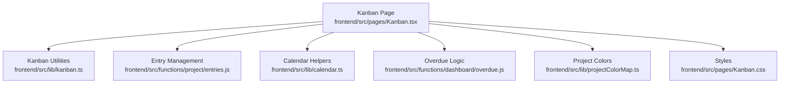
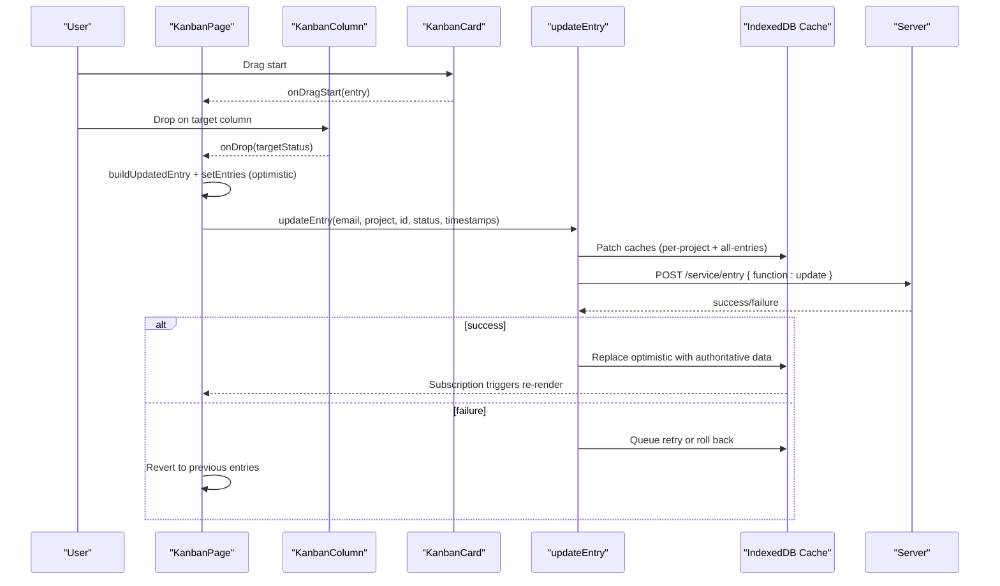
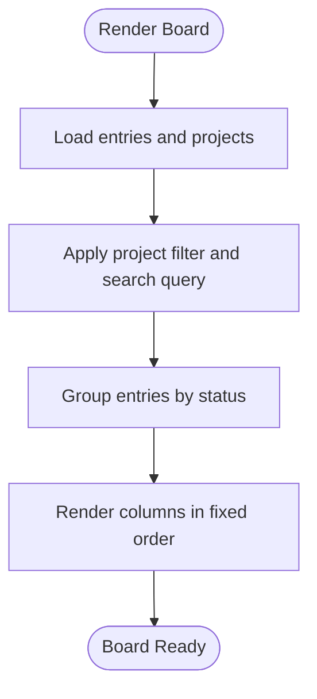
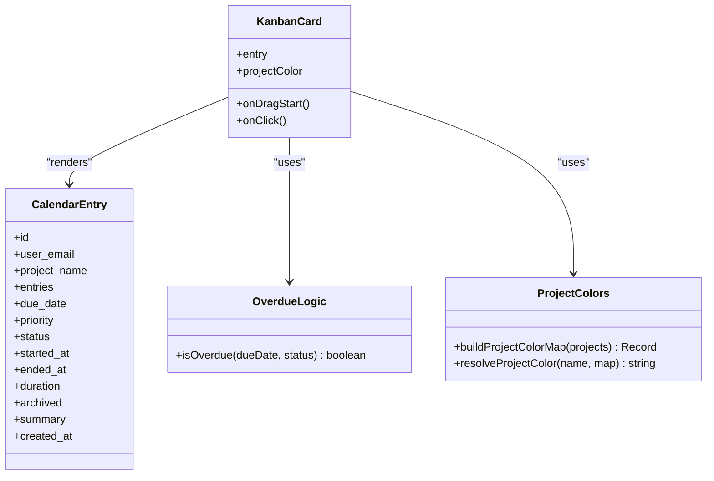
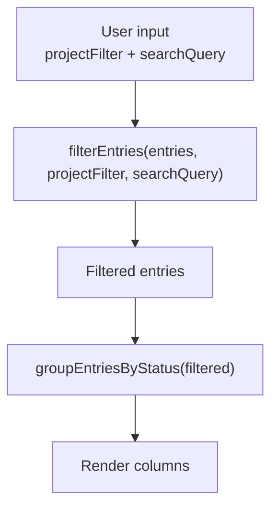
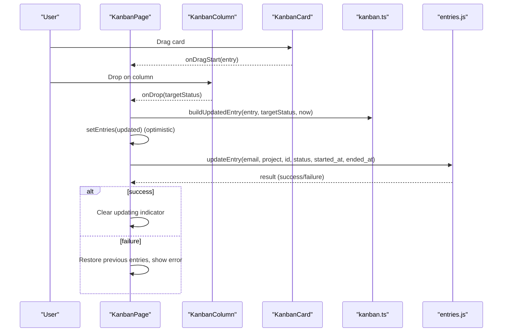
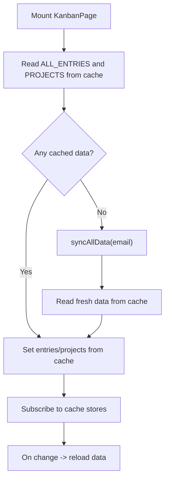
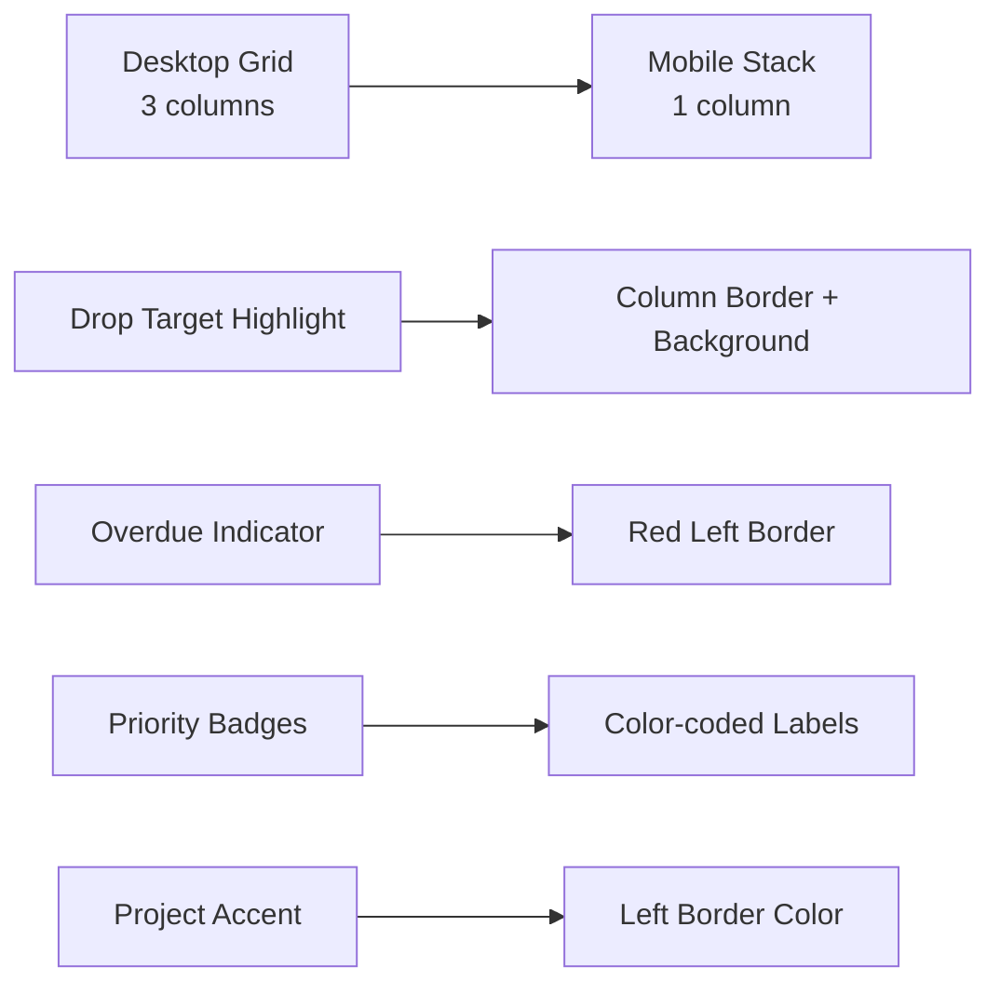
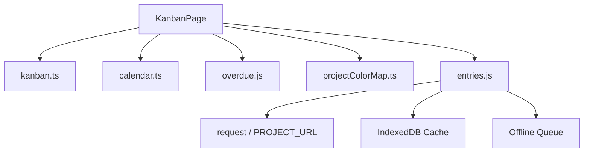

# Kanban Board

<cite>
**Referenced Files in This Document**
- [Kanban.tsx](file://frontend/src/pages/Kanban.tsx)
- [Kanban.css](file://frontend/src/pages/Kanban.css)
- [kanban.ts](file://frontend/src/lib/kanban.ts)
- [entries.js](file://frontend/src/functions/project/entries.js)
- [calendar.ts](file://frontend/src/lib/calendar.ts)
- [projectColorMap.ts](file://frontend/src/lib/projectColorMap.ts)
- [overdue.js](file://frontend/src/functions/dashboard/overdue.js)
</cite>

## Table of Contents

1. [Introduction](#introduction)
2. [Project Structure](#project-structure)
3. [Core Components](#core-components)
4. [Architecture Overview](#architecture-overview)
5. [Detailed Component Analysis](#detailed-component-analysis)
6. [Dependency Analysis](#dependency-analysis)
7. [Performance Considerations](#performance-considerations)
8. [Troubleshooting Guide](#troubleshooting-guide)
9. [Conclusion](#conclusion)

## Introduction

This document explains the Kanban board feature in Codacaine. It covers the three-column workflow (Up Next, In Motion, Done & Dusted), drag-and-drop status changes, board layout and card rendering, filtering and search, project-based filtering, CSS styling for responsive layouts and animations, and integration with the entry management system. It also details drag-and-drop state management, column-specific actions, and how updates are persisted to the server with optimistic UI and rollback on failure.

## Project Structure

The Kanban feature is implemented as a React page that composes:

- A page component that manages data loading, filtering, sorting, drag-and-drop state, and user interactions.
- A small utility module defining statuses, labels, grouping, filtering, and timestamp computation.
- CSS for responsive columns, cards, headers, and visual feedback during drag operations.
- Integration with the entry management layer for persistence and synchronization.

**Diagram sources**

- [Kanban.tsx:1-407](file://frontend/src/pages/Kanban.tsx#L1-L407)
- [kanban.ts:1-130](file://frontend/src/lib/kanban.ts#L1-L130)
- [entries.js:287-448](file://frontend/src/functions/project/entries.js#L287-L448)
- [calendar.ts:10-24](file://frontend/src/lib/calendar.ts#L10-L24)
- [overdue.js:8-17](file://frontend/src/functions/dashboard/overdue.js#L8-L17)
- [projectColorMap.ts:8-36](file://frontend/src/lib/projectColorMap.ts#L8-L36)
- [Kanban.css:136-243](file://frontend/src/pages/Kanban.css#L136-L243)

**Section sources**

- [Kanban.tsx:146-407](file://frontend/src/pages/Kanban.tsx#L146-L407)
- [kanban.ts:1-130](file://frontend/src/lib/kanban.ts#L1-L130)
- [Kanban.css:136-243](file://frontend/src/pages/Kanban.css#L136-L243)

## Core Components

- KanbanPage: Loads entries and projects from cache, subscribes to cache updates, applies filters and grouping, renders toolbar and board, handles drag-and-drop and navigation.
- KanbanColumn: Renders a single column header with count, accepts drop events, and renders cards.
- KanbanCard: Renders an individual task card with title, project name, due date, priority badge, and drag behavior.
- Kanban utilities: Define status types, labels, order, filtering, grouping, and timestamp computation for status transitions.
- Entry management: updateEntry performs optimistic UI updates, persists to IndexedDB, syncs to server, queues retries offline, and rolls back on failure.
- Calendar helpers: Provide entry title extraction and due date parsing used by cards.
- Overdue logic: Determines if a card should be visually highlighted as overdue.
- Project colors: Build a map from project names to colors and resolve per-card accent borders.

**Section sources**

- [Kanban.tsx:35-144](file://frontend/src/pages/Kanban.tsx#L35-L144)
- [kanban.ts:1-130](file://frontend/src/lib/kanban.ts#L1-L130)
- [entries.js:287-448](file://frontend/src/functions/project/entries.js#L287-L448)
- [calendar.ts:96-143](file://frontend/src/lib/calendar.ts#L96-L143)
- [overdue.js:8-17](file://frontend/src/functions/dashboard/overdue.js#L8-L17)
- [projectColorMap.ts:8-36](file://frontend/src/lib/projectColorMap.ts#L8-L36)

## Architecture Overview

The Kanban board uses a three-column layout driven by a fixed status order. Cards are grouped by their current status and rendered into columns. Dragging a card triggers an optimistic local update, then calls the entry service to persist the change. The UI reflects changes immediately; if the server write fails, the UI reverts to the previous state.

**Diagram sources**

- [Kanban.tsx:246-286](file://frontend/src/pages/Kanban.tsx#L246-L286)
- [entries.js:287-448](file://frontend/src/functions/project/entries.js#L287-L448)
- [kanban.ts:94-106](file://frontend/src/lib/kanban.ts#L94-L106)

## Detailed Component Analysis

### Three-Column Workflow and Status Model

- Columns: Up Next, In Motion, Done & Dusted.
- Status constants and order are defined centrally to ensure consistent rendering and grouping.
- Grouping maps entries into arrays per status for each column.

**Diagram sources**

- [kanban.ts:5-11](file://frontend/src/lib/kanban.ts#L5-L11)
- [kanban.ts:31-52](file://frontend/src/lib/kanban.ts#L31-L52)
- [kanban.ts:57-68](file://frontend/src/lib/kanban.ts#L57-L68)
- [Kanban.tsx:235-244](file://frontend/src/pages/Kanban.tsx#L235-L244)

**Section sources**

- [kanban.ts:1-17](file://frontend/src/lib/kanban.ts#L1-L17)
- [Kanban.tsx:235-244](file://frontend/src/pages/Kanban.tsx#L235-L244)

### Card Rendering and Visual Organization

- Each card shows:
  - Title derived from summary or structured fields.
  - Project name.
  - Due date when present, with overdue highlighting.
  - Priority badge with color coding.
  - Optional left border accent matching the project color.
- Overdue detection considers both due date and status.

**Diagram sources**

- [calendar.ts:10-24](file://frontend/src/lib/calendar.ts#L10-L24)
- [overdue.js:8-17](file://frontend/src/functions/dashboard/overdue.js#L8-L17)
- [projectColorMap.ts:8-36](file://frontend/src/lib/projectColorMap.ts#L8-L36)
- [Kanban.tsx:35-86](file://frontend/src/pages/Kanban.tsx#L35-L86)

**Section sources**

- [Kanban.tsx:35-86](file://frontend/src/pages/Kanban.tsx#L35-L86)
- [calendar.ts:96-143](file://frontend/src/lib/calendar.ts#L96-L143)
- [overdue.js:8-17](file://frontend/src/functions/dashboard/overdue.js#L8-L17)
- [projectColorMap.ts:8-36](file://frontend/src/lib/projectColorMap.ts#L8-L36)

### Filtering, Sorting, and Search

- Project filter: narrows entries to a selected project via dropdown.
- Search filter: matches against entry title and project name.
- Sorting: utility exists to sort by due date ascending; not actively applied in the board render path shown here.

**Diagram sources**

- [kanban.ts:31-52](file://frontend/src/lib/kanban.ts#L31-L52)
- [kanban.ts:57-68](file://frontend/src/lib/kanban.ts#L57-L68)
- [Kanban.tsx:235-244](file://frontend/src/pages/Kanban.tsx#L235-L244)

**Section sources**

- [kanban.ts:31-52](file://frontend/src/lib/kanban.ts#L31-L52)
- [Kanban.tsx:308-350](file://frontend/src/pages/Kanban.tsx#L308-L350)

### Drag-and-Drop State Management and Column Actions

- Drag start sets the dragging entry in page state.
- Drop handler computes updated entry with auto-set timestamps, optimistically updates local state, and calls updateEntry.
- On success, cache subscription refreshes the UI; on failure, the previous state is restored and an error is shown.

**Diagram sources**

- [Kanban.tsx:246-286](file://frontend/src/pages/Kanban.tsx#L246-L286)
- [kanban.ts:94-106](file://frontend/src/lib/kanban.ts#L94-L106)
- [entries.js:287-448](file://frontend/src/functions/project/entries.js#L287-L448)

**Section sources**

- [Kanban.tsx:246-286](file://frontend/src/pages/Kanban.tsx#L246-L286)
- [entries.js:287-448](file://frontend/src/functions/project/entries.js#L287-L448)

### Data Loading and Real-Time Updates

- Initial load reads from IndexedDB cache; if empty, triggers full sync.
- Subscriptions to cache stores trigger re-renders when data changes (e.g., after server sync or SSE).
- A sequence guard prevents race conditions between concurrent loads.

**Diagram sources**

- [Kanban.tsx:165-233](file://frontend/src/pages/Kanban.tsx#L165-L233)

**Section sources**

- [Kanban.tsx:165-233](file://frontend/src/pages/Kanban.tsx#L165-L233)

### CSS Styling: Responsive Layout, Animations, and Feedback

- Board layout:
  - Three-column grid on desktop; stacks to single column on smaller screens.
  - Columns have sticky headers and scrollable card areas.
- Visual feedback:
  - Drop target highlight when hovering over a different column.
  - Overdue cards get a red left border.
  - Priority badges use distinct colors.
  - Project accent borders on cards via resolved project color.
- Animations:
  - Spinner animation for loading states.
  - Hover effects on cards with subtle shadow transitions.

**Diagram sources**

- [Kanban.css:129-134](file://frontend/src/pages/Kanban.css#L129-L134)
- [Kanban.css:149-152](file://frontend/src/pages/Kanban.css#L149-L152)
- [Kanban.css:168-219](file://frontend/src/pages/Kanban.css#L168-L219)
- [Kanban.css:245-326](file://frontend/src/pages/Kanban.css#L245-L326)
- [Kanban.css:344-392](file://frontend/src/pages/Kanban.css#L344-L392)

**Section sources**

- [Kanban.css:129-219](file://frontend/src/pages/Kanban.css#L129-L219)
- [Kanban.css:245-326](file://frontend/src/pages/Kanban.css#L245-L326)
- [Kanban.css:344-392](file://frontend/src/pages/Kanban.css#L344-L392)

## Dependency Analysis

- KanbanPage depends on:
  - kanban.ts for status model, filtering, grouping, and timestamp computation.
  - calendar.ts for title extraction and due date parsing.
  - overdue.js for overdue detection.
  - projectColorMap.ts for per-card project accents.
  - entries.js for persistence and synchronization.
  - cache functions for data loading and real-time updates.
- Entries module depends on:
  - API request wrapper and cache stores for optimistic writes and server sync.
  - Offline queue for retrying failed updates.

**Diagram sources**

- [Kanban.tsx:1-21](file://frontend/src/pages/Kanban.tsx#L1-L21)
- [entries.js:1-4](file://frontend/src/functions/project/entries.js#L1-L4)

**Section sources**

- [Kanban.tsx:1-21](file://frontend/src/pages/Kanban.tsx#L1-L21)
- [entries.js:1-4](file://frontend/src/functions/project/entries.js#L1-L4)

## Performance Considerations

- Optimistic UI: Immediate local updates avoid perceived latency during drag-and-drop.
- Cache subscriptions: Avoid unnecessary network requests by reading from IndexedDB and subscribing to changes.
- Memoization: Filtering and grouping are computed with memoized dependencies to minimize re-renders.
- Race guards: Sequence counters prevent stale state commits from overlapping async loads.
- Responsive layout: Single-column stacking reduces layout thrashing on small screens.

[No sources needed since this section provides general guidance]

## Troubleshooting Guide

- No items match the current filter:
  - Clear project filter and search query to restore the full board.
- Error banner appears:
  - Indicates a failed status update; dismiss to clear. The UI reverts to the previous state automatically.
- Updating status toast remains visible:
  - Ensure the server response is received; check network connectivity and logs if it persists.
- Cards not moving between columns:
  - Verify that the drop target is a different column than the source; dropping onto the same column is ignored.
- Overdue indicators not showing:
  - Confirm that due dates are valid ISO strings and that the status is not done_and_dusted.

**Section sources**

- [Kanban.tsx:352-401](file://frontend/src/pages/Kanban.tsx#L352-L401)
- [overdue.js:8-17](file://frontend/src/functions/dashboard/overdue.js#L8-L17)

## Conclusion

The Kanban board provides a streamlined, responsive interface for managing tasks across three stages. It combines robust state management, optimistic updates, and real-time synchronization to deliver a smooth user experience. Filtering and search help users focus on relevant work, while visual cues like overdue highlights and project accents improve readability. The implementation is modular, with clear separation between UI, utilities, and persistence layers, making it maintainable and extensible.

[No sources needed since this section summarizes without analyzing specific files]
