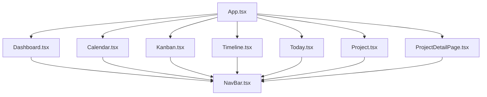
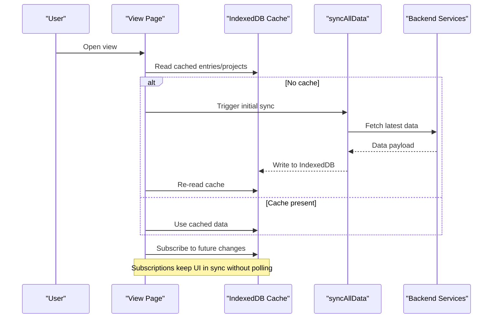
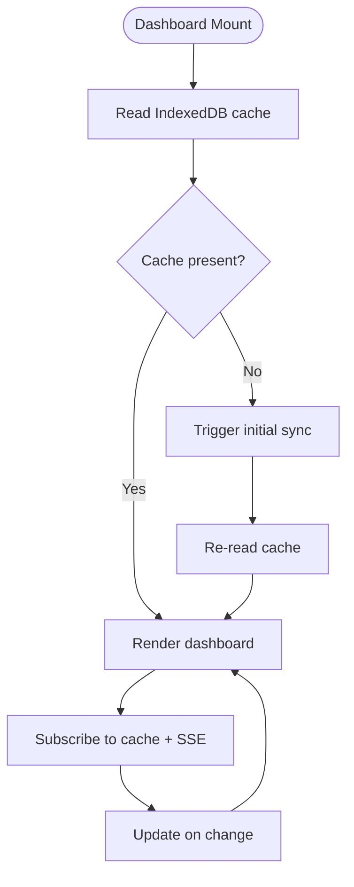
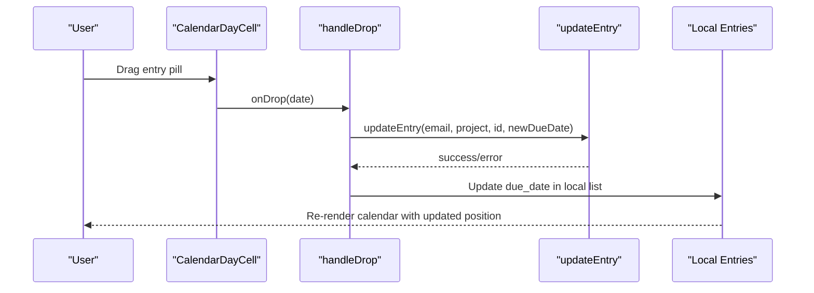
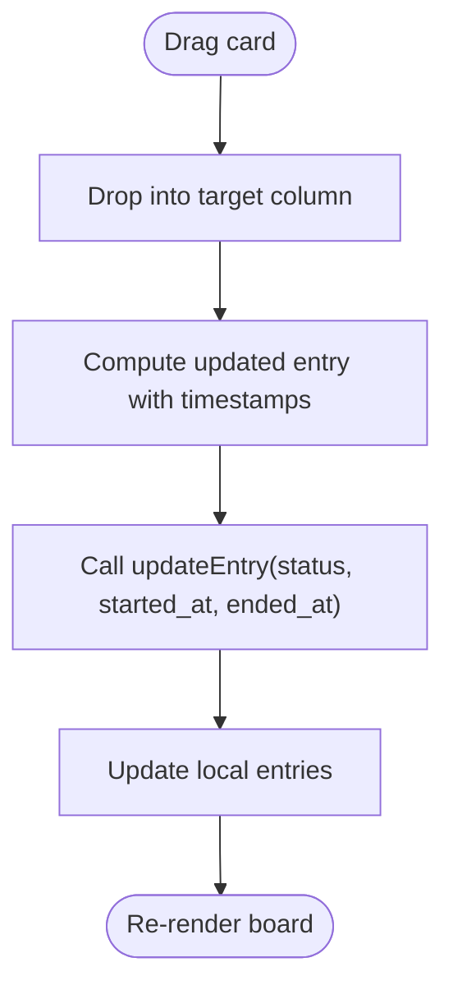
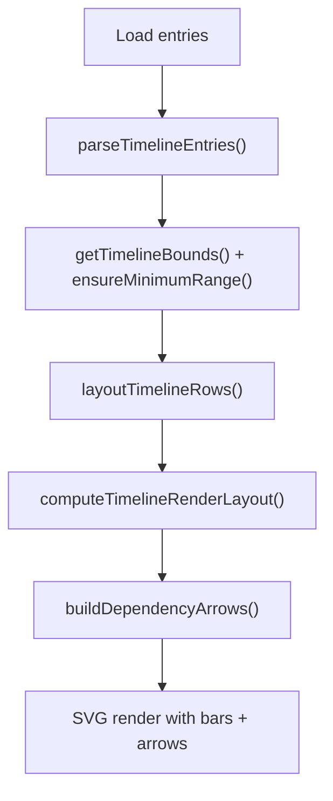
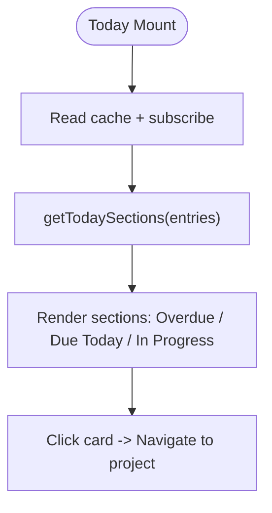
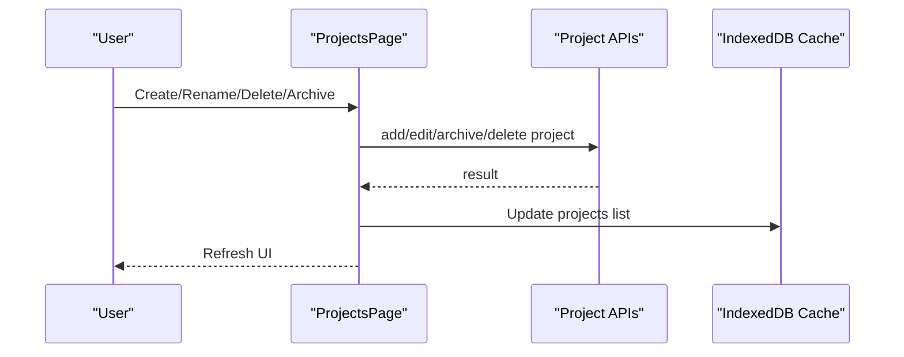
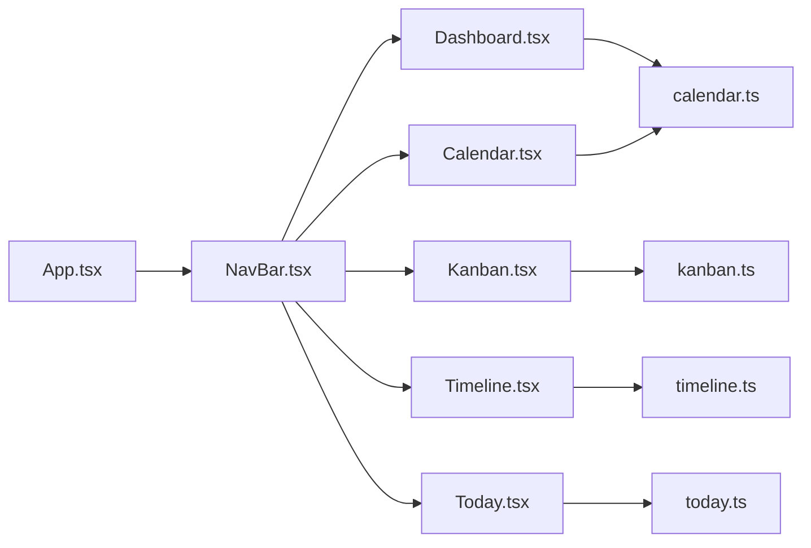

# Pages and Views

<cite>
**Referenced Files in This Document**
- [App.tsx](file://frontend/src/App.tsx)
- [Dashboard.tsx](file://frontend/src/pages/Dashboard.tsx)
- [Calendar.tsx](file://frontend/src/pages/Calendar.tsx)
- [Kanban.tsx](file://frontend/src/pages/Kanban.tsx)
- [Timeline.tsx](file://frontend/src/pages/Timeline.tsx)
- [Today.tsx](file://frontend/src/pages/Today.tsx)
- [Project.tsx](file://frontend/src/pages/Project.tsx)
- [ProjectDetailPage.tsx](file://frontend/src/pages/ProjectDetailPage.tsx)
- [NavBar.tsx](file://frontend/src/components/NavBar.tsx)
- [calendar.ts](file://frontend/src/lib/calendar.ts)
- [kanban.ts](file://frontend/src/lib/kanban.ts)
- [timeline.ts](file://frontend/src/lib/timeline.ts)
- [today.ts](file://frontend/src/lib/today.ts)
</cite>

## Table of Contents

1. [Introduction](#introduction)
2. [Project Structure](#project-structure)
3. [Core Components](#core-components)
4. [Architecture Overview](#architecture-overview)
5. [Detailed Component Analysis](#detailed-component-analysis)
6. [Dependency Analysis](#dependency-analysis)
7. [Performance Considerations](#performance-considerations)
8. [Troubleshooting Guide](#troubleshooting-guide)
9. [Conclusion](#conclusion)

## Introduction

This document explains the main application pages and views in Codacaine, focusing on how users navigate between views, how data is loaded and kept in sync, and how each view manages its own state. The Dashboard serves as the central hub with overview statistics and quick actions. The Calendar provides month and week modes with drag-and-drop rescheduling. The Kanban board implements a three-column workflow with drag-and-drop status changes and filtering. The Timeline visualizes task durations and dependencies. The Today view focuses on daily tasks by grouping overdue, due today, and in-progress items. The Project management interface supports creating, renaming, archiving, and deleting projects, plus viewing archived content.

## Project Structure

The frontend organizes user-facing features as React pages under src/pages, supported by shared UI components (NavBar, Header), and pure logic libraries for calendar, kanban, timeline, and today grouping. Routing and global initialization are defined in App.tsx.

**Diagram sources**

- [App.tsx:123-200](file://frontend/src/App.tsx#L123-L200)
- [NavBar.tsx:132-225](file://frontend/src/components/NavBar.tsx#L132-L225)

**Section sources**

- [App.tsx:123-200](file://frontend/src/App.tsx#L123-L200)

## Core Components

- NavBar: Global navigation drawer and top bar that links to all views, shows project lists, and integrates profile and notifications. It reads projects and entries from IndexedDB cache and updates when cache changes.
- Header: Page title and context header used across views.
- Shared libraries:
  - calendar.ts: Date helpers, grid builders, entry title extraction, and day-based filtering.
  - kanban.ts: Status definitions, grouping, filtering, and timestamp computation for status transitions.
  - timeline.ts: Parsing, row layout, rendering coordinates, dependency arrow generation.
  - today.ts: Grouping into overdue, due today, and in progress sections.

These components provide consistent behavior and reduce duplication across pages.

**Section sources**

- [NavBar.tsx:32-62](file://frontend/src/components/NavBar.tsx#L32-L62)
- [calendar.ts:10-24](file://frontend/src/lib/calendar.ts#L10-L24)
- [kanban.ts:3-17](file://frontend/src/lib/kanban.ts#L3-L17)
- [timeline.ts:3-11](file://frontend/src/lib/timeline.ts#L3-L11)
- [today.ts:3-10](file://frontend/src/lib/today.ts#L3-L10)

## Architecture Overview

Each page follows a local-first data strategy:

- On mount, read from IndexedDB cache immediately.
- If no cache exists, trigger an initial sync to populate IndexedDB.
- Subscribe to cache changes to re-render when data updates.
- Use sequence guards to prevent stale updates from overwriting fresh state during concurrent loads.

**Diagram sources**

- [Dashboard.tsx:344-461](file://frontend/src/pages/Dashboard.tsx#L344-L461)
- [Calendar.tsx:225-264](file://frontend/src/pages/Calendar.tsx#L225-L264)
- [Kanban.tsx:165-219](file://frontend/src/pages/Kanban.tsx#L165-L219)
- [Timeline.tsx:120-149](file://frontend/src/pages/Timeline.tsx#L120-L149)
- [Today.tsx:136-171](file://frontend/src/pages/Today.tsx#L136-L171)

## Detailed Component Analysis

### Dashboard: Central Hub

- Purpose: Overview statistics, recent activity, quick actions, and integrated mini-calendar.
- Key behaviors:
  - Loads entries and projects from IndexedDB; triggers initial sync if empty.
  - Subscribes to cache updates and SSE events to refresh UI.
  - Displays “due soon” entries within a rolling window and filters by active view (all, recent, drafts, archives, or specific project).
  - Provides AI-generated greeting and empty-state messages based on user tone preferences.
  - Manages settings panel, project creation, and archive handling.
  - Uses a sequence counter to avoid race conditions among multiple loaders.

**Diagram sources**

- [Dashboard.tsx:344-461](file://frontend/src/pages/Dashboard.tsx#L344-L461)
- [Dashboard.tsx:463-499](file://frontend/src/pages/Dashboard.tsx#L463-L499)

**Section sources**

- [Dashboard.tsx:111-179](file://frontend/src/pages/Dashboard.tsx#L111-L179)
- [Dashboard.tsx:344-461](file://frontend/src/pages/Dashboard.tsx#L344-L461)
- [Dashboard.tsx:583-608](file://frontend/src/pages/Dashboard.tsx#L583-L608)

### Calendar: Month/Week Modes and Drag-and-Drop Rescheduling

- Purpose: Visualize scheduled items across months or weeks; allow rescheduling via drag-and-drop.
- Key behaviors:
  - Renders month or week grids using calendar helpers.
  - Shows up to a fixed number of visible tasks per cell with a “more” button to open the day modal.
  - Supports dragging an entry pill to another day; updates the due date via updateEntry and reflects changes locally.
  - Persists view preference (month/week) in localStorage.
  - Highlights overdue days and completed entries.

**Diagram sources**

- [Calendar.tsx:56-144](file://frontend/src/pages/Calendar.tsx#L56-L144)
- [Calendar.tsx:309-343](file://frontend/src/pages/Calendar.tsx#L309-L343)

**Section sources**

- [Calendar.tsx:193-264](file://frontend/src/pages/Calendar.tsx#L193-L264)
- [Calendar.tsx:280-303](file://frontend/src/pages/Calendar.tsx#L280-L303)
- [Calendar.tsx:309-343](file://frontend/src/pages/Calendar.tsx#L309-L343)

### Kanban Board: Three-Column Workflow with Filtering

- Purpose: Manage tasks through Up Next, In Motion, Done & Dusted columns with drag-and-drop status changes.
- Key behaviors:
  - Filters entries by project and free-text search.
  - Groups entries by status using kanban helpers.
  - On drop, computes updated timestamps (started_at, ended_at) and calls updateEntry to persist status changes.
  - Shows priority badges and overdue indicators.

**Diagram sources**

- [Kanban.tsx:246-286](file://frontend/src/pages/Kanban.tsx#L246-L286)
- [kanban.ts:75-106](file://frontend/src/lib/kanban.ts#L75-L106)

**Section sources**

- [Kanban.tsx:146-219](file://frontend/src/pages/Kanban.tsx#L146-L219)
- [Kanban.tsx:235-244](file://frontend/src/pages/Kanban.tsx#L235-L244)
- [Kanban.tsx:246-286](file://frontend/src/pages/Kanban.tsx#L246-L286)

### Timeline: Dependency Tracking and Visual Task Representation

- Purpose: Show task bars spanning start to due dates with dependency arrows and zoom controls.
- Key behaviors:
  - Parses entries into timeline items, computes bounds, ensures minimum range, and assigns rows to avoid overlap.
  - Computes pixel coordinates for bars and draws dependency arrows using SVG paths.
  - Provides zoom levels to adjust day width and readability.
  - Clicking a bar navigates to the project detail page.

**Diagram sources**

- [Timeline.tsx:167-186](file://frontend/src/pages/Timeline.tsx#L167-L186)
- [timeline.ts:80-104](file://frontend/src/lib/timeline.ts#L80-L104)
- [timeline.ts:157-185](file://frontend/src/lib/timeline.ts#L157-L185)
- [timeline.ts:219-238](file://frontend/src/lib/timeline.ts#L219-L238)
- [timeline.ts:250-275](file://frontend/src/lib/timeline.ts#L250-L275)

**Section sources**

- [Timeline.tsx:78-149](file://frontend/src/pages/Timeline.tsx#L78-L149)
- [Timeline.tsx:167-186](file://frontend/src/pages/Timeline.tsx#L167-L186)
- [Timeline.tsx:216-229](file://frontend/src/pages/Timeline.tsx#L216-L229)

### Today: Daily Task Management

- Purpose: Focus on what matters today by grouping overdue, due today, and in-progress items.
- Key behaviors:
  - Loads entries and projects from cache; triggers initial sync if needed.
  - Uses today.ts helpers to partition entries into sections.
  - Navigates to project details on card click.
  - Shows empty state when there is nothing to do.

**Diagram sources**

- [Today.tsx:136-171](file://frontend/src/pages/Today.tsx#L136-L171)
- [today.ts:66-86](file://frontend/src/lib/today.ts#L66-L86)

**Section sources**

- [Today.tsx:119-188](file://frontend/src/pages/Today.tsx#L119-L188)
- [Today.tsx:190-194](file://frontend/src/pages/Today.tsx#L190-L194)

### Project Management Interface

- Purpose: Create, rename, archive, delete projects; manage archived projects and view their entries.
- Key behaviors:
  - Reads projects from cache; triggers initial sync if empty.
  - Supports bulk selection for archive/delete operations.
  - Opens archived projects overlay to view entries and unarchive.
  - Integrates ProjectSettingsPanel for color and configuration changes.

**Diagram sources**

- [Project.tsx:137-166](file://frontend/src/pages/Project.tsx#L137-L166)
- [Project.tsx:201-218](file://frontend/src/pages/Project.tsx#L201-L218)
- [Project.tsx:244-285](file://frontend/src/pages/Project.tsx#L244-L285)

**Section sources**

- [Project.tsx:34-67](file://frontend/src/pages/Project.tsx#L34-L67)
- [Project.tsx:137-166](file://frontend/src/pages/Project.tsx#L137-L166)
- [Project.tsx:201-218](file://frontend/src/pages/Project.tsx#L201-L218)
- [Project.tsx:244-285](file://frontend/src/pages/Project.tsx#L244-L285)

### Project Detail Page

- Purpose: View and manage entries within a specific project with multiple view modes (table, cards, checklist, board).
- Key behaviors:
  - Reads project-scoped entries from cache; subscribes to changes.
  - Supports sorting by date or priority and searching within the project.
  - Quick entry adds natural language entries scoped to the project.
  - Integrates voice feature and project settings.

**Section sources**

- [ProjectDetailPage.tsx:87-160](file://frontend/src/pages/ProjectDetailPage.tsx#L87-L160)
- [ProjectDetailPage.tsx:203-286](file://frontend/src/pages/ProjectDetailPage.tsx#L203-L286)
- [ProjectDetailPage.tsx:307-331](file://frontend/src/pages/ProjectDetailPage.tsx#L307-L331)
- [ProjectDetailPage.tsx:378-407](file://frontend/src/pages/ProjectDetailPage.tsx#L378-L407)

## Dependency Analysis

- Pages depend on shared libraries for domain logic:
  - Calendar uses calendar.ts for grids and day utilities.
  - Kanban uses kanban.ts for status grouping and filtering.
  - Timeline uses timeline.ts for parsing, layout, and arrow generation.
  - Today uses today.ts for sectioning logic.
- All pages use NavBar for navigation and rely on cache subscriptions for real-time updates.
- App.tsx wires routing and initializes data sync after authentication.

**Diagram sources**

- [Dashboard.tsx:34-46](file://frontend/src/pages/Dashboard.tsx#L34-L46)
- [Calendar.tsx:11-25](file://frontend/src/pages/Calendar.tsx#L11-L25)
- [Kanban.tsx:6-15](file://frontend/src/pages/Kanban.tsx#L6-L15)
- [Timeline.tsx:4-13](file://frontend/src/pages/Timeline.tsx#L4-L13)
- [Today.tsx:4-12](file://frontend/src/pages/Today.tsx#L4-L12)
- [NavBar.tsx:132-225](file://frontend/src/components/NavBar.tsx#L132-L225)
- [App.tsx:123-200](file://frontend/src/App.tsx#L123-L200)

**Section sources**

- [App.tsx:123-200](file://frontend/src/App.tsx#L123-L200)
- [NavBar.tsx:132-225](file://frontend/src/components/NavBar.tsx#L132-L225)

## Performance Considerations

- Local-first caching reduces network calls and improves perceived performance.
- Sequence guards prevent race conditions when multiple loaders fire concurrently (mount effects, cache subscribers, visibility changes).
- Computed values via useMemo minimize recalculations for derived data like grids, color maps, and filtered lists.
- Real-time updates via cache subscriptions and SSE avoid polling overhead.
- Zoom and row layout in Timeline optimize large datasets by computing only necessary ranges and avoiding overlaps.

[No sources needed since this section provides general guidance]

## Troubleshooting Guide

- Stale data or flickering: Ensure sequence guards are intact and cache subscriptions are properly unsubscribed on unmount.
- Drag-and-drop not updating: Verify updateEntry returns success and local state is updated before re-render.
- Empty states: Check whether cache has data; if not, confirm initial sync was triggered and network is available.
- Navigation issues: Confirm routes are registered in App.tsx and NavBar links point to correct paths.

**Section sources**

- [Dashboard.tsx:333-340](file://frontend/src/pages/Dashboard.tsx#L333-L340)
- [Calendar.tsx:309-343](file://frontend/src/pages/Calendar.tsx#L309-L343)
- [Kanban.tsx:246-286](file://frontend/src/pages/Kanban.tsx#L246-L286)
- [Timeline.tsx:120-149](file://frontend/src/pages/Timeline.tsx#L120-L149)
- [Today.tsx:136-171](file://frontend/src/pages/Today.tsx#L136-L171)

## Conclusion

Codacaine’s pages and views share a consistent architecture centered around local-first caching, robust state management, and clear separation of concerns via shared libraries. The Dashboard acts as the central hub, while Calendar, Kanban, Timeline, and Today provide specialized perspectives on tasks and schedules. Navigation is unified through NavBar, and data synchronization is handled via cache subscriptions and SSE. This design enables responsive, reliable interactions across devices and network conditions.

[No sources needed since this section summarizes without analyzing specific files]
