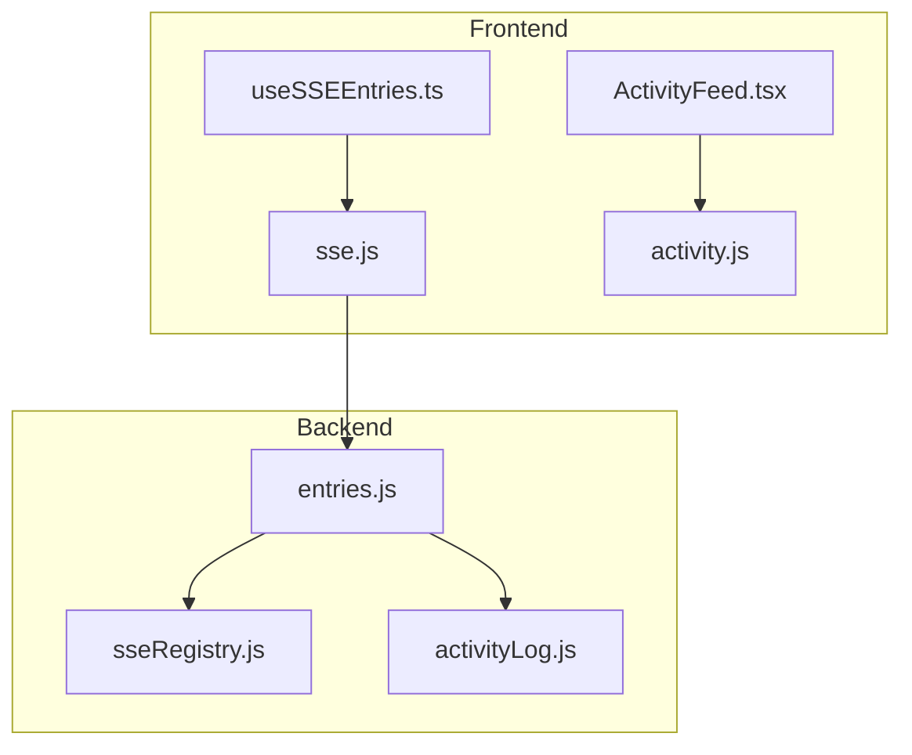
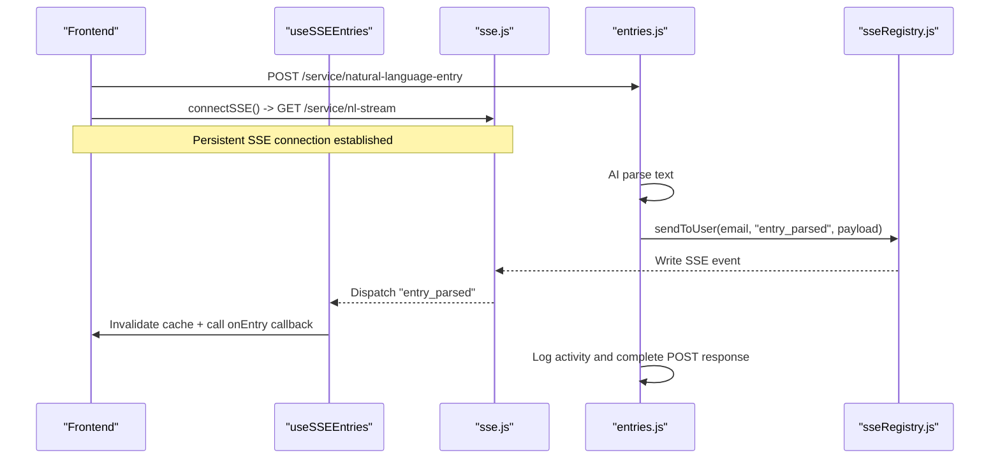
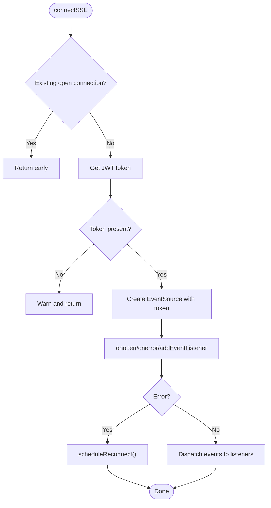
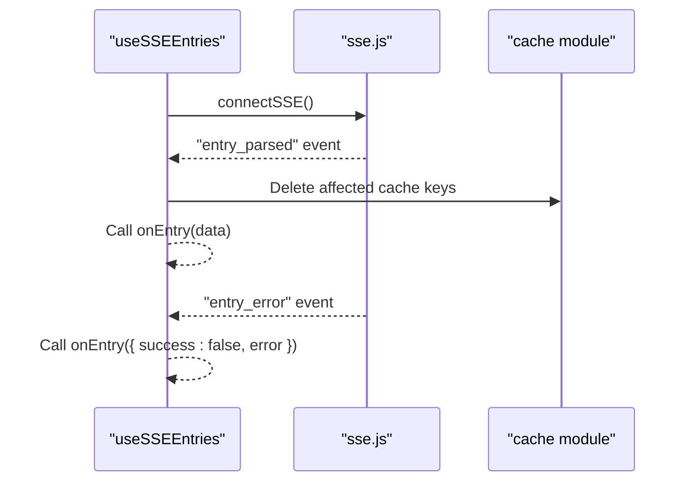
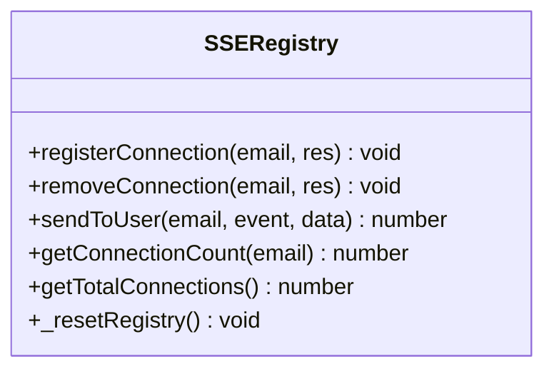
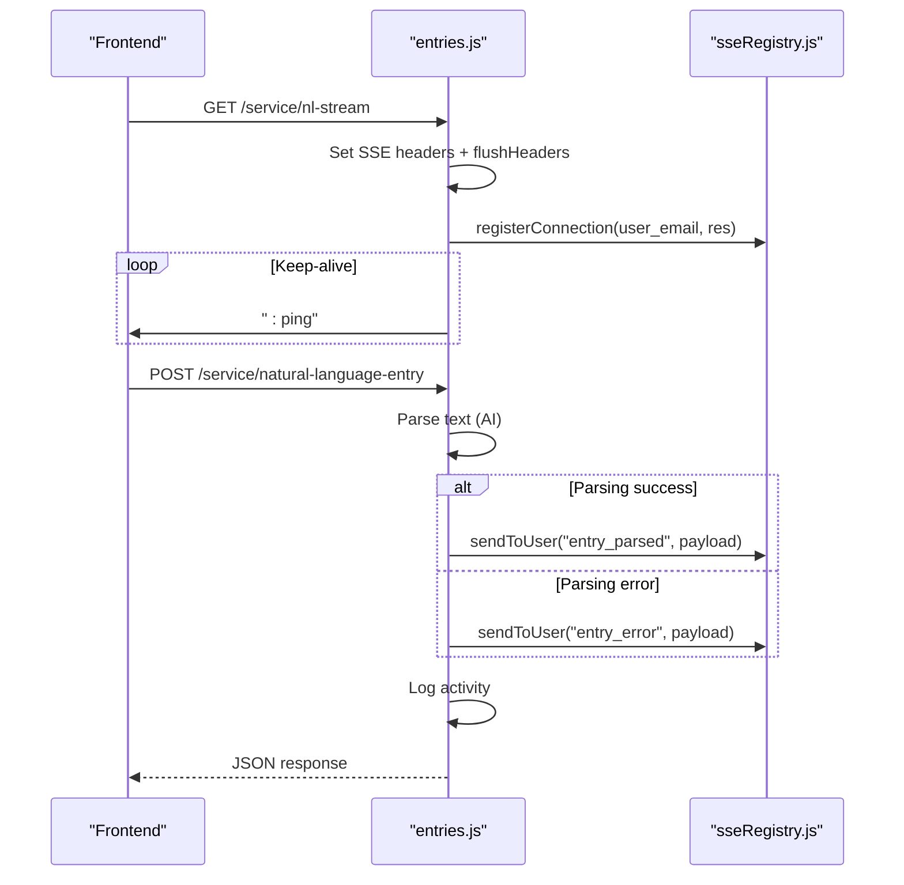
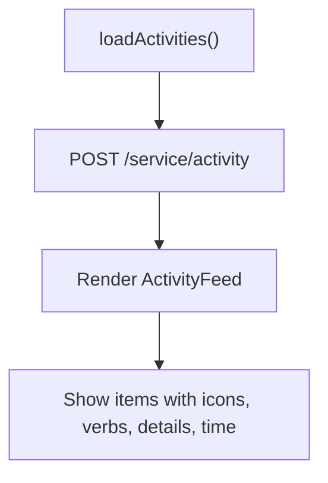
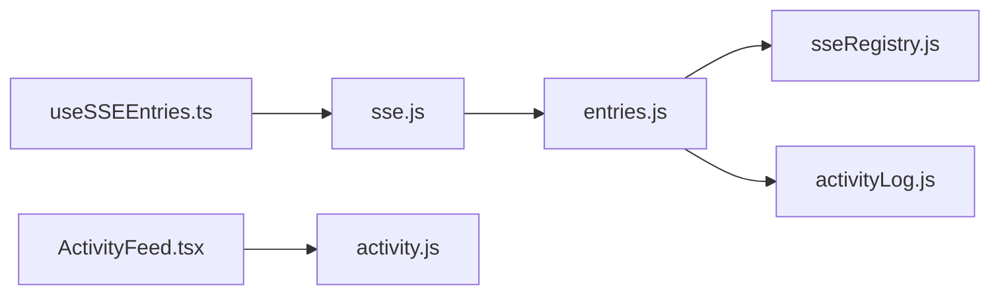

# Real-time Features

<cite>
**Referenced Files in This Document**
- [useSSEEntries.ts](file://frontend/src/hooks/useSSEEntries.ts)
- [sse.js](file://frontend/src/lib/sse.js)
- [ActivityFeed.tsx](file://frontend/src/components/ActivityFeed.tsx)
- [activity.js](file://frontend/src/functions/activity.js)
- [entries.js](file://services/project-service/src/Routes/entries.js)
- [sseRegistry.js](file://services/project-service/src/functions/sseRegistry.js)
- [activityLog.js](file://services/project-service/src/functions/activityLog.js)
- [sse.md](file://docs-site/docs/Architecture/sse.md)
</cite>

## Table of Contents

1. [Introduction](#introduction)
2. [Project Structure](#project-structure)
3. [Core Components](#core-components)
4. [Architecture Overview](#architecture-overview)
5. [Detailed Component Analysis](#detailed-component-analysis)
6. [Dependency Analysis](#dependency-analysis)
7. [Performance Considerations](#performance-considerations)
8. [Troubleshooting Guide](#troubleshooting-guide)
9. [Conclusion](#conclusion)
10. [Appendices](#appendices)

## Introduction

This document explains the real-time collaboration features powered by Server-Sent Events (SSE). It covers connection management, event handling, automatic reconnection logic, the useSSEEntries hook for live entry updates, and the activity feed system that displays user actions. It also documents event types, message formats, error handling strategies, performance optimizations, memory management, cleanup procedures, and debugging techniques for monitoring real-time connections.

## Project Structure

The real-time feature spans frontend hooks and libraries, backend routes and registries, and documentation:

- Frontend SSE client: connection manager and React hook
- Backend SSE server: route handler, registry, and push logic
- Activity feed: UI component and API function to fetch recent activities
- Architecture docs: overview and flow diagrams

**Diagram sources**

- [useSSEEntries.ts:1-108](file://frontend/src/hooks/useSSEEntries.ts#L1-L108)
- [sse.js:1-185](file://frontend/src/lib/sse.js#L1-L185)
- [ActivityFeed.tsx:1-515](file://frontend/src/components/ActivityFeed.tsx#L1-L515)
- [activity.js:1-12](file://frontend/src/functions/activity.js#L1-L12)
- [entries.js:1-328](file://services/project-service/src/Routes/entries.js#L1-L328)
- [sseRegistry.js:1-104](file://services/project-service/src/functions/sseRegistry.js#L1-L104)
- [activityLog.js:1-70](file://services/project-service/src/functions/activityLog.js#L1-L70)

**Section sources**

- [useSSEEntries.ts:1-108](file://frontend/src/hooks/useSSEEntries.ts#L1-L108)
- [sse.js:1-185](file://frontend/src/lib/sse.js#L1-L185)
- [entries.js:1-328](file://services/project-service/src/Routes/entries.js#L1-L328)
- [sseRegistry.js:1-104](file://services/project-service/src/functions/sseRegistry.js#L1-L104)
- [ActivityFeed.tsx:1-515](file://frontend/src/components/ActivityFeed.tsx#L1-L515)
- [activity.js:1-12](file://frontend/src/functions/activity.js#L1-L12)
- [activityLog.js:1-70](file://services/project-service/src/functions/activityLog.js#L1-L70)
- [sse.md:1-217](file://docs-site/docs/Architecture/sse.md#L1-L217)

## Core Components

- SSE Client Manager (frontend): Establishes a persistent EventSource connection, handles authentication via token query parameter, dispatches named events to listeners, and implements exponential backoff reconnection.
- useSSEEntries Hook (frontend): Subscribes to SSE events, invalidates IndexedDB caches based on parsed entry changes, and triggers UI refresh via callbacks.
- SSE Registry (backend): Tracks active SSE responses per user email, supports sending events to all connected clients, and cleans up dead connections.
- Natural Language Entry Route (backend): Parses natural language input, immediately pushes structured data via SSE before completing the POST response, and logs activity afterward.
- Activity Feed (frontend): Fetches recent activities from the backend and renders them with human-readable labels and timestamps.

**Section sources**

- [sse.js:1-185](file://frontend/src/lib/sse.js#L1-L185)
- [useSSEEntries.ts:1-108](file://frontend/src/hooks/useSSEEntries.ts#L1-L108)
- [sseRegistry.js:1-104](file://services/project-service/src/functions/sseRegistry.js#L1-L104)
- [entries.js:193-328](file://services/project-service/src/Routes/entries.js#L193-L328)
- [ActivityFeed.tsx:381-515](file://frontend/src/components/ActivityFeed.tsx#L381-L515)
- [activity.js:1-12](file://frontend/src/functions/activity.js#L1-L12)

## Architecture Overview

The real-time flow ensures immediate UI updates after AI parsing completes, before database writes finish. The frontend opens an SSE stream alongside the standard POST request. When parsing succeeds, the backend pushes structured data over SSE; the frontend invalidates relevant caches and refreshes the UI. Errors are pushed as well.

**Diagram sources**

- [entries.js:243-328](file://services/project-service/src/Routes/entries.js#L243-L328)
- [sseRegistry.js:41-74](file://services/project-service/src/functions/sseRegistry.js#L41-L74)
- [sse.js:37-101](file://frontend/src/lib/sse.js#L37-L101)
- [useSSEEntries.ts:41-108](file://frontend/src/hooks/useSSEEntries.ts#L41-L108)

## Detailed Component Analysis

### SSE Connection Management (Frontend)

- Authentication: Retrieves JWT token from Supabase session and appends it as a query parameter to the SSE URL.
- Connection lifecycle: Creates a single EventSource instance, guards against duplicates, and exposes disconnect and status checks.
- Event handling: Listens for named events (connected, entry_parsed, entry_error), parses JSON payloads, and dispatches to registered listeners.
- Reconnection: On errors or connection failures, schedules reconnects with exponential backoff up to a maximum number of attempts.

**Diagram sources**

- [sse.js:37-119](file://frontend/src/lib/sse.js#L37-L119)

**Section sources**

- [sse.js:21-119](file://frontend/src/lib/sse.js#L21-L119)
- [sse.js:121-185](file://frontend/src/lib/sse.js#L121-L185)

### useSSEEntries Hook (Frontend)

- Subscription: Connects SSE when a user is authenticated and enabled, subscribes to entry_parsed and entry_error events.
- Cache invalidation: Deletes relevant IndexedDB cache keys for projects, entries, and all-entries based on multi/single entry scenarios and new project creation flags.
- UI update: Invokes provided onEntry callback to trigger refetch or UI refresh.
- Cleanup: Unsubscribes listeners on unmount without closing the shared SSE connection (managed elsewhere during sign-out).

**Diagram sources**

- [useSSEEntries.ts:41-108](file://frontend/src/hooks/useSSEEntries.ts#L41-L108)

**Section sources**

- [useSSEEntries.ts:1-108](file://frontend/src/hooks/useSSEEntries.ts#L1-L108)

### SSE Registry (Backend)

- Connection tracking: Maintains a Map of userEmail to Set of Express Response objects.
- Sending events: Writes SSE-formatted messages to all connections for a user; removes dead connections on write failure.
- Utilities: Provides connection counts and a test-only reset function.

**Diagram sources**

- [sseRegistry.js:1-104](file://services/project-service/src/functions/sseRegistry.js#L1-L104)

**Section sources**

- [sseRegistry.js:1-104](file://services/project-service/src/functions/sseRegistry.js#L1-L104)

### Natural Language Entry Route (Backend)

- SSE endpoint: Sets SSE headers, sends initial confirmation event, registers connection, pings keep-alive every 30 seconds, and cleans up on close.
- Natural language processing: After AI parsing, immediately pushes structured data via SSE before logging activity and responding.
- Error handling: Pushes entry_error via SSE and returns a 500 response with error details.

**Diagram sources**

- [entries.js:193-328](file://services/project-service/src/Routes/entries.js#L193-L328)
- [sseRegistry.js:41-74](file://services/project-service/src/functions/sseRegistry.js#L41-L74)

**Section sources**

- [entries.js:193-328](file://services/project-service/src/Routes/entries.js#L193-L328)

### Activity Feed System (Frontend)

- Data fetching: Calls getActivities to retrieve recent actions for the current user.
- Rendering: Maps action types to icons and verbs, formats detail values, truncates long names, and shows relative timestamps.
- Loading states: Displays spinner while loading and empty state when no activities exist.

**Diagram sources**

- [ActivityFeed.tsx:381-515](file://frontend/src/components/ActivityFeed.tsx#L381-L515)
- [activity.js:1-12](file://frontend/src/functions/activity.js#L1-L12)

**Section sources**

- [ActivityFeed.tsx:1-515](file://frontend/src/components/ActivityFeed.tsx#L1-L515)
- [activity.js:1-12](file://frontend/src/functions/activity.js#L1-L12)

## Dependency Analysis

- Frontend dependencies:
  - useSSEEntries depends on sse.js for connection and event dispatching, and on cache utilities for invalidation.
  - ActivityFeed depends on activity.js to fetch activities.
- Backend dependencies:
  - entries.js imports sseRegistry to manage SSE connections and activityLog to record actions.
  - sseRegistry maintains in-memory connection state keyed by user email.

**Diagram sources**

- [useSSEEntries.ts:1-108](file://frontend/src/hooks/useSSEEntries.ts#L1-L108)
- [sse.js:1-185](file://frontend/src/lib/sse.js#L1-L185)
- [entries.js:1-328](file://services/project-service/src/Routes/entries.js#L1-L328)
- [sseRegistry.js:1-104](file://services/project-service/src/functions/sseRegistry.js#L1-L104)
- [activityLog.js:1-70](file://services/project-service/src/functions/activityLog.js#L1-L70)
- [ActivityFeed.tsx:1-515](file://frontend/src/components/ActivityFeed.tsx#L1-L515)
- [activity.js:1-12](file://frontend/src/functions/activity.js#L1-L12)

**Section sources**

- [useSSEEntries.ts:1-108](file://frontend/src/hooks/useSSEEntries.ts#L1-L108)
- [sse.js:1-185](file://frontend/src/lib/sse.js#L1-L185)
- [entries.js:1-328](file://services/project-service/src/Routes/entries.js#L1-L328)
- [sseRegistry.js:1-104](file://services/project-service/src/functions/sseRegistry.js#L1-L104)
- [activityLog.js:1-70](file://services/project-service/src/functions/activityLog.js#L1-L70)
- [ActivityFeed.tsx:1-515](file://frontend/src/components/ActivityFeed.tsx#L1-L515)
- [activity.js:1-12](file://frontend/src/functions/activity.js#L1-L12)

## Performance Considerations

- Immediate UI updates: SSE pushes parsed data right after AI parsing completes, reducing perceived latency compared to waiting for full POST completion.
- Cache invalidation: Targeted deletion of IndexedDB cache keys avoids unnecessary refetches and keeps data fresh.
- Keep-alive pings: Backend sends periodic comments to prevent idle timeouts.
- Reconnection strategy: Exponential backoff prevents thundering herds and reduces network pressure during outages.
- Memory management:
  - Frontend: Single EventSource instance; listener sets cleaned up on unsubscribe; timers cleared on disconnect.
  - Backend: In-memory registry tracks connections per user; dead connections removed on write errors; keep-alive intervals cleared on disconnect.

[No sources needed since this section provides general guidance]

## Troubleshooting Guide

- SSE connection issues:
  - Verify token availability and correct URL construction.
  - Check browser console for connection warnings and reconnection logs.
  - Confirm backend SSE headers and keep-alive pings are being sent.
- Event handling problems:
  - Ensure listeners are registered before connecting.
  - Validate JSON parsing of event payloads; handle parse errors gracefully.
- Cache inconsistencies:
  - Confirm cache keys match user email and project names.
  - For multi-entry scenarios, ensure both old and new results are considered for invalidation.
- Activity feed not updating:
  - Verify getActivities calls succeed and return data.
  - Inspect backend activity logging to ensure entries are written.

**Section sources**

- [sse.js:21-119](file://frontend/src/lib/sse.js#L21-L119)
- [useSSEEntries.ts:41-108](file://frontend/src/hooks/useSSEEntries.ts#L41-L108)
- [entries.js:193-328](file://services/project-service/src/Routes/entries.js#L193-L328)
- [activityLog.js:1-70](file://services/project-service/src/functions/activityLog.js#L1-L70)

## Conclusion

The real-time collaboration features leverage SSE to deliver immediate UI updates after AI parsing, combined with targeted cache invalidation and robust reconnection logic. The activity feed complements this by providing a historical view of user actions. Together, these components create a responsive, collaborative experience while maintaining performance and reliability.

[No sources needed since this section summarizes without analyzing specific files]

## Appendices

### Event Types and Message Formats

- connected: Indicates SSE stream establishment.
- entry_parsed: Structured entry data after successful parsing.
- entry_error: Error information when parsing fails.
- : ping: Keep-alive comment to maintain the connection.

**Section sources**

- [entries.js:200-233](file://services/project-service/src/Routes/entries.js#L200-L233)
- [sse.js:67-96](file://frontend/src/lib/sse.js#L67-L96)
- [sse.md:179-187](file://docs-site/docs/Architecture/sse.md#L179-L187)

### Debugging Techniques and Monitoring

- Frontend:
  - Monitor SSE connection status using connection checks and logs.
  - Use browser DevTools Network tab to inspect SSE stream and events.
  - Add console logs around event dispatching and cache invalidation.
- Backend:
  - Log connection registration and removal events.
  - Track total active connections and per-user counts.
  - Inspect keep-alive interval behavior and cleanup on disconnect.

**Section sources**

- [sse.js:55-119](file://frontend/src/lib/sse.js#L55-L119)
- [sseRegistry.js:17-74](file://services/project-service/src/functions/sseRegistry.js#L17-L74)
- [entries.js:200-233](file://services/project-service/src/Routes/entries.js#L200-L233)
