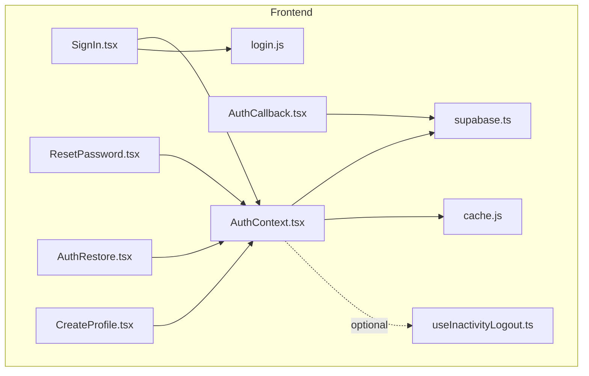
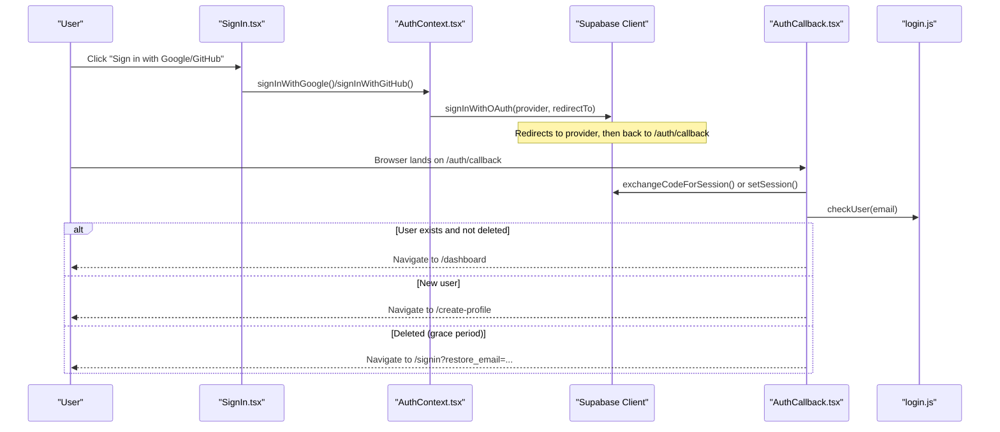
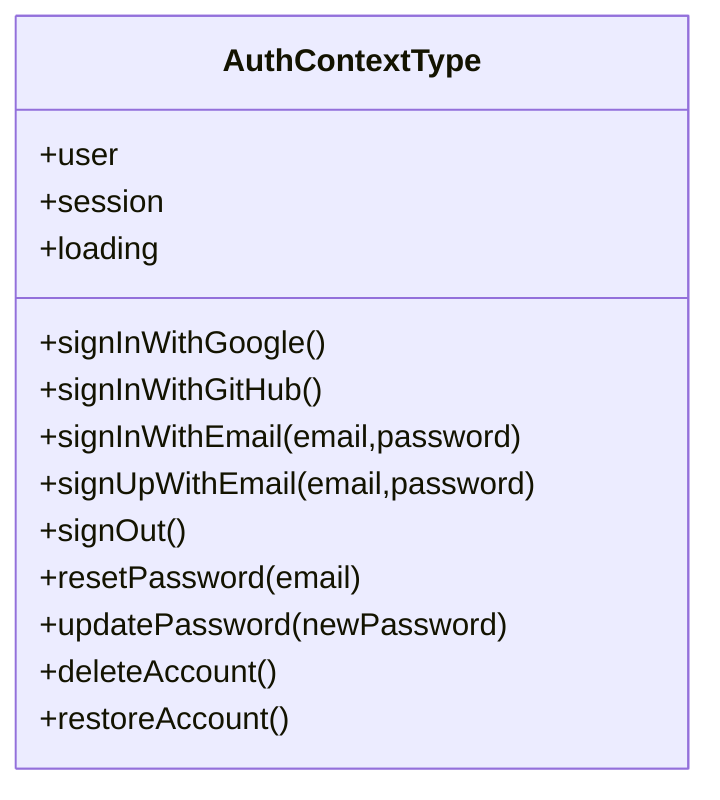
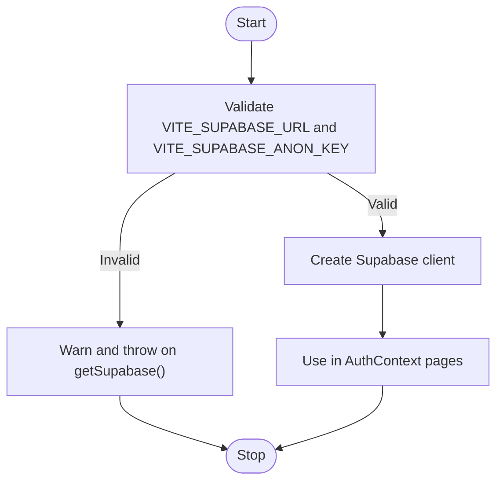
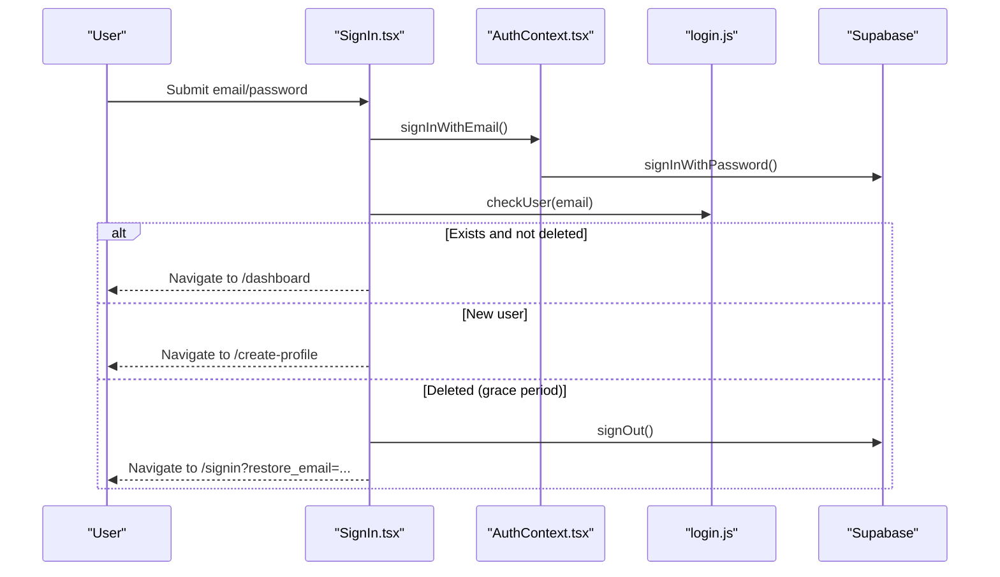
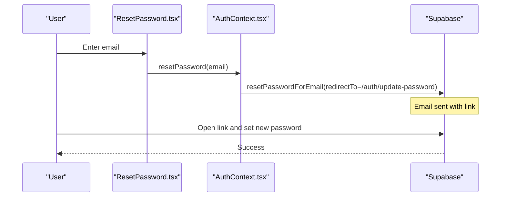
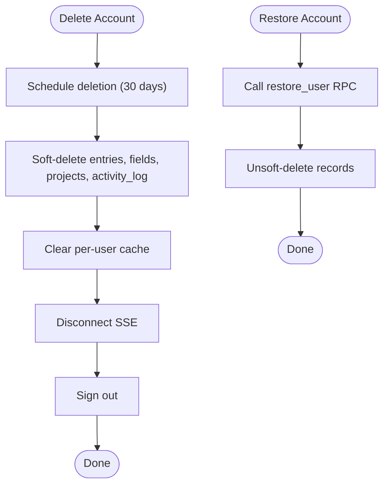
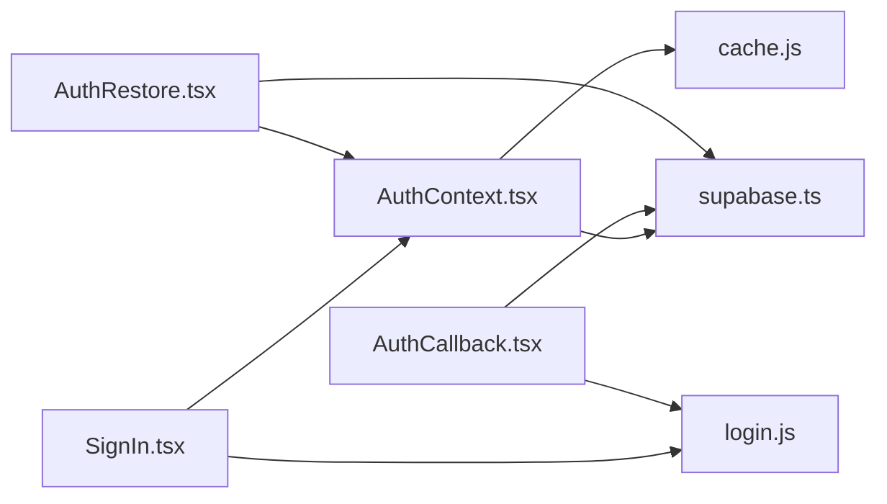

# Authentication Context

<cite>
**Referenced Files in This Document**
- [AuthContext.tsx](file://frontend/src/context/AuthContext.tsx)
- [supabase.ts](file://frontend/src/lib/supabase.ts)
- [SignIn.tsx](file://frontend/src/pages/SignIn.tsx)
- [AuthCallback.tsx](file://frontend/src/pages/AuthCallback.tsx)
- [ResetPassword.tsx](file://frontend/src/pages/ResetPassword.tsx)
- [AuthRestore.tsx](file://frontend/src/pages/AuthRestore.tsx)
- [CreateProfile.tsx](file://frontend/src/pages/CreateProfile.tsx)
- [login.js](file://frontend/src/functions/profile/login.js)
- [cache.js](file://frontend/src/lib/cache.js)
- [useInactivityLogout.ts](file://frontend/src/hooks/useInactivityLogout.ts)
- [004_account_deletion_grace_period.sql](file://supabase/migrations/004_account_deletion_grace_period.sql)
</cite>

## Table of Contents

1. [Introduction](#introduction)
2. [Project Structure](#project-structure)
3. [Core Components](#core-components)
4. [Architecture Overview](#architecture-overview)
5. [Detailed Component Analysis](#detailed-component-analysis)
6. [Dependency Analysis](#dependency-analysis)
7. [Performance Considerations](#performance-considerations)
8. [Troubleshooting Guide](#troubleshooting-guide)
9. [Conclusion](#conclusion)
10. [Appendices](#appendices)

## Introduction

This document explains how Codacaine manages authentication state globally through the AuthContext and integrates with Supabase for OAuth (Google, GitHub) and email/password flows. It covers dev mode bypass, session persistence, automatic logout handling, account lifecycle operations (sign up, sign in, password reset, deletion with grace period, restoration), error handling patterns, and security considerations.

## Project Structure

The authentication system is centered around a React context that exposes user state and auth methods to the app. Pages implement UI for sign-in/sign-up, password reset, and account restore. A Supabase client module provides secure access to credentials and the client instance. A local cache layer ensures data isolation per user and is cleared on logout or account deletion.

**Diagram sources**

- [AuthContext.tsx:1-240](file://frontend/src/context/AuthContext.tsx#L1-L240)
- [supabase.ts:1-34](file://frontend/src/lib/supabase.ts#L1-L34)
- [SignIn.tsx:1-648](file://frontend/src/pages/SignIn.tsx#L1-L648)
- [AuthCallback.tsx:1-185](file://frontend/src/pages/AuthCallback.tsx#L1-L185)
- [ResetPassword.tsx:1-132](file://frontend/src/pages/ResetPassword.tsx#L1-L132)
- [AuthRestore.tsx:1-120](file://frontend/src/pages/AuthRestore.tsx#L1-L120)
- [CreateProfile.tsx:1-128](file://frontend/src/pages/CreateProfile.tsx#L1-L128)
- [login.js:1-9](file://frontend/src/functions/profile/login.js#L1-L9)
- [cache.js:200-389](file://frontend/src/lib/cache.js#L200-L389)
- [useInactivityLogout.ts:1-81](file://frontend/src/hooks/useInactivityLogout.ts#L1-L81)

**Section sources**

- [AuthContext.tsx:1-240](file://frontend/src/context/AuthContext.tsx#L1-L240)
- [supabase.ts:1-34](file://frontend/src/lib/supabase.ts#L1-L34)

## Core Components

- AuthContext: Provides global user/session state, loading flag, and methods for OAuth, email/password, password reset/update, sign out, account deletion, and restoration. It also implements a dev mode bypass for local testing by injecting a mock user when enabled via environment variables.
- Supabase client: Validates environment configuration and returns a configured client; throws if not configured.
- Sign-In page: Handles email/password sign-in/sign-up, OAuth redirects, and soft-deleted account detection to prompt restoration.
- Auth callback: Completes OAuth flows (PKCE/hash tokens), sets session, and routes users based on profile status.
- Password reset: Sends a reset link via Supabase and guides users to update their password.
- Account restore: Uses an OTP-based magic link flow to restore a soft-deleted account within the grace period.
- Cache cleanup: Clears per-user IndexedDB/SQLite cache on sign-out and account deletion to prevent cross-user data leakage.
- Inactivity logout hook: Optional auto-logout after inactivity (disabled by default in current context).

**Section sources**

- [AuthContext.tsx:18-239](file://frontend/src/context/AuthContext.tsx#L18-L239)
- [supabase.ts:1-34](file://frontend/src/lib/supabase.ts#L1-L34)
- [SignIn.tsx:17-231](file://frontend/src/pages/SignIn.tsx#L17-L231)
- [AuthCallback.tsx:6-133](file://frontend/src/pages/AuthCallback.tsx#L6-L133)
- [ResetPassword.tsx:6-132](file://frontend/src/pages/ResetPassword.tsx#L6-L132)
- [AuthRestore.tsx:6-120](file://frontend/src/pages/AuthRestore.tsx#L6-L120)
- [cache.js:271-290](file://frontend/src/lib/cache.js#L271-L290)
- [useInactivityLogout.ts:17-81](file://frontend/src/hooks/useInactivityLogout.ts#L17-L81)

## Architecture Overview

The authentication architecture combines React Context for state management, Supabase for identity and sessions, and a local-first cache for performance and offline resilience. OAuth providers redirect back to a callback route that finalizes the session and routes users appropriately. Soft-deleted accounts are detected post-auth and routed to a restore flow.

**Diagram sources**

- [SignIn.tsx:132-149](file://frontend/src/pages/SignIn.tsx#L132-L149)
- [AuthContext.tsx:82-108](file://frontend/src/context/AuthContext.tsx#L82-L108)
- [AuthCallback.tsx:49-109](file://frontend/src/pages/AuthCallback.tsx#L49-L109)
- [login.js:3-8](file://frontend/src/functions/profile/login.js#L3-L8)

## Detailed Component Analysis

### AuthContext

- State: user, session, loading.
- Dev mode bypass: When DEV_MODE is true, injects a mock user and skips all network calls.
- Session persistence: Initializes from Supabase session and subscribes to auth state changes to keep UI in sync.
- Methods:
  - OAuth: signInWithGoogle, signInWithGitHub with redirect to /auth/callback.
  - Email/password: signInWithEmail, signUpWithEmail with email confirmation redirect.
  - Sign out: clears per-user cache, disconnects SSE, signs out from Supabase.
  - Password reset/update: resetPasswordForEmail, updateUser password.
  - Account deletion: schedules deletion via RPC, clears cache/SSE, signs out.
  - Account restoration: cancels scheduled deletion via RPC.
- Error handling: Throws errors from Supabase calls; callers should catch and display messages.

**Diagram sources**

- [AuthContext.tsx:18-34](file://frontend/src/context/AuthContext.tsx#L18-L34)
- [AuthContext.tsx:38-239](file://frontend/src/context/AuthContext.tsx#L38-L239)

**Section sources**

- [AuthContext.tsx:7-16](file://frontend/src/context/AuthContext.tsx#L7-L16)
- [AuthContext.tsx:45-80](file://frontend/src/context/AuthContext.tsx#L45-L80)
- [AuthContext.tsx:82-208](file://frontend/src/context/AuthContext.tsx#L82-L208)
- [AuthContext.tsx:213-239](file://frontend/src/context/AuthContext.tsx#L213-L239)

### Supabase Integration

- Client creation validates environment variables and throws if missing.
- OAuth providers: Google and GitHub redirect to /auth/callback with PKCE/hash token handling.
- Email/password: Sign-in and sign-up use Supabase auth endpoints; sign-up includes email confirmation redirect.
- Password reset: Sends reset email with redirect to update-password route.

**Diagram sources**

- [supabase.ts:1-34](file://frontend/src/lib/supabase.ts#L1-L34)

**Section sources**

- [supabase.ts:1-34](file://frontend/src/lib/supabase.ts#L1-L34)
- [AuthContext.tsx:82-171](file://frontend/src/context/AuthContext.tsx#L82-L171)

### Sign-In Flow and Soft-Deleted Accounts

- Email/password: Validates input, signs in/up, checks user status, and routes accordingly.
- OAuth: Redirects to provider, completes session on callback, checks user status.
- Soft-deleted accounts: Detected via profile service; user is signed out and prompted to request a restore link.

**Diagram sources**

- [SignIn.tsx:151-200](file://frontend/src/pages/SignIn.tsx#L151-L200)
- [AuthContext.tsx:110-120](file://frontend/src/context/AuthContext.tsx#L110-L120)
- [login.js:3-8](file://frontend/src/functions/profile/login.js#L3-L8)

**Section sources**

- [SignIn.tsx:17-231](file://frontend/src/pages/SignIn.tsx#L17-L231)
- [AuthCallback.tsx:10-38](file://frontend/src/pages/AuthCallback.tsx#L10-L38)

### Password Reset and Update

- Reset: Sends a time-limited reset link to the provided email.
- Update: Updates the authenticated user’s password after visiting the reset link.

**Diagram sources**

- [ResetPassword.tsx:14-27](file://frontend/src/pages/ResetPassword.tsx#L14-L27)
- [AuthContext.tsx:153-171](file://frontend/src/context/AuthContext.tsx#L153-L171)

**Section sources**

- [ResetPassword.tsx:6-132](file://frontend/src/pages/ResetPassword.tsx#L6-L132)
- [AuthContext.tsx:153-171](file://frontend/src/context/AuthContext.tsx#L153-L171)

### Account Deletion Grace Period and Restoration

- Deletion: Schedules deletion with a 30-day grace period, soft-deletes related records, clears cache/SSE, and signs out.
- Restoration: Cancels scheduled deletion and restores records; user can continue using the app.

**Diagram sources**

- [AuthContext.tsx:173-208](file://frontend/src/context/AuthContext.tsx#L173-L208)
- [004_account_deletion_grace_period.sql:17-76](file://supabase/migrations/004_account_deletion_grace_period.sql#L17-L76)

**Section sources**

- [AuthContext.tsx:173-208](file://frontend/src/context/AuthContext.tsx#L173-L208)
- [004_account_deletion_grace_period.sql:1-110](file://supabase/migrations/004_account_deletion_grace_period.sql#L1-L110)
- [AuthRestore.tsx:12-48](file://frontend/src/pages/AuthRestore.tsx#L12-L48)

### Dev Mode Bypass

- When enabled via environment variables, AuthContext injects a mock user and skips all network calls for faster local development.
- All auth methods log and return early without contacting Supabase.

**Section sources**

- [AuthContext.tsx:7-16](file://frontend/src/context/AuthContext.tsx#L7-L16)
- [AuthContext.tsx:45-55](file://frontend/src/context/AuthContext.tsx#L45-L55)
- [AuthContext.tsx:82-171](file://frontend/src/context/AuthContext.tsx#L82-L171)

### Session Persistence and Routing

- On app load, AuthContext retrieves the existing session and listens for changes to keep UI synchronized.
- After OAuth completion, AuthCallback exchanges codes or sets sessions, persists email locally, and routes based on profile status.

**Section sources**

- [AuthContext.tsx:45-80](file://frontend/src/context/AuthContext.tsx#L45-L80)
- [AuthCallback.tsx:40-133](file://frontend/src/pages/AuthCallback.tsx#L40-L133)

### Local Cache Cleanup on Logout/Deletion

- On sign out or account deletion, per-user cache is cleared to prevent data leakage across sessions.
- SSE connections are disconnected to avoid background updates for logged-out users.

**Section sources**

- [AuthContext.tsx:137-151](file://frontend/src/context/AuthContext.tsx#L137-L151)
- [AuthContext.tsx:173-195](file://frontend/src/context/AuthContext.tsx#L173-L195)
- [cache.js:271-290](file://frontend/src/lib/cache.js#L271-L290)

### Inactivity Auto-Logout Hook

- Optional hook that monitors user activity and signs out after a configurable timeout.
- Currently disabled in AuthContext but available for enabling in production.

**Section sources**

- [useInactivityLogout.ts:17-81](file://frontend/src/hooks/useInactivityLogout.ts#L17-L81)
- [AuthContext.tsx:210-211](file://frontend/src/context/AuthContext.tsx#L210-L211)

## Dependency Analysis

- AuthContext depends on:
  - Supabase client for all auth operations.
  - Cache utilities to clear per-user data on logout/deletion.
  - SSE utilities to disconnect real-time connections on logout/deletion.
- SignIn and AuthCallback depend on:
  - AuthContext for initiating flows.
  - Profile service (login.js) to determine user existence and deletion status.
- AuthRestore depends on:
  - Supabase client to validate session and call restore RPC.
  - AuthContext restore method to cancel deletion.

**Diagram sources**

- [AuthContext.tsx:1-240](file://frontend/src/context/AuthContext.tsx#L1-L240)
- [supabase.ts:1-34](file://frontend/src/lib/supabase.ts#L1-L34)
- [SignIn.tsx:1-648](file://frontend/src/pages/SignIn.tsx#L1-L648)
- [AuthCallback.tsx:1-185](file://frontend/src/pages/AuthCallback.tsx#L1-L185)
- [AuthRestore.tsx:1-120](file://frontend/src/pages/AuthRestore.tsx#L1-L120)
- [login.js:1-9](file://frontend/src/functions/profile/login.js#L1-L9)
- [cache.js:200-389](file://frontend/src/lib/cache.js#L200-L389)

**Section sources**

- [AuthContext.tsx:1-240](file://frontend/src/context/AuthContext.tsx#L1-L240)
- [supabase.ts:1-34](file://frontend/src/lib/supabase.ts#L1-L34)
- [SignIn.tsx:1-648](file://frontend/src/pages/SignIn.tsx#L1-L648)
- [AuthCallback.tsx:1-185](file://frontend/src/pages/AuthCallback.tsx#L1-L185)
- [AuthRestore.tsx:1-120](file://frontend/src/pages/AuthRestore.tsx#L1-L120)
- [login.js:1-9](file://frontend/src/functions/profile/login.js#L1-L9)
- [cache.js:200-389](file://frontend/src/lib/cache.js#L200-L389)

## Performance Considerations

- Local-first caching reduces latency and supports offline usage; ensure cache keys align with user identity to avoid cross-user contamination.
- Avoid unnecessary re-renders by leveraging context state efficiently and minimizing heavy computations in render paths.
- Use stale-while-revalidate patterns where appropriate to balance freshness and responsiveness.

[No sources needed since this section provides general guidance]

## Troubleshooting Guide

- Missing Supabase configuration: The client throws if environment variables are invalid; verify VITE_SUPABASE_URL and VITE_SUPABASE_ANON_KEY.
- OAuth callback failures: Ensure redirect URIs match provider settings and that code/hash tokens are present; handle errors gracefully in the callback.
- Soft-deleted account login: If a user attempts to sign in while scheduled for deletion, they will be redirected to the restore flow; guide them to request a restore link.
- Cache inconsistencies: On logout or deletion, ensure per-user cache is cleared; verify cache keying strategy matches user identity.
- Inactivity logout: If auto-logout is enabled, confirm event listeners are attached and timeouts are appropriate for your UX.

**Section sources**

- [supabase.ts:23-31](file://frontend/src/lib/supabase.ts#L23-L31)
- [AuthCallback.tsx:40-133](file://frontend/src/pages/AuthCallback.tsx#L40-L133)
- [SignIn.tsx:109-130](file://frontend/src/pages/SignIn.tsx#L109-L130)
- [AuthContext.tsx:137-195](file://frontend/src/context/AuthContext.tsx#L137-L195)
- [useInactivityLogout.ts:36-44](file://frontend/src/hooks/useInactivityLogout.ts#L36-L44)

## Conclusion

Codacaine’s authentication system leverages React Context for global state, Supabase for identity and sessions, and a robust local cache for performance. It supports multiple auth methods, graceful handling of soft-deleted accounts, and safe cleanup on logout. With careful configuration and error handling, it provides a secure and user-friendly experience.

[No sources needed since this section summarizes without analyzing specific files]

## Appendices

### Using the useAuth Hook

- Access user, session, and loading state.
- Call methods like signInWithGoogle, signInWithGitHub, signInWithEmail, signUpWithEmail, resetPassword, updatePassword, deleteAccount, restoreAccount.
- Wrap components with AuthProvider to enable context usage.

**Section sources**

- [AuthContext.tsx:213-239](file://frontend/src/context/AuthContext.tsx#L213-L239)

### Security Considerations

- Validate environment configuration before creating the Supabase client.
- Use HTTPS for all redirects and callbacks.
- Protect sensitive routes behind authentication checks.
- Clear per-user cache on logout/deletion to prevent data leakage.
- Enforce strong password policies and provide timely reset links.

**Section sources**

- [supabase.ts:6-21](file://frontend/src/lib/supabase.ts#L6-L21)
- [AuthContext.tsx:137-195](file://frontend/src/context/AuthContext.tsx#L137-L195)
- [ResetPassword.tsx:64-66](file://frontend/src/pages/ResetPassword.tsx#L64-L66)
