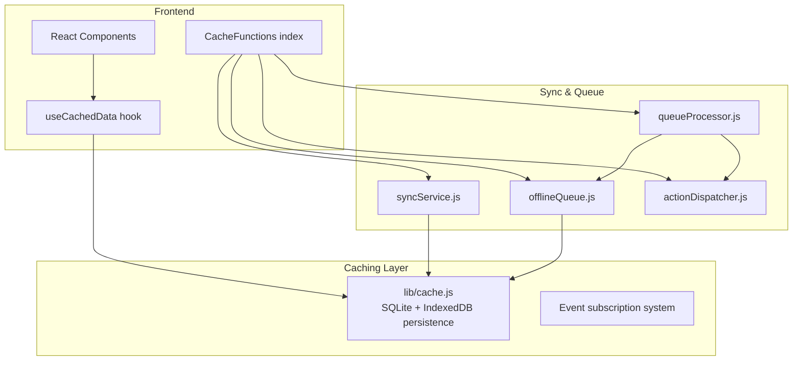
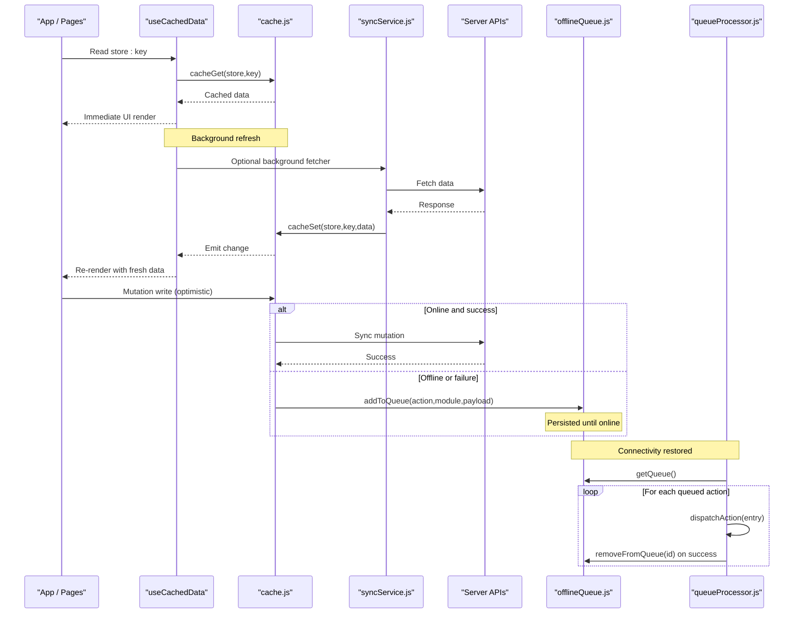
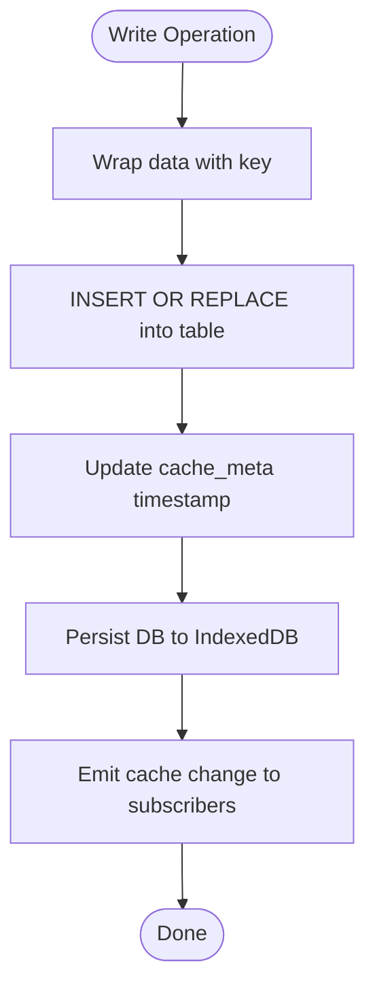
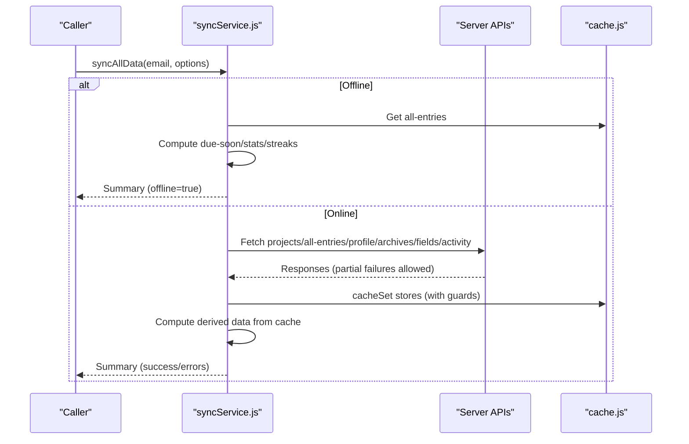
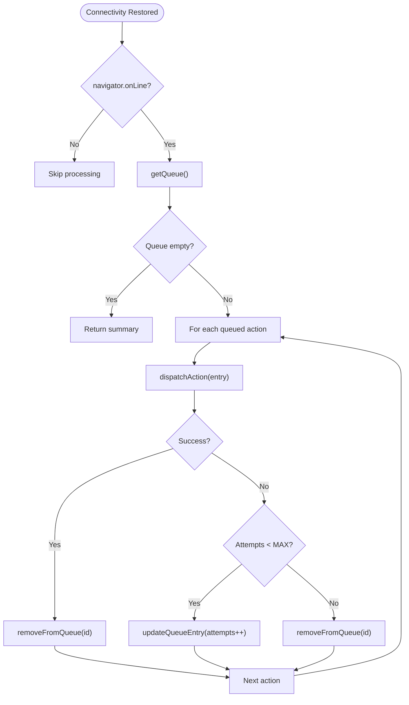
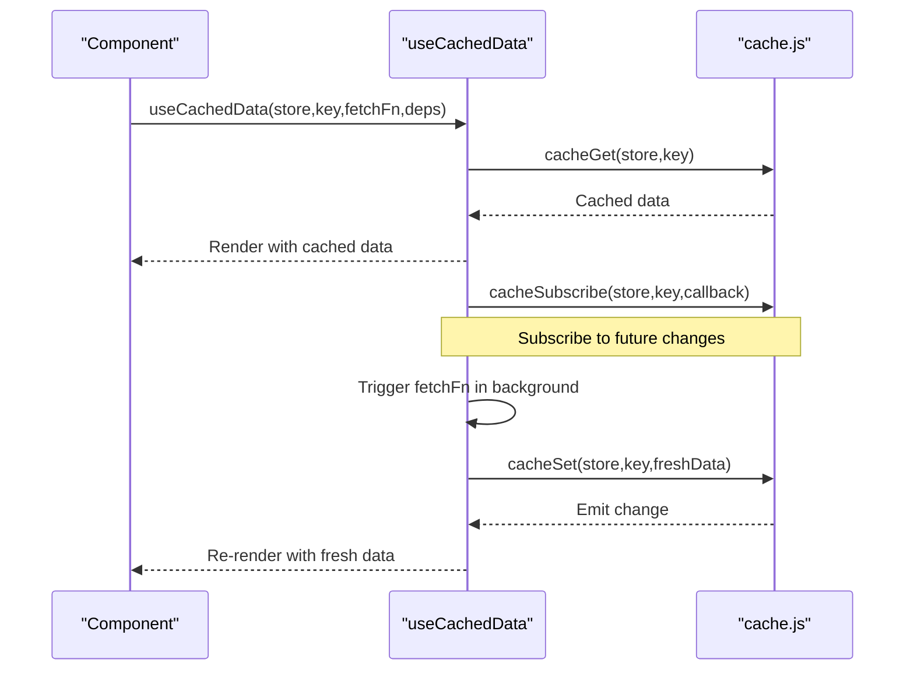
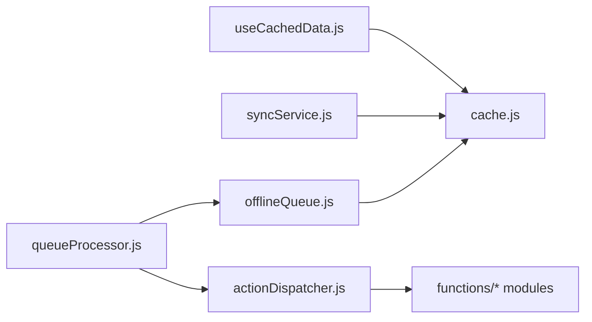

# Caching Strategy

<cite>
**Referenced Files in This Document**
- [cache.js](file://frontend/src/lib/cache.js)
- [syncService.js](file://frontend/src/CacheFunctions/syncService.js)
- [offlineQueue.js](file://frontend/src/CacheFunctions/offlineQueue.js)
- [queueProcessor.js](file://frontend/src/CacheFunctions/queueProcessor.js)
- [actionDispatcher.js](file://frontend/src/CacheFunctions/actionDispatcher.js)
- [index.js](file://frontend/src/CacheFunctions/index.js)
- [useCachedData.js](file://frontend/src/hooks/useCachedData.js)
- [caching.md](file://docs-site/docs/Architecture/caching.md)
- [cache.integration.test.js](file://frontend/src/__integration__/cache.integration.test.js)
- [sync-service.integration.test.js](file://frontend/src/__integration__/sync-service.integration.test.js)
</cite>

## Table of Contents

1. [Introduction](#introduction)
2. [Project Structure](#project-structure)
3. [Core Components](#core-components)
4. [Architecture Overview](#architecture-overview)
5. [Detailed Component Analysis](#detailed-component-analysis)
6. [Dependency Analysis](#dependency-analysis)
7. [Performance Considerations](#performance-considerations)
8. [Troubleshooting Guide](#troubleshooting-guide)
9. [Conclusion](#conclusion)

## Introduction

This document explains Codacaine’s offline-first caching strategy built on a local-first architecture. The frontend reads and writes to an IndexedDB-backed cache first, ensuring instant UI updates and full offline functionality. A centralized synchronization service populates the cache from the server, while an offline queue persists mutations made without connectivity and replays them when online. Derived data (such as due-soon entries, stats, and streaks) is computed locally from cached entries to avoid unnecessary network calls.

The system provides:

- A durable SQLite-in-memory database persisted to IndexedDB for persistence across sessions
- Event-driven cache subscriptions that keep React components reactive to cache changes
- A single source of truth for syncing all user data into IndexedDB
- An offline action queue with retry logic and progress reporting
- Hooks and utilities to build cache-aware components with minimal boilerplate

## Project Structure

Codacaine organizes caching-related code into focused modules:

- Cache layer: low-level IndexedDB storage, schema, and eventing
- Sync service: central fetch-and-populate pipeline for all data stores
- Offline queue: persistent FIFO queue for offline mutations
- Queue processor: background processing with retries and progress callbacks
- Action dispatcher: maps queued actions to function implementations
- React hooks: convenient patterns for reading from cache and subscribing to updates
- Documentation and tests: integration tests validating cache behavior and sync flows

**Diagram sources**

- [index.js:13-30](file://frontend/src/CacheFunctions/index.js#L13-L30)
- [cache.js:15-30](file://frontend/src/lib/cache.js#L15-L30)
- [syncService.js:38-53](file://frontend/src/CacheFunctions/syncService.js#L38-L53)
- [offlineQueue.js:9-12](file://frontend/src/CacheFunctions/offlineQueue.js#L9-L12)
- [queueProcessor.js:8-9](file://frontend/src/CacheFunctions/queueProcessor.js#L8-L9)
- [actionDispatcher.js:8-12](file://frontend/src/CacheFunctions/actionDispatcher.js#L8-L12)

**Section sources**

- [index.js:1-31](file://frontend/src/CacheFunctions/index.js#L1-L31)
- [cache.js:15-30](file://frontend/src/lib/cache.js#L15-L30)
- [syncService.js:1-36](file://frontend/src/CacheFunctions/syncService.js#L1-L36)
- [offlineQueue.js:1-14](file://frontend/src/CacheFunctions/offlineQueue.js#L1-L14)
- [queueProcessor.js:1-12](file://frontend/src/CacheFunctions/queueProcessor.js#L1-L12)
- [actionDispatcher.js:1-13](file://frontend/src/CacheFunctions/actionDispatcher.js#L1-L13)
- [useCachedData.js:1-22](file://frontend/src/hooks/useCachedData.js#L1-L22)
- [caching.md:1-10](file://docs-site/docs/Architecture/caching.md#L1-L10)

## Core Components

- Cache layer (IndexedDB-backed SQLite): Provides read/write/delete operations, timestamps, and event subscriptions. Data is stored in tables mirroring application entities and persisted to IndexedDB for durability.
- Sync service: Orchestrates fetching all user data from the server and populating multiple stores. It computes derived data locally and protects against overwriting non-empty caches with empty server responses.
- Offline queue: Stores mutation actions with payloads and metadata, enabling reliable replay when connectivity returns.
- Queue processor: Executes queued actions in FIFO order with retry logic and progress callbacks.
- Action dispatcher: Maps action names to their corresponding function implementations for safe execution.
- React hooks: Provide a simple pattern to read from cache immediately, subscribe to updates, and trigger background refreshes.

Key responsibilities:

- Local-first reads: Pages read from cache instantly; background fetches update the cache and notify subscribers.
- Optimistic writes: Mutations write to cache first, then sync to server; failures are queued for retry.
- Derived data computation: Due-soon, stats, and streaks are computed from cached entries without extra network calls.

**Section sources**

- [cache.js:15-30](file://frontend/src/lib/cache.js#L15-L30)
- [cache.js:179-223](file://frontend/src/lib/cache.js#L179-L223)
- [cache.js:230-241](file://frontend/src/lib/cache.js#L230-L241)
- [cache.js:249-290](file://frontend/src/lib/cache.js#L249-L290)
- [cache.js:305-346](file://frontend/src/lib/cache.js#L305-L346)
- [syncService.js:75-101](file://frontend/src/CacheFunctions/syncService.js#L75-L101)
- [syncService.js:106-154](file://frontend/src/CacheFunctions/syncService.js#L106-L154)
- [syncService.js:156-387](file://frontend/src/CacheFunctions/syncService.js#L156-L387)
- [offlineQueue.js:21-44](file://frontend/src/CacheFunctions/offlineQueue.js#L21-L44)
- [queueProcessor.js:21-90](file://frontend/src/CacheFunctions/queueProcessor.js#L21-L90)
- [actionDispatcher.js:18-118](file://frontend/src/CacheFunctions/actionDispatcher.js#L18-L118)
- [useCachedData.js:23-76](file://frontend/src/hooks/useCachedData.js#L23-L76)

## Architecture Overview

The system follows a local-first pattern:

- On app load or login, a central sync service fetches all data and populates IndexedDB stores.
- Pages read from IndexedDB immediately via hooks or direct cache access.
- Mutations write to IndexedDB optimistically, then sync to the server; if offline or failing, they are queued.
- When connectivity returns, the queue processor executes queued actions with retries and reports progress.

**Diagram sources**

- [useCachedData.js:23-76](file://frontend/src/hooks/useCachedData.js#L23-L76)
- [cache.js:179-223](file://frontend/src/lib/cache.js#L179-L223)
- [syncService.js:75-101](file://frontend/src/CacheFunctions/syncService.js#L75-L101)
- [offlineQueue.js:21-44](file://frontend/src/CacheFunctions/offlineQueue.js#L21-L44)
- [queueProcessor.js:21-90](file://frontend/src/CacheFunctions/queueProcessor.js#L21-L90)

## Detailed Component Analysis

### Cache Layer (SQLite + IndexedDB Persistence)

- Storage model: In-memory SQLite tables mirror application entities and are persisted to IndexedDB for durability. Tables include projects, entries, all_entries, profile, search, archives, fields, notes, cache_meta, and offline_queue.
- Operations:
  - Read: cacheGet retrieves JSON blobs by store and key.
  - Write: cacheSet wraps objects with keys, updates timestamps, persists to IndexedDB, and emits cache changes.
  - Delete: cacheDelete removes records and metadata, notifying subscribers with null.
  - Timestamps: cacheGetTimestamp supports stale-while-revalidate strategies.
  - User-scoped clearing: clearUserCache wipes relevant stores for a given email.
- Events: cacheSubscribe registers listeners per store:key; emitCacheChange notifies subscribers with unwrapped data.

**Diagram sources**

- [cache.js:201-223](file://frontend/src/lib/cache.js#L201-L223)
- [cache.js:230-241](file://frontend/src/lib/cache.js#L230-L241)
- [cache.js:249-290](file://frontend/src/lib/cache.js#L249-L290)

**Section sources**

- [cache.js:15-30](file://frontend/src/lib/cache.js#L15-L30)
- [cache.js:45-72](file://frontend/src/lib/cache.js#L45-L72)
- [cache.js:78-119](file://frontend/src/lib/cache.js#L78-L119)
- [cache.js:125-171](file://frontend/src/lib/cache.js#L125-L171)
- [cache.js:179-223](file://frontend/src/lib/cache.js#L179-L223)
- [cache.js:230-241](file://frontend/src/lib/cache.js#L230-L241)
- [cache.js:249-290](file://frontend/src/lib/cache.js#L249-L290)
- [cache.js:305-346](file://frontend/src/lib/cache.js#L305-L346)

### Synchronization Service

- Entry point: syncAllData orchestrates fetching all user data and populating stores. It prevents duplicate concurrent syncs and throttles frequent re-syncs.
- Offline handling: If offline, it computes derived data (due-soon, stats, streaks) from existing cache without network calls.
- Sequential phases: Fetches projects, all entries, profile, archives, fields, and activity with individual error handling so one failure does not block others.
- Guards: Avoids overwriting non-empty caches with empty server responses using a sentinel skip mechanism.
- Derived data: Computes due-soon entries, total time tracked, project stats, and streaks from cached entries and writes them to appropriate stores.
- Per-project caches: Derives per-project entry lists from all-entries to avoid additional server calls.

**Diagram sources**

- [syncService.js:75-101](file://frontend/src/CacheFunctions/syncService.js#L75-L101)
- [syncService.js:106-154](file://frontend/src/CacheFunctions/syncService.js#L106-L154)
- [syncService.js:156-387](file://frontend/src/CacheFunctions/syncService.js#L156-L387)
- [cache.js:179-223](file://frontend/src/lib/cache.js#L179-L223)

**Section sources**

- [syncService.js:75-101](file://frontend/src/CacheFunctions/syncService.js#L75-L101)
- [syncService.js:106-154](file://frontend/src/CacheFunctions/syncService.js#L106-L154)
- [syncService.js:156-387](file://frontend/src/CacheFunctions/syncService.js#L156-L387)
- [syncService.js:396-407](file://frontend/src/CacheFunctions/syncService.js#L396-L407)
- [syncService.js:417-449](file://frontend/src/CacheFunctions/syncService.js#L417-L449)

### Offline Queue and Queue Processing

- Queue storage: Actions are persisted in SQLite with fields including id, action, module, payload, timestamp, and attempts.
- Operations: Add, retrieve, remove, update, clear, and count pending actions.
- Processing: When online, processQueue executes actions in FIFO order, dispatches via actionDispatcher, and manages retries up to a maximum attempt threshold.
- Progress reporting: Callbacks report start, success, retry, failed, and complete events for UI feedback.

**Diagram sources**

- [offlineQueue.js:21-44](file://frontend/src/CacheFunctions/offlineQueue.js#L21-L44)
- [offlineQueue.js:50-63](file://frontend/src/CacheFunctions/offlineQueue.js#L50-L63)
- [offlineQueue.js:88-114](file://frontend/src/CacheFunctions/offlineQueue.js#L88-L114)
- [queueProcessor.js:21-90](file://frontend/src/CacheFunctions/queueProcessor.js#L21-L90)
- [actionDispatcher.js:112-118](file://frontend/src/CacheFunctions/actionDispatcher.js#L112-L118)

**Section sources**

- [offlineQueue.js:21-44](file://frontend/src/CacheFunctions/offlineQueue.js#L21-L44)
- [offlineQueue.js:50-63](file://frontend/src/CacheFunctions/offlineQueue.js#L50-L63)
- [offlineQueue.js:88-114](file://frontend/src/CacheFunctions/offlineQueue.js#L88-L114)
- [offlineQueue.js:120-145](file://frontend/src/CacheFunctions/offlineQueue.js#L120-L145)
- [queueProcessor.js:21-90](file://frontend/src/CacheFunctions/queueProcessor.js#L21-L90)
- [queueProcessor.js:97-137](file://frontend/src/CacheFunctions/queueProcessor.js#L97-L137)
- [queueProcessor.js:143-155](file://frontend/src/CacheFunctions/queueProcessor.js#L143-L155)
- [actionDispatcher.js:18-118](file://frontend/src/CacheFunctions/actionDispatcher.js#L18-L118)

### React Integration (useCachedData Hook)

- Behavior: Reads from IndexedDB immediately, subscribes to cache changes for reactive updates, and triggers optional background fetchers that write back to cache.
- Convenience hooks: useCachedProjects, useCachedEntries, useCachedProfile simplify common patterns.
- Error handling: Logs warnings for background fetch failures without breaking UI.

**Diagram sources**

- [useCachedData.js:23-76](file://frontend/src/hooks/useCachedData.js#L23-L76)
- [cache.js:45-72](file://frontend/src/lib/cache.js#L45-L72)
- [cache.js:179-223](file://frontend/src/lib/cache.js#L179-L223)

**Section sources**

- [useCachedData.js:23-76](file://frontend/src/hooks/useCachedData.js#L23-L76)
- [useCachedData.js:81-99](file://frontend/src/hooks/useCachedData.js#L81-L99)

### Data Models and Cache Structure

- Stores:
  - projects: All user projects keyed by email
  - all-entries: All entries across projects keyed by email
  - entries: Per-project entries keyed by email:projectName
  - profile: User profile keyed by email
  - search: Derived results such as stats and streaks keyed by email
  - archives: Archived entries and projects with various keys
  - fields: Custom field definitions keyed by email:table_name
  - notes: Notes storage
  - cache_meta: Timestamps for cache entries keyed by key
  - offline_queue: Queued offline actions with auto-increment ids
- Key formats:
  - Email-based keys for user-scoped data
  - Composite keys for per-project or per-table scoping
  - Auto-increment ids for queue entries

**Section sources**

- [cache.js:15-30](file://frontend/src/lib/cache.js#L15-L30)
- [cache.js:150-162](file://frontend/src/lib/cache.js#L150-L162)
- [caching.md:222-234](file://docs-site/docs/Architecture/caching.md#L222-L234)

## Dependency Analysis

- Cache layer depends on sql.js and IndexedDB for persistence and queries.
- Sync service depends on functions under frontend/src/functions for server data retrieval and pure compute functions for derived data.
- Offline queue depends on the shared SQLite instance exposed by the cache layer.
- Queue processor depends on offline queue and action dispatcher.
- Action dispatcher imports mutation modules to execute queued actions.
- React hooks depend on cache layer for reads, writes, and subscriptions.

**Diagram sources**

- [cache.js:125-171](file://frontend/src/lib/cache.js#L125-L171)
- [syncService.js:38-53](file://frontend/src/CacheFunctions/syncService.js#L38-L53)
- [offlineQueue.js:9-12](file://frontend/src/CacheFunctions/offlineQueue.js#L9-L12)
- [queueProcessor.js:8-9](file://frontend/src/CacheFunctions/queueProcessor.js#L8-L9)
- [actionDispatcher.js:8-12](file://frontend/src/CacheFunctions/actionDispatcher.js#L8-L12)
- [useCachedData.js:20-22](file://frontend/src/hooks/useCachedData.js#L20-L22)

**Section sources**

- [cache.js:125-171](file://frontend/src/lib/cache.js#L125-L171)
- [syncService.js:38-53](file://frontend/src/CacheFunctions/syncService.js#L38-L53)
- [offlineQueue.js:9-12](file://frontend/src/CacheFunctions/offlineQueue.js#L9-L12)
- [queueProcessor.js:8-9](file://frontend/src/CacheFunctions/queueProcessor.js#L8-L9)
- [actionDispatcher.js:8-12](file://frontend/src/CacheFunctions/actionDispatcher.js#L8-L12)
- [useCachedData.js:20-22](file://frontend/src/hooks/useCachedData.js#L20-L22)

## Performance Considerations

- First visit vs subsequent visits: Initial load may require network sync; subsequent reads are fast IndexedDB operations.
- Stale-while-revalidate: Use maxAge to balance freshness and performance; return cached data immediately while refreshing in background.
- Batched sync: Centralized sync reduces redundant network calls and ensures consistent cache state.
- Derived data computation: Computing due-soon, stats, and streaks locally avoids extra server requests.
- Throttling: Prevent excessive re-syncs by enforcing minimum intervals unless forced.
- Subscriber efficiency: Event-driven updates minimize unnecessary re-renders by targeting specific store:key combinations.

[No sources needed since this section provides general guidance]

## Troubleshooting Guide

Common issues and resolutions:

- Cache not updating after mutation:
  - Ensure mutations call cacheSet to persist changes and trigger subscriber notifications.
  - Verify that components subscribe to the correct store:key via cacheSubscribe or useCachedData.
- Stale data appearing:
  - Adjust maxAge in staleWhileRevalidate to control staleness thresholds.
  - Force a refresh via syncAllData with force flag when necessary.
- Offline actions not syncing:
  - Confirm processQueue is invoked when connectivity is restored.
  - Check queue length and inspect queued actions for errors.
- Duplicate syncs or race conditions:
  - Rely on syncService’s concurrency guard and throttle to prevent overlapping syncs.
  - Use guards to avoid overwriting non-empty caches with empty server responses.
- Debugging cache state:
  - Inspect cache_meta timestamps to understand last update times.
  - Use integration tests as reference for expected behaviors around set/get/subscribe/delete flows.

**Section sources**

- [cache.js:201-223](file://frontend/src/lib/cache.js#L201-L223)
- [cache.js:305-346](file://frontend/src/lib/cache.js#L305-L346)
- [syncService.js:75-101](file://frontend/src/CacheFunctions/syncService.js#L75-L101)
- [queueProcessor.js:21-90](file://frontend/src/CacheFunctions/queueProcessor.js#L21-L90)
- [cache.integration.test.js:26-152](file://frontend/src/__integration__/cache.integration.test.js#L26-L152)
- [sync-service.integration.test.js:60-146](file://frontend/src/__integration__/sync-service.integration.test.js#L60-L146)

## Conclusion

Codacaine’s offline-first caching strategy delivers a responsive, resilient user experience by prioritizing local data access and deferring network interactions. The SQLite-backed cache with IndexedDB persistence ensures durability, while event-driven subscriptions enable reactive UI updates. The centralized sync service guarantees consistent cache population, and the offline queue with robust processing ensures mutations are reliably applied when connectivity returns. By following the documented patterns—local-first reads, optimistic writes, derived data computation, and careful invalidation—you can implement cache-aware components that perform well both online and offline.

[No sources needed since this section summarizes without analyzing specific files]
