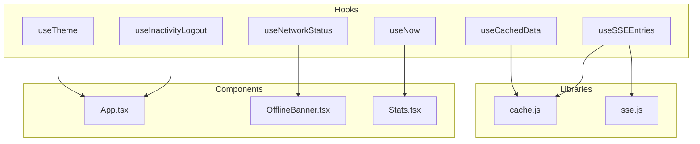
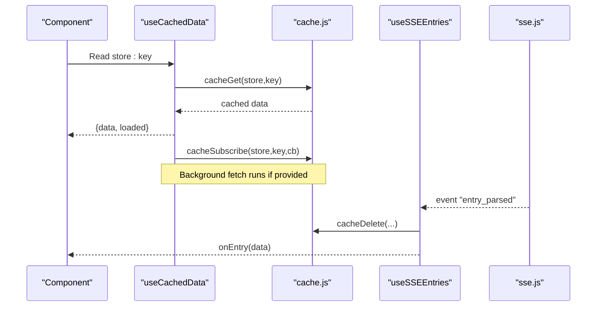
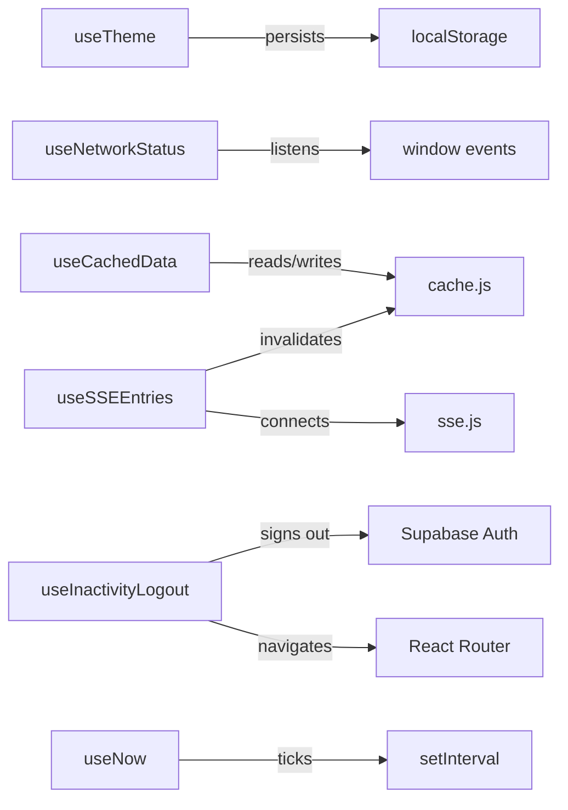

# Custom Hooks Architecture

<cite>
**Referenced Files in This Document**
- [useTheme.ts](file://frontend/src/hooks/useTheme.ts)
- [useNetworkStatus.js](file://frontend/src/hooks/useNetworkStatus.js)
- [useCachedData.js](file://frontend/src/hooks/useCachedData.js)
- [useSSEEntries.ts](file://frontend/src/hooks/useSSEEntries.ts)
- [useInactivityLogout.ts](file://frontend/src/hooks/useInactivityLogout.ts)
- [useNow.ts](file://frontend/src/hooks/useNow.ts)
- [cache.js](file://frontend/src/lib/cache.js)
- [sse.js](file://frontend/src/lib/sse.js)
- [App.tsx](file://frontend/src/App.tsx)
- [OfflineBanner.tsx](file://frontend/src/components/OfflineBanner.tsx)
- [Stats.tsx](file://frontend/src/components/Stats.tsx)
</cite>

## Table of Contents

1. [Introduction](#introduction)
2. [Project Structure](#project-structure)
3. [Core Components](#core-components)
4. [Architecture Overview](#architecture-overview)
5. [Detailed Component Analysis](#detailed-component-analysis)
6. [Dependency Analysis](#dependency-analysis)
7. [Performance Considerations](#performance-considerations)
8. [Troubleshooting Guide](#troubleshooting-guide)
9. [Conclusion](#conclusion)

## Introduction

This document explains the custom hooks architecture in Codacaine’s frontend, focusing on how reusable logic is encapsulated for theme management, network status detection, IndexedDB caching with offline support, real-time updates via Server-Sent Events (SSE), automatic session timeout on inactivity, and time-based operations. It provides purpose, parameters, return values, usage patterns, error handling strategies, performance considerations, and hook composition best practices.

## Project Structure

The hooks live under frontend/src/hooks and integrate with shared libraries:

- Theme management: useTheme.ts
- Network connectivity: useNetworkStatus.js
- Data caching: useCachedData.js + cache.js (IndexedDB-backed SQLite)
- Real-time updates: useSSEEntries.ts + sse.js
- Session security: useInactivityLogout.ts
- Time utilities: useNow.ts

**Diagram sources**

- [useTheme.ts:24-47](file://frontend/src/hooks/useTheme.ts#L24-L47)
- [useNetworkStatus.js:14-40](file://frontend/src/hooks/useNetworkStatus.js#L14-L40)
- [useCachedData.js:23-76](file://frontend/src/hooks/useCachedData.js#L23-L76)
- [useSSEEntries.ts:41-107](file://frontend/src/hooks/useSSEEntries.ts#L41-L107)
- [useInactivityLogout.ts:29-80](file://frontend/src/hooks/useInactivityLogout.ts#L29-L80)
- [useNow.ts:13-25](file://frontend/src/hooks/useNow.ts#L13-L25)
- [cache.js:179-263](file://frontend/src/lib/cache.js#L179-L263)
- [sse.js:37-134](file://frontend/src/lib/sse.js#L37-L134)
- [App.tsx:38-41](file://frontend/src/App.tsx#L38-L41)
- [OfflineBanner.tsx:7-10](file://frontend/src/components/OfflineBanner.tsx#L7-L10)
- [Stats.tsx:120-124](file://frontend/src/components/Stats.tsx#L120-L124)

**Section sources**

- [useTheme.ts:24-47](file://frontend/src/hooks/useTheme.ts#L24-L47)
- [useNetworkStatus.js:14-40](file://frontend/src/hooks/useNetworkStatus.js#L14-L40)
- [useCachedData.js:23-76](file://frontend/src/hooks/useCachedData.js#L23-L76)
- [useSSEEntries.ts:41-107](file://frontend/src/hooks/useSSEEntries.ts#L41-L107)
- [useInactivityLogout.ts:29-80](file://frontend/src/hooks/useInactivityLogout.ts#L29-L80)
- [useNow.ts:13-25](file://frontend/src/hooks/useNow.ts#L13-L25)
- [cache.js:179-263](file://frontend/src/lib/cache.js#L179-L263)
- [sse.js:37-134](file://frontend/src/lib/sse.js#L37-L134)
- [App.tsx:38-41](file://frontend/src/App.tsx#L38-L41)
- [OfflineBanner.tsx:7-10](file://frontend/src/components/OfflineBanner.tsx#L7-L10)
- [Stats.tsx:120-124](file://frontend/src/components/Stats.tsx#L120-L124)

## Core Components

- useTheme: Manages theme state, persistence to localStorage, applies data-theme attribute, exposes toggle and dark-mode flag.
- useNetworkStatus: Tracks browser online/offline via window events; returns boolean.
- useCachedData: Reads from IndexedDB immediately, subscribes to cache changes, triggers background fetch, returns { data, loaded } plus convenience hooks for projects, entries, profile.
- useSSEEntries: Connects to SSE stream, invalidates relevant IndexedDB caches on entry_parsed or entry_error, and invokes a caller-provided callback.
- useInactivityLogout: Monitors user activity and signs out after a configurable timeout using Supabase auth and navigation.
- useNow: Provides a ticking timestamp with optional enable/disable to control re-renders.

**Section sources**

- [useTheme.ts:24-47](file://frontend/src/hooks/useTheme.ts#L24-L47)
- [useNetworkStatus.js:14-40](file://frontend/src/hooks/useNetworkStatus.js#L14-L40)
- [useCachedData.js:23-76](file://frontend/src/hooks/useCachedData.js#L23-L76)
- [useSSEEntries.ts:41-107](file://frontend/src/hooks/useSSEEntries.ts#L41-L107)
- [useInactivityLogout.ts:29-80](file://frontend/src/hooks/useInactivityLogout.ts#L29-L80)
- [useNow.ts:13-25](file://frontend/src/hooks/useNow.ts#L13-L25)

## Architecture Overview

The hooks compose to deliver a resilient, responsive UI:

- Theme is applied at app root.
- Network status drives banners and behavior.
- Cached data ensures instant reads and background refreshes.
- SSE keeps the cache fresh and notifies UI changes.
- Inactivity logout secures sessions.
- useNow powers live timers when needed.

**Diagram sources**

- [useCachedData.js:23-76](file://frontend/src/hooks/useCachedData.js#L23-L76)
- [cache.js:179-263](file://frontend/src/lib/cache.js#L179-L263)
- [useSSEEntries.ts:41-107](file://frontend/src/hooks/useSSEEntries.ts#L41-L107)
- [sse.js:37-134](file://frontend/src/lib/sse.js#L37-L134)

## Detailed Component Analysis

### useTheme

Purpose: Centralized theme management with persistence and quick toggles.

Parameters: None
Return value: Object with:

- theme: current theme string
- setTheme(theme): update theme
- toggleTheme(): switch between light/dark
- isDark: boolean indicating dark-like themes

Usage pattern:

- Mount once at app root to apply initial theme.
- Use setTheme/toggleTheme in settings UI.
- Use isDark for conditional styling.

Error handling:

- Safe fallback to 'light' if stored value is invalid.

Performance:

- Uses useCallback and useMemo to avoid unnecessary re-renders.

Example usage references:

- Root initialization in App.tsx
- Usage in SettingsPanel and AvatarPicker

**Section sources**

- [useTheme.ts:24-47](file://frontend/src/hooks/useTheme.ts#L24-L47)
- [App.tsx:38-41](file://frontend/src/App.tsx#L38-L41)

### useNetworkStatus

Purpose: Provide reactive online/offline status to components.

Parameters: None
Return value: boolean (true if online)

Usage pattern:

- Render an offline banner or disable network-dependent features when false.

Error handling:

- Gracefully handles missing navigator in non-browser environments by defaulting to true.

Performance:

- Minimal overhead; only listens to two window events.

Example usage references:

- OfflineBanner component hides itself when online.

**Section sources**

- [useNetworkStatus.js:14-40](file://frontend/src/hooks/useNetworkStatus.js#L14-L40)
- [OfflineBanner.tsx:7-10](file://frontend/src/components/OfflineBanner.tsx#L7-L10)

### useCachedData

Purpose: Local-first data loading with IndexedDB caching and background refresh.

Parameters:

- store: string (e.g., projects, entries, all-entries, profile)
- key: string (unique cache key per user/project)
- fetchFn?: async function that writes to cache via cacheSet
- deps?: array of dependencies to re-run fetchFn

Return value:

- data: cached payload or null
- loaded: boolean indicating whether initial read completed

Behavior:

- Immediately reads from IndexedDB and sets loaded.
- Subscribes to cache changes to re-render on updates.
- Runs fetchFn in background; errors are logged but do not break UX.

Convenience hooks:

- useCachedProjects(email, fetchFn)
- useCachedEntries(email, projectName, fetchFn)
- useCachedProfile(email, fetchFn)

Error handling:

- Logs warnings on failed background fetches.
- Subscribers are protected against exceptions.

Performance:

- Avoids loading states by showing cached data first.
- Debounces re-renders via subscription model.

Example usage references:

- Integration tests demonstrate typical call patterns.

**Section sources**

- [useCachedData.js:23-76](file://frontend/src/hooks/useCachedData.js#L23-L76)
- [cache.js:179-263](file://frontend/src/lib/cache.js#L179-L263)

### useSSEEntries

Purpose: Connect to SSE stream and keep IndexedDB cache in sync with server-side parsing results.

Parameters:

- options.onEntry?: (data) => void — callback invoked on entry_parsed or entry_error
- options.enabled?: boolean — controls connection lifecycle

Return value: None (side-effect hook)

Behavior:

- Connects to SSE when user email exists and enabled is true.
- On entry_parsed:
  - Multi-entry mode: invalidates all-entries, projects, and affected project entries.
  - Single-entry mode: invalidates specific project entries and all-entries; also invalidates projects if a new project was created.
- On entry_error: forwards error payload to onEntry.

Error handling:

- Logs warnings for parse or dispatch errors in SSE layer.
- Best-effort cache invalidation; failures are logged.

Performance:

- Shares a single SSE connection across the app; does not disconnect on unmount.

Example usage references:

- Documentation describes integration with AuthContext and cache invalidation.

**Section sources**

- [useSSEEntries.ts:41-107](file://frontend/src/hooks/useSSEEntries.ts#L41-L107)
- [sse.js:37-134](file://frontend/src/lib/sse.js#L37-L134)
- [cache.js:249-263](file://frontend/src/lib/cache.js#L249-L263)

### useInactivityLogout

Purpose: Automatically sign out users after a period of inactivity.

Parameters:

- options.enabled?: boolean — enable/disable feature
- options.timeoutMs?: number — milliseconds before logout (default 30 minutes)

Return value: None (side-effect hook)

Behavior:

- Listens to mouse, keyboard, touch, scroll, and click events.
- Resets a timer on each activity; on timeout, signs out via Supabase and navigates to sign-in.

Error handling:

- Sign-out failure is tolerated; navigation still occurs to ensure consistent UI state.

Performance:

- Uses passive listeners and a single timer ref.

Example usage references:

- Intended to be mounted in authenticated contexts; currently commented in AuthContext.

**Section sources**

- [useInactivityLogout.ts:29-80](file://frontend/src/hooks/useInactivityLogout.ts#L29-L80)

### useNow

Purpose: Provide a ticking timestamp suitable for live countdowns or durations.

Parameters:

- intervalMs?: number — tick interval (default 1000ms)
- enabled?: boolean — pause ticking when false

Return value: number — current time in ms, updated on interval

Behavior:

- When enabled, sets immediate time and starts interval; clears interval on unmount or when disabled.

Usage pattern:

- Pass enabled=false when no in-progress tasks exist to avoid unnecessary renders.

Example usage references:

- Stats component uses it to update durations while tasks are running.

**Section sources**

- [useNow.ts:13-25](file://frontend/src/hooks/useNow.ts#L13-L25)
- [Stats.tsx:120-124](file://frontend/src/components/Stats.tsx#L120-L124)

## Dependency Analysis

Key relationships:

- useCachedData depends on cache.js for storage and subscriptions.
- useSSEEntries depends on sse.js for event transport and cache.js for cache invalidation.
- useInactivityLogout depends on Supabase client and React Router navigation.
- useTheme persists to localStorage and manipulates DOM attributes.
- useNetworkStatus depends on window events.
- useNow depends on setInterval.

**Diagram sources**

- [useTheme.ts:24-47](file://frontend/src/hooks/useTheme.ts#L24-L47)
- [useNetworkStatus.js:14-40](file://frontend/src/hooks/useNetworkStatus.js#L14-L40)
- [useCachedData.js:23-76](file://frontend/src/hooks/useCachedData.js#L23-L76)
- [useSSEEntries.ts:41-107](file://frontend/src/hooks/useSSEEntries.ts#L41-L107)
- [useInactivityLogout.ts:29-80](file://frontend/src/hooks/useInactivityLogout.ts#L29-L80)
- [useNow.ts:13-25](file://frontend/src/hooks/useNow.ts#L13-L25)
- [cache.js:179-263](file://frontend/src/lib/cache.js#L179-L263)
- [sse.js:37-134](file://frontend/src/lib/sse.js#L37-L134)

**Section sources**

- [useCachedData.js:23-76](file://frontend/src/hooks/useCachedData.js#L23-L76)
- [useSSEEntries.ts:41-107](file://frontend/src/hooks/useSSEEntries.ts#L41-L107)
- [cache.js:179-263](file://frontend/src/lib/cache.js#L179-L263)
- [sse.js:37-134](file://frontend/src/lib/sse.js#L37-L134)
- [useInactivityLogout.ts:29-80](file://frontend/src/hooks/useInactivityLogout.ts#L29-L80)
- [useTheme.ts:24-47](file://frontend/src/hooks/useTheme.ts#L24-L47)
- [useNetworkStatus.js:14-40](file://frontend/src/hooks/useNetworkStatus.js#L14-L40)
- [useNow.ts:13-25](file://frontend/src/hooks/useNow.ts#L13-L25)

## Performance Considerations

- Prefer useCachedData to show stale data immediately and refresh in background; this reduces perceived latency.
- Use useNow with enabled=false when no live updates are needed to avoid unnecessary re-renders.
- Leverage useSSEEntries to invalidate only affected cache keys rather than full reloads.
- Keep SSE connection global; avoid reconnect storms by relying on built-in exponential backoff.
- Memoize derived values in components consuming hooks (e.g., useMemo around computed stats).

[No sources needed since this section provides general guidance]

## Troubleshooting Guide

Common issues and resolutions:

- Theme not applying: Ensure useTheme is called at app root and that CSS respects data-theme attribute.
- Offline banner not showing: Verify window online/offline events fire in your environment; confirm useNetworkStatus is used in a rendered component.
- Cached data not updating: Confirm fetchFn calls cacheSet to trigger subscribers; check cache.js emitCacheChange path.
- SSE not receiving events: Check connectSSE logs, token availability, and backend endpoint; verify onSSEEvent registration before connecting.
- Unexpected logout: Review inactivity timeout and activity events; ensure enabled flag is correct.
- Timers not ticking: Ensure useNow enabled=true when live updates are required.

**Section sources**

- [useTheme.ts:24-47](file://frontend/src/hooks/useTheme.ts#L24-L47)
- [useNetworkStatus.js:14-40](file://frontend/src/hooks/useNetworkStatus.js#L14-L40)
- [useCachedData.js:23-76](file://frontend/src/hooks/useCachedData.js#L23-L76)
- [useSSEEntries.ts:41-107](file://frontend/src/hooks/useSSEEntries.ts#L41-L107)
- [useInactivityLogout.ts:29-80](file://frontend/src/hooks/useInactivityLogout.ts#L29-L80)
- [useNow.ts:13-25](file://frontend/src/hooks/useNow.ts#L13-L25)
- [cache.js:179-263](file://frontend/src/lib/cache.js#L179-L263)
- [sse.js:37-134](file://frontend/src/lib/sse.js#L37-L134)

## Conclusion

Codacaine’s custom hooks provide a cohesive, performant foundation for theme management, connectivity awareness, local-first data access, real-time synchronization, session security, and time-driven UI updates. By composing these hooks thoughtfully and following the patterns outlined here, you can build responsive, resilient interfaces that work well both online and offline.

[No sources needed since this section summarizes without analyzing specific files]
