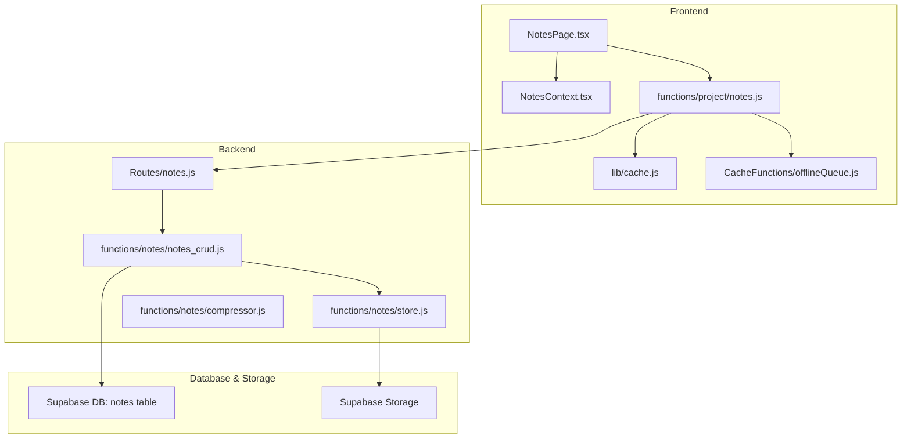
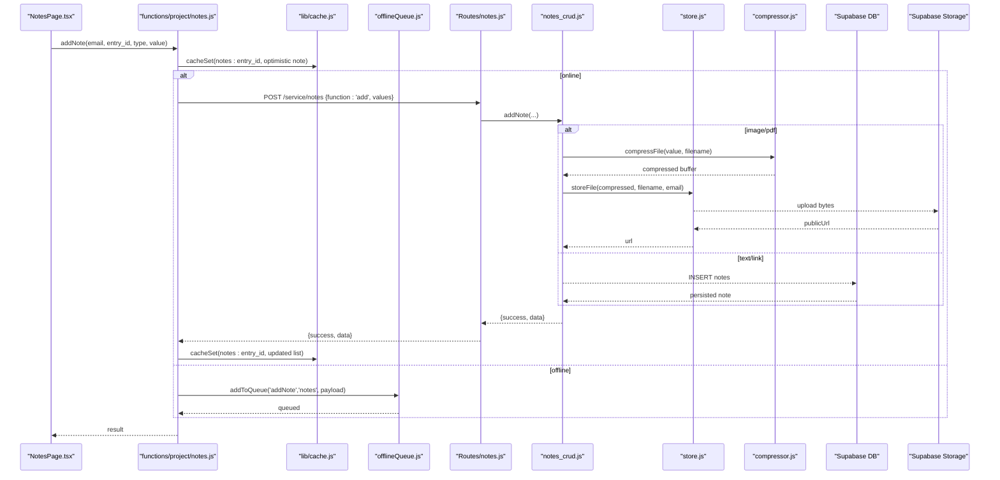
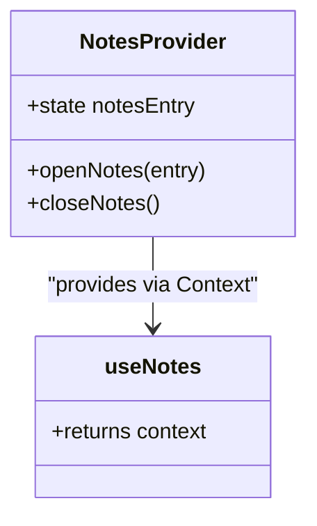
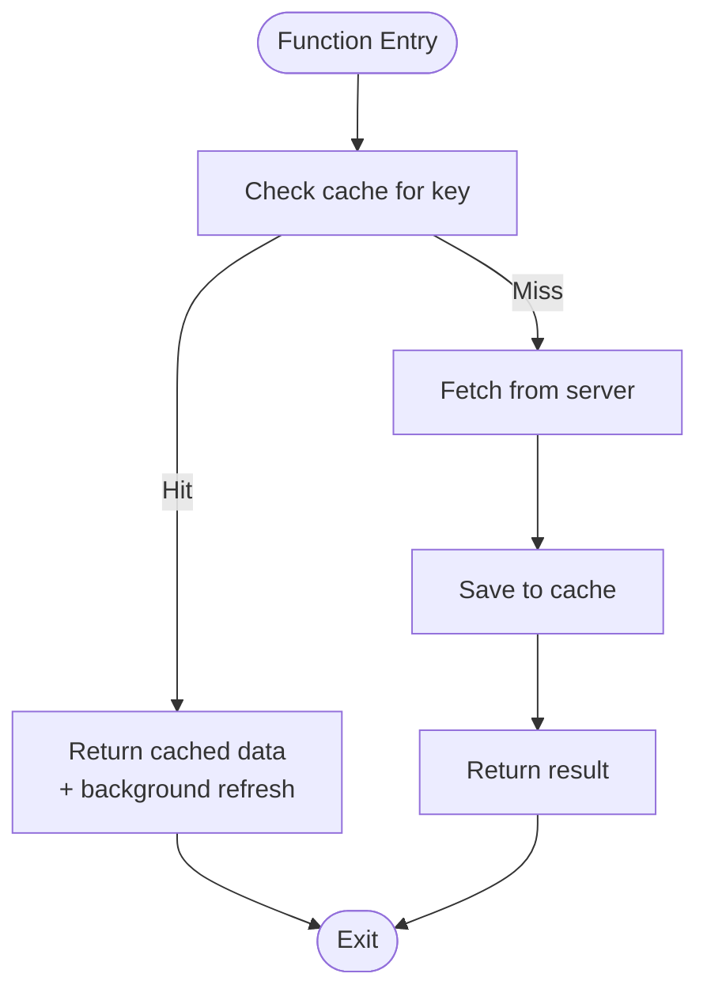
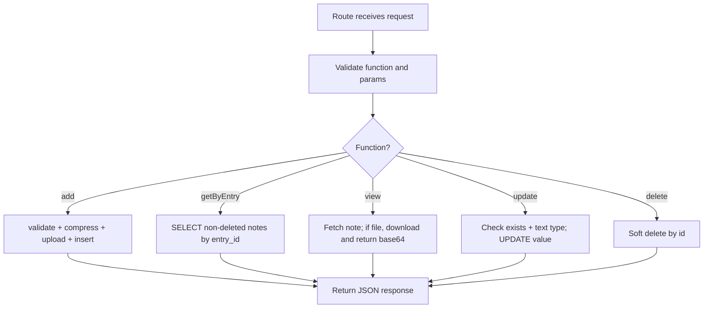
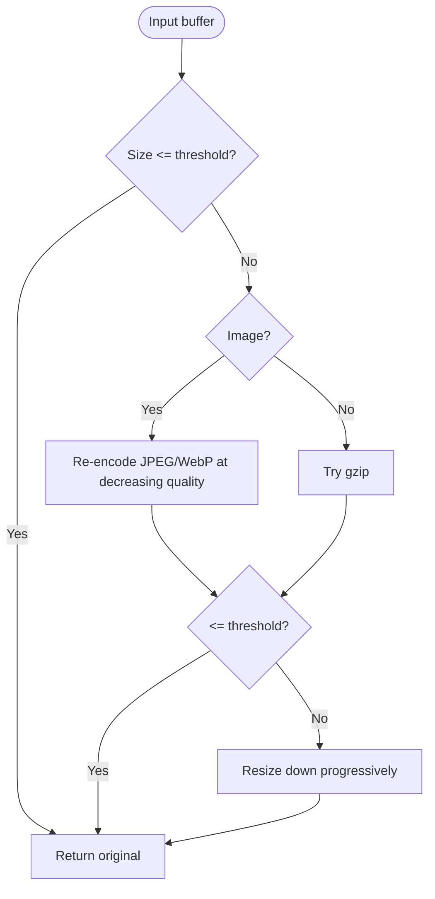
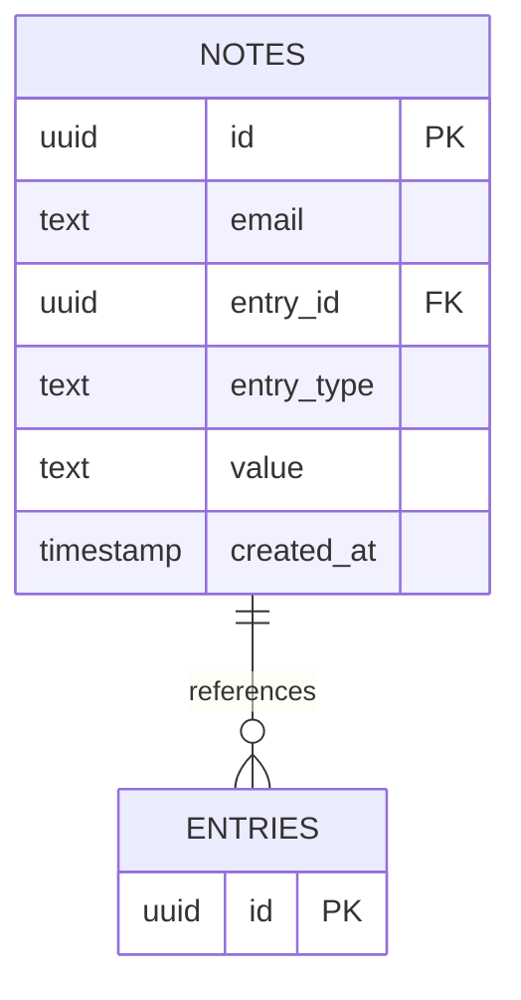
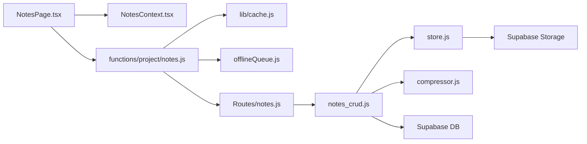

# Notes Context

<cite>
**Referenced Files in This Document**
- [NotesContext.tsx](file://frontend/src/context/NotesContext.tsx)
- [notes.js (frontend)](file://frontend/src/functions/project/notes.js)
- [NotesPage.tsx](file://frontend/src/pages/NotesPage.tsx)
- [notes.js (backend route)](file://services/project-service/src/Routes/notes.js)
- [notes_crud.js](file://services/project-service/src/functions/notes/notes_crud.js)
- [store.js](file://services/project-service/src/functions/notes/store.js)
- [compressor.js](file://services/project-service/src/functions/notes/compressor.js)
- [cache.js](file://frontend/src/lib/cache.js)
- [offlineQueue.js](file://frontend/src/CacheFunctions/offlineQueue.js)
- [009_create_notes_table.sql](file://supabase/migrations/009_create_notes_table.sql)
</cite>

## Table of Contents

1. [Introduction](#introduction)
2. [Project Structure](#project-structure)
3. [Core Components](#core-components)
4. [Architecture Overview](#architecture-overview)
5. [Detailed Component Analysis](#detailed-component-analysis)
6. [Dependency Analysis](#dependency-analysis)
7. [Performance Considerations](#performance-considerations)
8. [Troubleshooting Guide](#troubleshooting-guide)
9. [Conclusion](#conclusion)
10. [Appendices](#appendices)

## Introduction

This document explains the notes context and end-to-end note-taking functionality across the application. It covers how notes are created, edited, deleted, and organized; the context state and actions; data persistence strategies including caching and offline queuing; validation and error handling; integration with other features; and performance considerations for large collections and real-time synchronization patterns.

## Project Structure

The notes feature spans frontend UI, a React context for modal state, frontend service functions for API calls and caching, backend routes and business logic, storage utilities, and database schema.

**Diagram sources**

- [NotesPage.tsx:1-730](file://frontend/src/pages/NotesPage.tsx#L1-L730)
- [NotesContext.tsx:1-47](file://frontend/src/context/NotesContext.tsx#L1-L47)
- [notes.js (frontend):1-250](file://frontend/src/functions/project/notes.js#L1-L250)
- [cache.js:1-389](file://frontend/src/lib/cache.js#L1-L389)
- [offlineQueue.js:1-145](file://frontend/src/CacheFunctions/offlineQueue.js#L1-L145)
- [notes.js (backend route):1-92](file://services/project-service/src/Routes/notes.js#L1-L92)
- [notes_crud.js:1-244](file://services/project-service/src/functions/notes/notes_crud.js#L1-L244)
- [store.js:1-109](file://services/project-service/src/functions/notes/store.js#L1-L109)
- [compressor.js:1-144](file://services/project-service/src/functions/notes/compressor.js#L1-L144)

**Section sources**

- [NotesContext.tsx:1-47](file://frontend/src/context/NotesContext.tsx#L1-L47)
- [notes.js (frontend):1-250](file://frontend/src/functions/project/notes.js#L1-L250)
- [NotesPage.tsx:1-730](file://frontend/src/pages/NotesPage.tsx#L1-L730)
- [notes.js (backend route):1-92](file://services/project-service/src/Routes/notes.js#L1-L92)
- [notes_crud.js:1-244](file://services/project-service/src/functions/notes/notes_crud.js#L1-L244)
- [store.js:1-109](file://services/project-service/src/functions/notes/store.js#L1-L109)
- [compressor.js:1-144](file://services/project-service/src/functions/notes/compressor.js#L1-L144)
- [cache.js:1-389](file://frontend/src/lib/cache.js#L1-L389)
- [offlineQueue.js:1-145](file://frontend/src/CacheFunctions/offlineQueue.js#L1-L145)
- [009_create_notes_table.sql:1-16](file://supabase/migrations/009_create_notes_table.sql#L1-L16)

## Core Components

- NotesContext: Provides lightweight UI state to open/close a notes panel for a specific entry. It holds the current entry being viewed and exposes open/close actions.
- Frontend notes service: Implements cache-first reads, optimistic writes, offline queuing, and server sync for add/update/delete/view operations.
- Backend notes route: Validates requests, dispatches to CRUD methods, and enforces authentication via verified email.
- Notes CRUD: Validates inputs, persists notes to the database, handles file compression and storage uploads, and supports soft deletes.
- Storage and compression: Compresses images and stores files in Supabase Storage; returns public URLs or base64 payloads for viewing.
- Cache and offline queue: Local SQLite-backed cache with event subscriptions; offline queue persists actions until connectivity is restored.

Key responsibilities:

- Create: Validate type and value, compress if needed, upload to storage, persist to DB, update cache.
- Read: Return cached list immediately, refresh in background, fetch individual note details on demand.
- Update: Only text notes can be updated; optimistic local update then server sync.
- Delete: Soft delete by marking deleted flag; remove from cache and notify subscribers.

**Section sources**

- [NotesContext.tsx:14-46](file://frontend/src/context/NotesContext.tsx#L14-L46)
- [notes.js (frontend):11-249](file://frontend/src/functions/project/notes.js#L11-L249)
- [notes.js (backend route):20-89](file://services/project-service/src/Routes/notes.js#L20-L89)
- [notes_crud.js:21-240](file://services/project-service/src/functions/notes/notes_crud.js#L21-L240)
- [store.js:48-106](file://services/project-service/src/functions/notes/store.js#L48-L106)
- [compressor.js:103-141](file://services/project-service/src/functions/notes/compressor.js#L103-L141)
- [cache.js:179-223](file://frontend/src/lib/cache.js#L179-L223)
- [offlineQueue.js:21-44](file://frontend/src/CacheFunctions/offlineQueue.js#L21-L44)

## Architecture Overview

End-to-end flow for adding a note:

**Diagram sources**

- [NotesPage.tsx:207-257](file://frontend/src/pages/NotesPage.tsx#L207-L257)
- [notes.js (frontend):95-160](file://frontend/src/functions/project/notes.js#L95-L160)
- [cache.js:201-223](file://frontend/src/lib/cache.js#L201-L223)
- [offlineQueue.js:21-44](file://frontend/src/CacheFunctions/offlineQueue.js#L21-L44)
- [notes.js (backend route):35-44](file://services/project-service/src/Routes/notes.js#L35-L44)
- [notes_crud.js:21-75](file://services/project-service/src/functions/notes/notes_crud.js#L21-L75)
- [compressor.js:103-141](file://services/project-service/src/functions/notes/compressor.js#L103-L141)
- [store.js:48-106](file://services/project-service/src/functions/notes/store.js#L48-L106)

## Detailed Component Analysis

### NotesContext (UI state for notes panel)

- State: Holds the currently opened entry object for the notes panel.
- Actions:
  - openNotes(entry): Sets the entry to display in the notes panel.
  - closeNotes(): Clears the entry to close the panel.
- Usage: Components call useNotes() to access these actions and render the notes panel when an entry is set.

**Diagram sources**

- [NotesContext.tsx:14-46](file://frontend/src/context/NotesContext.tsx#L14-L46)

**Section sources**

- [NotesContext.tsx:14-46](file://frontend/src/context/NotesContext.tsx#L14-L46)

### Frontend Notes Service (caching, offline, sync)

- getNotes(entry_id): Returns cached list immediately, triggers background refresh from server, updates cache and notifies subscribers.
- viewNote(note_id): Fetches single note details; for file types, retrieves actual file content and caches it locally.
- addNote(email, entry_id, entry_type, value): Optimistically adds a temporary note to cache, then syncs to server; queues action if offline or on failure.
- updateNote(note_id, new_value): Optimistically updates cached note, then syncs to server; queues if offline or on failure.
- deleteNote(note_id, entry_id): Optimistically removes note from cache, then syncs to server; queues if offline or on failure.

**Diagram sources**

- [notes.js (frontend):11-54](file://frontend/src/functions/project/notes.js#L11-L54)

**Section sources**

- [notes.js (frontend):11-249](file://frontend/src/functions/project/notes.js#L11-L249)
- [cache.js:179-223](file://frontend/src/lib/cache.js#L179-L223)
- [offlineQueue.js:21-44](file://frontend/src/CacheFunctions/offlineQueue.js#L21-L44)

### Backend Notes Route and CRUD

- Route: Accepts function names 'add', 'getByEntry', 'view', 'update', 'delete' and validates required parameters. Uses verified email from JWT.
- CRUD:
  - addNote: Validates entry_type and value; for image/pdf, compresses and uploads to storage; inserts into DB.
  - getNotesByEntryID: Returns non-deleted notes for an entry ordered by creation time.
  - viewNote: For text/link returns value; for file types fetches file content and returns base64 with content type.
  - updateNote: Only allowed for text notes; updates value and returns persisted note.
  - deleteNote: Soft delete by setting deleted flag; ensures only active notes are deleted.

**Diagram sources**

- [notes.js (backend route):20-89](file://services/project-service/src/Routes/notes.js#L20-L89)
- [notes_crud.js:21-240](file://services/project-service/src/functions/notes/notes_crud.js#L21-L240)

**Section sources**

- [notes.js (backend route):20-89](file://services/project-service/src/Routes/notes.js#L20-L89)
- [notes_crud.js:21-240](file://services/project-service/src/functions/notes/notes_crud.js#L21-L240)

### Storage and Compression

- Compression: Detects image formats and applies quality/resizing strategies to meet size targets; falls back to gzip for non-image files when beneficial.
- Storage: Uploads compressed buffers to Supabase Storage with appropriate MIME types and returns public URLs; handles errors gracefully.

**Diagram sources**

- [compressor.js:33-91](file://services/project-service/src/functions/notes/compressor.js#L33-L91)
- [compressor.js:103-141](file://services/project-service/src/functions/notes/compressor.js#L103-L141)

**Section sources**

- [compressor.js:33-141](file://services/project-service/src/functions/notes/compressor.js#L33-L141)
- [store.js:48-106](file://services/project-service/src/functions/notes/store.js#L48-L106)

### Data Model and Persistence

- Database schema: Notes table includes id, email, entry_id (FK to entries), entry_type (text/image/pdf/link), value, created_at, and indexes for efficient queries.
- Soft delete: Deleted notes are filtered out by queries using deleted flag.
- Storage: File-based notes store public URLs in the value field; file content is served from Supabase Storage.

**Diagram sources**

- [009_create_notes_table.sql:5-16](file://supabase/migrations/009_create_notes_table.sql#L5-L16)

**Section sources**

- [009_create_notes_table.sql:5-16](file://supabase/migrations/009_create_notes_table.sql#L5-L16)
- [notes_crud.js:83-101](file://services/project-service/src/functions/notes/notes_crud.js#L83-L101)

### Usage Examples: Accessing and Manipulating Notes

- Open notes panel:
  - Import useNotes from NotesContext.
  - Call openNotes(entryData) to show the notes panel for a specific entry.
- Close notes panel:
  - Call closeNotes() to dismiss the panel.
- Load and manage notes:
  - Use getNotes(entryId) to load notes with cache-first behavior.
  - Use addNote(email, entryId, type, value) to create notes; handle optimistic UI and offline queue.
  - Use updateNote(noteId, newValue) to edit text notes; rely on cache updates and server sync.
  - Use deleteNote(noteId, entryId) to soft-delete notes; UI reflects immediate removal.

These patterns are demonstrated in the notes page component where user interactions trigger these functions and update local state accordingly.

**Section sources**

- [NotesContext.tsx:22-46](file://frontend/src/context/NotesContext.tsx#L22-L46)
- [NotesPage.tsx:84-154](file://frontend/src/pages/NotesPage.tsx#L84-L154)
- [notes.js (frontend):95-249](file://frontend/src/functions/project/notes.js#L95-L249)

## Dependency Analysis

- NotesPage depends on:
  - NotesContext for opening/closing the panel.
  - Frontend notes service for all CRUD operations.
  - Cache system for real-time updates via subscriptions.
  - Offline queue for resilience.
- Frontend notes service depends on:
  - Cache for read/write and event-driven updates.
  - Offline queue for offline scenarios.
  - Backend route for persistent operations.
- Backend route depends on:
  - Notes CRUD for business logic.
  - Storage and compression for file handling.
  - Database for persistence.

**Diagram sources**

- [NotesPage.tsx:1-730](file://frontend/src/pages/NotesPage.tsx#L1-L730)
- [NotesContext.tsx:1-47](file://frontend/src/context/NotesContext.tsx#L1-L47)
- [notes.js (frontend):1-250](file://frontend/src/functions/project/notes.js#L1-L250)
- [cache.js:1-389](file://frontend/src/lib/cache.js#L1-L389)
- [offlineQueue.js:1-145](file://frontend/src/CacheFunctions/offlineQueue.js#L1-L145)
- [notes.js (backend route):1-92](file://services/project-service/src/Routes/notes.js#L1-L92)
- [notes_crud.js:1-244](file://services/project-service/src/functions/notes/notes_crud.js#L1-L244)
- [store.js:1-109](file://services/project-service/src/functions/notes/store.js#L1-L109)
- [compressor.js:1-144](file://services/project-service/src/functions/notes/compressor.js#L1-L144)

**Section sources**

- [NotesPage.tsx:1-730](file://frontend/src/pages/NotesPage.tsx#L1-L730)
- [notes.js (frontend):1-250](file://frontend/src/functions/project/notes.js#L1-L250)
- [notes.js (backend route):1-92](file://services/project-service/src/Routes/notes.js#L1-L92)
- [notes_crud.js:1-244](file://services/project-service/src/functions/notes/notes_crud.js#L1-L244)

## Performance Considerations

- Cache-first reads: getNotes returns instantly from local SQLite cache and refreshes in background, improving perceived performance.
- Optimistic UI: Writes update local cache immediately, reducing latency and providing instant feedback.
- Offline resilience: Operations are queued and retried when connectivity is restored, preventing user-visible failures.
- File handling: Client-side image compression reduces payload sizes; server-side compression further optimizes storage and retrieval.
- Large collections:
  - Queries filter by entry_id and exclude deleted notes; ensure pagination could be added if lists grow very large.
  - Avoid loading all file contents at once; lazy-load image data per note as done in the notes page.
- Real-time synchronization:
  - Cache subscriptions notify components when data changes, enabling near-real-time updates without polling.
  - Background refresh after cache hits keeps data fresh without blocking UI.

[No sources needed since this section provides general guidance]

## Troubleshooting Guide

Common issues and diagnostics:

- Missing parameters:
  - Backend validates required fields; check error messages for missing entry_id, note_id, or values.
- Unauthorized:
  - Ensure verified email is present from JWT; unauthorized responses indicate missing auth context.
- File upload failures:
  - Verify environment variables for Supabase URL and service role key; check storage bucket configuration.
  - Compression may fail on unsupported formats; fallbacks exist but may return original data.
- Offline behavior:
  - If offline, operations queue automatically; verify queue length and retry when online.
- Cache inconsistencies:
  - Subscribers should re-read data when cache changes; ensure proper subscription keys are used.

**Section sources**

- [notes.js (backend route):26-89](file://services/project-service/src/Routes/notes.js#L26-L89)
- [notes_crud.js:21-240](file://services/project-service/src/functions/notes/notes_crud.js#L21-L240)
- [store.js:48-106](file://services/project-service/src/functions/notes/store.js#L48-L106)
- [offlineQueue.js:21-44](file://frontend/src/CacheFunctions/offlineQueue.js#L21-L44)
- [cache.js:179-223](file://frontend/src/lib/cache.js#L179-L223)

## Conclusion

The notes context and associated services provide a robust, user-friendly note-taking experience with strong performance characteristics. The architecture leverages cache-first reads, optimistic writes, offline queuing, and resilient server sync. Validation and error handling are enforced both client and server sides, while storage and compression optimize file handling. The design supports scalable note management and integrates seamlessly with other application features through shared contexts and services.

[No sources needed since this section summarizes without analyzing specific files]

## Appendices

- Example usage paths:
  - Opening notes panel: import useNotes and call openNotes with entry data.
  - Creating notes: call addNote with email, entry_id, type, and value; handle success and errors.
  - Editing notes: call updateNote with note_id and new_value; rely on cache updates.
  - Deleting notes: call deleteNote with note_id and entry_id; UI updates immediately.
- Subscription pattern:
  - Subscribe to cache changes for notes by entry_id to keep UI in sync with background refreshes.

[No sources needed since this section provides general guidance]
