# State Management

<cite>
**Referenced Files in This Document**
- [App.tsx](file://frontend/src/App.tsx)
- [main.tsx](file://frontend/src/main.tsx)
- [AuthContext.tsx](file://frontend/src/context/AuthContext.tsx)
- [NotesContext.tsx](file://frontend/src/context/NotesContext.tsx)
- [useTheme.ts](file://frontend/src/hooks/useTheme.ts)
- [useNetworkStatus.js](file://frontend/src/hooks/useNetworkStatus.js)
- [useCachedData.js](file://frontend/src/hooks/useCachedData.js)
- [useSSEEntries.ts](file://frontend/src/hooks/useSSEEntries.ts)
- [cache.js](file://frontend/src/lib/cache.js)
- [sse.js](file://frontend/src/lib/sse.js)
- [syncService.js](file://frontend/src/CacheFunctions/syncService.js)
- [QuickEntryBar.tsx](file://frontend/src/components/QuickEntryBar.tsx)
</cite>

## Table of Contents

1. Introduction
2. Project Structure
3. Core Components
4. Architecture Overview
5. Detailed Component Analysis
6. Dependency Analysis
7. Performance Considerations
8. Troubleshooting Guide
9. Conclusion

## Introduction

This document explains the state management approach in the Codacaine frontend. It covers:

- Global state via React Context (authentication and notes overlay)
- Local component state using useState and useReducer patterns
- Custom hooks for theme, network status, cached data, and SSE-driven updates
- Data flow between providers, components, and external services (Supabase, server APIs, IndexedDB-backed cache, and Server-Sent Events)
- Persistence strategies, caching mechanisms, and synchronization patterns

The system is local-first: UI reads from an IndexedDB-backed SQLite cache immediately, while background processes fetch fresh data from the server and keep caches consistent through events and subscriptions.

## Project Structure

At runtime, the application bootstraps with a root provider tree that establishes global concerns (theme, authentication, notes overlay) and triggers initial data synchronization. Pages and features consume state via context and custom hooks.

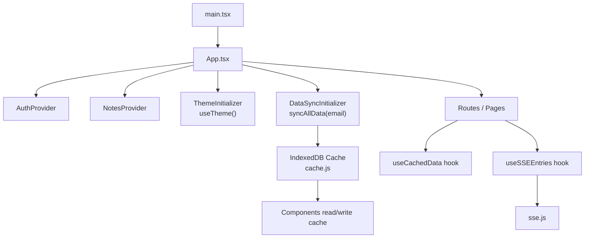

**Diagram sources**

- [main.tsx:18-22](file://frontend/src/main.tsx#L18-L22)
- [App.tsx:123-351](file://frontend/src/App.tsx#L123-L351)
- [syncService.js:75-101](file://frontend/src/CacheFunctions/syncService.js#L75-L101)
- [cache.js:129-171](file://frontend/src/lib/cache.js#L129-L171)
- [useCachedData.js:23-76](file://frontend/src/hooks/useCachedData.js#L23-L76)
- [useSSEEntries.ts:41-107](file://frontend/src/hooks/useSSEEntries.ts#L41-L107)
- [sse.js:37-101](file://frontend/src/lib/sse.js#L37-L101)

**Section sources**

- [main.tsx:1-23](file://frontend/src/main.tsx#L1-L23)
- [App.tsx:38-61](file://frontend/src/App.tsx#L38-L61)
- [App.tsx:123-351](file://frontend/src/App.tsx#L123-L351)

## Core Components

- AuthContext: Provides authenticated user identity and session lifecycle methods; integrates with Supabase auth and cleans up cache and SSE on logout.
- NotesContext: Manages a lightweight overlay state to open/close a notes view over the current page without navigating away.
- Theme hook: Persists and applies theme across sessions via localStorage and DOM attributes.
- Network status hook: Tracks browser online/offline events to gate network-dependent features.
- Cached data hook: Reads from IndexedDB immediately, subscribes to cache changes, and triggers background refreshes.
- SSE entries hook: Connects to real-time events, invalidates relevant cache keys, and notifies consumers to update UI.

These pieces form a cohesive local-first architecture where UI renders instantly from cache and stays synchronized via SSE and periodic sync.

**Section sources**

- [AuthContext.tsx:18-80](file://frontend/src/context/AuthContext.tsx#L18-L80)
- [NotesContext.tsx:14-46](file://frontend/src/context/NotesContext.tsx#L14-L46)
- [useTheme.ts:8-47](file://frontend/src/hooks/useTheme.ts#L8-L47)
- [useNetworkStatus.js:14-40](file://frontend/src/hooks/useNetworkStatus.js#L14-L40)
- [useCachedData.js:23-76](file://frontend/src/hooks/useCachedData.js#L23-L76)
- [useSSEEntries.ts:41-107](file://frontend/src/hooks/useSSEEntries.ts#L41-L107)

## Architecture Overview

The state architecture combines React Context for app-wide concerns, custom hooks for reusable logic, and an IndexedDB-backed cache for persistence and reactivity.

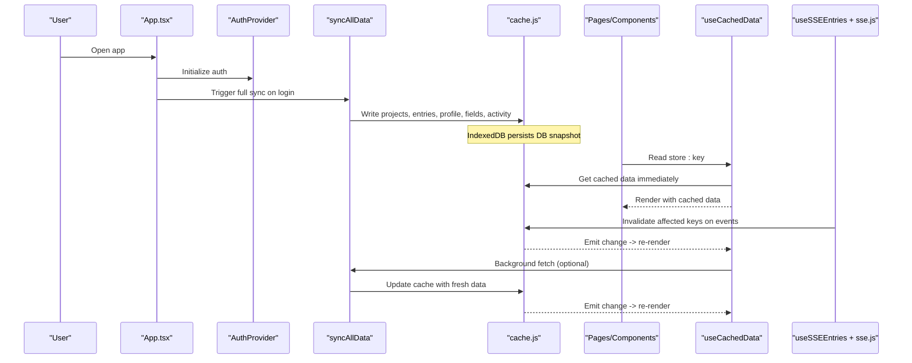

**Diagram sources**

- [App.tsx:47-61](file://frontend/src/App.tsx#L47-L61)
- [syncService.js:75-101](file://frontend/src/CacheFunctions/syncService.js#L75-L101)
- [cache.js:179-223](file://frontend/src/lib/cache.js#L179-L223)
- [useCachedData.js:23-76](file://frontend/src/hooks/useCachedData.js#L23-L76)
- [useSSEEntries.ts:41-107](file://frontend/src/hooks/useSSEEntries.ts#L41-L107)
- [sse.js:37-101](file://frontend/src/lib/sse.js#L37-L101)

## Detailed Component Analysis

### Authentication State (AuthContext)

AuthContext centralizes authentication state and actions:

- Initializes session and listens for auth state changes
- Supports OAuth and email/password flows
- On sign-out or account deletion, clears user-specific cache and disconnects SSE
- Exposes a typed context and a safe useAuth hook

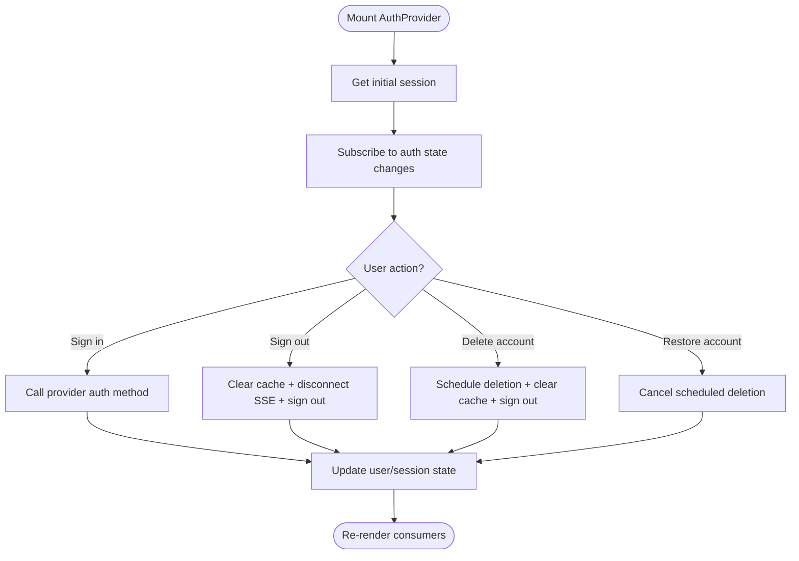

**Diagram sources**

- [AuthContext.tsx:38-80](file://frontend/src/context/AuthContext.tsx#L38-L80)
- [AuthContext.tsx:82-208](file://frontend/src/context/AuthContext.tsx#L82-L208)

**Section sources**

- [AuthContext.tsx:18-80](file://frontend/src/context/AuthContext.tsx#L18-L80)
- [AuthContext.tsx:82-208](file://frontend/src/context/AuthContext.tsx#L82-L208)
- [AuthContext.tsx:213-239](file://frontend/src/context/AuthContext.tsx#L213-L239)

### Notes Overlay State (NotesContext)

NotesContext manages a simple overlay state:

- Holds the currently selected entry for note viewing
- Provides open/close functions
- Used by an overlay component to render NotesPage over the current route

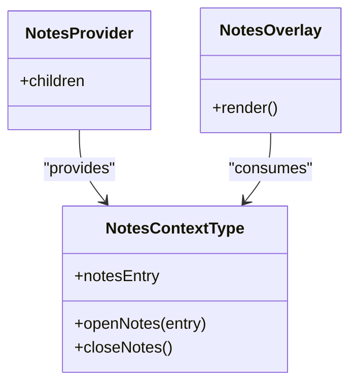

**Diagram sources**

- [NotesContext.tsx:14-46](file://frontend/src/context/NotesContext.tsx#L14-L46)
- [App.tsx:95-101](file://frontend/src/App.tsx#L95-L101)

**Section sources**

- [NotesContext.tsx:14-46](file://frontend/src/context/NotesContext.tsx#L14-L46)
- [App.tsx:95-101](file://frontend/src/App.tsx#L95-L101)

### Theme State (useTheme)

useTheme manages persistent theme selection:

- Reads initial theme from localStorage
- Applies theme via DOM attribute
- Exposes set/toggle helpers and a derived isDark flag

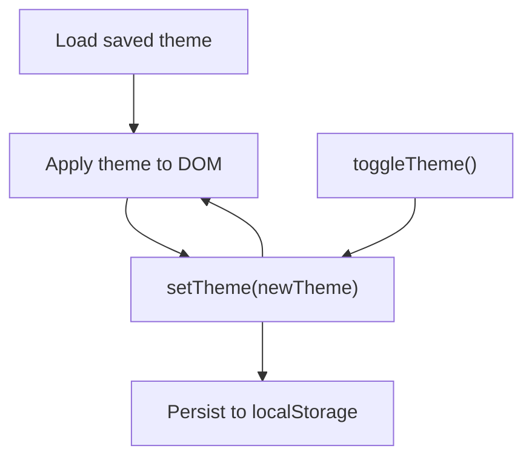

**Diagram sources**

- [useTheme.ts:8-47](file://frontend/src/hooks/useTheme.ts#L8-L47)

**Section sources**

- [useTheme.ts:8-47](file://frontend/src/hooks/useTheme.ts#L8-L47)

### Network Status (useNetworkStatus)

useNetworkStatus tracks connectivity:

- Subscribes to online/offline events
- Returns boolean used by components to enable/disable network features

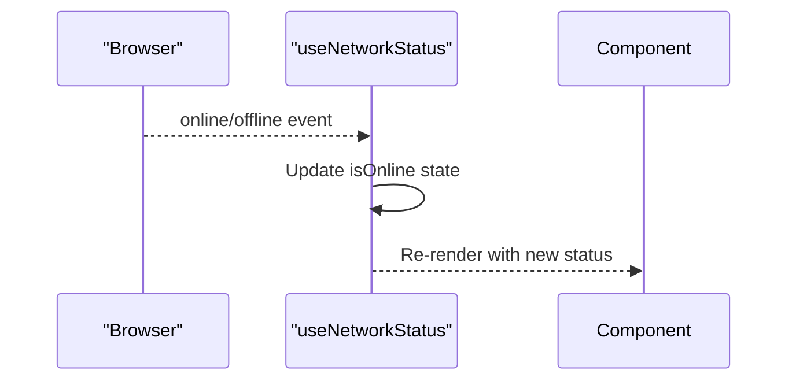

**Diagram sources**

- [useNetworkStatus.js:14-40](file://frontend/src/hooks/useNetworkStatus.js#L14-L40)

**Section sources**

- [useNetworkStatus.js:14-40](file://frontend/src/hooks/useNetworkStatus.js#L14-L40)

### Cached Data Loading (useCachedData)

useCachedData implements a local-first pattern:

- Immediately reads from IndexedDB-backed cache
- Subscribes to cache changes to trigger re-renders
- Triggers optional background fetch to refresh data
- Provides convenience hooks for common stores

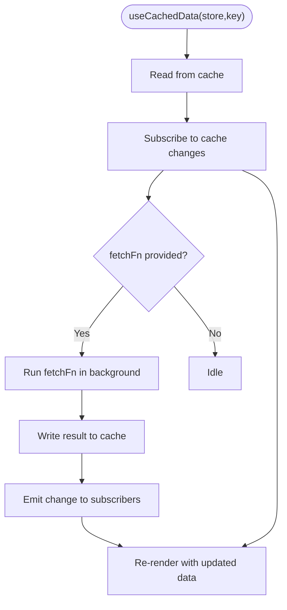

**Diagram sources**

- [useCachedData.js:23-76](file://frontend/src/hooks/useCachedData.js#L23-L76)
- [cache.js:45-72](file://frontend/src/lib/cache.js#L45-L72)

**Section sources**

- [useCachedData.js:23-76](file://frontend/src/hooks/useCachedData.js#L23-L76)

### Real-Time Updates (useSSEEntries)

useSSEEntries connects to SSE and keeps cache consistent:

- Establishes SSE connection when user is logged in
- Listens for entry_parsed and entry_error events
- Invalidates relevant cache keys based on event payload
- Invokes onEntry callback to let UI update immediately

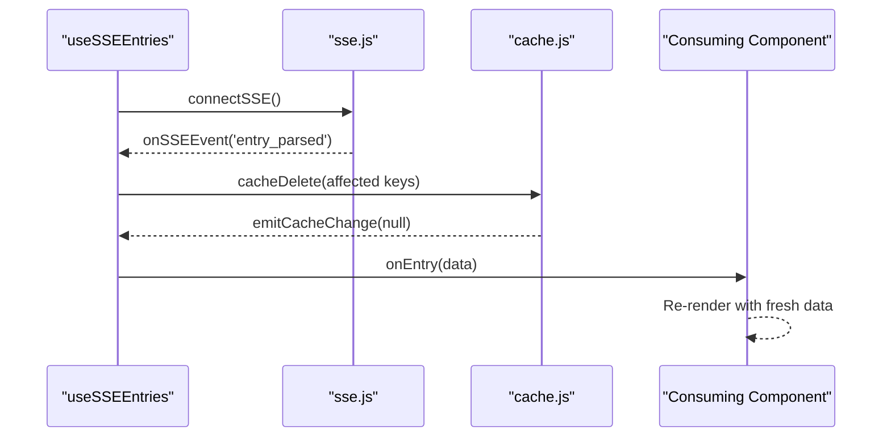

**Diagram sources**

- [useSSEEntries.ts:41-107](file://frontend/src/hooks/useSSEEntries.ts#L41-L107)
- [sse.js:37-101](file://frontend/src/lib/sse.js#L37-L101)
- [cache.js:249-263](file://frontend/src/lib/cache.js#L249-L263)

**Section sources**

- [useSSEEntries.ts:41-107](file://frontend/src/hooks/useSSEEntries.ts#L41-L107)
- [sse.js:37-101](file://frontend/src/lib/sse.js#L37-L101)

### Data Synchronization (syncService)

syncService orchestrates full data sync:

- Prevents duplicate concurrent syncs and throttles frequent syncs
- Performs sequential and batched server calls with error isolation
- Writes results into IndexedDB-backed cache
- Computes derived data locally (due-soon, stats, streaks)
- Handles offline mode by computing derived data from cache only

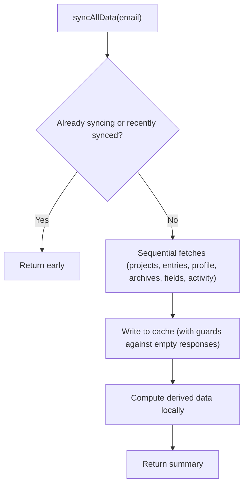

**Diagram sources**

- [syncService.js:75-101](file://frontend/src/CacheFunctions/syncService.js#L75-L101)
- [syncService.js:156-387](file://frontend/src/CacheFunctions/syncService.js#L156-L387)

**Section sources**

- [syncService.js:75-101](file://frontend/src/CacheFunctions/syncService.js#L75-L101)
- [syncService.js:156-387](file://frontend/src/CacheFunctions/syncService.js#L156-L387)

### Offline Behavior and UI Gating

Components can gate features based on network status:

- QuickEntryBar disables input and voice features when offline
- Uses useNetworkStatus to reflect connectivity state

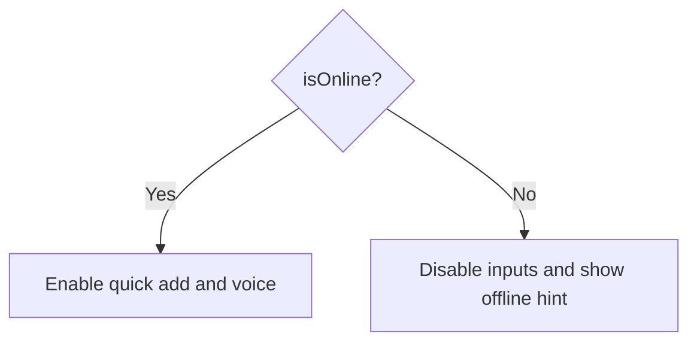

**Diagram sources**

- [QuickEntryBar.tsx:38-46](file://frontend/src/components/QuickEntryBar.tsx#L38-L46)
- [useNetworkStatus.js:14-40](file://frontend/src/hooks/useNetworkStatus.js#L14-L40)

**Section sources**

- [QuickEntryBar.tsx:38-46](file://frontend/src/components/QuickEntryBar.tsx#L38-L46)
- [useNetworkStatus.js:14-40](file://frontend/src/hooks/useNetworkStatus.js#L14-L40)

## Dependency Analysis

High-level dependencies among state modules:

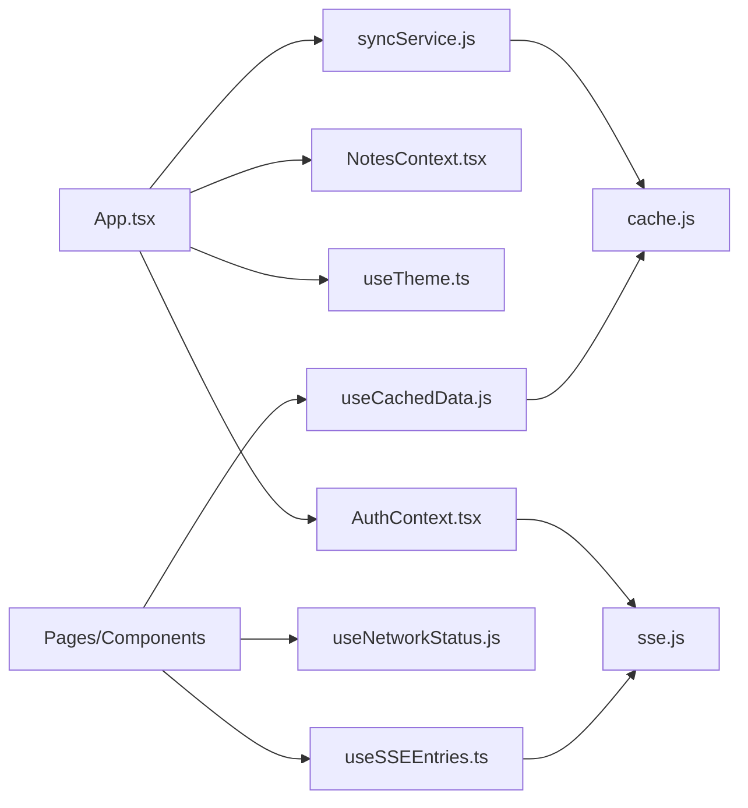

**Diagram sources**

- [App.tsx:123-351](file://frontend/src/App.tsx#L123-L351)
- [AuthContext.tsx:1-80](file://frontend/src/context/AuthContext.tsx#L1-L80)
- [NotesContext.tsx:1-46](file://frontend/src/context/NotesContext.tsx#L1-L46)
- [useTheme.ts:1-47](file://frontend/src/hooks/useTheme.ts#L1-L47)
- [useCachedData.js:20-76](file://frontend/src/hooks/useCachedData.js#L20-L76)
- [useNetworkStatus.js:1-40](file://frontend/src/hooks/useNetworkStatus.js#L1-L40)
- [useSSEEntries.ts:13-107](file://frontend/src/hooks/useSSEEntries.ts#L13-L107)
- [cache.js:1-72](file://frontend/src/lib/cache.js#L1-L72)
- [sse.js:1-101](file://frontend/src/lib/sse.js#L1-L101)
- [syncService.js:38-101](file://frontend/src/CacheFunctions/syncService.js#L38-L101)

**Section sources**

- [App.tsx:123-351](file://frontend/src/App.tsx#L123-L351)
- [AuthContext.tsx:1-80](file://frontend/src/context/AuthContext.tsx#L1-L80)
- [NotesContext.tsx:1-46](file://frontend/src/context/NotesContext.tsx#L1-L46)
- [useTheme.ts:1-47](file://frontend/src/hooks/useTheme.ts#L1-L47)
- [useCachedData.js:20-76](file://frontend/src/hooks/useCachedData.js#L20-L76)
- [useNetworkStatus.js:1-40](file://frontend/src/hooks/useNetworkStatus.js#L1-L40)
- [useSSEEntries.ts:13-107](file://frontend/src/hooks/useSSEEntries.ts#L13-L107)
- [cache.js:1-72](file://frontend/src/lib/cache.js#L1-L72)
- [sse.js:1-101](file://frontend/src/lib/sse.js#L1-L101)
- [syncService.js:38-101](file://frontend/src/CacheFunctions/syncService.js#L38-L101)

## Performance Considerations

- Immediate UI responsiveness: Reading from IndexedDB-backed cache avoids loading spinners and network latency.
- Stale-while-revalidate: Background fetches update cache and notify subscribers without blocking initial render.
- Throttled full syncs: Prevents redundant server calls and reduces load.
- Batched operations: Archives and fields are fetched in parallel batches to reduce round-trips.
- Event-driven invalidation: SSE events invalidate only affected cache keys, minimizing unnecessary refetches.
- Derived computations: Stats, streaks, and due-soon lists are computed locally from cached entries to avoid extra server calls.

[No sources needed since this section provides general guidance]

## Troubleshooting Guide

Common issues and remedies:

- No data after login: Ensure syncAllData is triggered and cache writes succeed; check for empty server responses being guarded against clobbering existing cache.
- Stale data: Verify SSE connections are active and cache invalidation runs on entry_parsed events; confirm cache subscriptions are not unsubscribed prematurely.
- Offline behavior: Confirm components respect network status and that syncService computes derived data from cache when offline.
- Auth-related cache leaks: On sign-out or account deletion, ensure user-specific cache is cleared and SSE is disconnected.

**Section sources**

- [syncService.js:217-281](file://frontend/src/CacheFunctions/syncService.js#L217-L281)
- [useSSEEntries.ts:55-88](file://frontend/src/hooks/useSSEEntries.ts#L55-L88)
- [AuthContext.tsx:137-195](file://frontend/src/context/AuthContext.tsx#L137-L195)
- [cache.js:249-289](file://frontend/src/lib/cache.js#L249-L289)

## Conclusion

Codacaine’s frontend uses a robust, local-first state management strategy:

- React Context for global concerns (auth, notes overlay)
- Custom hooks for reusable logic (theme, network, caching, SSE)
- An IndexedDB-backed SQLite cache for persistence and reactivity
- SSE-driven real-time updates and background synchronization

This design delivers fast, responsive UIs with reliable data consistency and graceful offline support.

[No sources needed since this section summarizes without analyzing specific files]
