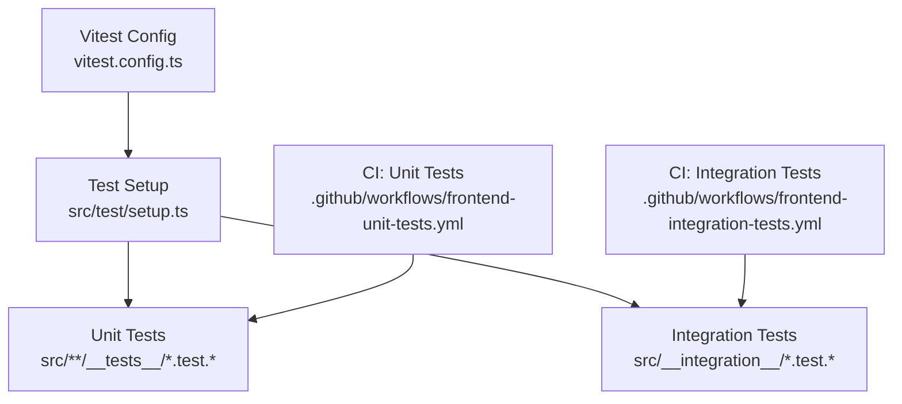
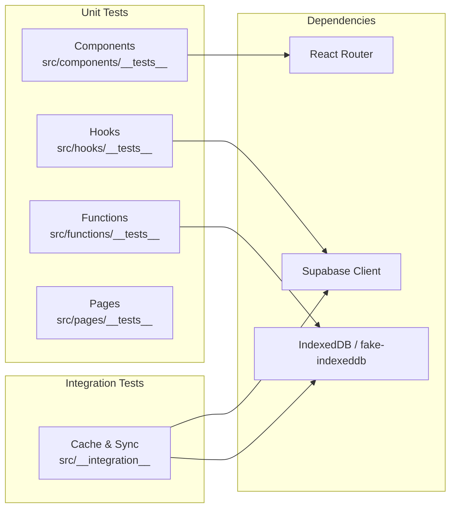
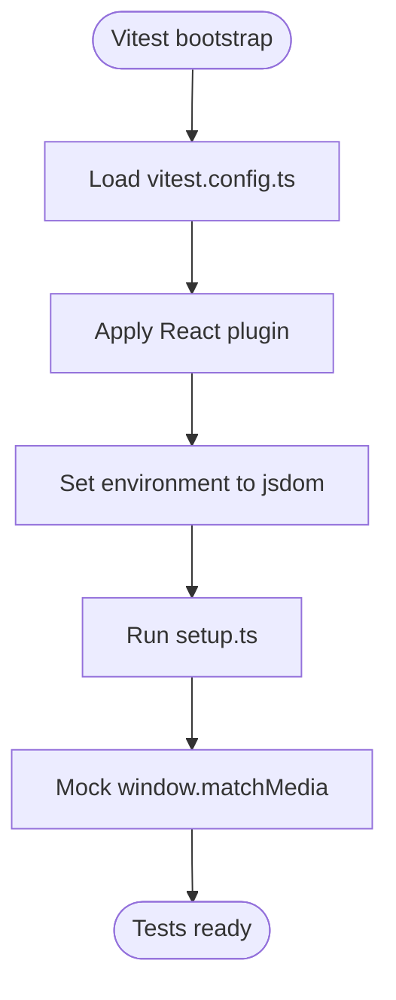
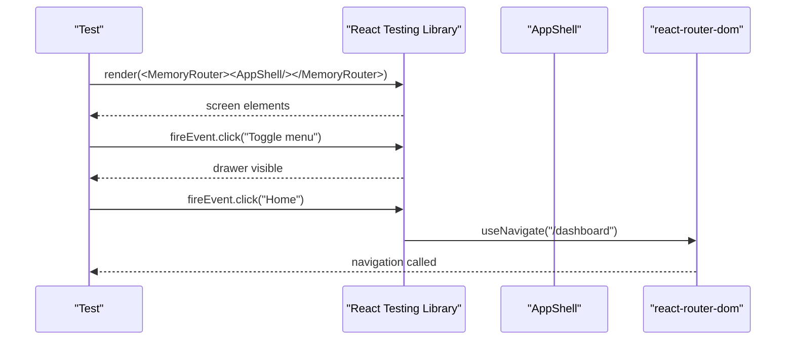
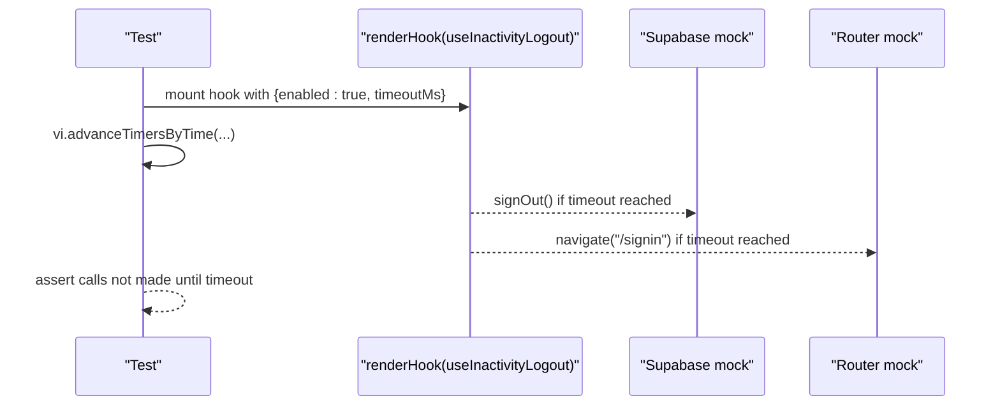
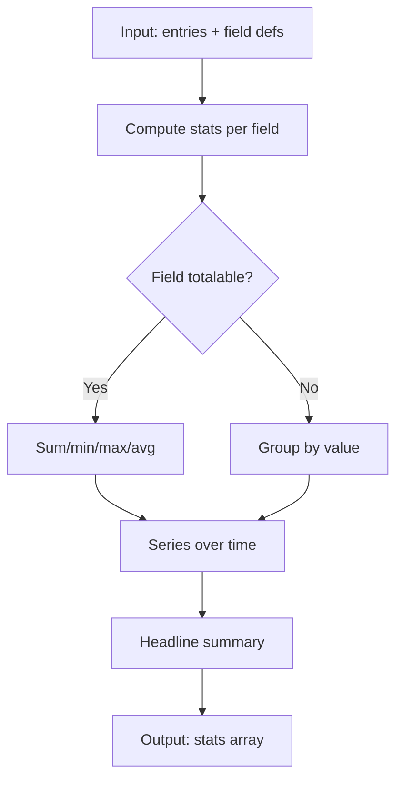
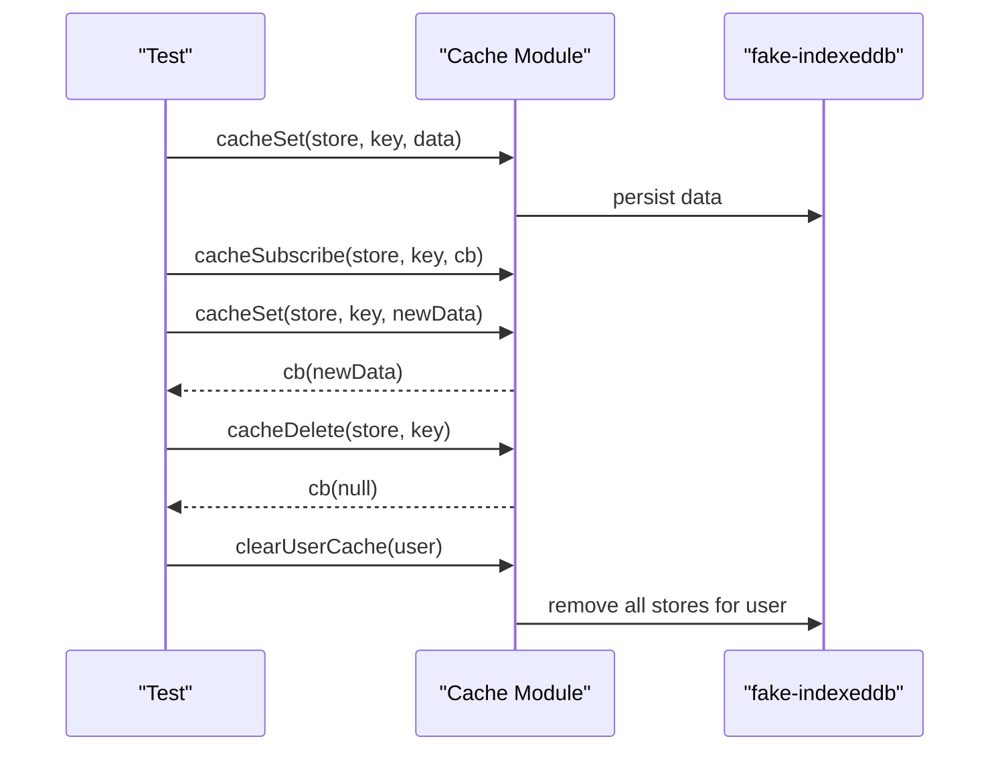
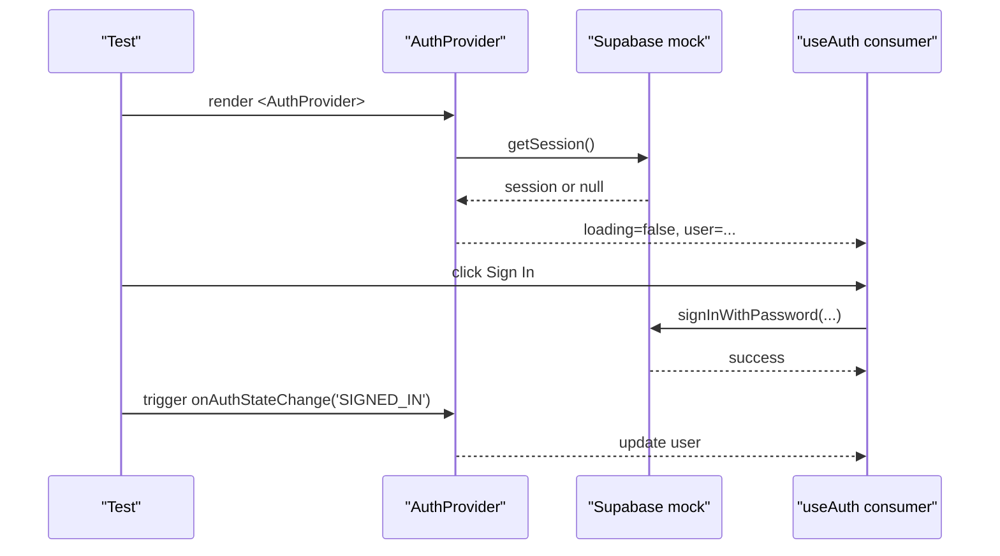
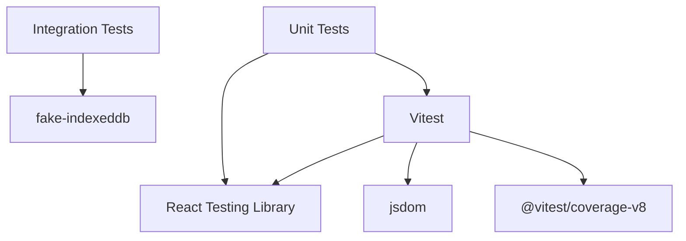

# Testing Strategy

<cite>
**Referenced Files in This Document**
- [vitest.config.ts](file://frontend/vitest.config.ts)
- [setup.ts](file://frontend/src/test/setup.ts)
- [package.json](file://frontend/package.json)
- [AppShell.test.tsx](file://frontend/src/components/__tests__/AppShell.test.tsx)
- [AuthContext.test.tsx](file://frontend/src/context/__tests__/AuthContext.test.tsx)
- [useInactivityLogout.test.tsx](file://frontend/src/hooks/__tests__/useInactivityLogout.test.tsx)
- [aiMessages.test.ts](file://frontend/src/functions/__tests__/aiMessages.test.ts)
- [cache.integration.test.js](file://frontend/src/__integration__/cache.integration.test.js)
- [SignIn.test.tsx](file://frontend/src/pages/__tests__/SignIn.test.tsx)
- [fieldStats.test.js](file://frontend/src/functions/dashboard/__tests__/fieldStats.test.js)
- [frontend-unit-tests.yml](file://.github/workflows/frontend-unit-tests.yml)
- [frontend-integration-tests.yml](file://.github/workflows/frontend-integration-tests.yml)
</cite>

## Table of Contents

1. Introduction
2. Project Structure
3. Core Components
4. Architecture Overview
5. Detailed Component Analysis
6. Dependency Analysis
7. Performance Considerations
8. Troubleshooting Guide
9. Conclusion
10. Appendices

## Introduction

This document explains the testing strategy and implementation for the Codacaine frontend. It covers Vitest configuration, test environment setup, unit testing patterns with React Testing Library, integration testing approaches for complex workflows and API interactions, mocking strategies for external dependencies and IndexedDB, test organization and naming conventions, coverage usage, best practices, performance considerations for large suites, and debugging techniques for failing tests.

## Project Structure

The frontend uses a layered approach to testing:

- Unit tests live next to source code under **tests** directories (components, hooks, functions, pages).
- Integration tests are grouped under src/**integration** to cover cross-cutting flows like caching and sync.
- Test configuration is centralized in vitest.config.ts with a shared setup file at src/test/setup.ts.
- CI pipelines separate unit and integration runs to keep feedback fast and results clear.

**Diagram sources**

- [vitest.config.ts:1-18](file://frontend/vitest.config.ts#L1-L18)
- [setup.ts:1-17](file://frontend/src/test/setup.ts#L1-L17)
- [frontend-unit-tests.yml:1-58](file://.github/workflows/frontend-unit-tests.yml#L1-L58)
- [frontend-integration-tests.yml:1-58](file://.github/workflows/frontend-integration-tests.yml#L1-L58)

**Section sources**

- [vitest.config.ts:1-18](file://frontend/vitest.config.ts#L1-L18)
- [setup.ts:1-17](file://frontend/src/test/setup.ts#L1-L17)
- [frontend-unit-tests.yml:1-58](file://.github/workflows/frontend-unit-tests.yml#L1-L58)
- [frontend-integration-tests.yml:1-58](file://.github/workflows/frontend-integration-tests.yml#L1-L58)

## Core Components

- Test runner and environment:
  - Vitest configured with jsdom environment, global APIs enabled, React plugin, and an alias for @ pointing to src.
  - Global setup adds jest-dom matchers and mocks window.matchMedia for consistent media queries behavior.
- Scripts and coverage:
  - npm scripts provide run, watch, and coverage modes using Vitest and V8 coverage collector.
- Organization:
  - Unit tests colocated with features; integration tests isolated in a dedicated folder.
  - CI jobs run unit and integration tests separately with JUnit reporting.

**Section sources**

- [vitest.config.ts:1-18](file://frontend/vitest.config.ts#L1-L18)
- [setup.ts:1-17](file://frontend/src/test/setup.ts#L1-L17)
- [package.json:1-45](file://frontend/package.json#L1-L45)
- [frontend-unit-tests.yml:1-58](file://.github/workflows/frontend-unit-tests.yml#L1-L58)
- [frontend-integration-tests.yml:1-58](file://.github/workflows/frontend-integration-tests.yml#L1-L58)

## Architecture Overview

The testing architecture separates concerns by scope:

- Unit tests validate isolated logic: components render correctly, hooks respond to events, pure functions compute expected outputs.
- Integration tests validate end-to-end flows across modules: cache set/get/subscribe lifecycle, auth state changes, and UI navigation.
- External dependencies (Supabase, routing, storage) are mocked or simulated to ensure deterministic outcomes.

[No sources needed since this diagram shows conceptual workflow, not actual code structure]

## Detailed Component Analysis

### Vitest Configuration and Environment

- Environment: jsdom provides a browser-like DOM for component tests.
- Globals: true enables describe/it/expect globally in tests.
- Setup file: src/test/setup.ts installs jest-dom matchers and stubs window.matchMedia.
- Aliases: @ resolves to src for cleaner imports in tests.

**Diagram sources**

- [vitest.config.ts:1-18](file://frontend/vitest.config.ts#L1-L18)
- [setup.ts:1-17](file://frontend/src/test/setup.ts#L1-L17)

**Section sources**

- [vitest.config.ts:1-18](file://frontend/vitest.config.ts#L1-L18)
- [setup.ts:1-17](file://frontend/src/test/setup.ts#L1-L17)

### Unit Testing Patterns: Components

- Rendering and interaction:
  - Use MemoryRouter to wrap components that depend on routing.
  - Assert visible text, labels, and attributes via screen queries.
  - Simulate user actions with fireEvent or userEvent.
- Mocking:
  - vi.mock for react-router-dom to control navigation and location.
  - vi.mock for context providers (e.g., AuthContext) to isolate component behavior.
- Example focus: AppShell renders children, title, hamburger menu, drawer items, and triggers navigation.

**Diagram sources**

- [AppShell.test.tsx:1-138](file://frontend/src/components/__tests__/AppShell.test.tsx#L1-L138)

**Section sources**

- [AppShell.test.tsx:1-138](file://frontend/src/components/__tests__/AppShell.test.tsx#L1-L138)

### Unit Testing Patterns: Hooks

- Hook rendering:
  - Use renderHook to test hook logic in isolation.
  - Wrap with necessary providers when required.
- Time-based behavior:
  - Use vi.useFakeTimers() and advance timers to simulate timeouts and activity resets.
- Example focus: useInactivityLogout signs out and navigates after inactivity, but not when activity occurs.

**Diagram sources**

- [useInactivityLogout.test.tsx:1-64](file://frontend/src/hooks/__tests__/useInactivityLogout.test.tsx#L1-L64)

**Section sources**

- [useInactivityLogout.test.tsx:1-64](file://frontend/src/hooks/__tests__/useInactivityLogout.test.tsx#L1-L64)

### Unit Testing Patterns: Utility Functions

- Pure function tests:
  - Provide fixtures and assert outputs deterministically.
  - Validate edge cases and type inference behaviors.
- Example focus: field stats utilities compute totals, groups, series, and headlines from entries data.

**Diagram sources**

- [fieldStats.test.js:1-412](file://frontend/src/functions/dashboard/__tests__/fieldStats.test.js#L1-L412)

**Section sources**

- [fieldStats.test.js:1-412](file://frontend/src/functions/dashboard/__tests__/fieldStats.test.js#L1-L412)

### Unit Testing Patterns: Local Storage Preferences

- Isolate side effects:
  - Clear localStorage before each test to avoid leakage.
  - Verify getters/setters read/write expected keys and defaults.
- Example focus: AI messages preference toggles stored in localStorage and retrieved with safe defaults.

**Section sources**

- [aiMessages.test.ts:1-55](file://frontend/src/functions/__tests__/aiMessages.test.ts#L1-L55)

### Integration Testing Approaches: Cache Layer

- Realistic persistence:
  - Use fake-indexeddb to simulate IndexedDB stores in tests.
  - Exercise full lifecycle: set → get → subscribe → emit updates → delete → clear.
- Assertions:
  - Confirm subscribers receive correct payloads and stop after unsubscribe.
  - Validate isolation between users and stores.

**Diagram sources**

- [cache.integration.test.js:1-179](file://frontend/src/__integration__/cache.integration.test.js#L1-L179)

**Section sources**

- [cache.integration.test.js:1-179](file://frontend/src/__integration__/cache.integration.test.js#L1-L179)

### Integration Testing Approaches: Authentication Flow

- Context-driven flow:
  - Render provider and consumer to test state transitions.
  - Mock Supabase client methods and observe auth state changes.
- Assertions:
  - Verify initial loading state, session detection, and event-driven updates.
  - Validate OAuth flows and RPC calls for account operations.

**Diagram sources**

- [AuthContext.test.tsx:1-329](file://frontend/src/context/__tests__/AuthContext.test.tsx#L1-L329)

**Section sources**

- [AuthContext.test.tsx:1-329](file://frontend/src/context/__tests__/AuthContext.test.tsx#L1-L329)

### Page-Level Integration: SignIn

- Routing and context:
  - Wrap page in MemoryRouter with appropriate routes.
  - Mock auth context and validation helpers.
- Assertions:
  - Verify UI states for sign-in/sign-up modes, input types, attributes, and links.

**Section sources**

- [SignIn.test.tsx:1-150](file://frontend/src/pages/__tests__/SignIn.test.tsx#L1-L150)

## Dependency Analysis

- External libraries used in tests:
  - React Testing Library for DOM assertions and interactions.
  - Vitest for test framework and mocking.
  - jsdom for DOM environment.
  - fake-indexeddb for realistic IndexedDB behavior in integration tests.
  - Coverage via @vitest/coverage-v8.
- CI separation:
  - Unit tests exclude integration folder to keep feedback fast.
  - Integration tests run against src/**integration** only.

**Diagram sources**

- [package.json:1-45](file://frontend/package.json#L1-L45)
- [frontend-unit-tests.yml:1-58](file://.github/workflows/frontend-unit-tests.yml#L1-L58)
- [frontend-integration-tests.yml:1-58](file://.github/workflows/frontend-integration-tests.yml#L1-L58)

**Section sources**

- [package.json:1-45](file://frontend/package.json#L1-L45)
- [frontend-unit-tests.yml:1-58](file://.github/workflows/frontend-unit-tests.yml#L1-L58)
- [frontend-integration-tests.yml:1-58](file://.github/workflows/frontend-integration-tests.yml#L1-L58)

## Performance Considerations

- Keep unit tests fast:
  - Prefer pure function tests and lightweight component tests.
  - Avoid unnecessary re-renders by isolating dependencies with mocks.
- Manage integration test cost:
  - Use fake-indexeddb instead of real IndexedDB to reduce overhead.
  - Scope integration tests to critical paths (auth, cache, sync).
- CI efficiency:
  - Separate unit and integration jobs to parallelize and optimize feedback loops.
  - Use timeouts and teardown timeouts to prevent hanging tests.

[No sources needed since this section provides general guidance]

## Troubleshooting Guide

- Common issues and fixes:
  - Media query mismatches: Ensure window.matchMedia is mocked in setup.
  - Stale local storage: Clear localStorage in beforeEach for tests touching preferences.
  - Timers: Always reset fake timers and restore real timers in afterEach.
  - Async state: Use waitFor to assert asynchronous UI updates.
  - Navigation: Mock useNavigate and verify calls rather than relying on actual routing.
- Debugging tips:
  - Print rendered output snapshots or logs to inspect DOM state.
  - Narrow failures by isolating the smallest reproducible case.
  - Use JUnit reports from CI to locate failing tests quickly.

**Section sources**

- [setup.ts:1-17](file://frontend/src/test/setup.ts#L1-L17)
- [aiMessages.test.ts:1-55](file://frontend/src/functions/__tests__/aiMessages.test.ts#L1-L55)
- [useInactivityLogout.test.tsx:1-64](file://frontend/src/hooks/__tests__/useInactivityLogout.test.tsx#L1-L64)
- [AuthContext.test.tsx:1-329](file://frontend/src/context/__tests__/AuthContext.test.tsx#L1-L329)
- [frontend-unit-tests.yml:1-58](file://.github/workflows/frontend-unit-tests.yml#L1-L58)
- [frontend-integration-tests.yml:1-58](file://.github/workflows/frontend-integration-tests.yml#L1-L58)

## Conclusion

The Codacaine frontend employs a robust, layered testing strategy:

- Vitest with jsdom and a focused setup ensures consistent environments.
- Unit tests validate isolated behavior using React Testing Library and targeted mocks.
- Integration tests exercise critical flows with realistic persistence via fake-indexeddb.
- CI pipelines separate unit and integration tests for speed and clarity.
  Adhering to these patterns yields reliable, maintainable tests that protect core functionality while keeping feedback cycles short.

[No sources needed since this section summarizes without analyzing specific files]

## Appendices

### Test Organization and Naming Conventions

- Place unit tests adjacent to source under **tests** folders mirroring feature structure.
- Name test files with .test.ts or .test.tsx suffixes.
- Group related tests with describe blocks and use it for individual scenarios.
- Keep integration tests in src/**integration** to distinguish from unit tests.

**Section sources**

- [AppShell.test.tsx:1-138](file://frontend/src/components/__tests__/AppShell.test.tsx#L1-L138)
- [AuthContext.test.tsx:1-329](file://frontend/src/context/__tests__/AuthContext.test.tsx#L1-L329)
- [cache.integration.test.js:1-179](file://frontend/src/__integration__/cache.integration.test.js#L1-L179)

### Coverage Usage

- Generate coverage via npm script using Vitest’s V8 reporter.
- Review coverage reports to identify untested branches and refine tests accordingly.

**Section sources**

- [package.json:1-45](file://frontend/package.json#L1-L45)

### Best Practices Summary

- Mock external services at boundaries (Supabase, router, storage).
- Assert observable behavior (DOM, callbacks, navigation) rather than internal state.
- Keep tests deterministic by controlling timers and clearing shared state.
- Prefer small, focused tests that fail fast and communicate intent clearly.

[No sources needed since this section provides general guidance]
