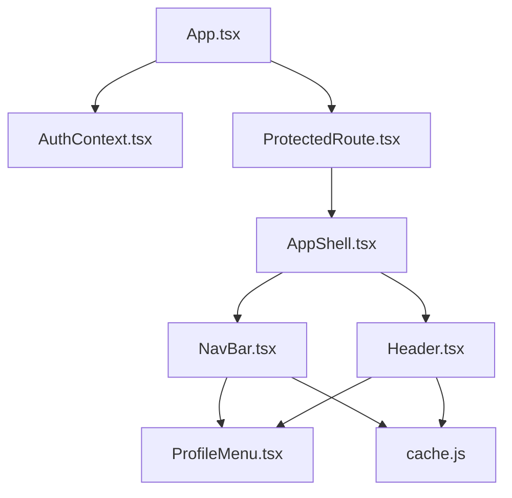
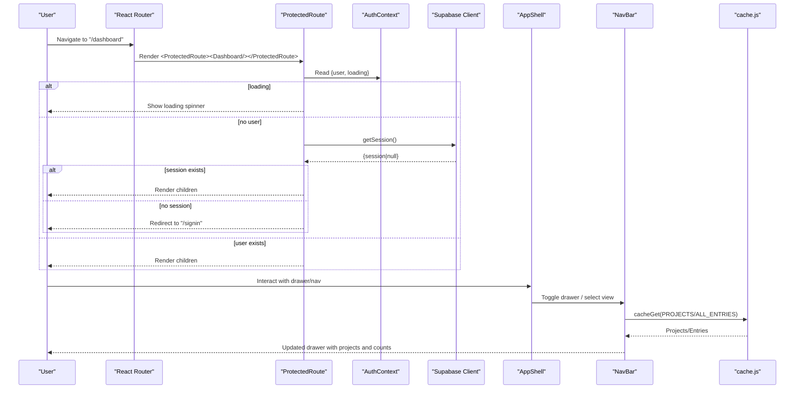
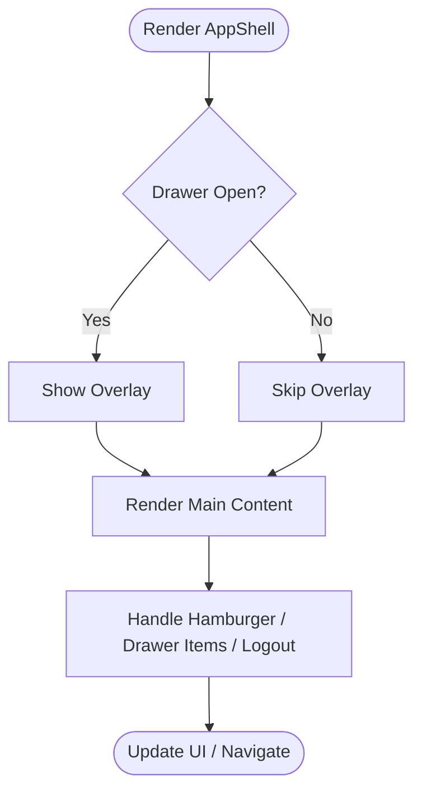
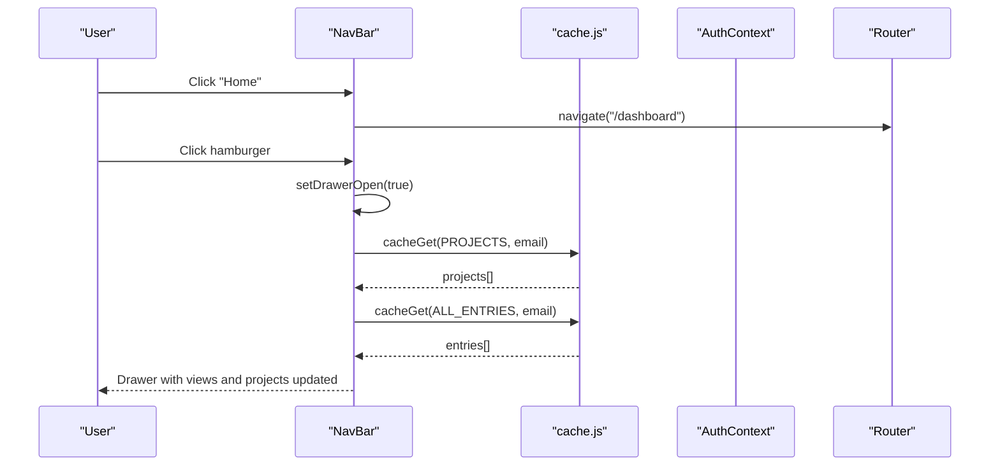
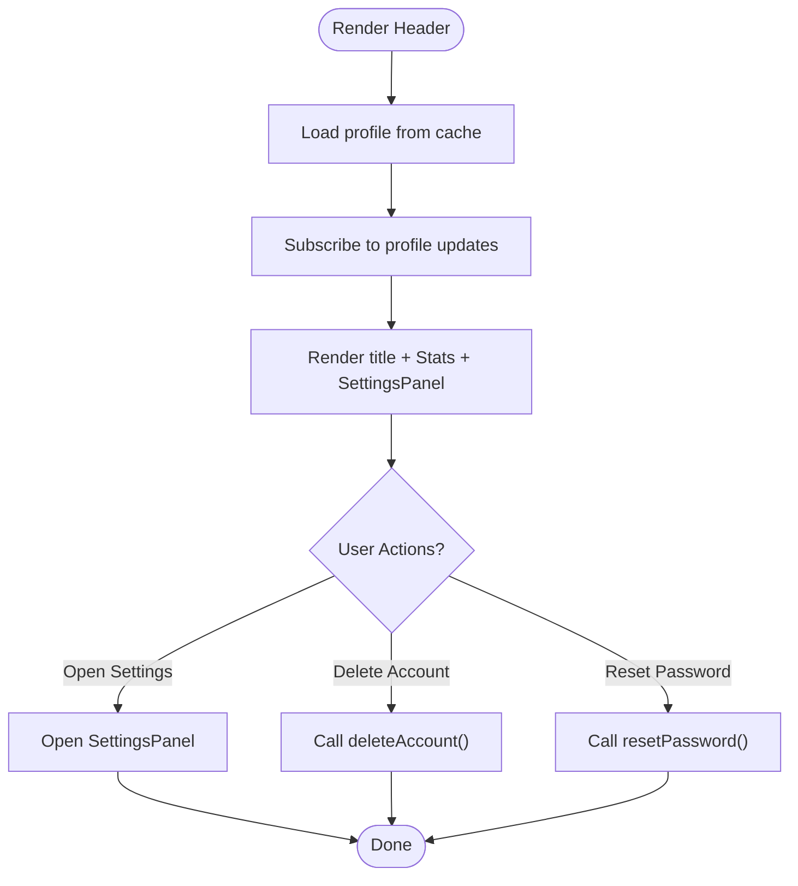
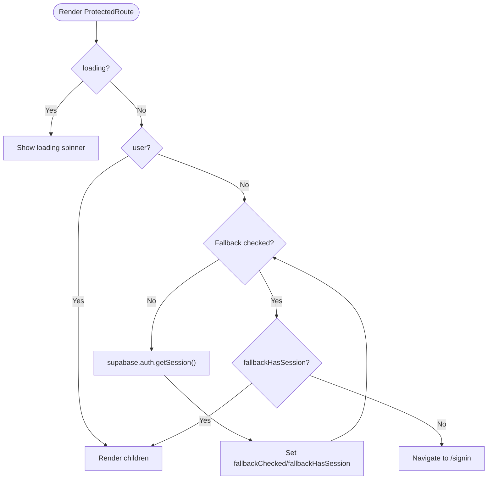
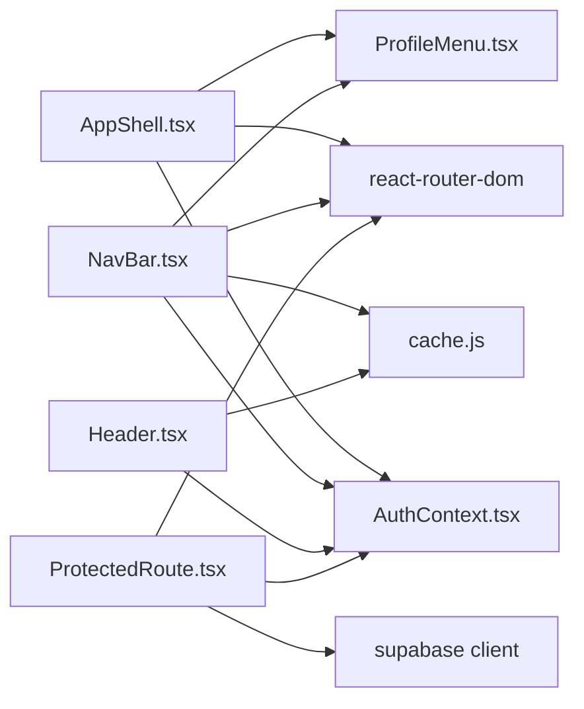

# Core Components

<cite>
**Referenced Files in This Document**
- [AppShell.tsx](file://frontend/src/components/AppShell.tsx)
- [Header.tsx](file://frontend/src/components/Header.tsx)
- [NavBar.tsx](file://frontend/src/components/NavBar.tsx)
- [ProtectedRoute.tsx](file://frontend/src/components/ProtectedRoute.tsx)
- [AuthContext.tsx](file://frontend/src/context/AuthContext.tsx)
- [ProfileMenu.tsx](file://frontend/src/components/ProfileMenu.tsx)
- [cache.js](file://frontend/src/lib/cache.js)
- [App.tsx](file://frontend/src/App.tsx)
</cite>

## Table of Contents

1. [Introduction](#introduction)
2. [Project Structure](#project-structure)
3. [Core Components](#core-components)
4. [Architecture Overview](#architecture-overview)
5. [Detailed Component Analysis](#detailed-component-analysis)
6. [Dependency Analysis](#dependency-analysis)
7. [Performance Considerations](#performance-considerations)
8. [Troubleshooting Guide](#troubleshooting-guide)
9. [Conclusion](#conclusion)

## Introduction

This document explains the foundational UI components that structure the Codacaine application shell and navigation: AppShell, Header, NavBar, and ProtectedRoute. It covers their responsibilities, props, state management, event handling, integration with authentication and caching, usage patterns, customization options, and best practices for extending these building blocks.

## Project Structure

The core components live under the frontend React application and integrate with shared context and utilities:

- AppShell: Main layout container with top nav, drawer, and main content area.
- NavBar: Primary navigation bar with drawer, project list, notifications, profile menu, and guided tour hooks.
- Header: Page header with title, stats summary, and settings panel integration.
- ProtectedRoute: Authentication guard that protects routes and handles loading/fallback session checks.
- AuthContext: Centralized auth state and actions (sign-in/out, password reset, account deletion).
- ProfileMenu: Reusable user dropdown for profile management and sign-out.
- cache.js: Local-first SQLite-based cache with subscriptions used by NavBar and Header to read projects, entries, and profile data.
- App.tsx: Application root wiring providers, routing, and initial data sync.

**Diagram sources**

- [App.tsx:123-200](file://frontend/src/App.tsx#L123-L200)
- [ProtectedRoute.tsx:7-81](file://frontend/src/components/ProtectedRoute.tsx#L7-L81)
- [AppShell.tsx:10-131](file://frontend/src/components/AppShell.tsx#L10-L131)
- [NavBar.tsx:19-606](file://frontend/src/components/NavBar.tsx#L19-L606)
- [Header.tsx:14-105](file://frontend/src/components/Header.tsx#L14-L105)
- [ProfileMenu.tsx:13-144](file://frontend/src/components/ProfileMenu.tsx#L13-L144)
- [cache.js:179-200](file://frontend/src/lib/cache.js#L179-L200)

**Section sources**

- [App.tsx:123-200](file://frontend/src/App.tsx#L123-L200)

## Core Components

- AppShell
  - Purpose: Provides the application’s chrome: top navbar, left drawer, and a main content slot for child pages.
  - Props: children (ReactNode).
  - State: drawerOpen (boolean), loggingOut (boolean).
  - Integrations: useAuth for user/sign-out; react-router-dom for navigation and active route detection; ProfileMenu for user actions.
  - Event handling: hamburger toggle, drawer item clicks navigate and close drawer, logout flow calls signOut then navigates to /signin.
  - Rendering: renders a top nav with branding and user controls, an overlay + aside drawer with navigation items, and a main element rendering children.

- NavBar
  - Purpose: Full-featured navigation bar with drawer, project list, notifications, profile menu, and guided tour integration.
  - Props: projects, entries, activeView, onArchiveProject, onNewProject.
  - State: drawerOpen, loggingOut, local projects/entries (fallback from IndexedDB), profileData.
  - Data loading: reads projects and entries from IndexedDB via cacheGet and subscribes to changes; uses props if provided.
  - Integrations: useAuth, react-router-dom, NotificationsBell, ProfileMenu, cache.js, guided tour events.
  - Event handling: toggles drawer, navigates to views/projects, dispatches open-settings event for settings panel, triggers guided tour, archives projects via callback.

- Header
  - Purpose: Displays page title and a compact Stats summary; integrates SettingsPanel via a window event.
  - Props: title, entries, projects, dueSoonCount.
  - State: settingsOpen, deleting, deleteError, profileData (displayName, avatarUrl).
  - Data loading: loads profile from IndexedDB cache and subscribes to updates; falls back to auth metadata.
  - Integrations: useAuth, cache.js, SettingsPanel, Stats.
  - Event handling: opens/closes settings panel via window event; handles account deletion and password reset flows.

- ProtectedRoute
  - Purpose: Guards routes requiring authentication; shows loading spinner while auth state is resolving; redirects unauthenticated users to /signin.
  - Props: children (ReactNode).
  - State: fallbackChecked, fallbackHasSession.
  - Logic: uses AuthContext; when no user and not loading, performs a direct Supabase getSession check to handle race conditions; renders children if authenticated or fallback session exists; otherwise navigates to /signin.

**Section sources**

- [AppShell.tsx:6-131](file://frontend/src/components/AppShell.tsx#L6-L131)
- [NavBar.tsx:11-606](file://frontend/src/components/NavBar.tsx#L11-L606)
- [Header.tsx:7-105](file://frontend/src/components/Header.tsx#L7-L105)
- [ProtectedRoute.tsx:7-81](file://frontend/src/components/ProtectedRoute.tsx#L7-L81)

## Architecture Overview

The application root sets up providers and routes. ProtectedRoute wraps protected pages. AppShell provides the shell around pages that need it. NavBar and Header provide navigation and contextual information. Both rely on AuthContext for user state and cache.js for local-first data access.

**Diagram sources**

- [ProtectedRoute.tsx:7-81](file://frontend/src/components/ProtectedRoute.tsx#L7-L81)
- [AuthContext.tsx:38-80](file://frontend/src/context/AuthContext.tsx#L38-L80)
- [AppShell.tsx:10-131](file://frontend/src/components/AppShell.tsx#L10-L131)
- [NavBar.tsx:32-62](file://frontend/src/components/NavBar.tsx#L32-L62)
- [cache.js:179-200](file://frontend/src/lib/cache.js#L179-L200)

## Detailed Component Analysis

### AppShell

- Responsibilities:
  - Renders top navigation with branding and user controls.
  - Manages a responsive drawer with navigation links.
  - Provides a main content area for child routes/pages.
- Props:
  - children: Any React node rendered inside the main content area.
- State:
  - drawerOpen: Controls visibility of the left drawer.
  - loggingOut: Indicates ongoing sign-out process.
- Event handling:
  - Hamburger button toggles drawer.
  - Drawer items call navigate and close the drawer.
  - Logout handler calls signOut from AuthContext and navigates to /signin.
- Integration points:
  - useAuth for user and sign-out.
  - react-router-dom for navigation and active path detection.
  - ProfileMenu for user actions.
- Customization:
  - Add new navigation items by inserting buttons in the drawer section.
  - Adjust active path logic to include nested routes if needed.
  - Style via existing CSS classes for consistent look-and-feel.

**Diagram sources**

- [AppShell.tsx:10-131](file://frontend/src/components/AppShell.tsx#L10-L131)

**Section sources**

- [AppShell.tsx:6-131](file://frontend/src/components/AppShell.tsx#L6-L131)

### NavBar

- Responsibilities:
  - Top navigation bar with branding, guide button, notifications, and profile menu.
  - Left drawer with views and dynamic project list.
  - Loads projects and entries from IndexedDB and displays counts.
  - Supports guided tour interactions via window events.
- Props:
  - projects: Optional array of project objects (used if provided).
  - entries: Optional array of entry objects (used if provided).
  - activeView: Highlights current view or project.
  - onArchiveProject: Callback to archive a project.
  - onNewProject: Callback to create a new project.
- State:
  - drawerOpen, loggingOut, local projects/entries, profileData.
- Data loading:
  - Reads projects and entries from IndexedDB using cacheGet and subscribes to changes via cacheSubscribe.
  - Falls back to props if provided.
- Event handling:
  - Toggles drawer, navigates to views/projects.
  - Dispatches open-settings event to open settings panel.
  - Triggers guided tour and responds to tour events to open/close drawer.
  - Archives projects via onArchiveProject callback.
- Integration points:
  - useAuth for user and sign-out.
  - react-router-dom for navigation and active path detection.
  - NotificationsBell for notification count/bell.
  - ProfileMenu for user actions.
  - cache.js for local-first data access.
- Customization:
  - Add new views by adding drawer items with appropriate paths.
  - Extend project list display or add actions per project.
  - Hook into guided tour by adding data-tour attributes.

**Diagram sources**

- [NavBar.tsx:19-606](file://frontend/src/components/NavBar.tsx#L19-L606)
- [cache.js:179-200](file://frontend/src/lib/cache.js#L179-L200)

**Section sources**

- [NavBar.tsx:11-606](file://frontend/src/components/NavBar.tsx#L11-L606)

### Header

- Responsibilities:
  - Displays page title and a compact Stats summary.
  - Opens SettingsPanel via a window event.
  - Loads profile info from IndexedDB and falls back to auth metadata.
- Props:
  - title: Page title string.
  - entries, projects, dueSoonCount: Data for Stats component.
- State:
  - settingsOpen, deleting, deleteError, profileData.
- Data loading:
  - Reads profile from IndexedDB using cacheGet and subscribes to updates.
- Event handling:
  - Listens for open-settings event to open settings panel.
  - Handles account deletion and password reset flows via AuthContext.
- Integration points:
  - useAuth for user and account operations.
  - cache.js for profile data.
  - SettingsPanel for user settings UI.
  - Stats for quick metrics.
- Customization:
  - Provide custom entries/projects/dueSoonCount to tailor Stats.
  - Adjust settings panel behavior by handling additional events or props.

**Diagram sources**

- [Header.tsx:14-105](file://frontend/src/components/Header.tsx#L14-L105)
- [cache.js:179-200](file://frontend/src/lib/cache.js#L179-L200)

**Section sources**

- [Header.tsx:7-105](file://frontend/src/components/Header.tsx#L7-L105)

### ProtectedRoute

- Responsibilities:
  - Protects routes by verifying authentication.
  - Shows a loading spinner while auth state resolves.
  - Uses a fallback session check to handle race conditions during OAuth callbacks.
- Props:
  - children: The protected content to render when authenticated.
- State:
  - fallbackChecked, fallbackHasSession.
- Logic:
  - If loading, show spinner.
  - If no user, perform direct Supabase getSession check; if session exists, render children; otherwise redirect to /signin.
  - If user exists, render children immediately.
- Integration points:
  - useAuth for user and loading state.
  - supabase client for direct session verification.
  - react-router-dom Navigate for redirection.
- Best practices:
  - Always wrap sensitive routes with ProtectedRoute.
  - Ensure AuthProvider is mounted above routing to avoid undefined context.

**Diagram sources**

- [ProtectedRoute.tsx:7-81](file://frontend/src/components/ProtectedRoute.tsx#L7-L81)

**Section sources**

- [ProtectedRoute.tsx:7-81](file://frontend/src/components/ProtectedRoute.tsx#L7-L81)

## Dependency Analysis

- AppShell depends on:
  - AuthContext for user/sign-out.
  - react-router-dom for navigation and location.
  - ProfileMenu for user actions.
- NavBar depends on:
  - AuthContext, react-router-dom, NotificationsBell, ProfileMenu.
  - cache.js for projects/entries/profile data.
  - Guided tour events for UX.
- Header depends on:
  - AuthContext, cache.js, SettingsPanel, Stats.
- ProtectedRoute depends on:
  - AuthContext, supabase client, react-router-dom.

**Diagram sources**

- [AppShell.tsx:1-131](file://frontend/src/components/AppShell.tsx#L1-L131)
- [NavBar.tsx:1-606](file://frontend/src/components/NavBar.tsx#L1-L606)
- [Header.tsx:1-105](file://frontend/src/components/Header.tsx#L1-L105)
- [ProtectedRoute.tsx:1-81](file://frontend/src/components/ProtectedRoute.tsx#L1-L81)
- [AuthContext.tsx:1-240](file://frontend/src/context/AuthContext.tsx#L1-L240)
- [cache.js:1-200](file://frontend/src/lib/cache.js#L1-L200)

**Section sources**

- [AppShell.tsx:1-131](file://frontend/src/components/AppShell.tsx#L1-L131)
- [NavBar.tsx:1-606](file://frontend/src/components/NavBar.tsx#L1-L606)
- [Header.tsx:1-105](file://frontend/src/components/Header.tsx#L1-L105)
- [ProtectedRoute.tsx:1-81](file://frontend/src/components/ProtectedRoute.tsx#L1-L81)
- [AuthContext.tsx:1-240](file://frontend/src/context/AuthContext.tsx#L1-L240)
- [cache.js:1-200](file://frontend/src/lib/cache.js#L1-L200)

## Performance Considerations

- Local-first caching:
  - NavBar and Header read from IndexedDB via cache.js to minimize network latency and improve responsiveness.
  - Subscriptions ensure UI updates when cache changes without polling.
- Navigation efficiency:
  - Use react-router-dom’s navigate for programmatic navigation; avoid unnecessary re-renders by keeping drawer state local.
- Auth guards:
  - ProtectedRoute avoids redundant redirects by checking both context and direct session to prevent flicker during OAuth flows.
- Profile data:
  - Header and NavBar load profile once and subscribe to updates, reducing repeated reads.

[No sources needed since this section provides general guidance]

## Troubleshooting Guide

- Drawer not opening/closing:
  - Verify hamburger button onClick toggles drawerOpen state.
  - Ensure overlay click handler closes drawer.
- Navigation not working:
  - Confirm useNavigate is available within Router context.
  - Check active path logic for nested routes.
- Logout issues:
  - Ensure signOut from AuthContext completes before navigating to /signin.
  - Handle errors in logout handlers and clear any pending states.
- ProtectedRoute redirect loops:
  - Check that AuthProvider is mounted and loading becomes false.
  - Validate fallback session check returns expected results.
- Profile data not updating:
  - Ensure cacheSubscribe is called with correct store and key.
  - Verify cache writes update the same key used for reading.

**Section sources**

- [AppShell.tsx:17-27](file://frontend/src/components/AppShell.tsx#L17-L27)
- [NavBar.tsx:105-115](file://frontend/src/components/NavBar.tsx#L105-L115)
- [ProtectedRoute.tsx:15-26](file://frontend/src/components/ProtectedRoute.tsx#L15-L26)
- [Header.tsx:39-62](file://frontend/src/components/Header.tsx#L39-L62)
- [cache.js:45-72](file://frontend/src/lib/cache.js#L45-L72)

## Conclusion

AppShell, NavBar, Header, and ProtectedRoute form the backbone of the Codacaine UI, providing consistent layout, navigation, authentication protection, and local-first data access. By leveraging AuthContext and cache.js, these components deliver a responsive, secure, and extensible foundation. Follow the customization guidelines and best practices to extend functionality while maintaining clarity and performance.
