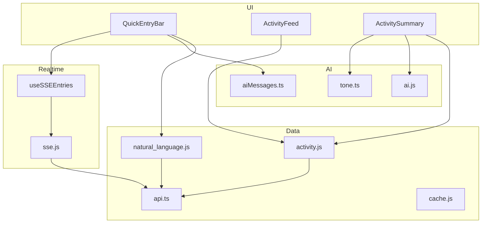
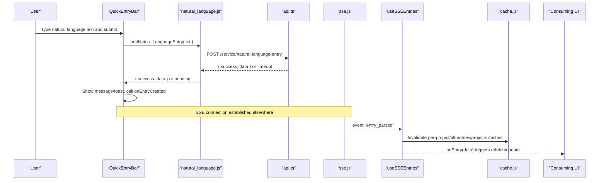
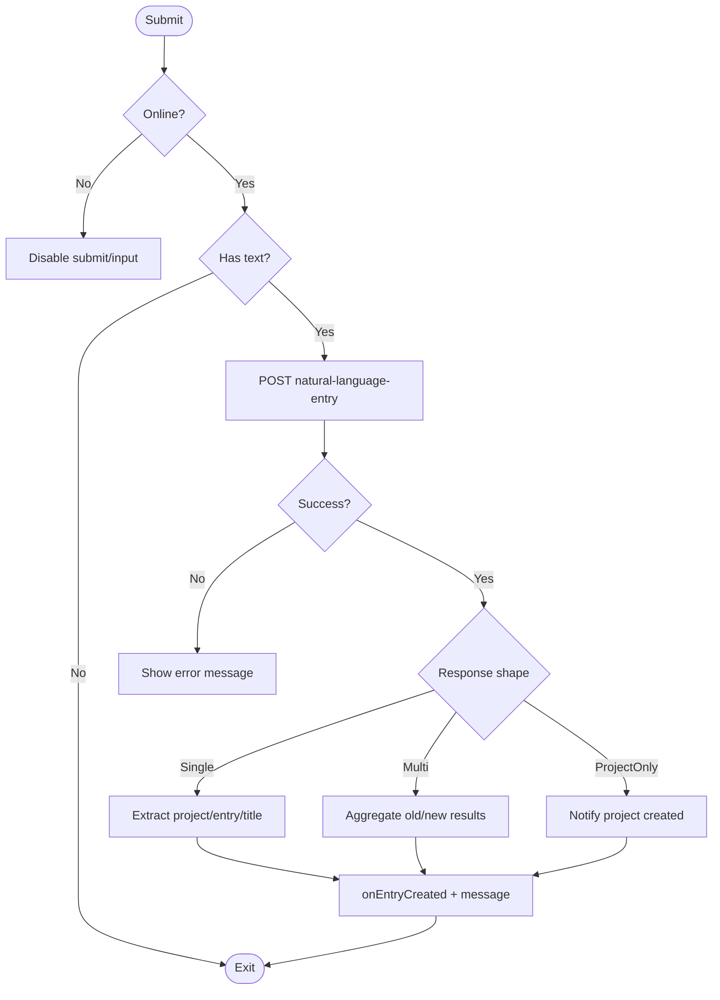
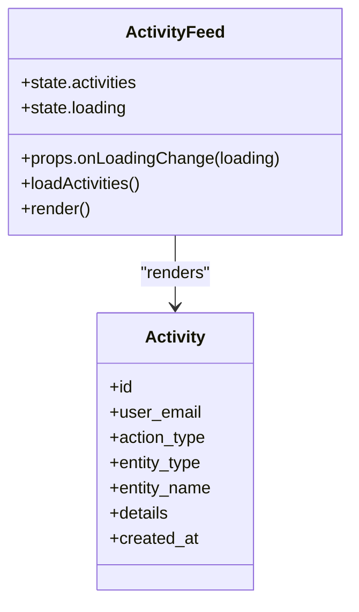
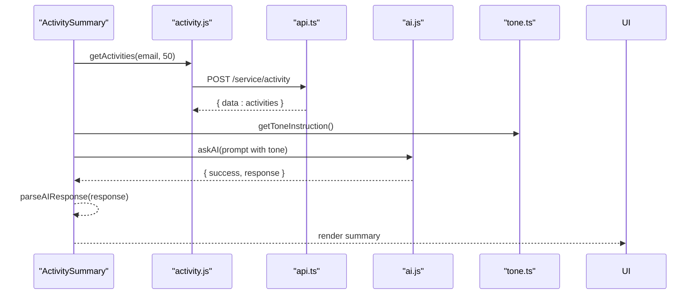
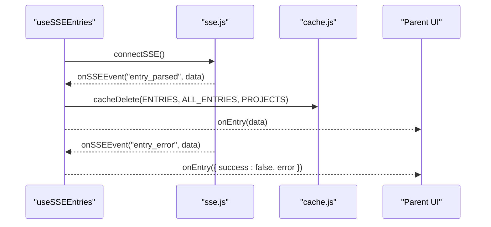
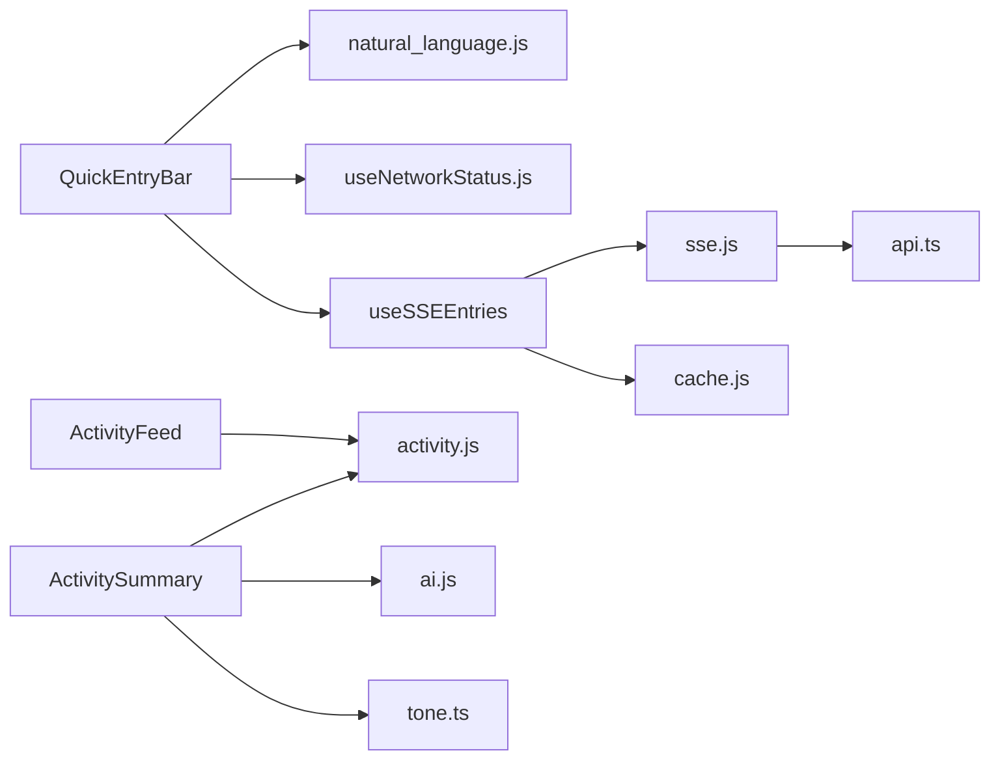

# Entry Management Components

<cite>
**Referenced Files in This Document**
- [QuickEntryBar.tsx](file://frontend/src/components/QuickEntryBar.tsx)
- [ActivityFeed.tsx](file://frontend/src/components/ActivityFeed.tsx)
- [ActivitySummary.tsx](file://frontend/src/components/ActivitySummary.tsx)
- [useSSEEntries.ts](file://frontend/src/hooks/useSSEEntries.ts)
- [sse.js](file://frontend/src/lib/sse.js)
- [natural_language.js](file://frontend/src/functions/project/natural_language.js)
- [activity.js](file://frontend/src/functions/activity.js)
- [api.ts](file://frontend/src/lib/api.ts)
- [cache.js](file://frontend/src/lib/cache.js)
- [ai.js](file://frontend/src/functions/ai.js)
- [tone.ts](file://frontend/src/functions/tone.ts)
- [aiMessages.ts](file://frontend/src/functions/aiMessages.ts)
- [useNetworkStatus.js](file://frontend/src/hooks/useNetworkStatus.js)
</cite>

## Table of Contents

1. [Introduction](#introduction)
2. [Project Structure](#project-structure)
3. [Core Components](#core-components)
4. [Architecture Overview](#architecture-overview)
5. [Detailed Component Analysis](#detailed-component-analysis)
6. [Dependency Analysis](#dependency-analysis)
7. [Performance Considerations](#performance-considerations)
8. [Troubleshooting Guide](#troubleshooting-guide)
9. [Conclusion](#conclusion)
10. [Appendices](#appendices)

## Introduction

This document explains the entry management components that power fast task creation, real-time activity display, and overview statistics:

- QuickEntryBar: A natural-language input for quick task creation with immediate feedback and optional voice input.
- ActivityFeed: A scrollable feed of recent actions (projects, entries, fields, priorities) with human-readable formatting.
- ActivitySummary: An AI-generated one-line summary of recent activity to provide a high-level overview.

It also covers data binding patterns, real-time updates via Server-Sent Events (SSE), filtering approaches, and integration points with project service APIs.

## Project Structure

The entry management features are implemented as React components backed by functions and hooks:

- UI layer: QuickEntryBar, ActivityFeed, ActivitySummary
- Real-time layer: useSSEEntries hook and SSE connection manager
- Data layer: API request wrapper, caching, and offline queue
- AI layer: prompt generation and tone customization

**Diagram sources**

- [QuickEntryBar.tsx:1-259](file://frontend/src/components/QuickEntryBar.tsx#L1-L259)
- [ActivityFeed.tsx:1-515](file://frontend/src/components/ActivityFeed.tsx#L1-L515)
- [ActivitySummary.tsx:1-127](file://frontend/src/components/ActivitySummary.tsx#L1-L127)
- [useSSEEntries.ts:1-108](file://frontend/src/hooks/useSSEEntries.ts#L1-L108)
- [sse.js:1-185](file://frontend/src/lib/sse.js#L1-L185)
- [natural_language.js:1-44](file://frontend/src/functions/project/natural_language.js#L1-L44)
- [activity.js:1-12](file://frontend/src/functions/activity.js#L1-L12)
- [api.ts:1-70](file://frontend/src/lib/api.ts#L1-L70)
- [cache.js:1-389](file://frontend/src/lib/cache.js#L1-L389)
- [ai.js:1-25](file://frontend/src/functions/ai.js#L1-L25)
- [tone.ts:1-74](file://frontend/src/functions/tone.ts#L1-L74)
- [aiMessages.ts:1-29](file://frontend/src/functions/aiMessages.ts#L1-L29)

**Section sources**

- [QuickEntryBar.tsx:1-259](file://frontend/src/components/QuickEntryBar.tsx#L1-L259)
- [ActivityFeed.tsx:1-515](file://frontend/src/components/ActivityFeed.tsx#L1-L515)
- [ActivitySummary.tsx:1-127](file://frontend/src/components/ActivitySummary.tsx#L1-L127)
- [useSSEEntries.ts:1-108](file://frontend/src/hooks/useSSEEntries.ts#L1-L108)
- [sse.js:1-185](file://frontend/src/lib/sse.js#L1-L185)
- [natural_language.js:1-44](file://frontend/src/functions/project/natural_language.js#L1-L44)
- [activity.js:1-12](file://frontend/src/functions/activity.js#L1-L12)
- [api.ts:1-70](file://frontend/src/lib/api.ts#L1-L70)
- [cache.js:1-389](file://frontend/src/lib/cache.js#L1-L389)
- [ai.js:1-25](file://frontend/src/functions/ai.js#L1-L25)
- [tone.ts:1-74](file://frontend/src/functions/tone.ts#L1-L74)
- [aiMessages.ts:1-29](file://frontend/src/functions/aiMessages.ts#L1-L29)

## Core Components

- QuickEntryBar
  - Purpose: Fast natural-language entry creation with immediate UX feedback and optional voice input.
  - Inputs: text input, optional placeholder, callbacks for created entries and voice open.
  - Behavior: Submits via natural language endpoint; handles single-entry, multi-entry, and project-only responses; shows messages/toasts; integrates with network status.
  - Real-time: Integrates with SSE via useSSEEntries to update caches and UI when parsing completes.

- ActivityFeed
  - Purpose: Display recent user actions with icons, verbs, entity names, and details.
  - Data: Loads activities via getActivities; formats relative time and detail values; supports rename flows and truncation.
  - Filtering: Can be extended with filters by action_type, entity_type, or date ranges.

- ActivitySummary
  - Purpose: Provide an AI-generated one-sentence summary of recent activity.
  - Data: Fetches recent activities, builds a compact prompt using action counts and recent entities, applies tone instructions, and renders the parsed response.

**Section sources**

- [QuickEntryBar.tsx:1-259](file://frontend/src/components/QuickEntryBar.tsx#L1-L259)
- [ActivityFeed.tsx:1-515](file://frontend/src/components/ActivityFeed.tsx#L1-L515)
- [ActivitySummary.tsx:1-127](file://frontend/src/components/ActivitySummary.tsx#L1-L127)

## Architecture Overview

End-to-end flow from user input to real-time UI updates:

**Diagram sources**

- [QuickEntryBar.tsx:61-134](file://frontend/src/components/QuickEntryBar.tsx#L61-L134)
- [natural_language.js:13-43](file://frontend/src/functions/project/natural_language.js#L13-L43)
- [api.ts:10-57](file://frontend/src/lib/api.ts#L10-L57)
- [sse.js:37-101](file://frontend/src/lib/sse.js#L37-L101)
- [useSSEEntries.ts:41-107](file://frontend/src/hooks/useSSEEntries.ts#L41-L107)
- [cache.js:249-263](file://frontend/src/lib/cache.js#L249-L263)

## Detailed Component Analysis

### QuickEntryBar

- Interface
  - Props: onEntryCreated callback, onVoiceOpen callback, placeholder string.
  - State: text, loading, message, toast, messageType, inputRef, isOnline.
- Submission Flow
  - Validates input and online status.
  - Calls addNaturalLanguageEntry which posts to the project service.
  - Handles three response shapes:
    - Single entry: extracts project, entry_id, title; notifies parent via onEntryCreated.
    - Multi-entry: aggregates results.old and results.new into created list.
    - Project-only: creates project notification and adds to created list.
  - Shows success/error messages and optional AI toast if enabled.
- Keyboard and Voice
  - Enter submits; Shift+Enter allows newlines.
  - Optional voice button disabled when offline.
- Network Awareness
  - Uses useNetworkStatus to disable input and show offline hints.

**Diagram sources**

- [QuickEntryBar.tsx:61-134](file://frontend/src/components/QuickEntryBar.tsx#L61-L134)
- [natural_language.js:13-43](file://frontend/src/functions/project/natural_language.js#L13-L43)

**Section sources**

- [QuickEntryBar.tsx:1-259](file://frontend/src/components/QuickEntryBar.tsx#L1-L259)
- [natural_language.js:1-44](file://frontend/src/functions/project/natural_language.js#L1-L44)
- [useNetworkStatus.js:1-41](file://frontend/src/hooks/useNetworkStatus.js#L1-L41)
- [aiMessages.ts:1-29](file://frontend/src/functions/aiMessages.ts#L1-L29)

### ActivityFeed

- Data Loading
  - Loads activities via getActivities with current user email and limit.
  - Displays loading spinner and empty state when no activities.
- Rendering
  - Maps action types to icons and verb phrases.
  - Formats detail values (priority labels, booleans, dates).
  - Truncates long names and parses JSON-like entity names.
  - Highlights rename flows with old/new project names.
- Filtering Hooks
  - The component currently renders all activities; consumers can filter by action_type, entity_type, or date range before rendering.

**Diagram sources**

- [ActivityFeed.tsx:5-13](file://frontend/src/components/ActivityFeed.tsx#L5-L13)
- [ActivityFeed.tsx:376-404](file://frontend/src/components/ActivityFeed.tsx#L376-L404)

**Section sources**

- [ActivityFeed.tsx:1-515](file://frontend/src/components/ActivityFeed.tsx#L1-L515)
- [activity.js:1-12](file://frontend/src/functions/activity.js#L1-L12)

### ActivitySummary

- Data and AI Integration
  - Fetches recent activities and builds a compact prompt including action counts and recent entities.
  - Applies tone instruction to shape the AI’s style.
  - Parses flexible AI responses (JSON or plain text) and renders the result.
- Fallbacks
  - If AI is disabled or fails, shows a friendly default message.

**Diagram sources**

- [ActivitySummary.tsx:55-115](file://frontend/src/components/ActivitySummary.tsx#L55-L115)
- [activity.js:1-12](file://frontend/src/functions/activity.js#L1-L12)
- [api.ts:10-57](file://frontend/src/lib/api.ts#L10-L57)
- [ai.js:8-24](file://frontend/src/functions/ai.js#L8-L24)
- [tone.ts:38-49](file://frontend/src/functions/tone.ts#L38-L49)

**Section sources**

- [ActivitySummary.tsx:1-127](file://frontend/src/components/ActivitySummary.tsx#L1-L127)
- [ai.js:1-25](file://frontend/src/functions/ai.js#L1-L25)
- [tone.ts:1-74](file://frontend/src/functions/tone.ts#L1-L74)

### Real-Time Updates via SSE

- Connection Management
  - sse.js manages EventSource lifecycle, authentication via token query param, and reconnection with exponential backoff.
  - Exposes connectSSE, disconnectSSE, onSSEEvent, isSSEConnected.
- Hook Integration
  - useSSEEntries subscribes to entry_parsed and entry_error events.
  - On entry_parsed, invalidates relevant cache keys (per-project, all-entries, projects) and invokes onEntry callback for UI updates.
  - Does not disconnect SSE on unmount; shared across app and disconnected on sign-out.

**Diagram sources**

- [useSSEEntries.ts:41-107](file://frontend/src/hooks/useSSEEntries.ts#L41-L107)
- [sse.js:37-101](file://frontend/src/lib/sse.js#L37-L101)
- [cache.js:249-263](file://frontend/src/lib/cache.js#L249-L263)

**Section sources**

- [useSSEEntries.ts:1-108](file://frontend/src/hooks/useSSEEntries.ts#L1-L108)
- [sse.js:1-185](file://frontend/src/lib/sse.js#L1-L185)
- [cache.js:1-389](file://frontend/src/lib/cache.js#L1-L389)

## Dependency Analysis

Key dependencies and relationships:

- QuickEntryBar depends on:
  - natural_language.js for submission
  - aiMessages.ts for toggling AI toasts
  - useNetworkStatus.js for connectivity checks
  - useSSEEntries hook for real-time updates
- ActivityFeed depends on:
  - activity.js for fetching activities
- ActivitySummary depends on:
  - activity.js for recent activities
  - ai.js for AI summarization
  - tone.ts for tone instructions
- SSE layer depends on:
  - api.ts for environment URLs and auth token retrieval
  - cache.js for cache invalidation

**Diagram sources**

- [QuickEntryBar.tsx:1-259](file://frontend/src/components/QuickEntryBar.tsx#L1-L259)
- [natural_language.js:1-44](file://frontend/src/functions/project/natural_language.js#L1-L44)
- [useNetworkStatus.js:1-41](file://frontend/src/hooks/useNetworkStatus.js#L1-L41)
- [useSSEEntries.ts:1-108](file://frontend/src/hooks/useSSEEntries.ts#L1-L108)
- [sse.js:1-185](file://frontend/src/lib/sse.js#L1-L185)
- [api.ts:1-70](file://frontend/src/lib/api.ts#L1-L70)
- [cache.js:1-389](file://frontend/src/lib/cache.js#L1-L389)
- [ActivityFeed.tsx:1-515](file://frontend/src/components/ActivityFeed.tsx#L1-L515)
- [activity.js:1-12](file://frontend/src/functions/activity.js#L1-L12)
- [ActivitySummary.tsx:1-127](file://frontend/src/components/ActivitySummary.tsx#L1-L127)
- [ai.js:1-25](file://frontend/src/functions/ai.js#L1-L25)
- [tone.ts:1-74](file://frontend/src/functions/tone.ts#L1-L74)

**Section sources**

- [QuickEntryBar.tsx:1-259](file://frontend/src/components/QuickEntryBar.tsx#L1-L259)
- [ActivityFeed.tsx:1-515](file://frontend/src/components/ActivityFeed.tsx#L1-L515)
- [ActivitySummary.tsx:1-127](file://frontend/src/components/ActivitySummary.tsx#L1-L127)
- [useSSEEntries.ts:1-108](file://frontend/src/hooks/useSSEEntries.ts#L1-L108)
- [sse.js:1-185](file://frontend/src/lib/sse.js#L1-L185)
- [natural_language.js:1-44](file://frontend/src/functions/project/natural_language.js#L1-L44)
- [activity.js:1-12](file://frontend/src/functions/activity.js#L1-L12)
- [api.ts:1-70](file://frontend/src/lib/api.ts#L1-L70)
- [cache.js:1-389](file://frontend/src/lib/cache.js#L1-L389)
- [ai.js:1-25](file://frontend/src/functions/ai.js#L1-L25)
- [tone.ts:1-74](file://frontend/src/functions/tone.ts#L1-L74)

## Performance Considerations

- SSE Reconnection Strategy
  - Exponential backoff prevents thundering herds during outages.
  - Max reconnect attempts capped to avoid infinite loops.
- Cache Invalidation
  - Targeted invalidation of per-project, all-entries, and projects caches reduces unnecessary refetches.
- Optimistic UI
  - Natural language submission uses short timeouts; SSE delivers final data promptly.
- Network-Aware Controls
  - Disables inputs/buttons when offline to prevent failed submissions.

[No sources needed since this section provides general guidance]

## Troubleshooting Guide

- QuickEntryBar
  - If submission appears stuck, check network status and ensure SSE is connected.
  - Verify AI messages toggle if toasts do not appear.
- ActivityFeed
  - Empty feed indicates no activities; verify user email context and getActivities call.
  - For missing details, inspect action_type mapping and detail value formatters.
- ActivitySummary
  - If summary is generic, confirm AI messages are enabled and tone instructions are applied.
  - Inspect AI response parsing for unexpected structures.
- SSE
  - If real-time updates do not arrive, verify connectSSE calls and event subscriptions.
  - Check logs for connection errors and reconnection attempts.

**Section sources**

- [QuickEntryBar.tsx:61-134](file://frontend/src/components/QuickEntryBar.tsx#L61-L134)
- [ActivityFeed.tsx:381-404](file://frontend/src/components/ActivityFeed.tsx#L381-L404)
- [ActivitySummary.tsx:61-115](file://frontend/src/components/ActivitySummary.tsx#L61-L115)
- [sse.js:37-101](file://frontend/src/lib/sse.js#L37-L101)
- [useSSEEntries.ts:41-107](file://frontend/src/hooks/useSSEEntries.ts#L41-L107)

## Conclusion

The entry management components provide a cohesive experience for fast task creation, real-time activity visibility, and concise summaries. QuickEntryBar streamlines natural-language input with robust handling of various backend responses. ActivityFeed offers clear, contextual activity logs, while ActivitySummary leverages AI to deliver a friendly overview. SSE ensures timely updates with resilient connections and targeted cache invalidation. Together, these components integrate cleanly with project service APIs and support extensibility for custom forms, filters, and integrations.

[No sources needed since this section summarizes without analyzing specific files]

## Appendices

### Customizing Entry Forms

- QuickEntryBar
  - Customize placeholder text via props.
  - Provide onEntryCreated to populate “Recently created” lists with created[] items.
  - Enable voice input by passing onVoiceOpen and ensuring network availability.
- ActivityFeed
  - Extend ACTION_CONFIG to map additional action types to icons and verbs.
  - Add DETAIL_LABELS for new detail keys to improve readability.
- ActivitySummary
  - Adjust tone via tone preferences to change AI output style.
  - Modify prompt construction to emphasize different aspects of activity.

**Section sources**

- [QuickEntryBar.tsx:7-23](file://frontend/src/components/QuickEntryBar.tsx#L7-L23)
- [ActivityFeed.tsx:15-294](file://frontend/src/components/ActivityFeed.tsx#L15-L294)
- [ActivitySummary.tsx:81-99](file://frontend/src/components/ActivitySummary.tsx#L81-L99)
- [tone.ts:38-49](file://frontend/src/functions/tone.ts#L38-L49)

### Filtering Activities

- Current behavior: ActivityFeed renders all activities.
- Suggested approach:
  - Add props for filters (e.g., action_type, entity_type, date range).
  - Filter activities array before rendering based on selected criteria.
  - Debounce filter changes to minimize re-renders.

**Section sources**

- [ActivityFeed.tsx:448-510](file://frontend/src/components/ActivityFeed.tsx#L448-L510)

### Integrating with Project Service APIs

- Natural Language Entry
  - Use addNaturalLanguageEntry to submit text; handle success/failure and pending states.
  - Listen for SSE entry_parsed events to finalize UI updates.
- Activities
  - Use getActivities to fetch recent actions; pass user_email and limit.
- AI Summaries
  - Use askAI with prompts that include action counts and recent entities; apply tone instructions.

**Section sources**

- [natural_language.js:13-43](file://frontend/src/functions/project/natural_language.js#L13-L43)
- [activity.js:3-11](file://frontend/src/functions/activity.js#L3-L11)
- [ai.js:8-24](file://frontend/src/functions/ai.js#L8-L24)
- [sse.js:37-101](file://frontend/src/lib/sse.js#L37-L101)
- [useSSEEntries.ts:41-107](file://frontend/src/hooks/useSSEEntries.ts#L41-L107)
