# UI Components & Design System

<cite>
**Referenced Files in This Document**
- [AppShell.tsx](file://frontend/src/components/AppShell.tsx)
- [Header.tsx](file://frontend/src/components/Header.tsx)
- [NavBar.tsx](file://frontend/src/components/NavBar.tsx)
- [ProtectedRoute.tsx](file://frontend/src/components/ProtectedRoute.tsx)
- [QuickEntryBar.tsx](file://frontend/src/components/QuickEntryBar.tsx)
- [ProfileMenu.tsx](file://frontend/src/components/ProfileMenu.tsx)
- [NotificationsBell.tsx](file://frontend/src/components/NotificationsBell.tsx)
- [Stats.tsx](file://frontend/src/components/Stats.tsx)
- [SettingsPanel.tsx](file://frontend/src/components/SettingsPanel.tsx)
- [index.css](file://frontend/src/index.css)
- [Timeline.css](file://frontend/src/pages/Timeline.css)
- [Kanban.css](file://frontend/src/pages/Kanban.css)
</cite>

## Table of Contents

1. Introduction
2. Project Structure
3. Core Components
4. Architecture Overview
5. Detailed Component Analysis
6. Dependency Analysis
7. Performance Considerations
8. Troubleshooting Guide
9. Conclusion
10. Appendices

## Introduction

This document describes the UI component library and design system used across the Codacaine application. It focuses on reusable components such as AppShell, Header, NavBar, ProtectedRoute, QuickEntryBar, ProfileMenu, NotificationsBell, Stats, and SettingsPanel. It explains styling via CSS custom properties, theme switching, responsive patterns, accessibility practices, keyboard navigation, screen reader support, and animation conventions. It also provides usage examples, customization options, and best practices for creating new components.

## Project Structure

The UI is implemented as React components under frontend/src/components with global styles and page-specific styles under frontend/src and frontend/src/pages. The design system is driven by CSS custom properties defined in index.css, enabling multiple themes (light, dark, pink, blue, purple, green, brown, navy, darkpurple, coffee, oled). Components use semantic HTML, ARIA attributes, and consistent class naming to ensure accessibility and maintainability.

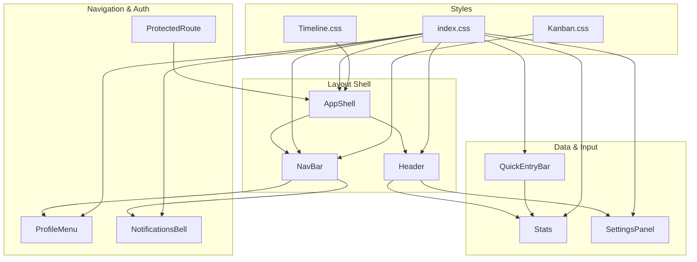

**Diagram sources**

- [AppShell.tsx:1-132](file://frontend/src/components/AppShell.tsx#L1-L132)
- [NavBar.tsx:1-607](file://frontend/src/components/NavBar.tsx#L1-L607)
- [Header.tsx:1-106](file://frontend/src/components/Header.tsx#L1-L106)
- [ProtectedRoute.tsx:1-82](file://frontend/src/components/ProtectedRoute.tsx#L1-L82)
- [QuickEntryBar.tsx:1-259](file://frontend/src/components/QuickEntryBar.tsx#L1-L259)
- [ProfileMenu.tsx:1-145](file://frontend/src/components/ProfileMenu.tsx#L1-L145)
- [NotificationsBell.tsx:1-211](file://frontend/src/components/NotificationsBell.tsx#L1-L211)
- [Stats.tsx:1-268](file://frontend/src/components/Stats.tsx#L1-L268)
- [SettingsPanel.tsx:1-800](file://frontend/src/components/SettingsPanel.tsx#L1-L800)
- [index.css:11-800](file://frontend/src/index.css#L11-L800)
- [Timeline.css:1-200](file://frontend/src/pages/Timeline.css#L1-L200)
- [Kanban.css:1-200](file://frontend/src/pages/Kanban.css#L1-L200)

**Section sources**

- [index.css:11-800](file://frontend/src/index.css#L11-L800)
- [AppShell.tsx:1-132](file://frontend/src/components/AppShell.tsx#L1-L132)
- [NavBar.tsx:1-607](file://frontend/src/components/NavBar.tsx#L1-L607)
- [Header.tsx:1-106](file://frontend/src/components/Header.tsx#L1-L106)

## Core Components

- AppShell: Provides the top navbar, left drawer navigation, and main content area. Manages drawer state, logout flow, and active route highlighting.
- NavBar: Full-featured navigation with project list, views, notifications, profile menu, and guided tour integration. Loads projects and entries from IndexedDB cache and supports archiving and new project actions.
- Header: Displays page title and a compact Stats panel; integrates with SettingsPanel via a window event.
- ProtectedRoute: Guards routes using auth context and a fallback Supabase session check to avoid race conditions during OAuth flows.
- QuickEntryBar: Natural language entry creation with offline awareness, voice input toggle, success/error messages, and AI toast feedback.
- ProfileMenu: Accessible dropdown with manage profile, settings, and sign out; closes on outside click or Escape key.
- NotificationsBell: Polls notifications, shows unread badge, marks items read, and navigates to related projects.
- Stats: Computes total time tracked, per-project breakdown, due soon counts, and optional AI reflection.
- SettingsPanel: Centralized user preferences including theme, font, corner style, tone, auto-save, compact mode, notifications, and account management. Persists settings locally and applies them globally.

**Section sources**

- [AppShell.tsx:1-132](file://frontend/src/components/AppShell.tsx#L1-L132)
- [NavBar.tsx:1-607](file://frontend/src/components/NavBar.tsx#L1-L607)
- [Header.tsx:1-106](file://frontend/src/components/Header.tsx#L1-L106)
- [ProtectedRoute.tsx:1-82](file://frontend/src/components/ProtectedRoute.tsx#L1-L82)
- [QuickEntryBar.tsx:1-259](file://frontend/src/components/QuickEntryBar.tsx#L1-L259)
- [ProfileMenu.tsx:1-145](file://frontend/src/components/ProfileMenu.tsx#L1-L145)
- [NotificationsBell.tsx:1-211](file://frontend/src/components/NotificationsBell.tsx#L1-L211)
- [Stats.tsx:1-268](file://frontend/src/components/Stats.tsx#L1-L268)
- [SettingsPanel.tsx:1-800](file://frontend/src/components/SettingsPanel.tsx#L1-L800)

## Architecture Overview

The layout shell composes NavBar and Header around page content. Navigation uses React Router hooks to update active states and navigate between views. Data for NavBar is sourced from IndexedDB cache for local-first behavior. Authentication gating is handled by ProtectedRoute, which falls back to direct session checks when necessary. User preferences are managed centrally in SettingsPanel and applied globally via CSS custom properties and data attributes.

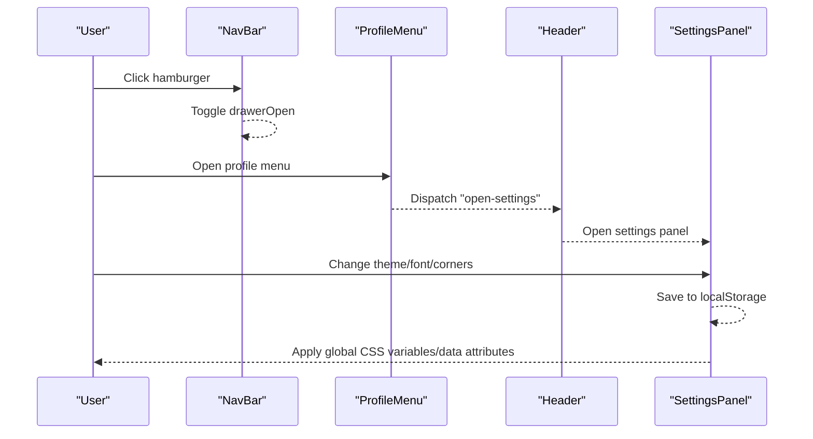

**Diagram sources**

- [NavBar.tsx:1-607](file://frontend/src/components/NavBar.tsx#L1-L607)
- [ProfileMenu.tsx:1-145](file://frontend/src/components/ProfileMenu.tsx#L1-L145)
- [Header.tsx:1-106](file://frontend/src/components/Header.tsx#L1-L106)
- [SettingsPanel.tsx:1-800](file://frontend/src/components/SettingsPanel.tsx#L1-L800)

## Detailed Component Analysis

### AppShell

- Responsibilities: Top navbar with logo and user menu; left drawer with view links; main content slot; logout handling; active route detection.
- Props: children (ReactNode).
- Event handling: Hamburger toggles drawer; Home button navigates to dashboard; ProfileMenu triggers sign-out; drawer close buttons dismiss overlay.
- Accessibility: Buttons have aria-labels; SVG icons are decorative; drawer items are interactive buttons.
- Styling: Uses classes like navbar, drawer, drawer-overlay, dash-main; relies on index.css variables for colors and spacing.

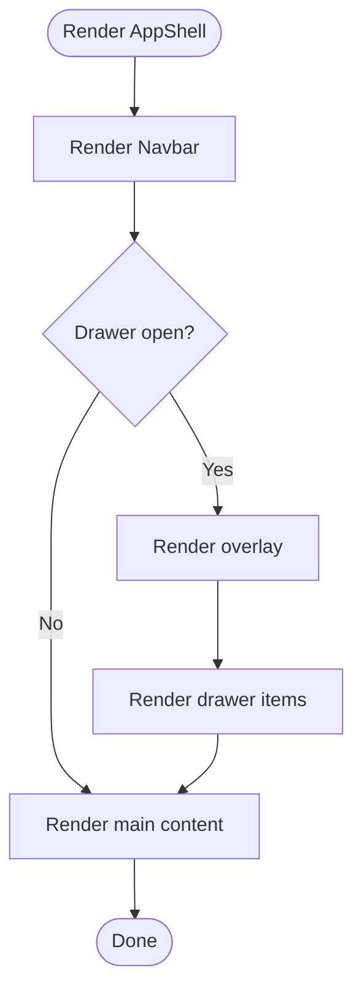

**Diagram sources**

- [AppShell.tsx:1-132](file://frontend/src/components/AppShell.tsx#L1-L132)

**Section sources**

- [AppShell.tsx:1-132](file://frontend/src/components/AppShell.tsx#L1-L132)

### NavBar

- Responsibilities: Renders top nav with guide button, notifications bell, and profile menu; renders left drawer with Views and Projects sections; loads projects and entries from IndexedDB; supports archive and new project callbacks.
- Props: projects, entries, activeView, onArchiveProject, onNewProject.
- Event handling: Drawer toggle; navigation to views/projects; tour integration via window events; profile menu dispatches open-settings; notifications bell opens panel.
- Accessibility: aria-labels on controls; role="menu" on panels; keyboard-friendly interactions; Escape to close menus.
- Styling: Uses navbar, drawer, drawer-section, drawer-item, drawer-badge; color-coded project dots via projectColorMap.

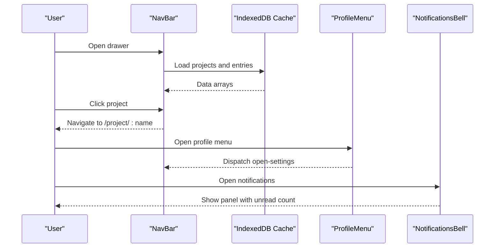

**Diagram sources**

- [NavBar.tsx:1-607](file://frontend/src/components/NavBar.tsx#L1-L607)
- [NotificationsBell.tsx:1-211](file://frontend/src/components/NotificationsBell.tsx#L1-L211)
- [ProfileMenu.tsx:1-145](file://frontend/src/components/ProfileMenu.tsx#L1-L145)

**Section sources**

- [NavBar.tsx:1-607](file://frontend/src/components/NavBar.tsx#L1-L607)

### Header

- Responsibilities: Displays page title and Stats; opens SettingsPanel via window event; reads profile from IndexedDB cache.
- Props: title, entries, projects, dueSoonCount.
- Event handling: Listens for open-settings; manages delete/reset password flows via auth context.
- Accessibility: Semantic headings; accessible stats trigger.
- Styling: feed-header, feed-title, animate-in; uses index.css variables.

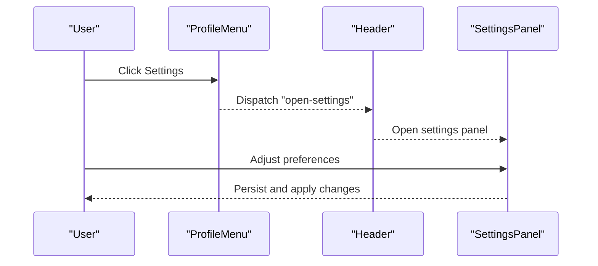

**Diagram sources**

- [Header.tsx:1-106](file://frontend/src/components/Header.tsx#L1-L106)
- [ProfileMenu.tsx:1-145](file://frontend/src/components/ProfileMenu.tsx#L1-L145)
- [SettingsPanel.tsx:1-800](file://frontend/src/components/SettingsPanel.tsx#L1-L800)

**Section sources**

- [Header.tsx:1-106](file://frontend/src/components/Header.tsx#L1-L106)

### ProtectedRoute

- Responsibilities: Guards protected routes; handles loading state; performs fallback session check via Supabase to prevent redirect races.
- Props: children (ReactNode).
- Event handling: None directly; relies on auth context and router navigation.
- Accessibility: Loading state includes spinner and text; redirects to signin if unauthenticated.
- Styling: Uses bg-mesh, auth-container, glass, animate-spin classes.

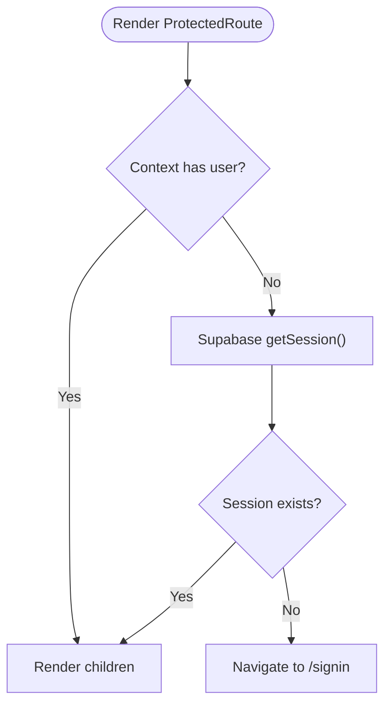

**Diagram sources**

- [ProtectedRoute.tsx:1-82](file://frontend/src/components/ProtectedRoute.tsx#L1-L82)

**Section sources**

- [ProtectedRoute.tsx:1-82](file://frontend/src/components/ProtectedRoute.tsx#L1-L82)

### QuickEntryBar

- Responsibilities: Natural language entry creation; offline-aware input; optional voice input; displays messages and AI toast; reports created entries to parent.
- Props: onEntryCreated, onVoiceOpen, placeholder.
- Event handling: Form submit; Enter key submits; voice button opens voice feature; network status disables input when offline.
- Accessibility: aria-labels on voice button; disabled states reflect offline; titles provide guidance.
- Styling: quick-entry-bar, quick-entry-form, quick-entry-input-wrap, quick-entry-message, quick-entry-toast; uses index.css variables.

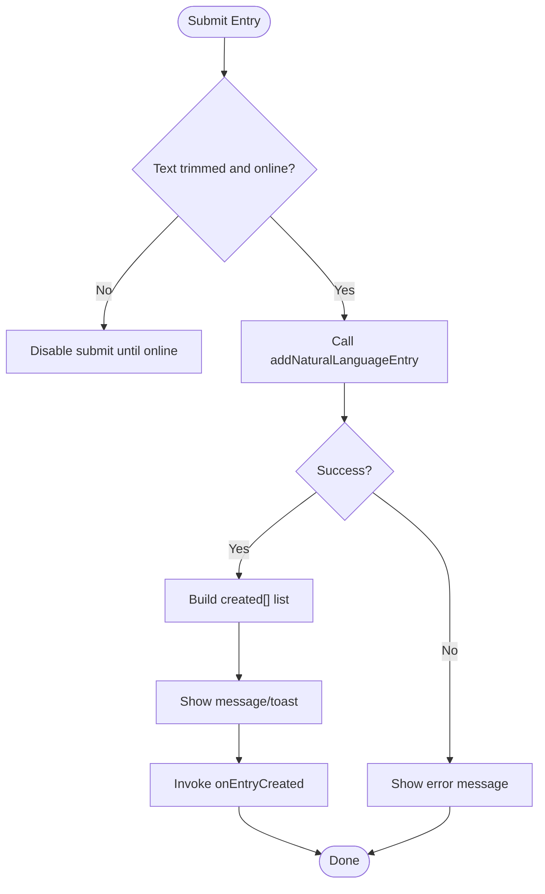

**Diagram sources**

- [QuickEntryBar.tsx:1-259](file://frontend/src/components/QuickEntryBar.tsx#L1-L259)

**Section sources**

- [QuickEntryBar.tsx:1-259](file://frontend/src/components/QuickEntryBar.tsx#L1-L259)

### ProfileMenu

- Responsibilities: Dropdown for profile actions; manages open/close state; closes on outside click or Escape.
- Props: displayName, email, avatarUrl, onManageProfile, onSettings, onSignOut, signingOut.
- Event handling: Click toggles menu; outside click closes; Escape closes; menu items invoke callbacks.
- Accessibility: aria-expanded, role="menu", role="menuitem"; keyboard support; descriptive labels.
- Styling: dropdown-wrapper, avatar-btn, dropdown, dropdown-items; uses index.css variables.

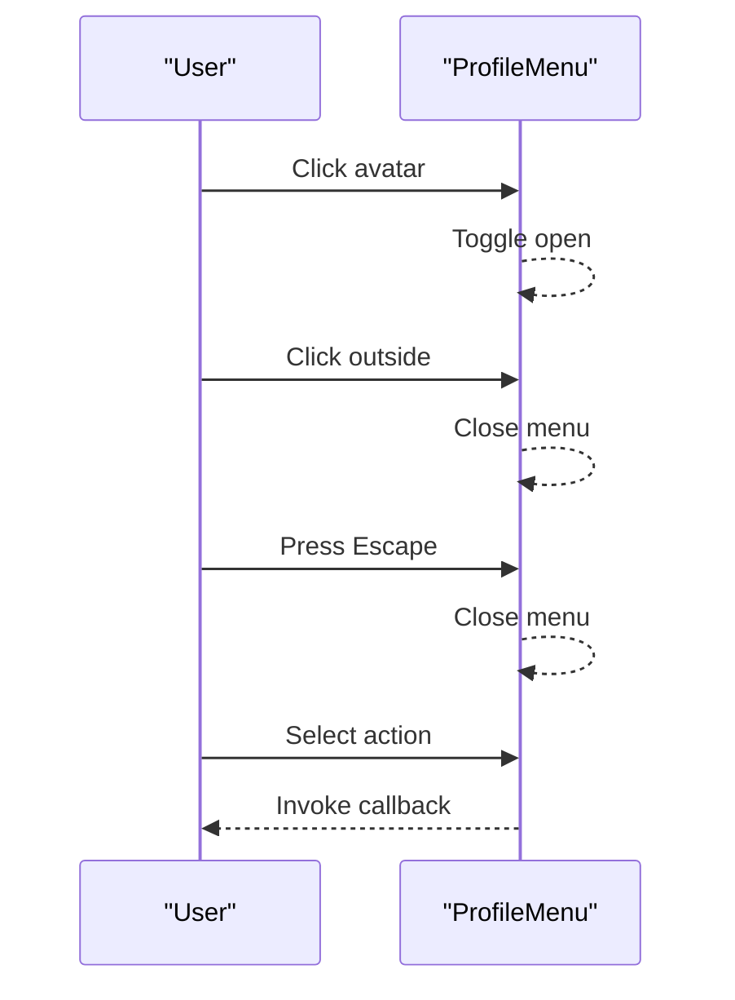

**Diagram sources**

- [ProfileMenu.tsx:1-145](file://frontend/src/components/ProfileMenu.tsx#L1-L145)

**Section sources**

- [ProfileMenu.tsx:1-145](file://frontend/src/components/ProfileMenu.tsx#L1-L145)

### NotificationsBell

- Responsibilities: Polls notifications; shows unread badge; marks items read; navigates to project pages; allows marking all as read.
- Props: email.
- Event handling: Opens/closes panel; clicks mark read and navigate; periodic refresh on focus and interval.
- Accessibility: aria-label, aria-expanded; roles for menu; informative titles.
- Styling: notif-bell-wrap, notif-bell-btn, notif-panel; uses index.css variables.

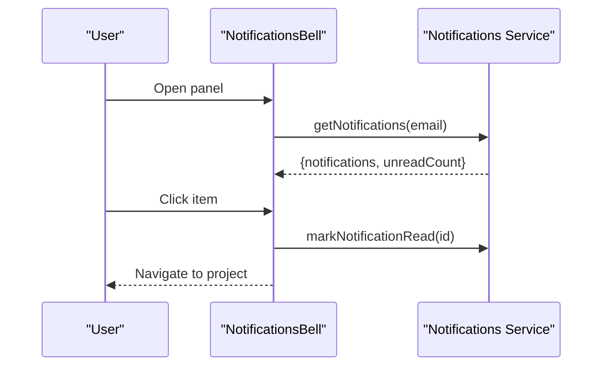

**Diagram sources**

- [NotificationsBell.tsx:1-211](file://frontend/src/components/NotificationsBell.tsx#L1-L211)

**Section sources**

- [NotificationsBell.tsx:1-211](file://frontend/src/components/NotificationsBell.tsx#L1-L211)

### Stats

- Responsibilities: Computes total time tracked, per-project breakdown, due soon counts; optional AI reflection; live timer for in-progress tasks.
- Props: entries, projects, dueSoonCount, activeProject.
- Event handling: Opens/closes stats panel; calculates metrics on open; updates with ticking timestamp.
- Accessibility: aria-label on close button; semantic structure.
- Styling: feed-stats-box, feed-stats-panel, feed-stat-item; uses index.css variables.

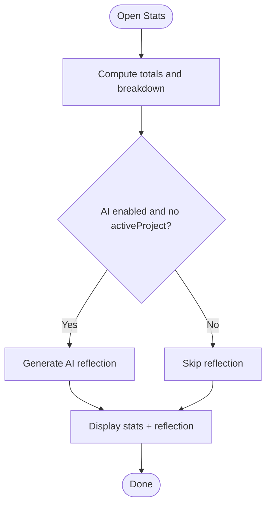

**Diagram sources**

- [Stats.tsx:1-268](file://frontend/src/components/Stats.tsx#L1-L268)

**Section sources**

- [Stats.tsx:1-268](file://frontend/src/components/Stats.tsx#L1-L268)

### SettingsPanel

- Responsibilities: Centralized preferences (theme, font, corner style, tone, auto-save, compact mode, notifications); account management (reset password, delete account); persists settings locally; applies global styles.
- Props: open, initialTab, userId, displayName, email, avatarUrl, provider, onClose, onDeleteAccount, onResetPassword, deleting, deleteError.
- Event handling: Tab switching; save applies theme/fonts/corners; keyboard Escape closes; form submissions update profile.
- Accessibility: Focus management; aria-labels; keyboard navigation; body overflow control when open.
- Styling: panel-overlay, panel-sheet, panel-tabs, panel-body; uses index.css variables.

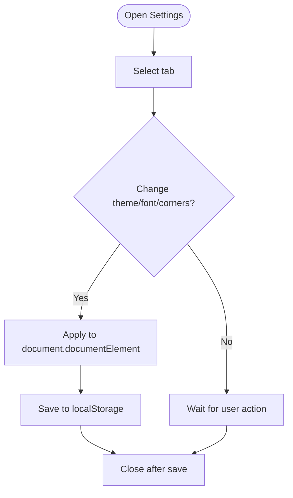

**Diagram sources**

- [SettingsPanel.tsx:1-800](file://frontend/src/components/SettingsPanel.tsx#L1-L800)

**Section sources**

- [SettingsPanel.tsx:1-800](file://frontend/src/components/SettingsPanel.tsx#L1-L800)

## Dependency Analysis

- NavBar depends on IndexedDB cache for projects and entries; uses projectColorMap for colors; integrates with NotificationsBell and ProfileMenu.
- Header depends on Stats and SettingsPanel; listens for open-settings event.
- QuickEntryBar depends on natural language processing and AI messages toggle; uses network status hook.
- ProtectedRoute depends on auth context and Supabase client for session checks.
- All components rely on index.css for theming and consistent visual tokens.

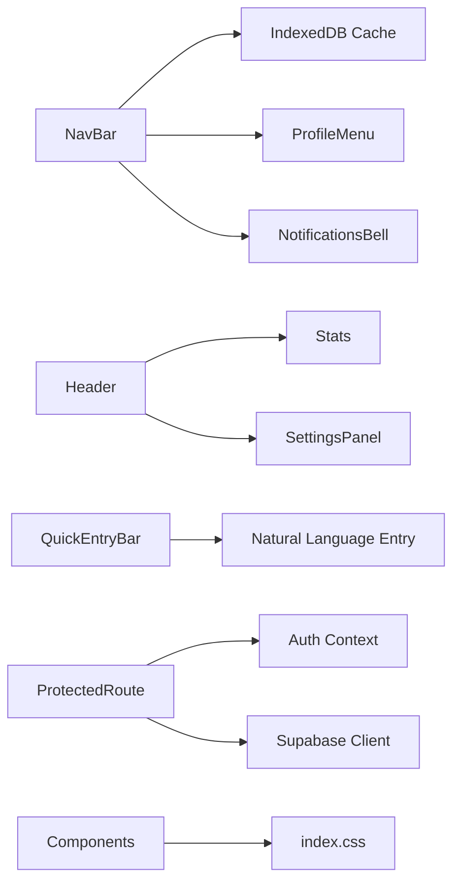

**Diagram sources**

- [NavBar.tsx:1-607](file://frontend/src/components/NavBar.tsx#L1-L607)
- [Header.tsx:1-106](file://frontend/src/components/Header.tsx#L1-L106)
- [QuickEntryBar.tsx:1-259](file://frontend/src/components/QuickEntryBar.tsx#L1-L259)
- [ProtectedRoute.tsx:1-82](file://frontend/src/components/ProtectedRoute.tsx#L1-L82)
- [index.css:11-800](file://frontend/src/index.css#L11-L800)

**Section sources**

- [NavBar.tsx:1-607](file://frontend/src/components/NavBar.tsx#L1-L607)
- [Header.tsx:1-106](file://frontend/src/components/Header.tsx#L1-L106)
- [QuickEntryBar.tsx:1-259](file://frontend/src/components/QuickEntryBar.tsx#L1-L259)
- [ProtectedRoute.tsx:1-82](file://frontend/src/components/ProtectedRoute.tsx#L1-L82)
- [index.css:11-800](file://frontend/src/index.css#L11-L800)

## Performance Considerations

- Local-first data: NavBar loads projects and entries from IndexedDB to reduce network calls and improve responsiveness.
- Live timers: Stats uses a ticking timestamp only when there are in-progress entries to minimize re-renders.
- Polling: NotificationsBell polls at intervals and on focus to keep badges updated without excessive requests.
- Theme application: SettingsPanel applies global styles once per change, avoiding frequent DOM mutations.
- Offline handling: QuickEntryBar disables input and provides clear feedback when offline to prevent unnecessary operations.

[No sources needed since this section provides general guidance]

## Troubleshooting Guide

- Authentication race condition: If a route appears unprotected briefly after login, ProtectedRoute’s fallback session check ensures correct behavior.
- Offline limitations: QuickEntryBar and NotificationsBell disable features when offline; ensure users see appropriate messages.
- Settings not applying: Verify that SettingsPanel saves to localStorage and applies data attributes to document.documentElement; confirm CSS variables are being used by components.
- Drawer not closing: Ensure overlay click handlers and Escape key listeners are attached; check for event listener cleanup in useEffect.

**Section sources**

- [ProtectedRoute.tsx:1-82](file://frontend/src/components/ProtectedRoute.tsx#L1-L82)
- [QuickEntryBar.tsx:1-259](file://frontend/src/components/QuickEntryBar.tsx#L1-L259)
- [NotificationsBell.tsx:1-211](file://frontend/src/components/NotificationsBell.tsx#L1-L211)
- [SettingsPanel.tsx:1-800](file://frontend/src/components/SettingsPanel.tsx#L1-L800)

## Conclusion

The Codacaine UI component library emphasizes a cohesive design system powered by CSS custom properties and theme variants, robust accessibility practices, and local-first data strategies. Components are modular, composable, and consistently styled, enabling scalable development and easy customization. By following the patterns outlined here—semantic markup, ARIA attributes, keyboard navigation, and theme-driven styling—you can create new components that integrate seamlessly with the existing system.

[No sources needed since this section summarizes without analyzing specific files]

## Appendices

### Visual Design System

- Color schemes: Multiple themes via data-theme attributes (light, dark, pink, blue, purple, green, brown, navy, darkpurple, coffee, oled), each defining --bg, --surface, --text, --accent, shadows, and overlays.
- Typography: Font families selectable in SettingsPanel (Lora, Plus Jakarta Sans, Playfair Display, Crimson Text, EB Garamond) applied via data-font attribute.
- Spacing and radii: Consistent use of --radius, --radius-sm, --radius-xs; spacing derived from CSS variables and utility classes.
- Animations: Spinners and transitions using CSS keyframes and classes like animate-spin; timeline and kanban pages define specific animations.

**Section sources**

- [index.css:11-800](file://frontend/src/index.css#L11-L800)
- [SettingsPanel.tsx:1-800](file://frontend/src/components/SettingsPanel.tsx#L1-L800)
- [Timeline.css:1-200](file://frontend/src/pages/Timeline.css#L1-L200)
- [Kanban.css:1-200](file://frontend/src/pages/Kanban.css#L1-L200)

### Component Usage Examples

- AppShell: Wrap your app content to provide consistent layout and navigation.
- NavBar: Include in protected routes to render navigation, projects, and user controls.
- Header: Place at the top of pages to show title and stats; integrate SettingsPanel via open-settings event.
- ProtectedRoute: Use around routes requiring authentication.
- QuickEntryBar: Add to dashboards or project pages for quick entry creation; handle onEntryCreated to update UI.
- ProfileMenu: Embed in navbar or header for user actions.
- NotificationsBell: Place in navbar to display and manage notifications.
- Stats: Include in headers or dashboards to show metrics and reflections.
- SettingsPanel: Open via profile menu or dedicated settings link; persist and apply user preferences.

**Section sources**

- [AppShell.tsx:1-132](file://frontend/src/components/AppShell.tsx#L1-L132)
- [NavBar.tsx:1-607](file://frontend/src/components/NavBar.tsx#L1-L607)
- [Header.tsx:1-106](file://frontend/src/components/Header.tsx#L1-L106)
- [ProtectedRoute.tsx:1-82](file://frontend/src/components/ProtectedRoute.tsx#L1-L82)
- [QuickEntryBar.tsx:1-259](file://frontend/src/components/QuickEntryBar.tsx#L1-L259)
- [ProfileMenu.tsx:1-145](file://frontend/src/components/ProfileMenu.tsx#L1-L145)
- [NotificationsBell.tsx:1-211](file://frontend/src/components/NotificationsBell.tsx#L1-L211)
- [Stats.tsx:1-268](file://frontend/src/components/Stats.tsx#L1-L268)
- [SettingsPanel.tsx:1-800](file://frontend/src/components/SettingsPanel.tsx#L1-L800)
