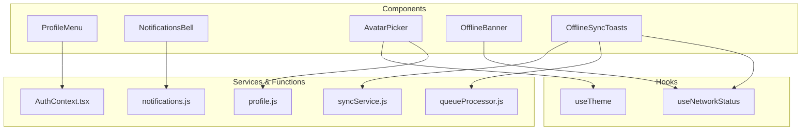
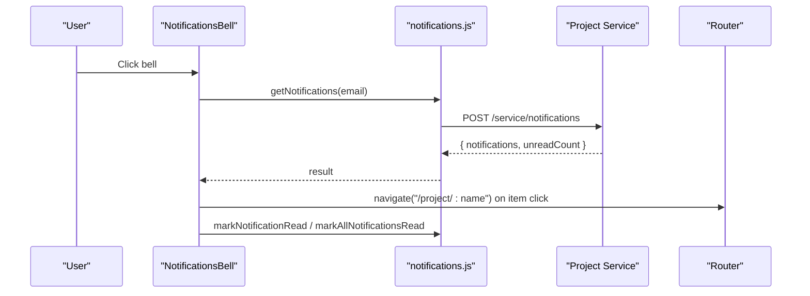
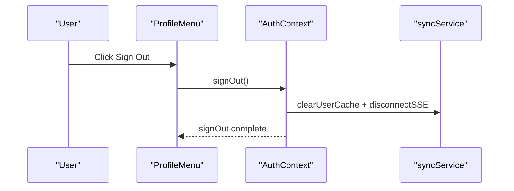
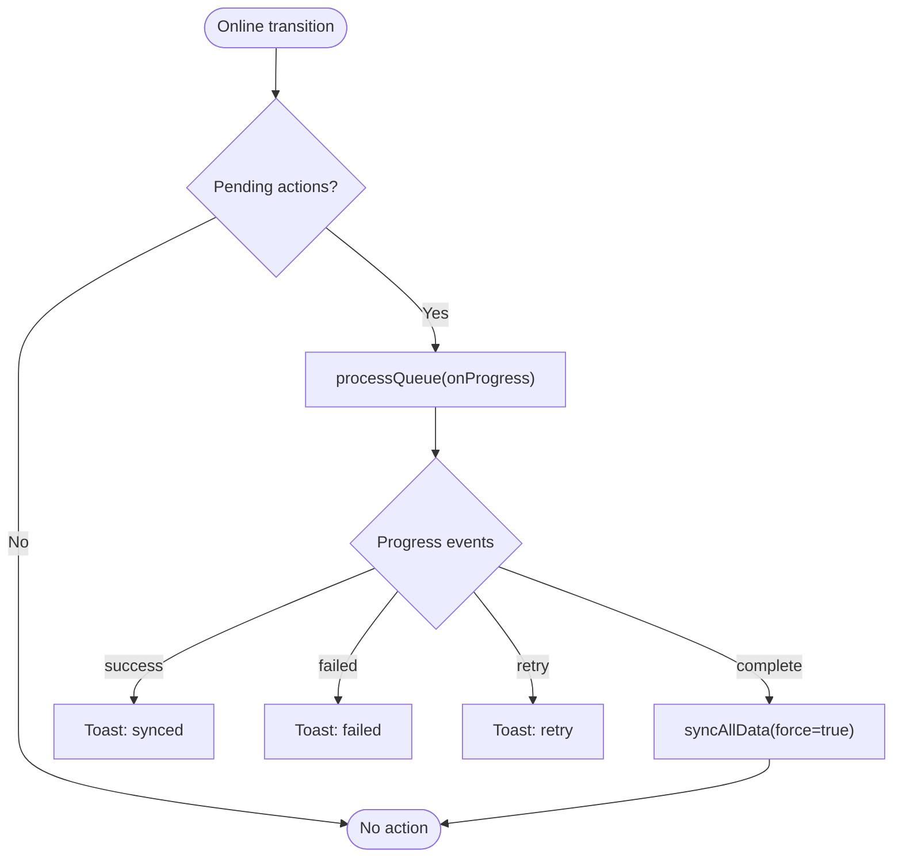
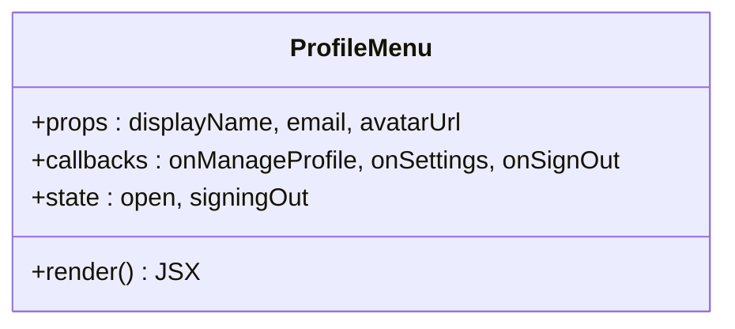
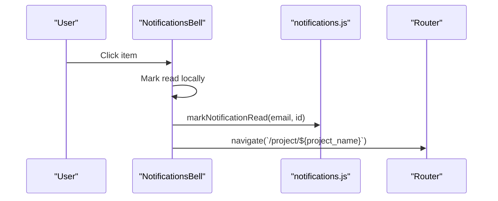
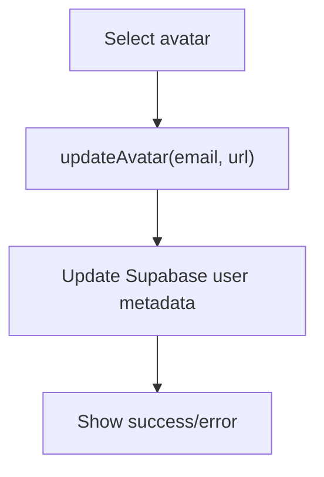
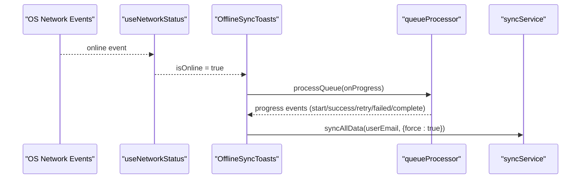
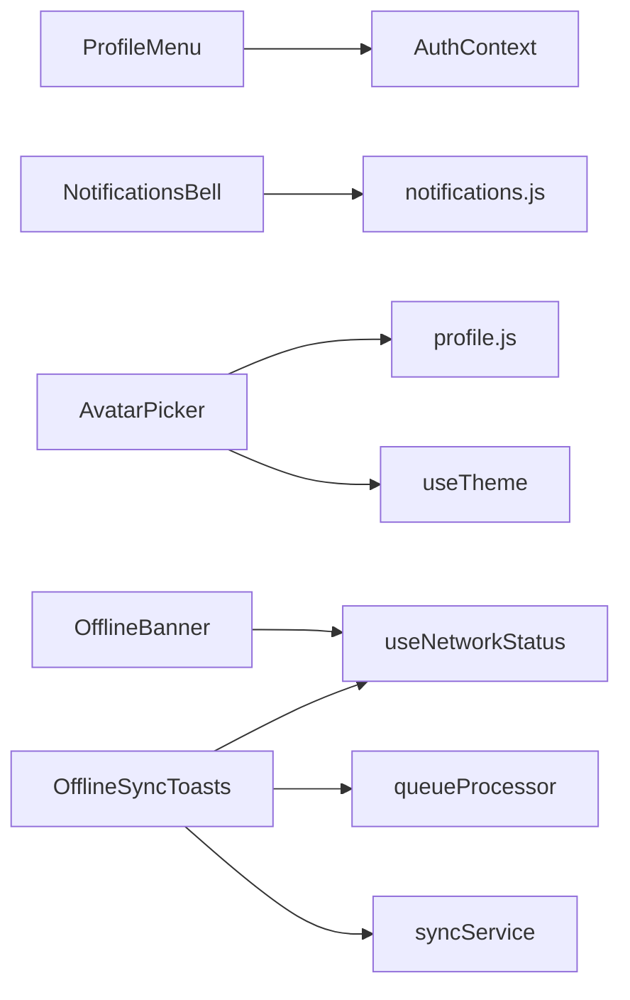

# User Interface Components

<cite>
**Referenced Files in This Document**
- [ProfileMenu.tsx](file://frontend/src/components/ProfileMenu.tsx)
- [NotificationsBell.tsx](file://frontend/src/components/NotificationsBell.tsx)
- [AvatarPicker.tsx](file://frontend/src/components/AvatarPicker.tsx)
- [OfflineBanner.tsx](file://frontend/src/components/OfflineBanner.tsx)
- [OfflineSyncToasts.tsx](file://frontend/src/components/OfflineSyncToasts.tsx)
- [useNetworkStatus.js](file://frontend/src/hooks/useNetworkStatus.js)
- [notifications.js](file://frontend/src/functions/project/notifications.js)
- [profile.js](file://frontend/src/functions/profile/profile.js)
- [queueProcessor.js](file://frontend/src/CacheFunctions/queueProcessor.js)
- [syncService.js](file://frontend/src/CacheFunctions/syncService.js)
- [AuthContext.tsx](file://frontend/src/context/AuthContext.tsx)
- [useTheme.ts](file://frontend/src/hooks/useTheme.ts)
- [ProfileMenu.test.tsx](file://frontend/src/components/__tests__/ProfileMenu.test.tsx)
</cite>

## Table of Contents

1. Introduction
2. Project Structure
3. Core Components
4. Architecture Overview
5. Detailed Component Analysis
6. Dependency Analysis
7. Performance Considerations
8. Troubleshooting Guide
9. Conclusion

## Introduction

This document provides detailed documentation for five user interface components that manage user settings, notifications, profile customization, connectivity status, and offline sync feedback: ProfileMenu, NotificationsBell, AvatarPicker, OfflineBanner, and OfflineSyncToasts. It covers component states, user interactions, accessibility features, integration with authentication and notification services, styling customization options, and responsive behavior patterns.

## Project Structure

The components are located under frontend/src/components and integrate with hooks, functions, and cache services to provide a resilient, user-centric experience. Key supporting modules include network status detection, notification service calls, profile updates, offline queue processing, and centralized data synchronization.

**Diagram sources**

- [ProfileMenu.tsx:1-145](file://frontend/src/components/ProfileMenu.tsx#L1-L145)
- [NotificationsBell.tsx:1-211](file://frontend/src/components/NotificationsBell.tsx#L1-L211)
- [AvatarPicker.tsx:1-176](file://frontend/src/components/AvatarPicker.tsx#L1-L176)
- [OfflineBanner.tsx:1-52](file://frontend/src/components/OfflineBanner.tsx#L1-L52)
- [OfflineSyncToasts.tsx:1-147](file://frontend/src/components/OfflineSyncToasts.tsx#L1-L147)
- [useNetworkStatus.js:1-41](file://frontend/src/hooks/useNetworkStatus.js#L1-L41)
- [notifications.js:1-74](file://frontend/src/functions/project/notifications.js#L1-L74)
- [profile.js:1-257](file://frontend/src/functions/profile/profile.js#L1-L257)
- [queueProcessor.js:1-156](file://frontend/src/CacheFunctions/queueProcessor.js#L1-L156)
- [syncService.js:1-466](file://frontend/src/CacheFunctions/syncService.js#L1-L466)
- [AuthContext.tsx:1-240](file://frontend/src/context/AuthContext.tsx#L1-L240)
- [useTheme.ts:1-48](file://frontend/src/hooks/useTheme.ts#L1-L48)

**Section sources**

- [ProfileMenu.tsx:1-145](file://frontend/src/components/ProfileMenu.tsx#L1-L145)
- [NotificationsBell.tsx:1-211](file://frontend/src/components/NotificationsBell.tsx#L1-L211)
- [AvatarPicker.tsx:1-176](file://frontend/src/components/AvatarPicker.tsx#L1-L176)
- [OfflineBanner.tsx:1-52](file://frontend/src/components/OfflineBanner.tsx#L1-L52)
- [OfflineSyncToasts.tsx:1-147](file://frontend/src/components/OfflineSyncToasts.tsx#L1-L147)
- [useNetworkStatus.js:1-41](file://frontend/src/hooks/useNetworkStatus.js#L1-L41)
- [notifications.js:1-74](file://frontend/src/functions/project/notifications.js#L1-L74)
- [profile.js:1-257](file://frontend/src/functions/profile/profile.js#L1-L257)
- [queueProcessor.js:1-156](file://frontend/src/CacheFunctions/queueProcessor.js#L1-L156)
- [syncService.js:1-466](file://frontend/src/CacheFunctions/syncService.js#L1-L466)
- [AuthContext.tsx:1-240](file://frontend/src/context/AuthContext.tsx#L1-L240)
- [useTheme.ts:1-48](file://frontend/src/hooks/useTheme.ts#L1-L48)

## Core Components

- ProfileMenu: A dropdown menu for user account actions (manage profile, settings, sign out). Supports keyboard and pointer interactions, accessible menu semantics, and visual states for signing out.
- NotificationsBell: A bell icon with an unread badge and a panel listing due-soon and overdue items. Polls the server periodically and supports marking items or all as read.
- AvatarPicker: A grid of avatar options with preview, saving to both profile service and Supabase metadata, and success/error feedback. Integrates with theme-aware styling.
- OfflineBanner: A top-of-page banner shown when the browser reports offline status.
- OfflineSyncToasts: Toast notifications that appear when reconnecting to process queued actions, showing progress and results, then refreshing cached data.

**Section sources**

- [ProfileMenu.tsx:1-145](file://frontend/src/components/ProfileMenu.tsx#L1-L145)
- [NotificationsBell.tsx:1-211](file://frontend/src/components/NotificationsBell.tsx#L1-L211)
- [AvatarPicker.tsx:1-176](file://frontend/src/components/AvatarPicker.tsx#L1-L176)
- [OfflineBanner.tsx:1-52](file://frontend/src/components/OfflineBanner.tsx#L1-L52)
- [OfflineSyncToasts.tsx:1-147](file://frontend/src/components/OfflineSyncToasts.tsx#L1-L147)

## Architecture Overview

The UI components interact with authentication, notifications, and offline-first data layers to ensure responsiveness and resilience.

**Diagram sources**

- [NotificationsBell.tsx:53-116](file://frontend/src/components/NotificationsBell.tsx#L53-L116)
- [notifications.js:8-74](file://frontend/src/functions/project/notifications.js#L8-L74)

**Diagram sources**

- [ProfileMenu.tsx:124-138](file://frontend/src/components/ProfileMenu.tsx#L124-L138)
- [AuthContext.tsx:137-151](file://frontend/src/context/AuthContext.tsx#L137-L151)

**Diagram sources**

- [OfflineSyncToasts.tsx:28-109](file://frontend/src/components/OfflineSyncToasts.tsx#L28-L109)
- [queueProcessor.js:21-89](file://frontend/src/CacheFunctions/queueProcessor.js#L21-L89)
- [syncService.js:75-101](file://frontend/src/CacheFunctions/syncService.js#L75-L101)

## Detailed Component Analysis

### ProfileMenu

- Purpose: Provide quick access to profile management, settings, and sign out via a compact dropdown.
- States:
  - Open/closed menu controlled by local state.
  - Signing out disabled state prevents repeated clicks.
- Interactions:
  - Toggle open on button click.
  - Close on outside click or Escape key.
  - Menu items trigger callbacks passed from parent (e.g., manage profile, settings, sign out).
- Accessibility:
  - Uses role="menu" and role="menuitem".
  - aria-expanded reflects menu visibility.
  - Keyboard support via Escape to close.
- Integration:
  - Typically integrates with AuthContext for sign out; parent handles navigation and state transitions.
- Styling and responsiveness:
  - Styled via CSS classes; layout adapts to container width.
  - Avatar shows image if provided, otherwise initial letter.

**Diagram sources**

- [ProfileMenu.tsx:3-21](file://frontend/src/components/ProfileMenu.tsx#L3-L21)
- [ProfileMenu.tsx:22-48](file://frontend/src/components/ProfileMenu.tsx#L22-L48)
- [ProfileMenu.tsx:50-145](file://frontend/src/components/ProfileMenu.tsx#L50-L145)

**Section sources**

- [ProfileMenu.tsx:1-145](file://frontend/src/components/ProfileMenu.tsx#L1-L145)
- [ProfileMenu.test.tsx:1-132](file://frontend/src/components/__tests__/ProfileMenu.test.tsx#L1-L132)
- [AuthContext.tsx:137-151](file://frontend/src/context/AuthContext.tsx#L137-L151)

### NotificationsBell

- Purpose: Display unread count and a list of due-soon/overdue notifications; allow marking as read and navigating to related projects.
- States:
  - Items array and unreadCount derived from server response.
  - Loading state during fetch.
  - Panel open/closed state.
- Interactions:
  - Polls notifications every 60 seconds and on window focus.
  - Clicking an item marks it read locally and calls API; navigates to project page if available.
  - Mark all read updates local state and calls API.
- Accessibility:
  - Button has aria-label and aria-expanded.
  - Panel uses role="menu" and aria-label for screen readers.
  - Decorative dots use aria-hidden.
- Integration:
  - Calls notifications.js endpoints for feed, history, and marking read.
  - Uses router to navigate to project pages and full notifications page.
- Styling and responsiveness:
  - Badge caps at "99+" for large counts.
  - Relative time formatting for created_at; formatted due dates for clarity.

**Diagram sources**

- [NotificationsBell.tsx:100-116](file://frontend/src/components/NotificationsBell.tsx#L100-L116)
- [notifications.js:44-56](file://frontend/src/functions/project/notifications.js#L44-L56)

**Section sources**

- [NotificationsBell.tsx:1-211](file://frontend/src/components/NotificationsBell.tsx#L1-L211)
- [notifications.js:1-74](file://frontend/src/functions/project/notifications.js#L1-L74)

### AvatarPicker

- Purpose: Let users choose and save a new avatar, updating both profile service and Supabase metadata.
- States:
  - current avatar preview.
  - saving flag while persisting changes.
  - success and error messages.
- Interactions:
  - Selecting an avatar triggers updateAvatar call and Supabase metadata update.
  - Success message auto-dismisses after a short delay.
- Accessibility:
  - Buttons have descriptive labels; images use alt text appropriately.
- Integration:
  - Uses profile.js updateAvatar which implements optimistic updates and offline queuing.
  - Updates Supabase auth user metadata so navbar reflects the change immediately.
- Styling and responsiveness:
  - Theme-aware colors via useTheme hook.
  - Grid layout adapts to container size using auto-fill columns.

**Diagram sources**

- [AvatarPicker.tsx:51-82](file://frontend/src/components/AvatarPicker.tsx#L51-L82)
- [profile.js:167-208](file://frontend/src/functions/profile/profile.js#L167-L208)

**Section sources**

- [AvatarPicker.tsx:1-176](file://frontend/src/components/AvatarPicker.tsx#L1-L176)
- [profile.js:167-208](file://frontend/src/functions/profile/profile.js#L167-L208)
- [useTheme.ts:1-48](file://frontend/src/hooks/useTheme.ts#L1-L48)

### OfflineBanner

- Purpose: Inform users they are offline and some features may be unavailable.
- States:
  - Hidden when online; visible when offline.
- Interactions:
  - None; purely informational.
- Accessibility:
  - Inline SVG with no interactive elements; text conveys status clearly.
- Styling and responsiveness:
  - Full-width banner with high z-index and gradient background.
  - Uses theme font family variable for consistency.

**Section sources**

- [OfflineBanner.tsx:1-52](file://frontend/src/components/OfflineBanner.tsx#L1-L52)
- [useNetworkStatus.js:1-41](file://frontend/src/hooks/useNetworkStatus.js#L1-L41)

### OfflineSyncToasts

- Purpose: Provide real-time feedback when syncing queued actions after going back online.
- States:
  - List of toasts with type-based styling.
  - Processing flag to avoid duplicate runs.
  - Tracks previous offline state to trigger once per transition.
- Interactions:
  - On online transition, checks pending queue count and starts processing.
  - Displays progress toasts for success, failure, retry, and completion.
  - After successful sync, refreshes all cached data via syncService.
- Accessibility:
  - Toasts are clickable to dismiss; color-coded for clarity.
- Integration:
  - Uses queueProcessor to execute queued actions with retries.
  - Uses syncService to force-refresh data post-sync.
- Styling and responsiveness:
  - Fixed position bottom-right stack with max width and shadows.
  - Auto-dismiss after 5 seconds.

**Diagram sources**

- [OfflineSyncToasts.tsx:28-109](file://frontend/src/components/OfflineSyncToasts.tsx#L28-L109)
- [queueProcessor.js:21-89](file://frontend/src/CacheFunctions/queueProcessor.js#L21-L89)
- [syncService.js:75-101](file://frontend/src/CacheFunctions/syncService.js#L75-L101)
- [useNetworkStatus.js:1-41](file://frontend/src/hooks/useNetworkStatus.js#L1-L41)

**Section sources**

- [OfflineSyncToasts.tsx:1-147](file://frontend/src/components/OfflineSyncToasts.tsx#L1-L147)
- [queueProcessor.js:1-156](file://frontend/src/CacheFunctions/queueProcessor.js#L1-L156)
- [syncService.js:1-466](file://frontend/src/CacheFunctions/syncService.js#L1-L466)
- [useNetworkStatus.js:1-41](file://frontend/src/hooks/useNetworkStatus.js#L1-L41)

## Dependency Analysis

- ProfileMenu depends on parent-provided callbacks and typically integrates with AuthContext for sign-out flows.
- NotificationsBell depends on notifications.js for fetching and mutating notification state; uses router for navigation.
- AvatarPicker depends on profile.js for persistence and useTheme for theme-aware visuals; also updates Supabase metadata.
- OfflineBanner depends on useNetworkStatus for connectivity state.
- OfflineSyncToasts depends on useNetworkStatus, queueProcessor, and syncService to orchestrate post-offline sync and data refresh.

**Diagram sources**

- [ProfileMenu.tsx:1-145](file://frontend/src/components/ProfileMenu.tsx#L1-L145)
- [NotificationsBell.tsx:1-211](file://frontend/src/components/NotificationsBell.tsx#L1-L211)
- [AvatarPicker.tsx:1-176](file://frontend/src/components/AvatarPicker.tsx#L1-L176)
- [OfflineBanner.tsx:1-52](file://frontend/src/components/OfflineBanner.tsx#L1-L52)
- [OfflineSyncToasts.tsx:1-147](file://frontend/src/components/OfflineSyncToasts.tsx#L1-L147)
- [useNetworkStatus.js:1-41](file://frontend/src/hooks/useNetworkStatus.js#L1-L41)
- [notifications.js:1-74](file://frontend/src/functions/project/notifications.js#L1-L74)
- [profile.js:1-257](file://frontend/src/functions/profile/profile.js#L1-L257)
- [queueProcessor.js:1-156](file://frontend/src/CacheFunctions/queueProcessor.js#L1-L156)
- [syncService.js:1-466](file://frontend/src/CacheFunctions/syncService.js#L1-L466)
- [AuthContext.tsx:1-240](file://frontend/src/context/AuthContext.tsx#L1-L240)
- [useTheme.ts:1-48](file://frontend/src/hooks/useTheme.ts#L1-L48)

**Section sources**

- [ProfileMenu.tsx:1-145](file://frontend/src/components/ProfileMenu.tsx#L1-L145)
- [NotificationsBell.tsx:1-211](file://frontend/src/components/NotificationsBell.tsx#L1-L211)
- [AvatarPicker.tsx:1-176](file://frontend/src/components/AvatarPicker.tsx#L1-L176)
- [OfflineBanner.tsx:1-52](file://frontend/src/components/OfflineBanner.tsx#L1-L52)
- [OfflineSyncToasts.tsx:1-147](file://frontend/src/components/OfflineSyncToasts.tsx#L1-L147)
- [useNetworkStatus.js:1-41](file://frontend/src/hooks/useNetworkStatus.js#L1-L41)
- [notifications.js:1-74](file://frontend/src/functions/project/notifications.js#L1-L74)
- [profile.js:1-257](file://frontend/src/functions/profile/profile.js#L1-L257)
- [queueProcessor.js:1-156](file://frontend/src/CacheFunctions/queueProcessor.js#L1-L156)
- [syncService.js:1-466](file://frontend/src/CacheFunctions/syncService.js#L1-L466)
- [AuthContext.tsx:1-240](file://frontend/src/context/AuthContext.tsx#L1-L240)
- [useTheme.ts:1-48](file://frontend/src/hooks/useTheme.ts#L1-L48)

## Performance Considerations

- Notifications polling interval is set to 60 seconds; consider adjusting based on expected notification frequency and bandwidth constraints.
- Queue processor retries up to three times per action; failures beyond this are logged and removed from the queue.
- Sync service throttles full syncs to prevent excessive requests; force option allows immediate refresh when needed.
- Offline-first pattern ensures UI remains responsive; mutations are queued and retried automatically upon reconnection.

[No sources needed since this section provides general guidance]

## Troubleshooting Guide

- Notifications not updating:
  - Verify network connectivity and that polling is active; check console logs for errors in notifications.js.
  - Ensure email is correctly passed to getNotifications and mark operations.
- Avatar not saving:
  - Confirm updateAvatar returns success; check Supabase metadata update path and any error messages displayed by AvatarPicker.
  - If offline, verify queuing behavior and subsequent retry upon reconnection.
- Offline sync not triggering:
  - Ensure useNetworkStatus detects online transition; check OfflineSyncToasts logic for wasOffline flag and pending queue count.
  - Inspect queueProcessor logs for start/success/retry/failed/complete events.
- Profile menu not closing:
  - Validate event listeners for outside click and Escape key; confirm ref usage and DOM structure.

**Section sources**

- [NotificationsBell.tsx:61-86](file://frontend/src/components/NotificationsBell.tsx#L61-L86)
- [notifications.js:8-74](file://frontend/src/functions/project/notifications.js#L8-L74)
- [AvatarPicker.tsx:58-82](file://frontend/src/components/AvatarPicker.tsx#L58-L82)
- [profile.js:167-208](file://frontend/src/functions/profile/profile.js#L167-L208)
- [OfflineSyncToasts.tsx:34-109](file://frontend/src/components/OfflineSyncToasts.tsx#L34-L109)
- [queueProcessor.js:21-89](file://frontend/src/CacheFunctions/queueProcessor.js#L21-L89)
- [ProfileMenu.tsx:25-43](file://frontend/src/components/ProfileMenu.tsx#L25-L43)

## Conclusion

These components collectively deliver a robust, accessible, and resilient user experience across online and offline scenarios. They integrate seamlessly with authentication, notifications, and offline-first data synchronization, while offering customizable styling and responsive layouts. Proper handling of states, interactions, and accessibility ensures usability for diverse users and environments.
