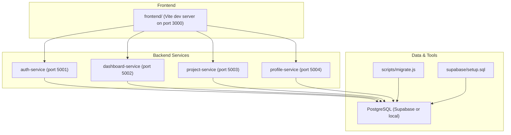
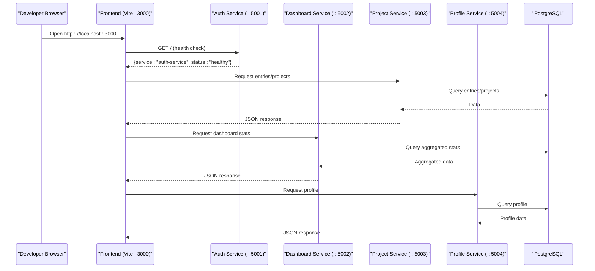
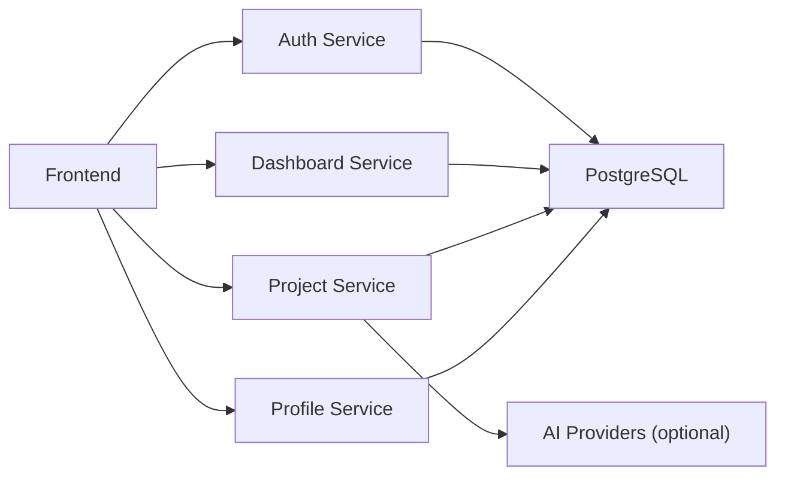

# Getting Started

<cite>
**Referenced Files in This Document**
- [README.md](file://README.md)
- [package.json](file://package.json)
- [frontend/package.json](file://frontend/package.json)
- [services/auth-service/package.json](file://services/auth-service/package.json)
- [services/dashboard-service/package.json](file://services/dashboard-service/package.json)
- [services/profile-service/package.json](file://services/profile-service/package.json)
- [services/project-service/package.json](file://services/project-service/package.json)
- [supabase/setup.sql](file://supabase/setup.sql)
- [scripts/migrate.js](file://scripts/migrate.js)
- [frontend/.env.example](file://frontend/.env.example)
- [services/auth-service/src/index.js](file://services/auth-service/src/index.js)
</cite>

## Table of Contents

1. Introduction
2. Project Structure
3. Core Components
4. Architecture Overview
5. Detailed Component Analysis
6. Dependency Analysis
7. Performance Considerations
8. Troubleshooting Guide
9. Conclusion

## Introduction

Codacaine is a microservices-based digital logbook and task management application with offline support and AI features. It provides multiple views (Today, Calendar, Kanban, Timeline), import/export, activity logs, and AI-assisted natural language parsing for entries. The frontend is a React app built with Vite, and the backend consists of four Node.js/Express microservices that share a PostgreSQL database (via Supabase or any Postgres). Authentication uses Supabase Auth, and optional AI providers power natural-language features.

Key goals for getting started:

- Install prerequisites (Node.js, Supabase account, PostgreSQL connection)
- Clone the repository and install dependencies for all services
- Configure environment variables
- Run database migrations
- Start services locally and access the app at http://localhost:3000
- Verify service connectivity and resolve common setup issues

**Section sources**

- [README.md:33-109](file://README.md#L33-L109)

## Project Structure

The repository is a monorepo containing:

- Frontend: React + Vite app under frontend/
- Backend microservices under services/:
  - auth-service (port 5001)
  - dashboard-service (port 5002)
  - project-service (port 5003)
  - profile-service (port 5004)
- Database migrations and setup under supabase/
- Migration runner and backup/restore tools under scripts/
- Root package.json exposes convenient npm scripts for DB operations

**Diagram sources**

- [README.md:45-75](file://README.md#L45-L75)
- [scripts/migrate.js:1-25](file://scripts/migrate.js#L1-L25)
- [supabase/setup.sql:1-10](file://supabase/setup.sql#L1-L10)

**Section sources**

- [README.md:45-75](file://README.md#L45-L75)
- [package.json:6-14](file://package.json#L6-L14)

## Core Components

- Frontend (React/Vite): Provides UI for Today, Calendar, Kanban, Timeline, Notes, Stats, Import/Export, Voice narration tour, and offline queueing/sync.
- Auth Service: Handles authentication endpoints and CORS configuration; integrates with Supabase Auth.
- Dashboard Service: Aggregates cross-project summaries and search capabilities.
- Project Service: Manages projects, entries, fields, notes, notifications, AI features, and OpenAPI docs.
- Profile Service: Manages user profiles, avatars, and preferences.
- Database: Shared PostgreSQL schema via migrations and setup scripts.

Prerequisites:

- Node.js (LTS) and npm
- A Supabase project (URL, anon key, JWKS URL)
- A PostgreSQL database (or Supabase’s built-in Postgres)
- Git
- Optional: AI provider API keys for natural-language features

**Section sources**

- [README.md:103-109](file://README.md#L103-L109)
- [services/auth-service/package.json:1-22](file://services/auth-service/package.json#L1-L22)
- [services/dashboard-service/package.json:1-23](file://services/dashboard-service/package.json#L1-L23)
- [services/project-service/package.json:1-34](file://services/project-service/package.json#L1-L34)
- [services/profile-service/package.json:1-23](file://services/profile-service/package.json#L1-L23)

## Architecture Overview

High-level flow during development:

- The frontend runs on localhost:3000 and calls backend microservices on ports 5001–5004.
- Each service connects to the same PostgreSQL database using DATABASE_URL.
- Migrations ensure the database schema is up-to-date before running services.

**Diagram sources**

- [services/auth-service/src/index.js:50-52](file://services/auth-service/src/index.js#L50-L52)
- [README.md:207-303](file://README.md#L207-L303)

## Detailed Component Analysis

### Prerequisites and Environment Setup

- Ensure Node.js (LTS) and npm are installed.
- Create a Supabase project and note:
  - Supabase URL
  - Anon key
  - JWKS URL (optional; auto-fetched if not set)
- Prepare a PostgreSQL connection string (DATABASE_URL) pointing to your database.

Create environment files:

- Frontend: create frontend/.env based on frontend/.env.example
- Each backend service: create services/<service>/.env with required variables

Key environment variables:

- Frontend:
  - VITE_SUPABASE_URL, VITE_SUPABASE_ANON_KEY, VITE_SUPABASE_ANON_JWT
  - VITE_AUTH_SERVICE_URL, VITE_DASHBOARD_SERVICE_URL, VITE_PROJECT_SERVICE_URL, VITE_PROFILE_SERVICE_URL
  - Optional: VITE_TURNSTILE_SITE_KEY, VITE_DEV_BYPASS
- All backend services:
  - DATABASE_URL (required)
  - PORT (defaults per service)
- Auth Service:
  - SUPABASE_URL, SUPABASE_KEY
- Project Service:
  - SUPABASE_JWKS_URL (optional)
  - AI provider keys (e.g., OPENROUTER_API_KEY, HF_API_KEY, GEMINI_API_KEY, CEREBRAS_API_KEY, GROQ_API_KEY)

**Section sources**

- [frontend/.env.example:1-19](file://frontend/.env.example#L1-L19)
- [README.md:207-303](file://README.md#L207-L303)

### Installation Steps

1. Clone the repository and navigate into it.
2. Install backend dependencies for each service:
   - services/auth-service
   - services/dashboard-service
   - services/project-service
   - services/profile-service
3. Install frontend dependencies under frontend/.
4. Configure environment variables as described above.
5. Set up the database:
   - Automated (recommended): run migrations using the migration tool
   - Manual: execute SQL files in supabase/migrations/ in order
6. Run the project:
   - Start each backend service in its own terminal
   - Start the frontend dev server
   - Access the app at http://localhost:3000

Notes:

- Use npm scripts from the root package.json for DB operations (migrate, status, bootstrap, backup, restore).
- The frontend dev server runs on port 3000 by default.

**Section sources**

- [README.md:111-205](file://README.md#L111-L205)
- [package.json:6-14](file://package.json#L6-L14)

### Running the Development Environment with Hot Reload

- Backend services:
  - Each service has a start script to run the Express server.
  - Some services include a dev script using nodemon for hot reload.
- Frontend:
  - Use the dev script to start the Vite dev server with hot module replacement.

Access points:

- Frontend: http://localhost:3000
- Auth Service health endpoint: http://localhost:5001

**Section sources**

- [services/auth-service/package.json:6-12](file://services/auth-service/package.json#L6-L12)
- [services/dashboard-service/package.json:6-12](file://services/dashboard-service/package.json#L6-L12)
- [services/profile-service/package.json:6-12](file://services/profile-service/package.json#L6-L12)
- [services/project-service/package.json:6-12](file://services/project-service/package.json#L6-L12)
- [frontend/package.json:6-14](file://frontend/package.json#L6-L14)
- [services/auth-service/src/index.js:50-52](file://services/auth-service/src/index.js#L50-L52)

### Verifying Service Connectivity

- Confirm the frontend loads at http://localhost:3000.
- Check the Auth Service health endpoint at http://localhost:5001 to verify it responds with a healthy status.
- Ensure CORS allows requests from localhost:3000 (configured in the Auth Service).

**Section sources**

- [services/auth-service/src/index.js:8-14](file://services/auth-service/src/index.js#L8-L14)
- [services/auth-service/src/index.js:50-52](file://services/auth-service/src/index.js#L50-L52)

### Database Migration Execution

Use the migration tool to apply versioned migrations idempotently:

- From the repository root, run the migrate command to apply pending migrations.
- Optionally check migration status or bootstrap existing databases.

Commands available via root package.json scripts:

- db:migrate
- db:status
- db:bootstrap
- db:backup
- db:restore

Migration tool behavior:

- Discovers .sql files under supabase/migrations/
- Ensures schema_migrations tracking table exists
- Runs each migration inside a transaction with checksums
- Supports status and bootstrap modes

**Section sources**

- [package.json:6-14](file://package.json#L6-L14)
- [scripts/migrate.js:1-25](file://scripts/migrate.js#L1-L25)
- [scripts/migrate.js:46-94](file://scripts/migrate.js#L46-L94)
- [scripts/migrate.js:101-136](file://scripts/migrate.js#L101-L136)
- [scripts/migrate.js:141-160](file://scripts/migrate.js#L141-L160)
- [scripts/migrate.js:166-196](file://scripts/migrate.js#L166-L196)
- [scripts/migrate.js:200-251](file://scripts/migrate.js#L200-L251)

### Conceptual Overview

This section summarizes the typical workflow without referencing specific code:

- Set up environment variables for frontend and backend services.
- Apply database migrations to ensure schema consistency.
- Start backend services and the frontend dev server.
- Access the application locally and verify connectivity through health checks and basic interactions.

[No sources needed since this section doesn't analyze specific files]

## Dependency Analysis

Service dependency overview:

- Frontend depends on backend microservices and Supabase.
- All backend services depend on PostgreSQL via DATABASE_URL.
- Project Service optionally depends on AI provider SDKs for natural-language features.

**Diagram sources**

- [services/project-service/package.json:18-34](file://services/project-service/package.json#L18-L34)
- [README.md:207-303](file://README.md#L207-L303)

**Section sources**

- [services/project-service/package.json:18-34](file://services/project-service/package.json#L18-L34)
- [README.md:207-303](file://README.md#L207-L303)

## Performance Considerations

- Use the database migrations tool to keep schema changes incremental and safe.
- Prefer querying only necessary fields in the frontend to reduce payload sizes.
- Leverage the dashboard service for aggregated statistics instead of heavy client-side computations.
- Enable caching strategies where appropriate (e.g., IndexedDB in the frontend) to improve offline performance.

[No sources needed since this section provides general guidance]

## Troubleshooting Guide

Common issues and resolutions:

- Missing environment variables:
  - Ensure DATABASE_URL is set for all backend services and frontend URLs are configured correctly.
  - For the frontend, verify VITE_SUPABASE_URL, VITE_SUPABASE_ANON_KEY, and service URLs.
- Connection problems:
  - Validate DATABASE_URL format and network reachability to the PostgreSQL instance.
  - Confirm CORS settings allow localhost:3000 when testing locally.
- Database migration failures:
  - Use the migration status command to identify pending or failed migrations.
  - Re-run migrations after fixing errors; the tool rolls back on failure within transactions.
  - If you ran migrations manually previously, use the bootstrap command to mark them as applied.

Verification tips:

- Check the Auth Service health endpoint to confirm it is running and reachable.
- Inspect browser console for CORS errors and adjust allowed origins if needed.
- Review migration logs for detailed error messages and fix underlying SQL issues.

**Section sources**

- [scripts/migrate.js:200-251](file://scripts/migrate.js#L200-L251)
- [services/auth-service/src/index.js:8-14](file://services/auth-service/src/index.js#L8-L14)
- [services/auth-service/src/index.js:50-52](file://services/auth-service/src/index.js#L50-L52)

## Conclusion

You now have the essentials to set up, configure, and run Codacaine locally. Follow the installation steps, configure environment variables, apply database migrations, and start the services. Access the app at http://localhost:3000 and verify connectivity using the provided health endpoints and migration tools. Refer to the troubleshooting guide for common issues and resolution strategies.

[No sources needed since this section summarizes without analyzing specific files]
