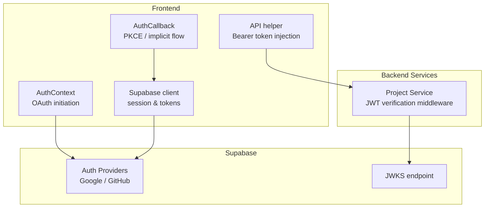
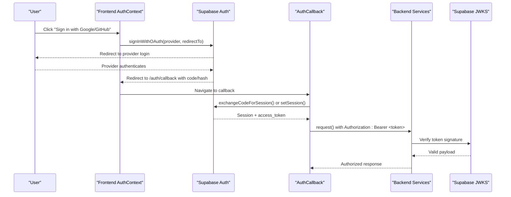
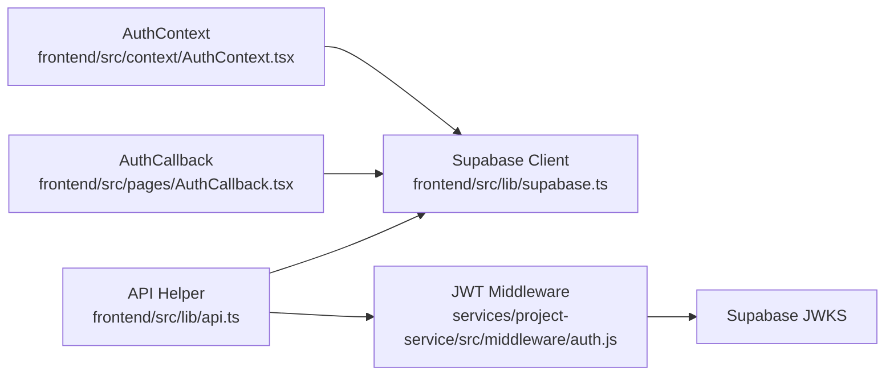

# Authentication Issues

<cite>
**Referenced Files in This Document**
- [AuthCallback.tsx](file://frontend/src/pages/AuthCallback.tsx)
- [SignIn.tsx](file://frontend/src/pages/SignIn.tsx)
- [AuthContext.tsx](file://frontend/src/context/AuthContext.tsx)
- [supabase.ts](file://frontend/src/lib/supabase.ts)
- [api.ts](file://frontend/src/lib/api.ts)
- [auth.js](file://services/project-service/src/middleware/auth.js)
- [login.js](file://frontend/src/functions/profile/login.js)
- [third-party.md](file://docs-site/docs/Architecture/third-party.md)
- [README.md](file://README.md)
</cite>

## Table of Contents

1. Introduction
2. Project Structure
3. Core Components
4. Architecture Overview
5. Detailed Component Analysis
6. Dependency Analysis
7. Performance Considerations
8. Troubleshooting Guide
9. Conclusion

## Introduction

This document provides a comprehensive guide to diagnosing and resolving authentication issues in the Codacaine application. It focuses on:

- OAuth failures with Google and GitHub (provider connection errors, callback URL misconfigurations, scope permission issues)
- Session management problems (JWT token expiration, invalid session states, concurrent session conflicts)
- Supabase Auth integration errors (missing environment variables, incorrect project URLs, anonymous key validation failures)
  It includes step-by-step diagnostic procedures, specific error messages to look for, log analysis techniques, and proven resolution steps for each scenario.

## Project Structure

Authentication spans the frontend, backend services, and Supabase:

- Frontend handles OAuth initiation, callback processing, session restoration, and API authorization headers.
- Backend services verify JWTs using Supabase’s JWKS endpoint and provision user records when needed.
- Supabase manages providers, sessions, tokens, and user lifecycle.

**Diagram sources**

- [AuthContext.tsx:82-108](file://frontend/src/context/AuthContext.tsx#L82-L108)
- [AuthCallback.tsx:49-130](file://frontend/src/pages/AuthCallback.tsx#L49-L130)
- [supabase.ts:1-31](file://frontend/src/lib/supabase.ts#L1-L31)
- [api.ts:10-57](file://frontend/src/lib/api.ts#L10-L57)
- [auth.js:1-71](file://services/project-service/src/middleware/auth.js#L1-L71)

**Section sources**

- [AuthContext.tsx:82-108](file://frontend/src/context/AuthContext.tsx#L82-L108)
- [AuthCallback.tsx:49-130](file://frontend/src/pages/AuthCallback.tsx#L49-L130)
- [supabase.ts:1-31](file://frontend/src/lib/supabase.ts#L1-L31)
- [api.ts:10-57](file://frontend/src/lib/api.ts#L10-L57)
- [auth.js:1-71](file://services/project-service/src/middleware/auth.js#L1-L71)

## Core Components

- OAuth initiation: Google and GitHub flows are triggered from the sign-in UI via Supabase OAuth methods with a configured redirect URI.
- Callback handling: The callback page processes both PKCE and implicit hash-based tokens, sets or exchanges sessions, and routes users based on profile status.
- Session state: The auth context initializes session state and listens for changes; it also clears caches and SSE connections on logout.
- API authorization: All service requests attach the current Supabase access token as a Bearer header.
- Backend JWT verification: Middleware verifies tokens against Supabase’s JWKS endpoint and ensures user provisioning.

**Section sources**

- [AuthContext.tsx:82-108](file://frontend/src/context/AuthContext.tsx#L82-L108)
- [AuthCallback.tsx:49-130](file://frontend/src/pages/AuthCallback.tsx#L49-L130)
- [api.ts:10-57](file://frontend/src/lib/api.ts#L10-L57)
- [auth.js:27-70](file://services/project-service/src/middleware/auth.js#L27-L70)

## Architecture Overview

The authentication architecture uses Supabase Auth for identity and JWT issuance. The frontend initiates OAuth flows and handles callbacks. Backend services validate tokens using Supabase’s JWKS endpoint.

**Diagram sources**

- [AuthContext.tsx:82-108](file://frontend/src/context/AuthContext.tsx#L82-L108)
- [AuthCallback.tsx:49-130](file://frontend/src/pages/AuthCallback.tsx#L49-L130)
- [api.ts:10-57](file://frontend/src/lib/api.ts#L10-L57)
- [auth.js:27-70](file://services/project-service/src/middleware/auth.js#L27-L70)

## Detailed Component Analysis

### OAuth Failures: Google and GitHub

Common failure points:

- Provider connection errors: Misconfigured provider credentials or scopes in Supabase.
- Callback URL misconfiguration: Redirect URI mismatch between Supabase and frontend configuration.
- Scope permission issues: Missing required scopes causing incomplete user data.

Symptoms and where to inspect:

- Sign-in button throws an error immediately after clicking provider buttons.
- Redirect lands on callback but shows “No authorization data found” or “Failed to complete sign in”.
- User is redirected but lacks expected profile fields.

Diagnostic steps:

1. Verify redirect URI:
   - Ensure the frontend redirects to `/auth/callback` and matches the configured callback in Supabase.
   - Confirm that `redirectTo` is set correctly in OAuth calls.
2. Check provider setup:
   - Validate Google and GitHub OAuth apps have correct client IDs/secrets and allowed redirect URIs.
   - Ensure required scopes are enabled in Supabase provider settings.
3. Inspect callback handling:
   - For PKCE: confirm `code` parameter exists and `exchangeCodeForSession` succeeds.
   - For implicit flow: confirm `access_token` and `refresh_token` are present in the URL hash and `setSession` succeeds.
4. Review logs:
   - Frontend console for OAuth errors thrown by `signInWithOAuth`.
   - Browser network tab for redirect responses and query parameters.
   - Supabase dashboard logs for provider errors.

Resolution steps:

- Fix redirect URI mismatches by aligning frontend `redirectTo` with Supabase settings.
- Update provider scopes to include necessary email and profile permissions.
- If implicit flow is used, ensure the provider supports returning tokens in the hash fragment.

**Section sources**

- [AuthContext.tsx:82-108](file://frontend/src/context/AuthContext.tsx#L82-L108)
- [AuthCallback.tsx:49-130](file://frontend/src/pages/AuthCallback.tsx#L49-L130)
- [SignIn.tsx:132-149](file://frontend/src/pages/SignIn.tsx#L132-L149)

### Session Management: JWT Expiration, Invalid States, Concurrent Conflicts

Key behaviors:

- Frontend retrieves and attaches the access token for every API call.
- Backend verifies tokens using JWKS and rejects expired or invalid tokens.
- Logout clears IndexedDB cache and disconnects SSE connections.

Symptoms:

- API returns 401 Unauthorized with missing or invalid token.
- Users are unexpectedly logged out or cannot access protected resources.
- SSE connections drop due to token expiration.

Diagnostic steps:

1. Token presence:
   - Confirm `getSupabase().auth.getSession()` returns a valid session before making API calls.
   - Check that `Authorization: Bearer <token>` is included in requests.
2. Token validity:
   - Verify backend receives a token and can decode it against JWKS.
   - Look for “Unauthorized: missing access token” or “Unauthorized: invalid access token”.
3. Session state:
   - Ensure `onAuthStateChange` updates the UI and re-fetches data when sessions change.
   - Confirm logout clears caches and SSE connections.

Resolution steps:

- Refresh tokens if expired by re-authenticating or prompting the user to sign in again.
- Ensure consistent redirect URIs so sessions persist across tabs and devices.
- Handle 401 responses by clearing stale sessions and retrying after re-login.

**Section sources**

- [api.ts:10-57](file://frontend/src/lib/api.ts#L10-L57)
- [auth.js:27-70](file://services/project-service/src/middleware/auth.js#L27-L70)
- [AuthContext.tsx:57-80](file://frontend/src/context/AuthContext.tsx#L57-L80)

### Supabase Auth Integration Errors: Environment Variables, URLs, Anonymous Key Validation

Integration points:

- Frontend creates a Supabase client using build-time environment variables.
- Client initialization validates URL format and warns if credentials are missing or invalid.
- Backend uses JWKS URL to verify tokens.

Symptoms:

- “Supabase client is not configured” errors during auth operations.
- Console warnings about missing or invalid credentials.
- Backend fails to verify tokens due to incorrect JWKS URL.

Diagnostic steps:

1. Frontend environment:
   - Ensure `VITE_SUPABASE_URL` and `VITE_SUPABASE_ANON_KEY` are set in `.env`.
   - Confirm URL starts with `https://` and key is non-empty.
2. Backend environment:
   - Set `SUPABASE_JWKS_URL` to your project’s JWKS endpoint if overriding defaults.
3. Validation:
   - Check console warnings for credential issues.
   - Verify Supabase project URL matches the one used in client creation.

Resolution steps:

- Add or correct environment variables in local `.env` files and deployment configurations.
- Use the correct Supabase project URL and anon key for your environment.
- If using custom JWKS endpoints, ensure they are reachable and valid.

**Section sources**

- [supabase.ts:1-31](file://frontend/src/lib/supabase.ts#L1-L31)
- [auth.js:19-25](file://services/project-service/src/middleware/auth.js#L19-L25)
- [README.md:207-276](file://README.md#L207-L276)

### Profile Routing and Soft-Deleted Accounts

After successful authentication, the app checks whether the user exists and whether their account is scheduled for deletion.

Behavior:

- New users are routed to profile creation.
- Existing active users go to the dashboard.
- Soft-deleted users are signed out and prompted to restore via email link.

Diagnostics:

- Inspect `checkUser` results and routing decisions.
- Monitor restore flow and polling for account restoration.

Resolutions:

- Ensure profile service is reachable and returns expected user status.
- Follow restore prompts to recover soft-deleted accounts.

**Section sources**

- [AuthCallback.tsx:10-38](file://frontend/src/pages/AuthCallback.tsx#L10-L38)
- [login.js:1-9](file://frontend/src/functions/profile/login.js#L1-L9)
- [SignIn.tsx:109-130](file://frontend/src/pages/SignIn.tsx#L109-L130)

## Dependency Analysis

Authentication dependencies:

- Frontend depends on Supabase client for OAuth and session management.
- Backend depends on JWKS endpoint for JWT verification.
- API layer depends on current session to inject tokens into requests.

**Diagram sources**

- [supabase.ts:1-31](file://frontend/src/lib/supabase.ts#L1-L31)
- [AuthContext.tsx:57-108](file://frontend/src/context/AuthContext.tsx#L57-L108)
- [AuthCallback.tsx:49-130](file://frontend/src/pages/AuthCallback.tsx#L49-L130)
- [api.ts:10-57](file://frontend/src/lib/api.ts#L10-L57)
- [auth.js:19-70](file://services/project-service/src/middleware/auth.js#L19-L70)

**Section sources**

- [third-party.md:470-482](file://docs-site/docs/Architecture/third-party.md#L470-L482)
- [auth.js:19-70](file://services/project-service/src/middleware/auth.js#L19-L70)

## Performance Considerations

- Token refresh and session persistence reduce repeated logins and improve perceived performance.
- JWKS caching minimizes network overhead for token verification.
- Logging API requests helps identify slow endpoints and timeouts.

[No sources needed since this section provides general guidance]

## Troubleshooting Guide

### OAuth Flow Diagnostics

- Symptoms:
  - Immediate error when clicking Google/GitHub buttons.
  - Redirect to callback without tokens or code.
  - Error “Failed to complete sign in” or “No authorization data found in the URL.”
- Logs to check:
  - Frontend console for OAuth errors.
  - Network tab for redirect responses and query parameters.
  - Supabase dashboard logs for provider errors.
- Resolution:
  - Align redirect URI with Supabase settings.
  - Configure provider scopes and secrets correctly.
  - Ensure callback handles both PKCE and implicit flows.

**Section sources**

- [AuthContext.tsx:82-108](file://frontend/src/context/AuthContext.tsx#L82-L108)
- [AuthCallback.tsx:49-130](file://frontend/src/pages/AuthCallback.tsx#L49-L130)
- [SignIn.tsx:132-149](file://frontend/src/pages/SignIn.tsx#L132-L149)

### Session and JWT Diagnostics

- Symptoms:
  - 401 Unauthorized responses.
  - Unexpected logout or inability to access protected resources.
  - SSE disconnections due to expired tokens.
- Logs to check:
  - Frontend API logs showing Bearer token presence.
  - Backend middleware logs for token verification failures.
- Resolution:
  - Re-authenticate to obtain a fresh token.
  - Ensure consistent redirect URIs and session persistence.
  - Handle 401 by clearing stale sessions and retrying after re-login.

**Section sources**

- [api.ts:10-57](file://frontend/src/lib/api.ts#L10-L57)
- [auth.js:27-70](file://services/project-service/src/middleware/auth.js#L27-L70)

### Supabase Configuration Diagnostics

- Symptoms:
  - “Supabase client is not configured” errors.
  - Console warnings about missing or invalid credentials.
  - Backend token verification failures due to wrong JWKS URL.
- Logs to check:
  - Console warnings during client initialization.
  - Backend logs for JWKS fetch and verification errors.
- Resolution:
  - Set `VITE_SUPABASE_URL` and `VITE_SUPABASE_ANON_KEY` in frontend `.env`.
  - Set `SUPABASE_JWKS_URL` in backend `.env` if overriding default.
  - Validate URLs and keys match your Supabase project.

**Section sources**

- [supabase.ts:1-31](file://frontend/src/lib/supabase.ts#L1-L31)
- [auth.js:19-25](file://services/project-service/src/middleware/auth.js#L19-L25)
- [README.md:207-276](file://README.md#L207-L276)

### Profile and Restore Flow Diagnostics

- Symptoms:
  - New users not routed to profile creation.
  - Soft-deleted users not prompted to restore.
- Logs to check:
  - Profile service responses for user existence and deletion status.
  - Restore prompt behavior and polling.
- Resolution:
  - Ensure profile service is reachable and returns expected data.
  - Follow restore prompts to recover soft-deleted accounts.

**Section sources**

- [AuthCallback.tsx:10-38](file://frontend/src/pages/AuthCallback.tsx#L10-L38)
- [login.js:1-9](file://frontend/src/functions/profile/login.js#L1-L9)
- [SignIn.tsx:109-130](file://frontend/src/pages/SignIn.tsx#L109-L130)

## Conclusion

Authentication issues in Codacaine typically stem from OAuth configuration mismatches, session state inconsistencies, or Supabase environment misconfiguration. By validating redirect URIs, ensuring proper token handling in callbacks, verifying JWTs against JWKS, and setting correct environment variables, most problems can be resolved quickly. Use the diagnostic steps and logs outlined above to pinpoint issues and apply targeted fixes.
