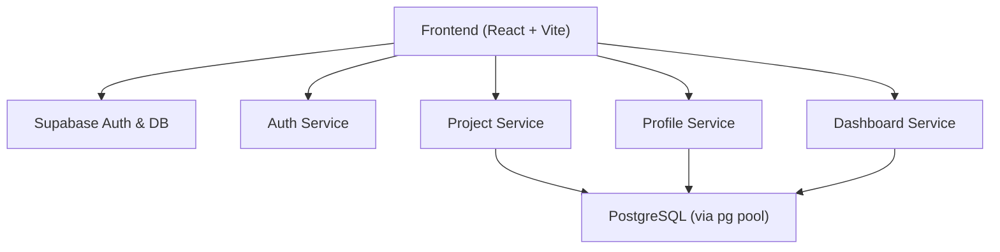
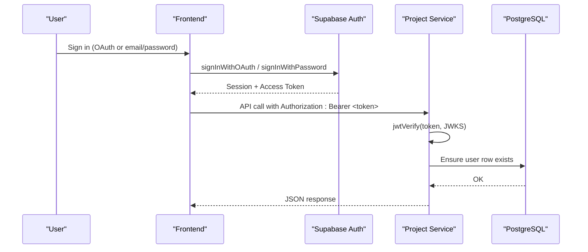
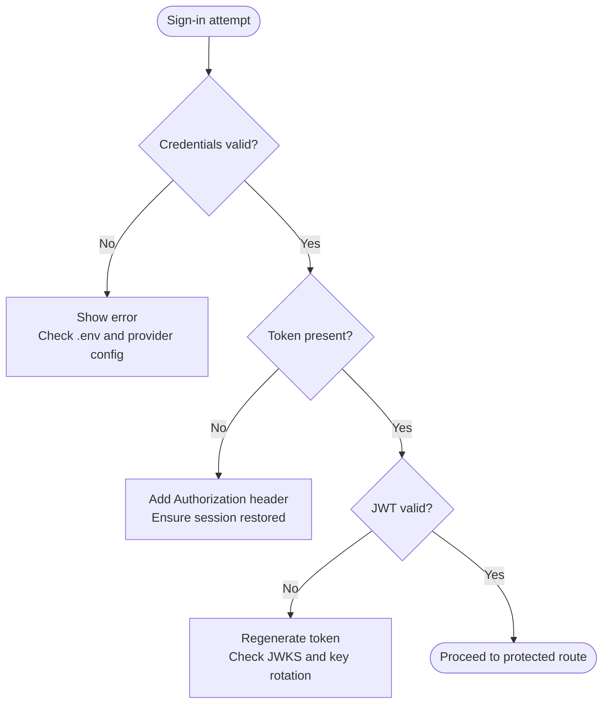
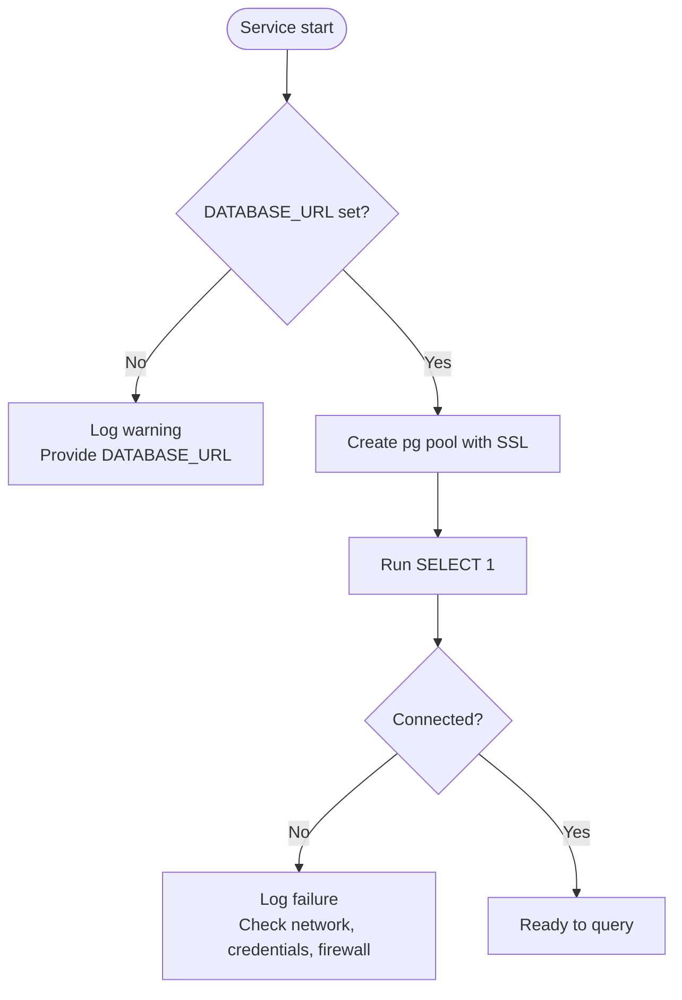
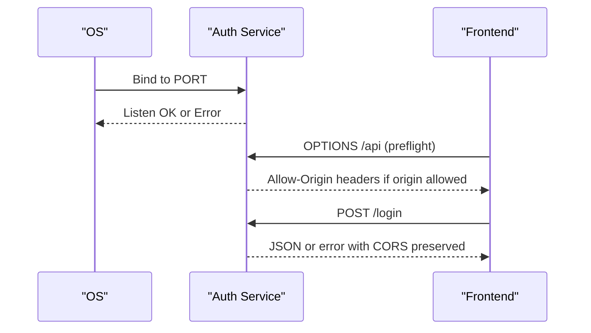
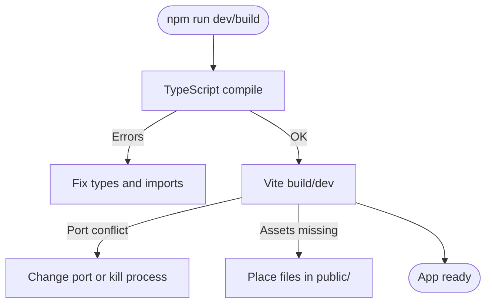
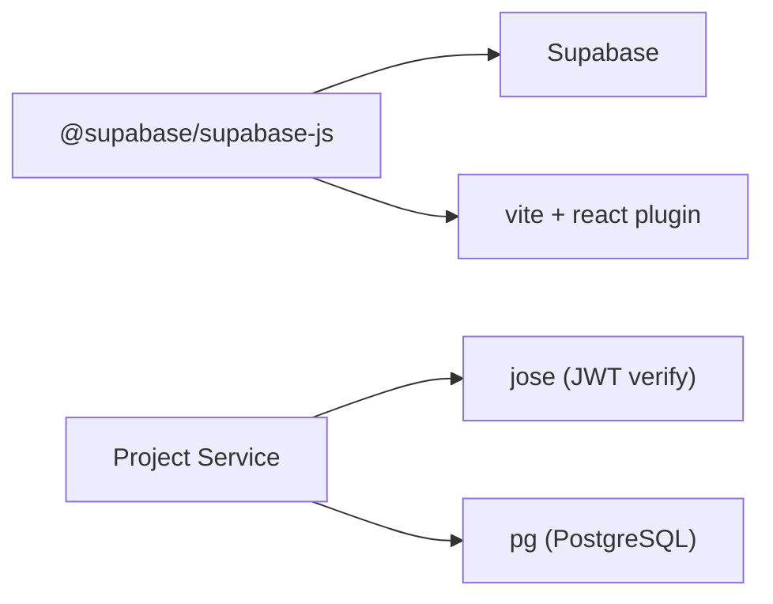

# Common Issues and Solutions

<cite>
**Referenced Files in This Document**
- [services/auth-service/src/index.js](file://services/auth-service/src/index.js)
- [services/project-service/src/middleware/auth.js](file://services/project-service/src/middleware/auth.js)
- [services/project-service/src/db.js](file://services/project-service/src/db.js)
- [services/profile-service/src/db.js](file://services/profile-service/src/db.js)
- [services/dashboard-service/src/db.js](file://services/dashboard-service/src/db.js)
- [frontend/src/lib/supabase.ts](file://frontend/src/lib/supabase.ts)
- [frontend/src/context/AuthContext.tsx](file://frontend/src/context/AuthContext.tsx)
- [frontend/src/pages/SignIn.tsx](file://frontend/src/pages/SignIn.tsx)
- [frontend/vite.config.ts](file://frontend/vite.config.ts)
- [frontend/package.json](file://frontend/package.json)
- [supabase/migrations/000_baseline_full_schema.sql](file://supabase/migrations/000_baseline_full_schema.sql)
- [README.md](file://README.md)
</cite>

## Table of Contents

1. Introduction
2. Project Structure
3. Core Components
4. Architecture Overview
5. Detailed Component Analysis
6. Dependency Analysis
7. Performance Considerations
8. Troubleshooting Guide
9. Conclusion

## Introduction

This document provides a practical, step-by-step guide to diagnosing and resolving common issues in the Codacaine application. It focuses on:

- Authentication problems (OAuth failures, session management, JWT validation errors)
- Database connection errors (PostgreSQL timeouts, migration failures, schema mismatches)
- Service startup failures (port conflicts, missing environment variables, dependency resolution)
- Frontend build problems (Vite configuration errors, TypeScript compilation issues, asset loading failures)

Each section includes likely error messages, log analysis techniques, and proven resolution steps grounded in the codebase.

## Project Structure

Codacaine is a multi-service application with:

- A React frontend built with Vite and TypeScript
- Backend microservices (auth, profile, dashboard, project) that share a PostgreSQL database via Supabase
- Supabase for authentication and database migrations

**Diagram sources**

- [frontend/vite.config.ts:5-15](file://frontend/vite.config.ts#L5-L15)
- [services/auth-service/src/index.js:5-77](file://services/auth-service/src/index.js#L5-L77)
- [services/project-service/src/db.js:1-32](file://services/project-service/src/db.js#L1-L32)
- [services/profile-service/src/db.js:1-32](file://services/profile-service/src/db.js#L1-L32)
- [services/dashboard-service/src/db.js:1-32](file://services/dashboard-service/src/db.js#L1-L32)

**Section sources**

- [frontend/vite.config.ts:5-15](file://frontend/vite.config.ts#L5-L15)
- [README.md:207-240](file://README.md#L207-L240)

## Core Components

- Authentication flow: Frontend uses Supabase client; services validate JWTs using Supabase JWKS.
- Database access: Services use a PostgreSQL connection pool with SSL enabled for Supabase-hosted databases.
- Environment configuration: dotenv loads .env per service; frontend reads VITE_* env at build time.

Key responsibilities:

- Frontend AuthContext manages sessions and OAuth redirects.
- Project service middleware verifies tokens and ensures user provisioning.
- All services initialize a pg pool and verify connectivity on startup.

**Section sources**

- [frontend/src/context/AuthContext.tsx:38-80](file://frontend/src/context/AuthContext.tsx#L38-L80)
- [services/project-service/src/middleware/auth.js:19-70](file://services/project-service/src/middleware/auth.js#L19-L70)
- [services/project-service/src/db.js:1-32](file://services/project-service/src/db.js#L1-L32)
- [services/profile-service/src/db.js:1-32](file://services/profile-service/src/db.js#L1-L32)
- [services/dashboard-service/src/db.js:1-32](file://services/dashboard-service/src/db.js#L1-L32)

## Architecture Overview

The authentication and data flow spans the frontend, Supabase, and backend services.

**Diagram sources**

- [frontend/src/context/AuthContext.tsx:82-108](file://frontend/src/context/AuthContext.tsx#L82-L108)
- [services/project-service/src/middleware/auth.js:19-70](file://services/project-service/src/middleware/auth.js#L19-L70)
- [services/project-service/src/db.js:1-32](file://services/project-service/src/db.js#L1-L32)

## Detailed Component Analysis

### Authentication Problems

Symptoms:

- OAuth redirect loops or “invalid redirect_uri”
- “Unauthorized: missing access token” or “Unauthorized: invalid access token”
- Session not restored after refresh

Likely causes:

- Missing or incorrect Supabase credentials in frontend
- Incorrect OAuth redirect URL configured in Supabase
- Expired or malformed JWT
- CORS blocking browser requests

Diagnostics:

- Verify frontend Supabase client initialization and environment variables.
- Check browser network tab for 401 responses and missing Authorization header.
- Inspect service logs for JWT verification errors.

Resolutions:

- Set VITE_SUPABASE_URL and VITE_SUPABASE_ANON_KEY in frontend .env.
- Configure correct OAuth redirect URLs in Supabase dashboard.
- Ensure services read DATABASE_URL and other required env vars.
- Confirm CORS allows your origin in the auth service.

**Diagram sources**

- [frontend/src/lib/supabase.ts:1-34](file://frontend/src/lib/supabase.ts#L1-L34)
- [services/project-service/src/middleware/auth.js:19-70](file://services/project-service/src/middleware/auth.js#L19-L70)
- [services/auth-service/src/index.js:17-33](file://services/auth-service/src/index.js#L17-L33)

**Section sources**

- [frontend/src/lib/supabase.ts:1-34](file://frontend/src/lib/supabase.ts#L1-L34)
- [frontend/src/context/AuthContext.tsx:38-108](file://frontend/src/context/AuthContext.tsx#L38-L108)
- [services/project-service/src/middleware/auth.js:19-70](file://services/project-service/src/middleware/auth.js#L19-L70)
- [services/auth-service/src/index.js:17-33](file://services/auth-service/src/index.js#L17-L33)
- [README.md:207-240](file://README.md#L207-L240)

### Database Connection Errors

Symptoms:

- “PostgreSQL pool connection failed”
- Timeouts when querying tables
- Migration errors due to missing columns or constraints

Likely causes:

- Missing or invalid DATABASE_URL
- Network/firewall preventing connections to Supabase
- Schema drift between migrations and running code

Diagnostics:

- Check service logs for pool creation and connection attempts.
- Validate DATABASE_URL format and SSL settings.
- Run baseline migration to ensure schema consistency.

Resolutions:

- Provide a valid DATABASE_URL in each service’s .env.
- Ensure SSL is enabled for Supabase connections.
- Apply baseline migration to align schema across environments.

**Diagram sources**

- [services/project-service/src/db.js:5-29](file://services/project-service/src/db.js#L5-L29)
- [services/profile-service/src/db.js:5-29](file://services/profile-service/src/db.js#L5-L29)
- [services/dashboard-service/src/db.js:5-29](file://services/dashboard-service/src/db.js#L5-L29)

**Section sources**

- [services/project-service/src/db.js:1-32](file://services/project-service/src/db.js#L1-L32)
- [services/profile-service/src/db.js:1-32](file://services/profile-service/src/db.js#L1-L32)
- [services/dashboard-service/src/db.js:1-32](file://services/dashboard-service/src/db.js#L1-L32)
- [supabase/migrations/000_baseline_full_schema.sql:1-318](file://supabase/migrations/000_baseline_full_schema.sql#L1-L318)

### Service Startup Failures

Symptoms:

- Port already in use
- Service starts but cannot connect to DB
- CORS errors from browser

Likely causes:

- PORT conflict or misconfiguration
- Missing environment variables
- CORS policy blocking cross-origin requests

Diagnostics:

- Inspect service logs for port binding and error handler output.
- Validate environment variables per service.
- Test preflight requests and allowed origins.

Resolutions:

- Change PORT or stop conflicting processes.
- Add required environment variables (e.g., DATABASE_URL, SUPABASE_*).
- Update allowedOrigins to include your frontend URL.

**Diagram sources**

- [services/auth-service/src/index.js:5-77](file://services/auth-service/src/index.js#L5-L77)

**Section sources**

- [services/auth-service/src/index.js:5-77](file://services/auth-service/src/index.js#L5-L77)
- [README.md:207-240](file://README.md#L207-L240)

### Frontend Build Problems

Symptoms:

- TypeScript compilation errors during build
- Vite dev server fails to start or serves wrong port
- Assets fail to load (videos, images)

Likely causes:

- TypeScript version mismatch or strict type errors
- Vite config port conflict or alias misconfiguration
- Static assets not placed under public directory

Diagnostics:

- Run the build script and inspect compiler output.
- Check Vite server port and resolve aliases.
- Verify asset paths and availability in the public folder.

Resolutions:

- Align TypeScript versions and fix type errors reported by tsc.
- Adjust Vite server port or free the port.
- Move static files to the public directory and reference them correctly.

**Diagram sources**

- [frontend/package.json:6-14](file://frontend/package.json#L6-L14)
- [frontend/vite.config.ts:5-15](file://frontend/vite.config.ts#L5-L15)

**Section sources**

- [frontend/package.json:6-14](file://frontend/package.json#L6-L14)
- [frontend/vite.config.ts:5-15](file://frontend/vite.config.ts#L5-L15)

## Dependency Analysis

Key runtime dependencies and their roles:

- @supabase/supabase-js: Frontend client for auth and DB operations
- jose: Backend JWT verification against Supabase JWKS
- pg: PostgreSQL client used by services
- vite + react plugin: Frontend build tooling

**Diagram sources**

- [frontend/package.json:16-43](file://frontend/package.json#L16-L43)
- [services/project-service/src/middleware/auth.js:1-26](file://services/project-service/src/middleware/auth.js#L1-L26)
- [services/project-service/src/db.js:1-3](file://services/project-service/src/db.js#L1-L3)

**Section sources**

- [frontend/package.json:16-43](file://frontend/package.json#L16-L43)
- [services/project-service/src/middleware/auth.js:1-26](file://services/project-service/src/middleware/auth.js#L1-L26)
- [services/project-service/src/db.js:1-3](file://services/project-service/src/db.js#L1-L3)

## Performance Considerations

- Use connection pooling for PostgreSQL to reduce latency and handle concurrent queries efficiently.
- Cache JWKS keys where supported by the library to minimize network calls during JWT verification.
- Minimize unnecessary re-renders in the frontend by leveraging context state and memoization.
- Keep environment variables minimal and validated early to avoid runtime surprises.

[No sources needed since this section provides general guidance]

## Troubleshooting Guide

### Authentication

- OAuth failures
  - Symptoms: Redirect loops, provider errors, or sign-in does nothing.
  - Logs: Browser console errors from Supabase client; check redirect URL matches Supabase dashboard.
  - Steps:
    - Ensure VITE_SUPABASE_URL and VITE_SUPABASE_ANON_KEY are set.
    - Verify OAuth providers are enabled and redirect URIs match your app domain.
    - Confirm CORS allows your frontend origin.

- Session management issues
  - Symptoms: User logged out unexpectedly or session not restored on reload.
  - Logs: Auth state changes in browser console; check session retrieval.
  - Steps:
    - Confirm Supabase client initializes and getSession runs.
    - Clear stale cache if necessary and retry sign-in.

- JWT token validation errors
  - Symptoms: 401 Unauthorized on protected endpoints.
  - Logs: “Token verification failed” in service logs.
  - Steps:
    - Ensure Authorization header contains a valid Bearer token.
    - Verify SUPABASE_JWKS_URL resolves and keys are current.
    - Re-authenticate to obtain a fresh token.

**Section sources**

- [frontend/src/context/AuthContext.tsx:38-108](file://frontend/src/context/AuthContext.tsx#L38-L108)
- [services/project-service/src/middleware/auth.js:19-70](file://services/project-service/src/middleware/auth.js#L19-L70)
- [frontend/src/lib/supabase.ts:1-34](file://frontend/src/lib/supabase.ts#L1-L34)

### Database

- PostgreSQL connection timeouts
  - Symptoms: “PostgreSQL pool connection failed” or slow queries.
  - Logs: Pool creation and SELECT 1 results.
  - Steps:
    - Validate DATABASE_URL and network reachability to Supabase.
    - Ensure SSL is enabled for Supabase connections.
    - Retry with backoff or increase timeout if needed.

- Migration failures
  - Symptoms: Errors about missing tables/columns or constraints.
  - Logs: Migration runner output.
  - Steps:
    - Apply baseline migration to align schema.
    - Review migration order and idempotency guards.

- Schema mismatch problems
  - Symptoms: Queries fail due to unexpected column types or missing fields.
  - Logs: Query errors referencing specific columns.
  - Steps:
    - Compare running schema with migrations.
    - Apply pending migrations and restart services.

**Section sources**

- [services/project-service/src/db.js:1-32](file://services/project-service/src/db.js#L1-L32)
- [services/profile-service/src/db.js:1-32](file://services/profile-service/src/db.js#L1-L32)
- [services/dashboard-service/src/db.js:1-32](file://services/dashboard-service/src/db.js#L1-L32)
- [supabase/migrations/000_baseline_full_schema.sql:1-318](file://supabase/migrations/000_baseline_full_schema.sql#L1-L318)

### Service Startup

- Port conflicts
  - Symptoms: “Address already in use” or dev server fails to bind.
  - Logs: Binding errors.
  - Steps:
    - Change PORT in service or frontend config.
    - Kill the process occupying the port.

- Missing environment variables
  - Symptoms: Services start but fail on first request or DB call.
  - Logs: Warnings about missing DATABASE_URL or Supabase keys.
  - Steps:
    - Populate .env files per README instructions.
    - Restart services after adding variables.

- Dependency resolution issues
  - Symptoms: Module not found or import errors.
  - Logs: Node module resolution errors.
  - Steps:
    - Reinstall dependencies and lock versions.
    - Ensure correct package manager and Node version.

**Section sources**

- [services/auth-service/src/index.js:5-77](file://services/auth-service/src/index.js#L5-L77)
- [README.md:207-240](file://README.md#L207-L240)

### Frontend Build

- Vite configuration errors
  - Symptoms: Dev server fails to start or routes break.
  - Logs: Vite warnings/errors.
  - Steps:
    - Validate plugins and aliases in vite.config.ts.
    - Ensure port is available.

- TypeScript compilation issues
  - Symptoms: Build fails with type errors.
  - Logs: tsc output.
  - Steps:
    - Fix reported type errors and import paths.
    - Align TypeScript version with project expectations.

- Asset loading failures
  - Symptoms: 404 for videos/images.
  - Logs: Network 404s.
  - Steps:
    - Place assets under public/.
    - Reference assets with absolute paths from root.

**Section sources**

- [frontend/vite.config.ts:5-15](file://frontend/vite.config.ts#L5-L15)
- [frontend/package.json:6-14](file://frontend/package.json#L6-L14)

## Conclusion

By validating environment variables, ensuring correct OAuth configuration, verifying JWT flows, and keeping the database schema aligned with migrations, most operational issues can be resolved quickly. Use the provided diagnostic steps and logs to pinpoint failures in authentication, database connectivity, service startup, and frontend builds.

[No sources needed since this section summarizes without analyzing specific files]
