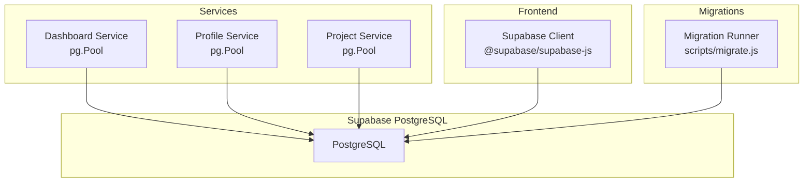
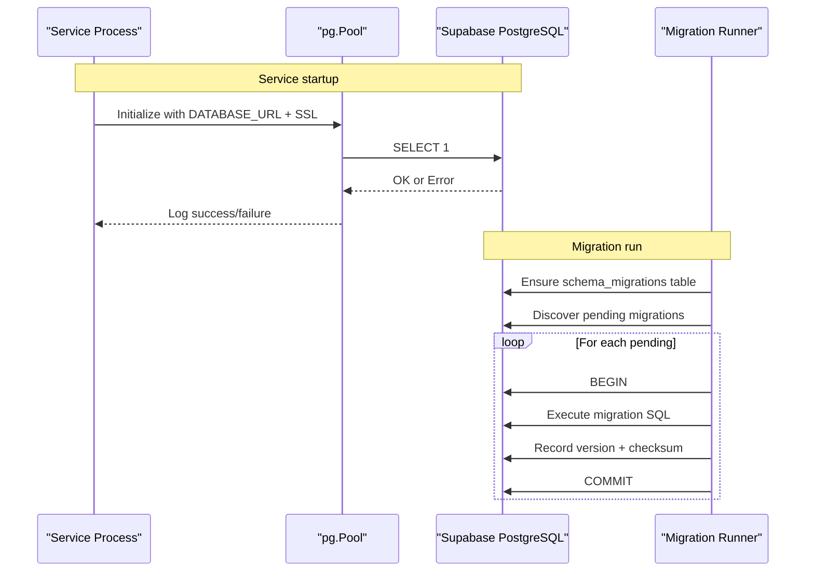
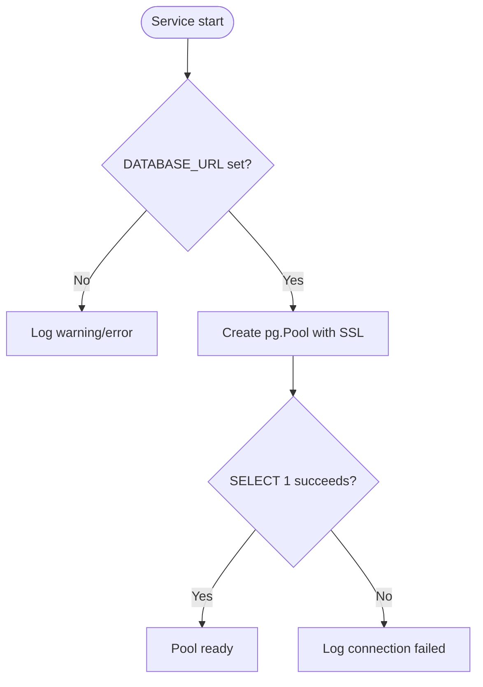
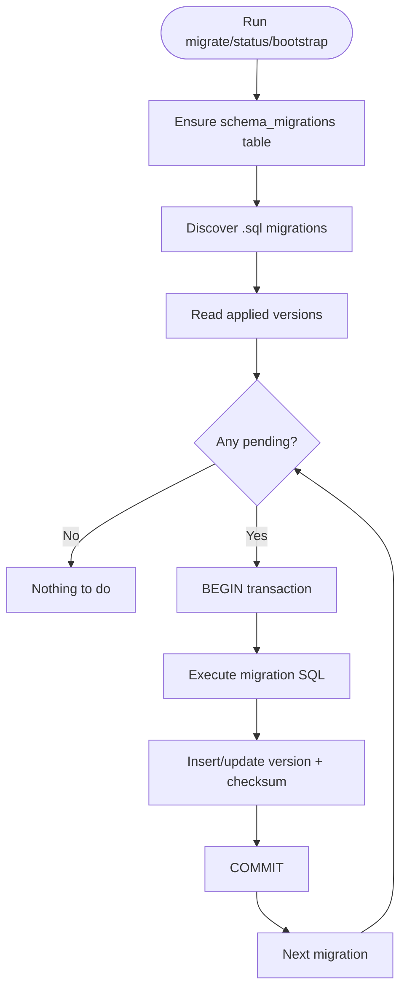
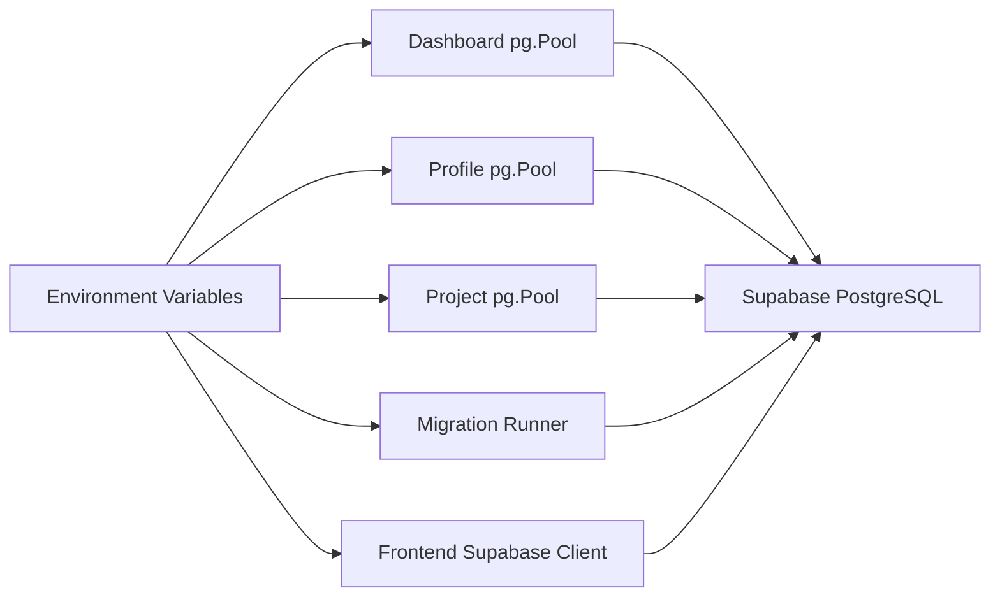

# Database Connection Issues

<cite>
**Referenced Files in This Document**
- [db.js](file://services/dashboard-service/src/db.js)
- [db.js](file://services/profile-service/src/db.js)
- [db.js](file://services/project-service/src/db.js)
- [migrate.js](file://scripts/migrate.js)
- [supabase.ts](file://frontend/src/lib/supabase.ts)
- [database.md](file://docs-site/docs/Architecture/database.md)
- [daemon.js](file://services/dashboard-service/src/functions/daemon.js)
- [000_baseline_full_schema.sql](file://supabase/migrations/000_baseline_full_schema.sql)
</cite>

## Table of Contents

1. [Introduction](#introduction)
2. [Project Structure](#project-structure)
3. [Core Components](#core-components)
4. [Architecture Overview](#architecture-overview)
5. [Detailed Component Analysis](#detailed-component-analysis)
6. [Dependency Analysis](#dependency-analysis)
7. [Performance Considerations](#performance-considerations)
8. [Troubleshooting Guide](#troubleshooting-guide)
9. [Conclusion](#conclusion)

## Introduction

This document explains database connection and migration issues in the Codacaine application, focusing on PostgreSQL connectivity to Supabase, authentication failures, network problems, and migration-related errors such as version conflicts, schema mismatches, and rollback behavior. It also covers Supabase-specific configuration (connection string format, SSL settings), and provides diagnostic tools and commands for testing connectivity, analyzing performance, and resolving connection pool exhaustion scenarios.

## Project Structure

The application uses a Node.js backend with multiple services that each maintain their own PostgreSQL connection pool via pg.Pool. A shared migration runner executes versioned SQL migrations stored under supabase/migrations. The frontend connects to Supabase using environment variables and validates credentials before creating a client.

**Diagram sources**

- [db.js:1-32](file://services/dashboard-service/src/db.js#L1-L32)
- [db.js:1-32](file://services/profile-service/src/db.js#L1-L32)
- [db.js:1-32](file://services/project-service/src/db.js#L1-L32)
- [migrate.js:1-251](file://scripts/migrate.js#L1-L251)
- [supabase.ts:1-34](file://frontend/src/lib/supabase.ts#L1-L34)

**Section sources**

- [database.md:449-452](file://docs-site/docs/Architecture/database.md#L449-L452)

## Core Components

- PostgreSQL connection pools per service: Each service initializes a pg.Pool from DATABASE_URL with SSL configured for Supabase. On startup, a SELECT 1 verifies connectivity and logs success or failure.
- Migration runner: Discovers .sql files in supabase/migrations, tracks applied versions in public.schema_migrations, runs pending migrations inside transactions, and supports status and bootstrap commands.
- Frontend Supabase client: Reads VITE_SUPABASE_URL and VITE_SUPABASE_ANON_KEY, validates URL format, creates a client, and throws if not configured.

Key behaviors:

- Missing DATABASE_URL triggers warnings/errors at startup.
- SSL is enabled with rejectUnauthorized disabled to accommodate Supabase free-tier certificates.
- Startup verification uses a lightweight query to confirm pool health.

**Section sources**

- [db.js:1-32](file://services/dashboard-service/src/db.js#L1-L32)
- [db.js:1-32](file://services/profile-service/src/db.js#L1-L32)
- [db.js:1-32](file://services/project-service/src/db.js#L1-L32)
- [migrate.js:1-251](file://scripts/migrate.js#L1-L251)
- [supabase.ts:1-34](file://frontend/src/lib/supabase.ts#L1-L34)
- [database.md:449-452](file://docs-site/docs/Architecture/database.md#L449-L452)

## Architecture Overview

The runtime flow for database access and migrations is as follows:

**Diagram sources**

- [db.js:1-32](file://services/dashboard-service/src/db.js#L1-L32)
- [migrate.js:1-251](file://scripts/migrate.js#L1-L251)

## Detailed Component Analysis

### PostgreSQL Connection Pools (per service)

- Initialization: Creates pg.Pool from DATABASE_URL with ssl.rejectUnauthorized set to false for Supabase compatibility.
- Startup check: Executes SELECT 1; logs success or failure. If DATABASE_URL is missing, warns or errors depending on service.
- Implications: Misconfigured DATABASE_URL or SSL will surface as startup errors or failed queries.

Common symptoms:

- “Missing DATABASE_URL” warning or critical error at startup.
- “PostgreSQL pool connection failed” during startup verification.
- Intermittent query failures due to network blips or auth token expiry.

**Diagram sources**

- [db.js:1-32](file://services/dashboard-service/src/db.js#L1-L32)
- [db.js:1-32](file://services/profile-service/src/db.js#L1-L32)
- [db.js:1-32](file://services/project-service/src/db.js#L1-L32)

**Section sources**

- [db.js:1-32](file://services/dashboard-service/src/db.js#L1-L32)
- [db.js:1-32](file://services/profile-service/src/db.js#L1-L32)
- [db.js:1-32](file://services/project-service/src/db.js#L1-L32)
- [database.md:449-452](file://docs-site/docs/Architecture/database.md#L449-L452)

### Migration Runner

- Discovery: Scans supabase/migrations for .sql files and sorts by filename prefix.
- Tracking: Ensures public.schema_migrations exists with version, applied_at, and checksum columns.
- Execution: Runs each pending migration in a transaction; records version and checksum; rolls back on failure.
- Commands: migrate (apply pending), status (list applied/pending), bootstrap (mark existing migrations as applied without running).

Failure modes:

- Version conflicts: Duplicate versions or mismatched checksums can cause updates to schema_migrations but not re-run migrations.
- Schema mismatches: Non-idempotent SQL may fail mid-migration; the transaction rolls back to keep the database consistent.
- Rollbacks: Failed migrations are rolled back automatically; fix the SQL and re-run.

**Diagram sources**

- [migrate.js:1-251](file://scripts/migrate.js#L1-L251)

**Section sources**

- [migrate.js:1-251](file://scripts/migrate.js#L1-L251)

### Frontend Supabase Client

- Configuration: Reads VITE_SUPABASE_URL and VITE_SUPABASE_ANON_KEY from environment.
- Validation: Ensures URL matches expected pattern; otherwise warns and does not create client.
- Usage: getSupabase() returns the client or throws if not configured.

Common issues:

- Missing or invalid environment variables prevent client creation.
- Incorrect URL format leads to validation failure.

**Section sources**

- [supabase.ts:1-34](file://frontend/src/lib/supabase.ts#L1-L34)

### Keep-Alive Daemon (Supabase Inactivity)

- Purpose: Prevents Supabase free-tier projects from pausing by periodically inserting and deleting a row in public.health_ping.
- Behavior: Ensures table exists, inserts message, deletes immediately, logs result. Configurable interval via PING_INTERVAL_MS.

Relevance to connectivity:

- If the daemon fails to ping, it indicates connectivity or permission issues to the database.

**Section sources**

- [daemon.js:1-135](file://services/dashboard-service/src/functions/daemon.js#L1-L135)
- [000_baseline_full_schema.sql:140-150](file://supabase/migrations/000_baseline_full_schema.sql#L140-L150)

## Dependency Analysis

- Services depend on pg.Pool and DATABASE_URL environment variable.
- Migrations depend on the same DATABASE_URL and write to public.schema_migrations.
- Frontend depends on Supabase client library and environment variables for URL and anon key.
- Documentation clarifies SSL requirements and pooling strategy for Supabase.

**Diagram sources**

- [db.js:1-32](file://services/dashboard-service/src/db.js#L1-L32)
- [db.js:1-32](file://services/profile-service/src/db.js#L1-L32)
- [db.js:1-32](file://services/project-service/src/db.js#L1-L32)
- [migrate.js:1-251](file://scripts/migrate.js#L1-L251)
- [supabase.ts:1-34](file://frontend/src/lib/supabase.ts#L1-L34)

**Section sources**

- [database.md:449-452](file://docs-site/docs/Architecture/database.md#L449-L452)

## Performance Considerations

- Connection pooling: Each service uses pg.Pool to manage concurrent connections, reducing overhead and preventing connection exhaustion against Supabase’s limits.
- Startup verification: A lightweight SELECT 1 ensures early detection of connectivity issues without impacting performance.
- Migration transactions: Running migrations within transactions avoids partial schema changes and simplifies rollbacks.

[No sources needed since this section provides general guidance]

## Troubleshooting Guide

### Diagnosing PostgreSQL Connectivity

- Verify DATABASE_URL is set in the environment for each service and scripts.
- Check startup logs for “PostgreSQL pool connected successfully” or “PostgreSQL pool connection failed”.
- Use the migration runner to test connectivity:
  - Run status to list applied and pending migrations.
  - Run migrate to apply pending migrations; failures indicate connectivity or SQL issues.
- Confirm SSL configuration aligns with Supabase requirements.

Commands and locations:

- Migration runner: node scripts/migrate.js [migrate|status|bootstrap]
- Environment loading: The script loads .env from working directory and project paths.

**Section sources**

- [migrate.js:200-251](file://scripts/migrate.js#L200-L251)
- [db.js:1-32](file://services/dashboard-service/src/db.js#L1-L32)
- [database.md:449-452](file://docs-site/docs/Architecture/database.md#L449-L452)

### Resolving Authentication Failures

- Ensure DATABASE_URL contains correct host, port, database name, user, and password.
- Validate that the user has permissions to execute migrations and read/write required tables.
- If using Supabase, confirm the connection string is the direct PostgreSQL URL from the dashboard.

**Section sources**

- [database.md:449-452](file://docs-site/docs/Architecture/database.md#L449-L452)

### Network Connectivity Problems

- Symptoms: Startup verification fails, intermittent query errors, or daemon pings failing.
- Actions:
  - Re-run migrations to validate connectivity.
  - Inspect logs for connection refused or timeout messages.
  - Confirm firewall or proxy settings allow outbound connections to Supabase.

**Section sources**

- [db.js:1-32](file://services/dashboard-service/src/db.js#L1-L32)
- [daemon.js:41-71](file://services/dashboard-service/src/functions/daemon.js#L41-L71)

### Migration Version Conflicts and Schema Mismatches

- Version conflicts:
  - The runner records version and checksum; duplicate versions update checksums but do not re-run.
  - If checksums differ unexpectedly, review migration history and ensure idempotency.
- Schema mismatches:
  - Non-idempotent SQL can cause failures; the transaction rolls back to avoid partial changes.
  - Fix the SQL and re-run migrate to apply the corrected migration.
- Rollbacks:
  - Failed migrations are rolled back automatically; no manual rollback is needed.

**Section sources**

- [migrate.js:46-94](file://scripts/migrate.js#L46-L94)
- [migrate.js:101-136](file://scripts/migrate.js#L101-L136)

### Supabase-Specific Issues

- Connection string formatting:
  - Use the direct PostgreSQL URL provided by Supabase dashboard (includes host, port, database, user, password).
- SSL configuration:
  - SSL is enforced; rejectUnauthorized is set to false to handle self-signed certificates on free tier.
- Rate limiting:
  - Connection pooling helps mitigate rate limits by reusing connections; monitor usage and adjust pool size if necessary.

**Section sources**

- [database.md:449-452](file://docs-site/docs/Architecture/database.md#L449-L452)
- [db.js:1-32](file://services/dashboard-service/src/db.js#L1-L32)

### Frontend Supabase Client Issues

- Missing or invalid environment variables:
  - Ensure VITE_SUPABASE_URL and VITE_SUPABASE_ANON_KEY are set.
  - URL must match expected pattern; otherwise client creation is skipped with a warning.
- Accessing client:
  - getSupabase() throws if client is not configured; handle errors appropriately in UI code.

**Section sources**

- [supabase.ts:1-34](file://frontend/src/lib/supabase.ts#L1-L34)

### Connection Pool Exhaustion

- Symptoms:
  - Queries hang or fail due to lack of available connections.
  - High number of active connections reported by Supabase.
- Resolution steps:
  - Reduce concurrency or optimize long-running queries.
  - Ensure connections are released after use (pg.Pool handles this, but verify application logic).
  - Monitor service logs for repeated connection failures.

[No sources needed since this section provides general guidance]

### Query Performance Analysis

- Use Supabase dashboard or database tools to analyze slow queries.
- Leverage indexes defined in baseline schema for common filters (e.g., entries, projects, activity_log).
- Avoid unnecessary joins and select only required columns.

**Section sources**

- [000_baseline_full_schema.sql:64-93](file://supabase/migrations/000_baseline_full_schema.sql#L64-L93)

## Conclusion

Codacaine’s database layer relies on per-service PostgreSQL connection pools with SSL configured for Supabase, a robust migration runner with transactional safety, and a frontend Supabase client validated by environment variables. Most connection and migration issues can be diagnosed by verifying environment configuration, reviewing startup logs, and using the migration runner to test connectivity and apply schema changes. Proper pooling and careful migration design help prevent exhaustion and ensure consistent schema evolution.
