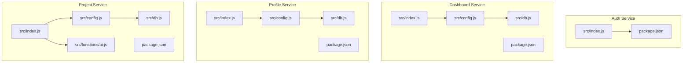
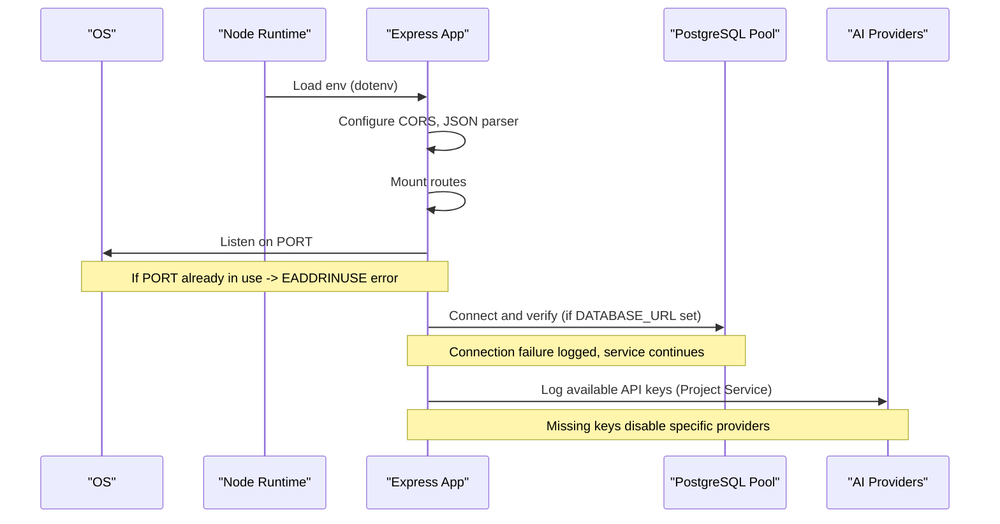
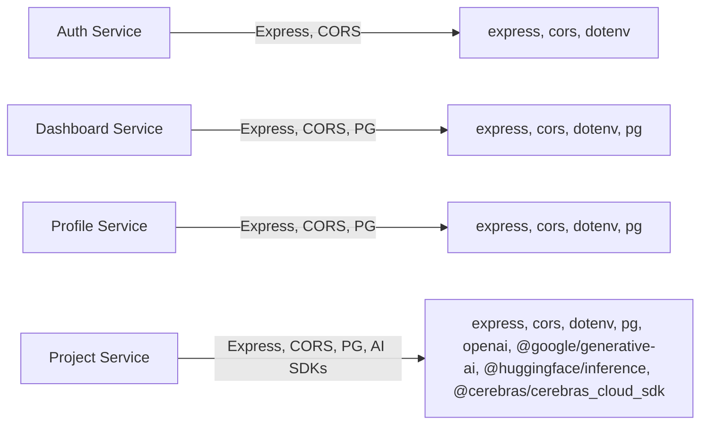

# Service Startup Failures

<cite>
**Referenced Files in This Document**
- [services/auth-service/src/index.js](file://services/auth-service/src/index.js)
- [services/dashboard-service/src/index.js](file://services/dashboard-service/src/index.js)
- [services/profile-service/src/index.js](file://services/profile-service/src/index.js)
- [services/project-service/src/index.js](file://services/project-service/src/index.js)
- [services/dashboard-service/src/config.js](file://services/dashboard-service/src/config.js)
- [services/profile-service/src/config.js](file://services/profile-service/src/config.js)
- [services/project-service/src/config.js](file://services/project-service/src/config.js)
- [services/dashboard-service/src/db.js](file://services/dashboard-service/src/db.js)
- [services/profile-service/src/db.js](file://services/profile-service/src/db.js)
- [services/project-service/src/db.js](file://services/project-service/src/db.js)
- [services/project-service/src/functions/ai.js](file://services/project-service/src/functions/ai.js)
- [services/auth-service/package.json](file://services/auth-service/package.json)
- [services/dashboard-service/package.json](file://services/dashboard-service/package.json)
- [services/profile-service/package.json](file://services/profile-service/package.json)
- [services/project-service/package.json](file://services/project-service/package.json)
</cite>

## Table of Contents

1. Introduction
2. Project Structure
3. Core Components
4. Architecture Overview
5. Detailed Component Analysis
6. Dependency Analysis
7. Performance Considerations
8. Troubleshooting Guide
9. Conclusion

## Introduction

This document explains how the Codacaine microservices start up and fail during initialization, with a focus on:

- Port conflicts when multiple services bind to the same port (expected defaults 5001–5004)
- Missing environment variables (DATABASE_URL, SUPABASE_KEY, and AI provider API keys)
- Dependency resolution issues (npm install failures, Node.js version incompatibilities, module loading errors)
- Diagnostic procedures using service-specific logs, health endpoints, and systematic troubleshooting for each backend service

The goal is to help developers quickly identify and resolve startup problems across all four backend services.

## Project Structure

Each backend service is an independent Express application with its own package.json, configuration loader, database client, and routes. Services listen on distinct default ports unless overridden by environment variables.

**Diagram sources**

- [services/auth-service/src/index.js:1-82](file://services/auth-service/src/index.js#L1-L82)
- [services/dashboard-service/src/index.js:1-87](file://services/dashboard-service/src/index.js#L1-L87)
- [services/profile-service/src/index.js:1-77](file://services/profile-service/src/index.js#L1-L77)
- [services/project-service/src/index.js:1-108](file://services/project-service/src/index.js#L1-L108)
- [services/dashboard-service/src/config.js:1-4](file://services/dashboard-service/src/config.js#L1-L4)
- [services/profile-service/src/config.js:1-4](file://services/profile-service/src/config.js#L1-L4)
- [services/project-service/src/config.js:1-4](file://services/project-service/src/config.js#L1-L4)
- [services/dashboard-service/src/db.js:1-32](file://services/dashboard-service/src/db.js#L1-L32)
- [services/profile-service/src/db.js:1-32](file://services/profile-service/src/db.js#L1-L32)
- [services/project-service/src/db.js:1-32](file://services/project-service/src/db.js#L1-L32)
- [services/project-service/src/functions/ai.js:1-463](file://services/project-service/src/functions/ai.js#L1-L463)

**Section sources**

- [services/auth-service/src/index.js:1-82](file://services/auth-service/src/index.js#L1-L82)
- [services/dashboard-service/src/index.js:1-87](file://services/dashboard-service/src/index.js#L1-L87)
- [services/profile-service/src/index.js:1-77](file://services/profile-service/src/index.js#L1-L77)
- [services/project-service/src/index.js:1-108](file://services/project-service/src/index.js#L1-L108)

## Core Components

- Port binding: Each service sets a default port via environment variable or hardcoded fallback:
  - Auth Service: default 5001
  - Dashboard Service: default 5002
  - Project Service: default 5003
  - Profile Service: default 5004
- Health endpoints: Each service exposes a root path returning a simple JSON status object.
- Environment loading: Services load .env via dotenv at startup; some explicitly import config modules before other code runs.
- Database connections: Services create a PostgreSQL pool if DATABASE_URL is present and verify connectivity on startup.
- AI providers: The Project Service initializes multiple AI SDK clients and logs which API keys are set or missing.

Key implications for startup failures:

- If two services share the same PORT, one will fail to bind.
- If DATABASE_URL is missing, services may still start but database operations will fail later.
- If required AI keys are missing, AI features will be disabled or degrade gracefully.

**Section sources**

- [services/auth-service/src/index.js:5-76](file://services/auth-service/src/index.js#L5-L76)
- [services/dashboard-service/src/index.js:10-84](file://services/dashboard-service/src/index.js#L10-L84)
- [services/profile-service/src/index.js:10-76](file://services/profile-service/src/index.js#L10-L76)
- [services/project-service/src/index.js:24-107](file://services/project-service/src/index.js#L24-L107)
- [services/dashboard-service/src/db.js:5-29](file://services/dashboard-service/src/db.js#L5-L29)
- [services/profile-service/src/db.js:5-29](file://services/profile-service/src/db.js#L5-L29)
- [services/project-service/src/db.js:5-29](file://services/project-service/src/db.js#L5-L29)
- [services/project-service/src/functions/ai.js:7-32](file://services/project-service/src/functions/ai.js#L7-L32)

## Architecture Overview

Startup flow highlights:

- Load environment variables
- Create Express app and middleware
- Mount routes
- Listen on configured port
- Initialize background tasks (e.g., dashboard daemon)
- Validate external dependencies (database pool, optional OpenAPI spec)

**Diagram sources**

- [services/dashboard-service/src/index.js:1-84](file://services/dashboard-service/src/index.js#L1-L84)
- [services/project-service/src/index.js:1-107](file://services/project-service/src/index.js#L1-L107)
- [services/dashboard-service/src/db.js:5-29](file://services/dashboard-service/src/db.js#L5-L29)
- [services/profile-service/src/db.js:5-29](file://services/profile-service/src/db.js#L5-L29)
- [services/project-service/src/db.js:5-29](file://services/project-service/src/db.js#L5-L29)
- [services/project-service/src/functions/ai.js:7-32](file://services/project-service/src/functions/ai.js#L7-L32)

## Detailed Component Analysis

### Port Conflict Resolution (Ports 5001–5004)

Symptoms:

- One or more services fail to start with address-in-use errors.
- Logs show attempts to bind to the same port.

Resolution steps:

- Ensure each service uses a unique PORT:
  - Auth Service: 5001
  - Dashboard Service: 5002
  - Project Service: 5003
  - Profile Service: 5004
- Override via environment variable if needed.
- Verify no leftover processes occupy the port before restarting.

Health checks:

- GET / returns a JSON status indicating the service is healthy.

**Section sources**

- [services/auth-service/src/index.js:5-76](file://services/auth-service/src/index.js#L5-L76)
- [services/dashboard-service/src/index.js:10-84](file://services/dashboard-service/src/index.js#L10-L84)
- [services/profile-service/src/index.js:10-76](file://services/profile-service/src/index.js#L10-L76)
- [services/project-service/src/index.js:24-107](file://services/project-service/src/index.js#L24-L107)

### Missing Environment Variables

#### DATABASE_URL

Impact:

- Without DATABASE_URL, services can still start, but any database calls will fail.
- Some services log warnings or critical messages indicating missing DATABASE_URL.
- On startup, if DATABASE_URL is present, the pool is created and verified; failures are logged.

Remediation:

- Provide a valid DATABASE_URL pointing to your PostgreSQL/Supabase instance.
- Confirm network access and credentials.
- Check startup logs for pool connection success or failure messages.

**Section sources**

- [services/dashboard-service/src/db.js:5-29](file://services/dashboard-service/src/db.js#L5-L29)
- [services/profile-service/src/db.js:5-29](file://services/profile-service/src/db.js#L5-L29)
- [services/project-service/src/db.js:5-29](file://services/project-service/src/db.js#L5-L29)

#### SUPABASE_KEY

Observation:

- The provided source files do not reference a SUPABASE_KEY environment variable within the backend services analyzed here.
- If Supabase integration exists elsewhere (e.g., frontend or other services), ensure that environment is configured accordingly.

Action:

- Search for SUPABASE_KEY usage in your environment and configure it where referenced.
- For backend services shown here, focus on DATABASE_URL and AI provider keys.

**Section sources**

- [services/dashboard-service/src/index.js:1-87](file://services/dashboard-service/src/index.js#L1-L87)
- [services/profile-service/src/index.js:1-77](file://services/profile-service/src/index.js#L1-L77)
- [services/project-service/src/index.js:1-108](file://services/project-service/src/index.js#L1-L108)

#### AI Provider API Keys (Project Service)

Impact:

- AI features depend on provider API keys. Missing keys disable specific providers.
- The AI module logs whether each key is set or not at load time.

Providers and keys:

- HuggingFace: HF_API_KEY
- OpenRouter: OPENROUTER_API_KEY
- Cerebras: CEREBRAS_API_KEY
- Gemini: GEMINI_API_KEY
- Groq: GROQ_API_KEY

Behavior:

- Providers without keys are skipped.
- The system tries multiple models per provider and falls back across providers.
- Rate limiting and cooldowns are handled internally.

Remediation:

- Set the required AI provider keys in your environment.
- Review AI module logs to confirm keys are detected.
- Test AI endpoints after enabling keys.

**Section sources**

- [services/project-service/src/functions/ai.js:7-32](file://services/project-service/src/functions/ai.js#L7-L32)
- [services/project-service/src/functions/ai.js:121-150](file://services/project-service/src/functions/ai.js#L121-L150)
- [services/project-service/src/functions/ai.js:403-463](file://services/project-service/src/functions/ai.js#L403-L463)

### Dependency Resolution Issues

#### npm Package Installation Failures

Common causes:

- Network issues or registry outages
- Incompatible native modules (e.g., sharp)
- Insufficient permissions or corrupted lockfiles

Actions:

- Reinstall dependencies per service directory:
  - cd services/<service> && npm ci
- If native modules fail, ensure build tools and compatible Node.js version are installed.
- Clear caches and reinstall if necessary.

**Section sources**

- [services/auth-service/package.json:1-41](file://services/auth-service/package.json#L1-L41)
- [services/dashboard-service/package.json:1-43](file://services/dashboard-service/package.json#L1-L43)
- [services/profile-service/package.json:1-43](file://services/profile-service/package.json#L1-L43)
- [services/project-service/package.json:1-58](file://services/project-service/package.json#L1-L58)

#### Node.js Version Incompatibilities

Symptoms:

- Module load errors (e.g., ES modules vs CommonJS)
- Syntax errors or unsupported features
- Native addon compilation failures

Actions:

- Use a Node.js version compatible with Express 5.x and the listed dependencies.
- Prefer LTS versions known to work with modern packages.
- If switching versions, remove node_modules and reinstall.

**Section sources**

- [services/auth-service/package.json:17-22](file://services/auth-service/package.json#L17-L22)
- [services/dashboard-service/package.json:17-23](file://services/dashboard-service/package.json#L17-L23)
- [services/profile-service/package.json:17-23](file://services/profile-service/package.json#L17-L23)
- [services/project-service/package.json:17-34](file://services/project-service/package.json#L17-L34)

#### Module Loading Errors

Patterns observed:

- Some services use ES modules (type: module) and import dotenv via config modules.
- Others use CommonJS and require dotenv directly.
- Mismatched module types can cause import/require errors.

Actions:

- Keep consistent module type per service as defined in package.json.
- Ensure imports match the declared type.
- For ES modules, use top-level await only where supported or wrap appropriately.

**Section sources**

- [services/auth-service/package.json:17-22](file://services/auth-service/package.json#L17-L22)
- [services/dashboard-service/src/config.js:1-4](file://services/dashboard-service/src/config.js#L1-L4)
- [services/profile-service/src/config.js:1-4](file://services/profile-service/src/config.js#L1-L4)
- [services/project-service/src/config.js:1-4](file://services/project-service/src/config.js#L1-L4)

### Service-Specific Startup Diagnostics

#### Auth Service

- Default port: 5001
- Health endpoint: GET / returns service identity and status
- Environment: Loads dotenv; no database dependency at startup
- Typical startup log: Indicates listening on port

Diagnostics:

- Check for EADDRINUSE on port 5001
- Verify CORS origins if local dev requests fail
- Confirm dotenv loaded correctly

**Section sources**

- [services/auth-service/src/index.js:5-76](file://services/auth-service/src/index.js#L5-L76)
- [services/auth-service/package.json:1-41](file://services/auth-service/package.json#L1-L41)

#### Dashboard Service

- Default port: 5002
- Health endpoints:
  - GET / returns service identity and status
  - GET /service/health-ping triggers a ping operation and reports status
- Environment: Loads dotenv via config module
- Database: Creates pool if DATABASE_URL is set and verifies connection

Diagnostics:

- Check for port conflicts on 5002
- Call /service/health-ping to validate external connectivity
- Review database pool logs for connection success/failure

**Section sources**

- [services/dashboard-service/src/index.js:10-84](file://services/dashboard-service/src/index.js#L10-L84)
- [services/dashboard-service/src/config.js:1-4](file://services/dashboard-service/src/config.js#L1-L4)
- [services/dashboard-service/src/db.js:5-29](file://services/dashboard-service/src/db.js#L5-L29)
- [services/dashboard-service/package.json:1-43](file://services/dashboard-service/package.json#L1-L43)

#### Profile Service

- Default port: 5004
- Health endpoint: GET / returns service identity and status
- Environment: Loads dotenv via config module
- Database: Creates pool if DATABASE_URL is set and verifies connection

Diagnostics:

- Check for port conflicts on 5004
- Validate database connectivity via startup logs
- Ensure routes under /service are mounted correctly

**Section sources**

- [services/profile-service/src/index.js:10-76](file://services/profile-service/src/index.js#L10-L76)
- [services/profile-service/src/config.js:1-4](file://services/profile-service/src/config.js#L1-L4)
- [services/profile-service/src/db.js:5-29](file://services/profile-service/src/db.js#L5-L29)
- [services/profile-service/package.json:1-43](file://services/profile-service/package.json#L1-L43)

#### Project Service

- Default port: 5003
- Health endpoint: GET / returns service identity and status
- Environment: Loads dotenv via config module
- Database: Creates pool if DATABASE_URL is set and verifies connection
- AI: Initializes multiple AI providers and logs key presence

Diagnostics:

- Check for port conflicts on 5003
- Validate database connectivity via startup logs
- Review AI module logs to confirm which providers are enabled
- Optional: Access /api-docs if OpenAPI spec is present

**Section sources**

- [services/project-service/src/index.js:24-107](file://services/project-service/src/index.js#L24-L107)
- [services/project-service/src/config.js:1-4](file://services/project-service/src/config.js#L1-L4)
- [services/project-service/src/db.js:5-29](file://services/project-service/src/db.js#L5-L29)
- [services/project-service/src/functions/ai.js:7-32](file://services/project-service/src/functions/ai.js#L7-L32)
- [services/project-service/package.json:1-58](file://services/project-service/package.json#L1-L58)

## Dependency Analysis

Service dependency relationships relevant to startup:

- All services depend on Express and CORS.
- Dashboard, Profile, and Project services depend on pg for database connectivity.
- Project service additionally depends on several AI SDKs and utilities.
- Environment loading is performed via dotenv either directly or through config modules.

**Diagram sources**

- [services/auth-service/package.json:17-22](file://services/auth-service/package.json#L17-L22)
- [services/dashboard-service/package.json:17-23](file://services/dashboard-service/package.json#L17-L23)
- [services/profile-service/package.json:17-23](file://services/profile-service/package.json#L17-L23)
- [services/project-service/package.json:17-34](file://services/project-service/package.json#L17-L34)

**Section sources**

- [services/auth-service/package.json:17-22](file://services/auth-service/package.json#L17-L22)
- [services/dashboard-service/package.json:17-23](file://services/dashboard-service/package.json#L17-L23)
- [services/profile-service/package.json:17-23](file://services/profile-service/package.json#L17-L23)
- [services/project-service/package.json:17-34](file://services/project-service/package.json#L17-L34)

## Performance Considerations

- Avoid unnecessary retries on startup; rely on explicit health endpoints for readiness.
- Use connection pooling for databases (already implemented).
- Disable non-essential features (e.g., OpenAPI docs) in constrained environments if startup overhead matters.
- Monitor AI provider rate limits and cooldown behavior to prevent cascading failures.

[No sources needed since this section provides general guidance]

## Troubleshooting Guide

### Systematic Startup Checklist

1. Verify environment variables:
   - PORT for each service (5001–5004)
   - DATABASE_URL for services that need it
   - AI provider keys for Project Service
2. Install dependencies cleanly per service:
   - Remove node_modules and run npm ci
3. Start services one by one and check logs:
   - Look for “running on port” messages
   - Watch for database pool connection results
   - Review AI provider key detection logs
4. Hit health endpoints:
   - GET / on each service
   - GET /service/health-ping on Dashboard Service

### Common Failure Patterns and Fixes

#### Port Already in Use

- Symptom: EADDRINUSE when starting a service
- Fix:
  - Free the port or change PORT for the conflicting service
  - Restart the service after ensuring the port is free

**Section sources**

- [services/auth-service/src/index.js:5-76](file://services/auth-service/src/index.js#L5-L76)
- [services/dashboard-service/src/index.js:10-84](file://services/dashboard-service/src/index.js#L10-L84)
- [services/profile-service/src/index.js:10-76](file://services/profile-service/src/index.js#L10-L76)
- [services/project-service/src/index.js:24-107](file://services/project-service/src/index.js#L24-L107)

#### Missing DATABASE_URL

- Symptom: Database calls fail; startup may warn about missing DATABASE_URL
- Fix:
  - Provide a valid DATABASE_URL
  - Confirm network and credentials
  - Check startup logs for pool connection success or failure

**Section sources**

- [services/dashboard-service/src/db.js:5-29](file://services/dashboard-service/src/db.js#L5-L29)
- [services/profile-service/src/db.js:5-29](file://services/profile-service/src/db.js#L5-L29)
- [services/project-service/src/db.js:5-29](file://services/project-service/src/db.js#L5-L29)

#### Missing AI Provider Keys

- Symptom: AI features disabled; logs indicate keys not set
- Fix:
  - Set required AI provider keys in environment
  - Restart Project Service and review AI logs

**Section sources**

- [services/project-service/src/functions/ai.js:7-32](file://services/project-service/src/functions/ai.js#L7-L32)
- [services/project-service/src/functions/ai.js:403-463](file://services/project-service/src/functions/ai.js#L403-L463)

#### npm Install Failures

- Symptom: Dependencies not installed; module load errors
- Fix:
  - Reinstall with npm ci
  - Ensure compatible Node.js version
  - Clear cache if necessary

**Section sources**

- [services/auth-service/package.json:1-41](file://services/auth-service/package.json#L1-L41)
- [services/dashboard-service/package.json:1-43](file://services/dashboard-service/package.json#L1-L43)
- [services/profile-service/package.json:1-43](file://services/profile-service/package.json#L1-L43)
- [services/project-service/package.json:1-58](file://services/project-service/package.json#L1-L58)

#### Node.js Version or Module Type Issues

- Symptom: Import/require errors; syntax errors
- Fix:
  - Align Node.js version with dependencies
  - Respect package.json type setting (module vs commonjs)
  - Reinstall dependencies after changing Node.js version

**Section sources**

- [services/auth-service/package.json:17-22](file://services/auth-service/package.json#L17-L22)
- [services/dashboard-service/package.json:17-23](file://services/dashboard-service/package.json#L17-L23)
- [services/profile-service/package.json:17-23](file://services/profile-service/package.json#L17-L23)
- [services/project-service/package.json:17-34](file://services/project-service/package.json#L17-L34)

### Health Endpoints Reference

- Auth Service: GET /
- Dashboard Service: GET /, GET /service/health-ping
- Profile Service: GET /
- Project Service: GET /

Use these endpoints to confirm services are running and responsive after resolving startup issues.

**Section sources**

- [services/auth-service/src/index.js:50-52](file://services/auth-service/src/index.js#L50-L52)
- [services/dashboard-service/src/index.js:48-67](file://services/dashboard-service/src/index.js#L48-L67)
- [services/profile-service/src/index.js:50-52](file://services/profile-service/src/index.js#L50-L52)
- [services/project-service/src/index.js:76-78](file://services/project-service/src/index.js#L76-L78)

## Conclusion

Startup failures in Codacaine typically stem from port conflicts, missing environment variables, or dependency/module issues. By ensuring unique ports (5001–5004), providing DATABASE_URL and AI provider keys where applicable, and verifying dependency installation and Node.js compatibility, most startup problems can be resolved quickly. Use the health endpoints and service logs to validate successful initialization and diagnose remaining issues.
