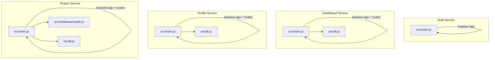
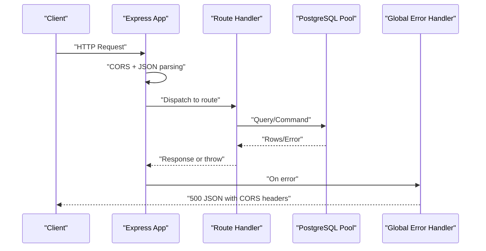
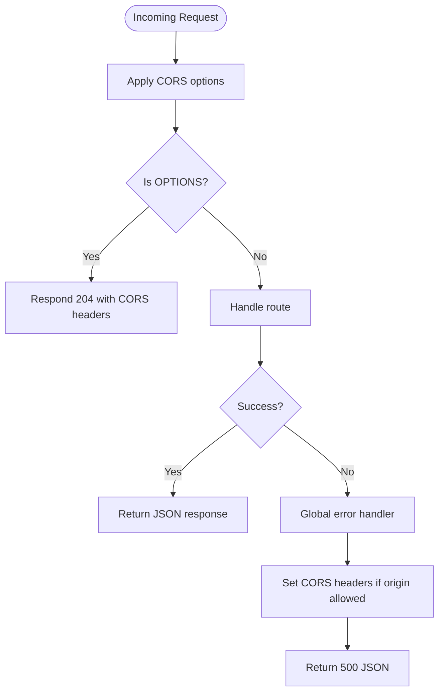
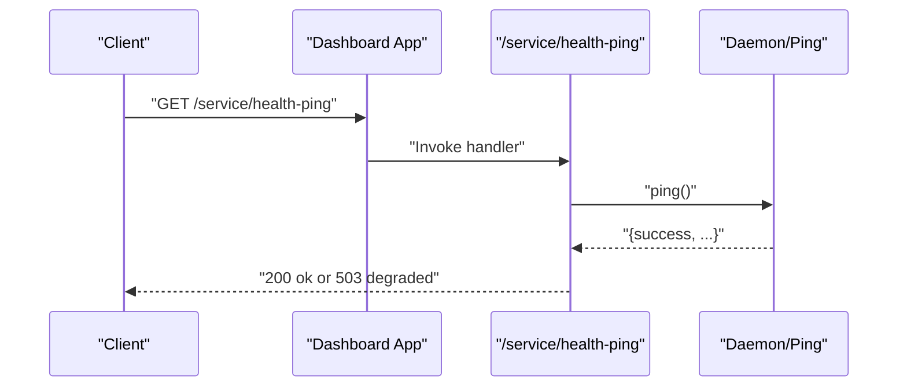
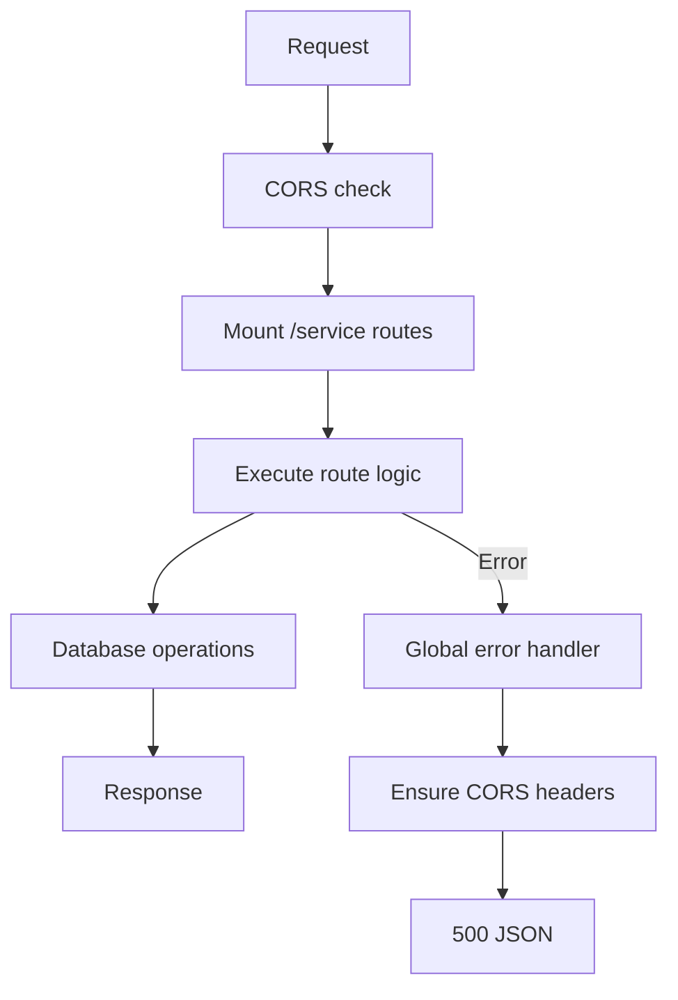
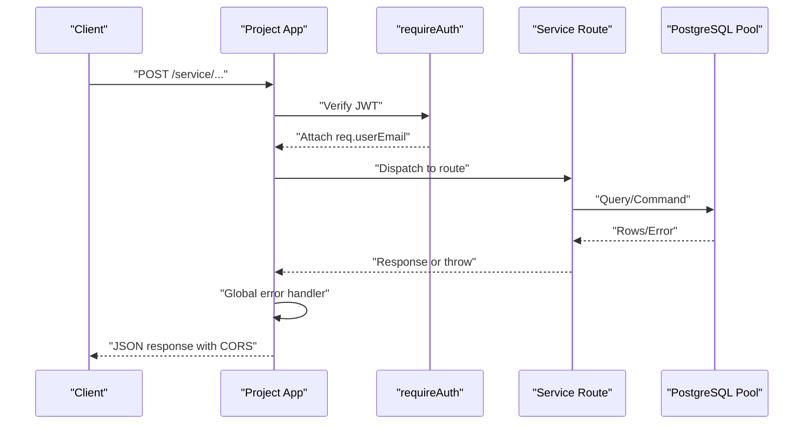
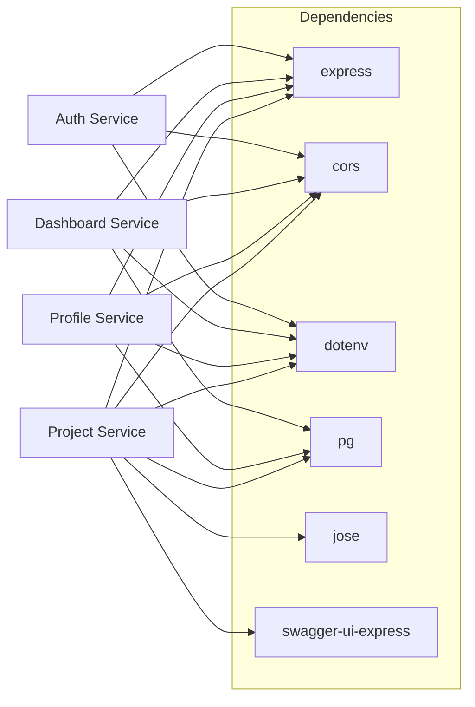

# Backend Debugging

<cite>
**Referenced Files in This Document**
- [services/auth-service/src/index.js](file://services/auth-service/src/index.js)
- [services/dashboard-service/src/index.js](file://services/dashboard-service/src/index.js)
- [services/profile-service/src/index.js](file://services/profile-service/src/index.js)
- [services/project-service/src/index.js](file://services/project-service/src/index.js)
- [services/project-service/src/middleware/auth.js](file://services/project-service/src/middleware/auth.js)
- [services/dashboard-service/src/db.js](file://services/dashboard-service/src/db.js)
- [services/profile-service/src/db.js](file://services/profile-service/src/db.js)
- [services/project-service/src/db.js](file://services/project-service/src/db.js)
- [services/auth-service/package.json](file://services/auth-service/package.json)
- [services/dashboard-service/package.json](file://services/dashboard-service/package.json)
- [services/profile-service/package.json](file://services/profile-service/package.json)
- [services/project-service/package.json](file://services/project-service/package.json)
- [services/auth-service/src/__tests__/index.test.js](file://services/auth-service/src/__tests__/index.test.js)
- [services/project-service/src/__tests__/entries.test.js](file://services/project-service/src/__tests__/entries.test.js)
</cite>

## Table of Contents

1. Introduction
2. Project Structure
3. Core Components
4. Architecture Overview
5. Detailed Component Analysis
6. Dependency Analysis
7. Performance Considerations
8. Troubleshooting Guide
9. Conclusion
10. Appendices

## Introduction

This document provides a comprehensive backend debugging guide for the Codacaine microservices (auth, project, dashboard, profile). It covers Node.js debugging techniques with VS Code, breakpoint strategies, runtime inspection, logging patterns, error handling, stack trace analysis, service-specific debugging (database connections, authentication flows, API endpoints), and testing integration with Jest for unit and integration tests. It also includes troubleshooting guidance for common issues such as CORS errors, database connection problems, and middleware failures.

## Project Structure

The backend consists of four Express-based microservices:

- Auth Service: minimal API with global CORS and error handling.
- Dashboard Service: search routes and health-ping endpoint; starts a background daemon.
- Profile Service: login and profile routes with CORS and error handling.
- Project Service: rich feature set with JWT middleware, OpenAPI/Swagger UI, multiple route modules, and robust error handling.

Each service exposes a root health endpoint and mounts its routes under /service where applicable. All services apply CORS globally and include an Express error handler that ensures CORS headers on error responses.

**Diagram sources**

- [services/auth-service/src/index.js:1-82](file://services/auth-service/src/index.js#L1-L82)
- [services/dashboard-service/src/index.js:1-87](file://services/dashboard-service/src/index.js#L1-L87)
- [services/profile-service/src/index.js:1-77](file://services/profile-service/src/index.js#L1-L77)
- [services/project-service/src/index.js:1-108](file://services/project-service/src/index.js#L1-L108)
- [services/project-service/src/middleware/auth.js:1-71](file://services/project-service/src/middleware/auth.js#L1-L71)
- [services/dashboard-service/src/db.js:1-32](file://services/dashboard-service/src/db.js#L1-L32)
- [services/profile-service/src/db.js:1-32](file://services/profile-service/src/db.js#L1-L32)
- [services/project-service/src/db.js:1-32](file://services/project-service/src/db.js#L1-L32)

**Section sources**

- [services/auth-service/src/index.js:1-82](file://services/auth-service/src/index.js#L1-L82)
- [services/dashboard-service/src/index.js:1-87](file://services/dashboard-service/src/index.js#L1-L87)
- [services/profile-service/src/index.js:1-77](file://services/profile-service/src/index.js#L1-L77)
- [services/project-service/src/index.js:1-108](file://services/project-service/src/index.js#L1-L108)

## Core Components

- Global CORS configuration per service allows known origins and local development hosts, with explicit preflight handling.
- Global error handlers log unhandled errors and ensure Access-Control-Allow-Origin is set when appropriate before returning 500 JSON.
- Database pools are created from DATABASE_URL with SSL disabled for Supabase compatibility and verified at startup via a simple query.
- Project service enforces authentication via JWT verification using a remote JWKS endpoint and attaches user context to requests.

Key implementation references:

- CORS and error handling in each service’s index file.
- Database pool creation and startup verification in db.js files.
- Authentication middleware in project service.

**Section sources**

- [services/auth-service/src/index.js:16-69](file://services/auth-service/src/index.js#L16-L69)
- [services/dashboard-service/src/index.js:21-78](file://services/dashboard-service/src/index.js#L21-L78)
- [services/profile-service/src/index.js:21-72](file://services/profile-service/src/index.js#L21-L72)
- [services/project-service/src/index.js:34-103](file://services/project-service/src/index.js#L34-L103)
- [services/dashboard-service/src/db.js:5-31](file://services/dashboard-service/src/db.js#L5-L31)
- [services/profile-service/src/db.js:5-31](file://services/profile-service/src/db.js#L5-L31)
- [services/project-service/src/db.js:5-31](file://services/project-service/src/db.js#L5-L31)
- [services/project-service/src/middleware/auth.js:1-71](file://services/project-service/src/middleware/auth.js#L1-L71)

## Architecture Overview

Request flow across services typically follows:

- Client sends HTTP request to a service endpoint.
- Express applies CORS middleware and parses JSON.
- Routes handle business logic, often calling database functions or external APIs.
- Errors are caught by a global error handler that logs and returns structured JSON with CORS headers.

**Diagram sources**

- [services/project-service/src/index.js:52-103](file://services/project-service/src/index.js#L52-L103)
- [services/dashboard-service/src/index.js:40-78](file://services/dashboard-service/src/index.js#L40-L78)
- [services/profile-service/src/index.js:42-72](file://services/profile-service/src/index.js#L42-L72)
- [services/auth-service/src/index.js:42-69](file://services/auth-service/src/index.js#L42-L69)

## Detailed Component Analysis

### Auth Service

- Purpose: Minimal Express server exposing a health endpoint and global CORS/error handling.
- Debugging tips:
  - Use breakpoints in the error handler to inspect thrown errors and verify CORS header application.
  - Validate allowed origins and preflight behavior using test cases.
- Logging: Uses console.warn for disallowed origins and console.error for unhandled errors.

**Diagram sources**

- [services/auth-service/src/index.js:16-69](file://services/auth-service/src/index.js#L16-L69)

**Section sources**

- [services/auth-service/src/index.js:1-82](file://services/auth-service/src/index.js#L1-L82)
- [services/auth-service/src/**tests**/index.test.js:1-86](file://services/auth-service/src/__tests__/index.test.js#L1-L86)

### Dashboard Service

- Purpose: Search functionality and health-ping endpoint; starts a background daemon to keep the service alive.
- Debugging tips:
  - Inspect health-ping endpoint behavior and error paths.
  - Verify database pool initialization and startup ping logs.
- Logging: Warns on disallowed origins, logs unhandled errors, and logs health-ping outcomes.

**Diagram sources**

- [services/dashboard-service/src/index.js:54-67](file://services/dashboard-service/src/index.js#L54-L67)

**Section sources**

- [services/dashboard-service/src/index.js:1-87](file://services/dashboard-service/src/index.js#L1-L87)
- [services/dashboard-service/src/db.js:1-32](file://services/dashboard-service/src/db.js#L1-L32)

### Profile Service

- Purpose: Login and profile routes with global CORS and error handling.
- Debugging tips:
  - Confirm CORS preflight handling and error responses include correct headers.
  - Validate database pool startup and connection status.
- Logging: Warns on disallowed origins, logs unhandled errors.

**Diagram sources**

- [services/profile-service/src/index.js:21-72](file://services/profile-service/src/index.js#L21-L72)

**Section sources**

- [services/profile-service/src/index.js:1-77](file://services/profile-service/src/index.js#L1-L77)
- [services/profile-service/src/db.js:1-32](file://services/profile-service/src/db.js#L1-L32)

### Project Service

- Purpose: Central service with JWT authentication middleware, multiple route modules, OpenAPI/Swagger UI, and robust error handling.
- Debugging tips:
  - Use breakpoints in requireAuth to inspect token extraction and verification.
  - Validate Swagger UI availability and spec loading.
  - Inspect database pool initialization and startup verification.
- Logging: Warns on missing OpenAPI spec, warns on disallowed origins, logs unhandled errors.

**Diagram sources**

- [services/project-service/src/index.js:58-103](file://services/project-service/src/index.js#L58-L103)
- [services/project-service/src/middleware/auth.js:27-71](file://services/project-service/src/middleware/auth.js#L27-L71)

**Section sources**

- [services/project-service/src/index.js:1-108](file://services/project-service/src/index.js#L1-L108)
- [services/project-service/src/middleware/auth.js:1-71](file://services/project-service/src/middleware/auth.js#L1-L71)
- [services/project-service/src/db.js:1-32](file://services/project-service/src/db.js#L1-L32)

## Dependency Analysis

- Each service depends on Express, cors, dotenv, and pg (where applicable).
- Project service additionally depends on jose for JWT verification, swagger-ui-express for API docs, and various AI SDKs.
- Testing relies on Jest with babel-jest transformation and coverage reporting.

**Diagram sources**

- [services/auth-service/package.json:18-31](file://services/auth-service/package.json#L18-L31)
- [services/dashboard-service/package.json:18-31](file://services/dashboard-service/package.json#L18-L31)
- [services/profile-service/package.json:18-31](file://services/profile-service/package.json#L18-L31)
- [services/project-service/package.json:18-43](file://services/project-service/package.json#L18-L43)

**Section sources**

- [services/auth-service/package.json:1-41](file://services/auth-service/package.json#L1-L41)
- [services/dashboard-service/package.json:1-43](file://services/dashboard-service/package.json#L1-L43)
- [services/profile-service/package.json:1-43](file://services/profile-service/package.json#L1-L43)
- [services/project-service/package.json:1-58](file://services/project-service/package.json#L1-L58)

## Performance Considerations

- Connection pooling: Ensure DATABASE_URL is correctly configured and pool initialization succeeds; monitor startup logs for connection success/failure messages.
- Middleware overhead: JWT verification uses remote JWKS; caching is handled by jose automatically. Monitor latency spikes during key rotation events.
- Request size limits: Project service sets a JSON body limit; adjust as needed for large payloads.
- Background tasks: Dashboard service starts a daemon; ensure it does not block request handling and logs appropriately.

[No sources needed since this section provides general guidance]

## Troubleshooting Guide

### CORS Errors

- Symptoms: Browser blocks requests due to missing Access-Control-Allow-Origin or credentials mismatch.
- Checks:
  - Verify allowedOrigins includes your frontend URL.
  - Ensure preflight OPTIONS requests return 204 with correct headers.
  - Confirm error responses include CORS headers via global error handler.
- References:
  - CORS configuration and preflight handling in each service’s index file.
  - Tests validating CORS behavior in auth service.

**Section sources**

- [services/auth-service/src/index.js:16-47](file://services/auth-service/src/index.js#L16-L47)
- [services/dashboard-service/src/index.js:21-45](file://services/dashboard-service/src/index.js#L21-L45)
- [services/profile-service/src/index.js:21-47](file://services/profile-service/src/index.js#L21-L47)
- [services/project-service/src/index.js:34-56](file://services/project-service/src/index.js#L34-L56)
- [services/auth-service/src/**tests**/index.test.js:23-62](file://services/auth-service/src/__tests__/index.test.js#L23-L62)

### Database Connection Problems

- Symptoms: Startup warnings about missing DATABASE_URL; queries fail; health checks degrade.
- Checks:
  - Ensure DATABASE_URL is set and valid.
  - Verify pool creation and startup query results in logs.
  - For Supabase, confirm SSL settings are acceptable.
- References:
  - Database pool setup and startup verification in db.js files.

**Section sources**

- [services/dashboard-service/src/db.js:5-31](file://services/dashboard-service/src/db.js#L5-L31)
- [services/profile-service/src/db.js:5-31](file://services/profile-service/src/db.js#L5-L31)
- [services/project-service/src/db.js:5-31](file://services/project-service/src/db.js#L5-L31)

### Middleware Failures (JWT)

- Symptoms: 401 Unauthorized responses; missing email in token; token verification errors.
- Checks:
  - Inspect Authorization header format (Bearer token) or query token for SSE.
  - Verify JWKS URL and network access.
  - Review error logs for token verification failures.
- References:
  - requireAuth middleware implementation.

**Section sources**

- [services/project-service/src/middleware/auth.js:27-71](file://services/project-service/src/middleware/auth.js#L27-L71)

### API Endpoint Issues

- Symptoms: Unexpected responses; missing fields; incorrect status codes.
- Checks:
  - Use Swagger UI (/api-docs) in project service to validate endpoints.
  - Add breakpoints in route handlers and error handlers.
  - Inspect request/response payloads and headers.
- References:
  - Swagger UI setup and route mounting in project service.

**Section sources**

- [services/project-service/src/index.js:58-75](file://services/project-service/src/index.js#L58-L75)
- [services/project-service/src/index.js:76-93](file://services/project-service/src/index.js#L76-L93)

### Health and Liveness

- Symptoms: Services appear down; health-ping fails.
- Checks:
  - Call root endpoints to verify service status.
  - Inspect health-ping endpoint behavior and logs.
- References:
  - Root health endpoints and health-ping in dashboard service.

**Section sources**

- [services/auth-service/src/index.js:50-52](file://services/auth-service/src/index.js#L50-L52)
- [services/dashboard-service/src/index.js:48-67](file://services/dashboard-service/src/index.js#L48-L67)
- [services/profile-service/src/index.js:50-52](file://services/profile-service/src/index.js#L50-L52)
- [services/project-service/src/index.js:76-78](file://services/project-service/src/index.js#L76-L78)

## Conclusion

The Codacaine microservices share consistent patterns for CORS, error handling, and database connectivity, which simplifies debugging across services. Focus on global error handlers for centralized logging and CORS enforcement, validate JWT flows in the project service, and use Jest tests to assert behavior. Leverage Swagger UI for API exploration and health endpoints for quick status checks. When issues arise, start with environment configuration (DATABASE_URL, allowed origins), then inspect middleware and route logic with breakpoints and logs.

[No sources needed since this section summarizes without analyzing specific files]

## Appendices

### VS Code Debugging Setup

- Launch configurations:
  - Create a launch config targeting each service’s entry file (e.g., src/index.js).
  - Use nodemon for hot reload during development.
- Breakpoints:
  - Place breakpoints in route handlers, middleware (especially requireAuth), and global error handlers.
  - Inspect req, res, and next to understand request flow.
- Runtime inspection:
  - Use console.log strategically around critical sections (e.g., database calls, JWT verification).
  - Check startup logs for database pool connection status.

[No sources needed since this section provides general guidance]

### Logging Strategies

- Console logging:
  - Use console.warn for non-fatal issues (e.g., disallowed origins).
  - Use console.error for unhandled exceptions and database errors.
- Structured logging:
  - Consider adding timestamps, service names, and correlation IDs to logs for aggregation.
- Log aggregation:
  - In production environments, forward stdout/stderr to a logging pipeline (e.g., cloud provider logs).
  - Correlate logs across services using request IDs.

[No sources needed since this section provides general guidance]

### Error Handling Patterns

- Global error handlers:
  - Ensure they log errors and attach CORS headers before responding.
- Middleware errors:
  - Validate inputs early and return structured error objects.
- Database errors:
  - Catch and wrap errors with meaningful messages; avoid leaking internal details to clients.

**Section sources**

- [services/auth-service/src/index.js:61-69](file://services/auth-service/src/index.js#L61-L69)
- [services/dashboard-service/src/index.js:69-78](file://services/dashboard-service/src/index.js#L69-L78)
- [services/profile-service/src/index.js:57-72](file://services/profile-service/src/index.js#L57-L72)
- [services/project-service/src/index.js:94-103](file://services/project-service/src/index.js#L94-L103)

### Stack Trace Analysis

- Techniques:
  - Capture full stack traces in error logs.
  - Use source maps in development to map minified code back to original files.
  - Identify failing layers (middleware, routes, database) from stack frames.
- Tools:
  - VS Code debugger with breakpoints and call stack inspection.
  - Node inspector for runtime analysis.

[No sources needed since this section provides general guidance]

### Testing Integration with Jest

- Unit tests:
  - Mock database pools and external dependencies to isolate logic.
  - Assert success and failure paths for CRUD operations.
- Integration tests:
  - Mount Express apps and send HTTP requests using supertest.
  - Validate CORS behavior and error responses.
- Coverage:
  - Configure coverage reporters and collect coverage from function modules.

**Section sources**

- [services/auth-service/src/**tests**/index.test.js:1-86](file://services/auth-service/src/__tests__/index.test.js#L1-L86)
- [services/project-service/src/**tests**/entries.test.js:1-200](file://services/project-service/src/__tests__/entries.test.js#L1-L200)
- [services/auth-service/package.json:32-39](file://services/auth-service/package.json#L32-L39)
- [services/dashboard-service/package.json:32-41](file://services/dashboard-service/package.json#L32-L41)
- [services/profile-service/package.json:32-41](file://services/profile-service/package.json#L32-L41)
- [services/project-service/package.json:44-56](file://services/project-service/package.json#L44-L56)
