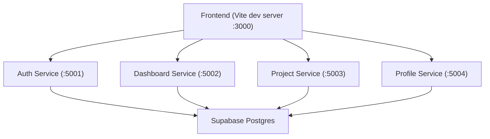
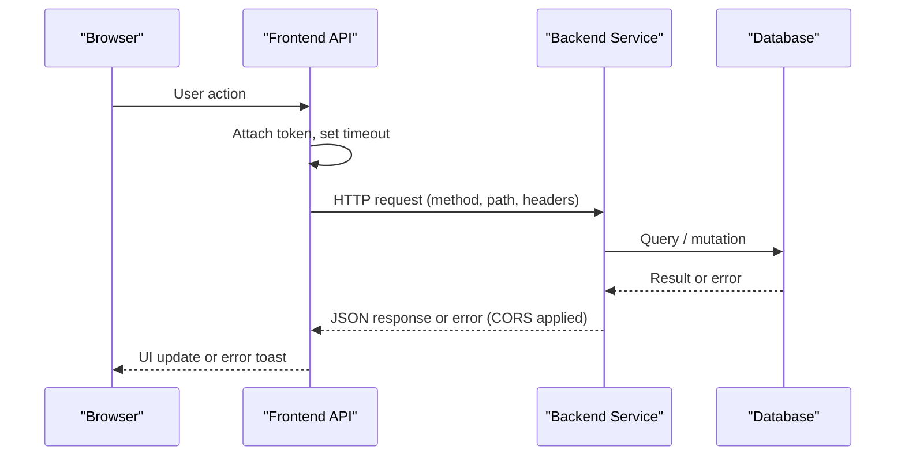
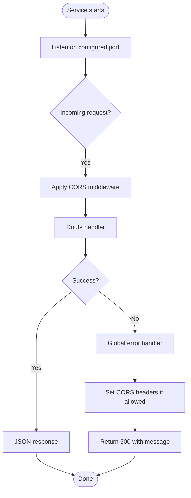
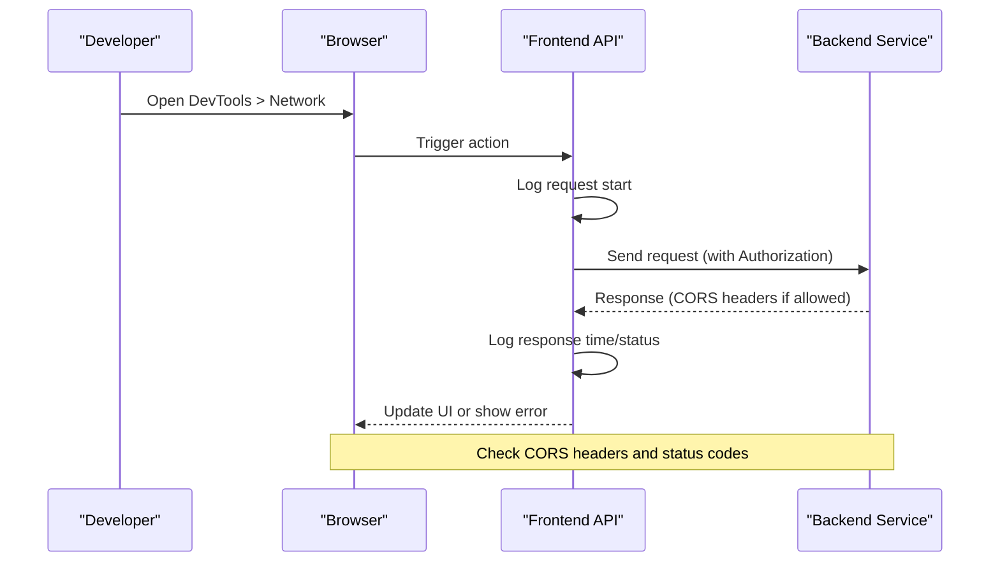
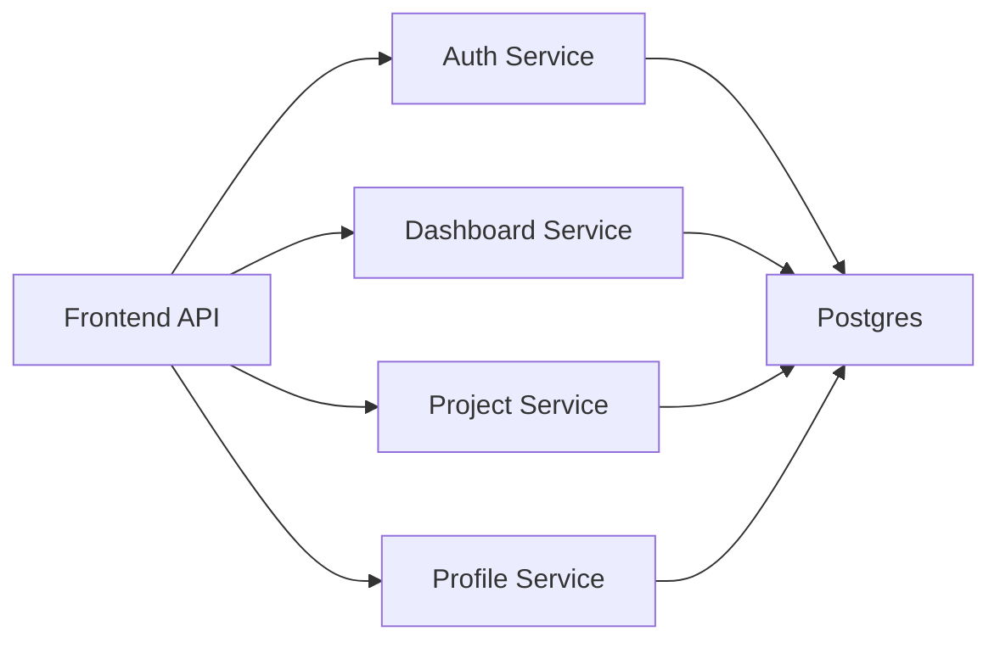

# Debugging Guide

<cite>
**Referenced Files in This Document**
- [README.md](file://README.md)
- [services/README.md](file://services/README.md)
- [frontend/README.md](file://frontend/README.md)
- [services/auth-service/src/index.js](file://services/auth-service/src/index.js)
- [services/dashboard-service/src/index.js](file://services/dashboard-service/src/index.js)
- [services/profile-service/src/index.js](file://services/profile-service/src/index.js)
- [services/project-service/src/index.js](file://services/project-service/src/index.js)
- [services/project-service/src/functions/activityLog.js](file://services/project-service/src/functions/activityLog.js)
- [services/auth-service/src/__tests__/cors.integration.test.js](file://services/auth-service/src/__tests__/cors.integration.test.js)
- [services/auth-service/src/__tests__/index.test.js](file://services/auth-service/src/__tests__/index.test.js)
- [frontend/vite.config.ts](file://frontend/vite.config.ts)
- [frontend/vitest.config.ts](file://frontend/vitest.config.ts)
- [frontend/src/lib/api.ts](file://frontend/src/lib/api.ts)
- [frontend/src/lib/__tests__/api.test.ts](file://frontend/src/lib/__tests__/api.test.ts)
- [.gitea/workflows/backend-unit-tests.yml](file://.gitea/workflows/backend-unit-tests.yml)
- [.gitea/workflows/backend-integration-tests.yml](file://.gitea/workflows/backend-integration-tests.yml)
- [.github/workflows/frontend-unit-tests.yml](file://.github/workflows/frontend-unit-tests.yml)
- [.github/workflows/frontend-integration-tests.yml](file://.github/workflows/frontend-integration-tests.yml)
</cite>

## Table of Contents

1. Introduction
2. Project Structure
3. Core Components
4. Architecture Overview
5. Detailed Component Analysis
6. Dependency Analysis
7. Performance Considerations
8. Troubleshooting Guide
9. Conclusion
10. Appendices

## Introduction

This guide provides a comprehensive debugging strategy for the Codacaine microservices architecture, covering:

- Node.js service debugging with breakpoints and logging
- Error stack trace analysis across services
- HTTP request/response inspection and CORS troubleshooting
- Inter-service call failure diagnosis
- Frontend debugging using browser developer tools and React DevTools
- Testing strategies (unit, integration, end-to-end)
- Performance profiling, memory leak detection, and bottleneck identification across the full stack

The goal is to help you quickly locate and resolve issues from the frontend through backend services to the database.

## Project Structure

Codacaine is a monorepo with independent backend services and a React frontend. Each backend service runs as its own process on its own port, while the frontend runs locally via Vite. Services expose health endpoints and consistent CORS/error handling patterns. The frontend centralizes API calls and includes timeouts and structured logs.

**Diagram sources**

- [README.md:20-31](file://README.md#L20-L31)
- [services/README.md:21-43](file://services/README.md#L21-L43)
- [frontend/vite.config.ts:12-15](file://frontend/vite.config.ts#L12-L15)

**Section sources**

- [README.md:20-31](file://README.md#L20-L31)
- [services/README.md:21-43](file://services/README.md#L21-L43)
- [frontend/vite.config.ts:12-15](file://frontend/vite.config.ts#L12-L15)

## Core Components

- Backend services: Express-based Node.js services with global CORS configuration and error handlers that preserve CORS headers on errors.
- Frontend: React + Vite app with a centralized API helper that attaches Supabase tokens, enforces timeouts, and logs request timing.
- Database: Shared PostgreSQL via Supabase; services connect using DATABASE_URL.

Key debugging entry points:

- Health endpoints at each service root for quick availability checks.
- Global error handlers returning standardized JSON with CORS headers when applicable.
- Frontend API layer logging request start/end times and errors.

**Section sources**

- [services/auth-service/src/index.js:1-82](file://services/auth-service/src/index.js#L1-L82)
- [services/dashboard-service/src/index.js:1-87](file://services/dashboard-service/src/index.js#L1-L87)
- [services/profile-service/src/index.js:1-77](file://services/profile-service/src/index.js#L1-L77)
- [services/project-service/src/index.js:1-108](file://services/project-service/src/index.js#L1-L108)
- [frontend/src/lib/api.ts:1-70](file://frontend/src/lib/api.ts#L1-L70)

## Architecture Overview

The frontend communicates with backend services over HTTP(S). All services enforce CORS with an allowlist and support credentials. Errors are handled globally to ensure consistent responses and CORS headers. The project service also exposes OpenAPI/Swagger docs for interactive debugging.

**Diagram sources**

- [frontend/src/lib/api.ts:10-57](file://frontend/src/lib/api.ts#L10-L57)
- [services/project-service/src/index.js:23-108](file://services/project-service/src/index.js#L23-L108)

## Detailed Component Analysis

### Backend Service Debugging (Node.js + Express)

- Run each service in its own terminal and attach your IDE debugger to the running process.
- Use console logs emitted by services for startup messages and warnings (e.g., CORS origin warnings).
- Leverage global error handlers to capture unhandled exceptions and return consistent error payloads with CORS headers.

Practical steps:

- Start the service and open the root URL to verify health.
- Reproduce the issue and inspect console output for warnings like disallowed origins.
- For thrown errors, confirm the response includes CORS headers when the Origin is allowed.

**Diagram sources**

- [services/auth-service/src/index.js:39-82](file://services/auth-service/src/index.js#L39-L82)
- [services/dashboard-service/src/index.js:40-87](file://services/dashboard-service/src/index.js#L40-L87)
- [services/profile-service/src/index.js:42-77](file://services/profile-service/src/index.js#L42-L77)
- [services/project-service/src/index.js:52-108](file://services/project-service/src/index.js#L52-L108)

**Section sources**

- [services/auth-service/src/index.js:1-82](file://services/auth-service/src/index.js#L1-L82)
- [services/dashboard-service/src/index.js:1-87](file://services/dashboard-service/src/index.js#L1-L87)
- [services/profile-service/src/index.js:1-77](file://services/profile-service/src/index.js#L1-L77)
- [services/project-service/src/index.js:1-108](file://services/project-service/src/index.js#L1-L108)

### Logging Strategies and Error Stack Trace Analysis

- Centralized logging:
  - Startup and health messages printed by each service.
  - CORS warnings logged when an Origin is not allowed.
  - Unhandled errors captured by global error handlers with stack traces in the console.
- Service-specific logging:
  - Example: activity log retrieval logs failures with context tags for easier filtering.

Debugging tips:

- Filter logs by service name or tag to isolate noise.
- Correlate timestamps between frontend logs and backend logs to identify slow paths.
- When errors occur, check both frontend console and backend logs for the full stack trace.

**Section sources**

- [services/project-service/src/functions/activityLog.js:38-69](file://services/project-service/src/functions/activityLog.js#L38-L69)
- [services/auth-service/src/index.js:54-82](file://services/auth-service/src/index.js#L54-L82)
- [services/dashboard-service/src/index.js:69-87](file://services/dashboard-service/src/index.js#L69-L87)
- [services/profile-service/src/index.js:57-77](file://services/profile-service/src/index.js#L57-L77)
- [services/project-service/src/index.js:94-108](file://services/project-service/src/index.js#L94-L108)

### HTTP Request/Response Inspection and CORS Issues

- Frontend API layer:
  - Logs method, short URL, status, and elapsed time for every request.
  - Throws descriptive errors for non-ok responses and timeouts.
- CORS policy:
  - Each service allows specific origins and localhost variants.
  - Preflight requests are handled explicitly.
  - Error responses include CORS headers only for allowed origins.

Troubleshooting checklist:

- Verify the browser’s Origin matches an allowed list in the target service.
- Inspect Network tab for preflight responses and Access-Control-* headers.
- Confirm Authorization header presence and correct Bearer token format.
- If errors occur, ensure the error response includes CORS headers for the allowed origin.

**Diagram sources**

- [frontend/src/lib/api.ts:10-57](file://frontend/src/lib/api.ts#L10-L57)
- [services/auth-service/src/index.js:16-56](file://services/auth-service/src/index.js#L16-L56)
- [services/project-service/src/index.js:25-56](file://services/project-service/src/index.js#L25-L56)

**Section sources**

- [frontend/src/lib/api.ts:1-70](file://frontend/src/lib/api.ts#L1-L70)
- [services/auth-service/src/index.js:16-56](file://services/auth-service/src/index.js#L16-L56)
- [services/project-service/src/index.js:25-56](file://services/project-service/src/index.js#L25-L56)

### Inter-Service Call Failures

- While the current architecture primarily has the frontend calling services directly, any inter-service communication should be debugged similarly:
  - Validate network reachability and ports.
  - Inspect request/response payloads and headers.
  - Ensure CORS policies allow cross-origin calls if applicable.
  - Use health endpoints to confirm service readiness before invoking business endpoints.

**Section sources**

- [services/auth-service/src/index.js:50-56](file://services/auth-service/src/index.js#L50-L56)
- [services/dashboard-service/src/index.js:48-67](file://services/dashboard-service/src/index.js#L48-L67)
- [services/profile-service/src/index.js:50-56](file://services/profile-service/src/index.js#L50-L56)
- [services/project-service/src/index.js:76-85](file://services/project-service/src/index.js#L76-L85)

### Frontend Debugging Approaches

- Browser Developer Tools:
  - Network tab: Inspect requests, headers, status codes, and timing.
  - Console: View structured logs from the API layer including timeouts and errors.
  - Sources: Set breakpoints in React components and hooks.
- React DevTools:
  - Inspect component props/state and context values.
  - Profile renders to detect unnecessary re-renders.
- Timeouts and errors:
  - The API layer enforces a default timeout and throws clear errors on abort or non-ok responses.

**Section sources**

- [frontend/src/lib/api.ts:10-57](file://frontend/src/lib/api.ts#L10-L57)
- [frontend/vite.config.ts:1-16](file://frontend/vite.config.ts#L1-L16)

### Testing Strategies

- Unit tests:
  - Frontend: Vitest with jsdom environment and setup file.
  - Backend: Jest per service, excluding integration tests in unit workflows.
- Integration tests:
  - Frontend: Separate integration suite under src/**integration**/.
  - Backend: Service-specific integration tests run in dedicated workflows.
- CI pipelines:
  - Separate jobs for unit and integration tests across frontend and all backend services.
  - JUnit reporters and artifacts for test result visibility.

Execution examples:

- Frontend unit tests: exclude integration tests, run once or in watch mode.
- Frontend integration tests: run the **integration** directory.
- Backend unit tests: run per service, ignoring integration files.
- Backend integration tests: run per service, targeting integration files.

**Section sources**

- [frontend/vitest.config.ts:1-18](file://frontend/vitest.config.ts#L1-L18)
- [frontend/src/lib/**tests**/api.test.ts:55-88](file://frontend/src/lib/__tests__/api.test.ts#L55-L88)
- [.gitea/workflows/backend-unit-tests.yml:1-42](file://.gitea/workflows/backend-unit-tests.yml#L1-L42)
- [.gitea/workflows/backend-integration-tests.yml:1-42](file://.gitea/workflows/backend-integration-tests.yml#L1-L42)
- [.github/workflows/frontend-unit-tests.yml:1-57](file://.github/workflows/frontend-unit-tests.yml#L1-L57)
- [.github/workflows/frontend-integration-tests.yml:1-57](file://.github/workflows/frontend-integration-tests.yml#L1-L57)

### End-to-End Scenarios

- Use the browser to perform user flows (sign-in, create entries, view dashboard).
- Monitor Network tab for chained requests and errors.
- Validate CORS behavior across environments (localhost vs deployed).
- Leverage health endpoints to assert service availability during E2E runs.

[No sources needed since this section provides general guidance]

## Dependency Analysis

Services depend on shared patterns:

- CORS middleware with allowlists and credentials enabled.
- Global error handlers ensuring consistent error responses and CORS headers.
- Environment-driven configuration (ports, URLs, database connection).

**Diagram sources**

- [frontend/src/lib/api.ts:1-70](file://frontend/src/lib/api.ts#L1-L70)
- [services/auth-service/src/index.js:16-56](file://services/auth-service/src/index.js#L16-L56)
- [services/dashboard-service/src/index.js:21-56](file://services/dashboard-service/src/index.js#L21-L56)
- [services/profile-service/src/index.js:21-56](file://services/profile-service/src/index.js#L21-L56)
- [services/project-service/src/index.js:25-56](file://services/project-service/src/index.js#L25-L56)

**Section sources**

- [services/auth-service/src/index.js:16-56](file://services/auth-service/src/index.js#L16-L56)
- [services/dashboard-service/src/index.js:21-56](file://services/dashboard-service/src/index.js#L21-L56)
- [services/profile-service/src/index.js:21-56](file://services/profile-service/src/index.js#L21-L56)
- [services/project-service/src/index.js:25-56](file://services/project-service/src/index.js#L25-L56)

## Performance Considerations

- Frontend timeouts:
  - Default timeout prevents hanging requests; adjust per endpoint if needed.
  - AbortController ensures timely cleanup.
- Backend bottlenecks:
  - Inspect database query performance and indexes.
  - Use health and monitoring endpoints to track service responsiveness.
- Profiling:
  - Frontend: Use React DevTools profiler and Performance tab to identify render hotspots.
  - Backend: Use Node.js CPU/memory profilers (e.g., --inspect, heap snapshots) to find leaks or hot paths.
- Caching and limits:
  - Review payload size limits (e.g., JSON body limit) and consider caching where appropriate.

[No sources needed since this section provides general guidance]

## Troubleshooting Guide

Common issues and how to diagnose them:

- CORS errors:
  - Symptom: Blocked requests in browser; missing Access-Control-Allow-Origin.
  - Action: Verify Origin is in the service’s allowed list; check preflight responses; ensure credentials are allowed.
  - Validation: Tests cover preflight and error handler CORS behavior.

- Authentication failures:
  - Symptom: 401/403 responses or missing Authorization header.
  - Action: Confirm Supabase session token is attached by the frontend API layer; validate token expiry.

- Timeouts:
  - Symptom: Requests abort after default timeout.
  - Action: Increase timeout for long-running operations; investigate backend processing time.

- Database connectivity:
  - Symptom: Service returns 500 with database-related messages.
  - Action: Check DATABASE_URL and network access to Supabase; review service logs for connection errors.

- Health checks:
  - Use service root endpoints to verify liveness and readiness.

**Section sources**

- [services/auth-service/src/**tests**/cors.integration.test.js:1-102](file://services/auth-service/src/__tests__/cors.integration.test.js#L1-L102)
- [services/auth-service/src/**tests**/index.test.js:46-85](file://services/auth-service/src/__tests__/index.test.js#L46-L85)
- [frontend/src/lib/api.ts:10-57](file://frontend/src/lib/api.ts#L10-L57)
- [services/dashboard-service/src/index.js:54-67](file://services/dashboard-service/src/index.js#L54-L67)

## Conclusion

By combining structured logging, consistent error handling, and robust testing, you can efficiently debug the Codacaine microservices architecture. Focus on CORS validation, token handling, and request timing to isolate issues quickly. Use the provided health endpoints and tests to validate service behavior locally and in CI.

[No sources needed since this section summarizes without analyzing specific files]

## Appendices

### A. Service Ports and URLs

- Frontend dev server: 3000
- Auth service: 5001
- Dashboard service: 5002
- Project service: 5003
- Profile service: 5004

**Section sources**

- [README.md:294-303](file://README.md#L294-L303)

### B. Test Execution Commands

- Frontend:
  - Unit tests: run once or watch mode; coverage report available.
  - Integration tests: run the **integration** directory.
- Backend:
  - Unit tests: per service, excluding integration tests.
  - Integration tests: per service, targeting integration files.

**Section sources**

- [frontend/README.md:210-216](file://frontend/README.md#L210-L216)
- [README.md:306-330](file://README.md#L306-L330)
- [.gitea/workflows/backend-unit-tests.yml:1-42](file://.gitea/workflows/backend-unit-tests.yml#L1-L42)
- [.gitea/workflows/backend-integration-tests.yml:1-42](file://.gitea/workflows/backend-integration-tests.yml#L1-L42)
- [.github/workflows/frontend-unit-tests.yml:1-57](file://.github/workflows/frontend-unit-tests.yml#L1-L57)
- [.github/workflows/frontend-integration-tests.yml:1-57](file://.github/workflows/frontend-integration-tests.yml#L1-L57)
