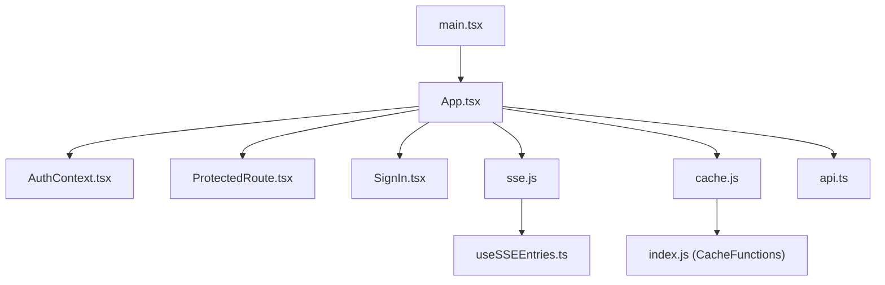
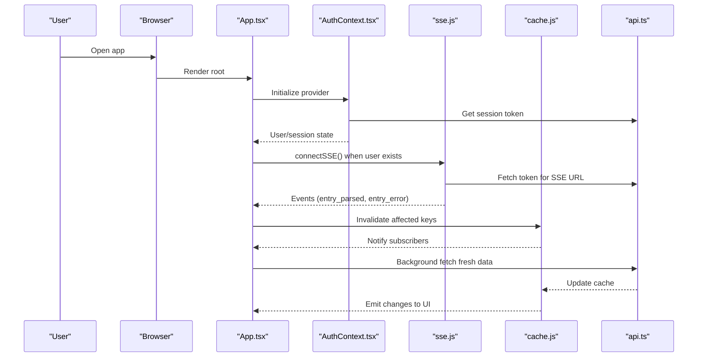
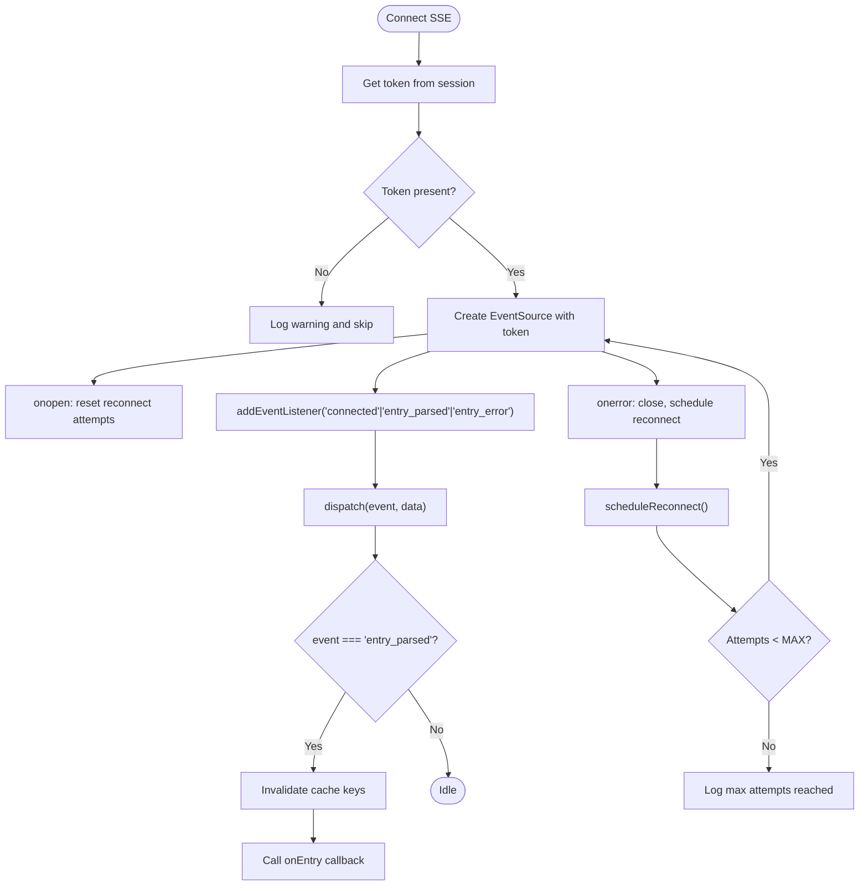
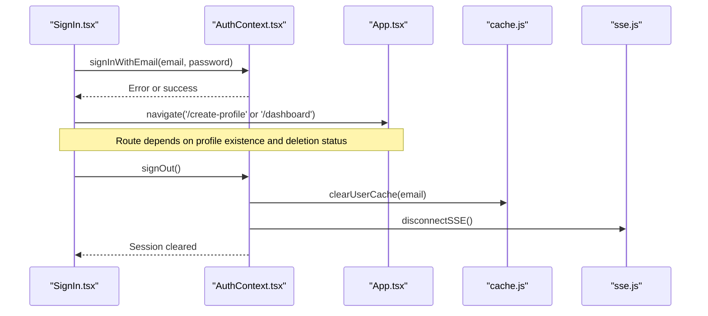
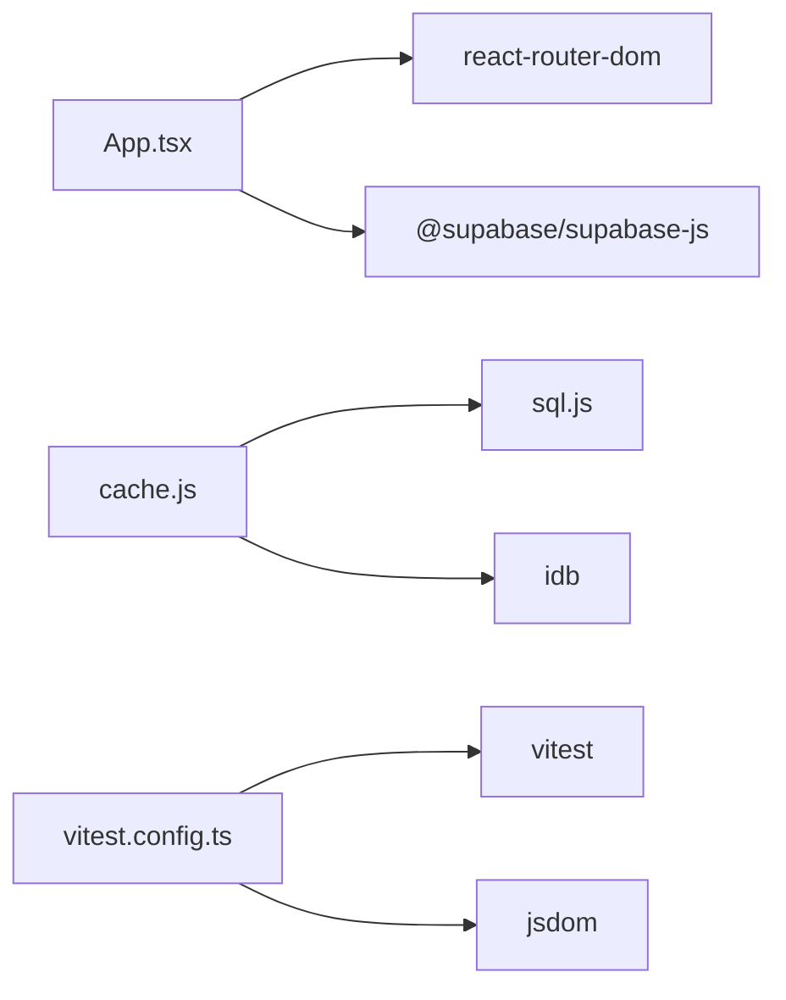

# Frontend Debugging

<cite>
**Referenced Files in This Document**
- [package.json](file://frontend/package.json)
- [main.tsx](file://frontend/src/main.tsx)
- [App.tsx](file://frontend/src/App.tsx)
- [AuthContext.tsx](file://frontend/src/context/AuthContext.tsx)
- [ProtectedRoute.tsx](file://frontend/src/components/ProtectedRoute.tsx)
- [SignIn.tsx](file://frontend/src/pages/SignIn.tsx)
- [api.ts](file://frontend/src/lib/api.ts)
- [sse.js](file://frontend/src/lib/sse.js)
- [useSSEEntries.ts](file://frontend/src/hooks/useSSEEntries.ts)
- [cache.js](file://frontend/src/lib/cache.js)
- [index.js](file://frontend/src/CacheFunctions/index.js)
- [vitest.config.ts](file://frontend/vitest.config.ts)
- [setup.ts](file://frontend/src/test/setup.ts)
</cite>

## Table of Contents

1. [Introduction](#introduction)
2. [Project Structure](#project-structure)
3. [Core Components](#core-components)
4. [Architecture Overview](#architecture-overview)
5. [Detailed Component Analysis](#detailed-component-analysis)
6. [Dependency Analysis](#dependency-analysis)
7. [Performance Considerations](#performance-considerations)
8. [Troubleshooting Guide](#troubleshooting-guide)
9. [Conclusion](#conclusion)
10. [Appendices](#appendices)

## Introduction

This document provides a comprehensive guide to debugging the React frontend, focusing on browser developer tools, React DevTools, IndexedDB for offline caching and synchronization, real-time features via Server-Sent Events (SSE), testing with Vitest, and common issues such as authentication flows, routing problems, and component lifecycle bugs. It also includes mobile debugging techniques and cross-browser compatibility tips.

## Project Structure

The application is a Vite + React project using TypeScript and JavaScript modules. Key areas relevant to debugging:

- Entry point initializes the app and applies initial theme settings before rendering.
- Routing is centralized in the root App component with protected routes and public routes.
- Authentication state is managed in a context that integrates with Supabase and handles sign-in/out, password reset/update, and account deletion/restore.
- Real-time updates are handled via SSE with automatic reconnection and event dispatching.
- Local-first data layer uses SQLite compiled to WebAssembly persisted in IndexedDB, with cache invalidation and stale-while-revalidate patterns.
- Testing is configured with Vitest and jsdom environment.

**Diagram sources**

- [main.tsx:1-23](file://frontend/src/main.tsx#L1-L23)
- [App.tsx:1-355](file://frontend/src/App.tsx#L1-L355)
- [AuthContext.tsx:1-240](file://frontend/src/context/AuthContext.tsx#L1-L240)
- [ProtectedRoute.tsx:1-82](file://frontend/src/components/ProtectedRoute.tsx#L1-L82)
- [SignIn.tsx:1-648](file://frontend/src/pages/SignIn.tsx#L1-L648)
- [sse.js:1-185](file://frontend/src/lib/sse.js#L1-L185)
- [useSSEEntries.ts:1-108](file://frontend/src/hooks/useSSEEntries.ts#L1-L108)
- [cache.js:1-389](file://frontend/src/lib/cache.js#L1-L389)
- [index.js:1-31](file://frontend/src/CacheFunctions/index.js#L1-L31)
- [api.ts:1-70](file://frontend/src/lib/api.ts#L1-L70)

**Section sources**

- [main.tsx:1-23](file://frontend/src/main.tsx#L1-L23)
- [App.tsx:1-355](file://frontend/src/App.tsx#L1-L355)
- [package.json:1-45](file://frontend/package.json#L1-L45)

## Core Components

- Application bootstrap: Initializes theme attributes and renders the root App under StrictMode.
- Routing and guards: Centralized routes with PublicRoute and ProtectedRoute to control access based on auth state.
- Authentication context: Manages user session, OAuth flows, email/password flows, and cleanup on sign-out (IndexedDB cache clearing and SSE disconnect).
- Real-time updates: SSE connection manager with reconnect logic and event listeners; hook to invalidate caches and notify UI.
- Local-first cache: SQLite-backed cache persisted to IndexedDB with subscription-based updates and stale-while-revalidate fetching.
- API client: Centralized fetch wrapper that attaches tokens and logs request/response timing and errors.

**Section sources**

- [main.tsx:1-23](file://frontend/src/main.tsx#L1-L23)
- [App.tsx:1-355](file://frontend/src/App.tsx#L1-L355)
- [AuthContext.tsx:1-240](file://frontend/src/context/AuthContext.tsx#L1-L240)
- [sse.js:1-185](file://frontend/src/lib/sse.js#L1-L185)
- [useSSEEntries.ts:1-108](file://frontend/src/hooks/useSSEEntries.ts#L1-L108)
- [cache.js:1-389](file://frontend/src/lib/cache.js#L1-L389)
- [api.ts:1-70](file://frontend/src/lib/api.ts#L1-L70)

## Architecture Overview

The frontend follows a local-first architecture:

- Reads from IndexedDB immediately, then refreshes in background.
- Writes optimistically to IndexedDB, then syncs to server.
- Real-time events invalidate caches and trigger UI updates without full reloads.
- Authentication gates routes and manages SSE lifecycle.

**Diagram sources**

- [App.tsx:1-355](file://frontend/src/App.tsx#L1-L355)
- [AuthContext.tsx:1-240](file://frontend/src/context/AuthContext.tsx#L1-L240)
- [sse.js:1-185](file://frontend/src/lib/sse.js#L1-L185)
- [cache.js:1-389](file://frontend/src/lib/cache.js#L1-L389)
- [api.ts:1-70](file://frontend/src/lib/api.ts#L1-L70)

## Detailed Component Analysis

### Browser Developer Tools Usage

- Network tab: Inspect HTTP requests made by the API client. Look for Authorization headers, timeouts, and error responses. The API client logs method, short URL, status, and duration for each call.
- Console tab: Filter logs by tags like [api], [SSE], [Cache] to isolate issues. Errors thrown by the API client include timeout messages and status codes.
- Sources tab: Set breakpoints in key files:
  - api.ts request function to intercept network calls and inspect headers/tokens.
  - sse.js connectSSE and event handlers to debug SSE connections and events.
  - cache.js cacheSet/cacheDelete to verify IndexedDB persistence and cache invalidation.
  - AuthContext.tsx sign-in/sign-out flows to validate session handling and cleanup.

**Section sources**

- [api.ts:10-57](file://frontend/src/lib/api.ts#L10-L57)
- [sse.js:37-101](file://frontend/src/lib/sse.js#L37-L101)
- [cache.js:179-263](file://frontend/src/lib/cache.js#L179-L263)
- [AuthContext.tsx:82-151](file://frontend/src/context/AuthContext.tsx#L82-L151)

### React DevTools Installation and Usage

- Install the React DevTools browser extension to inspect component trees, props, and state.
- Use the Profiler tab to capture performance snapshots during interactions (e.g., SSE-driven updates, cache invalidations).
- Verify context values (user/session) in AuthContext and ensure components consuming useAuth receive expected updates.
- Check Suspense boundaries and loading states in ProtectedRoute and SignIn pages.

[No sources needed since this section provides general guidance]

### IndexedDB Debugging for Offline Functionality and Cache Synchronization

- Open Application > IndexedDB in Chrome DevTools to inspect the database named for the SQLite store.
- Validate tables created at startup and entries stored under cache_meta timestamps.
- Use cacheGet/cacheSet/cacheDelete to simulate operations and confirm persistence.
- Monitor cache subscriptions via emitCacheChange and ensure subscribers update UI correctly.
- For offline queue and sync, check offline_queue table and processQueue behavior.

**Section sources**

- [cache.js:129-171](file://frontend/src/lib/cache.js#L129-L171)
- [cache.js:179-263](file://frontend/src/lib/cache.js#L179-L263)
- [cache.js:305-346](file://frontend/src/lib/cache.js#L305-L346)
- [index.js:1-31](file://frontend/src/CacheFunctions/index.js#L1-L31)

### Real-Time Features: Server-Sent Events (SSE)

- Connect flow: When a user is authenticated, the app connects to SSE with a token passed as a query parameter.
- Event handling: Listeners for connected, entry_parsed, and entry_error events parse JSON payloads and dispatch to registered callbacks.
- Reconnection: Exponential backoff with max attempts; logs attempt counts and delays.
- Hook integration: useSSEEntries invalidates specific cache keys (entries, all_entries, projects) and notifies UI via onEntry callback.

**Diagram sources**

- [sse.js:25-31](file://frontend/src/lib/sse.js#L25-L31)
- [sse.js:37-101](file://frontend/src/lib/sse.js#L37-L101)
- [sse.js:106-119](file://frontend/src/lib/sse.js#L106-L119)
- [useSSEEntries.ts:41-108](file://frontend/src/hooks/useSSEEntries.ts#L41-L108)

**Section sources**

- [sse.js:1-185](file://frontend/src/lib/sse.js#L1-L185)
- [useSSEEntries.ts:1-108](file://frontend/src/hooks/useSSEEntries.ts#L1-L108)

### Testing Approaches with Vitest

- Unit tests: Run with npm test or vitest run. Environment is jsdom with globals enabled. Setup file mocks window.matchMedia for consistent behavior.
- Integration tests: Located under src/**integration** to exercise cache, sync service, and auth-cache flows.
- Coverage: Use npm run test:coverage to generate reports.
- Tips: Mock external services (Supabase, SSE) where appropriate; assert DOM updates and state changes using testing-library utilities.

**Section sources**

- [vitest.config.ts:1-18](file://frontend/vitest.config.ts#L1-L18)
- [setup.ts:1-17](file://frontend/src/test/setup.ts#L1-L17)
- [package.json:6-14](file://frontend/package.json#L6-L14)

### Debugging Authentication Flows

- Sign-in methods: Google/GitHub OAuth redirect to /auth/callback; email/password sign-in triggers routeAfterAuth to determine destination (/create-profile or /dashboard).
- Protected routes: Guard against race conditions by checking Supabase session directly if context indicates no user.
- Cleanup: Sign-out clears user cache and disconnects SSE to prevent stale data or connections.

**Diagram sources**

- [SignIn.tsx:109-130](file://frontend/src/pages/SignIn.tsx#L109-L130)
- [AuthContext.tsx:137-151](file://frontend/src/context/AuthContext.tsx#L137-L151)
- [ProtectedRoute.tsx:1-82](file://frontend/src/components/ProtectedRoute.tsx#L1-L82)

**Section sources**

- [SignIn.tsx:109-130](file://frontend/src/pages/SignIn.tsx#L109-L130)
- [AuthContext.tsx:137-151](file://frontend/src/context/AuthContext.tsx#L137-L151)
- [ProtectedRoute.tsx:1-82](file://frontend/src/components/ProtectedRoute.tsx#L1-L82)

### Debugging Routing Issues

- Public vs Protected routes: Ensure PublicRoute redirects authenticated users away from sign-in; ProtectedRoute guards unauthenticated access.
- Fallback session check: If context lacks user but Supabase has a session, render children to avoid flicker during OAuth callback propagation.
- Tour navigation: Window events can programmatically navigate; verify event listeners and paths.

**Section sources**

- [App.tsx:63-89](file://frontend/src/App.tsx#L63-L89)
- [App.tsx:123-355](file://frontend/src/App.tsx#L123-L355)
- [ProtectedRoute.tsx:1-82](file://frontend/src/components/ProtectedRoute.tsx#L1-L82)

### Debugging Component Lifecycle Problems

- StrictMode: Double-rendering in development may surface side effects; ensure idempotent setup in useEffect hooks.
- SSE lifecycle: Do not disconnect SSE on hook unmount; rely on sign-out to close connections.
- Cache subscriptions: Ensure unsubscribe functions are called to prevent memory leaks.

**Section sources**

- [main.tsx:18-22](file://frontend/src/main.tsx#L18-L22)
- [useSSEEntries.ts:100-106](file://frontend/src/hooks/useSSEEntries.ts#L100-L106)
- [cache.js:45-54](file://frontend/src/lib/cache.js#L45-L54)

### Mobile Debugging Techniques

- Use remote debugging via Chrome DevTools for Android devices or Safari Web Inspector for iOS.
- Test touch interactions and viewport responsiveness; verify media queries and layout shifts.
- Validate IndexedDB availability and size limits on mobile browsers.

[No sources needed since this section provides general guidance]

### Cross-Browser Compatibility Issues

- EventSource support: Some environments may restrict SSE; handle errors gracefully and fallback to polling if necessary.
- WebAssembly/WASM: Ensure sql.js WASM loads correctly; verify locateFile path and CORS policies.
- Cookies and storage: Confirm localStorage and IndexedDB permissions; handle denied storage scenarios.

**Section sources**

- [sse.js:50-53](file://frontend/src/lib/sse.js#L50-L53)
- [cache.js:132-137](file://frontend/src/lib/cache.js#L132-L137)

## Dependency Analysis

Key dependencies and their roles:

- react-router-dom: Routing and navigation.
- @supabase/supabase-js: Authentication and session management.
- sql.js: In-memory SQLite for local-first caching.
- idb: IndexedDB abstraction used by cache persistence.
- vitest, jsdom, testing-library: Testing framework and environment.

**Diagram sources**

- [App.tsx:1-355](file://frontend/src/App.tsx#L1-L355)
- [cache.js:129-171](file://frontend/src/lib/cache.js#L129-L171)
- [vitest.config.ts:1-18](file://frontend/vitest.config.ts#L1-L18)
- [package.json:16-43](file://frontend/package.json#L16-L43)

**Section sources**

- [package.json:16-43](file://frontend/package.json#L16-L43)

## Performance Considerations

- Minimize re-renders: Use memoization for expensive computations and stable references for callbacks passed to SSE listeners.
- Cache strategy: Prefer stale-while-revalidate to keep UI responsive while refreshing data in background.
- SSE efficiency: Avoid heavy work in event listeners; offload processing to workers if needed.
- Network timeouts: Adjust default timeouts for long-running AI processing endpoints to prevent premature aborts.

[No sources needed since this section provides general guidance]

## Troubleshooting Guide

Common issues and how to diagnose them:

- API failures: Check Network tab for status codes and response bodies; review console logs tagged [api].
- SSE disconnections: Inspect onerror handlers and reconnect attempts; verify token validity and backend endpoint availability.
- Cache inconsistencies: Validate cache keys and timestamps; ensure invalidation occurs on SSE events and mutations.
- Auth race conditions: Use ProtectedRoute fallback session check; log context state transitions in AuthContext.
- Test environment mismatches: Ensure setup mocks match runtime APIs (e.g., matchMedia); isolate unit vs integration tests.

**Section sources**

- [api.ts:40-57](file://frontend/src/lib/api.ts#L40-L57)
- [sse.js:60-101](file://frontend/src/lib/sse.js#L60-L101)
- [cache.js:249-290](file://frontend/src/lib/cache.js#L249-L290)
- [ProtectedRoute.tsx:15-26](file://frontend/src/components/ProtectedRoute.tsx#L15-L26)
- [setup.ts:1-17](file://frontend/src/test/setup.ts#L1-L17)

## Conclusion

This guide covered essential debugging techniques for the React frontend, including browser tools, React DevTools, IndexedDB inspection, SSE troubleshooting, Vitest testing, and common pitfalls in authentication, routing, and component lifecycles. By leveraging these strategies, you can efficiently identify and resolve issues across local-first caching, real-time updates, and cross-platform environments.

## Appendices

- Useful commands:
  - Run tests: npm test
  - Watch mode: npm run test:watch
  - Coverage: npm run test:coverage
- Environment variables:
  - Service URLs: AUTH_URL, DASHBOARD_URL, PROJECT_URL, PROFILE_URL
  - Feature flags: DEV_MODE bypass for local testing

**Section sources**

- [package.json:6-14](file://frontend/package.json#L6-L14)
- [api.ts:1-7](file://frontend/src/lib/api.ts#L1-L7)
- [AuthContext.tsx:7-16](file://frontend/src/context/AuthContext.tsx#L7-L16)
