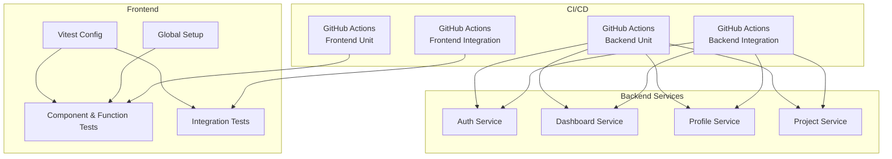
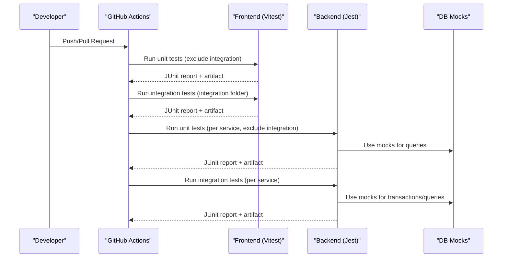
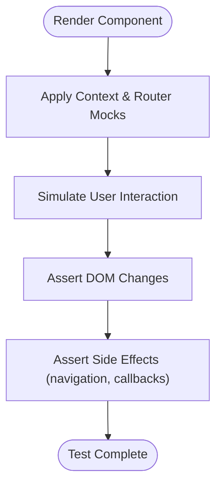
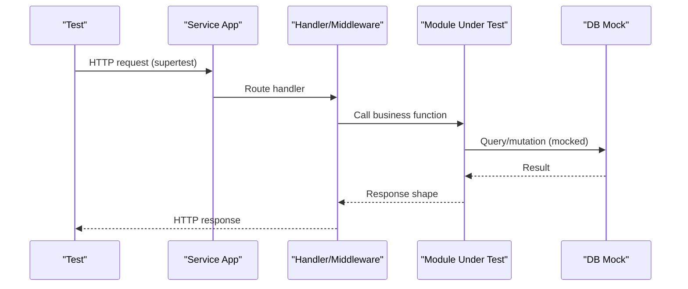
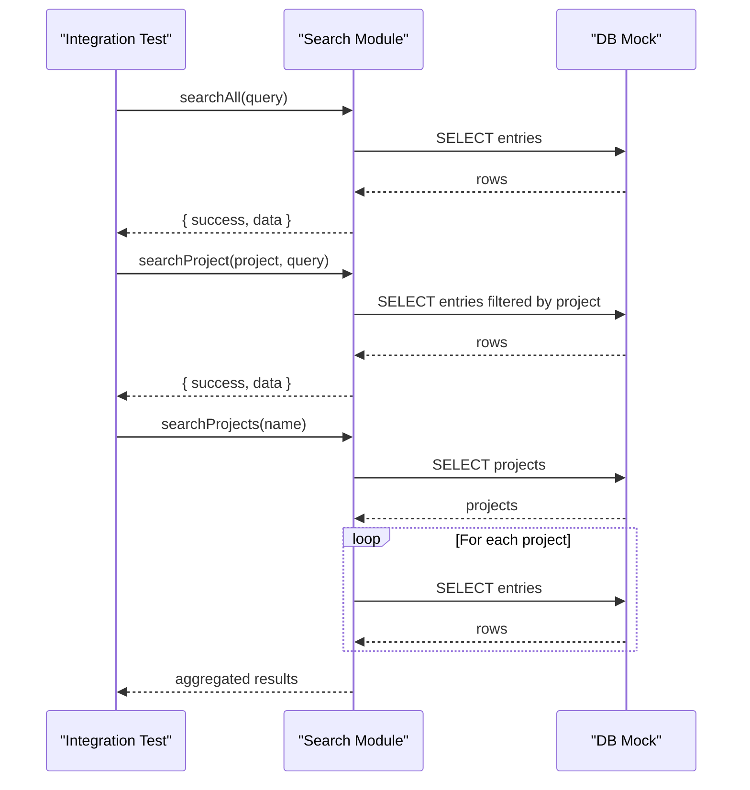
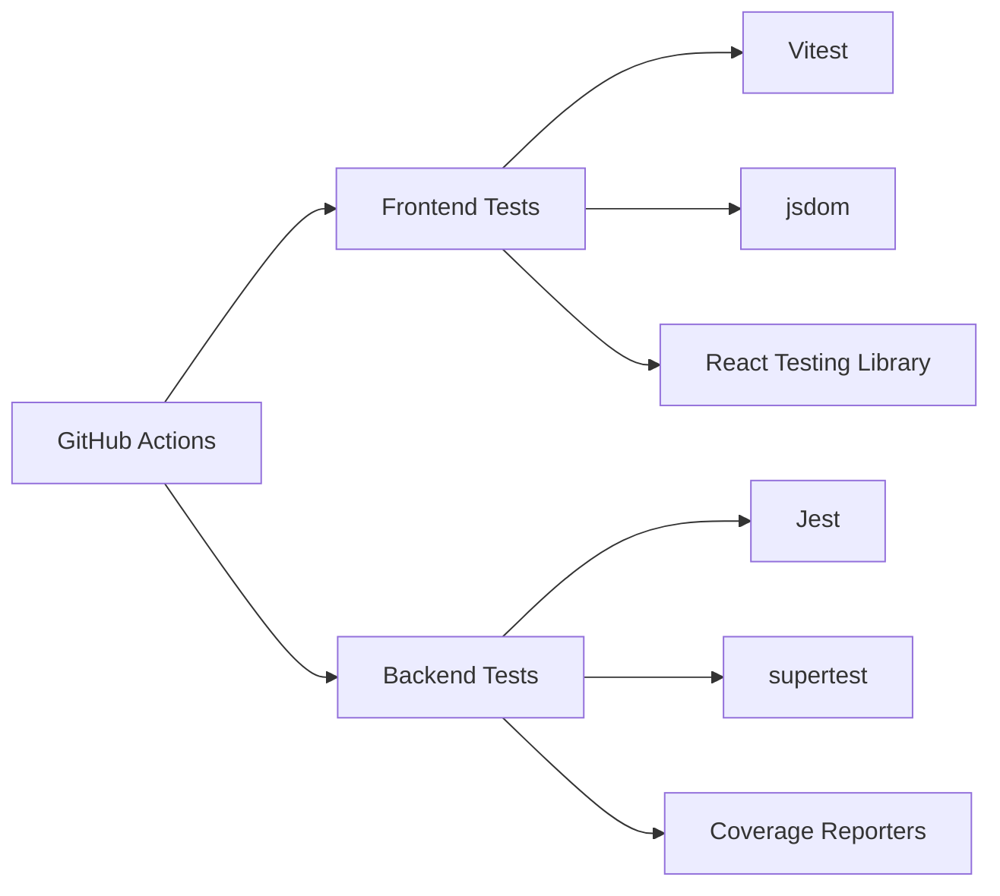

# Testing Strategies

<cite>
**Referenced Files in This Document**
- [TESTING_IMPLEMENTATION.md](file://TESTING_IMPLEMENTATION.md)
- [frontend/vitest.config.ts](file://frontend/vitest.config.ts)
- [frontend/package.json](file://frontend/package.json)
- [frontend/src/test/setup.ts](file://frontend/src/test/setup.ts)
- [frontend/src/components/__tests__/AppShell.test.tsx](file://frontend/src/components/__tests__/AppShell.test.tsx)
- [.github/workflows/frontend-unit-tests.yml](file://.github/workflows/frontend-unit-tests.yml)
- [.github/workflows/frontend-integration-tests.yml](file://.github/workflows/frontend-integration-tests.yml)
- [.github/workflows/backend-unit-tests.yml](file://.github/workflows/backend-unit-tests.yml)
- [.github/workflows/backend-integration-tests.yml](file://.github/workflows/backend-integration-tests.yml)
- [services/auth-service/package.json](file://services/auth-service/package.json)
- [services/dashboard-service/package.json](file://services/dashboard-service/package.json)
- [services/profile-service/package.json](file://services/profile-service/package.json)
- [services/project-service/package.json](file://services/project-service/package.json)
- [services/auth-service/src/__tests__/index.test.js](file://services/auth-service/src/__tests__/index.test.js)
- [services/dashboard-service/src/__tests__/search.integration.test.js](file://services/dashboard-service/src/__tests__/search.integration.test.js)
- [services/profile-service/src/__tests__/user-lifecycle.integration.test.js](file://services/profile-service/src/__tests__/user-lifecycle.integration.test.js)
- [services/project-service/src/__tests__/entries-activity.integration.test.js](file://services/project-service/src/__tests__/entries-activity.integration.test.js)
</cite>

## Table of Contents

1. Introduction
2. Project Structure
3. Core Components
4. Architecture Overview
5. Detailed Component Analysis
6. Dependency Analysis
7. Performance Considerations
8. Troubleshooting Guide
9. Conclusion
10. Appendices

## Introduction

This document defines the comprehensive testing strategy for the full-stack application, covering unit and integration tests across frontend and backend services, end-to-end strategies, CI/CD automation, mocking approaches, test organization and naming conventions, best practices, and guidance for authentication flows, data synchronization, real-time features, performance and load testing, and coverage reporting.

## Project Structure

The repository uses a layered testing approach:

- Frontend (React + Vite): Unit and component tests with Vitest; integration tests under a dedicated folder; jsdom environment; global setup for browser APIs.
- Backend (Node/Express microservices): Unit and integration tests with Jest; per-service configuration; database mocks; service-level HTTP tests using supertest.
- CI/CD: GitHub Actions workflows run separate jobs for frontend unit/integration tests and backend unit/integration tests across all services, producing JUnit artifacts.

**Diagram sources**

- [frontend/vitest.config.ts:1-18](file://frontend/vitest.config.ts#L1-L18)
- [frontend/src/test/setup.ts:1-17](file://frontend/src/test/setup.ts#L1-L17)
- [.github/workflows/frontend-unit-tests.yml:1-58](file://.github/workflows/frontend-unit-tests.yml#L1-L58)
- [.github/workflows/frontend-integration-tests.yml:1-58](file://.github/workflows/frontend-integration-tests.yml#L1-L58)
- [.github/workflows/backend-unit-tests.yml:1-68](file://.github/workflows/backend-unit-tests.yml#L1-L68)
- [.github/workflows/backend-integration-tests.yml:1-68](file://.github/workflows/backend-integration-tests.yml#L1-L68)

**Section sources**

- [frontend/vitest.config.ts:1-18](file://frontend/vitest.config.ts#L1-L18)
- [frontend/package.json:1-45](file://frontend/package.json#L1-L45)
- [frontend/src/test/setup.ts:1-17](file://frontend/src/test/setup.ts#L1-L17)
- [.github/workflows/frontend-unit-tests.yml:1-58](file://.github/workflows/frontend-unit-tests.yml#L1-L58)
- [.github/workflows/frontend-integration-tests.yml:1-58](file://.github/workflows/frontend-integration-tests.yml#L1-L58)
- [.github/workflows/backend-unit-tests.yml:1-68](file://.github/workflows/backend-unit-tests.yml#L1-L68)
- [.github/workflows/backend-integration-tests.yml:1-68](file://.github/workflows/backend-integration-tests.yml#L1-L68)

## Core Components

- Frontend testing stack:
  - Test runner: Vitest with jsdom environment and React plugin.
  - Global setup: matchMedia mock and testing-library matchers.
  - Commands: run, watch, and coverage via npm scripts.
- Backend testing stack:
  - Test runner: Jest with Babel transform for Node services.
  - Coverage: per-service coverage collection excluding tests and mocks.
  - HTTP assertions: supertest used in auth service tests.
  - Database mocking: centralized db module mocks per service.

Key responsibilities:

- Isolate external dependencies (network, DB, third-party SDKs).
- Validate business logic, API contracts, and cross-module flows.
- Ensure deterministic behavior by mocking time and random sources where needed.

**Section sources**

- [frontend/package.json:1-45](file://frontend/package.json#L1-L45)
- [frontend/vitest.config.ts:1-18](file://frontend/vitest.config.ts#L1-L18)
- [frontend/src/test/setup.ts:1-17](file://frontend/src/test/setup.ts#L1-L17)
- [services/auth-service/package.json:1-41](file://services/auth-service/package.json#L1-L41)
- [services/dashboard-service/package.json:1-43](file://services/dashboard-service/package.json#L1-L43)
- [services/profile-service/package.json:1-43](file://services/profile-service/package.json#L1-L43)
- [services/project-service/package.json:1-58](file://services/project-service/package.json#L1-L58)

## Architecture Overview

The testing architecture separates concerns by layer and scope:

- Unit tests validate pure functions, hooks, components, and service modules in isolation.
- Integration tests validate multi-step flows across modules and databases using mocked persistence.
- CI pipelines execute these tests per service and per tier, publishing results as artifacts.

**Diagram sources**

- [.github/workflows/frontend-unit-tests.yml:1-58](file://.github/workflows/frontend-unit-tests.yml#L1-L58)
- [.github/workflows/frontend-integration-tests.yml:1-58](file://.github/workflows/frontend-integration-tests.yml#L1-L58)
- [.github/workflows/backend-unit-tests.yml:1-68](file://.github/workflows/backend-unit-tests.yml#L1-L68)
- [.github/workflows/backend-integration-tests.yml:1-68](file://.github/workflows/backend-integration-tests.yml#L1-L68)

## Detailed Component Analysis

### Frontend Unit Testing (Vitest)

- Environment and setup:
  - jsdom environment configured globally.
  - Global setup provides matchMedia mock and testing-library matchers.
- Component testing patterns:
  - Render components with MemoryRouter to control routing context.
  - Mock contexts (e.g., AuthContext) to isolate UI logic.
  - Simulate user interactions and assert DOM changes and navigation calls.
- Pure function and API layer tests:
  - Network calls are stubbed; errors and responses are asserted.
  - Deterministic time handling is enforced where applicable.

**Diagram sources**

- [frontend/src/components/**tests**/AppShell.test.tsx:1-138](file://frontend/src/components/__tests__/AppShell.test.tsx#L1-L138)
- [frontend/src/test/setup.ts:1-17](file://frontend/src/test/setup.ts#L1-L17)
- [frontend/vitest.config.ts:1-18](file://frontend/vitest.config.ts#L1-L18)

**Section sources**

- [frontend/vitest.config.ts:1-18](file://frontend/vitest.config.ts#L1-L18)
- [frontend/src/test/setup.ts:1-17](file://frontend/src/test/setup.ts#L1-L17)
- [frontend/src/components/**tests**/AppShell.test.tsx:1-138](file://frontend/src/components/__tests__/AppShell.test.tsx#L1-L138)
- [frontend/package.json:1-45](file://frontend/package.json#L1-L45)

### Backend Unit Testing (Jest)

- Service-level HTTP tests:
  - Express apps are created in tests and exercised via supertest.
  - CORS behavior and error handling middleware are validated.
- Module-level tests:
  - Business logic functions are tested in isolation.
  - Database access is abstracted behind a module that can be mocked.

**Diagram sources**

- [services/auth-service/src/**tests**/index.test.js:1-86](file://services/auth-service/src/__tests__/index.test.js#L1-L86)
- [services/auth-service/package.json:1-41](file://services/auth-service/package.json#L1-L41)

**Section sources**

- [services/auth-service/src/**tests**/index.test.js:1-86](file://services/auth-service/src/__tests__/index.test.js#L1-L86)
- [services/auth-service/package.json:1-41](file://services/auth-service/package.json#L1-L41)

### Backend Integration Testing (Jest)

- Cross-module flows:
  - Dashboard search integration validates multi-step queries and result composition.
  - Profile service user lifecycle integrates signup, login checks, username updates, profile retrieval, and soft-delete cascades.
  - Project service entries and activity log integration ensures side effects are recorded and retrievable.
- Database interaction patterns:
  - Centralized db module is mocked to control query outcomes and verify call sequences.
  - Transactions and release semantics are verified where applicable.

**Diagram sources**

- [services/dashboard-service/src/**tests**/search.integration.test.js:1-172](file://services/dashboard-service/src/__tests__/search.integration.test.js#L1-L172)

**Section sources**

- [services/dashboard-service/src/**tests**/search.integration.test.js:1-172](file://services/dashboard-service/src/__tests__/search.integration.test.js#L1-L172)
- [services/profile-service/src/**tests**/user-lifecycle.integration.test.js:1-147](file://services/profile-service/src/__tests__/user-lifecycle.integration.test.js#L1-L147)
- [services/project-service/src/**tests**/entries-activity.integration.test.js:1-155](file://services/project-service/src/__tests__/entries-activity.integration.test.js#L1-L155)

### End-to-End Testing Strategy

- Current state:
  - The repository includes frontend integration tests scoped to specific features (e.g., cache and sync behaviors) executed via Vitest.
  - No explicit E2E framework (e.g., Playwright/Cypress) is present in the analyzed files.
- Recommended approach:
  - Introduce an E2E layer to exercise full user journeys across frontend and backend services.
  - Use service containers or local instances for backend services during E2E runs.
  - Keep E2E suites focused on critical paths (auth, entry creation, dashboard rendering).

[No sources needed since this section proposes conceptual guidance beyond current code]

### Test Organization and Naming Conventions

- Frontend:
  - Co-locate tests next to source in **tests** directories.
  - Use descriptive describe blocks and it() titles reflecting behavior.
  - Group related scenarios (e.g., navigation, rendering, interactions).
- Backend:
  - Separate unit and integration tests by file naming and folder structure.
  - Use integration suffix for cross-module flows.
  - Maintain consistent Arrange → Act → Assert structure within tests.

**Section sources**

- [frontend/src/components/**tests**/AppShell.test.tsx:1-138](file://frontend/src/components/__tests__/AppShell.test.tsx#L1-L138)
- [services/dashboard-service/src/**tests**/search.integration.test.js:1-172](file://services/dashboard-service/src/__tests__/search.integration.test.js#L1-L172)
- [services/profile-service/src/**tests**/user-lifecycle.integration.test.js:1-147](file://services/profile-service/src/__tests__/user-lifecycle.integration.test.js#L1-L147)
- [services/project-service/src/**tests**/entries-activity.integration.test.js:1-155](file://services/project-service/src/__tests__/entries-activity.integration.test.js#L1-L155)

### Mocking Strategies

- Frontend:
  - Network: stub fetch or use service-layer mocks to isolate API calls.
  - Routing: wrap components with MemoryRouter and mock router hooks.
  - Browser APIs: provide matchMedia mock in global setup.
  - Storage: clear localStorage/sessionStorage between tests to avoid pollution.
- Backend:
  - Database: mock the db module to control query results and verify call sequences.
  - External SDKs: mock third-party clients (e.g., AI providers) to prevent network calls.
  - HTTP: use supertest to assert routes without starting a server process.

**Section sources**

- [frontend/src/test/setup.ts:1-17](file://frontend/src/test/setup.ts#L1-L17)
- [frontend/src/components/**tests**/AppShell.test.tsx:1-138](file://frontend/src/components/__tests__/AppShell.test.tsx#L1-L138)
- [services/dashboard-service/src/**tests**/search.integration.test.js:1-172](file://services/dashboard-service/src/__tests__/search.integration.test.js#L1-L172)
- [services/profile-service/src/**tests**/user-lifecycle.integration.test.js:1-147](file://services/profile-service/src/__tests__/user-lifecycle.integration.test.js#L1-L147)
- [services/auth-service/src/**tests**/index.test.js:1-86](file://services/auth-service/src/__tests__/index.test.js#L1-L86)

### Authentication Flows

- Frontend:
  - Mock auth context to simulate signed-in/out states and session management.
  - Verify protected route behavior and redirects based on auth state.
- Backend:
  - Validate CORS policies and error handling for authenticated endpoints.
  - Ensure error responses include appropriate headers and bodies.

**Section sources**

- [frontend/src/components/**tests**/AppShell.test.tsx:1-138](file://frontend/src/components/__tests__/AppShell.test.tsx#L1-L138)
- [services/auth-service/src/**tests**/index.test.js:1-86](file://services/auth-service/src/__tests__/index.test.js#L1-L86)

### Data Synchronization and Real-Time Features

- Data synchronization:
  - Frontend integration tests cover caching and offline queue behaviors.
  - Backend integration tests validate multi-step operations and consistency across modules.
- Real-time features:
  - For Server-Sent Events (SSE), write integration tests that connect to a test server instance and assert event streams.
  - Mock SSE registry and client connections to verify publish/subscribe behavior deterministically.

**Section sources**

- [services/dashboard-service/src/**tests**/search.integration.test.js:1-172](file://services/dashboard-service/src/__tests__/search.integration.test.js#L1-L172)
- [services/project-service/src/**tests**/entries-activity.integration.test.js:1-155](file://services/project-service/src/__tests__/entries-activity.integration.test.js#L1-L155)

### Performance and Load Testing

- Unit and integration tests should remain fast and deterministic; avoid heavy I/O.
- For performance validation:
  - Add dedicated benchmarks or load tests outside the main test suite.
  - Use tools like k6 or Artillery to simulate concurrent requests against backend services.
  - Measure latency, throughput, and resource usage under load.
- Integrate load tests into a separate CI job that does not block merges but reports regressions.

[No sources needed since this section provides general guidance]

### Test Coverage Reporting

- Frontend:
  - Use Vitest coverage reporter to generate coverage metrics.
  - Configure thresholds if desired to enforce minimum coverage.
- Backend:
  - Each service configures Jest coverage collection excluding tests and mocks.
  - Generate text-summary and json-summary reporters for dashboards and badges.

**Section sources**

- [frontend/package.json:1-45](file://frontend/package.json#L1-L45)
- [services/auth-service/package.json:1-41](file://services/auth-service/package.json#L1-L41)
- [services/dashboard-service/package.json:1-43](file://services/dashboard-service/package.json#L1-L43)
- [services/profile-service/package.json:1-43](file://services/profile-service/package.json#L1-L43)
- [services/project-service/package.json:1-58](file://services/project-service/package.json#L1-L58)

## Dependency Analysis

Testing dependencies are organized per layer:

- Frontend: Vitest, jsdom, React Testing Library, User Event, coverage reporter.
- Backend: Jest, Babel/Jest transform, supertest, per-service coverage reporters.
- CI: GitHub Actions orchestrate test execution and artifact publication.

**Diagram sources**

- [frontend/package.json:1-45](file://frontend/package.json#L1-L45)
- [services/auth-service/package.json:1-41](file://services/auth-service/package.json#L1-L41)
- [services/dashboard-service/package.json:1-43](file://services/dashboard-service/package.json#L1-L43)
- [services/profile-service/package.json:1-43](file://services/profile-service/package.json#L1-L43)
- [services/project-service/package.json:1-58](file://services/project-service/package.json#L1-L58)

**Section sources**

- [frontend/package.json:1-45](file://frontend/package.json#L1-L45)
- [services/auth-service/package.json:1-41](file://services/auth-service/package.json#L1-L41)
- [services/dashboard-service/package.json:1-43](file://services/dashboard-service/package.json#L1-L43)
- [services/profile-service/package.json:1-43](file://services/profile-service/package.json#L1-L43)
- [services/project-service/package.json:1-58](file://services/project-service/package.json#L1-L58)

## Performance Considerations

- Keep unit tests fast by mocking I/O and avoiding real network calls.
- Use isolated test environments to prevent shared state leakage.
- Prefer deterministic mocks over flaky integrations in unit tests.
- Reserve heavier integration tests for dedicated jobs with longer timeouts.
- Monitor test execution times in CI and optimize slow tests.

[No sources needed since this section provides general guidance]

## Troubleshooting Guide

Common issues and resolutions:

- Flaky tests due to shared state:
  - Clear mocks and storage in beforeEach; reset mocks after each test.
- Time-dependent tests:
  - Freeze time or inject fixed timestamps to ensure determinism.
- Network failures:
  - Stub fetch or service calls; assert error shapes and retry behavior.
- Database connectivity:
  - Ensure db mocks return expected structures; verify transaction sequences in integration tests.
- CI timeouts:
  - Increase timeouts only when necessary; optimize slow tests first.

**Section sources**

- [services/dashboard-service/src/**tests**/search.integration.test.js:1-172](file://services/dashboard-service/src/__tests__/search.integration.test.js#L1-L172)
- [services/profile-service/src/**tests**/user-lifecycle.integration.test.js:1-147](file://services/profile-service/src/__tests__/user-lifecycle.integration.test.js#L1-L147)
- [services/project-service/src/**tests**/entries-activity.integration.test.js:1-155](file://services/project-service/src/__tests__/entries-activity.integration.test.js#L1-L155)

## Conclusion

The testing strategy combines robust unit and integration tests across frontend and backend layers, orchestrated by CI/CD pipelines. It emphasizes isolation through mocking, deterministic behavior, and clear separation of concerns. Extending coverage to E2E and performance testing will further strengthen confidence in system reliability and scalability.

[No sources needed since this section summarizes without analyzing specific files]

## Appendices

### CI/CD Pipelines Summary

- Frontend:
  - Unit tests: run Vitest excluding integration folder; publish JUnit results.
  - Integration tests: run Vitest on integration folder; publish JUnit results.
- Backend:
  - Unit tests: run Jest excluding integration files per service; publish JUnit results.
  - Integration tests: run Jest on integration files per service; publish JUnit results.

**Section sources**

- [.github/workflows/frontend-unit-tests.yml:1-58](file://.github/workflows/frontend-unit-tests.yml#L1-L58)
- [.github/workflows/frontend-integration-tests.yml:1-58](file://.github/workflows/frontend-integration-tests.yml#L1-L58)
- [.github/workflows/backend-unit-tests.yml:1-68](file://.github/workflows/backend-unit-tests.yml#L1-L68)
- [.github/workflows/backend-integration-tests.yml:1-68](file://.github/workflows/backend-integration-tests.yml#L1-L68)

### Best Practices Checklist

- Always mock external dependencies (network, DB, third-party SDKs).
- Keep tests small, focused, and independent.
- Use meaningful test names that describe behavior.
- Assert both positive and negative cases.
- Ensure cleanup in afterEach to prevent test pollution.
- Track coverage trends and set reasonable thresholds.

[No sources needed since this section provides general guidance]
