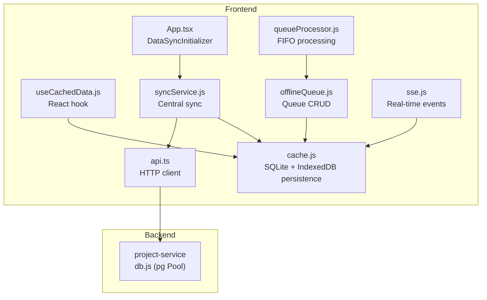
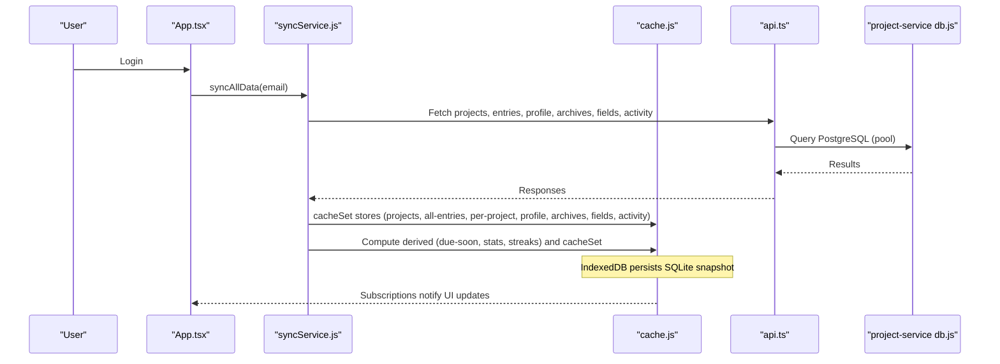
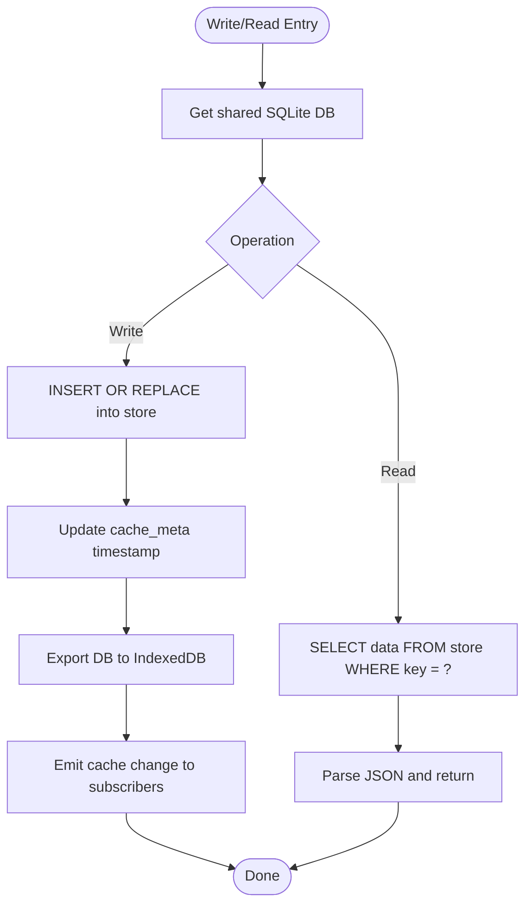
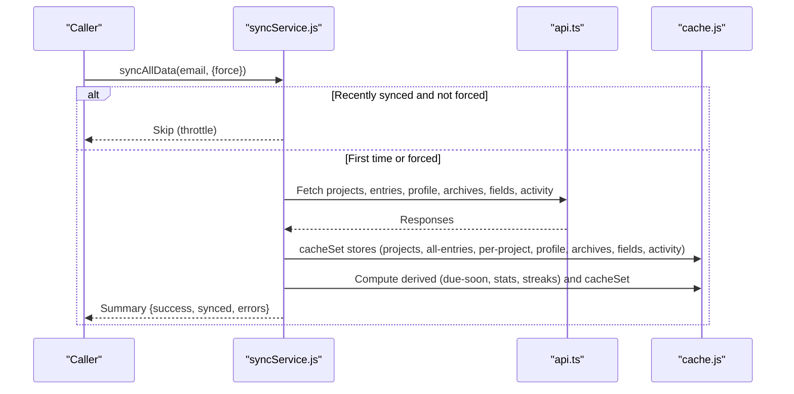
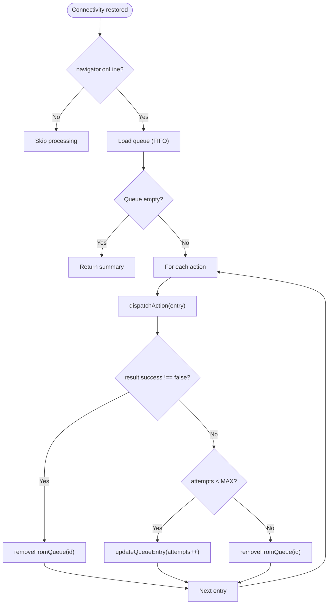
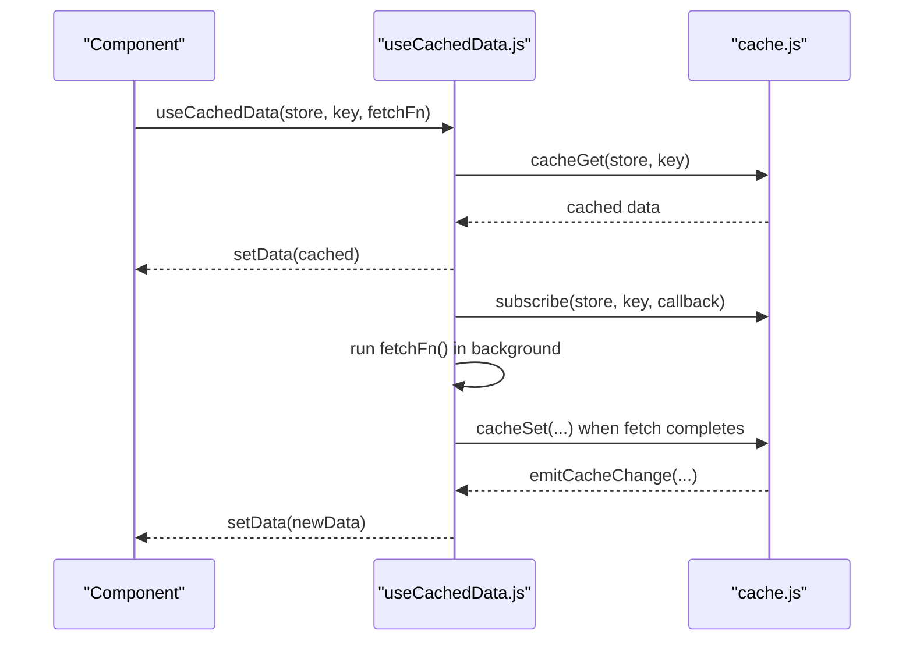
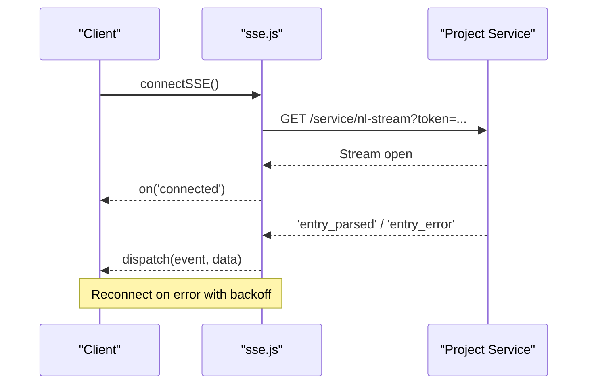
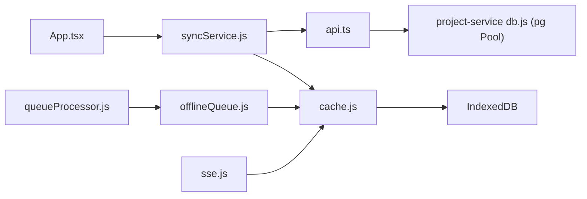

# Caching Optimization Strategies

<cite>
**Referenced Files in This Document**
- [cache.js](file://frontend/src/lib/cache.js)
- [useCachedData.js](file://frontend/src/hooks/useCachedData.js)
- [syncService.js](file://frontend/src/CacheFunctions/syncService.js)
- [offlineQueue.js](file://frontend/src/CacheFunctions/offlineQueue.js)
- [queueProcessor.js](file://frontend/src/CacheFunctions/queueProcessor.js)
- [index.js](file://frontend/src/CacheFunctions/index.js)
- [sse.js](file://frontend/src/lib/sse.js)
- [api.ts](file://frontend/src/lib/api.ts)
- [db.js](file://services/project-service/src/db.js)
- [caching.md](file://docs-site/docs/Architecture/caching.md)
- [App.tsx](file://frontend/src/App.tsx)
</cite>

## Table of Contents

1. Introduction
2. Project Structure
3. Core Components
4. Architecture Overview
5. Detailed Component Analysis
6. Dependency Analysis
7. Performance Considerations
8. Troubleshooting Guide
9. Conclusion
10. Appendices

## Introduction

This document explains the caching optimization strategies implemented in the Codacaine application, focusing on a local-first architecture backed by an IndexedDB-persisted SQLite layer. It covers cache invalidation policies, storage and memory management, API response caching patterns (including conditional requests and ETag considerations), database query optimization via result caching and connection pooling, and offline synchronization with conflict handling. It also provides guidance for effective cache keys, size limits, and performance recommendations across different data access patterns.

## Project Structure

The caching system is centered around:

- A local-first sync service that warms IndexedDB on login and keeps it consistent with the server.
- An IndexedDB-backed SQLite cache with event-driven subscriptions to update UI instantly.
- An offline queue for mutations when connectivity is unavailable.
- Real-time updates via Server-Sent Events (SSE) to invalidate or refresh caches.
- Backend PostgreSQL connection pooling for efficient database access.

**Diagram sources**

- [App.tsx:43-61](file://frontend/src/App.tsx#L43-L61)
- [useCachedData.js:23-76](file://frontend/src/hooks/useCachedData.js#L23-L76)
- [cache.js:74-171](file://frontend/src/lib/cache.js#L74-L171)
- [syncService.js:75-101](file://frontend/src/CacheFunctions/syncService.js#L75-L101)
- [offlineQueue.js:21-44](file://frontend/src/CacheFunctions/offlineQueue.js#L21-L44)
- [queueProcessor.js:21-90](file://frontend/src/CacheFunctions/queueProcessor.js#L21-L90)
- [sse.js:37-101](file://frontend/src/lib/sse.js#L37-L101)
- [api.ts:10-57](file://frontend/src/lib/api.ts#L10-L57)
- [db.js:9-31](file://services/project-service/src/db.js#L9-L31)

**Section sources**

- [caching.md:1-53](file://docs-site/docs/Architecture/caching.md#L1-L53)
- [App.tsx:43-61](file://frontend/src/App.tsx#L43-L61)

## Core Components

- Local-first cache layer: SQLite in-memory with IndexedDB persistence, providing fast reads/writes and durability.
- Centralized sync service: Orchestrates full data warm-up and derived computations without redundant network calls.
- Offline mutation queue: Ensures operations are retried and applied when connectivity returns.
- React hooks: Provide immediate cached reads and subscription-based re-renders on cache changes.
- SSE integration: Enables real-time cache invalidation and updates.
- Backend connection pooling: Optimizes database throughput and latency.

Key responsibilities:

- Read path: Return cached data immediately; optionally revalidate in background.
- Write path: Optimistic write to cache; persist to server; queue if offline or failed.
- Invalidation: Event-driven updates from SSE or explicit triggers; timestamps support staleness checks.

**Section sources**

- [cache.js:1-11](file://frontend/src/lib/cache.js#L1-L11)
- [syncService.js:1-36](file://frontend/src/CacheFunctions/syncService.js#L1-L36)
- [offlineQueue.js:1-7](file://frontend/src/CacheFunctions/offlineQueue.js#L1-L7)
- [useCachedData.js:1-18](file://frontend/src/hooks/useCachedData.js#L1-L18)
- [sse.js:1-8](file://frontend/src/lib/sse.js#L1-L8)
- [db.js:9-31](file://services/project-service/src/db.js#L9-L31)

## Architecture Overview

The application follows a local-first pattern:

- On login, a DataSyncInitializer triggers a full sync to populate IndexedDB.
- Pages read exclusively from IndexedDB via hooks and cache utilities.
- Mutations write to IndexedDB first (optimistic), then sync to the server; failures are queued.
- Derived views (e.g., due-soon, stats, streaks) are computed locally from cached entries.
- SSE pushes trigger cache invalidation and UI updates.

**Diagram sources**

- [App.tsx:43-61](file://frontend/src/App.tsx#L43-L61)
- [syncService.js:75-101](file://frontend/src/CacheFunctions/syncService.js#L75-L101)
- [syncService.js:156-386](file://frontend/src/CacheFunctions/syncService.js#L156-L386)
- [cache.js:74-171](file://frontend/src/lib/cache.js#L74-L171)
- [api.ts:10-57](file://frontend/src/lib/api.ts#L10-L57)
- [db.js:9-31](file://services/project-service/src/db.js#L9-L31)

## Detailed Component Analysis

### IndexedDB-backed SQLite Cache Layer

- Storage model: Tables mirror Supabase schema; each table has key and JSON data columns. A metadata table tracks timestamps for staleness checks.
- Persistence: The SQLite database is exported to a Blob and stored in IndexedDB for durability across sessions.
- Event system: Subscribers receive updates when cache entries change, enabling instant UI reactivity.
- Staleness and revalidation: Timestamps enable stale-while-revalidate behavior; consumers can choose maxAge thresholds.

**Diagram sources**

- [cache.js:74-171](file://frontend/src/lib/cache.js#L74-L171)
- [cache.js:179-223](file://frontend/src/lib/cache.js#L179-L223)
- [cache.js:225-241](file://frontend/src/lib/cache.js#L225-L241)
- [cache.js:243-263](file://frontend/src/lib/cache.js#L243-L263)

**Section sources**

- [cache.js:15-30](file://frontend/src/lib/cache.js#L15-L30)
- [cache.js:74-171](file://frontend/src/lib/cache.js#L74-L171)
- [cache.js:179-223](file://frontend/src/lib/cache.js#L179-L223)
- [cache.js:225-241](file://frontend/src/lib/cache.js#L225-L241)
- [cache.js:243-263](file://frontend/src/lib/cache.js#L243-L263)

### Centralized Sync Service

- Warm-up: On app load, syncAllData fetches all user data and populates multiple stores.
- Throttling and deduplication: Prevents duplicate concurrent syncs and throttles full syncs to once every configured interval unless forced.
- Error isolation: Each fetch is wrapped so one failure does not block others.
- Derived computation: Computes due-soon, stats, and streaks locally from cached entries to avoid extra network calls.
- Guard against empty overwrites: Skips writing empty arrays when existing cache holds valid data.

**Diagram sources**

- [syncService.js:75-101](file://frontend/src/CacheFunctions/syncService.js#L75-L101)
- [syncService.js:156-386](file://frontend/src/CacheFunctions/syncService.js#L156-L386)

**Section sources**

- [syncService.js:75-101](file://frontend/src/CacheFunctions/syncService.js#L75-L101)
- [syncService.js:156-386](file://frontend/src/CacheFunctions/syncService.js#L156-L386)
- [caching.md:186-213](file://docs-site/docs/Architecture/caching.md#L186-L213)

### Offline Queue and Processing

- Queue storage: Actions are persisted in SQLite under a dedicated store with FIFO ordering by creation time.
- Processing: When online, actions are dispatched in order with retry logic up to a maximum attempt count.
- Progress reporting: Callbacks provide success, retry, and failure events for UI feedback.

**Diagram sources**

- [queueProcessor.js:21-90](file://frontend/src/CacheFunctions/queueProcessor.js#L21-L90)
- [offlineQueue.js:21-44](file://frontend/src/CacheFunctions/offlineQueue.js#L21-L44)
- [offlineQueue.js:50-63](file://frontend/src/CacheFunctions/offlineQueue.js#L50-L63)
- [offlineQueue.js:88-97](file://frontend/src/CacheFunctions/offlineQueue.js#L88-L97)
- [offlineQueue.js:104-114](file://frontend/src/CacheFunctions/offlineQueue.js#L104-L114)

**Section sources**

- [offlineQueue.js:21-44](file://frontend/src/CacheFunctions/offlineQueue.js#L21-L44)
- [offlineQueue.js:50-63](file://frontend/src/CacheFunctions/offlineQueue.js#L50-L63)
- [offlineQueue.js:88-97](file://frontend/src/CacheFunctions/offlineQueue.js#L88-L97)
- [offlineQueue.js:104-114](file://frontend/src/CacheFunctions/offlineQueue.js#L104-L114)
- [queueProcessor.js:21-90](file://frontend/src/CacheFunctions/queueProcessor.js#L21-L90)

### React Hook for Cached Data

- Immediate read: Reads from IndexedDB synchronously within effect to display cached data instantly.
- Subscription: Listens for cache changes to re-render UI without additional network calls.
- Background fetch: Optionally runs a fetch function to refresh data and write back to cache.

**Diagram sources**

- [useCachedData.js:23-76](file://frontend/src/hooks/useCachedData.js#L23-L76)
- [cache.js:35-72](file://frontend/src/lib/cache.js#L35-L72)

**Section sources**

- [useCachedData.js:23-76](file://frontend/src/hooks/useCachedData.js#L23-L76)

### Real-Time Cache Invalidation via SSE

- Connection: Establishes a persistent SSE connection with token authentication and exponential backoff reconnection.
- Events: Receives named events (e.g., connected, entry_parsed, entry_error) and dispatches to listeners.
- Integration: Consumers can listen to events to invalidate or refresh specific cache entries.

**Diagram sources**

- [sse.js:37-101](file://frontend/src/lib/sse.js#L37-L101)
- [sse.js:142-158](file://frontend/src/lib/sse.js#L142-L158)

**Section sources**

- [sse.js:37-101](file://frontend/src/lib/sse.js#L37-L101)
- [sse.js:142-158](file://frontend/src/lib/sse.js#L142-L158)

### API Response Caching Strategy

- Pattern: Stale-while-revalidate using cache timestamps and optional maxAge thresholds.
- Conditional requests: The current HTTP client does not implement If-None-Match/ETag or If-Modified-Since headers; consider adding them to reduce bandwidth and server load.
- Cache warming: Full sync on login pre-populates all stores; derived data is computed locally to avoid extra requests.

Recommendations:

- Add ETag/Last-Modified handling to GET endpoints where appropriate.
- Use cache headers on backend responses to inform client-side TTL and validation.
- Implement conditional fetch wrappers that respect ETags and skip writes when unchanged.

**Section sources**

- [cache.js:292-346](file://frontend/src/lib/cache.js#L292-L346)
- [api.ts:10-57](file://frontend/src/lib/api.ts#L10-L57)
- [syncService.js:75-101](file://frontend/src/CacheFunctions/syncService.js#L75-L101)

### Database Query Optimization

- Result caching: All entries are fetched once and split into per-project caches locally, avoiding repeated queries.
- Derived computations: Stats, streaks, and due-soon lists are computed from cached entries, eliminating extra server calls.
- Connection pooling: Backend uses a PostgreSQL pool configured with SSL for Supabase-hosted databases.

Optimization tips:

- Ensure indexes exist for frequently filtered columns (e.g., project_name, due_date).
- Batch related reads where possible at the service layer.
- Monitor slow queries and adjust pagination or projections to minimize payload sizes.

**Section sources**

- [syncService.js:241-277](file://frontend/src/CacheFunctions/syncService.js#L241-L277)
- [syncService.js:348-386](file://frontend/src/CacheFunctions/syncService.js#L348-L386)
- [db.js:9-31](file://services/project-service/src/db.js#L9-L31)

### Effective Cache Keys, Size Limits, and Conflict Handling

- Cache keys:
  - Use stable, scoped keys such as email for global stores and email:projectName for per-project entries.
  - Include entity identifiers and version/timestamps where necessary to prevent collisions.
- Size limits:
  - Monitor IndexedDB usage and prune infrequently accessed data (e.g., old archives or search results).
  - Consider implementing LRU eviction for large stores like search or activities.
- Conflicts during offline sync:
  - Prefer optimistic writes with rollback on failure.
  - Use server-side conflict resolution (e.g., last-write-wins with versioning) and reconcile client state accordingly.
  - Leverage the offline queue to serialize and retry conflicting operations.

**Section sources**

- [caching.md:222-233](file://docs-site/docs/Architecture/caching.md#L222-L233)
- [cache.js:179-223](file://frontend/src/lib/cache.js#L179-L223)
- [queueProcessor.js:21-90](file://frontend/src/CacheFunctions/queueProcessor.js#L21-L90)

## Dependency Analysis

- Frontend modules depend on:
  - cache.js for storage and events
  - syncService.js for orchestration and derived computations
  - offlineQueue.js and queueProcessor.js for offline resilience
  - sse.js for real-time invalidation
  - api.ts for authenticated HTTP requests
- Backend module depends on:
  - pg Pool for efficient database connections

**Diagram sources**

- [App.tsx:43-61](file://frontend/src/App.tsx#L43-L61)
- [syncService.js:75-101](file://frontend/src/CacheFunctions/syncService.js#L75-L101)
- [cache.js:74-171](file://frontend/src/lib/cache.js#L74-L171)
- [offlineQueue.js:21-44](file://frontend/src/CacheFunctions/offlineQueue.js#L21-L44)
- [queueProcessor.js:21-90](file://frontend/src/CacheFunctions/queueProcessor.js#L21-L90)
- [sse.js:37-101](file://frontend/src/lib/sse.js#L37-L101)
- [api.ts:10-57](file://frontend/src/lib/api.ts#L10-L57)
- [db.js:9-31](file://services/project-service/src/db.js#L9-L31)

**Section sources**

- [index.js:1-31](file://frontend/src/CacheFunctions/index.js#L1-L31)

## Performance Considerations

- First-load vs subsequent loads:
  - Initial load may incur network costs to warm cache; subsequent navigations are near-instant from IndexedDB.
- Network efficiency:
  - Avoid redundant server calls by computing derived data locally and splitting datasets into per-project caches.
- Concurrency control:
  - Throttle full syncs and prevent duplicate concurrent syncs to reduce server pressure.
- Memory management:
  - Periodically audit large stores (search, activities) and implement pruning or LRU eviction if needed.
  - Ensure proper cleanup of SSE listeners and cache subscriptions to avoid leaks.

[No sources needed since this section provides general guidance]

## Troubleshooting Guide

Common issues and resolutions:

- Stale data after SSE updates:
  - Ensure SSE listeners trigger cache invalidation and re-read from IndexedDB.
- Duplicate syncs or excessive network traffic:
  - Verify throttle and deduplication logic in sync service; force refresh only when necessary.
- Offline mutations not syncing:
  - Confirm queue processing runs on connectivity restoration and retries are configured correctly.
- Empty overwrites clobbering cache:
  - Rely on guard logic that skips writing empty arrays when existing cache holds valid data.

**Section sources**

- [syncService.js:217-281](file://frontend/src/CacheFunctions/syncService.js#L217-L281)
- [queueProcessor.js:21-90](file://frontend/src/CacheFunctions/queueProcessor.js#L21-L90)
- [sse.js:37-101](file://frontend/src/lib/sse.js#L37-L101)

## Conclusion

Codacaine’s caching strategy centers on a robust local-first architecture with IndexedDB-persisted SQLite, centralized synchronization, offline resilience, and real-time invalidation. By computing derived data locally, splitting datasets efficiently, and leveraging connection pooling on the backend, the application achieves fast, reliable, and scalable data access. Extending API caching with ETag support and refining size limits will further enhance performance and resource efficiency.

[No sources needed since this section summarizes without analyzing specific files]

## Appendices

### Appendix A: Cache Stores and Key Patterns

- Global stores keyed by email:
  - projects, all-entries, profile, archives, fields, activity
- Per-project stores:
  - entries keyed by email:projectName
- Derived stores:
  - due-soon, stats, streaks keyed by email:derived-name

**Section sources**

- [caching.md:222-233](file://docs-site/docs/Architecture/caching.md#L222-L233)

### Appendix B: SSE Event Integration Points

- Connect on app start and reconnect with backoff.
- Listen for events to invalidate or refresh relevant cache entries.
- Unsubscribe listeners on component unmount to prevent leaks.

**Section sources**

- [sse.js:37-101](file://frontend/src/lib/sse.js#L37-L101)
- [sse.js:142-158](file://frontend/src/lib/sse.js#L142-L158)
