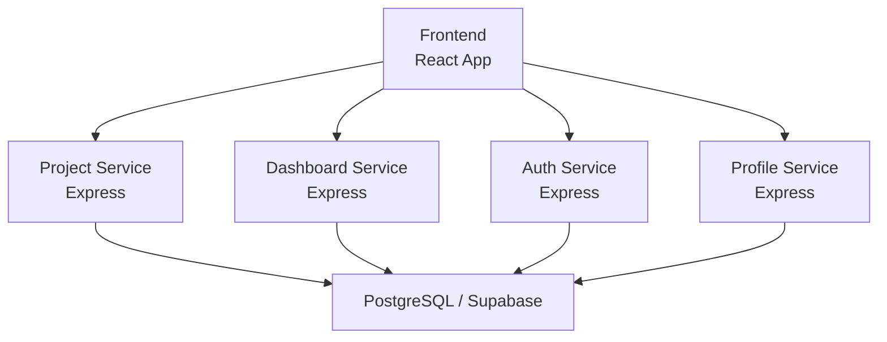
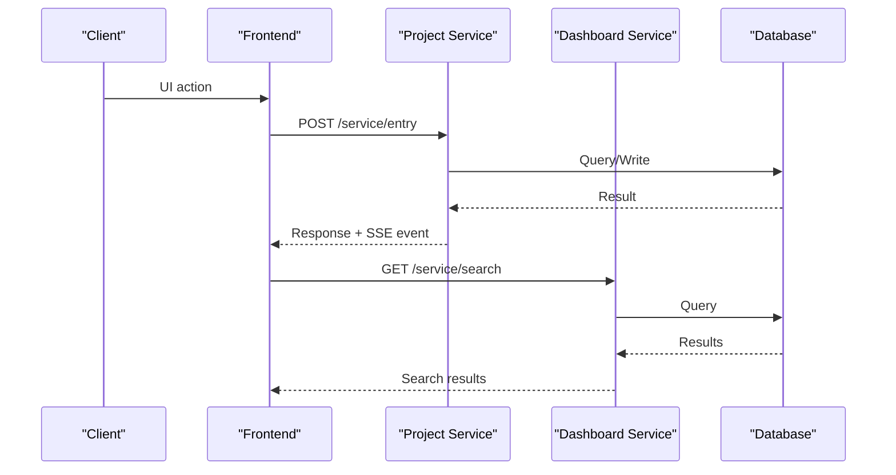
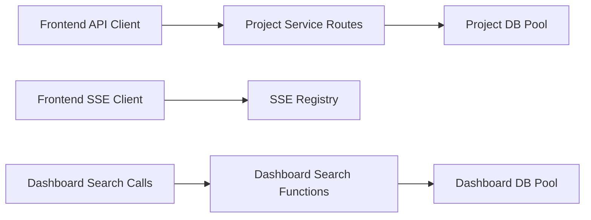

# Performance Metrics Collection

<cite>
**Referenced Files in This Document**
- [services/dashboard-service/src/index.js](file://services/dashboard-service/src/index.js)
- [services/dashboard-service/src/functions/daemon.js](file://services/dashboard-service/src/functions/daemon.js)
- [services/dashboard-service/src/db.js](file://services/dashboard-service/src/db.js)
- [services/project-service/src/index.js](file://services/project-service/src/index.js)
- [services/project-service/src/Routes/entries.js](file://services/project-service/src/Routes/entries.js)
- [services/project-service/src/functions/sseRegistry.js](file://services/project-service/src/functions/sseRegistry.js)
- [services/auth-service/src/index.js](file://services/auth-service/src/index.js)
- [services/profile-service/src/index.js](file://services/profile-service/src/index.js)
- [frontend/src/lib/api.ts](file://frontend/src/lib/api.ts)
- [frontend/src/lib/sse.js](file://frontend/src/lib/sse.js)
- [services/dashboard-service/src/functions/search.js](file://services/dashboard-service/src/functions/search.js)
- [services/project-service/docs/openapi.yaml](file://services/project-service/docs/openapi.yaml)
</cite>

## Table of Contents

1. Introduction
2. Project Structure
3. Core Components
4. Architecture Overview
5. Detailed Component Analysis
6. Dependency Analysis
7. Performance Considerations
8. Troubleshooting Guide
9. Conclusion
10. Appendices

## Introduction

This document explains how to implement and configure performance metrics collection for the Codacaine application across API response times, database query performance, microservice health checks, custom business metrics (search, entry CRUD, authentication), Prometheus-compatible endpoints, frontend performance via browser APIs, and real-time SSE connection performance. It provides concrete guidance on where to instrument code and how to expose metrics for monitoring systems like Prometheus.

## Project Structure

Codacaine is a multi-service Node.js backend with a React frontend:

- Services:
  - Dashboard service: search and health ping
  - Project service: entries, projects, fields, priority, archive, activity, AI, notes, notifications, SSE streaming
  - Auth service: authentication health endpoint
  - Profile service: login and profile routes
- Frontend:
  - Centralized HTTP client with timing logs
  - SSE client with reconnection and event handling
  - Utilities for local tracking (e.g., recently viewed)

**Diagram sources**

- [services/project-service/src/index.js:23-93](file://services/project-service/src/index.js#L23-L93)
- [services/dashboard-service/src/index.js:9-52](file://services/dashboard-service/src/index.js#L9-L52)
- [services/auth-service/src/index.js:39-57](file://services/auth-service/src/index.js#L39-L57)
- [services/profile-service/src/index.js:9-55](file://services/profile-service/src/index.js#L9-L55)

**Section sources**

- [services/project-service/src/index.js:23-93](file://services/project-service/src/index.js#L23-L93)
- [services/dashboard-service/src/index.js:9-52](file://services/dashboard-service/src/index.js#L9-L52)
- [services/auth-service/src/index.js:39-57](file://services/auth-service/src/index.js#L39-L57)
- [services/profile-service/src/index.js:9-55](file://services/profile-service/src/index.js#L9-L55)

## Core Components

- Database pools are created per service and verified at startup. These are ideal places to add pool-level metrics (active/idle connections, queue length).
- Each Express app exposes a root health endpoint and mounts service routes under /service.
- The dashboard service includes a health-ping endpoint that pings the database to keep services warm.
- The project service manages SSE connections and broadcasts events to users.
- The frontend centralizes HTTP requests and logs timing; it also manages SSE connections with exponential backoff.

Key implementation points:

- Add Prometheus metrics libraries and register counters/histograms/gauges around request handlers and DB calls.
- Expose a /metrics endpoint on each service for Prometheus scraping.
- Instrument frontend fetch calls and SSE lifecycle events using browser APIs.

**Section sources**

- [services/dashboard-service/src/db.js:1-32](file://services/dashboard-service/src/db.js#L1-L32)
- [services/project-service/src/db.js:1-32](file://services/project-service/src/db.js#L1-L32)
- [services/dashboard-service/src/index.js:48-67](file://services/dashboard-service/src/index.js#L48-L67)
- [services/project-service/src/index.js:76-93](file://services/project-service/src/index.js#L76-L93)
- [services/auth-service/src/index.js:50-57](file://services/auth-service/src/index.js#L50-L57)
- [services/profile-service/src/index.js:50-55](file://services/profile-service/src/index.js#L50-L55)
- [frontend/src/lib/api.ts:10-57](file://frontend/src/lib/api.ts#L10-L57)
- [frontend/src/lib/sse.js:37-119](file://frontend/src/lib/sse.js#L37-L119)

## Architecture Overview

The request flow spans multiple services and databases. To collect meaningful metrics:

- Wrap each route handler with middleware that records start/end time, status code, method, path, and user context when available.
- Record DB query durations and pool utilization at the pool level.
- Track SSE connection lifecycle (connect, reconnect attempts, disconnect) and message throughput.
- Expose a unified /metrics endpoint per service for Prometheus.

**Diagram sources**

- [services/project-service/src/Routes/entries.js:243-261](file://services/project-service/src/Routes/entries.js#L243-L261)
- [services/dashboard-service/src/functions/search.js:4-23](file://services/dashboard-service/src/functions/search.js#L4-L23)
- [frontend/src/lib/api.ts:10-57](file://frontend/src/lib/api.ts#L10-L57)

## Detailed Component Analysis

### API Response Time Metrics

Implement request-scoped metrics in each Express app:

- Use a middleware to record latency histograms by route and status code.
- Include labels such as method, path, status, and service name.
- Expose a /metrics endpoint for Prometheus scraping.

Where to apply:

- Project service: mount middleware before routes.
- Dashboard service: mount middleware before routes.
- Auth and profile services: mount middleware before routes.

Prometheus exposure:

- Add a /metrics route that returns current metrics in Prometheus text format.

**Section sources**

- [services/project-service/src/index.js:76-93](file://services/project-service/src/index.js#L76-L93)
- [services/dashboard-service/src/index.js:48-67](file://services/dashboard-service/src/index.js#L48-L67)
- [services/auth-service/src/index.js:50-57](file://services/auth-service/src/index.js#L50-L57)
- [services/profile-service/src/index.js:50-55](file://services/profile-service/src/index.js#L50-L55)

### Database Query Performance Metrics

Instrument PostgreSQL pool usage:

- Track active connections, idle connections, total acquired/released, and wait queue size.
- Record per-query duration histograms with labels for query type or function name.
- Log pool initialization and connection failures.

Where to apply:

- Create a shared db instrumentation module per service that wraps pg.Pool methods or uses pool event listeners.
- Ensure pool verification logs are present at startup.

**Section sources**

- [services/dashboard-service/src/db.js:1-32](file://services/dashboard-service/src/db.js#L1-L32)
- [services/project-service/src/db.js:1-32](file://services/project-service/src/db.js#L1-L32)

### Microservice Health Checks

Each service already exposes a root health endpoint. Enhance these to include dependency checks:

- Database connectivity check
- Optional downstream service checks
- Return detailed status and timestamps

Prometheus integration:

- Add a readiness/liveness probe endpoint suitable for orchestration platforms.
- Optionally expose a combined health summary metric for dashboards.

**Section sources**

- [services/project-service/src/index.js:76-78](file://services/project-service/src/index.js#L76-L78)
- [services/dashboard-service/src/index.js:48-50](file://services/dashboard-service/src/index.js#L48-L50)
- [services/auth-service/src/index.js:50-52](file://services/auth-service/src/index.js#L50-L52)
- [services/profile-service/src/index.js:50-52](file://services/profile-service/src/index.js#L50-L52)

### Custom Metrics for Search Operations

Search operations span both dashboard and project contexts:

- Dashboard search: measure end-to-end latency and DB query durations.
- Project service search (if implemented): similar instrumentation.

Recommended metrics:

- Histogram: search_request_duration_seconds
- Counter: search_requests_total by function (searchAll, searchProject, searchProjects)
- Gauge: search_results_count

Where to apply:

- Around Search class methods in the dashboard service.

**Section sources**

- [services/dashboard-service/src/functions/search.js:4-76](file://services/dashboard-service/src/functions/search.js#L4-L76)

### Custom Metrics for Entry CRUD Operations

Entry CRUD endpoints should track:

- Request latency histogram by operation (create, read, update, delete)
- Error rate counter by operation and error category
- DB write/read counts and durations

Where to apply:

- Project service entry routes and natural language entry handler.

**Section sources**

- [services/project-service/src/Routes/entries.js:243-261](file://services/project-service/src/Routes/entries.js#L243-L261)

### Custom Metrics for Authentication Flows

Authentication flows should capture:

- Login attempt count and success/failure rates
- Token issuance latency
- Middleware auth errors

Where to apply:

- Auth service and any JWT validation middleware in other services.

**Section sources**

- [services/auth-service/src/index.js:50-57](file://services/auth-service/src/index.js#L50-L57)
- [services/project-service/src/index.js:83-93](file://services/project-service/src/index.js#L83-L93)

### Prometheus-Compatible Metrics Endpoints

Expose a /metrics endpoint on each service:

- Collect metrics from:
  - HTTP request middleware
  - Database pool metrics
  - Business metrics (search, CRUD, auth)
  - SSE connection metrics
- Serve metrics in Prometheus text format.

Configuration tips:

- Label consistency across services (service, route, method, status)
- Avoid high-cardinality labels (e.g., user IDs) unless necessary
- Rotate or drop noisy labels

**Section sources**

- [services/project-service/src/index.js:76-93](file://services/project-service/src/index.js#L76-L93)
- [services/dashboard-service/src/index.js:48-67](file://services/dashboard-service/src/index.js#L48-L67)
- [services/auth-service/src/index.js:50-57](file://services/auth-service/src/index.js#L50-L57)
- [services/profile-service/src/index.js:50-55](file://services/profile-service/src/index.js#L50-L55)

### Frontend Performance Metrics Using Browser APIs

The frontend already logs request timing. Extend this to collect structured metrics:

- Use Performance API to measure navigation and resource timings
- Capture long task durations and layout shifts
- Aggregate metrics and send to an analytics endpoint or beacon

Where to apply:

- Centralize in the HTTP client to capture all API calls
- Add SSE-specific metrics (connect time, reconnect attempts, event throughput)

**Section sources**

- [frontend/src/lib/api.ts:10-57](file://frontend/src/lib/api.ts#L10-L57)
- [frontend/src/lib/sse.js:37-119](file://frontend/src/lib/sse.js#L37-L119)

### Tracking User Interaction Performance

Track key interactions:

- Time to interactive (TTI)
- First input delay (FID) or interaction to next paint (INP)
- Click-to-action latencies (e.g., submit entry, open project)

Where to apply:

- Add measurement hooks around user actions in components
- Correlate with network timings from the HTTP client

[No sources needed since this section provides general guidance]

### Measuring Search Query Latency

To measure search query latency:

- Record start time before calling search functions
- Record end time after receiving results
- Emit histogram metrics with labels for function and status

Where to apply:

- Dashboard service search functions

**Section sources**

- [services/dashboard-service/src/functions/search.js:4-76](file://services/dashboard-service/src/functions/search.js#L4-L76)

### Measuring Database Connection Pool Utilization

To measure pool utilization:

- Track active connections over time
- Monitor queue length and wait times
- Alert on saturation thresholds

Where to apply:

- Database pool initialization and query execution paths

**Section sources**

- [services/dashboard-service/src/db.js:1-32](file://services/dashboard-service/src/db.js#L1-L32)
- [services/project-service/src/db.js:1-32](file://services/project-service/src/db.js#L1-L32)

### Measuring Real-Time SSE Connection Performance

To measure SSE performance:

- Track connect time, reconnect attempts, and backoff delays
- Count events sent per user and per second
- Monitor connection stability and error rates

Where to apply:

- Frontend SSE client for connection lifecycle
- Backend SSE registry for broadcast metrics

**Section sources**

- [frontend/src/lib/sse.js:37-119](file://frontend/src/lib/sse.js#L37-L119)
- [services/project-service/src/functions/sseRegistry.js:41-103](file://services/project-service/src/functions/sseRegistry.js#L41-L103)

## Dependency Analysis

Services depend on shared patterns:

- Express apps mount routes and global middleware
- Database pools are created per service
- SSE registry tracks live connections per user
- Frontend HTTP client centralizes timing and token handling

**Diagram sources**

- [frontend/src/lib/api.ts:10-57](file://frontend/src/lib/api.ts#L10-L57)
- [frontend/src/lib/sse.js:37-119](file://frontend/src/lib/sse.js#L37-L119)
- [services/project-service/src/functions/sseRegistry.js:41-103](file://services/project-service/src/functions/sseRegistry.js#L41-L103)
- [services/dashboard-service/src/functions/search.js:4-76](file://services/dashboard-service/src/functions/search.js#L4-L76)
- [services/dashboard-service/src/db.js:1-32](file://services/dashboard-service/src/db.js#L1-L32)
- [services/project-service/src/db.js:1-32](file://services/project-service/src/db.js#L1-L32)

**Section sources**

- [frontend/src/lib/api.ts:10-57](file://frontend/src/lib/api.ts#L10-L57)
- [frontend/src/lib/sse.js:37-119](file://frontend/src/lib/sse.js#L37-L119)
- [services/project-service/src/functions/sseRegistry.js:41-103](file://services/project-service/src/functions/sseRegistry.js#L41-L103)
- [services/dashboard-service/src/functions/search.js:4-76](file://services/dashboard-service/src/functions/search.js#L4-L76)
- [services/dashboard-service/src/db.js:1-32](file://services/dashboard-service/src/db.js#L1-L32)
- [services/project-service/src/db.js:1-32](file://services/project-service/src/db.js#L1-L32)

## Performance Considerations

- Prefer low-overhead instrumentation: use async timers and avoid heavy logging in hot paths.
- Use histograms for latency distributions and counters for event totals.
- Limit label cardinality to prevent metric explosion.
- Batch or sample metrics if necessary for high-throughput scenarios.
- Ensure metrics endpoints are cached or lightweight to avoid impacting service performance.

[No sources needed since this section provides general guidance]

## Troubleshooting Guide

Common issues and mitigations:

- Missing DATABASE_URL: services will start but DB calls fail; ensure environment variables are set.
- CORS misconfiguration: verify allowed origins and headers.
- SSE reconnection storms: exponential backoff prevents overload; monitor reconnect attempts.
- High DB pool contention: reduce concurrent queries or tune pool size; monitor active connections.

**Section sources**

- [services/dashboard-service/src/db.js:5-7](file://services/dashboard-service/src/db.js#L5-L7)
- [services/project-service/src/db.js:5-7](file://services/project-service/src/db.js#L5-L7)
- [services/dashboard-service/src/index.js:22-38](file://services/dashboard-service/src/index.js#L22-L38)
- [services/project-service/src/index.js:35-51](file://services/project-service/src/index.js#L35-L51)
- [frontend/src/lib/sse.js:106-119](file://frontend/src/lib/sse.js#L106-L119)

## Conclusion

By adding request-scoped middleware, database pool instrumentation, business-specific metrics, and frontend performance tracking, Codacaine can provide comprehensive observability. Exposing Prometheus-compatible endpoints enables centralized monitoring and alerting. Focus on consistent labeling, low overhead, and actionable metrics to drive performance improvements.

[No sources needed since this section summarizes without analyzing specific files]

## Appendices

### Example: Measuring Search Query Latency

- Add a histogram metric for search request duration.
- Record start/end around search function calls.
- Label by function name and status.

**Section sources**

- [services/dashboard-service/src/functions/search.js:4-76](file://services/dashboard-service/src/functions/search.js#L4-L76)

### Example: Measuring Database Connection Pool Utilization

- Track active/idle connections and queue length.
- Record acquisition and release events.
- Alert on sustained high utilization.

**Section sources**

- [services/dashboard-service/src/db.js:1-32](file://services/dashboard-service/src/db.js#L1-L32)
- [services/project-service/src/db.js:1-32](file://services/project-service/src/db.js#L1-L32)

### Example: Real-Time SSE Connection Performance

- Measure connect time and reconnect delays.
- Count events sent per user and overall throughput.
- Monitor connection errors and cleanup.

**Section sources**

- [frontend/src/lib/sse.js:37-119](file://frontend/src/lib/sse.js#L37-L119)
- [services/project-service/src/functions/sseRegistry.js:41-103](file://services/project-service/src/functions/sseRegistry.js#L41-L103)
