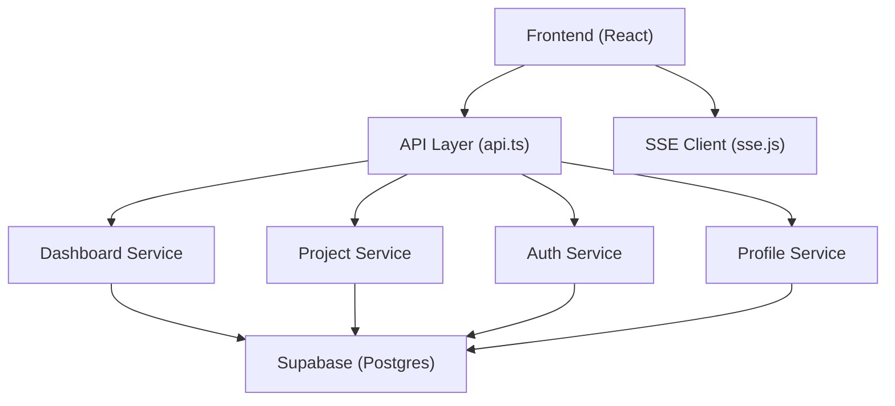
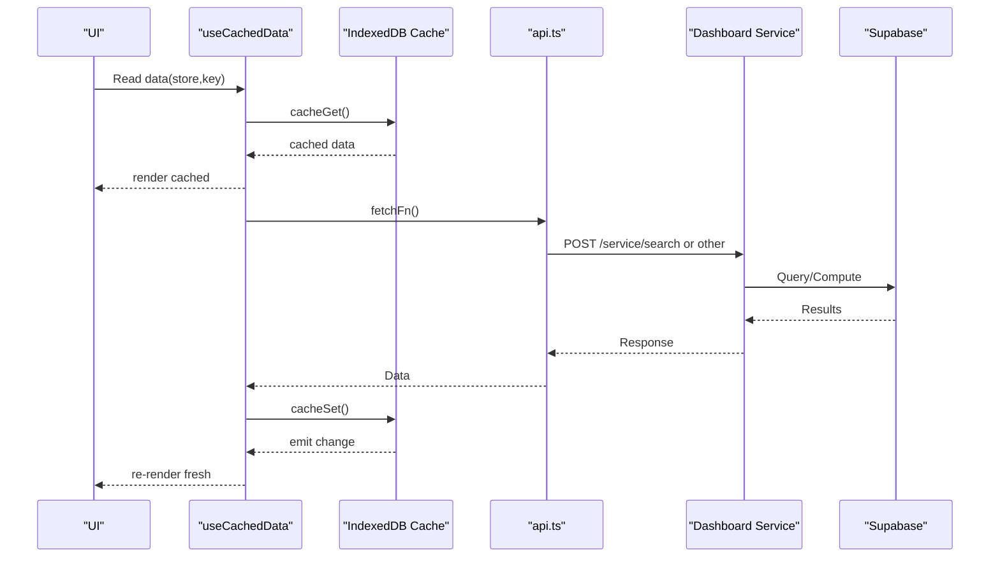
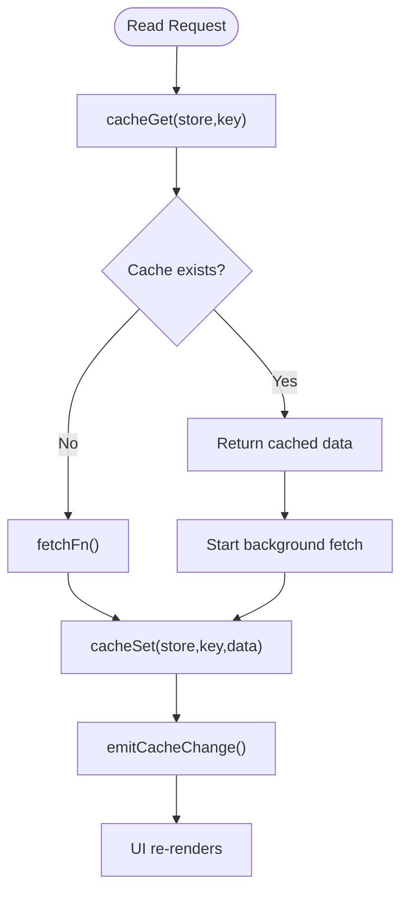
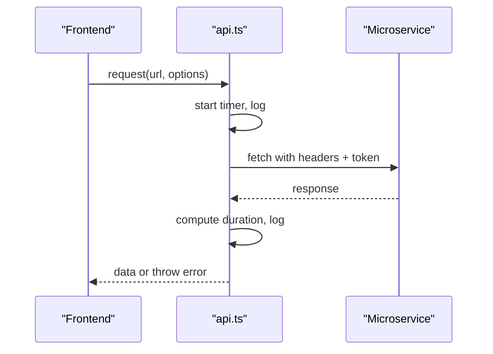
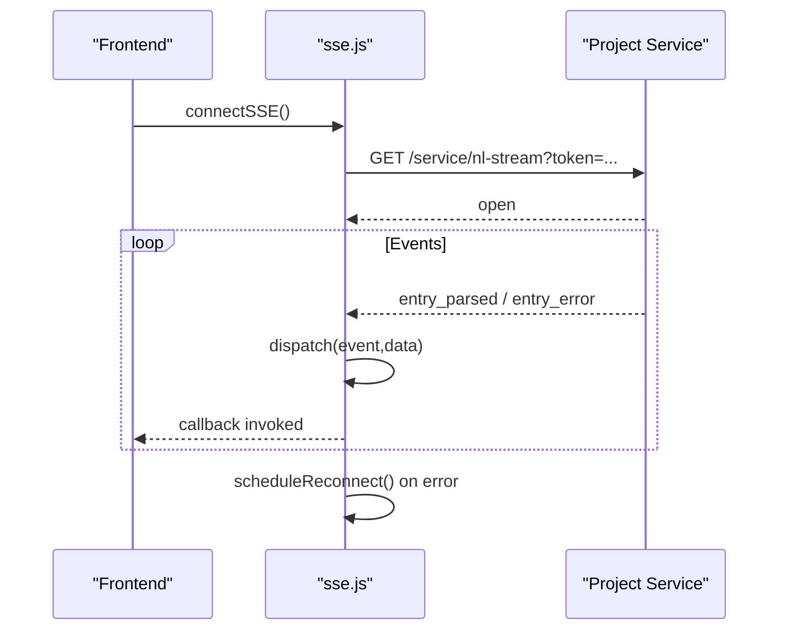
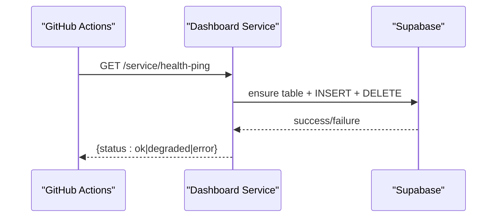
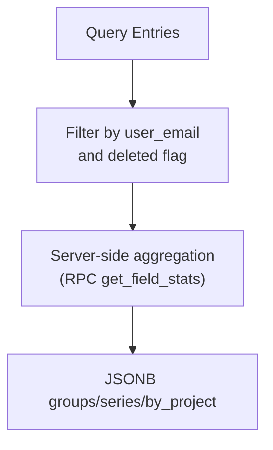
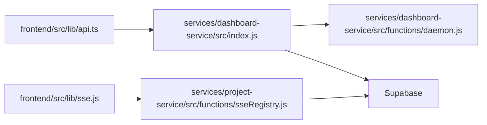

# Performance Monitoring and Optimization

<cite>
**Referenced Files in This Document**
- [cache.js](file://frontend/src/lib/cache.js)
- [useCachedData.js](file://frontend/src/hooks/useCachedData.js)
- [syncService.js](file://frontend/src/CacheFunctions/syncService.js)
- [sse.js](file://frontend/src/lib/sse.js)
- [api.ts](file://frontend/src/lib/api.ts)
- [search.js (dashboard-service)](file://services/dashboard-service/src/functions/search.js)
- [index.js (dashboard-service)](file://services/dashboard-service/src/index.js)
- [daemon.js](file://services/dashboard-service/src/functions/daemon.js)
- [sseRegistry.js](file://services/project-service/src/functions/sseRegistry.js)
- [008_create_field_stats_rpc.sql](file://supabase/migrations/008_create_field_stats_rpc.sql)
- [setup.sql](file://supabase/setup.sql)
- [caching.md](file://docs-site/docs/Architecture/caching.md)
</cite>

## Table of Contents

1. Introduction
2. Project Structure
3. Core Components
4. Architecture Overview
5. Detailed Component Analysis
6. Dependency Analysis
7. Performance Considerations
8. Troubleshooting Guide
9. Conclusion

## Introduction

This document provides comprehensive performance monitoring and optimization guidance for the Codacaine application across frontend, backend microservices, and database layers. It covers:

- API response time measurement and logging
- Database query performance and optimization strategies
- Frontend rendering optimization via local-first caching and IndexedDB
- Microservice health checks, resource utilization tracking, and error rate monitoring
- Caching techniques for IndexedDB storage, API responses, and database queries
- Real-time performance monitoring for Server-Sent Events (SSE) connections
- Identifying and resolving bottlenecks in search operations, data synchronization, and UI responsiveness

## Project Structure

Codacaine is a multi-service application with a React frontend and Node.js microservices (auth, dashboard, profile, project). The frontend uses a local-first architecture with SQLite-in-WASM backed by IndexedDB for durability and offline support. Backend services expose REST endpoints and SSE streams for real-time updates. Supabase hosts the relational database and provides RPC functions for analytics.

**Diagram sources**

- [api.ts:1-70](file://frontend/src/lib/api.ts#L1-L70)
- [sse.js:1-185](file://frontend/src/lib/sse.js#L1-L185)
- [index.js (dashboard-service):1-87](file://services/dashboard-service/src/index.js#L1-L87)

**Section sources**

- [api.ts:1-70](file://frontend/src/lib/api.ts#L1-L70)
- [sse.js:1-185](file://frontend/src/lib/sse.js#L1-L185)
- [index.js (dashboard-service):1-87](file://services/dashboard-service/src/index.js#L1-L87)

## Core Components

- Local-first cache layer with IndexedDB persistence and stale-while-revalidate strategy
- React hooks that subscribe to cache changes for instant UI updates
- Centralized sync service that warms IndexedDB on login and computes derived metrics offline
- SSE client with exponential backoff reconnection and event dispatching
- API request wrapper with timeout and timing logs
- Dashboard service health-ping endpoint and daemon to keep Supabase active
- Project service SSE registry for connection management and broadcasting events
- Supabase RPCs for field statistics and aggregations

**Section sources**

- [cache.js:1-389](file://frontend/src/lib/cache.js#L1-L389)
- [useCachedData.js:1-100](file://frontend/src/hooks/useCachedData.js#L1-L100)
- [syncService.js:1-172](file://frontend/src/CacheFunctions/syncService.js#L1-L172)
- [sse.js:1-185](file://frontend/src/lib/sse.js#L1-L185)
- [api.ts:1-70](file://frontend/src/lib/api.ts#L1-L70)
- [daemon.js:1-135](file://services/dashboard-service/src/functions/daemon.js#L1-L135)
- [index.js (dashboard-service):1-87](file://services/dashboard-service/src/index.js#L1-L87)
- [sseRegistry.js:1-104](file://services/project-service/src/functions/sseRegistry.js#L1-L104)
- [008_create_field_stats_rpc.sql:99-135](file://supabase/migrations/008_create_field_stats_rpc.sql#L99-L135)
- [setup.sql:208-247](file://supabase/setup.sql#L208-L247)

## Architecture Overview

The system follows a local-first pattern:

- Reads are served from IndexedDB immediately; background fetches refresh data
- Writes are optimistic (IndexedDB first), then synced to server
- SSE pushes real-time updates when backend processing completes
- Health-ping keeps services and database warm; errors are logged and surfaced

**Diagram sources**

- [useCachedData.js:1-100](file://frontend/src/hooks/useCachedData.js#L1-L100)
- [cache.js:179-223](file://frontend/src/lib/cache.js#L179-L223)
- [api.ts:10-57](file://frontend/src/lib/api.ts#L10-L57)
- [index.js (dashboard-service):52-67](file://services/dashboard-service/src/index.js#L52-L67)

## Detailed Component Analysis

### Frontend Caching and Rendering Optimization

- SQLite-in-WASM with IndexedDB persistence ensures fast reads and durability
- Stale-while-revalidate returns cached data immediately while refreshing in background
- Subscriptions trigger UI updates without polling
- Sync service pre-warms cache on login and computes derived stats offline

**Diagram sources**

- [cache.js:179-223](file://frontend/src/lib/cache.js#L179-L223)
- [cache.js:305-346](file://frontend/src/lib/cache.js#L305-L346)
- [useCachedData.js:23-76](file://frontend/src/hooks/useCachedData.js#L23-L76)

**Section sources**

- [cache.js:1-389](file://frontend/src/lib/cache.js#L1-L389)
- [useCachedData.js:1-100](file://frontend/src/hooks/useCachedData.js#L1-L100)
- [syncService.js:1-172](file://frontend/src/CacheFunctions/syncService.js#L1-L172)
- [caching.md:34-52](file://docs-site/docs/Architecture/caching.md#L34-L52)
- [caching.md:359-371](file://docs-site/docs/Architecture/caching.md#L359-L371)

### API Response Time Measurement and Error Handling

- Centralized request wrapper logs method, URL, status, and duration
- Timeout handling prevents long hangs during cold starts or AI processing
- Errors include structured messages for diagnostics

**Diagram sources**

- [api.ts:10-57](file://frontend/src/lib/api.ts#L10-L57)

**Section sources**

- [api.ts:1-70](file://frontend/src/lib/api.ts#L1-L70)

### SSE Real-Time Performance Monitoring

- Exponential backoff reconnection protects against network flakiness
- Event listeners enable fine-grained monitoring of parsed entries and errors
- Connection state helpers allow UI to reflect connectivity

**Diagram sources**

- [sse.js:37-119](file://frontend/src/lib/sse.js#L37-L119)
- [sseRegistry.js:17-74](file://services/project-service/src/functions/sseRegistry.js#L17-L74)

**Section sources**

- [sse.js:1-185](file://frontend/src/lib/sse.js#L1-L185)
- [sseRegistry.js:1-104](file://services/project-service/src/functions/sseRegistry.js#L1-L104)

### Microservices Health Checks and Resource Utilization

- Dashboard service exposes a health-ping endpoint used by CI to wake instances and verify database connectivity
- Daemon periodically pings Supabase to prevent pausing; minimal overhead
- Health responses indicate operational status or degradation

**Diagram sources**

- [index.js (dashboard-service):54-67](file://services/dashboard-service/src/index.js#L54-L67)
- [daemon.js:45-71](file://services/dashboard-service/src/functions/daemon.js#L45-L71)

**Section sources**

- [index.js (dashboard-service):1-87](file://services/dashboard-service/src/index.js#L1-L87)
- [daemon.js:1-135](file://services/dashboard-service/src/functions/daemon.js#L1-L135)

### Database Query Performance and Optimization

- Search endpoints retrieve user-scoped rows and filter in memory; consider indexing and server-side filtering for large datasets
- Field statistics RPC aggregates counts, sums, series, and groupings efficiently using SQL
- Use RPCs to offload heavy computations to the database layer

**Diagram sources**

- [search.js (dashboard-service):4-76](file://services/dashboard-service/src/functions/search.js#L4-L76)
- [008_create_field_stats_rpc.sql:99-135](file://supabase/migrations/008_create_field_stats_rpc.sql#L99-L135)
- [setup.sql:208-247](file://supabase/setup.sql#L208-L247)

**Section sources**

- [search.js (dashboard-service):1-78](file://services/dashboard-service/src/functions/search.js#L1-L78)
- [008_create_field_stats_rpc.sql:99-135](file://supabase/migrations/008_create_field_stats_rpc.sql#L99-L135)
- [setup.sql:208-247](file://supabase/setup.sql#L208-L247)

## Dependency Analysis

Key dependencies and their roles:

- Frontend depends on api.ts for all HTTP calls and sse.js for real-time updates
- Dashboard service depends on db pool and exposes health-ping and search routes
- Project service manages SSE connections and broadcasts events
- Supabase provides persistent storage and powerful SQL/RPC capabilities

**Diagram sources**

- [api.ts:1-70](file://frontend/src/lib/api.ts#L1-L70)
- [sse.js:1-185](file://frontend/src/lib/sse.js#L1-L185)
- [index.js (dashboard-service):1-87](file://services/dashboard-service/src/index.js#L1-L87)
- [daemon.js:1-135](file://services/dashboard-service/src/functions/daemon.js#L1-L135)
- [sseRegistry.js:1-104](file://services/project-service/src/functions/sseRegistry.js#L1-L104)

**Section sources**

- [api.ts:1-70](file://frontend/src/lib/api.ts#L1-L70)
- [sse.js:1-185](file://frontend/src/lib/sse.js#L1-L185)
- [index.js (dashboard-service):1-87](file://services/dashboard-service/src/index.js#L1-L87)
- [daemon.js:1-135](file://services/dashboard-service/src/functions/daemon.js#L1-L135)
- [sseRegistry.js:1-104](file://services/project-service/src/functions/sseRegistry.js#L1-L104)

## Performance Considerations

- API response times:
  - Use api.ts logs to track per-request latency and identify slow endpoints
  - Configure appropriate timeouts for long-running operations (e.g., AI parsing)
- Database query performance:
  - Prefer server-side filtering and aggregation via RPCs to reduce payload size
  - Ensure indexes on frequently filtered columns (user_email, project_name, deleted)
- Frontend rendering:
  - Rely on IndexedDB reads for instant UI; avoid synchronous network calls in render paths
  - Use stale-while-revalidate to balance freshness and speed
- SSE performance:
  - Monitor reconnection attempts and listener errors to detect instability
  - Keep event payloads small and focused
- Resource utilization:
  - Health-ping daemon minimizes DB churn while keeping services warm
  - Avoid excessive concurrent SSE writes; batch where possible

[No sources needed since this section provides general guidance]

## Troubleshooting Guide

Common issues and resolutions:

- Slow initial loads:
  - Verify syncService warms cache on login and that useCachedData subscribes correctly
  - Check IndexedDB persistence and schema upgrades
- Frequent SSE reconnects:
  - Inspect network conditions and token validity; ensure backend accepts token in query string
  - Review max reconnect attempts and base delay configuration
- High error rates on API calls:
  - Analyze api.ts logs for status codes and timeouts; adjust timeouts if necessary
  - Validate CORS and authentication headers
- Search performance bottlenecks:
  - Move filtering to server side or leverage RPCs for large datasets
  - Profile dashboard-service search functions and consider pagination

**Section sources**

- [cache.js:179-223](file://frontend/src/lib/cache.js#L179-L223)
- [useCachedData.js:23-76](file://frontend/src/hooks/useCachedData.js#L23-L76)
- [sse.js:106-119](file://frontend/src/lib/sse.js#L106-L119)
- [api.ts:10-57](file://frontend/src/lib/api.ts#L10-L57)
- [search.js (dashboard-service):4-76](file://services/dashboard-service/src/functions/search.js#L4-L76)

## Conclusion

Codacaine’s performance hinges on a robust local-first cache, efficient API interactions, and reliable real-time updates via SSE. By measuring API latencies, optimizing database queries with RPCs, leveraging IndexedDB for instant UI, and maintaining healthy microservices through health-ping and daemon mechanisms, the application achieves responsive and resilient performance under varying network conditions. Continuous monitoring of SSE connections and cache behavior will help identify and resolve bottlenecks proactively.

[No sources needed since this section summarizes without analyzing specific files]
