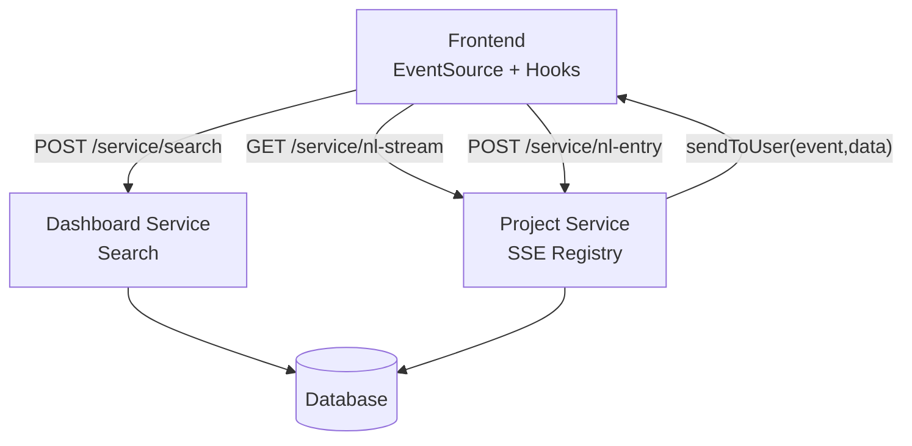
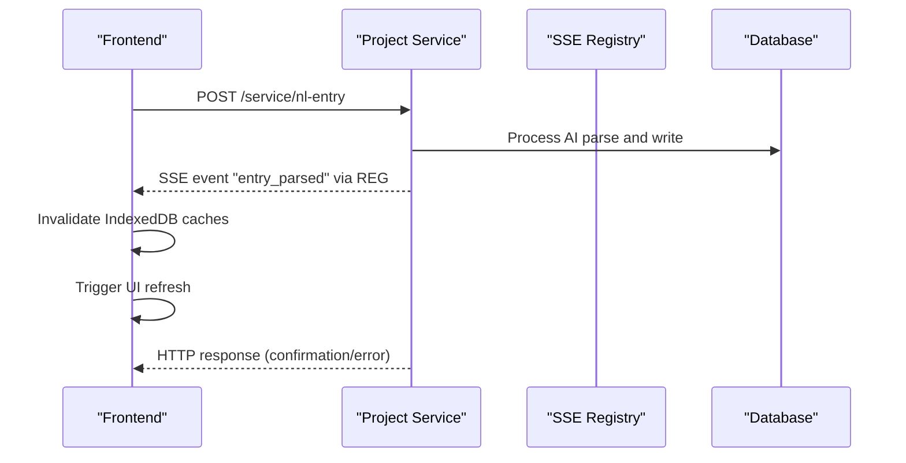
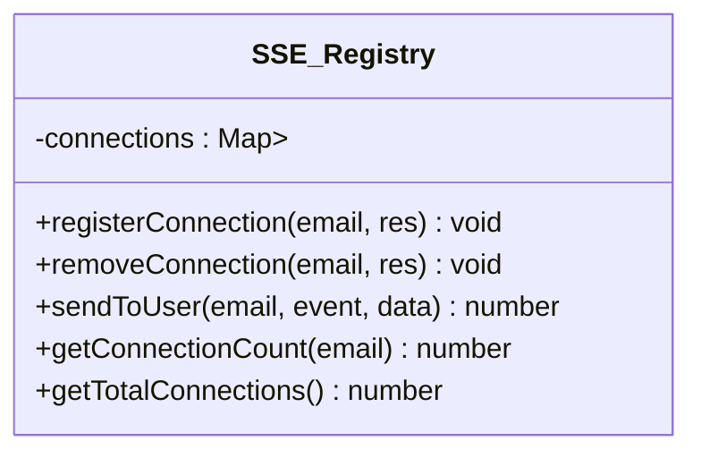
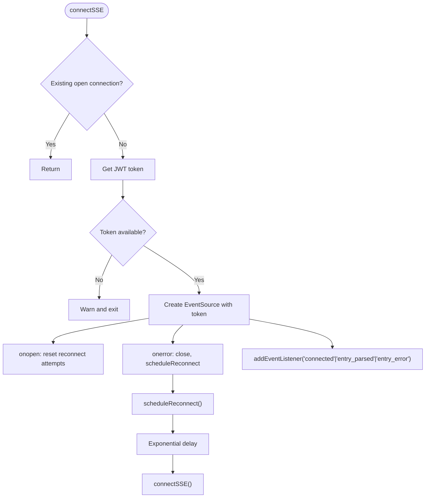
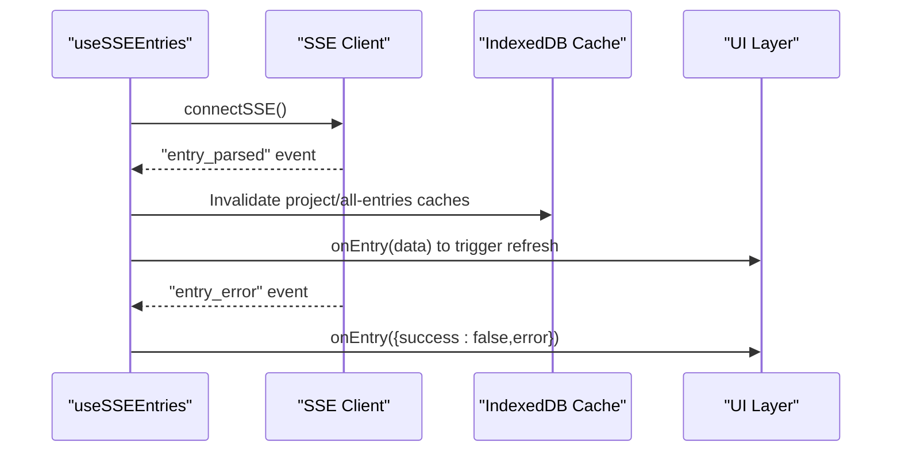
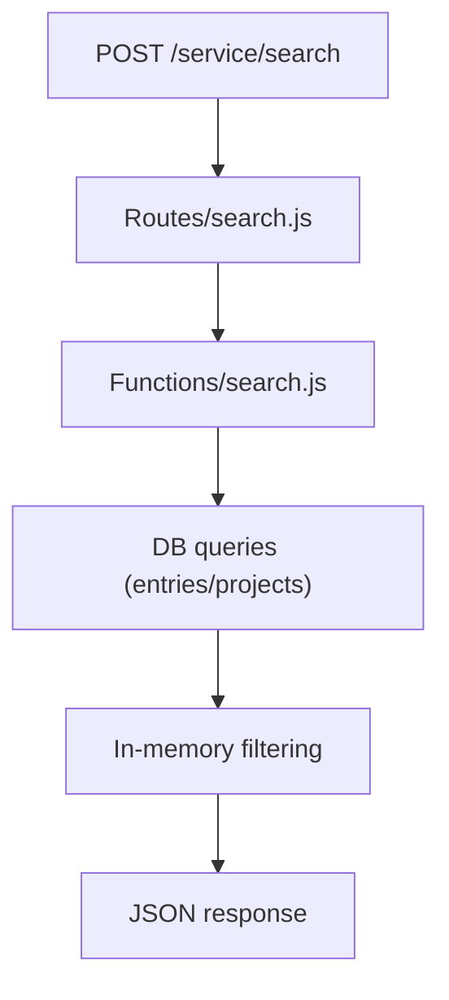
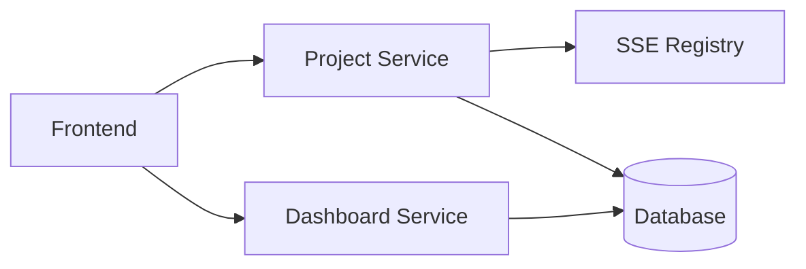

# Real-time Performance Monitoring

<cite>
**Referenced Files in This Document**
- [sseRegistry.js](file://services/project-service/src/functions/sseRegistry.js)
- [sse.js](file://frontend/src/lib/sse.js)
- [useSSEEntries.ts](file://frontend/src/hooks/useSSEEntries.ts)
- [sse.md](file://docs-site/docs/Architecture/sse.md)
- [index.js (project-service)](file://services/project-service/src/index.js)
- [search.js (dashboard-service functions)](file://services/dashboard-service/src/functions/search.js)
- [search.js (dashboard-service routes)](file://services/dashboard-service/src/Routes/search.js)
- [index.js (dashboard-service)](file://services/dashboard-service/src/index.js)
</cite>

## Table of Contents

1. Introduction
2. Project Structure
3. Core Components
4. Architecture Overview
5. Detailed Component Analysis
6. Dependency Analysis
7. Performance Considerations
8. Troubleshooting Guide
9. Conclusion
10. Appendices

## Introduction

This document provides comprehensive guidance for monitoring real-time performance in a system that uses Server-Sent Events (SSE) and WebSocket-style patterns to deliver live updates. It focuses on:

- Connection lifecycle management for SSE streams
- Message throughput monitoring and connection pool optimization
- Monitoring the SSE registry, active connections per user, and message delivery latency
- Implementing health checks and graceful failure handling
- Optimizing real-time data synchronization with IndexedDB cache invalidation
- Strategies for monitoring search operation performance under concurrent load and implementing efficient filtering algorithms for large datasets

The goal is to help you measure, observe, and improve the responsiveness and reliability of real-time features while keeping the UI responsive and data consistent.

## Project Structure

Real-time capabilities span both backend and frontend:

- Backend (Project Service): Maintains an in-memory registry of active SSE connections and pushes events to clients after AI parsing completes.
- Frontend: Manages SSE connection lifecycle, event listeners, and cache invalidation to keep the UI fresh.
- Dashboard Service: Provides search endpoints used by the frontend; these are important for measuring search performance under load.

**Diagram sources**

- [sseRegistry.js:17-74](file://services/project-service/src/functions/sseRegistry.js#L17-L74)
- [sse.js:37-101](file://frontend/src/lib/sse.js#L37-L101)
- [useSSEEntries.ts:41-107](file://frontend/src/hooks/useSSEEntries.ts#L41-L107)
- [search.js (routes):19-58](file://services/dashboard-service/src/Routes/search.js#L19-L58)
- [index.js (project-service):83-93](file://services/project-service/src/index.js#L83-L93)
- [index.js (dashboard-service):52-52](file://services/dashboard-service/src/index.js#L52-L52)

**Section sources**

- [sseRegistry.js:1-104](file://services/project-service/src/functions/sseRegistry.js#L1-L104)
- [sse.js:1-185](file://frontend/src/lib/sse.js#L1-L185)
- [useSSEEntries.ts:1-108](file://frontend/src/hooks/useSSEEntries.ts#L1-L108)
- [index.js (project-service):1-108](file://services/project-service/src/index.js#L1-L108)
- [index.js (dashboard-service):1-87](file://services/dashboard-service/src/index.js#L1-L87)

## Core Components

- SSE Registry (Backend): Tracks active SSE connections per user and broadcasts events efficiently.
- SSE Client Manager (Frontend): Opens and maintains the EventSource, handles reconnection with exponential backoff, and dispatches events to registered listeners.
- React Hook (Frontend): Subscribes to SSE events, invalidates IndexedDB caches, and triggers UI refresh.
- Search Endpoints (Dashboard Service): Provide search functionality across entries and projects; essential for concurrency and performance monitoring.

Key responsibilities:

- Connection lifecycle: register/remove connections, send events, count active connections.
- Robust client behavior: auto-reconnect, error handling, status checks.
- Cache coherence: invalidate stale data immediately upon receiving SSE events.
- Observability: metrics for throughput, latency, and connection counts.

**Section sources**

- [sseRegistry.js:17-96](file://services/project-service/src/functions/sseRegistry.js#L17-L96)
- [sse.js:37-185](file://frontend/src/lib/sse.js#L37-L185)
- [useSSEEntries.ts:41-107](file://frontend/src/hooks/useSSEEntries.ts#L41-L107)
- [search.js (functions):4-76](file://services/dashboard-service/src/functions/search.js#L4-L76)
- [search.js (routes):19-58](file://services/dashboard-service/src/Routes/search.js#L19-L58)

## Architecture Overview

The real-time flow leverages SSE to push parsed entry data to the frontend immediately after AI processing, before the full POST response completes. The frontend invalidates relevant caches and updates the UI instantly.

**Diagram sources**

- [sse.md:42-54](file://docs-site/docs/Architecture/sse.md#L42-L54)
- [sseRegistry.js:47-74](file://services/project-service/src/functions/sseRegistry.js#L47-L74)
- [useSSEEntries.ts:55-88](file://frontend/src/hooks/useSSEEntries.ts#L55-L88)

## Detailed Component Analysis

### SSE Registry (Backend)

The registry maintains a Map from user email to a Set of response objects, enabling targeted broadcasting to all active SSE connections for a specific user. It supports:

- Registering and removing connections
- Broadcasting events with JSON payloads
- Counting active connections per user and total
- Cleaning up dead connections on write failures

**Diagram sources**

- [sseRegistry.js:17-96](file://services/project-service/src/functions/sseRegistry.js#L17-L96)

Monitoring and observability recommendations:

- Track per-user connection counts using getConnectionCount and aggregate totals with getTotalConnections.
- Log each sendToUser call with event name and recipient count to compute throughput and detect anomalies.
- Measure write latency by timing between event creation and successful write to each client.

**Section sources**

- [sseRegistry.js:17-96](file://services/project-service/src/functions/sseRegistry.js#L17-L96)

### SSE Client Manager (Frontend)

Manages the persistent EventSource connection with:

- Automatic reconnection using exponential backoff
- Token-based authentication via query parameter
- Event listener registration and dispatching
- Connection status checks

**Diagram sources**

- [sse.js:37-119](file://frontend/src/lib/sse.js#L37-L119)

Performance considerations:

- Cap maximum reconnect attempts to avoid excessive retries.
- Use exponential backoff to reduce server pressure during outages.
- Debounce or batch UI updates triggered by high-frequency events if needed.

**Section sources**

- [sse.js:37-185](file://frontend/src/lib/sse.js#L37-L185)

### React Hook: useSSEEntries

Bridges SSE events to cache invalidation and UI updates:

- Connects when user is authenticated and SSE is enabled
- Listens for entry_parsed and entry_error events
- Invalidates IndexedDB caches for affected projects and global lists
- Invokes caller-provided callback to refresh UI

**Diagram sources**

- [useSSEEntries.ts:41-107](file://frontend/src/hooks/useSSEEntries.ts#L41-L107)

Operational tips:

- Ensure cache keys include user context to prevent cross-user pollution.
- For multi-entry scenarios, invalidate both project-specific and global caches to maintain consistency.
- Handle errors gracefully by surfacing them to the UI without crashing the stream.

**Section sources**

- [useSSEEntries.ts:41-107](file://frontend/src/hooks/useSSEEntries.ts#L41-L107)

### Search Endpoints (Dashboard Service)

Provide search across entries and projects:

- searchAll: retrieves all entries for a user and filters in memory
- searchProject: filters entries within a specific project
- searchProjects: finds matching projects and aggregates their entries

**Diagram sources**

- [search.js (routes):19-58](file://services/dashboard-service/src/Routes/search.js#L19-L58)
- [search.js (functions):4-76](file://services/dashboard-service/src/functions/search.js#L4-L76)

Concurrency and performance guidance:

- Monitor query execution time and result set sizes to identify bottlenecks.
- Consider adding database indexes on frequently filtered columns (e.g., user_email, project_name).
- For large datasets, implement server-side pagination and incremental search to reduce payload size.

**Section sources**

- [search.js (routes):19-58](file://services/dashboard-service/src/Routes/search.js#L19-L58)
- [search.js (functions):4-76](file://services/dashboard-service/src/functions/search.js#L4-L76)

## Dependency Analysis

The real-time pipeline depends on:

- Project Service routing and middleware for SSE endpoints
- In-memory SSE registry for connection tracking and broadcasting
- Frontend SSE client and hook for connection management and cache invalidation
- Dashboard Service search endpoints for data retrieval and filtering

**Diagram sources**

- [index.js (project-service):83-93](file://services/project-service/src/index.js#L83-L93)
- [sseRegistry.js:17-96](file://services/project-service/src/functions/sseRegistry.js#L17-L96)
- [sse.js:37-119](file://frontend/src/lib/sse.js#L37-L119)
- [search.js (routes):19-58](file://services/dashboard-service/src/Routes/search.js#L19-L58)

**Section sources**

- [index.js (project-service):83-93](file://services/project-service/src/index.js#L83-L93)
- [index.js (dashboard-service):52-52](file://services/dashboard-service/src/index.js#L52-L52)

## Performance Considerations

- Connection lifecycle:
  - Use getConnectionCount and getTotalConnections to monitor active connections per user and overall.
  - Ensure removeConnection runs on disconnect to free resources and prevent leaks.
- Message throughput:
  - Log each sendToUser invocation with event type and recipient count to compute messages per second.
  - Batch events where possible to reduce overhead.
- Latency measurement:
  - Measure time from event creation to successful write to each client; track p95/p99 latencies.
  - Instrument frontend to record time between SSE event receipt and UI update completion.
- Health checks:
  - Implement periodic liveness probes for SSE endpoints and registry integrity.
  - Use dashboard-service health-ping endpoint to verify service availability.
- Graceful failures:
  - Catch write errors in sendToUser and remove dead connections automatically.
  - Frontend should handle connection errors with exponential backoff and limit retries.
- Optimization strategies:
  - Prefer targeted broadcasts to user-scoped connections.
  - Avoid sending large payloads over SSE; consider streaming partial results or references to cached data.
  - For search under load, add indexes, paginate results, and filter server-side when feasible.

[No sources needed since this section provides general guidance]

## Troubleshooting Guide

Common issues and resolutions:

- No events received:
  - Verify SSE connection is open using isSSEConnected and check for authentication token availability.
  - Confirm backend has registered the connection and sendToUser is invoked with correct user email.
- Frequent reconnects:
  - Inspect network stability and server logs for errors during write operations.
  - Adjust MAX_RECONNECT_ATTEMPTS and base delay if necessary.
- Stale UI data:
  - Ensure cache invalidation logic in useSSEEntries runs for all affected keys (project-specific and global).
  - Validate cache key construction includes user context.
- High memory usage:
  - Monitor getTotalConnections and investigate orphaned connections not removed on disconnect.
  - Add cleanup routines to purge dead connections proactively.

**Section sources**

- [sseRegistry.js:47-74](file://services/project-service/src/functions/sseRegistry.js#L47-L74)
- [sse.js:106-134](file://frontend/src/lib/sse.js#L106-L134)
- [useSSEEntries.ts:55-107](file://frontend/src/hooks/useSSEEntries.ts#L55-L107)

## Conclusion

By instrumenting the SSE registry, managing robust client connections, and ensuring timely cache invalidation, you can achieve responsive real-time updates with measurable performance. Monitoring connection counts, message throughput, and delivery latency enables proactive optimization. For search operations under concurrent load, focus on database indexing, server-side filtering, and pagination to maintain efficiency. Combine these practices with health checks and graceful error handling to deliver a resilient real-time experience.

[No sources needed since this section summarizes without analyzing specific files]

## Appendices

### SSE Events Reference

- connected: Stream established confirmation
- entry_parsed: Structured entry data ready after AI parsing
- entry_error: Error occurred during parsing
- : ping: Keep-alive comment to prevent timeouts

**Section sources**

- [sse.md:179-186](file://docs-site/docs/Architecture/sse.md#L179-L186)

### Metrics to Collect

- Active connections per user: getConnectionCount(email)
- Total active connections: getTotalConnections()
- Messages sent per event type: log sendToUser calls with event and count
- Delivery latency: timestamp event creation vs. successful write per client
- Frontend update latency: timestamp SSE event receipt vs. UI update completion

**Section sources**

- [sseRegistry.js:77-96](file://services/project-service/src/functions/sseRegistry.js#L77-L96)
- [useSSEEntries.ts:55-107](file://frontend/src/hooks/useSSEEntries.ts#L55-L107)
