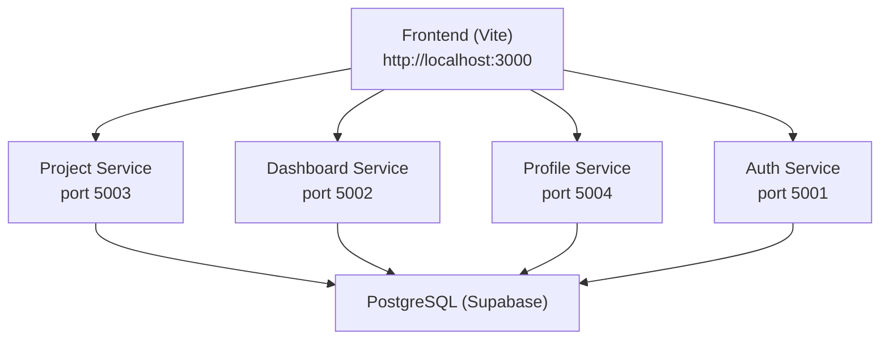
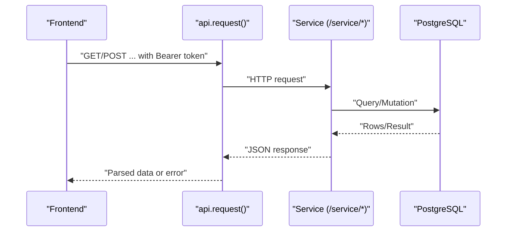
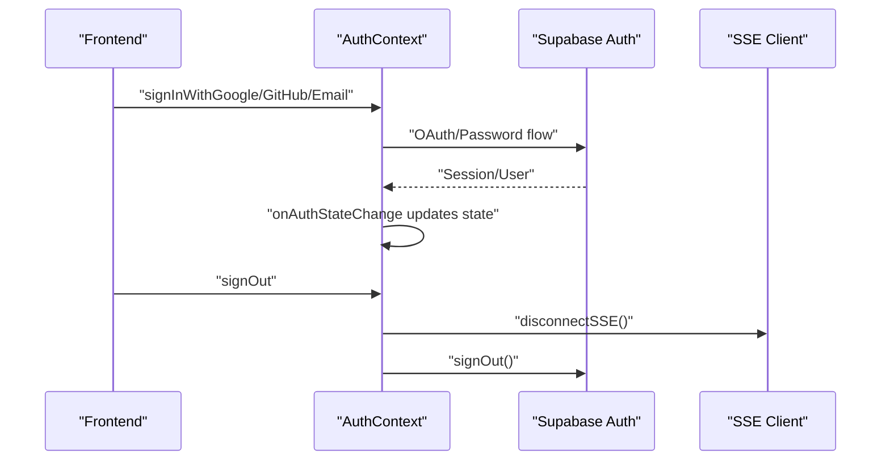
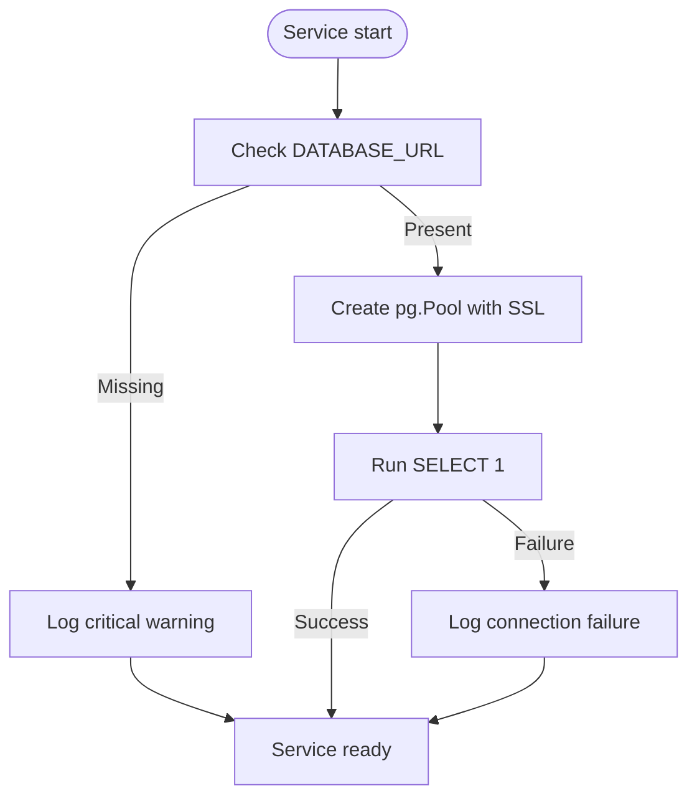
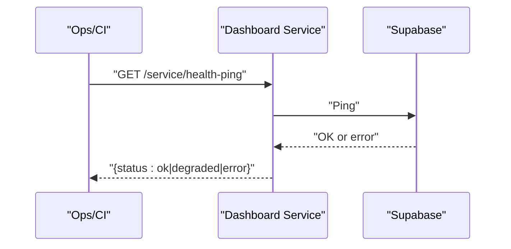
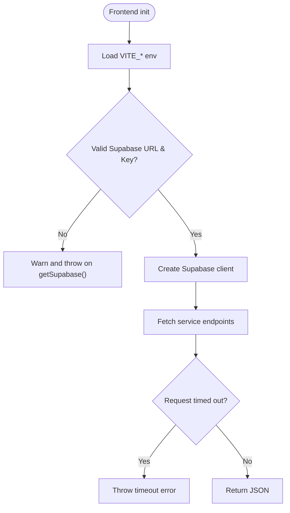
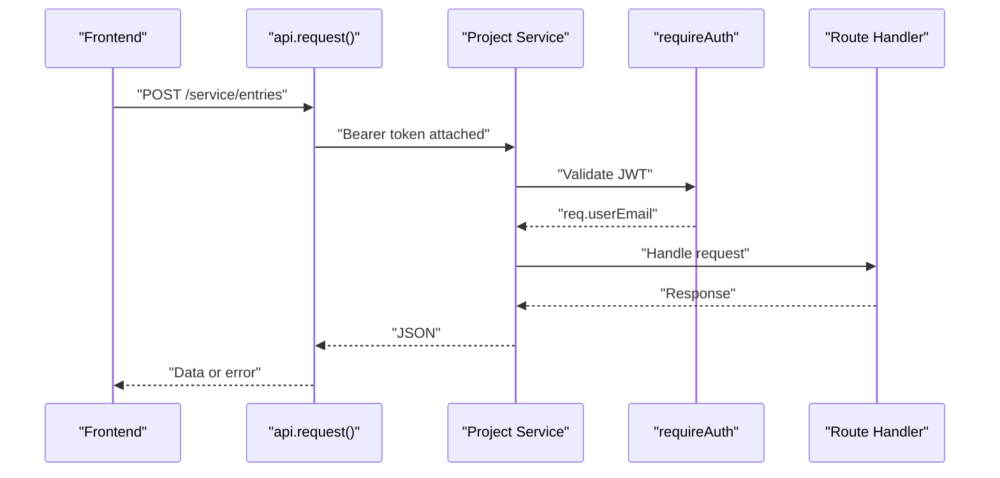
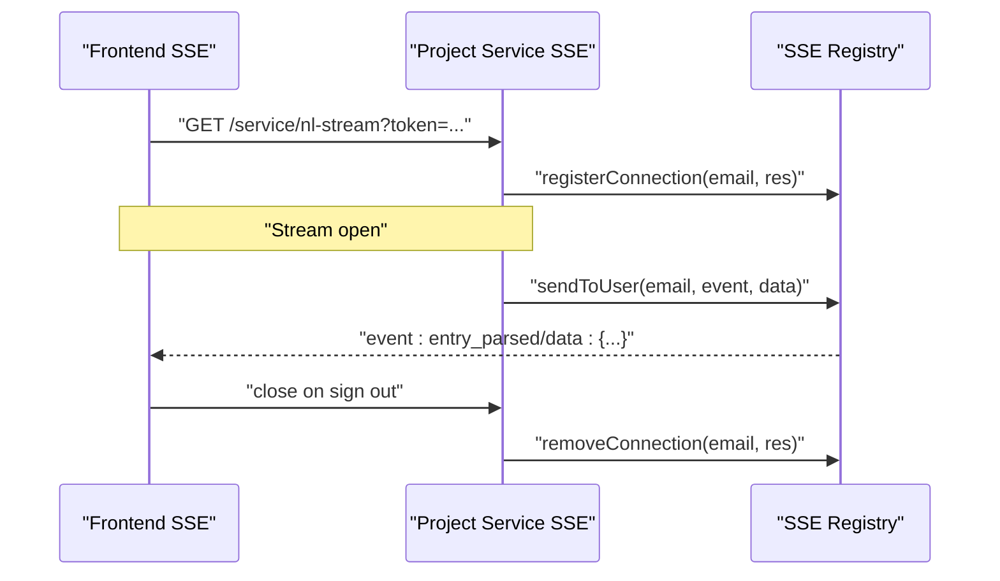
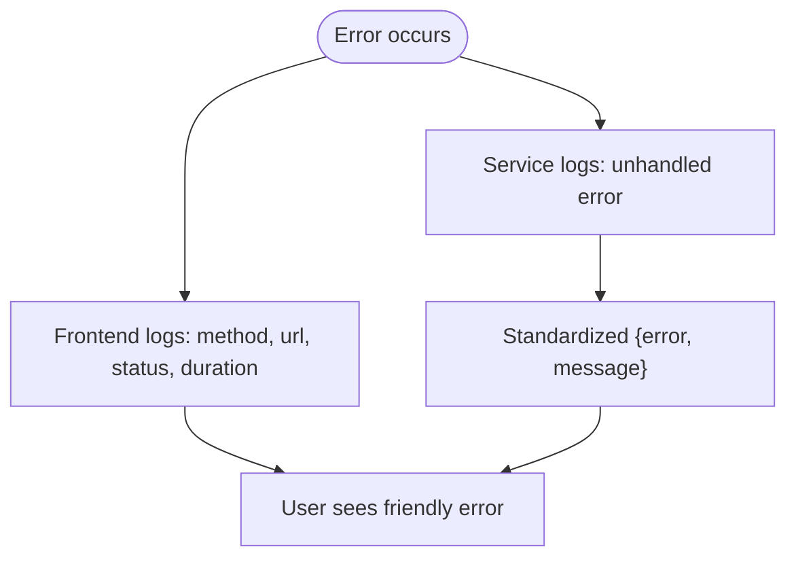
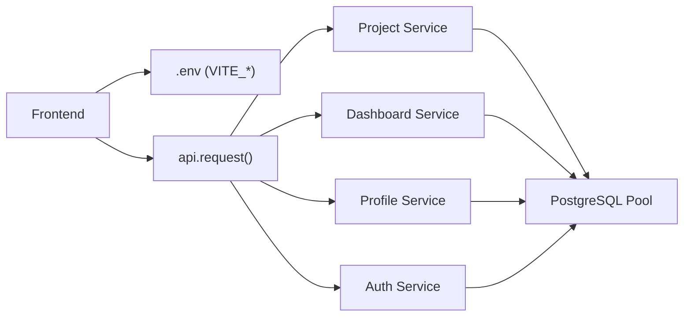

# Troubleshooting and Support

<cite>
**Referenced Files in This Document**
- [README.md](file://README.md)
- [USER_FEEDBACK.md](file://USER_FEEDBACK.md)
- [issues.md](file://issues.md)
- [services/auth-service/src/index.js](file://services/auth-service/src/index.js)
- [services/dashboard-service/src/index.js](file://services/dashboard-service/src/index.js)
- [services/profile-service/src/index.js](file://services/profile-service/src/index.js)
- [services/project-service/src/index.js](file://services/project-service/src/index.js)
- [services/project-service/src/db.js](file://services/project-service/src/db.js)
- [frontend/src/lib/api.ts](file://frontend/src/lib/api.ts)
- [frontend/src/context/AuthContext.tsx](file://frontend/src/context/AuthContext.tsx)
- [frontend/src/lib/supabase.ts](file://frontend/src/lib/supabase.ts)
- [frontend/src/lib/sse.js](file://frontend/src/lib/sse.js)
- [services/project-service/src/functions/sseRegistry.js](file://services/project-service/src/functions/sseRegistry.js)
- [services/project-service/src/functions/activityLog.js](file://services/project-service/src/functions/activityLog.js)
- [services/project-service/src/__tests__/activityLog.test.js](file://services/project-service/src/__tests__/activityLog.test.js)
- [services/auth-service/src/__tests__/cors.integration.test.js](file://services/auth-service/src/__tests__/cors.integration.test.js)
- [docs-site/docs/Architecture/database.md](file://docs-site/docs/Architecture/database.md)
</cite>

## Table of Contents

1. Introduction
2. Project Structure
3. Core Components
4. Architecture Overview
5. Detailed Component Analysis
6. Dependency Analysis
7. Performance Considerations
8. Troubleshooting Guide
9. Conclusion
10. Appendices

## Introduction

This document provides comprehensive troubleshooting and support guidance for the Codacaine application. It covers authentication problems, database connection errors, service startup failures, frontend build issues, performance diagnostics (bottlenecks, memory leaks, network connectivity), microservice communication debugging, API endpoint issues, real-time connection problems (SSE), error message interpretation, log analysis techniques, monitoring dashboard usage, user-reported issue handling, bug reporting procedures, issue triage processes, and an FAQ section for setup, configuration, and feature usage.

## Project Structure

Codacaine is a monorepo with:

- A React frontend (Vite) that communicates with four Node/Express microservices via REST and Server-Sent Events (SSE).
- Four backend services: auth-service, dashboard-service, project-service, profile-service.
- Shared PostgreSQL database via Supabase.
- Scripts for migrations, backups, and restore.

**Diagram sources**

- [README.md:20-31](file://README.md#L20-L31)
- [README.md:234-302](file://README.md#L234-L302)
- [services/auth-service/src/index.js:1-82](file://services/auth-service/src/index.js#L1-L82)
- [services/dashboard-service/src/index.js:1-87](file://services/dashboard-service/src/index.js#L1-L87)
- [services/profile-service/src/index.js:1-77](file://services/profile-service/src/index.js#L1-L77)
- [services/project-service/src/index.js:1-108](file://services/project-service/src/index.js#L1-L108)

**Section sources**

- [README.md:20-31](file://README.md#L20-L31)
- [README.md:234-302](file://README.md#L234-L302)

## Core Components

- Frontend API client: centralizes timeouts, headers, and service URLs; logs request timing and errors.
- Authentication context: manages sessions, sign-in/out, account deletion/restore, and SSE lifecycle.
- Services: Express apps with CORS, JSON parsing, health endpoints, global error handlers, and route mounting.
- Database layer: connection pool with SSL configured for Supabase; startup verification query.
- Real-time: SSE client with reconnect backoff; server-side registry to push events per user.

**Section sources**

- [frontend/src/lib/api.ts:1-70](file://frontend/src/lib/api.ts#L1-L70)
- [frontend/src/context/AuthContext.tsx:1-240](file://frontend/src/context/AuthContext.tsx#L1-L240)
- [services/project-service/src/index.js:1-108](file://services/project-service/src/index.js#L1-L108)
- [services/dashboard-service/src/index.js:1-87](file://services/dashboard-service/src/index.js#L1-L87)
- [services/profile-service/src/index.js:1-77](file://services/profile-service/src/index.js#L1-L77)
- [services/auth-service/src/index.js:1-82](file://services/auth-service/src/index.js#L1-L82)
- [services/project-service/src/db.js:1-31](file://services/project-service/src/db.js#L1-L31)
- [frontend/src/lib/sse.js:1-185](file://frontend/src/lib/sse.js#L1-L185)
- [services/project-service/src/functions/sseRegistry.js:1-104](file://services/project-service/src/functions/sseRegistry.js#L1-L104)

## Architecture Overview

The frontend calls service endpoints through a unified API helper that attaches Supabase tokens. Each service exposes a root health endpoint and mounts routes under /service. The project-service also serves OpenAPI/Swagger docs at /api-docs. All services share a PostgreSQL connection string and use a connection pool.

**Diagram sources**

- [frontend/src/lib/api.ts:10-57](file://frontend/src/lib/api.ts#L10-L57)
- [services/project-service/src/index.js:76-93](file://services/project-service/src/index.js#L76-L93)
- [services/project-service/src/db.js:12-29](file://services/project-service/src/db.js#L12-L29)

## Detailed Component Analysis

### Authentication Flow and Common Issues

- Dev bypass: In development, a mock user can be used by setting a dev flag, which skips Supabase auth.
- Session management: Initial session retrieval and onAuthStateChange updates keep UI in sync.
- Sign-out cleanup: Clears IndexedDB cache and disconnects SSE before signing out.
- Account lifecycle: Schedules deletion with grace period and supports restoration via RPC.

**Diagram sources**

- [frontend/src/context/AuthContext.tsx:38-80](file://frontend/src/context/AuthContext.tsx#L38-L80)
- [frontend/src/context/AuthContext.tsx:137-151](file://frontend/src/context/AuthContext.tsx#L137-L151)
- [frontend/src/context/AuthContext.tsx:173-195](file://frontend/src/context/AuthContext.tsx#L173-L195)

Common authentication issues and resolutions:

- Missing or invalid Supabase credentials: Ensure VITE_SUPABASE_URL and VITE_SUPABASE_ANON_KEY are set; the client throws if not configured.
- CORS blocks from frontend: Verify allowed origins include your dev/prod origin; services log warnings when blocked.
- Token missing on requests: The API helper attaches Authorization header using Supabase session token; ensure a valid session exists.

**Section sources**

- [frontend/src/lib/supabase.ts:1-33](file://frontend/src/lib/supabase.ts#L1-L33)
- [services/auth-service/src/index.js:17-33](file://services/auth-service/src/index.js#L17-L33)
- [services/project-service/src/index.js:25-55](file://services/project-service/src/index.js#L25-L55)
- [services/dashboard-service/src/index.js:12-44](file://services/dashboard-service/src/index.js#L12-L44)
- [services/profile-service/src/index.js:12-46](file://services/profile-service/src/index.js#L12-L46)
- [frontend/src/lib/api.ts:10-57](file://frontend/src/lib/api.ts#L10-L57)

### Database Connection Errors

- Environment: DATABASE_URL must be set; services log a critical warning if missing.
- SSL: Supabase requires SSL; pool uses rejectUnauthorized false for free-tier certificates.
- Startup check: Services run SELECT 1 to verify pool connectivity; failures are logged but do not prevent startup.

**Diagram sources**

- [services/project-service/src/db.js:5-29](file://services/project-service/src/db.js#L5-L29)
- [docs-site/docs/Architecture/database.md:449-452](file://docs-site/docs/Architecture/database.md#L449-L452)

Common database issues and resolutions:

- “CRITICAL: Missing DATABASE_URL”: Set DATABASE_URL in each service’s .env.
- “Connection failed” on startup: Validate host/port/user/password; ensure SSL settings match Supabase requirements.
- Query errors: Inspect service logs; activity logging returns structured results with success flags and messages.

**Section sources**

- [services/project-service/src/db.js:5-29](file://services/project-service/src/db.js#L5-L29)
- [services/project-service/src/functions/activityLog.js:38-69](file://services/project-service/src/functions/activityLog.js#L38-L69)
- [services/project-service/src/**tests**/activityLog.test.js:81-98](file://services/project-service/src/__tests__/activityLog.test.js#L81-L98)
- [docs-site/docs/Architecture/database.md:449-452](file://docs-site/docs/Architecture/database.md#L449-L452)

### Service Startup Failures

- Health endpoints: Each service exposes a root path returning status; useful for quick checks.
- Global error handler: Ensures CORS headers on errors and returns standardized error payloads.
- Dashboard health-ping: Wakes Render instances and pings Supabase; returns degraded status if unhealthy.

**Diagram sources**

- [services/dashboard-service/src/index.js:54-67](file://services/dashboard-service/src/index.js#L54-L67)

Common startup issues and resolutions:

- Port conflicts: Ensure default ports (5001–5004) are free or configure PORT.
- CORS misconfiguration: Add your frontend origin to allowedOrigins; services warn on blocked origins.
- Unhandled exceptions: Review global error handlers; they return 500 with error/message.

**Section sources**

- [services/auth-service/src/index.js:50-69](file://services/auth-service/src/index.js#L50-L69)
- [services/dashboard-service/src/index.js:48-78](file://services/dashboard-service/src/index.js#L48-L78)
- [services/profile-service/src/index.js:50-72](file://services/profile-service/src/index.js#L50-L72)
- [services/project-service/src/index.js:76-103](file://services/project-service/src/index.js#L76-L103)

### Frontend Build and Runtime Issues

- Environment variables: Ensure all VITE_* variables are set; defaults may fall back to deployed service URLs.
- API timeouts: Default timeout is 90 seconds; adjust via options if needed; abort errors are converted to readable messages.
- Supabase client initialization: Throws if credentials are missing or invalid; logs warnings during init.

**Diagram sources**

- [frontend/src/lib/api.ts:1-70](file://frontend/src/lib/api.ts#L1-L70)
- [frontend/src/lib/supabase.ts:1-33](file://frontend/src/lib/supabase.ts#L1-L33)

Common frontend issues and resolutions:

- “API error X: Y”: Inspect service logs for the corresponding endpoint; validate request payload and headers.
- “Request timed out”: Increase timeoutMs or investigate slow AI processing; check service health endpoints.
- “Supabase client not configured”: Set VITE_SUPABASE_URL and VITE_SUPABASE_ANON_KEY.

**Section sources**

- [frontend/src/lib/api.ts:10-57](file://frontend/src/lib/api.ts#L10-L57)
- [frontend/src/lib/supabase.ts:12-31](file://frontend/src/lib/supabase.ts#L12-L31)

### Microservice Communication and API Endpoints

- Centralized request helper: Adds Authorization header, logs timing, handles non-ok responses.
- Service routing: Routes mounted under /service; some endpoints require JWT via middleware.
- OpenAPI docs: Swagger UI available at /api-docs on project-service for interactive testing.

**Diagram sources**

- [frontend/src/lib/api.ts:10-57](file://frontend/src/lib/api.ts#L10-L57)
- [services/project-service/src/index.js:82-93](file://services/project-service/src/index.js#L82-L93)

Common API issues and resolutions:

- 401/403: Ensure a valid Supabase session; check CORS and allowed origins.
- Route not found: Confirm correct base URL and path; verify service is running on expected port.
- Payload errors: Validate against OpenAPI spec at /api-docs; inspect service logs.

**Section sources**

- [frontend/src/lib/api.ts:10-57](file://frontend/src/lib/api.ts#L10-L57)
- [services/project-service/src/index.js:58-75](file://services/project-service/src/index.js#L58-L75)
- [services/project-service/src/index.js:82-93](file://services/project-service/src/index.js#L82-L93)

### Real-Time Connections (SSE) Problems

- Client behavior: Connects with token via query param; auto-reconnects with exponential backoff; tracks listeners and disconnects cleanly.
- Server registry: Maintains per-user connections; pushes events; removes dead connections; reports counts.

**Diagram sources**

- [frontend/src/lib/sse.js:37-101](file://frontend/src/lib/sse.js#L37-L101)
- [services/project-service/src/functions/sseRegistry.js:17-74](file://services/project-service/src/functions/sseRegistry.js#L17-L74)

Common SSE issues and resolutions:

- No events received: Verify token is present; check browser console for “[SSE] Connected”; confirm server-side registration.
- Frequent reconnects: Investigate network stability; review max reconnect attempts and backoff delays.
- Stale connections: Ensure disconnectSSE is called on sign out; registry cleans up dead writes.

**Section sources**

- [frontend/src/lib/sse.js:37-134](file://frontend/src/lib/sse.js#L37-L134)
- [services/project-service/src/functions/sseRegistry.js:17-104](file://services/project-service/src/functions/sseRegistry.js#L17-L104)

### Error Message Interpretation and Log Analysis

- Frontend API logs: Print method, short URL, status, duration, and errors; includes timeout details.
- Service error handlers: Log unhandled errors and return standardized JSON with error/message.
- Activity logging: Returns structured results with success flags and messages; tests cover error paths.

**Diagram sources**

- [frontend/src/lib/api.ts:10-57](file://frontend/src/lib/api.ts#L10-L57)
- [services/project-service/src/index.js:94-103](file://services/project-service/src/index.js#L94-L103)
- [services/auth-service/src/index.js:61-69](file://services/auth-service/src/index.js#L61-L69)
- [services/project-service/src/functions/activityLog.js:45-61](file://services/project-service/src/functions/activityLog.js#L45-L61)

**Section sources**

- [frontend/src/lib/api.ts:10-57](file://frontend/src/lib/api.ts#L10-L57)
- [services/project-service/src/index.js:94-103](file://services/project-service/src/index.js#L94-L103)
- [services/auth-service/src/index.js:61-69](file://services/auth-service/src/index.js#L61-L69)
- [services/project-service/src/functions/activityLog.js:45-61](file://services/project-service/src/functions/activityLog.js#L45-L61)
- [services/project-service/src/**tests**/activityLog.test.js:81-98](file://services/project-service/src/__tests__/activityLog.test.js#L81-L98)

### Monitoring Dashboards and Health Checks

- Health endpoints: Root paths return service identity and status; dashboard-service exposes /service/health-ping for uptime and DB reachability.
- OpenAPI docs: Interactive API documentation at /api-docs on project-service for endpoint discovery and testing.

**Section sources**

- [services/auth-service/src/index.js:50-57](file://services/auth-service/src/index.js#L50-L57)
- [services/dashboard-service/src/index.js:48-67](file://services/dashboard-service/src/index.js#L48-L67)
- [services/profile-service/src/index.js:50-55](file://services/profile-service/src/index.js#L50-L55)
- [services/project-service/src/index.js:58-78](file://services/project-service/src/index.js#L58-L78)

## Dependency Analysis

- Frontend depends on environment variables for service URLs and Supabase credentials.
- Services depend on shared PostgreSQL via DATABASE_URL; each initializes its own pool.
- SSE client depends on project-service SSE endpoint; server registry maintains per-user streams.

**Diagram sources**

- [frontend/src/lib/api.ts:1-70](file://frontend/src/lib/api.ts#L1-L70)
- [services/project-service/src/db.js:1-31](file://services/project-service/src/db.js#L1-L31)
- [services/dashboard-service/src/index.js:1-87](file://services/dashboard-service/src/index.js#L1-L87)
- [services/profile-service/src/index.js:1-77](file://services/profile-service/src/index.js#L1-L77)
- [services/auth-service/src/index.js:1-82](file://services/auth-service/src/index.js#L1-L82)

**Section sources**

- [frontend/src/lib/api.ts:1-70](file://frontend/src/lib/api.ts#L1-L70)
- [services/project-service/src/db.js:1-31](file://services/project-service/src/db.js#L1-L31)

## Performance Considerations

- Request timeouts: Default 90 seconds accommodates cold starts and AI processing; adjust per endpoint if necessary.
- Database pooling: Reuses connections to avoid exhaustion; monitor pool size and query latency.
- SSE reconnection: Exponential backoff prevents thundering herds; tune MAX_RECONNECT_ATTEMPTS and base delay if needed.
- Frontend caching: IndexedDB caches entries and profiles; ensure consistent key paths and version upgrades to avoid storage errors.

[No sources needed since this section provides general guidance]

## Troubleshooting Guide

### Authentication Problems

Symptoms:

- Unable to sign in or maintain session.
- Requests fail with 401/403.
- CORS errors in browser console.

Diagnostic steps:

- Verify Supabase credentials are set and valid; client throws if missing.
- Check allowed origins in each service; look for CORS warnings in service logs.
- Ensure a valid Supabase session exists; API helper attaches Authorization header automatically.

Resolutions:

- Set VITE_SUPABASE_URL and VITE_SUPABASE_ANON_KEY.
- Add your frontend origin to allowedOrigins in services.
- Use dev mode bypass only for local testing.

**Section sources**

- [frontend/src/lib/supabase.ts:12-31](file://frontend/src/lib/supabase.ts#L12-L31)
- [services/auth-service/src/index.js:17-33](file://services/auth-service/src/index.js#L17-L33)
- [services/project-service/src/index.js:25-55](file://services/project-service/src/index.js#L25-L55)
- [services/dashboard-service/src/index.js:12-44](file://services/dashboard-service/src/index.js#L12-L44)
- [services/profile-service/src/index.js:12-46](file://services/profile-service/src/index.js#L12-L46)
- [frontend/src/context/AuthContext.tsx:8-16](file://frontend/src/context/AuthContext.tsx#L8-L16)

### Database Connection Errors

Symptoms:

- “CRITICAL: Missing DATABASE_URL”.
- “PostgreSQL pool connection failed”.
- Query failures in activity logs.

Diagnostic steps:

- Confirm DATABASE_URL is set in each service’s .env.
- Validate SSL settings for Supabase; ensure rejectUnauthorized matches requirements.
- Run startup verification query; inspect logs for connection errors.

Resolutions:

- Provide correct DATABASE_URL.
- Adjust SSL settings if connecting to a different Postgres instance.
- Review query parameters and permissions.

**Section sources**

- [services/project-service/src/db.js:5-29](file://services/project-service/src/db.js#L5-L29)
- [docs-site/docs/Architecture/database.md:449-452](file://docs-site/docs/Architecture/database.md#L449-L452)
- [services/project-service/src/functions/activityLog.js:45-61](file://services/project-service/src/functions/activityLog.js#L45-L61)

### Service Startup Failures

Symptoms:

- Service does not respond on expected port.
- Health endpoints return errors.
- Global error handler triggered.

Diagnostic steps:

- Check port configuration and availability.
- Call root health endpoints to verify service status.
- Review global error handler logs for unhandled exceptions.

Resolutions:

- Free conflicting ports or change PORT.
- Fix environment variables and dependencies.
- Address unhandled exceptions in route handlers.

**Section sources**

- [services/auth-service/src/index.js:50-69](file://services/auth-service/src/index.js#L50-L69)
- [services/dashboard-service/src/index.js:48-78](file://services/dashboard-service/src/index.js#L48-L78)
- [services/profile-service/src/index.js:50-72](file://services/profile-service/src/index.js#L50-L72)
- [services/project-service/src/index.js:76-103](file://services/project-service/src/index.js#L76-L103)

### Frontend Build Issues

Symptoms:

- Build fails due to undefined variables.
- Runtime errors about missing Supabase client.
- API requests time out or fail.

Diagnostic steps:

- Ensure all VITE_* variables are present.
- Validate Supabase client initialization; logs warn if credentials are invalid.
- Inspect API logs for timeouts and error bodies.

Resolutions:

- Add missing environment variables.
- Correct Supabase URL and keys.
- Adjust timeouts or investigate slow endpoints.

**Section sources**

- [frontend/src/lib/supabase.ts:12-31](file://frontend/src/lib/supabase.ts#L12-L31)
- [frontend/src/lib/api.ts:10-57](file://frontend/src/lib/api.ts#L10-L57)

### Network Connectivity Problems

Symptoms:

- CORS errors.
- Timeouts.
- Intermittent failures.

Diagnostic steps:

- Check allowed origins and credentials settings.
- Use health endpoints to verify service reachability.
- Inspect API logs for timing and error messages.

Resolutions:

- Update allowedOrigins to include your domain.
- Configure proxies or adjust CORS policies as needed.
- Tune timeouts and retry logic.

**Section sources**

- [services/auth-service/src/index.js:17-33](file://services/auth-service/src/index.js#L17-L33)
- [services/project-service/src/index.js:25-55](file://services/project-service/src/index.js#L25-L55)
- [frontend/src/lib/api.ts:10-57](file://frontend/src/lib/api.ts#L10-L57)

### Microservice Communication Debugging

Symptoms:

- Endpoint returns unexpected errors.
- Middleware rejects requests.
- OpenAPI docs unavailable.

Diagnostic steps:

- Test endpoints via /api-docs on project-service.
- Verify JWT presence and validity.
- Check route mounting order and middleware.

Resolutions:

- Ensure JWT is attached by API helper.
- Confirm routes are mounted under /service.
- Rebuild if OpenAPI spec is missing.

**Section sources**

- [services/project-service/src/index.js:58-93](file://services/project-service/src/index.js#L58-L93)
- [frontend/src/lib/api.ts:10-57](file://frontend/src/lib/api.ts#L10-L57)

### Real-Time Connection Problems (SSE)

Symptoms:

- No events received.
- Frequent reconnects.
- Stream closes unexpectedly.

Diagnostic steps:

- Verify token is passed in query string.
- Check browser console for SSE logs and connection state.
- Confirm server-side registration and event pushing.

Resolutions:

- Ensure valid session and token.
- Tune reconnect limits and delays.
- Clean up connections on sign out.

**Section sources**

- [frontend/src/lib/sse.js:37-134](file://frontend/src/lib/sse.js#L37-L134)
- [services/project-service/src/functions/sseRegistry.js:17-104](file://services/project-service/src/functions/sseRegistry.js#L17-L104)

### Memory Leaks and Performance Bottlenecks

Symptoms:

- Increasing memory usage over time.
- Slow queries or AI processing.
- High CPU usage.

Diagnostic steps:

- Monitor service logs for long-running operations.
- Inspect database query performance and indexes.
- Profile frontend computations and rendering.

Resolutions:

- Optimize queries and add indexes where appropriate.
- Reduce payload sizes and batch operations.
- Debounce heavy computations in the frontend.

[No sources needed since this section provides general guidance]

### User-Reported Issues and Triage Process

- Collect feedback using the provided questionnaire to capture first impressions, pain points, and feature requests.
- Categorize issues by area: authentication, database, services, frontend, real-time.
- Prioritize based on impact and frequency; reproduce locally using environment variables and test suites.

**Section sources**

- [USER_FEEDBACK.md:1-52](file://USER_FEEDBACK.md#L1-L52)

### Bug Reporting Procedures

- Include environment details (service versions, ports, environment variables masked).
- Attach relevant logs (frontend console, service logs, database logs).
- Reproduce steps and expected vs actual behavior.

[No sources needed since this section provides general guidance]

### FAQ

- How do I run the app locally?
  - Install dependencies for each service and frontend; set environment variables; run services and frontend dev server.
- Where are the service URLs?
  - Frontend reads VITE_*_SERVICE_URL; defaults to deployed URLs if not set.
- How do I connect to the database?
  - Set DATABASE_URL in each service; ensure SSL settings match Supabase requirements.
- How do I access API documentation?
  - Open /api-docs on the project-service for interactive Swagger UI.
- How do I handle authentication in development?
  - Use dev mode bypass to skip Supabase auth for local testing.

**Section sources**

- [README.md:111-205](file://README.md#L111-L205)
- [README.md:207-302](file://README.md#L207-L302)
- [services/project-service/src/index.js:58-78](file://services/project-service/src/index.js#L58-L78)
- [frontend/src/context/AuthContext.tsx:8-16](file://frontend/src/context/AuthContext.tsx#L8-L16)

## Conclusion

This guide consolidates common issues and their resolutions across authentication, database connectivity, service startup, frontend builds, microservice communication, and real-time features. Use the diagnostic steps, log analysis techniques, and monitoring endpoints to quickly identify and resolve problems. For ongoing support, follow the feedback collection and triage processes to prioritize and address user-reported issues effectively.

## Appendices

### Known Issues and Fixes Reference

- Entry updates not persisting: Fixed handlers to call updateEntry and update IndexedDB cache consistently.
- Loading spinner showing instead of cached data: Adjusted loading logic to respect cached entries.
- IndexedDB key path mismatch: Unified stores to use consistent keyPath and bumped DB version.
- Direct Supabase calls causing 403: Replaced direct calls with proper function layer calls.
- Entry editing handler broken: Implemented proper onUpdate handler with save and reload.
- Priority/status pills styling: Added color rules for desktop and mobile views.
- Theme changes: Updated CSS variables for clean light theme.
- Text edits failing due to priority value mismatch: Normalized priority values between dropdown and database.

**Section sources**

- [issues.md:3-47](file://issues.md#L3-L47)
- [issues.md:50-77](file://issues.md#L50-L77)
- [issues.md:79-113](file://issues.md#L79-L113)
- [issues.md:115-146](file://issues.md#L115-L146)
- [issues.md:149-173](file://issues.md#L149-L173)
- [issues.md:176-203](file://issues.md#L176-L203)
- [issues.md:206-228](file://issues.md#L206-L228)
- [issues.md:231-265](file://issues.md#L231-L265)
