# Feature Usage FAQ

<cite>
**Referenced Files in This Document**
- [Calendar.tsx](file://frontend/src/pages/Calendar.tsx)
- [calendar.ts](file://frontend/src/lib/calendar.ts)
- [Kanban.tsx](file://frontend/src/pages/Kanban.tsx)
- [kanban.ts](file://frontend/src/lib/kanban.ts)
- [Timeline.tsx](file://frontend/src/pages/Timeline.tsx)
- [timeline.ts](file://frontend/src/lib/timeline.ts)
- [Today.tsx](file://frontend/src/pages/Today.tsx)
- [QuickEntryBar.tsx](file://frontend/src/components/QuickEntryBar.tsx)
- [natural_language.js](file://frontend/src/functions/project/natural_language.js)
- [sse.js](file://frontend/src/lib/sse.js)
- [useSSEEntries.ts](file://frontend/src/hooks/useSSEEntries.ts)
- [cache.js](file://frontend/src/lib/cache.js)
- [syncService.js](file://frontend/src/CacheFunctions/syncService.js)
- [OfflineBanner.tsx](file://frontend/src/components/OfflineBanner.tsx)
- [NotificationsBell.tsx](file://frontend/src/components/NotificationsBell.tsx)
- [NotificationsPage.tsx](file://frontend/src/pages/NotificationsPage.tsx)
- [ai.js](file://frontend/src/functions/ai.js)
</cite>

## Table of Contents

1. [Introduction](#introduction)
2. [Project Structure](#project-structure)
3. [Core Components](#core-components)
4. [Architecture Overview](#architecture-overview)
5. [Detailed Component Analysis](#detailed-component-analysis)
6. [Dependency Analysis](#dependency-analysis)
7. [Performance Considerations](#performance-considerations)
8. [Troubleshooting Guide](#troubleshooting-guide)
9. [Conclusion](#conclusion)

## Introduction

This FAQ explains how to use the major features of the application with a focus on practical workflows: Calendar, Kanban, Timeline, Today, AI-powered entry creation, offline mode, real-time collaboration via Server-Sent Events, and notifications. It also covers color coding, filtering, bulk actions, dependency visualization, progress tracking, priority setting, and completion tracking.

## Project Structure

The feature set is implemented as React pages that read from a local-first SQLite cache (IndexedDB-backed). Data synchronization happens through a central sync service that fetches from the server and writes to the cache. Real-time updates arrive via SSE and invalidate or update caches so UIs refresh automatically.

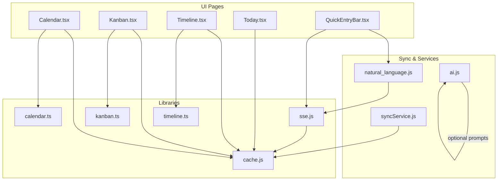

**Diagram sources**

- [Calendar.tsx:1-516](file://frontend/src/pages/Calendar.tsx#L1-L516)
- [Kanban.tsx:1-407](file://frontend/src/pages/Kanban.tsx#L1-L407)
- [Timeline.tsx:1-398](file://frontend/src/pages/Timeline.tsx#L1-L398)
- [Today.tsx:1-275](file://frontend/src/pages/Today.tsx#L1-L275)
- [QuickEntryBar.tsx:1-259](file://frontend/src/components/QuickEntryBar.tsx#L1-L259)
- [calendar.ts:1-158](file://frontend/src/lib/calendar.ts#L1-L158)
- [kanban.ts:1-130](file://frontend/src/lib/kanban.ts#L1-L130)
- [timeline.ts:1-276](file://frontend/src/lib/timeline.ts#L1-L276)
- [sse.js:1-185](file://frontend/src/lib/sse.js#L1-L185)
- [cache.js:1-389](file://frontend/src/lib/cache.js#L1-L389)
- [syncService.js:1-466](file://frontend/src/CacheFunctions/syncService.js#L1-L466)
- [natural_language.js:1-44](file://frontend/src/functions/project/natural_language.js#L1-L44)
- [ai.js:1-25](file://frontend/src/functions/ai.js#L1-L25)

**Section sources**

- [Calendar.tsx:1-516](file://frontend/src/pages/Calendar.tsx#L1-L516)
- [Kanban.tsx:1-407](file://frontend/src/pages/Kanban.tsx#L1-L407)
- [Timeline.tsx:1-398](file://frontend/src/pages/Timeline.tsx#L1-L398)
- [Today.tsx:1-275](file://frontend/src/pages/Today.tsx#L1-L275)
- [cache.js:1-389](file://frontend/src/lib/cache.js#L1-L389)
- [syncService.js:1-466](file://frontend/src/CacheFunctions/syncService.js#L1-L466)

## Core Components

- Calendar view: month/week navigation, event creation via day modal, drag-and-drop rescheduling, project-based color coding, overdue/completed/upcoming indicators.
- Kanban board: move tasks between columns by drag-and-drop, filter by project and free-text search, status-aware timestamps for started/ended times.
- Timeline view: zoomable Gantt-like view, dependency arrows, today marker, row layout to avoid overlaps, progress indicated by status.
- Today workflow: sections for overdue, due today, and in-progress items; priority badges; quick access to project details.
- AI-powered entry creation: natural language input parses project, fields, priority, due date; optional voice input; SSE-driven updates; summaries.
- Offline mode: local-first SQLite cache; reads work offline; derived data computed locally; online-only features disabled when offline.
- Real-time collaboration: SSE stream receives parsed entries and errors; cache invalidation triggers UI refresh without full reloads.
- Notifications: bell badge with unread count; due-soon and overdue alerts; mark individual or all as read; full history page.

**Section sources**

- [Calendar.tsx:1-516](file://frontend/src/pages/Calendar.tsx#L1-L516)
- [Kanban.tsx:1-407](file://frontend/src/pages/Kanban.tsx#L1-L407)
- [Timeline.tsx:1-398](file://frontend/src/pages/Timeline.tsx#L1-L398)
- [Today.tsx:1-275](file://frontend/src/pages/Today.tsx#L1-L275)
- [QuickEntryBar.tsx:1-259](file://frontend/src/components/QuickEntryBar.tsx#L1-L259)
- [sse.js:1-185](file://frontend/src/lib/sse.js#L1-L185)
- [NotificationsBell.tsx:1-211](file://frontend/src/components/NotificationsBell.tsx#L1-L211)
- [NotificationsPage.tsx:1-199](file://frontend/src/pages/NotificationsPage.tsx#L1-L199)

## Architecture Overview

The app uses a local-first architecture:

- All pages read from IndexedDB-backed SQLite cache.
- A sync service fetches projects, entries, archives, fields, profile, activity, and computes derived data (due-soon, stats, streaks).
- Natural language entry creation posts to the backend; results arrive via SSE and invalidate relevant caches so UIs re-render.
- Offline mode disables network-dependent features while keeping cached data available.

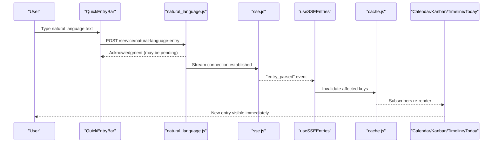

**Diagram sources**

- [QuickEntryBar.tsx:61-134](file://frontend/src/components/QuickEntryBar.tsx#L61-L134)
- [natural_language.js:13-43](file://frontend/src/functions/project/natural_language.js#L13-L43)
- [sse.js:37-101](file://frontend/src/lib/sse.js#L37-L101)
- [useSSEEntries.ts:41-108](file://frontend/src/hooks/useSSEEntries.ts#L41-L108)
- [cache.js:45-72](file://frontend/src/lib/cache.js#L45-L72)

## Detailed Component Analysis

### Calendar View

- Navigation: Month and Week views with previous/next controls and “Today” button.
- Event creation: Clicking a day opens a modal to add an entry; newly created entries appear after cache invalidation.
- Drag-and-drop rescheduling: Drag an entry pill onto another day to change its due date; the system updates the entry and reflects changes instantly.
- Color coding: Each project has a color; entry pills show a left border using the project color map. Overdue, completed, and upcoming states are visually distinct.

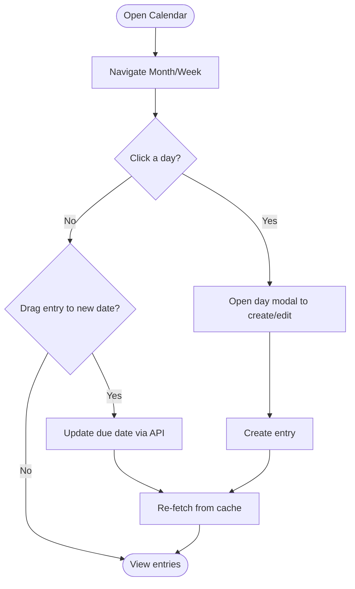

**Diagram sources**

- [Calendar.tsx:280-359](file://frontend/src/pages/Calendar.tsx#L280-L359)
- [calendar.ts:145-158](file://frontend/src/lib/calendar.ts#L145-L158)

**Section sources**

- [Calendar.tsx:1-516](file://frontend/src/pages/Calendar.tsx#L1-L516)
- [calendar.ts:1-158](file://frontend/src/lib/calendar.ts#L1-L158)

### Kanban Board

- Task movement: Drag cards between columns to change status; timestamps for started_at and ended_at are auto-set when moving to “In Motion” or “Done & Dusted”.
- Filtering: Filter by project and search by title or project name; clear filters to reset.
- Bulk actions: While there is no explicit multi-select, you can quickly move multiple items by repeated drag-and-drop; status changes are persisted per item.

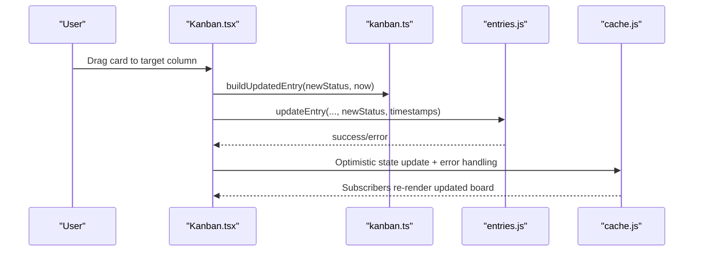

**Diagram sources**

- [Kanban.tsx:246-286](file://frontend/src/pages/Kanban.tsx#L246-L286)
- [kanban.ts:75-106](file://frontend/src/lib/kanban.ts#L75-L106)

**Section sources**

- [Kanban.tsx:1-407](file://frontend/src/pages/Kanban.tsx#L1-L407)
- [kanban.ts:1-130](file://frontend/src/lib/kanban.ts#L1-L130)

### Timeline View

- Planning: Zoom in/out to adjust time scale; bars span start to due date; today marker shows current date.
- Dependencies: Arrows connect predecessor to successor based on dependencies stored in entry metadata.
- Progress tracking: Bar styles reflect status (upcoming, active, done); click a bar to navigate to the project.

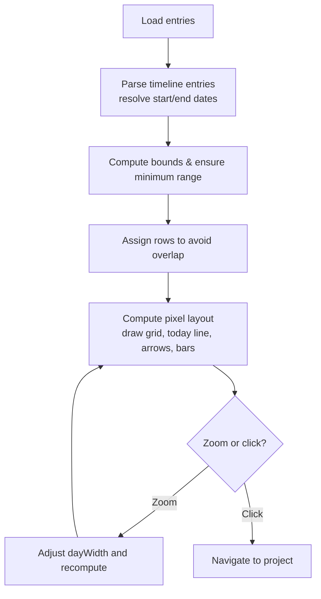

**Diagram sources**

- [Timeline.tsx:167-229](file://frontend/src/pages/Timeline.tsx#L167-L229)
- [timeline.ts:80-140](file://frontend/src/lib/timeline.ts#L80-L140)
- [timeline.ts:157-238](file://frontend/src/lib/timeline.ts#L157-L238)
- [timeline.ts:250-276](file://frontend/src/lib/timeline.ts#L250-L276)

**Section sources**

- [Timeline.tsx:1-398](file://frontend/src/pages/Timeline.tsx#L1-L398)
- [timeline.ts:1-276](file://frontend/src/lib/timeline.ts#L1-L276)

### Today Workflow

- Sections: Overdue, Due today, In progress; each section lists relevant items with priority badges and due dates.
- Priority setting: Priority labels render with distinct classes for urgent/high/low.
- Completion tracking: Items marked “in motion” show an active indicator; clicking navigates to the project where you can complete the task.

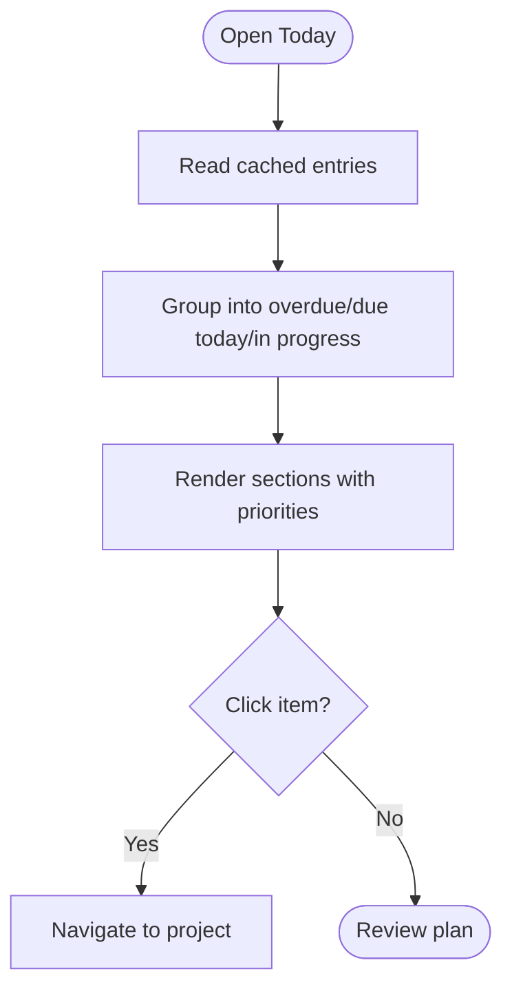

**Diagram sources**

- [Today.tsx:187-194](file://frontend/src/pages/Today.tsx#L187-L194)

**Section sources**

- [Today.tsx:1-275](file://frontend/src/pages/Today.tsx#L1-L275)

### AI-Powered Features

- Natural language entry creation: Type a sentence like “Fixed login bug for ProjectX, urgent, due tomorrow”; the backend parses project, fields, priority, and due date.
- Smart suggestions and summaries: The UI may display a short comment or summary provided by the backend; titles are derived from parsed fields or summaries.
- Voice input: Optional microphone button enables dictation; requires internet connection.
- Real-time updates: SSE delivers parsed results; the hook invalidates caches so the UI updates without manual refresh.

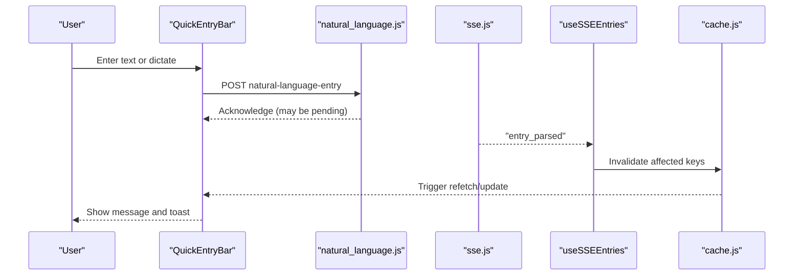

**Diagram sources**

- [QuickEntryBar.tsx:61-134](file://frontend/src/components/QuickEntryBar.tsx#L61-L134)
- [natural_language.js:13-43](file://frontend/src/functions/project/natural_language.js#L13-L43)
- [sse.js:37-101](file://frontend/src/lib/sse.js#L37-L101)
- [useSSEEntries.ts:41-108](file://frontend/src/hooks/useSSEEntries.ts#L41-L108)

**Section sources**

- [QuickEntryBar.tsx:1-259](file://frontend/src/components/QuickEntryBar.tsx#L1-L259)
- [natural_language.js:1-44](file://frontend/src/functions/project/natural_language.js#L1-L44)
- [sse.js:1-185](file://frontend/src/lib/sse.js#L1-L185)
- [useSSEEntries.ts:1-108](file://frontend/src/hooks/useSSEEntries.ts#L1-L108)
- [ai.js:1-25](file://frontend/src/functions/ai.js#L1-L25)

### Offline Mode Usage

- Local-first: All pages read from the SQLite cache; if no data exists, the app triggers an initial sync when online.
- Derived data: When offline, the sync service computes due-soon, stats, and streaks from cached entries instead of calling the server.
- Disabled features: Quick add and voice input require an internet connection; an offline banner indicates limited functionality.

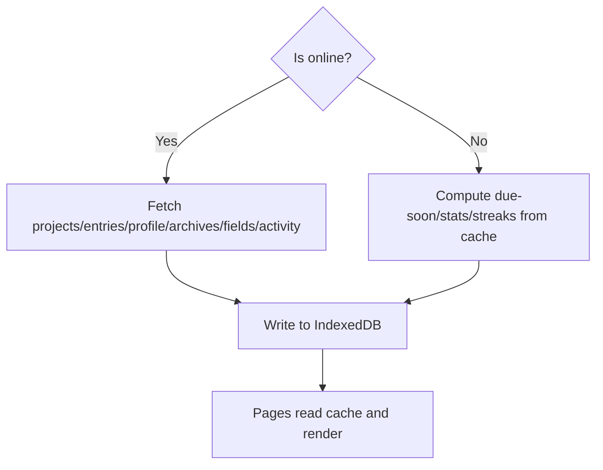

**Diagram sources**

- [syncService.js:114-154](file://frontend/src/CacheFunctions/syncService.js#L114-L154)
- [cache.js:179-223](file://frontend/src/lib/cache.js#L179-L223)
- [OfflineBanner.tsx:1-52](file://frontend/src/components/OfflineBanner.tsx#L1-L52)

**Section sources**

- [syncService.js:1-466](file://frontend/src/CacheFunctions/syncService.js#L1-L466)
- [cache.js:1-389](file://frontend/src/lib/cache.js#L1-L389)
- [OfflineBanner.tsx:1-52](file://frontend/src/components/OfflineBanner.tsx#L1-L52)

### Real-Time Collaboration

- SSE stream: The client connects to the SSE endpoint and listens for events such as “connected”, “entry_parsed”, and “entry_error”.
- Cache invalidation: On receiving parsed entries, the hook deletes relevant cache keys so subscribers re-render with fresh data.
- Reconnection: Exponential backoff reconnects on errors; max attempts prevent infinite loops.

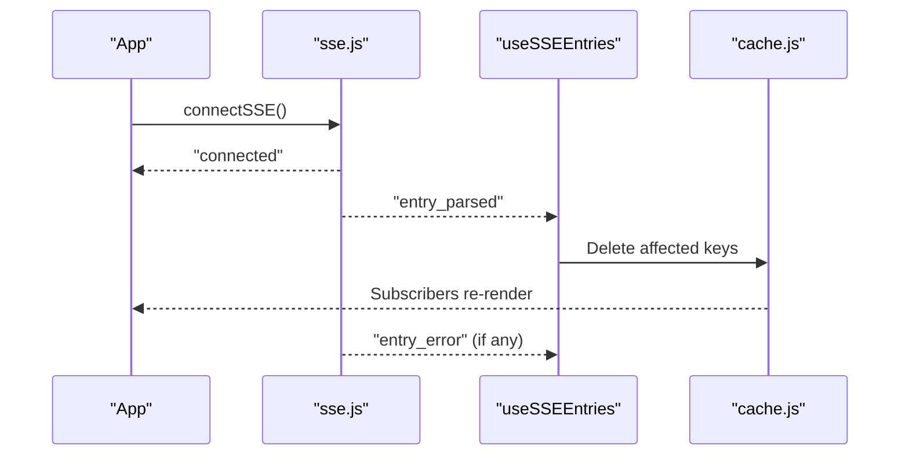

**Diagram sources**

- [sse.js:37-101](file://frontend/src/lib/sse.js#L37-L101)
- [useSSEEntries.ts:41-108](file://frontend/src/hooks/useSSEEntries.ts#L41-L108)
- [cache.js:45-72](file://frontend/src/lib/cache.js#L45-L72)

**Section sources**

- [sse.js:1-185](file://frontend/src/lib/sse.js#L1-L185)
- [useSSEEntries.ts:1-108](file://frontend/src/hooks/useSSEEntries.ts#L1-L108)

### Notification Settings

- Bell badge: Polls for notifications every minute and on window focus; shows unread count.
- Marking as read: Click a notification to mark it read; “Mark all read” clears the badge.
- History page: Full list of due-soon and overdue notifications with pagination and relative timestamps.

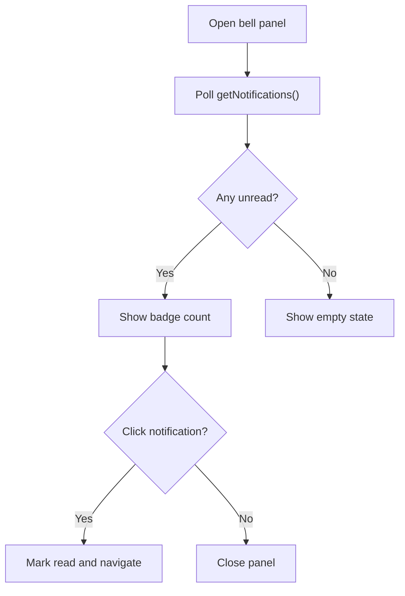

**Diagram sources**

- [NotificationsBell.tsx:61-116](file://frontend/src/components/NotificationsBell.tsx#L61-L116)
- [NotificationsPage.tsx:67-112](file://frontend/src/pages/NotificationsPage.tsx#L67-L112)

**Section sources**

- [NotificationsBell.tsx:1-211](file://frontend/src/components/NotificationsBell.tsx#L1-L211)
- [NotificationsPage.tsx:1-199](file://frontend/src/pages/NotificationsPage.tsx#L1-L199)

## Dependency Analysis

Key relationships:

- Pages depend on lib utilities for calendar, kanban, and timeline computations.
- QuickEntryBar depends on natural language parsing and SSE for real-time updates.
- All pages subscribe to cache changes to stay in sync with SSE and sync operations.
- Sync service orchestrates server calls and populates the cache; offline mode computes derived data locally.

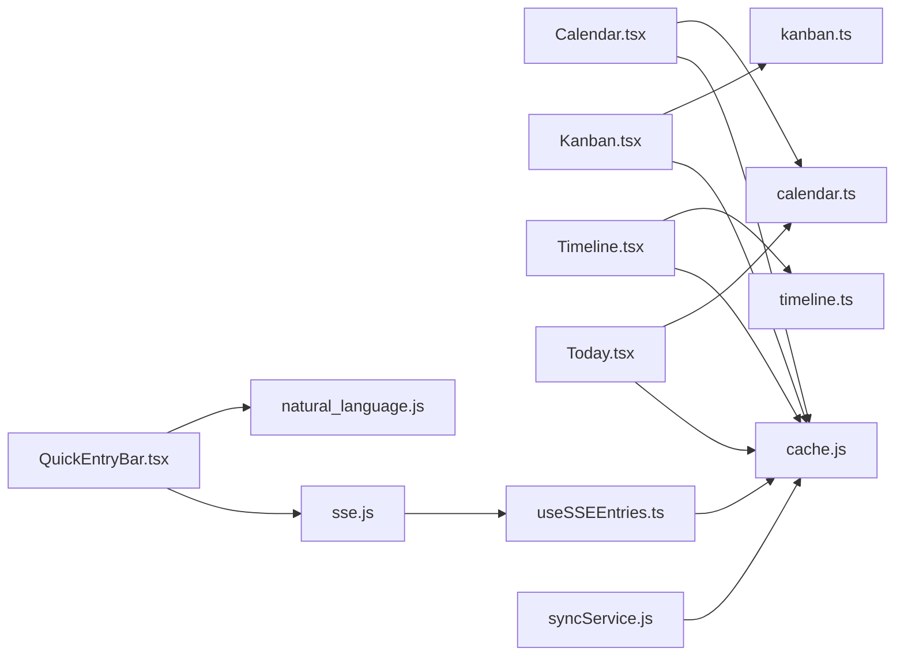

**Diagram sources**

- [Calendar.tsx:1-516](file://frontend/src/pages/Calendar.tsx#L1-L516)
- [Kanban.tsx:1-407](file://frontend/src/pages/Kanban.tsx#L1-L407)
- [Timeline.tsx:1-398](file://frontend/src/pages/Timeline.tsx#L1-L398)
- [Today.tsx:1-275](file://frontend/src/pages/Today.tsx#L1-L275)
- [QuickEntryBar.tsx:1-259](file://frontend/src/components/QuickEntryBar.tsx#L1-L259)
- [calendar.ts:1-158](file://frontend/src/lib/calendar.ts#L1-L158)
- [kanban.ts:1-130](file://frontend/src/lib/kanban.ts#L1-L130)
- [timeline.ts:1-276](file://frontend/src/lib/timeline.ts#L1-L276)
- [sse.js:1-185](file://frontend/src/lib/sse.js#L1-L185)
- [useSSEEntries.ts:1-108](file://frontend/src/hooks/useSSEEntries.ts#L1-L108)
- [cache.js:1-389](file://frontend/src/lib/cache.js#L1-L389)
- [syncService.js:1-466](file://frontend/src/CacheFunctions/syncService.js#L1-L466)

**Section sources**

- [syncService.js:1-466](file://frontend/src/CacheFunctions/syncService.js#L1-L466)
- [cache.js:1-389](file://frontend/src/lib/cache.js#L1-L389)

## Performance Considerations

- Local-first reads: Pages read from IndexedDB-backed SQLite for instant rendering; background sync keeps data fresh.
- Throttled sync: Full sync is throttled to avoid excessive server calls; duplicate concurrent syncs are prevented.
- Efficient layouts: Timeline uses greedy row assignment to minimize overlapping bars; Kanban groups and filters reduce rendering load.
- SSE efficiency: Only affected cache keys are invalidated, minimizing re-renders.

[No sources needed since this section provides general guidance]

## Troubleshooting Guide

- Calendar drag-and-drop fails: Ensure the source and target dates differ; check for network connectivity when updating due dates.
- Kanban status not updating: Verify drag-and-drop targets different columns; check error messages and retry.
- Timeline shows no data: Add entries with start and due dates; ensure dependencies are set to see arrows.
- AI entry not appearing: Confirm SSE connection; check for “entry_error” events; verify cache invalidation occurred.
- Offline limitations: Quick add and voice input require internet; use the offline banner to identify restricted features.
- Notifications not refreshing: Ensure polling is active; check browser focus and network status.

**Section sources**

- [Calendar.tsx:313-343](file://frontend/src/pages/Calendar.tsx#L313-L343)
- [Kanban.tsx:250-286](file://frontend/src/pages/Kanban.tsx#L250-L286)
- [Timeline.tsx:286-313](file://frontend/src/pages/Timeline.tsx#L286-L313)
- [sse.js:60-101](file://frontend/src/lib/sse.js#L60-L101)
- [useSSEEntries.ts:55-98](file://frontend/src/hooks/useSSEEntries.ts#L55-L98)
- [OfflineBanner.tsx:1-52](file://frontend/src/components/OfflineBanner.tsx#L1-L52)
- [NotificationsBell.tsx:61-86](file://frontend/src/components/NotificationsBell.tsx#L61-L86)

## Conclusion

The application provides a robust, local-first experience with powerful views for planning and execution. Calendar, Kanban, Timeline, and Today surfaces support intuitive workflows, while AI-powered entry creation and SSE enable fast, collaborative updates. Offline mode ensures continuity, and notifications keep users informed about deadlines. Use the guides above to maximize productivity across all features.

[No sources needed since this section summarizes without analyzing specific files]
