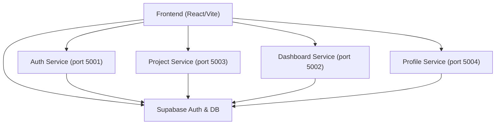
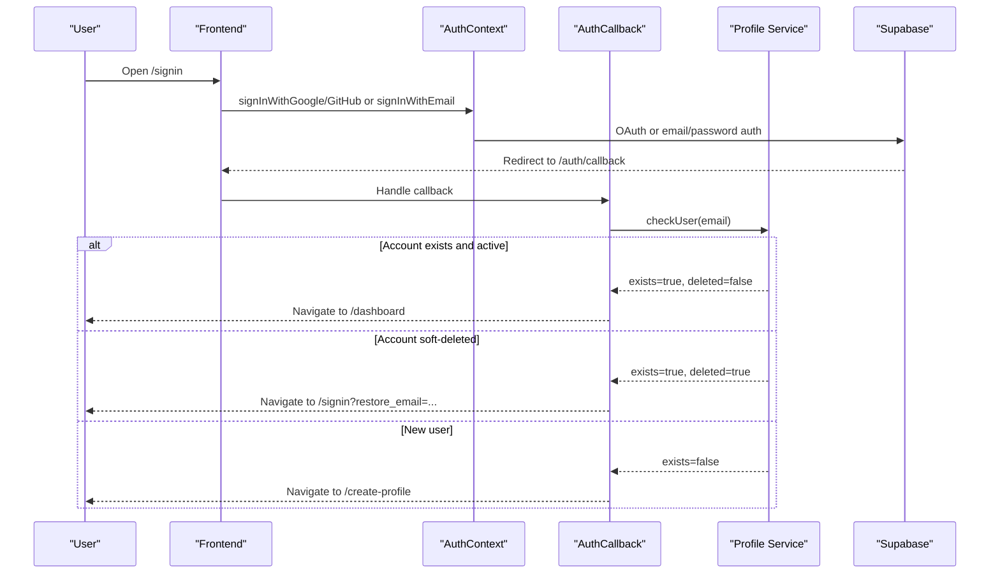
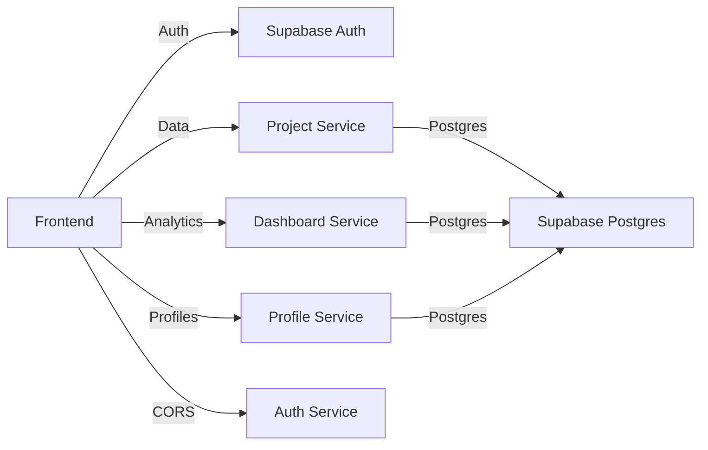

# Getting Started FAQ

<cite>
**Referenced Files in This Document**
- [SignIn.tsx](file://frontend/src/pages/SignIn.tsx)
- [AuthCallback.tsx](file://frontend/src/pages/AuthCallback.tsx)
- [CreateProfile.tsx](file://frontend/src/pages/CreateProfile.tsx)
- [AuthContext.tsx](file://frontend/src/context/AuthContext.tsx)
- [ProtectedRoute.tsx](file://frontend/src/components/ProtectedRoute.tsx)
- [Dashboard.tsx](file://frontend/src/pages/Dashboard.tsx)
- [AddEntry.tsx](file://frontend/src/pages/AddEntry.tsx)
- [tour.ts](file://frontend/src/lib/tour.ts)
- [getting-started.md](file://docs-site/docs/getting-started.md)
- [README.md](file://README.md)
- [validation.ts](file://frontend/src/lib/validation.ts)
- [useNetworkStatus.js](file://frontend/src/hooks/useNetworkStatus.js)
- [index.js (auth-service)](file://services/auth-service/src/index.js)
</cite>

## Table of Contents

1. Introduction
2. Project Structure
3. Core Components
4. Architecture Overview
5. Detailed Component Analysis
6. Dependency Analysis
7. Performance Considerations
8. Troubleshooting Guide
9. Conclusion
10. Appendices

## Introduction

This FAQ helps new users get started quickly with the Digital Logbook app. It covers account creation, initial profile setup, first-time onboarding, installation and environment setup, browser compatibility, creating your first project and entries, navigating the interface, mobile usage, cross-device sync, and troubleshooting common issues like authentication failures, permission problems, and data loading issues.

## Project Structure

The application is a monorepo with:

- A React frontend that handles sign-in, profile setup, dashboard, projects, entries, and guided tours.
- Backend microservices for auth, dashboard analytics, project management, and profiles.
- Supabase for authentication and database.

**Diagram sources**

- [getting-started.md:140-188](file://docs-site/docs/getting-started.md#L140-L188)
- [README.md:20-31](file://README.md#L20-L31)

**Section sources**

- [getting-started.md:140-188](file://docs-site/docs/getting-started.md#L140-L188)
- [README.md:20-31](file://README.md#L20-L31)

## Core Components

- Sign-in and sign-up: email/password and OAuth providers (Google, GitHub).
- Profile setup: name and username after first login.
- Dashboard: home view with quick entry, projects, stats, and guided tour.
- Entry creation: dynamic fields per project, due dates, priority, status, notes.
- Protected routes: ensure only authenticated users access protected pages.

**Section sources**

- [SignIn.tsx:17-200](file://frontend/src/pages/SignIn.tsx#L17-L200)
- [AuthCallback.tsx:10-38](file://frontend/src/pages/AuthCallback.tsx#L10-L38)
- [CreateProfile.tsx:15-41](file://frontend/src/pages/CreateProfile.tsx#L15-L41)
- [Dashboard.tsx:111-123](file://frontend/src/pages/Dashboard.tsx#L111-L123)
- [AddEntry.tsx:118-244](file://frontend/src/pages/AddEntry.tsx#L118-L244)
- [ProtectedRoute.tsx:7-80](file://frontend/src/components/ProtectedRoute.tsx#L7-L80)

## Architecture Overview

Authentication flow overview:

- Users sign in via email/password or OAuth.
- The callback page completes the session and routes to either dashboard or profile setup.
- Soft-deleted accounts are redirected to a restore prompt.

**Diagram sources**

- [AuthContext.tsx:82-135](file://frontend/src/context/AuthContext.tsx#L82-L135)
- [AuthCallback.tsx:10-38](file://frontend/src/pages/AuthCallback.tsx#L10-L38)
- [SignIn.tsx:132-149](file://frontend/src/pages/SignIn.tsx#L132-L149)

**Section sources**

- [AuthContext.tsx:82-135](file://frontend/src/context/AuthContext.tsx#L82-L135)
- [AuthCallback.tsx:10-38](file://frontend/src/pages/AuthCallback.tsx#L10-L38)
- [SignIn.tsx:132-149](file://frontend/src/pages/SignIn.tsx#L132-L149)

## Detailed Component Analysis

### Account Creation and Sign-In

- Email/password sign-up validates emails, blocks disposable domains, suggests corrections for common typos, and enforces password requirements before submission.
- OAuth sign-in supports Google and GitHub; redirects back to the app via a callback route.
- After successful sign-in, users are routed based on account state: existing users go to dashboard; new users go to profile setup; soft-deleted accounts see a restore prompt.

Key behaviors:

- Email validation and typo suggestions occur before sending credentials to the backend.
- Password requirements are shown live during sign-up.
- OAuth flows use PKCE or hash-based tokens depending on provider behavior.

**Section sources**

- [SignIn.tsx:151-200](file://frontend/src/pages/SignIn.tsx#L151-L200)
- [SignIn.tsx:32-48](file://frontend/src/pages/SignIn.tsx#L32-L48)
- [validation.ts:80-127](file://frontend/src/lib/validation.ts#L80-L127)
- [AuthContext.tsx:82-135](file://frontend/src/context/AuthContext.tsx#L82-L135)
- [AuthCallback.tsx:40-133](file://frontend/src/pages/AuthCallback.tsx#L40-L133)

### Initial Profile Setup

- After first login, users set their full name and username.
- The system creates or updates the user profile and then navigates to avatar selection.

Steps:

1. Enter full name and username.
2. Submit to create/update profile.
3. Proceed to avatar setup.

**Section sources**

- [CreateProfile.tsx:15-41](file://frontend/src/pages/CreateProfile.tsx#L15-L41)
- [CreateProfile.tsx:45-127](file://frontend/src/pages/CreateProfile.tsx#L45-L127)

### First-Time User Onboarding Experience

- A guided tour offers a one-time walkthrough of key features: Home, Today, Kanban, Timeline, Calendar, Stats, Import/Export, Projects, Notifications, Profile, Quick Entry, and Guide.
- Voice narration is optional and uses the browser’s speech synthesis.
- Tour completion is remembered locally so it won’t repeatedly prompt.

How to start:

- Accept the offer banner on the dashboard or click the Guide button in the top bar.

**Section sources**

- [tour.ts:267-417](file://frontend/src/lib/tour.ts#L267-L417)
- [tour.ts:419-599](file://frontend/src/lib/tour.ts#L419-L599)
- [Dashboard.tsx:118-123](file://frontend/src/pages/Dashboard.tsx#L118-L123)

### Creating Your First Project and Adding Entries

- From the dashboard, open the new project dialog to create a project and define custom fields if needed.
- Use the quick entry bar or the Add Entry form to create tasks with due dates, priority, status, and notes.
- Fields are dynamic per project; required fields must be filled before saving.

Steps:

1. Create a project from the dashboard.
2. Define fields (optional) such as text, number, date, boolean, or custom options.
3. Add an entry using the quick entry or the detailed form.
4. Set due date, priority, and status; attach notes or images.

**Section sources**

- [Dashboard.tsx:765-800](file://frontend/src/pages/Dashboard.tsx#L765-L800)
- [AddEntry.tsx:118-244](file://frontend/src/pages/AddEntry.tsx#L118-L244)
- [AddEntry.tsx:258-494](file://frontend/src/pages/AddEntry.tsx#L258-L494)

### Navigating the Main Interface

- Dashboard: overview of all work, due-soon highlights, and quick actions.
- Views: Today, Kanban, Timeline, Calendar, Stats, Data Portability.
- Drawer navigation: Home, Today, Kanban, Timeline, Calendar, Stats, Projects, Archives, Import/Export.
- Top bar: notifications bell, profile menu, settings, guide.

Tips:

- Use the drawer to switch between views.
- Use the quick entry bar to log work quickly.
- Use the notifications bell for due-soon and overdue alerts.

**Section sources**

- [Dashboard.tsx:111-123](file://frontend/src/pages/Dashboard.tsx#L111-L123)
- [tour.ts:267-417](file://frontend/src/lib/tour.ts#L267-L417)

### Mobile App Access and Desktop Usage

- The app is a responsive web application optimized for desktop and mobile browsers.
- No separate mobile app is provided; use your device’s browser to access the deployed URL.
- On phones, layouts adapt to smaller screens with touch-friendly controls.

**Section sources**

- [README.md:89-101](file://README.md#L89-L101)
- [getting-started.md:139-147](file://docs-site/docs/getting-started.md#L139-L147)

### Cross-Device Synchronization

- Sessions persist until you manually sign out.
- Data is stored in IndexedDB and synced with the server when online; offline changes queue and replay when connectivity returns.
- SSE (Server-Sent Events) provide real-time updates for entries across devices.

Notes:

- If offline, initial load may show empty until you reconnect.
- Network status is tracked to inform UI about connectivity.

**Section sources**

- [AuthContext.tsx:137-151](file://frontend/src/context/AuthContext.tsx#L137-L151)
- [Dashboard.tsx:341-461](file://frontend/src/pages/Dashboard.tsx#L341-L461)
- [useNetworkStatus.js:14-40](file://frontend/src/hooks/useNetworkStatus.js#L14-L40)

## Dependency Analysis

Key dependencies and integration points:

- Frontend depends on Supabase for auth and database.
- Backend services depend on Supabase Postgres and each other indirectly through shared data.
- CORS is enforced on the auth service for allowed origins.

**Diagram sources**

- [getting-started.md:140-188](file://docs-site/docs/getting-started.md#L140-L188)
- [index.js (auth-service):7-33](file://services/auth-service/src/index.js#L7-L33)

**Section sources**

- [getting-started.md:140-188](file://docs-site/docs/getting-started.md#L140-L188)
- [index.js (auth-service):7-33](file://services/auth-service/src/index.js#L7-L33)

## Performance Considerations

- Local-first data loading reduces latency by reading from IndexedDB first and syncing when needed.
- SSE keeps the UI updated without polling.
- Image compression is performed client-side to reduce payload size when attaching notes.

Recommendations:

- Keep network connectivity stable for optimal sync.
- Avoid large image attachments; compress where possible.

**Section sources**

- [Dashboard.tsx:341-461](file://frontend/src/pages/Dashboard.tsx#L341-L461)
- [AddEntry.tsx:90-116](file://frontend/src/pages/AddEntry.tsx#L90-L116)

## Troubleshooting Guide

### Authentication Failures

Symptoms:

- Cannot sign in with email/password or OAuth.
- Redirect loop after OAuth.
- “No authorization data found” error.

Checks:

- Ensure correct Supabase URL and keys in frontend .env.
- Verify OAuth redirect URI matches the callback route.
- Confirm allowed origins for CORS if running local dev servers.

Actions:

- Re-check environment variables and restart the dev server.
- Clear browser cache and cookies if sessions appear stale.
- For OAuth, ensure the callback URL is correctly configured in Supabase.

**Section sources**

- [AuthCallback.tsx:40-133](file://frontend/src/pages/AuthCallback.tsx#L40-L133)
- [AuthContext.tsx:82-135](file://frontend/src/context/AuthContext.tsx#L82-L135)
- [index.js (auth-service):7-33](file://services/auth-service/src/index.js#L7-L33)

### Permission Issues

Symptoms:

- Protected routes redirect to sign-in unexpectedly.
- API calls fail due to missing or invalid session.

Checks:

- Confirm you are signed in and not soft-deleted.
- Verify session persistence and that the context has loaded.

Actions:

- Sign out and sign in again.
- Check for soft-deletion prompts and follow restore steps.

**Section sources**

- [ProtectedRoute.tsx:7-80](file://frontend/src/components/ProtectedRoute.tsx#L7-L80)
- [AuthCallback.tsx:10-38](file://frontend/src/pages/AuthCallback.tsx#L10-L38)

### Initial Data Loading Problems

Symptoms:

- Dashboard shows no data on first visit.
- Offline mode prevents data sync.

Checks:

- Ensure network connectivity.
- Confirm IndexedDB cache is being populated by syncAllData.

Actions:

- Refresh the page after reconnecting to the internet.
- Verify that services are reachable and CORS allows your origin.

**Section sources**

- [Dashboard.tsx:341-461](file://frontend/src/pages/Dashboard.tsx#L341-L461)
- [useNetworkStatus.js:14-40](file://frontend/src/hooks/useNetworkStatus.js#L14-L40)

### Installation and Environment Setup

Common issues:

- Missing Node.js version or dependencies.
- Incorrect Supabase configuration.
- Backend services not running or ports mismatched.

Steps:

- Install Node.js 20+ and npm.
- Clone the repository and install dependencies for each service.
- Configure environment variables for frontend and backend services.
- Run backend services and frontend dev server.

References:

- Prerequisites and setup instructions are documented in the getting-started guide.

**Section sources**

- [getting-started.md:6-14](file://docs-site/docs/getting-started.md#L6-L14)
- [getting-started.md:139-188](file://docs-site/docs/getting-started.md#L139-L188)
- [README.md:103-205](file://README.md#L103-L205)

### Browser Compatibility Requirements

- Modern browsers supported; the app uses standard web APIs.
- Speech synthesis used for guided tour voice narration may vary by browser.
- Responsive design adapts to mobile screens.

If features do not work:

- Update your browser to the latest version.
- Enable JavaScript and allow media permissions for voice narration.

**Section sources**

- [tour.ts:95-139](file://frontend/src/lib/tour.ts#L95-L139)
- [README.md:89-101](file://README.md#L89-L101)

## Conclusion

You can now create an account, set up your profile, and start using the Digital Logbook to manage projects and entries. Use the guided tour to explore features, rely on the dashboard for daily workflows, and leverage mobile-friendly browsing for on-the-go access. Refer to the troubleshooting section if you encounter authentication, permission, or data loading issues.

## Appendices

### Quick Reference: First Steps

- Sign up or sign in via email/password or OAuth.
- Complete profile setup (name and username).
- Take the guided tour to learn the interface.
- Create your first project and add entries.
- Use Today, Kanban, Timeline, and Calendar views to organize work.

**Section sources**

- [SignIn.tsx:17-200](file://frontend/src/pages/SignIn.tsx#L17-L200)
- [CreateProfile.tsx:15-41](file://frontend/src/pages/CreateProfile.tsx#L15-L41)
- [tour.ts:267-417](file://frontend/src/lib/tour.ts#L267-L417)
- [Dashboard.tsx:765-800](file://frontend/src/pages/Dashboard.tsx#L765-L800)
- [AddEntry.tsx:118-244](file://frontend/src/pages/AddEntry.tsx#L118-L244)
