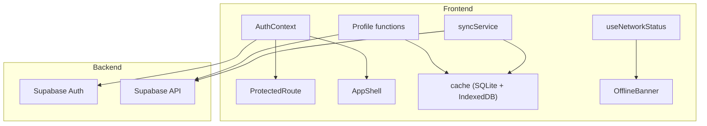
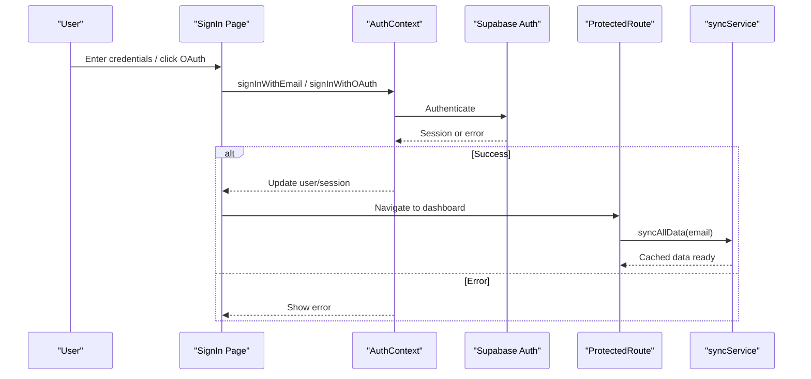
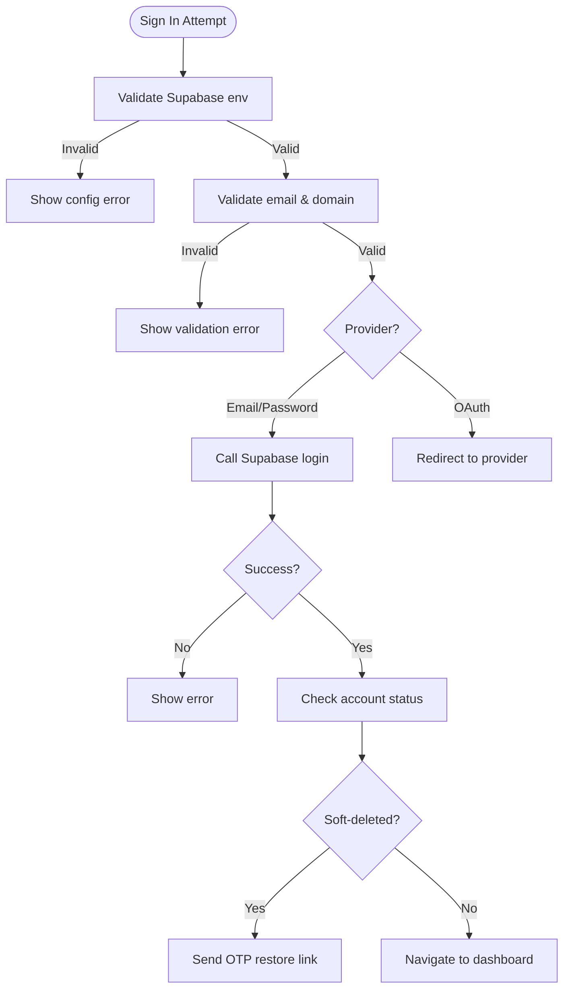
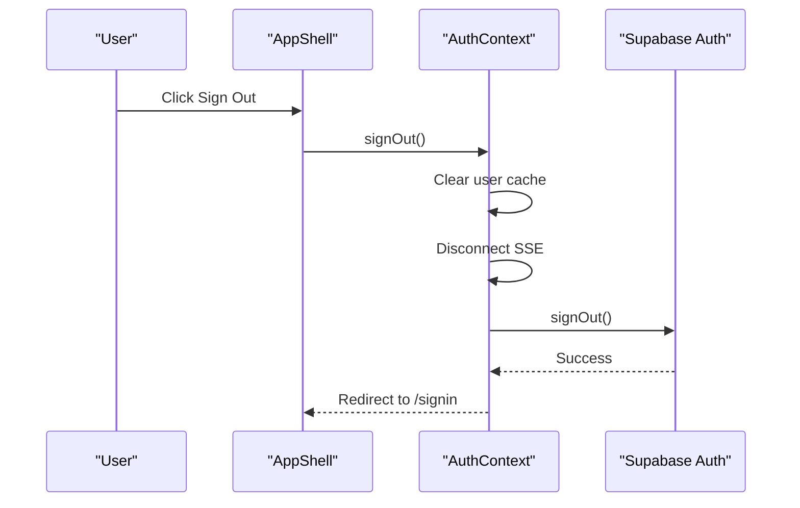
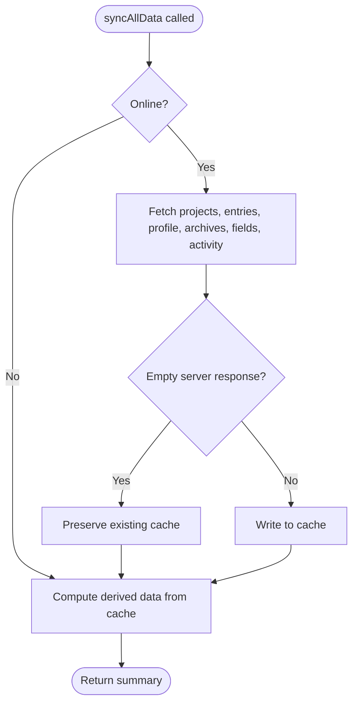
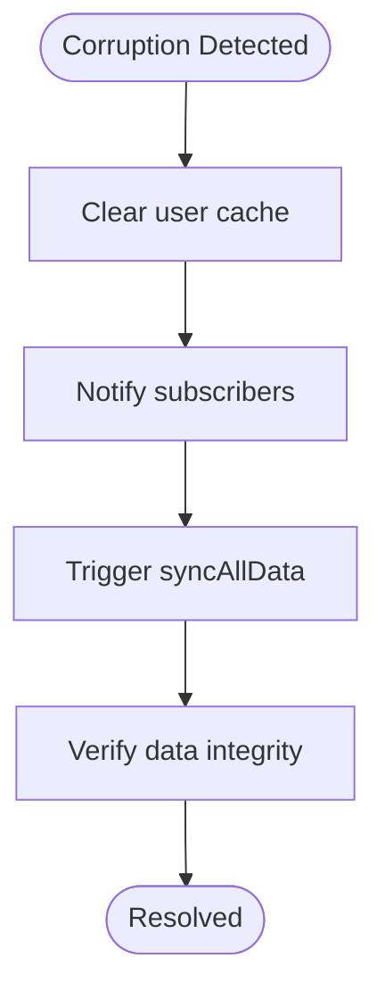
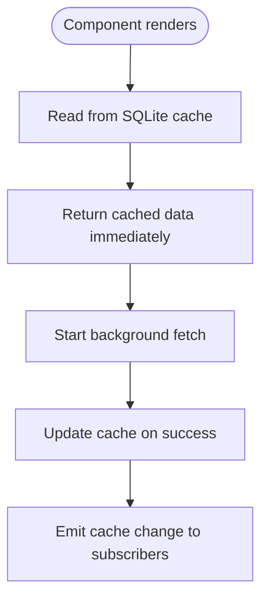
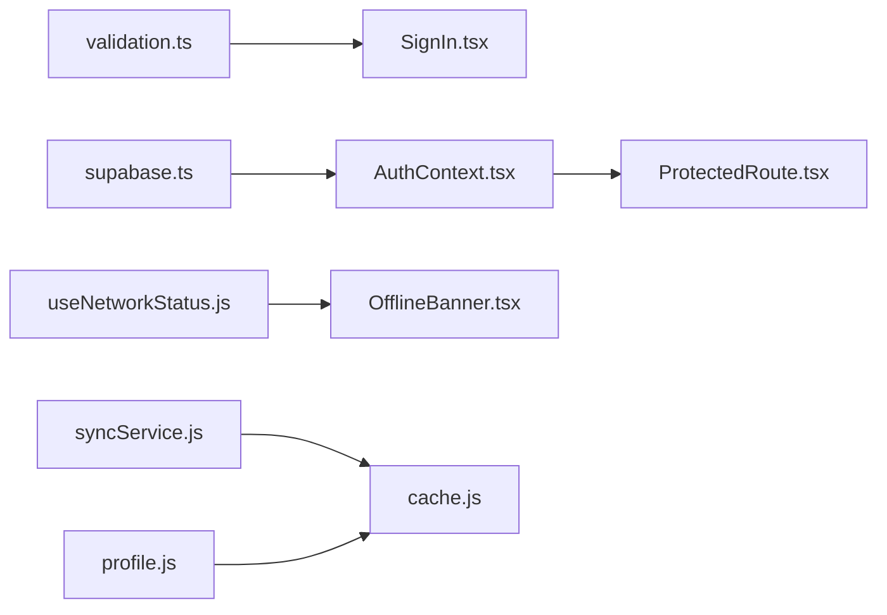

# Troubleshooting FAQ

<cite>
**Referenced Files in This Document**
- [AuthContext.tsx](file://frontend/src/context/AuthContext.tsx)
- [SignIn.tsx](file://frontend/src/pages/SignIn.tsx)
- [ResetPassword.tsx](file://frontend/src/pages/ResetPassword.tsx)
- [ProtectedRoute.tsx](file://frontend/src/components/ProtectedRoute.tsx)
- [supabase.ts](file://frontend/src/lib/supabase.ts)
- [validation.ts](file://frontend/src/lib/validation.ts)
- [useNetworkStatus.js](file://frontend/src/hooks/useNetworkStatus.js)
- [OfflineBanner.tsx](file://frontend/src/components/OfflineBanner.tsx)
- [syncService.js](file://frontend/src/CacheFunctions/syncService.js)
- [cache.js](file://frontend/src/lib/cache.js)
- [AppShell.tsx](file://frontend/src/components/AppShell.tsx)
- [useInactivityLogout.ts](file://frontend/src/hooks/useInactivityLogout.ts)
- [profile.js](file://frontend/src/functions/profile/profile.js)
- [AuthCallback.tsx](file://frontend/src/pages/AuthCallback.tsx)
- [AuthRestore.tsx](file://frontend/src/pages/AuthRestore.tsx)
</cite>

## Table of Contents

1. Introduction
2. Project Structure
3. Core Components
4. Architecture Overview
5. Detailed Component Analysis
6. Dependency Analysis
7. Performance Considerations
8. Troubleshooting Guide
9. Conclusion
10. Appendices

## Introduction

This document provides comprehensive troubleshooting guidance for authentication, data synchronization, performance, and accessibility issues. It focuses on login failures, password reset problems, session timeouts, offline sync conflicts, network connectivity issues, cache corruption recovery, slow loading times, memory optimization, browser-specific problems, mobile responsiveness, keyboard navigation, screen reader compatibility, and recovering from corrupted data states by clearing local storage or resetting preferences.

## Project Structure

The application uses a local-first architecture:

- Authentication is handled via Supabase with context-based state management.
- Data is cached locally using an SQLite-backed store persisted to IndexedDB.
- Synchronization orchestrates server fetches and writes into the local cache.
- Network status hooks drive UI feedback and offline behavior.
- Protected routes guard authenticated pages and handle race conditions during OAuth flows.

**Diagram sources**

- [AuthContext.tsx:38-230](file://frontend/src/context/AuthContext.tsx#L38-L230)
- [ProtectedRoute.tsx:7-81](file://frontend/src/components/ProtectedRoute.tsx#L7-L81)
- [syncService.js:75-387](file://frontend/src/CacheFunctions/syncService.js#L75-L387)
- [cache.js:129-223](file://frontend/src/lib/cache.js#L129-L223)
- [useNetworkStatus.js:14-40](file://frontend/src/hooks/useNetworkStatus.js#L14-L40)
- [OfflineBanner.tsx:7-50](file://frontend/src/components/OfflineBanner.tsx#L7-L50)
- [profile.js:11-43](file://frontend/src/functions/profile/profile.js#L11-L43)

**Section sources**

- [AuthContext.tsx:38-230](file://frontend/src/context/AuthContext.tsx#L38-L230)
- [syncService.js:75-387](file://frontend/src/CacheFunctions/syncService.js#L75-L387)
- [cache.js:129-223](file://frontend/src/lib/cache.js#L129-L223)
- [useNetworkStatus.js:14-40](file://frontend/src/hooks/useNetworkStatus.js#L14-L40)
- [OfflineBanner.tsx:7-50](file://frontend/src/components/OfflineBanner.tsx#L7-L50)
- [ProtectedRoute.tsx:7-81](file://frontend/src/components/ProtectedRoute.tsx#L7-L81)

## Core Components

- Authentication context manages sign-in, sign-up, password reset/update, account deletion/restore, and session lifecycle.
- Protected route guards ensure users are authenticated even when context updates lag behind OAuth callbacks.
- Sync service orchestrates fetching projects, entries, profile, archives, fields, and activity; computes derived data like due-soon, stats, and streaks; and protects against overwriting good cache with empty server responses.
- Cache layer persists SQLite database to IndexedDB and exposes subscription-based updates.
- Network status hook drives offline banner and informs sync decisions.

**Section sources**

- [AuthContext.tsx:38-230](file://frontend/src/context/AuthContext.tsx#L38-L230)
- [ProtectedRoute.tsx:7-81](file://frontend/src/components/ProtectedRoute.tsx#L7-L81)
- [syncService.js:75-387](file://frontend/src/CacheFunctions/syncService.js#L75-L387)
- [cache.js:129-223](file://frontend/src/lib/cache.js#L129-L223)
- [useNetworkStatus.js:14-40](file://frontend/src/hooks/useNetworkStatus.js#L14-L40)

## Architecture Overview

Authentication flow includes email/password and OAuth providers, with redirect handling and post-login routing that checks for soft-deleted accounts and prompts restoration if needed.

**Diagram sources**

- [SignIn.tsx:132-200](file://frontend/src/pages/SignIn.tsx#L132-L200)
- [AuthContext.tsx:82-120](file://frontend/src/context/AuthContext.tsx#L82-L120)
- [ProtectedRoute.tsx:15-26](file://frontend/src/components/ProtectedRoute.tsx#L15-L26)
- [syncService.js:75-101](file://frontend/src/CacheFunctions/syncService.js#L75-L101)

## Detailed Component Analysis

### Authentication Issues

Common symptoms:

- Login fails immediately or redirects unexpectedly.
- Password reset link not received or expired.
- Session timeout or unexpected logout.

Root causes and fixes:

- Missing or invalid Supabase credentials cause client initialization failure. Validate environment variables and URL format.
- Email validation rejects disposable domains or malformed addresses; correct typos using suggestions before submission.
- OAuth redirect misconfiguration leads to callback errors; ensure redirect URLs match app origin.
- Soft-deleted accounts block sign-in; prompt restore via OTP and redirect to restore page.
- Inactivity logout can be enabled/disabled; currently disabled in auth context but available as a hook.

**Diagram sources**

- [supabase.ts:1-34](file://frontend/src/lib/supabase.ts#L1-L34)
- [validation.ts:80-127](file://frontend/src/lib/validation.ts#L80-L127)
- [SignIn.tsx:132-200](file://frontend/src/pages/SignIn.tsx#L132-L200)
- [SignIn.tsx:202-229](file://frontend/src/pages/SignIn.tsx#L202-L229)

**Section sources**

- [supabase.ts:1-34](file://frontend/src/lib/supabase.ts#L1-L34)
- [validation.ts:80-127](file://frontend/src/lib/validation.ts#L80-L127)
- [AuthContext.tsx:82-171](file://frontend/src/context/AuthContext.tsx#L82-L171)
- [SignIn.tsx:132-229](file://frontend/src/pages/SignIn.tsx#L132-L229)
- [ProtectedRoute.tsx:15-26](file://frontend/src/components/ProtectedRoute.tsx#L15-L26)

### Password Reset Problems

Symptoms:

- Reset email not received or link expired.
- Reset page shows generic errors.

Fixes:

- Ensure email is valid and not disposable; use suggestion feature to fix common typos.
- Confirm redirect URL for reset links matches app origin.
- If reset fails, retry after ensuring network connectivity and checking spam folder.

**Section sources**

- [ResetPassword.tsx:14-27](file://frontend/src/pages/ResetPassword.tsx#L14-L27)
- [AuthContext.tsx:153-162](file://frontend/src/context/AuthContext.tsx#L153-L162)
- [validation.ts:91-127](file://frontend/src/lib/validation.ts#L91-L127)

### Session Timeout Handling

Symptoms:

- Unexpected logout after periods of inactivity.
- Logout does not clear local cache or SSE connections.

Behavior:

- Inactivity logout hook exists but is disabled in auth context; it monitors mouse, keyboard, touch, scroll events and signs out after a configurable timeout.
- Manual sign-out clears user cache and disconnects SSE before calling Supabase sign-out.

**Diagram sources**

- [AppShell.tsx:17-27](file://frontend/src/components/AppShell.tsx#L17-L27)
- [AuthContext.tsx:137-151](file://frontend/src/context/AuthContext.tsx#L137-L151)

**Section sources**

- [useInactivityLogout.ts:29-80](file://frontend/src/hooks/useInactivityLogout.ts#L29-L80)
- [AuthContext.tsx:137-151](file://frontend/src/context/AuthContext.tsx#L137-L151)

### Offline Sync Conflicts and Network Connectivity

Symptoms:

- Data appears stale or missing when reconnecting.
- Actions queued while offline do not sync automatically.
- Server returns empty arrays causing cache overwrite.

Fixes:

- Use syncAllData to refresh data; it throttles full syncs and skips server requests when offline, computing derived data from cache.
- The sync process avoids overwriting non-empty cache with empty server responses by detecting zero-length results and preserving existing data.
- Profile and other GET functions fall back to cache on server failure or offline mode.

**Diagram sources**

- [syncService.js:75-154](file://frontend/src/CacheFunctions/syncService.js#L75-L154)
- [syncService.js:217-281](file://frontend/src/CacheFunctions/syncService.js#L217-L281)
- [profile.js:11-43](file://frontend/src/functions/profile/profile.js#L11-L43)

**Section sources**

- [syncService.js:75-387](file://frontend/src/CacheFunctions/syncService.js#L75-L387)
- [profile.js:11-43](file://frontend/src/functions/profile/profile.js#L11-L43)
- [useNetworkStatus.js:14-40](file://frontend/src/hooks/useNetworkStatus.js#L14-L40)

### Cache Corruption Recovery

Symptoms:

- Corrupted or inconsistent data after crashes or partial writes.
- Need to clear user data or reset preferences.

Recovery steps:

- Clear user cache for a specific email to remove all project, entry, profile, search, archive, and field data for that user.
- Delete individual cache keys or entire stores as needed.
- After clearing, trigger syncAllData to repopulate from server.

**Diagram sources**

- [cache.js:271-290](file://frontend/src/lib/cache.js#L271-L290)
- [syncService.js:75-101](file://frontend/src/CacheFunctions/syncService.js#L75-L101)

**Section sources**

- [cache.js:271-290](file://frontend/src/lib/cache.js#L271-L290)
- [syncService.js:75-101](file://frontend/src/CacheFunctions/syncService.js#L75-L101)

### Performance Issues

Symptoms:

- Slow initial load or frequent spinners.
- High memory usage or sluggish interactions.
- Browser-specific rendering or storage issues.

Optimizations:

- Local-first reads return cached data immediately; background fetch updates without blocking UI.
- Stale-while-revalidate pattern serves fresh data asynchronously and updates cache upon success.
- Throttled full syncs prevent excessive network calls; minimum interval between syncs reduces overhead.
- Avoid overwriting cache with empty server responses to prevent re-fetch storms.
- Persist SQLite DB to IndexedDB for durability and faster cold starts.

**Diagram sources**

- [cache.js:305-346](file://frontend/src/lib/cache.js#L305-L346)
- [cache.js:179-223](file://frontend/src/lib/cache.js#L179-L223)
- [syncService.js:75-101](file://frontend/src/CacheFunctions/syncService.js#L75-L101)

**Section sources**

- [cache.js:179-223](file://frontend/src/lib/cache.js#L179-L223)
- [cache.js:305-346](file://frontend/src/lib/cache.js#L305-L346)
- [syncService.js:75-101](file://frontend/src/CacheFunctions/syncService.js#L75-L101)

### Mobile Responsiveness and Accessibility

Symptoms:

- Navigation drawer not accessible via keyboard.
- Screen readers do not announce important actions.
- Touch targets too small on mobile devices.

Guidance:

- Ensure interactive elements have proper labels and roles; buttons include aria-label attributes for clarity.
- Provide visible focus indicators and logical tab order across components.
- Test on multiple devices and browsers; verify video playback and media controls behave correctly on mobile.

**Section sources**

- [AppShell.tsx:39-54](file://frontend/src/components/AppShell.tsx#L39-L54)
- [SignIn.tsx:600-639](file://frontend/src/pages/SignIn.tsx#L600-L639)

## Dependency Analysis

Key dependencies and their roles:

- Supabase client initialized from environment variables; throws if not configured.
- Validation utilities enforce email correctness and reject disposable domains.
- Sync service depends on function modules for fetching data and cache module for persistence.
- Network status hook integrates with offline banner and sync logic.

**Diagram sources**

- [validation.ts:80-127](file://frontend/src/lib/validation.ts#L80-L127)
- [supabase.ts:1-34](file://frontend/src/lib/supabase.ts#L1-L34)
- [AuthContext.tsx:38-230](file://frontend/src/context/AuthContext.tsx#L38-L230)
- [ProtectedRoute.tsx:7-81](file://frontend/src/components/ProtectedRoute.tsx#L7-L81)
- [useNetworkStatus.js:14-40](file://frontend/src/hooks/useNetworkStatus.js#L14-L40)
- [OfflineBanner.tsx:7-50](file://frontend/src/components/OfflineBanner.tsx#L7-L50)
- [syncService.js:75-387](file://frontend/src/CacheFunctions/syncService.js#L75-L387)
- [cache.js:129-223](file://frontend/src/lib/cache.js#L129-L223)
- [profile.js:11-43](file://frontend/src/functions/profile/profile.js#L11-L43)

**Section sources**

- [validation.ts:80-127](file://frontend/src/lib/validation.ts#L80-L127)
- [supabase.ts:1-34](file://frontend/src/lib/supabase.ts#L1-L34)
- [AuthContext.tsx:38-230](file://frontend/src/context/AuthContext.tsx#L38-L230)
- [ProtectedRoute.tsx:7-81](file://frontend/src/components/ProtectedRoute.tsx#L7-L81)
- [useNetworkStatus.js:14-40](file://frontend/src/hooks/useNetworkStatus.js#L14-L40)
- [OfflineBanner.tsx:7-50](file://frontend/src/components/OfflineBanner.tsx#L7-L50)
- [syncService.js:75-387](file://frontend/src/CacheFunctions/syncService.js#L75-L387)
- [cache.js:129-223](file://frontend/src/lib/cache.js#L129-L223)
- [profile.js:11-43](file://frontend/src/functions/profile/profile.js#L11-L43)

## Performance Considerations

- Prefer reading from cache first; rely on background updates to keep data fresh.
- Use sync throttling to avoid redundant network calls.
- Protect cache integrity by skipping writes when server returns empty arrays and cache has data.
- Persist SQLite to IndexedDB to reduce cold start time and improve resilience.
- Monitor memory usage by avoiding large unbounded caches; consider purging stale entries when necessary.

[No sources needed since this section provides general guidance]

## Troubleshooting Guide

### Authentication Problems

- Login failures:
  - Verify Supabase credentials are set and valid; check for placeholder values.
  - Validate email input; accept suggested corrections for common typos.
  - For OAuth, ensure redirect URLs match app origin and callback handles errors gracefully.
  - If account is soft-deleted, use restore flow to send OTP and recover access.

- Password reset issues:
  - Confirm email is valid and not disposable; resend reset link if expired.
  - Check spam folder and ensure redirect URL points to update-password page.

- Session timeout handling:
  - Inactivity logout is available but disabled by default; enable via hook if desired.
  - Manual sign-out clears cache and disconnects SSE; ensure these steps complete before redirect.

**Section sources**

- [supabase.ts:1-34](file://frontend/src/lib/supabase.ts#L1-L34)
- [validation.ts:80-127](file://frontend/src/lib/validation.ts#L80-L127)
- [AuthContext.tsx:82-171](file://frontend/src/context/AuthContext.tsx#L82-L171)
- [SignIn.tsx:132-229](file://frontend/src/pages/SignIn.tsx#L132-L229)
- [ProtectedRoute.tsx:15-26](file://frontend/src/components/ProtectedRoute.tsx#L15-L26)
- [useInactivityLogout.ts:29-80](file://frontend/src/hooks/useInactivityLogout.ts#L29-L80)

### Data Synchronization Problems

- Offline sync conflicts:
  - Use syncAllData to refresh; it computes derived data offline and preserves cache when server returns empty results.
  - Profile and other GET functions fall back to cache on server failure or offline mode.

- Network connectivity issues:
  - Offline banner indicates connectivity status; rely on network status hook for reactive UI changes.
  - When online, sync service performs sequential and batched fetches with per-call error handling.

- Cache corruption recovery:
  - Clear user cache to remove corrupted entries; then trigger syncAllData to rebuild from server.
  - Delete specific cache keys if only certain data is affected.

**Section sources**

- [syncService.js:75-387](file://frontend/src/CacheFunctions/syncService.js#L75-L387)
- [profile.js:11-43](file://frontend/src/functions/profile/profile.js#L11-L43)
- [useNetworkStatus.js:14-40](file://frontend/src/hooks/useNetworkStatus.js#L14-L40)
- [OfflineBanner.tsx:7-50](file://frontend/src/components/OfflineBanner.tsx#L7-L50)
- [cache.js:271-290](file://frontend/src/lib/cache.js#L271-L290)

### Performance Issues

- Slow loading times:
  - Rely on cache-first reads; background fetch updates without blocking UI.
  - Use stale-while-revalidate to serve cached data immediately and update later.

- Memory usage optimization:
  - Avoid storing excessively large datasets in cache; consider purging or limiting scope.
  - Persist SQLite to IndexedDB to reduce memory pressure during runtime.

- Browser-specific problems:
  - Ensure WebAssembly assets for SQLite are loaded correctly; verify WASM file path.
  - Test media playback and storage APIs across browsers; handle unsupported features gracefully.

**Section sources**

- [cache.js:179-223](file://frontend/src/lib/cache.js#L179-L223)
- [cache.js:305-346](file://frontend/src/lib/cache.js#L305-L346)
- [syncService.js:75-101](file://frontend/src/CacheFunctions/syncService.js#L75-L101)

### Mobile Responsiveness and Accessibility

- Mobile responsiveness:
  - Ensure responsive layout for navigation drawer and forms; test on various screen sizes.
  - Validate video autoplay and muted playback on mobile browsers.

- Keyboard navigation:
  - Provide focusable elements with clear focus styles; ensure logical tab order.
  - Add aria-labels to icon-only buttons for better screen reader support.

- Screen reader compatibility:
  - Use semantic HTML and ARIA attributes to convey meaning and state.
  - Announce dynamic changes (e.g., offline status, sync progress) to assistive technologies.

**Section sources**

- [AppShell.tsx:39-54](file://frontend/src/components/AppShell.tsx#L39-L54)
- [SignIn.tsx:600-639](file://frontend/src/pages/SignIn.tsx#L600-L639)

### Clearing Local Storage and Recovering from Corrupted Data

- Clear local storage:
  - Use clearUserCache to remove all cached data for a specific user across relevant stores.
  - Delete individual cache keys if only specific data needs resetting.

- Reset preferences:
  - Clear search, archives, and fields caches for the user to reset derived views.
  - Trigger syncAllData to repopulate data from server after clearing.

- Recover from corrupted data states:
  - If cache becomes inconsistent, delete affected keys and re-sync.
  - Verify data integrity post-sync by checking expected counts and timestamps.

**Section sources**

- [cache.js:271-290](file://frontend/src/lib/cache.js#L271-L290)
- [syncService.js:75-101](file://frontend/src/CacheFunctions/syncService.js#L75-L101)

## Conclusion

This troubleshooting guide covers authentication, synchronization, performance, and accessibility issues with actionable solutions grounded in the codebase. By leveraging local-first caching, robust sync orchestration, and careful error handling, most common problems can be resolved efficiently. For persistent issues, clear user cache and re-sync to restore consistency.

[No sources needed since this section summarizes without analyzing specific files]

## Appendices

### Common Error Scenarios and Resolutions

- Supabase client not configured:
  - Set VITE_SUPABASE_URL and VITE_SUPABASE_ANON_KEY; ensure URL format is valid.

- OAuth callback errors:
  - Verify redirect URLs match app origin; handle errors on callback page and provide back-to-sign-in option.

- Soft-deleted account sign-in:
  - Detect deleted status and prompt restore via OTP; redirect to restore page and monitor for external restoration.

**Section sources**

- [supabase.ts:1-34](file://frontend/src/lib/supabase.ts#L1-L34)
- [AuthCallback.tsx:132-184](file://frontend/src/pages/AuthCallback.tsx#L132-L184)
- [SignIn.tsx:109-130](file://frontend/src/pages/SignIn.tsx#L109-L130)
- [AuthRestore.tsx:33-67](file://frontend/src/pages/AuthRestore.tsx#L33-L67)
