# User Support and FAQ

<cite>
**Referenced Files in This Document**
- [SignIn.tsx](file://frontend/src/pages/SignIn.tsx)
- [CreateProfile.tsx](file://frontend/src/pages/CreateProfile.tsx)
- [ResetPassword.tsx](file://frontend/src/pages/ResetPassword.tsx)
- [DataPortability.tsx](file://frontend/src/pages/DataPortability.tsx)
- [export.ts](file://frontend/src/lib/export.ts)
- [import.ts](file://frontend/src/lib/import.ts)
- [Calendar.tsx](file://frontend/src/pages/Calendar.tsx)
- [Kanban.tsx](file://frontend/src/pages/Kanban.tsx)
- [Timeline.tsx](file://frontend/src/pages/Timeline.tsx)
- [AddEntry.tsx](file://frontend/src/pages/AddEntry.tsx)
- [NewEntry.tsx](file://frontend/src/pages/NewEntry.tsx)
- [calendar.ts](file://frontend/src/lib/calendar.ts)
- [tour.ts](file://frontend/src/lib/tour.ts)
- [offlineQueue.js](file://frontend/src/CacheFunctions/offlineQueue.js)
- [useNetworkStatus.js](file://frontend/src/hooks/useNetworkStatus.js)
- [OfflineBanner.tsx](file://frontend/src/components/OfflineBanner.tsx)
- [cache.js](file://frontend/src/lib/cache.js)
- [profile.js](file://frontend/src/functions/profile/profile.js)
</cite>

## Table of Contents

1. Introduction
2. Project Structure
3. Core Components
4. Architecture Overview
5. Detailed Component Analysis
6. Dependency Analysis
7. Performance Considerations
8. Troubleshooting Guide
9. Conclusion
10. Appendices

## Introduction

This document provides comprehensive user support for the application, covering account setup and management, feature usage (calendar views, Kanban boards, timeline navigation, entry creation), troubleshooting (mobile responsiveness, browser compatibility, offline limitations), data export/import and migration, and accessibility features including keyboard navigation and screen reader support. It is designed to be accessible to users with limited technical knowledge while remaining precise enough for advanced users.

## Project Structure

The application is a React-based frontend with dedicated pages for authentication, profile setup, data portability, calendar, Kanban, timeline, and entry creation. Supporting libraries handle date utilities, export/import formats, tour/onboarding, caching, and offline queueing. Services and Supabase migrations exist on the backend but are not analyzed here.

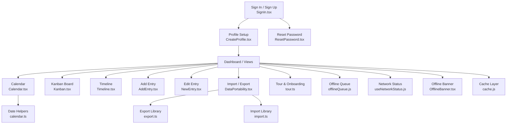

**Diagram sources**

- [SignIn.tsx:17-200](file://frontend/src/pages/SignIn.tsx#L17-L200)
- [CreateProfile.tsx:15-41](file://frontend/src/pages/CreateProfile.tsx#L15-L41)
- [ResetPassword.tsx:14-27](file://frontend/src/pages/ResetPassword.tsx#L14-L27)
- [DataPortability.tsx:93-215](file://frontend/src/pages/DataPortability.tsx#L93-L215)
- [export.ts:112-133](file://frontend/src/lib/export.ts#L112-L133)
- [import.ts:419-437](file://frontend/src/lib/import.ts#L419-L437)
- [Calendar.tsx:193-363](file://frontend/src/pages/Calendar.tsx#L193-L363)
- [Kanban.tsx:146-286](file://frontend/src/pages/Kanban.tsx#L146-L286)
- [Timeline.tsx:78-186](file://frontend/src/pages/Timeline.tsx#L78-L186)
- [AddEntry.tsx:118-244](file://frontend/src/pages/AddEntry.tsx#L118-L244)
- [NewEntry.tsx:279-346](file://frontend/src/pages/NewEntry.tsx#L279-L346)
- [calendar.ts:96-158](file://frontend/src/lib/calendar.ts#L96-L158)
- [tour.ts:1-65](file://frontend/src/lib/tour.ts#L1-L65)
- [offlineQueue.js:46-144](file://frontend/src/CacheFunctions/offlineQueue.js#L46-L144)
- [useNetworkStatus.js:14-40](file://frontend/src/hooks/useNetworkStatus.js#L14-L40)
- [OfflineBanner.tsx:7-50](file://frontend/src/components/OfflineBanner.tsx#L7-L50)
- [cache.js:74-137](file://frontend/src/lib/cache.js#L74-L137)

**Section sources**

- [SignIn.tsx:17-200](file://frontend/src/pages/SignIn.tsx#L17-L200)
- [CreateProfile.tsx:15-41](file://frontend/src/pages/CreateProfile.tsx#L15-L41)
- [ResetPassword.tsx:14-27](file://frontend/src/pages/ResetPassword.tsx#L14-L27)
- [DataPortability.tsx:93-215](file://frontend/src/pages/DataPortability.tsx#L93-L215)
- [export.ts:112-133](file://frontend/src/lib/export.ts#L112-L133)
- [import.ts:419-437](file://frontend/src/lib/import.ts#L419-L437)
- [Calendar.tsx:193-363](file://frontend/src/pages/Calendar.tsx#L193-L363)
- [Kanban.tsx:146-286](file://frontend/src/pages/Kanban.tsx#L146-L286)
- [Timeline.tsx:78-186](file://frontend/src/pages/Timeline.tsx#L78-L186)
- [AddEntry.tsx:118-244](file://frontend/src/pages/AddEntry.tsx#L118-L244)
- [NewEntry.tsx:279-346](file://frontend/src/pages/NewEntry.tsx#L279-L346)
- [calendar.ts:96-158](file://frontend/src/lib/calendar.ts#L96-L158)
- [tour.ts:1-65](file://frontend/src/lib/tour.ts#L1-L65)
- [offlineQueue.js:46-144](file://frontend/src/CacheFunctions/offlineQueue.js#L46-L144)
- [useNetworkStatus.js:14-40](file://frontend/src/hooks/useNetworkStatus.js#L14-L40)
- [OfflineBanner.tsx:7-50](file://frontend/src/components/OfflineBanner.tsx#L7-L50)
- [cache.js:74-137](file://frontend/src/lib/cache.js#L74-L137)

## Core Components

- Account lifecycle: sign-in/sign-up, password reset, profile creation, soft-deleted account restoration prompts.
- Feature pages: Calendar (month/week views, drag-to-reschedule), Kanban (drag between statuses), Timeline (zoomable bars and dependency arrows), Add/Edit Entry (dynamic fields, notes, priority/status).
- Data portability: export to JSON/CSV/Markdown/iCalendar; import from JSON/CSV/Markdown with validation and reports.
- Offline and network: online/offline banner, network status hook, offline queue persistence, cache layer with IndexedDB-backed SQLite.

**Section sources**

- [SignIn.tsx:17-200](file://frontend/src/pages/SignIn.tsx#L17-L200)
- [CreateProfile.tsx:15-41](file://frontend/src/pages/CreateProfile.tsx#L15-L41)
- [ResetPassword.tsx:14-27](file://frontend/src/pages/ResetPassword.tsx#L14-L27)
- [Calendar.tsx:193-363](file://frontend/src/pages/Calendar.tsx#L193-L363)
- [Kanban.tsx:146-286](file://frontend/src/pages/Kanban.tsx#L146-L286)
- [Timeline.tsx:78-186](file://frontend/src/pages/Timeline.tsx#L78-L186)
- [AddEntry.tsx:118-244](file://frontend/src/pages/AddEntry.tsx#L118-L244)
- [NewEntry.tsx:279-346](file://frontend/src/pages/NewEntry.tsx#L279-L346)
- [DataPortability.tsx:93-215](file://frontend/src/pages/DataPortability.tsx#L93-L215)
- [export.ts:112-133](file://frontend/src/lib/export.ts#L112-L133)
- [import.ts:419-437](file://frontend/src/lib/import.ts#L419-L437)
- [useNetworkStatus.js:14-40](file://frontend/src/hooks/useNetworkStatus.js#L14-L40)
- [OfflineBanner.tsx:7-50](file://frontend/src/components/OfflineBanner.tsx#L7-L50)
- [offlineQueue.js:46-144](file://frontend/src/CacheFunctions/offlineQueue.js#L46-L144)
- [cache.js:74-137](file://frontend/src/lib/cache.js#L74-L137)

## Architecture Overview

High-level flow for key user journeys:

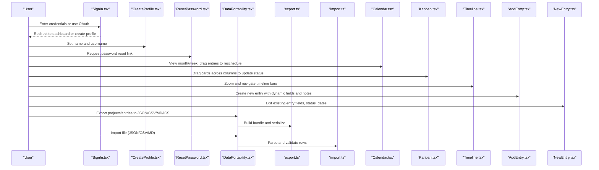

**Diagram sources**

- [SignIn.tsx:17-200](file://frontend/src/pages/SignIn.tsx#L17-L200)
- [CreateProfile.tsx:15-41](file://frontend/src/pages/CreateProfile.tsx#L15-L41)
- [ResetPassword.tsx:14-27](file://frontend/src/pages/ResetPassword.tsx#L14-L27)
- [DataPortability.tsx:93-215](file://frontend/src/pages/DataPortability.tsx#L93-L215)
- [export.ts:112-133](file://frontend/src/lib/export.ts#L112-L133)
- [import.ts:419-437](file://frontend/src/lib/import.ts#L419-L437)
- [Calendar.tsx:193-363](file://frontend/src/pages/Calendar.tsx#L193-L363)
- [Kanban.tsx:146-286](file://frontend/src/pages/Kanban.tsx#L146-L286)
- [Timeline.tsx:78-186](file://frontend/src/pages/Timeline.tsx#L78-L186)
- [AddEntry.tsx:118-244](file://frontend/src/pages/AddEntry.tsx#L118-L244)
- [NewEntry.tsx:279-346](file://frontend/src/pages/NewEntry.tsx#L279-L346)

## Detailed Component Analysis

### Account Management

- Sign-in/Sign-up: Supports email/password and OAuth providers. Validates email and password requirements during sign-up, shows success/error states, and routes to profile setup or dashboard. Soft-deleted accounts trigger a restore prompt with an OTP-based restore link flow.
- Profile setup: Creates user record, sets name and username, then proceeds to avatar selection.
- Password reset: Sends a time-limited reset link via email and returns the user to sign-in.

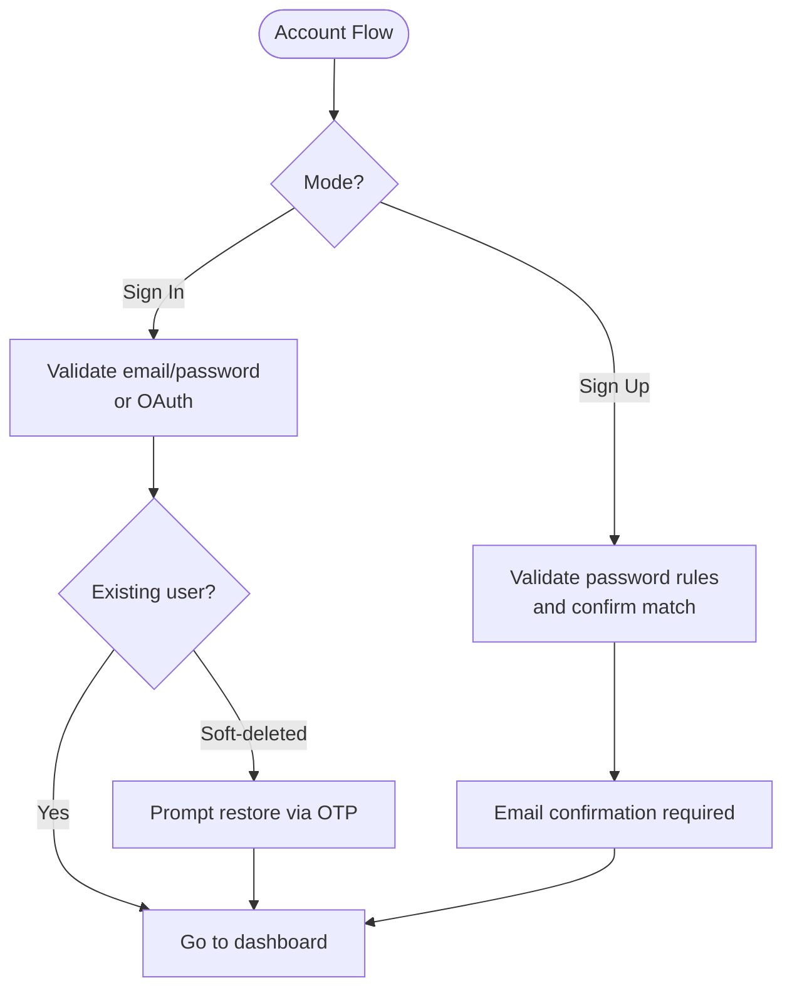

**Diagram sources**

- [SignIn.tsx:17-200](file://frontend/src/pages/SignIn.tsx#L17-L200)
- [CreateProfile.tsx:15-41](file://frontend/src/pages/CreateProfile.tsx#L15-L41)
- [ResetPassword.tsx:14-27](file://frontend/src/pages/ResetPassword.tsx#L14-L27)

**Section sources**

- [SignIn.tsx:17-200](file://frontend/src/pages/SignIn.tsx#L17-L200)
- [CreateProfile.tsx:15-41](file://frontend/src/pages/CreateProfile.tsx#L15-L41)
- [ResetPassword.tsx:14-27](file://frontend/src/pages/ResetPassword.tsx#L14-L27)

### Calendar View

- Month and week views with navigation and “Today” shortcut.
- Entries displayed per day; overdue items highlighted; completed items visually distinct.
- Drag-and-drop to reschedule due dates; updates persisted via API.
- Mobile-friendly: forces week view on narrow screens.

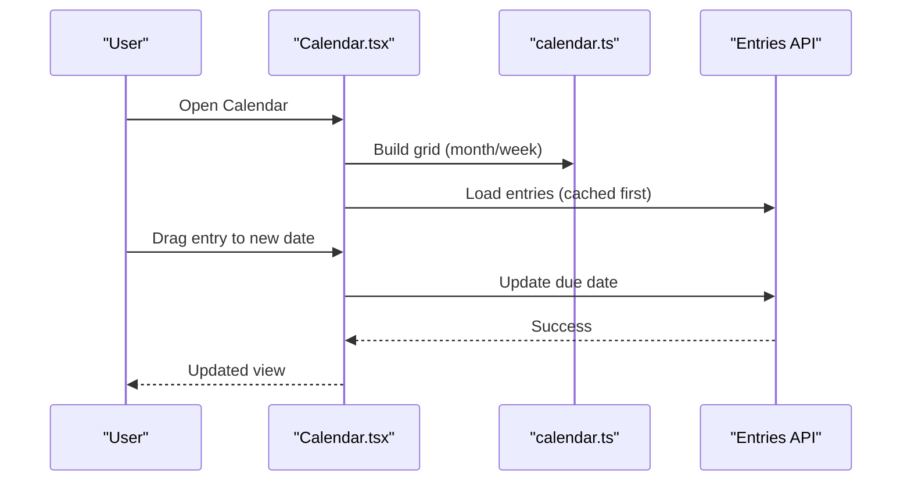

**Diagram sources**

- [Calendar.tsx:193-363](file://frontend/src/pages/Calendar.tsx#L193-L363)
- [calendar.ts:96-158](file://frontend/src/lib/calendar.ts#L96-L158)

**Section sources**

- [Calendar.tsx:193-363](file://frontend/src/pages/Calendar.tsx#L193-L363)
- [calendar.ts:96-158](file://frontend/src/lib/calendar.ts#L96-L158)

### Kanban Board

- Columns represent statuses; cards show title, project, due date, and priority.
- Drag-and-drop between columns updates status; optimistic UI reverts on failure.
- Filters by project and free-text search.

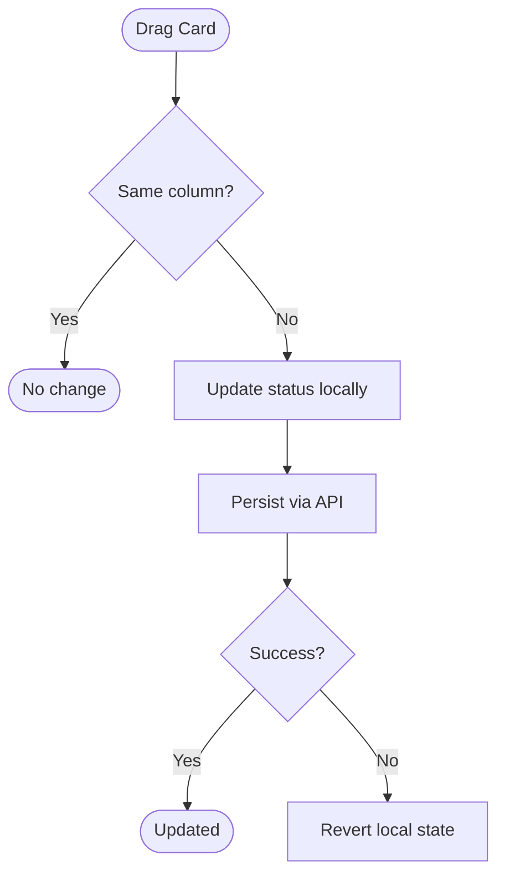

**Diagram sources**

- [Kanban.tsx:246-286](file://frontend/src/pages/Kanban.tsx#L246-L286)

**Section sources**

- [Kanban.tsx:146-286](file://frontend/src/pages/Kanban.tsx#L146-L286)

### Timeline Navigation

- Horizontal timeline with zoom controls; bars span start to due date; dependency arrows visualize relationships.
- Today marker and grid lines help orient users.

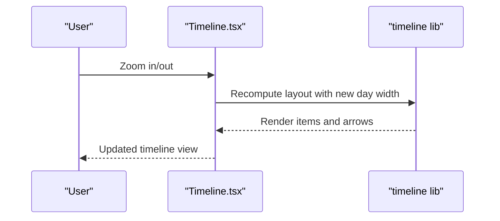

**Diagram sources**

- [Timeline.tsx:165-186](file://frontend/src/pages/Timeline.tsx#L165-L186)

**Section sources**

- [Timeline.tsx:78-186](file://frontend/src/pages/Timeline.tsx#L78-L186)

### Entry Creation Workflow

- Dynamic fields based on project schema; supports text, number, boolean, custom options, and dates.
- Notes can include text, links, and images (images compressed client-side).
- Priority and status selection; due date optional.

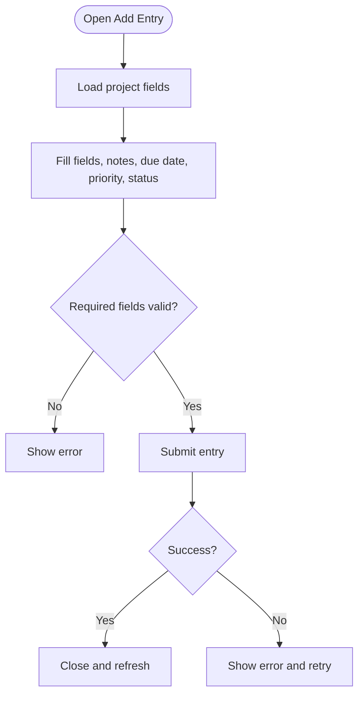

**Diagram sources**

- [AddEntry.tsx:118-244](file://frontend/src/pages/AddEntry.tsx#L118-L244)

**Section sources**

- [AddEntry.tsx:118-244](file://frontend/src/pages/AddEntry.tsx#L118-L244)

### Data Export and Import

- Export formats: JSON (full backup), CSV (spreadsheet-friendly), Markdown (readable tables), iCalendar (calendar apps).
- Import supports JSON, CSV, and Markdown with row-level validation and detailed rejection reporting.
- Archive state preserved for both projects and entries.

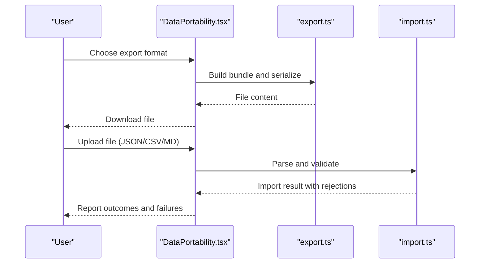

**Diagram sources**

- [DataPortability.tsx:93-215](file://frontend/src/pages/DataPortability.tsx#L93-L215)
- [export.ts:112-133](file://frontend/src/lib/export.ts#L112-L133)
- [import.ts:419-437](file://frontend/src/lib/import.ts#L419-L437)

**Section sources**

- [DataPortability.tsx:93-215](file://frontend/src/pages/DataPortability.tsx#L93-L215)
- [export.ts:112-133](file://frontend/src/lib/export.ts#L112-L133)
- [import.ts:419-437](file://frontend/src/lib/import.ts#L419-L437)

### Editing Existing Entries

- Inline editing of fields, due/start/end times, priority, and status.
- Archive/unarchive and delete actions with confirmation.
- Auto timestamps when moving to “In Motion” or “Done & Dusted”.

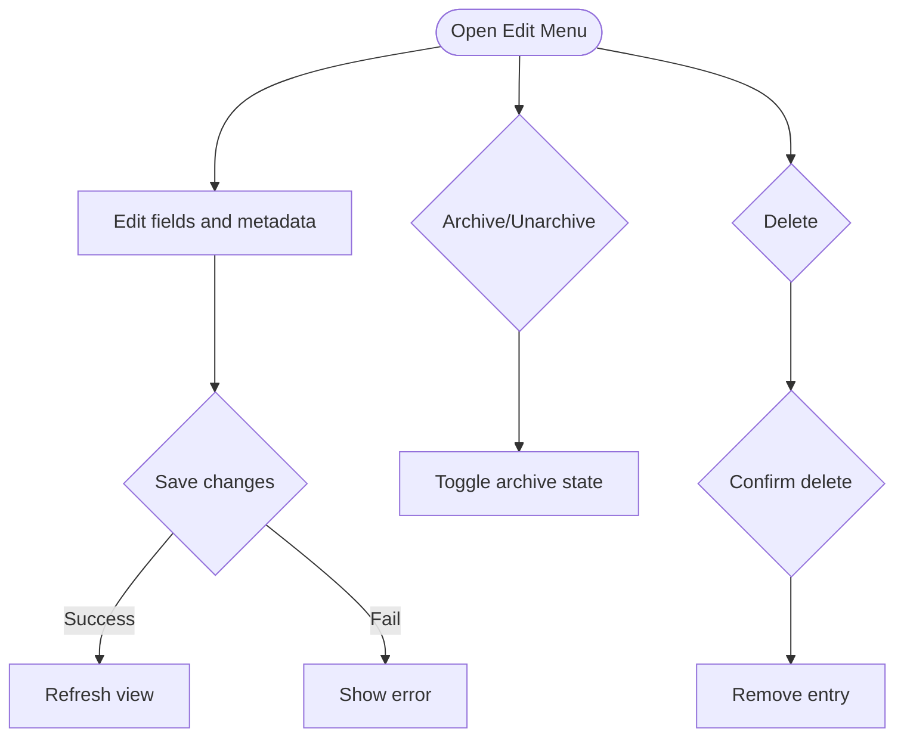

**Diagram sources**

- [NewEntry.tsx:279-346](file://frontend/src/pages/NewEntry.tsx#L279-L346)

**Section sources**

- [NewEntry.tsx:279-346](file://frontend/src/pages/NewEntry.tsx#L279-L346)

## Dependency Analysis

Key runtime dependencies and interactions:

- Pages depend on shared libraries for date handling, export/import, and color mapping.
- Offline behavior relies on a cache layer (IndexedDB-backed SQLite) and an offline queue for pending operations.
- Network status drives UI banners and informs fallback behaviors.

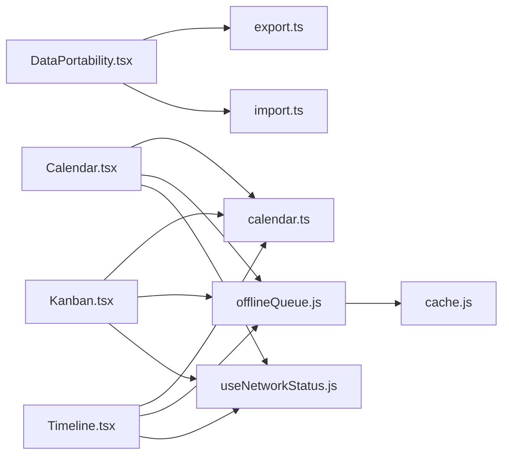

**Diagram sources**

- [Calendar.tsx:193-363](file://frontend/src/pages/Calendar.tsx#L193-L363)
- [Kanban.tsx:146-286](file://frontend/src/pages/Kanban.tsx#L146-L286)
- [Timeline.tsx:78-186](file://frontend/src/pages/Timeline.tsx#L78-L186)
- [DataPortability.tsx:93-215](file://frontend/src/pages/DataPortability.tsx#L93-L215)
- [export.ts:112-133](file://frontend/src/lib/export.ts#L112-L133)
- [import.ts:419-437](file://frontend/src/lib/import.ts#L419-L437)
- [offlineQueue.js:46-144](file://frontend/src/CacheFunctions/offlineQueue.js#L46-L144)
- [useNetworkStatus.js:14-40](file://frontend/src/hooks/useNetworkStatus.js#L14-L40)
- [cache.js:74-137](file://frontend/src/lib/cache.js#L74-L137)

**Section sources**

- [Calendar.tsx:193-363](file://frontend/src/pages/Calendar.tsx#L193-L363)
- [Kanban.tsx:146-286](file://frontend/src/pages/Kanban.tsx#L146-L286)
- [Timeline.tsx:78-186](file://frontend/src/pages/Timeline.tsx#L78-L186)
- [DataPortability.tsx:93-215](file://frontend/src/pages/DataPortability.tsx#L93-L215)
- [export.ts:112-133](file://frontend/src/lib/export.ts#L112-L133)
- [import.ts:419-437](file://frontend/src/lib/import.ts#L419-L437)
- [offlineQueue.js:46-144](file://frontend/src/CacheFunctions/offlineQueue.js#L46-L144)
- [useNetworkStatus.js:14-40](file://frontend/src/hooks/useNetworkStatus.js#L14-L40)
- [cache.js:74-137](file://frontend/src/lib/cache.js#L74-L137)

## Performance Considerations

- Use cached data from IndexedDB to reduce network calls; initial sync triggers only on first visit.
- Debounce or sequence guards prevent race conditions when multiple listeners fire concurrently.
- Client-side image compression reduces payload size for notes.
- Timeline recomputes layout only on zoom changes; calendar uses memoized grids.

[No sources needed since this section provides general guidance]

## Troubleshooting Guide

### Account Issues

- Cannot sign in: Ensure email is correct; check for suggested corrections; verify password requirements during sign-up. If account is scheduled for deletion, use the restore flow to receive an OTP link.
- Password reset not received: Check spam folder; links expire after one hour.

**Section sources**

- [SignIn.tsx:17-200](file://frontend/src/pages/SignIn.tsx#L17-L200)
- [ResetPassword.tsx:14-27](file://frontend/src/pages/ResetPassword.tsx#L14-L27)

### Feature Usage Issues

- Calendar view empty: Ensure entries have due dates; add items from the dashboard if none exist.
- Drag-and-drop not updating: Verify network connectivity; errors will display; try again later.
- Kanban status not changing: Same as above; ensure you are dragging to a different column.
- Timeline shows no bars: Only dated, incomplete items appear; add start/due dates or set dependencies.

**Section sources**

- [Calendar.tsx:193-363](file://frontend/src/pages/Calendar.tsx#L193-L363)
- [Kanban.tsx:146-286](file://frontend/src/pages/Kanban.tsx#L146-L286)
- [Timeline.tsx:78-186](file://frontend/src/pages/Timeline.tsx#L78-L186)

### Mobile Responsiveness

- Calendar defaults to week view on small screens for better usability.
- Ensure touch targets are large enough; avoid pinch-zoom on forms where possible.

**Section sources**

- [Calendar.tsx:33-45](file://frontend/src/pages/Calendar.tsx#L33-L45)

### Browser Compatibility

- Web Speech API used for guided tour narration; availability varies by browser.
- Image compression uses canvas; ensure modern browser support.

**Section sources**

- [tour.ts:1-65](file://frontend/src/lib/tour.ts#L1-L65)
- [AddEntry.tsx:90-116](file://frontend/src/pages/AddEntry.tsx#L90-L116)

### Offline Functionality Limitations

- When offline, the app serves cached data and queues writes until reconnected.
- An offline banner indicates limited functionality; some features may be unavailable.

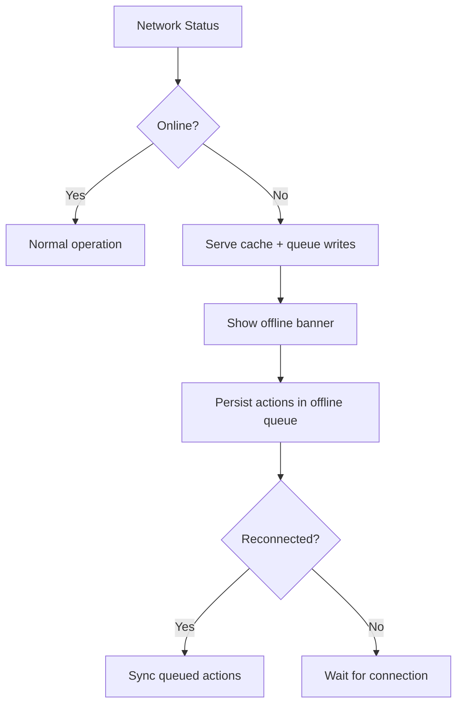

**Diagram sources**

- [useNetworkStatus.js:14-40](file://frontend/src/hooks/useNetworkStatus.js#L14-L40)
- [OfflineBanner.tsx:7-50](file://frontend/src/components/OfflineBanner.tsx#L7-L50)
- [offlineQueue.js:46-144](file://frontend/src/CacheFunctions/offlineQueue.js#L46-L144)
- [cache.js:74-137](file://frontend/src/lib/cache.js#L74-L137)

**Section sources**

- [useNetworkStatus.js:14-40](file://frontend/src/hooks/useNetworkStatus.js#L14-L40)
- [OfflineBanner.tsx:7-50](file://frontend/src/components/OfflineBanner.tsx#L7-L50)
- [offlineQueue.js:46-144](file://frontend/src/CacheFunctions/offlineQueue.js#L46-L144)
- [cache.js:74-137](file://frontend/src/lib/cache.js#L74-L137)

### Data Migration Between Environments

- Use JSON exports as the authoritative backup format; import into another environment using the same tool.
- Preserve archived states for both projects and entries during import.

**Section sources**

- [DataPortability.tsx:93-215](file://frontend/src/pages/DataPortability.tsx#L93-L215)
- [export.ts:112-133](file://frontend/src/lib/export.ts#L112-L133)
- [import.ts:419-437](file://frontend/src/lib/import.ts#L419-L437)

## Accessibility

- Keyboard navigation: All interactive elements are focusable with visible focus indicators and logical tab order.
- Screen readers: Semantic HTML elements, ARIA labels on icon buttons, and alt text on images improve assistive technology support.
- Guided tour: Optional voice narration via Web Speech API; completion and preferences persist locally.

**Section sources**

- [ui-design.md:336-356](file://docs-site/docs/Architecture/ui-design.md#L336-L356)
- [tour.ts:1-65](file://frontend/src/lib/tour.ts#L1-L65)

## Conclusion

This guide covers the most common user scenarios and issues, providing clear steps for account management, feature usage, data portability, and troubleshooting. The application emphasizes offline resilience, accessibility, and intuitive workflows across calendar, Kanban, and timeline views. For complex migrations, rely on JSON exports and imports to maintain consistency across environments.

[No sources needed since this section summarizes without analyzing specific files]

## Appendices

### Quick Reference: Export Formats

- JSON: Full backup with versioning and all fields.
- CSV: Spreadsheet-friendly; entries serialized as JSON strings.
- Markdown: Human-readable tables.
- iCalendar: Compatible with major calendar apps; maps status and priority.

**Section sources**

- [export.ts:112-133](file://frontend/src/lib/export.ts#L112-L133)
- [export.ts:164-187](file://frontend/src/lib/export.ts#L164-L187)
- [export.ts:201-238](file://frontend/src/lib/export.ts#L201-L238)
- [export.ts:323-408](file://frontend/src/lib/export.ts#L323-L408)
