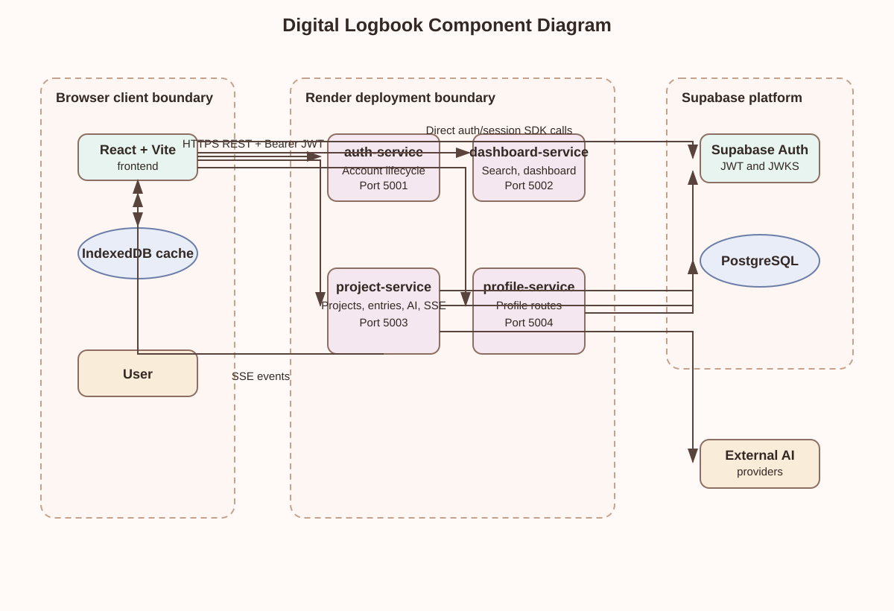
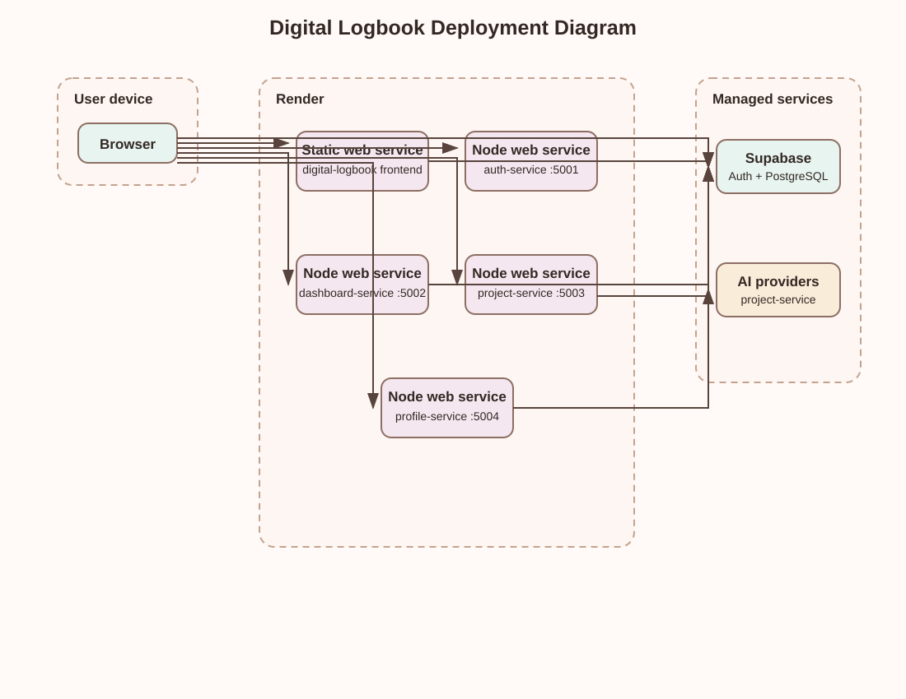
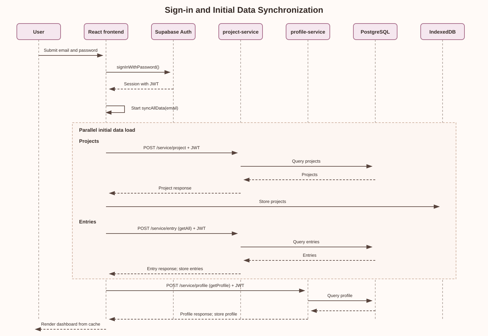
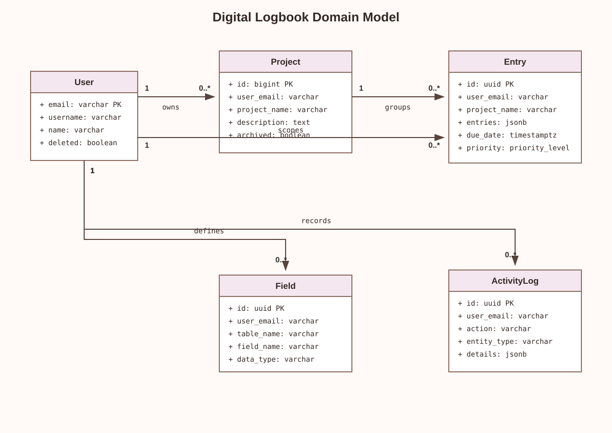

# UML Architecture Diagrams

## Scope and evidence

This page adds UML-style views that are missing from the existing architecture
pages. It is based on the deployed-service blueprint in
[`render.yaml`](../../../render.yaml), the React/Vite frontend, and the route
and middleware implementations in the four backend services. It complements,
rather than replaces, the existing [Architecture Overview](overview.md),
[System Design](system-design.md), [Database Schema](database.md), and
[API Contracts](api-contracts.md).

The diagrams below are standalone SVG assets. Standard MkDocs deployments serve
these images without requiring a diagram-rendering plugin or client-side
JavaScript.

## Component diagram

The browser is the client-side integration point: it calls each backend over
HTTP and sends the Supabase access token in the `Authorization` header for API
requests. The frontend also uses the Supabase client directly for sign-in and
session management. Business-data operations are handled by the Express
services rather than by a generated Supabase data API.

### Service boundaries

| Component | Boundary and responsibility evidenced in the codebase |
| --- | --- |
| Frontend | React/Vite UI, Supabase session client, and local-first IndexedDB synchronization. `syncAllData()` warms the cache, and pages then read cached data. |
| `auth-service` | Separate Express deployment for account/auth lifecycle responsibilities and service health. |
| `dashboard-service` | Separate Express deployment for dashboard-supporting search and health-ping/keep-alive responsibilities. |
| `project-service` | The core domain boundary: project, entry, field, priority, archive, activity, and AI routes are mounted here. Its protected routes use `requireAuth`. |
| `profile-service` | Separate Express deployment for profile and login-related routes. |
| Supabase | Shared managed platform for authentication/JWKS and PostgreSQL persistence. |

## Deployment diagram

Each runtime unit has a separate source root, dependency manifest, start
command, environment-variable set, and Render service declaration. The
frontend is deployed as a static Render service; the four backend services are
separate Node web services.

## Sequence diagram: sign-in and initial data synchronization

This flow reflects the current implementation: `AuthContext` calls
`supabase.auth.signInWithPassword()` from the frontend, then the application
uses the returned session token for backend requests. On application load,
`syncAllData()` fetches project, entry, and profile data and stores it in
IndexedDB.

## Domain model diagram

The data model is shared through Supabase PostgreSQL. This diagram focuses on
the ownership relationships most relevant to the service boundaries; column
and migration detail remains in the [Database Schema](database.md) page.

## Why this is a microservices architecture

The architecture is not simply a frontend and a single API divided into
folders. The deployment manifest creates four separately deployable Node web
services, each with its own root directory and `package.json`, alongside the
separately built frontend. Their responsibilities are intentionally separated:

- `project-service` carries the main logbook domain and the AI/SSE work, keeping
  its many project and entry concerns out of the reporting and profile
  services.
- `dashboard-service` isolates cross-project dashboard/search and keep-alive
  behaviour from the core project API.
- `profile-service` keeps profile-specific operations separate from project and
  reporting work.
- `auth-service` separates account/auth lifecycle concerns from the domain
  services, while `project-service` independently validates Bearer JWTs at its
  protected route boundary using Supabase JWKS.

This split gives the team clear ownership boundaries and lets a change to one
service be built and deployed through its own Render service without requiring
the frontend or another backend service to be packaged into the same runtime.
It is also a technology fit for the project: the project domain can use its AI
provider chain and SSE endpoints without making profile or dashboard processes
carry those dependencies.

The current design is deliberately pragmatic rather than fully data-isolated:
the services share Supabase PostgreSQL and the frontend directly uses Supabase
Auth for session establishment. Shared persistence makes the project simpler
to operate and keeps a single source of truth for the logbook, but it also
means the service boundaries are responsibility and deployment boundaries, not
separate databases. Consequently, independent deployment and focused ownership
are demonstrated by the code and `render.yaml`; independent database scaling
is not claimed by this design.

## Source references

- [`render.yaml`](../../../render.yaml) — five Render deployments and their
  service roots.
- [`frontend/src/context/AuthContext.tsx`](../../../frontend/src/context/AuthContext.tsx)
  — direct Supabase sign-in and session handling.
- [`frontend/src/CacheFunctions/syncService.js`](../../../frontend/src/CacheFunctions/syncService.js)
  — initial synchronization into IndexedDB.
- [`frontend/src/functions/project/project.js`](../../../frontend/src/functions/project/project.js),
  [`frontend/src/functions/project/entries.js`](../../../frontend/src/functions/project/entries.js),
  and [`frontend/src/functions/profile/profile.js`](../../../frontend/src/functions/profile/profile.js)
  — frontend-to-service requests.
- [`services/project-service/src/index.js`](../../../services/project-service/src/index.js)
  and [`services/project-service/src/middleware/auth.js`](../../../services/project-service/src/middleware/auth.js)
  — route boundary and JWT verification.
