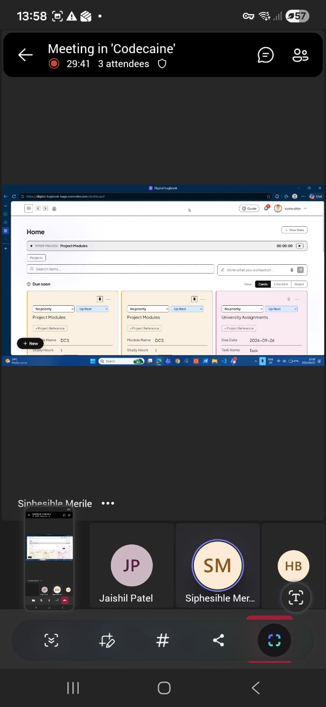
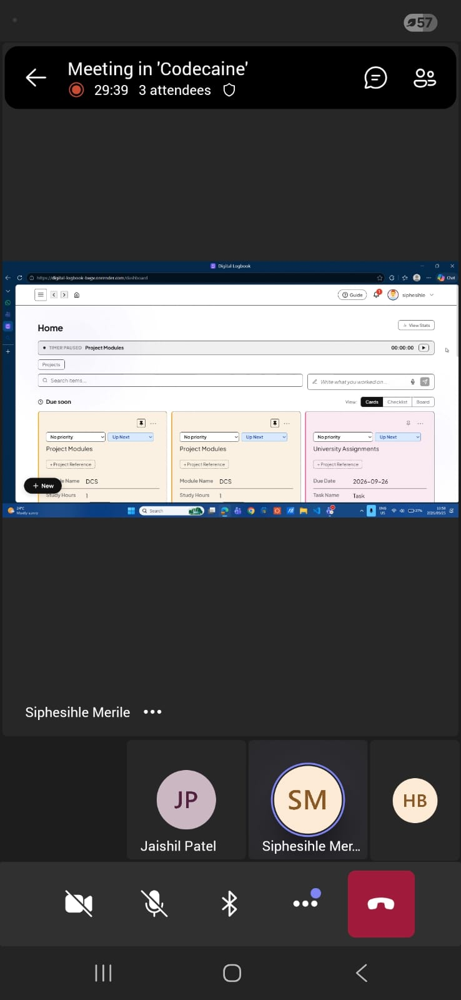
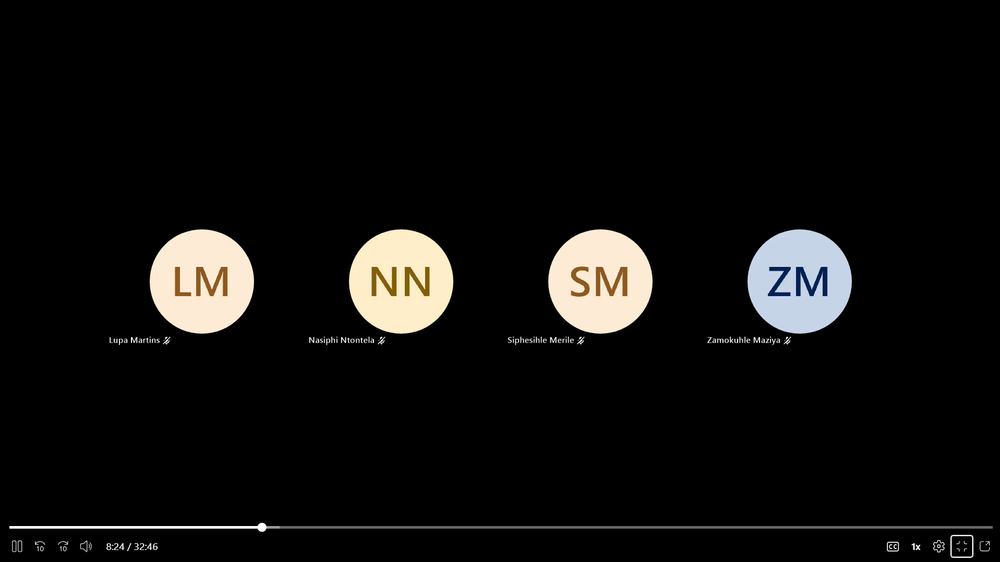

## Meeting 11 — 21 September 2026

**Venue:** Wartenweiler Library, Focus Room 1 and Focus Room 2
**Attendees:** Hlulani, Siphesihle, Lupa, Sicelo, Zamo, Missy (Nasiphi) (full team)

**Context:** Sprint 3 planning and Sprint 2 retrospective following a disappointing sprint review.

**What we did:**

- Conducted a strict retrospective on our Sprint 2 performance. Acknowledged the low marks received and diagnosed the root cause.
- Identified that a broken automated testing pipeline was the primary reason for our poor Sprint 2 grade, as it allowed failing code to slip through to the client demonstration.
- Confirmed that Missy successfully debugged and fixed the testing pipeline post-review, restoring our CI/CD stability.
- Planned the development scope for Sprint 3 based on direct client criticism (specifically regarding UI confusion) and backlog priorities.
- Grouped the upcoming Sprint 3 work into core themes: UI/UX layout reorganization, legacy data migration, advanced search/stats, timer enhancements, and squashing residual Sprint 2 bugs.

**Decisions made:**

- The team finalized and approved the following 11 features and fixes to be implemented in Sprint 3:
  1. **UI/UX Reorganization (Main Issue):** Restructure the interface to be intuitive and logically grouped to address client criticism.
  2. **Data Migration:** Build logic to migrate existing entries smoothly, filling in reasonably inferred defaults for new formats.
  3. **Advanced Search:** Allow users to pin searches, group entries by specific fields, and compare entries side-by-side.
  4. **Time Plotting:** Allow users to plot statistics and entries on a graph over time.
  5. **Timer Notifications:** Add alerts to remind users if a timer is paused or has been running too long.
  6. **Due Date Fix:** Remove the restriction that prevents users from setting due dates older than a week from the current time.
  7. **Project Card Bug:** Fix the CSS scrolling issue on the "Create Project" modal/card.
  8. **Dashboard Refresh Bug:** Fix the state so that newly created entries appear instantly on the dashboard without requiring a manual browser refresh.
  9. **Granular Timer Inputs:** Refine the timer to let users manually set countdowns using Days, Hours, and Minutes.
  10. **Empty Column Alert:** Add form validation that alerts the user and prevents submission if required columns are left empty.
  11. **Column Visibility Bug:** Fix the issue where newly added custom columns disappear/become absent when attempting to create an entry.
- **Process Decision:** All future commits and branches must pass the newly repaired testing pipeline before being merged to prevent another grading penalty.

**Open questions:**

- None raised — the team is fully aligned on the mistakes made in Sprint 2 and the exact features required for Sprint 3.

**Next step decided:**

- Add the 11 new User Stories (US49 through US59) to Trello and assign them to individual team members.
- Begin immediate development on the Sprint 3 features, prioritizing the UI reorganization and the pipeline-approved bug fixes.

---

## Meeting 12 — 25 September 2026

**Venue:** Focus Room 2, Wartenweiler Library (Team gathered in person; client/tutor joined online)
**Attendees:** Lupa Martins, Hlulani Baloyi, Siphesihle Merile, Sicelo Vanyelwa, Zamokuhle Maziya (Jashil joined as client/tutor)
**Absent:** Nasiphi Ntontela

**Context:** Sprint 3 progress review with the client. The team presented features developed during the sprint, demonstrated them live, and received feedback.

**What we did:**

- Nasiphi's work (presented via proxy since she was absent) on purging unconfirmed emails and enforcing password requirements in the UI.
- Lupa's work on cross-project references, richer fields, and a new project view UI.
- Sicelo's work on the statistics dashboard, filtering stats by project, calculating averages, etc.
- Siphesihle's work on resolving the local timer issue (timer running indefinitely if not stopped manually) and the addition of UML architecture diagrams to the documentation.
- Zamokuhle's correction of a misinterpreted user story, clarifying that it was about data persistence and updating field formats.
- Hlulani's fixes based on user feedback, such as editing notes, and other UI improvements.
- Nasiphi's new notification feature (due date emails and in-app notifications).
- The team also discussed making the app more intuitive, particularly for new users using an onboarding guide.

**Decisions made:**

- Incorporate the onboarding flow for new users.
- Use badge-only notifications for in-app alerts and limit the history to 15 items.
- Clean up the password validation and error message UI based on Jashil's advice.
- Ensure the timer issue is fully fixed and UML diagrams are ready by the sprint marking.

**Next step decided:**

- Prepare proper demo data for the final sprint marking presentation.
- Finalize the features discussed (timer fix, activity log update, notifications).
- Ensure all members are ready for the presentation on Tuesday.

**Proof of meeting:**

[Download/view meeting transcript](../assets/meetings/meeting-12-2026-09-25-transcript.docx)

---

## Meeting 13 — 28 September 2026

**Venue:** Online (Microsoft Teams)
**Attendees:** Lupa Martins, Nasiphi Ntontela, Siphesihle Merile, Zamokuhle Maziya

**Context:** General internal team meeting and check-in before the Sprint 3 marking session to coordinate remaining tasks and ensure rubric readiness.

**What we did:**

- Discussed UI and dashboard organization, specifically making entries more visible by adding a column under the "Quick Capture" area so that entries appear side-by-side with projects.
- Discussed the need for bulk selection ("select" and "select all") to make deleting test data easier.
- Reviewed the status of the timer issue, noting that while work was done, the team was currently resolving related merge conflicts and deployment failures.
- Discussed marking readiness, the importance of checking test coverage against the rubric, and ensuring all user feedback evidence is properly documented with screenshots.
- Discussed branch protection, proposing a temporary requirement of at least one review approval before the marking session to prevent untested code from breaking the build.

**Decisions made:**

- Implement a side-by-side layout for entries and projects on the dashboard.
- Add bulk selection and deletion functionality for test projects.
- Apply a temporary branch protection rule (requiring one approval) prior to marking, which will be removed afterward.
- Conduct a final brief check-in meeting before the marking session to finalize the presentation plan.

**Next step decided:**

- Lupa to implement the dashboard column layout UI updates.
- Nasiphi to implement bulk deletion and configure temporary branch protection rules.
- Siphesihle to collect response screenshots for documentation.
- The team to meet briefly before the marking session to review the presentation plan.

**Proof of meeting:**

[Meeting transcript](../assets/meetings/meeting-13-2026-09-28-transcript.docx)

