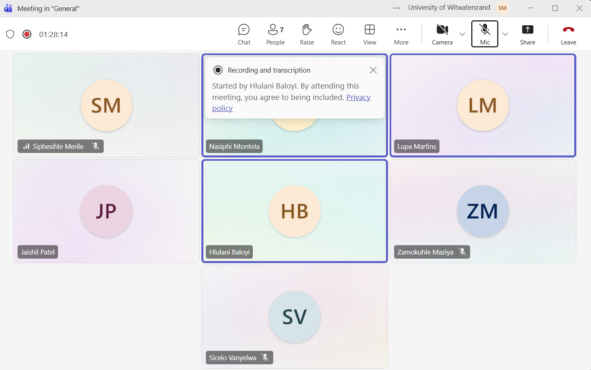

# Meeting Log

## Sprint 2

## Meeting 9 — 2 September 2026

**Venue:** Online (Microsoft Teams call)
**Attendees:** Siphesihle Merile, Nasiphi Ntontela, Hlulani Baloyi

**Context:** The team met after Sprint 1 to plan the Sprint 2 work and address issues identified in the previous sprint.

**What we did:**

- Planned the work to be completed during Sprint 2.
- Diagnosed what was broken from Sprint 1.
- Discussed and planned fixes for the Sprint 1 issues.

**Decisions made:**

- Sprint 2 work will be planned around the agreed priorities.
- The identified Sprint 1 issues will be addressed as part of the planned fixes.

**Open questions / disagreements:**

- Specific implementation details for the Sprint 1 fixes will be resolved as the work is assigned and completed.

**Next step decided:**

- Break the Sprint 2 plan into assigned tasks.
- Implement and verify fixes for the Sprint 1 issues.

**Proof of meeting:**

---

## Daily Standup — 7 September 2026

**Venue:** Online (Microsoft Teams)
**Attendees:** Hlulani, Siphesihle, Lupa, Sicelo, Zamo, Nasiphi (full team)

**Context:** First daily standup of Sprint 2. The team synced on progress since
the Sprint 2 planning meeting and made sure everyone was unblocked before the
first client check-in of the sprint.

**What we did:**

- Each team member provided a brief update on their current progress:
  - **Hlulani:** Refining the entry-card UI — tightening spacing, aligning the
    status and priority tags, and making the entry button more prominent as
    requested by the client in the Sprint 1 review.
  - **Siphesihle:** Diagnosing a backend blocker where the dashboard service
    was failing to bind to its port on startup; traced it to a port conflict
    with the project service and documented the fix (explicit `PORT` per
    service).
  - **Lupa:** Continuing work on the archive flow and verifying archived
    entries no longer appear in the main feed.
  - **Sicelo:** Syncing the Stats module with the entry data model so the
    "Time Tracked" figures stay accurate as entries are edited.
  - **Zamo:** Extending the activity log to cover entry updates and status
    changes, not just creation events.
  - **Nasiphi:** Regression-testing the auth flow after the Sprint 1 fixes and
    confirming the account-deletion grace period behaves as specified.
- Discussed blockers: the port-conflict issue was the main one — it was
  resolved during the call and the fix was committed.
- Coordinated on integration points for the Timer/Stats feature so the elapsed
  time shown on an entry card matches the totals reported by the Stats module.

**Decisions made:**

- Every backend service must document its default port in the service README
  to prevent future port conflicts.
- The Timer/Stats work will be treated as one integrated feature so the live
  timer, the dashboard banner, and the statistics panel all read from the same
  duration calculation.

**Next step decided:**

- Siphesihle to commit the port-conflict fix and update the service READMEs.
- Hlulani to share the updated entry-card styling for review before the next
  standup.

---

## Daily Standup — 9 September 2026

**Venue:** Online (Microsoft Teams)
**Attendees:** Hlulani, Siphesihle, Lupa, Sicelo, Zamo, Nasiphi (full team)

**Context:** Mid-week standup ahead of the client demonstration on 10
September. The team reviewed what would be demo-ready, agreed what to hold
back, and closed out remaining blockers.

**What we did:**

- Each team member provided a brief update on their current progress:
  - **Hlulani:** Walked through the final UI refinements — dashboard layout,
    entry-card sizing (fixing the card taking up half the screen from Sprint
    1 feedback), and the toggleable dashboard view.
  - **Siphesihle:** Reported the backend blockers cleared — services now start
    reliably on their assigned ports — and demonstrated the Timer feature
    counting elapsed time on an in-progress entry with the Stats module
    totals updating in sync.
  - **Lupa:** Confirmed the archive and pin features are stable and ready for
    the demo.
  - **Sicelo:** Showed the project-level statistics cards (time tracked,
    completion counts) rendering correctly with live data.
  - **Zamo:** Verified the activity log captures the full history of an entry
    (created, updated, started, completed).
  - **Nasiphi:** Finalised auth regression checks and prepared a clean test
    account for the client to use during user testing.
- Synced on the demo plan for the client meeting: feature order, who presents
  which part, and the user-testing script (tasks for participants to attempt).
- Agreed to freeze non-essential merges after this standup so the demo build
  stays stable.

**Decisions made:**

- The client demo will follow the user journey end-to-end: sign in, create a
  project, capture an entry with the timer, view the dashboard, and check the
  stats — with the user-testing session run straight after.
- Code freeze on non-essential merges until after the 10 September client
  meeting.

**Next step decided:**

- Team to deploy the latest stable build and smoke-test it before the client
  meeting.
- Nasiphi to send the meeting invitation and user-testing instructions.

---

## Client Meeting — 10 September 2026

**Venue:** Discussion Room 3, Wartenweiler Library (in person)
**Attendees:** Hlulani, Siphesihle, Lupa, Sicelo, Zamo, Nasiphi (full team) + client/tutor

**Context:** Sprint 2 progress demonstration and user testing session with the client.

**What we did:**

- Demonstrated our current progress on the Digital Logbook application to the client. The demo followed the full user journey agreed in the 9 September standup: signing in, creating a project, capturing an entry with the live timer running, viewing the dashboard (both project-centric and entry-centric views), and reviewing the statistics panel.
- The client responded positively and liked what was shown. Specific praise went to the toggleable dashboard, the more prominent entry button, and the entry-card sizing fixes carried over from the Sprint 1 feedback.
- Conducted a user testing session where participants tested the app and provided comments and feedback. Participants completed a scripted set of tasks (create a project, log an entry, start and stop the timer, archive a completed item) and narrated any points of confusion.
- Captured the user-testing comments for review — most feedback concerned small UI wording issues and a request for clearer timer labels, which the team agreed were quick wins for the next cycle.

**Decisions made:**

- Client feedback and user testing comments will be reviewed and incorporated into the next development cycle.
- The requested timer-label clarification will be handled together with the ongoing Timer/Stats work rather than as a separate item.

**Next step decided:**

- Transcribe the user-testing comments into the project documentation and convert them into backlog items for Sprint 2.
- Schedule the next client check-in after the Timer/Stats feature is finalised.

**Proof of meeting:**

---

## Client Meeting — 12 September 2026

**Venue:** Online (Microsoft Teams)
**Attendees:** Hlulani, Siphesihle, Lupa, Sicelo, Zamo, Nasiphi (full team)

**Context:** Sprint 2 sync two days after the client meeting. The team reviewed
the feedback collected during the 10 September demonstration and user-testing
session, and replanned the remaining Sprint 2 work around it.

**What we did:**

- Reviewed the client feedback and user-testing comments from the 10
  September client meeting and grouped them into quick wins versus items that
  need design discussion.
- Each team member provided a brief update on their current progress:
  - **Hlulani:** Finalising the timer label and entry-card copy changes
    requested during user testing; confirmed the UI now clearly distinguishes
    the deadline countdown from the work-session timer.
  - **Siphesihle:** Demonstrated the updated Timer behaviour — pause/resume
    with the Stats module totals staying in sync — and walked through the
    remaining edge cases (entries started before the fix).
  - **Lupa:** Incorporating the archive-flow comments from user testing and
    tightening the confirmation prompts.
  - **Sicelo:** Verified the statistics panel against the user-testing
    scenarios so the figures participants questioned are now explained
    in-app.
  - **Zamo:** Linking activity-log entries to the user actions observed
    during the testing session for traceability.
  - **Nasiphi:** Scheduling the next client check-in and preparing the
    feedback summary for the stakeholder log.
- Re-planned the Sprint 2 backlog: quick-win feedback items were pulled into
  the current sprint, while larger items were logged for the next sprint
  planning session.
- Confirmed the merge-request pipeline is green so the Timer/Stats changes can
  be merged into main safely.

**Decisions made:**

- All quick-win feedback from the user-testing session will be completed
  within the current sprint; larger items go to the Sprint 3 backlog.
- The next client check-in will focus on a demonstration of the corrected
  timer and stats behaviour.

**Next step decided:**

- Finalise and merge the Timer/Stats changes via merge request.
- Publish the updated documentation, including the expanded meeting logs and
  stakeholder-interaction evidence.

**Proof of meeting:**

