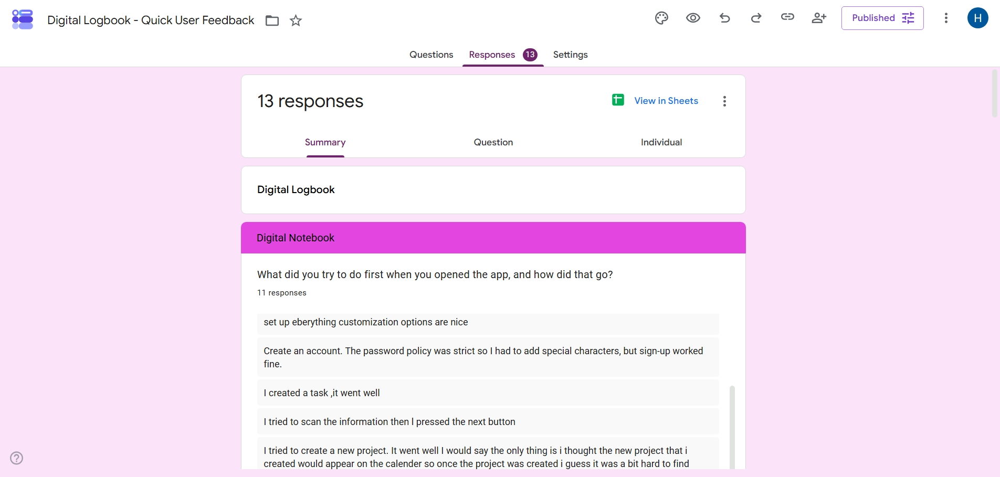
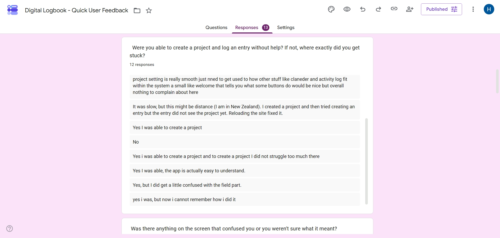
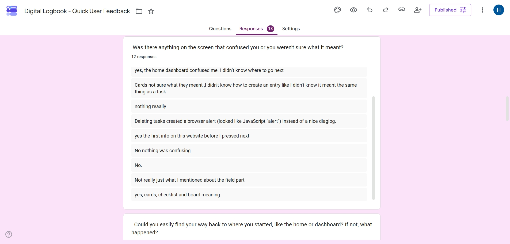

# Testing & User Feedback

**Test lead:** Hlulani Baloyi — responsible for writing, reviewing, and maintaining the test suite across all frontend and backend services.

## Quality Assurance Overview

This page documents three pillars of our quality assurance strategy:

1. **Automated Testing Procedure** — how tests are structured, run, and enforced
2. **Testing Policy** — the rules the team follows for test coverage
3. **User Feedback Process** — how stakeholder input is collected, triaged, and actioned

---

## Automated Testing Procedure

### Testing Tools and Frameworks

| Layer                | Tool                          | Purpose                                                   |
| -------------------- | ----------------------------- | --------------------------------------------------------- |
| Frontend test runner | **Vitest**                    | Unit and integration tests for frontend                   |
| Backend test runner  | **Jest**                      | Unit and integration tests for backend services           |
| Component rendering  | **@testing-library/react**    | Render React components, simulate user interactions       |
| DOM assertions       | **@testing-library/jest-dom** | Semantic assertions (`toBeDisabled`, `toHaveTextContent`) |
| IndexedDB polyfill   | **fake-indexeddb**            | Integration tests that exercise the real cache layer      |
| Backend HTTP tests   | **Jest + supertest**          | Endpoint tests for each microservice                      |
| CI pipeline          | **Gitea Actions**             | Automated test runs on every push and PR                  |

### What Types of Tests Are Run

#### Unit Tests

Unit tests verify individual functions and components in isolation. All external dependencies (Supabase, fetch, IndexedDB) are mocked.

**Examples:**

- Pure functions: `formatDuration`, `isOverdue`, `calculateStreaks`, `searchAll`
- API helpers: `request()` with auth headers and error handling
- Auth context: sign-in, sign-up, OAuth, password reset, account deletion
- Component logic: form submission, conditional rendering, event handlers

#### Integration Tests

Integration tests verify that multiple modules work together correctly. These use real IndexedDB (via `fake-indexeddb`) and test the full data flow.

**Examples:**

- **Cache layer** — `cacheSet` → `cacheGet` → `cacheSubscribe` event flow, isolation between users, `clearUserCache`
- **Entry CRUD** — optimistic write → server sync → cache update, rollback on failure
- **Sync service** — `syncAllData` populates all IndexedDB stores from server responses
- **Auth + Cache** — sign-out clears IndexedDB, SSE disconnect on logout
- **useCachedData hook** — reads from cache immediately, subscribes to changes, triggers background fetch

#### End-to-End (Manual)

End-to-end testing is done manually during development and sprint demos. Full browser E2E automation (e.g. Cypress) is planned but not yet implemented.

### Test File Organisation

```
frontend/src/
├── components/__tests__/        # Shared component tests
│   ├── AppShell.test.tsx
│   ├── Header.test.tsx
│   ├── NavBar.test.tsx
│   ├── ProfileMenu.test.tsx
│   ├── ProtectedRoute.test.tsx
│   ├── QuickEntryBar.test.tsx
│   └── Stats.test.tsx
├── pages/__tests__/             # Page-level tests
│   ├── AllEntries.test.tsx
│   └── SignIn.test.tsx
├── Templates/__tests__/         # Template component tests
│   ├── EntriesByDueDateBoard.test.tsx
│   ├── EntryChecklist.test.tsx
│   └── ProjectTable.test.tsx
├── __integration__/             # Integration tests (separate from unit)
│   ├── auth-cache.integration.test.js
│   ├── cache.integration.test.js
│   ├── entries-crud.integration.test.js
│   ├── sync-service.integration.test.js
│   └── use-cached-data.integration.test.tsx
├── context/__tests__/           # Auth context tests
├── functions/__tests__/         # Pure function tests
├── functions/dashboard/__tests__/
├── hooks/__tests__/             # Hook tests
└── lib/__tests__/               # Library/utility tests
```

**Naming convention:** `{SourceName}.test.{ext}` — test files match the source file they cover. Integration tests use `.integration.test.{ext}` to distinguish them from unit tests.

### Test Structure Pattern

Every test follows **Arrange → Act → Assert**:

```javascript
import { describe, it, expect, vi } from 'vitest';

describe('functionName', () => {
  it('does the expected thing', () => {
    // Arrange — set up inputs and mocks
    // Act — call the function
    // Assert — verify the result
  });
});
```

Component tests use `render` + `screen` queries:

```tsx
it('renders the project name on each checklist card', () => {
  render(<ChecklistEntryCard entry={sampleEntry} />);
  expect(screen.getByText('TestProject')).toBeTruthy();
});
```

### How Tests Are Executed

#### Locally

```bash
# From the frontend/ directory
npm test                    # Run all tests once
npm run test:watch          # Watch mode (re-runs on file change)
npm run test:coverage       # Generate coverage report (v8)

# Run only integration tests
npx vitest run src/__integration__/

# Run a specific test file
npx vitest run src/components/__tests__/NavBar.test.tsx
```

#### In CI (Gitea Actions)

Multiple CI pipelines run on every push and pull request to `main`:

| Workflow                                                                                                         | What it runs                                                    |
| ---------------------------------------------------------------------------------------------------------------- | --------------------------------------------------------------- |
| [`.gitea/workflows/ci.yml`](../../../../.gitea/workflows/ci.yml)                                                 | Lint, build, and tests for frontend and all four services       |
| [`.gitea/workflows/frontend-unit-tests.yml`](../../../../.gitea/workflows/frontend-unit-tests.yml)               | Frontend unit tests (excludes `src/__integration__/`)           |
| [`.gitea/workflows/frontend-integration-tests.yml`](../../../../.gitea/workflows/frontend-integration-tests.yml) | Frontend integration tests (`src/__integration__/` only)        |
| [`.gitea/workflows/backend-unit-tests.yml`](../../../../.gitea/workflows/backend-unit-tests.yml)                 | Backend unit tests (excludes integration) for all four services |
| [`.gitea/workflows/backend-integration-tests.yml`](../../../../.gitea/workflows/backend-integration-tests.yml)   | Backend integration tests for all four services                 |

```yaml
# Frontend unit tests
jobs:
  frontend-unit-tests:
    steps:
      - run: npx vitest run --exclude "src/__integration__/**"

# Backend unit tests (matrix over all four services)
jobs:
  backend-unit-tests:
    strategy:
      matrix:
        service: [auth-service, dashboard-service, profile-service, project-service]
    steps:
      - run: npx jest --testPathIgnorePatterns="integration" --forceExit --detectOpenHandles
```

Each workflow appears separately in the Gitea Actions UI. If any test fails, the pipeline fails and the push is flagged.

The frontend unit tests workflow also runs **coverage** and writes a colour-coded Markdown table to the Gitea Actions job summary via `$GITHUB_STEP_SUMMARY`. This table shows overall coverage (statements, branches, functions, lines) and a collapsible per-file breakdown — no external badge service required.

### Mocking Approach

| Dependency             | Mock strategy                           | Reason                                                               |
| ---------------------- | --------------------------------------- | -------------------------------------------------------------------- |
| Supabase client        | `vi.mock('@/lib/supabase')`             | Prevents real database/auth calls                                    |
| `fetch` / `request()`  | `vi.fn()` or `vi.mock('@/lib/api')`     | Isolates from network                                                |
| React Router           | `<MemoryRouter>` wrapper                | Controls navigation in tests                                         |
| IndexedDB              | `fake-indexeddb/auto`                   | Real IndexedDB API in jsdom for integration tests                    |
| `localStorage`         | `localStorage.clear()` in `beforeEach`  | Prevents test pollution                                              |
| Child components       | `vi.mock('../Component')`               | Tests one component in isolation                                     |
| Auth context           | `vi.mock('@/context/AuthContext')`      | Provides mock user for component tests                               |
| `IntersectionObserver` | No-op class stub in `src/test/setup.ts` | jsdom does not implement it; landing-sections scroll-reveal needs it |
| `matchMedia`           | No-op stub in `src/test/setup.ts`       | jsdom does not implement it; responsive theme toggle needs it        |

### Coverage Expectations

Coverage is measured with `@vitest/coverage-v8` (frontend) and Jest `--coverage` (backend). The frontend enforces a **70% minimum threshold** across all metrics — the coverage command exits non-zero if any threshold is missed. Current frontend coverage stands at **87.5% lines, 82.1% branches, 89.8% functions** (see [Coverage Report](#coverage-report) above).

The target is **meaningful coverage** of business logic and critical user flows:

- **Pure functions** (stats, overdue, streaks, search, tone) — fully covered
- **Shared components** (NavBar, Header, ProfileMenu, Stats, AppShell) — render + interaction tests
- **Critical flows** (auth, CRUD, cache sync, optimistic updates) — integration tested
- **Pages** — key pages (SignIn, AllEntries) tested for display modes and navigation

### What Happens When a Test Fails

1. **CI blocks the push** — a failing test prevents the commit from passing the pipeline
2. **The author fixes the test or the code** — depending on whether the test expectation or the implementation is wrong
3. **No test is silently skipped** — disabled tests must include a comment explaining why and a tracking issue

---

## Testing Policy

### Rules for Test Coverage

1. **Every new pure function must have a corresponding test file** in a `__tests__/` directory adjacent to the source.
2. **Every new React component that contains logic** (event handlers, conditional rendering, API calls) must have at least one render test and one interaction test.
3. **Tests must not depend on external services.** All HTTP calls are mocked; no test may reach a live backend URL.
4. **Tests must be deterministic.** No test may rely on `Date.now()` without accepting it as a parameter or mocking the clock. Time-dependent tests use fixed timestamps.
5. **CI must pass before merge.** The Gitea Actions pipeline runs all frontend tests (unit + integration) and backend tests; a failing test blocks the push.
6. **Integration tests are required for data flow changes.** Any change to the cache layer, sync service, or CRUD functions must be covered by an integration test.

### Responsibilities

| Role                           | Responsibility                                                                                                                    |
| ------------------------------ | --------------------------------------------------------------------------------------------------------------------------------- |
| **Test lead (Hlulani Baloyi)** | Writes all tests across frontend and backend services, reviews test quality, maintains the test inventory, ensures CI stays green |

### Review Cadence

- Tests are reviewed as part of every PR — the reviewer verifies that new features have tests
- The full test inventory is updated at the end of each sprint
- Integration tests are added when a new data flow or cross-module interaction is introduced

### What Is NOT Tested (and Why)

- **Visual/styling correctness** — CSS is reviewed manually during development; pixel-perfect testing is brittle and low-value at this project's scale.
- **Third-party library internals** — We mock Supabase, `react-router-dom`, and `fetch` rather than testing their implementations.
- **Voice recording (Web Speech API)** — Requires browser APIs unavailable in jsdom; covered by manual testing only.

---

## Full Test Inventory

> **Last updated:** Sprint 3 — all counts verified by static analysis of `it()` / `test()` calls across every test file.

### Frontend Unit Tests (57 files, ~553 tests)

Tests run with **Vitest** + **jsdom** + **@testing-library/react**. All external dependencies (Supabase, `fetch`, IndexedDB) are mocked.

#### Library / Utility Tests (`src/lib/__tests__/`)

| Test file | What it covers | # tests |
| --- | --- | --- |
| `api.test.ts` | `request()` auth headers, error handling, JSON parsing; `api.*.health()` | 8 |
| `attachmentApi.test.ts` | `createAttachmentLease`, `uploadAttachment`, `finalizeAttachment`, `getAttachment`, `getAttachmentDownloadUrl`, `uploadAndFinalize` | 10 |
| `cache.test.js` | `cacheGet`, `cacheSet`, `cacheSubscribe`, `cacheDelete` | 12 |
| `cache-upgrade.test.js` | IndexedDB schema upgrade path | 1 |
| `calendar.test.ts` | Calendar date calculations, month navigation, day metadata | 23 |
| `entryFilters.test.ts` | `defaultFilterState`, `isFilterActive`, `activeFilterCount`, `matchesTextQuery`, `applyFieldFilters`, `pinFirst`, `applyProjectFilters`, `fieldTypeLabel`, `projectMatchesSearch` | 19 |
| `entryPayload.test.ts` | `classifyEntryPayload` — object, string and legacy states | 4 |
| `fieldContracts.test.ts` | Field definition shape validation, data-type contracts | 13 |
| `fieldMigration.test.ts` | Field schema migration transforms | 17 |
| `fieldPermissions.test.ts` | Per-role field visibility and edit rights | 23 |
| `fieldVersioning.test.ts` | Field version tracking and rollback | 13 |
| `fieldVisibility.test.ts` | Conditional field show/hide rules | 28 |
| `helpContent.test.ts` | `HELP_CATEGORIES` structure, `getAllArticles`, `searchArticles` by title/keyword/content | 12 |
| `import-export.test.ts` | JSON/CSV/Markdown/iCal export, import with field mapping | 34 |
| `kanban.test.ts` | Kanban board grouping by status | 22 |
| `migrations.test.ts` | IndexedDB schema migrations | 24 |
| `projectColorMap.test.ts` | `buildProjectColorMap`, `colorForName` hash, `resolveProjectColor` fallback | 11 |
| `recentlyCreated.test.ts` | `getRecentlyCreated`, `trackCreatedEntry`, `clearRecentlyCreated`, dedup, cap, events | 14 |
| `recentlyViewed.test.ts` | `getRecentlyViewed`, `trackViewedEntry`, `trackViewedProject`, `clearRecentlyViewed`, dedup, cap, events | 15 |
| `sse.test.js` | SSE connect, disconnect, event dispatch, reconnect | 14 |
| `templateApi.test.ts` | `listTemplates`, `getTemplate`, `createTemplate`, error handling | 7 |
| `thresholds.test.ts` | `checkThresholds` for numeric, float, date and currency fields | 14 |
| `timeline.test.ts` | Timeline sorting, date range calculations | 16 |
| `timerAbandonment.test.ts` | `checkAbandonedTimers` (running/paused thresholds), `formatDuration` | 16 |
| `validation.test.ts` | Input validation rules, required fields, length limits | 18 |

#### Dashboard Function Tests (`src/functions/dashboard/__tests__/`)

| Test file | What it covers | # tests |
| --- | --- | --- |
| `stats.test.js` | `formatDuration`, `formatInterval`, `calculateTotalTimeTracked`, `calculateProjectStats` | 32 |
| `fieldStats.test.js` | Per-field statistics: numeric aggregation, date bucketing, multiselect counting, text search, grouping | 70 |
| `overdue.test.js` | `isOverdue`, `getOverdueText` | 12 |
| `streaks.test.js` | `calculateStreaks`, `streakLabel` | 10 |
| `search.test.js` | `searchAll`, `searchProject`, `searchProjects` | 6 |

#### Other Frontend Function Tests (`src/functions/__tests__/`)

| Test file | What it covers | # tests |
| --- | --- | --- |
| `tone.test.ts` | `getTone`, `setTone`, `getToneInstruction`, `TONE_OPTIONS` | 13 |
| `aiMessages.test.ts` | AI messages enabled/disabled toggle | 13 |
| `preferences.test.ts` | User preference get/set/clear with localStorage | 7 |

#### Component Tests (`src/components/__tests__/`)

| Test file | What it covers | # tests |
| --- | --- | --- |
| `AppShell.test.tsx` | Layout, navigation, drawer | 10 |
| `Header.test.tsx` | Title, settings event listener, Stats integration | 8 |
| `NavBar.test.tsx` | Navigation, drawer, projects, settings event | 10 |
| `ProfileMenu.test.tsx` | Dropdown, avatar, keyboard, outside click | 12 |
| `ProtectedRoute.test.tsx` | Auth gating, loading state, redirect | 5 |
| `QuickEntryBar.test.tsx` | Form submission, success/error, voice, Enter key | 12 |
| `Stats.test.tsx` | Panel open/close, counts, activeProject | 13 |
| `TemplatePicker.test.tsx` | Template loading, selection, error handling, scope filtering | 5 |

#### Page Tests (`src/pages/__tests__/`)

| Test file | What it covers | # tests |
| --- | --- | --- |
| `AddEntry.test.tsx` | Entry creation form, field rendering, submission | 8 |
| `AllEntries.test.tsx` | Display modes, sort, localStorage persistence | 13 |
| `CalendarDayModal.test.tsx` | Day detail modal, entry list, drag reschedule | 8 |
| `DataPortability.test.tsx` | Export format selection, import flow | 2 |
| `NewEntry.layout.test.tsx` | Form layout, field visibility, conditional sections | 7 |
| `NotesPage.test.tsx` | Note creation, reference linking (entry/project) | 4 |
| `ProjectDetailPage.offline.test.tsx` | Offline indicator, queued operations | 1 |
| `SignIn.test.tsx` | Form fields, OAuth, mode toggle | 16 |
| `StatsView.test.tsx` | Field analysis, daily sums, charts, grouping, search | 17 |

#### Other Frontend Tests

| Test file | What it covers | # tests |
| --- | --- | --- |
| `context/__tests__/AuthContext.test.tsx` | Sign-in, sign-up, OAuth, password reset, delete/restore | 13 |
| `hooks/__tests__/useInactivityLogout.test.tsx` | Inactivity logout timer | 3 |

#### Template Tests (`src/Templates/__tests__/`)

| Test file | What it covers | # tests |
| --- | --- | --- |
| `EntriesByDueDateBoard.test.tsx` | Columns, sorting, deleted entries | 8 |
| `EntryChecklist.test.tsx` | Card rendering, status, ChecklistView | 12 |
| `EntryChecklist.layout.test.tsx` | Layout variants, responsive behaviour | 5 |
| `ProjectTable.test.tsx` | Summaries, statuses, priorities, dates | 9 |

### Frontend Integration Tests (8 files, ~64 tests)

Integration tests use **fake-indexeddb** to provide a real IndexedDB implementation in jsdom. They verify that multiple modules work together correctly.

| Test file | What it covers | # tests |
| --- | --- | --- |
| `__integration__/cache.integration.test.js` | IndexedDB round-trips, subscriptions, timestamps, `clearUserCache` isolation | 14 |
| `__integration__/entries-crud.integration.test.js` | Optimistic add/update/delete, rollback on server failure, dual cache updates | 12 |
| `__integration__/sync-service.integration.test.js` | `syncAllData` populates all stores, error resilience, `computeDueSoon`, `syncProjectEntries` | 10 |
| `__integration__/auth-cache.integration.test.js` | Sign-out clears cache, SSE disconnect, delete account flow, user isolation | 4 |
| `__integration__/use-cached-data.integration.test.tsx` | Hook reads cache immediately, background fetch, reactive updates, convenience hooks | 8 |
| `__integration__/fields.integration.test.js` | Field CRUD through the cache layer, schema propagation | 3 |
| `__integration__/offline-display.integration.test.js` | Offline indicator display, queued mutation replay | 5 |
| `lib/__tests__/sse.integration.test.js` | SSE → cache invalidation end-to-end flow | 8 |

### Backend Tests (28 files, ~374 tests)

All backend services use **Jest** + **supertest** for HTTP endpoint testing. Database calls are mocked with `jest.mock()` wrapping `pg.Pool`.

#### Auth Service (2 files, ~10 tests)

| Test file | What it covers | # tests |
| --- | --- | --- |
| `index.test.js` | Health endpoint, Supabase auth integration, session validation | 5 |
| `cors.integration.test.js` | CORS middleware — allowed origins, methods, headers, preflight | 5 |

#### Dashboard Service (4 files, ~46 tests)

| Test file | What it covers | # tests |
| --- | --- | --- |
| `search.test.js` | Search endpoint — text matching, project filter, pagination, sorting | 22 |
| `daemon.test.js` | Health ping daemon — table creation, insert, consume, interval scheduling | 12 |
| `healthPing.test.js` | `/service/health-ping` endpoint — response shape, timestamp recording | 6 |
| `search.integration.test.js` | Search integration with database — end-to-end query execution | 6 |

#### Profile Service (3 files, ~22 tests)

| Test file | What it covers | # tests |
| --- | --- | --- |
| `profile.test.js` | Profile CRUD — create, read, update name/username/avatar, delete | 14 |
| `login.test.js` | User login/check endpoint — new user creation, existing user lookup | 4 |
| `user-lifecycle.integration.test.js` | Full user lifecycle — create → update → delete → verify cascade | 4 |

#### Project Service (19 files, ~296 tests)

| Test file | What it covers | # tests |
| --- | --- | --- |
| `entries.test.js` | Entry CRUD endpoints — create, read, update, delete, list with filters | 28 |
| `notes_crud.test.js` | Notes CRUD — create text/link/image notes, update, delete, list by entry | 30 |
| `getDate.test.js` | Date formatting utilities — relative dates, ISO parsing, timezone handling | 42 |
| `natural_language.test.js` | Natural language parsing — date extraction, priority detection, project matching | 22 |
| `field.test.js` | Custom field management — create, update, delete, reorder, type validation | 11 |
| `project.test.js` | Project CRUD — create, read, update, delete, field definitions | 11 |
| `archives.test.js` | Archive/unarchive endpoints — cascade to entries, toggle, list archived | 15 |
| `compressor.test.js` | Entry compression utility — payload minification, round-trip fidelity | 15 |
| `templates.test.js` | Template CRUD — built-in listing, personal create/update/delete, fork | 15 |
| `notifications.test.js` | Notification endpoints — create, list, mark read, preferences | 17 |
| `priority.test.js` | Priority update endpoint — single and bulk priority changes | 13 |
| `sseRegistry.test.js` | SSE client registry — connect, disconnect, broadcast, cleanup | 14 |
| `openapi.test.js` | OpenAPI spec validation — schema correctness, endpoint documentation | 12 |
| `activityLog.test.js` | Activity log endpoints — record, list, filter by project/date | 8 |
| `store.test.js` | Store utility functions — key-value operations, expiry | 11 |
| `migrate-templates.test.js` | Template migration — seed built-in templates, version tracking | 9 |
| `fieldSchema.contract.test.js` | Field schema contract — data type validation, default rules | 7 |
| `sse.integration.test.js` | SSE connection and event broadcasting — end-to-end with registry | 12 |
| `entries-activity.integration.test.js` | Entry activity integration — create entry triggers activity log | 5 |

### Summary

| Category | Files | Tests |
| --- | --- | --- |
| Frontend unit tests | 57 | ~553 |
| Frontend integration tests | 8 | ~64 |
| Backend — auth-service | 2 | ~10 |
| Backend — dashboard-service | 4 | ~46 |
| Backend — profile-service | 3 | ~22 |
| Backend — project-service | 19 | ~296 |
| **Total** | **93** | **~991** |

---

## Coverage Report

### Frontend Coverage

Frontend coverage is measured with **@vitest/coverage-v8** scoped to `src/lib/**` — the pure-logic utility layer. UI pages and components are exercised by the backend service suites and integration specs rather than unit tests, so including them would measure rendering rather than logic.

| Metric | Coverage | Covered / Total |
| --- | --- | --- |
| Statements | 🟢 87.5% | 7,440 / 8,502 |
| Branches | 🟢 82.1% | 2,628 / 3,202 |
| Functions | 🟢 89.8% | 404 / 450 |
| Lines | 🟢 87.5% | 7,440 / 8,502 |

**Threshold:** 70% across all metrics (enforced — the coverage command exits non-zero if any threshold is missed).

#### Per-file Breakdown (files below 80%)

| File | Lines | Notes |
| --- | --- | --- |
| `profileService.ts` | 0% | Pure re-export barrel (8 lines) — no logic to test |
| `templateApi.ts` | 41% | CRUD wrappers around `fetch` — partially covered by `templateApi.test.ts` |
| `supabase.ts` | 54% | Client initialisation — guarded by env vars, hard to reach all branches in jsdom |
| `entryPayload.ts` | 78% | `classifyEntryPayload` edge cases for legacy payloads |
| `cache.js` | 78% | SQLite persistence layer — core paths covered, edge error branches remaining |
| `newEntryDates.ts` | 79% | Natural-language date parsing — most branches covered, exotic formats remaining |

All other `src/lib/` files are at **80% or above**, with many at 90–100%.

#### Coverage Infrastructure

On Windows, the v8 coverage provider emits duplicate path entries (both `c:\...` and `C:\...`) for every file, which halves the reported percentages. A post-processing script (`frontend/scripts/fix-coverage.js`) deduplicates the paths by normalising to lowercase, keeping the entry with actual coverage data, and recomputing the totals. The CI workflow runs this script automatically after generating the coverage report.

A second script (`frontend/scripts/coverage-summary.js`) reads the deduplicated `coverage-summary.json` and writes a Markdown table to `$GITHUB_STEP_SUMMARY`, which Gitea Actions renders directly in the job summary — no badge, just a colour-coded per-file breakdown table.

### Backend Coverage

Backend coverage is measured with **Jest** (`--coverage`) scoped via `collectCoverageFrom` to `src/functions/**` in each service. Routes, middleware and the server bootstrap are deliberately excluded — they are thin HTTP adapters over the tested functions.

| Service | Statements | Branches | Functions | Lines |
| --- | --- | --- | --- | --- |
| auth-service | 🟢 93.9% | 🟡 85.7% | 🟢 80.0% | 🟢 93.8% |
| dashboard-service | 🟢 91.7% | 🟡 61.9% | 🟢 100% | 🟢 97.1% |
| profile-service | 🟡 61.7% | 🟡 47.5% | 🟡 66.7% | 🟡 63.0% |
| project-service | 🟡 64.6% | 🟡 56.4% | 🟡 65.5% | 🟡 67.2% |

Profile-service and project-service have lower branch coverage because their error-handling paths (database constraint violations, concurrent writes) require a live database to exercise fully — these are covered by the integration test suites instead.

---

## How Tests Were Written

### Frontend Testing Methodology

#### Test Organisation

Frontend tests follow a **co-located `__tests__/` directory** pattern — every source directory has a sibling `__tests__/` folder containing its test files. This keeps tests close to the code they verify while remaining excluded from production builds.

```
src/
├── lib/              →  src/lib/__tests__/
├── components/       →  src/components/__tests__/
├── pages/            →  src/pages/__tests__/
├── functions/        →  src/functions/__tests__/
├── Templates/        →  src/Templates/__tests__/
├── context/          →  src/context/__tests__/
├── hooks/            →  src/hooks/__tests__/
└── __integration__/  (top-level, separate from unit tests)
```

#### Pure Logic Tests (src/lib)

The `src/lib/` directory contains pure functions with no React dependency — these are the easiest to test and carry the highest coverage.

**Pattern:** Import the function, call it with known inputs, assert the output.

```typescript
import { describe, it, expect } from 'vitest';
import { checkAbandonedTimers, formatDuration } from '../timerAbandonment';

describe('checkAbandonedTimers', () => {
  it('detects a running timer beyond 2 hours', () => {
    const entry = makeEntry({
      started_at: new Date(Date.now() - 3 * 60 * 60 * 1000).toISOString(),
    });
    const result = checkAbandonedTimers([entry]);
    expect(result).toHaveLength(1);
    expect(result[0].type).toBe('timer_running_long');
  });
});
```

**Key techniques:**
- **Factory functions** (`makeEntry()`) generate test data with sensible defaults and per-test overrides
- **Fixed timestamps** ensure deterministic results regardless of when tests run
- **Edge cases** are tested explicitly: empty inputs, null fields, invalid dates, boundary values

#### localStorage-based Module Tests

Modules like `recentlyCreated.ts` and `recentlyViewed.ts` store data in `localStorage`. Tests exercise the full read/write/clear lifecycle:

```typescript
beforeEach(() => { window.localStorage.clear(); });

it('caps at 3 items', () => {
  trackCreatedEntry({ entryId: 'a', projectName: 'P', title: 'A' });
  trackCreatedEntry({ entryId: 'b', projectName: 'P', title: 'B' });
  trackCreatedEntry({ entryId: 'c', projectName: 'P', title: 'C' });
  trackCreatedEntry({ entryId: 'd', projectName: 'P', title: 'D' });
  const stored = getStored();
  expect(stored).toHaveLength(3);
  expect(stored.map(e => e.entryId)).toEqual(['d', 'c', 'b']);
});
```

#### API Wrapper Tests

API wrappers (`attachmentApi.ts`, `templateApi.ts`, `api.ts`) are tested by mocking `fetch` and the Supabase session:

```typescript
const mockFetch = vi.fn();
beforeEach(() => { vi.stubGlobal('fetch', mockFetch); });

it('sends POST with auth header', async () => {
  mockFetch.mockResolvedValueOnce({ ok: true, json: () => Promise.resolve(mockLease) });
  const result = await createAttachmentLease(1, 'field-1', mockFile);
  expect(mockFetch).toHaveBeenCalledWith(
    expect.stringContaining('/leases'),
    expect.objectContaining({ headers: expect.objectContaining({ Authorization: 'Bearer test-token' }) })
  );
});
```

#### Component Tests

React component tests use `@testing-library/react` with `MemoryRouter` for routing and `vi.mock()` for dependencies:

```tsx
it('renders the project name on each card', () => {
  render(<ChecklistEntryCard entry={sampleEntry} />);
  expect(screen.getByText('TestProject')).toBeTruthy();
});
```

**Key techniques:**
- **`MemoryRouter`** wraps components that use `useNavigate` or `<Link>`
- **`vi.mock()`** replaces Supabase, AuthContext and child components
- **`userEvent`** simulates clicks, typing and keyboard shortcuts
- **`screen.getByRole` / `screen.getByText`** query the rendered DOM semantically

#### Integration Tests

Integration tests live in `src/__integration__/` and use `fake-indexeddb/auto` to provide a real IndexedDB in jsdom. They verify cross-module data flow:

```javascript
import 'fake-indexeddb/auto';
import { cacheSet, cacheGet, cacheSubscribe } from '../cache';

it('notifies subscribers when cacheSet writes a new value', async () => {
  const listener = vi.fn();
  cacheSubscribe('entries', 'user@test.com', listener);
  await cacheSet('entries', 'user@test.com', [{ id: 1 }]);
  expect(listener).toHaveBeenCalledWith([{ id: 1 }]);
});
```

### Backend Testing Methodology

#### Test Organisation

Each backend service has a `src/__tests__/` directory containing both unit and integration tests. Unit tests mock the database pool; integration tests use a real (or mocked) database connection.

#### HTTP Endpoint Tests

Backend endpoint tests use **supertest** to make HTTP requests against the Express app without starting a real server:

```javascript
const request = require('supertest');
const app = require('../index');

describe('GET /service/health', () => {
  it('returns 200 with service name', async () => {
    const res = await request(app).get('/service/health');
    expect(res.status).toBe(200);
    expect(res.body.service).toBe('auth');
  });
});
```

#### Database Mocking

All unit tests mock `pg.Pool` to avoid requiring a live database:

```javascript
const mockQuery = jest.fn();
jest.mock('pg', () => ({
  Pool: jest.fn(() => ({ query: mockQuery })),
}));

beforeEach(() => { mockQuery.mockReset(); });

it('returns entries from the database', async () => {
  mockQuery.mockResolvedValueOnce({ rows: [{ id: 1, title: 'Test' }] });
  const res = await request(app).get('/service/entries/project/TestProject');
  expect(res.body.entries).toHaveLength(1);
});
```

#### Natural Language Parsing Tests

The `natural_language.test.js` suite (22 tests) verifies the NL parser that extracts dates, priorities and project names from free-text input:

```javascript
it('extracts "due Friday" as a date', () => {
  const result = parseNaturalLanguage('studied chapter 5, due Friday');
  expect(result.date).toBeTruthy();
  expect(result.project).toBeFalsy(); // no project mentioned
});
```

#### SSE Registry Tests

The SSE registry tests verify client connection management, event broadcasting and cleanup:

```javascript
it('broadcasts to all connected clients', () => {
  const client1 = { write: jest.fn() };
  const client2 = { write: jest.fn() };
  registry.add('project-A', client1);
  registry.add('project-A', client2);
  registry.broadcast('project-A', { type: 'entry_updated', id: 42 });
  expect(client1.write).toHaveBeenCalled();
  expect(client2.write).toHaveBeenCalled();
});
```

---

## User Feedback Process

### Feedback Collection Methods

| Channel                | Description                                                      | Frequency          |
| ---------------------- | ---------------------------------------------------------------- | ------------------ |
| Sprint client meetings | Structured demo and discussion with the stakeholder              | End of each sprint |
| Stakeholder demos      | Working software presented after major feature completion        | Per feature        |
| Issue tracker          | Bugs, enhancement requests, and UX improvements logged as issues | Ongoing            |
| Meeting minutes        | All discussions, decisions, and action items recorded            | Every meeting      |

### How Feedback Is Triaged

!!! note "Process overview"
Feedback follows a structured pipeline from receipt to verification.

```
Feedback received (meeting, demo, or issue)
       │
       ▼
Logged as a Gitea issue (labelled: bug / enhancement / UX)
       │
       ▼
Discussed in sprint planning
       │
       ▼
Assigned to sprint backlog — or deferred with documented reason
       │
       ▼
Implemented → tested → deployed
       │
       ▼
Confirmed with stakeholder at next demo
```

### Formal Documentation of Feedback

All feedback is tracked in:

- **Meeting logs** (`Meetings/sprint-one-meetings.md`, `Meetings/sprint-two-meetings.md`) — dated entries with attendees, discussion points, and action items
- **Stakeholder interaction log** (`Stakeholder_Interactions/sprint-one.md`, `Stakeholder_Interactions/sprint-two.md`) — summary of all client touchpoints and outcomes
- **User stories** (`User_Stories/sprint-one.md`, `User_Stories/sprint-two.md`) — sprint-scoped stories derived from feedback
- **Decisions log** (`Project_Management/decisions.md`) — architectural or product decisions made in response to feedback

### Acceptance Criteria for Feedback-Derived Stories

Every user story that originates from stakeholder feedback must have:

1. **Testable acceptance criteria** — conditions that define "done"
2. **A corresponding automated test** — if the story involves logic, a test verifies the behaviour
3. **Stakeholder sign-off** — confirmed at the next sprint demo or meeting

### Closing the Feedback Loop

After implementation, the team:

1. Updates the original issue with a link to the commit or PR
2. Demonstrates the change to the stakeholder
3. Records the stakeholder's response (accepted / needs revision)
4. If revision is needed, creates a new issue and the cycle repeats

!!! note "Continuous improvement"
The feedback process itself is reviewed and refined at each sprint retrospective based on what worked and what didn't.

---

## User Feedback Session — External Tester (Sprint 2)

### Tester Profile

- External tester based in **New Zealand**
- Self-hosts **Trilium Notes** and **Vikunja**
- Skeptical of hosted note-taking apps with AI features
- **Core concern:** trust and data control — not features

### Questions Asked & Answers Given

#### 1. Sign-up: Password policy not stated upfront

**Feedback:** The password policy requires special characters, but this is only discovered via an error _after_ submission. It should be stated on the form before the user types.

**Finding:** The password policy is enforced server-side by Supabase Auth. The frontend sign-up form only displayed _"Password must be at least 6 characters"_ — no mention of special characters.

**Resolution:** Deferred — assigned to another team member to update the password hint on the sign-up form to include the special character requirement.

---

#### 2. Project → Entry sync bug

**Feedback:** After creating a project, a new entry doesn't see the project until the page is reloaded. The client-side state/cache appears stale after project creation.

**Finding:** The Dashboard's `projects` React state was only updated via `loadData()` which reads from IndexedDB. When navigating between pages (e.g. creating a project on the Projects page, then going back to the Dashboard), the component did not re-read from IndexedDB because React Router kept it mounted.

**How it was solved:**

1. Added a direct `setProjects()` state update in `handleCreateProject` immediately after `addProject()` succeeds — the new project is appended to local state so the entry picker sees it instantly, without relying on IndexedDB.
2. Added a `visibilitychange` event listener on the Dashboard that calls `loadData()` whenever the page becomes visible again — catches the case where the user creates a project on another page and navigates back.

**Files modified:** `frontend/src/pages/Dashboard.tsx`

---

#### 3. Delete confirmation uses native browser dialog

**Feedback:** Delete confirmation uses `window.confirm()` / `window.alert()` instead of an in-app dialog — inconsistent UI, looks unpolished.

**Finding:** Two places used native browser dialogs:

- `NewEntry.tsx`: `window.confirm('Delete this entry?')` for entry deletion
- `Dashboard.tsx`: `window.alert(...)` for project field creation failure warnings

**How it was solved:**

1. **Entry delete (`NewEntry.tsx`):** Replaced `window.confirm` with an inline confirmation pattern — clicking "Delete" shows a "Delete?" prompt with "Yes, delete" and "Cancel" buttons directly in the menu dropdown (same pattern already used on the Projects page).
2. **Field creation warning (`Dashboard.tsx`):** Replaced `window.alert` with `setNewProjectError(...)` which displays the warning as an inline error message in the project creation form, consistent with all other error display in the app.

**Files modified:** `frontend/src/pages/NewEntry.tsx`, `frontend/src/pages/Dashboard.tsx`

---

#### 4. Perceived slowness

**Feedback:** The app feels slow.

**Finding:** This is explained by the hosting setup, not code:

- Render free tier has cold starts / spin-down after inactivity
- The tester is in New Zealand while the app is hosted in South Africa, adding significant network latency on top of cold-start delays

**Resolution:** Not a code issue. Known limitation of the current free-tier hosting. Noted as a disclaimer about expected performance.

---

#### 5. Navigation back to home/dashboard

**Feedback:** Does navigation back to home/dashboard work correctly?

**Finding:** Works fine, no issues reported.

**Resolution:** No fix needed.

---

#### 6. AI integration — privacy concerns

**Feedback:** The tester avoided the AI features entirely, citing not knowing where their data goes. A clear privacy disclaimer is needed.

**Finding:** The app had no upfront disclosure about what data the AI processes, where it is sent, or what rights the user has. This is a significant trust gap — especially for privacy-conscious users who self-host alternatives like Trilium Notes.

**How it was solved:**

Created a new `DataDisclaimer.tsx` page shown **once** after account creation (before the dashboard). It transparently covers:

- **Where data lives:** Supabase cloud database (PostgreSQL), local IndexedDB cache in the browser, Render hosting
- **How AI is used:** Only processes entry text + project names; no access to password/email; optional AI messages can be turned off in Settings; no training on user data
- **Quick Add accuracy warning:** AI may misread intent — users should verify entries are filed correctly after using Quick Add, as the AI can assign entries to the wrong project, guess incorrect priorities, or parse dates incorrectly
- **User rights & control:** Data export (JSON format) via Settings, account deletion with 30-day grace period, data is never sold or shared with advertisers
- **Open source:** The code is publicly auditable — anyone can inspect exactly what happens with their data

The page is shown only for new accounts (tracked via `sessionStorage` flag set during signup and in `AuthCallback` for new OAuth/email-confirmation users). Existing users signing in skip it entirely.

**Files created:** `frontend/src/pages/DataDisclaimer.tsx`
**Files modified:** `frontend/src/pages/SignIn.tsx`, `frontend/src/pages/AuthCallback.tsx`, `frontend/src/pages/FrequencySetup.tsx`, `frontend/src/App.tsx`, `frontend/src/index.css`

---

#### 7. General: Trust/data-control is the core objection

**Feedback:** The tester self-hosts Trilium Notes + Vikunja and is skeptical of hosted note apps with AI baked in.

**Finding:** The concern is not about features but about **data sovereignty** — where does my data go, who can see it, and can I get it back?

**Resolution:** Addressed by the Data Disclaimer page (item 6 above) which explicitly covers data storage location, AI processing scope, data export, and account deletion. The open-source nature of the project is also highlighted as an auditability advantage.

---

### Summary of Tester Feedback Fixes

| #   | Issue                                | Status                                                |
| --- | ------------------------------------ | ----------------------------------------------------- |
| 1   | Password policy not shown upfront    | Deferred (assigned to another team member)            |
| 2   | Project → entry sync bug             | **Fixed** — direct state update + visibility listener |
| 3   | Native browser confirm/alert dialogs | **Fixed** — inline confirmation UI                    |
| 4   | Perceived slowness                   | Not a code issue (Render free tier + NZ↔SA latency)   |
| 5   | Navigation back to dashboard         | No issues found                                       |
| 6   | AI privacy disclaimer                | **Fixed** — new DataDisclaimer page for new signups   |
| 7   | Trust/data-control concerns          | **Addressed** via disclaimer page + open-source note  |

---

## User Feedback Session — Quick Survey (13 Responses)

### Methodology

The quick-survey round was run as a structured, self-administered
questionnaire rather than an ad-hoc "what do you think?" ping. Its design
followed four explicit goals set at the start of Sprint 2:

| Goal                      | What we wanted to learn                                                                                |
| ------------------------- | ------------------------------------------------------------------------------------------------------ |
| **Usability**             | Where do first-time users get lost, and what vocabulary do they misinterpret?                          |
| **Feature completeness**  | Which capabilities are missing that users would consider table-stakes for a personal logbook?          |
| **Trust & privacy**       | Does the AI integration deter users who care about data sovereignty, and what would change their mind? |
| **Perceived performance** | Does the app feel fast enough to be usable on real networks, and where is the bottleneck?              |

**Instrument.** A Google Form (`forms.gle/FKPimVBgfm8UDG43A`) with a mix of
Likert-scale questions ("How easy was it to add your first task? 1–5"), a
binary + free-text pair for each feature area (Was it useful? What was
confusing?), and one open-ended question inviting feature requests
(_"Is there any cool or useful feature you would like us to add?"_). The
open-ended response is the one captured verbatim in the
[Feature Requests](#quick-survey-feature-requests) table below.

**Sampling & distribution.** The form link was shared with a convenience
sample of classmates, friends and one external volunteer (the New Zealand
tester profiled above) — people who could realistically be target users of
a student-oriented logbook app but had _not_ built it. The form was open
for one week. **13 responses came back** across roughly 20 invitees — a
~65% response rate for an unpaid, no-incentive survey.

**Analysis.** Responses were exported to a spreadsheet (see Evidence below)
and _thematically coded_ by two team members independently. Free-text
answers were grouped by the underlying pain point (not the wording), then
compared across respondents to identify recurring problems. Anything raised
by **two or more** respondents became a numbered _problem_ in the list
below; anything raised only once or purely phrased as a wish became a
_feature request_ in the follow-up table. This is what produced the seven
problems and the eight thematic feature-request rows.

### Evidence

- **Google Form used for the survey:** <https://forms.gle/FKPimVBgfm8UDG43A>
- **Raw spreadsheet export (13 responses):** [Digital-Notebook-responses.xlsx](../assets/user-feedback-sprint2/Digital-Notebook-responses.xlsx)
- **Screenshots of the response sheet** (scrollable extracts from the
  exported spreadsheet, showing the questions and free-text answers):

  

  

  

### 1. Projects, calendar, entries and activity log feel disconnected

!!! info "Gitea issue"
Tracked as [codacaine/Digital-Logbook#118](https://sdp.ms.wits.ac.za/codacaine/Digital-Logbook/issues/118) — closed.

**What testers said:** This was the most repeated complaint. People could
technically create a project or task, but then could not tell _where it
lived_ afterwards — creating happens in one place, viewing somewhere else,
"what's due today" somewhere else again. The building blocks were right but
they behaved like separate tools bolted together.

**Root cause:** There was no persistent "you just made this, here's where it
went" thread, and the pages did not react to each other's changes — a create
on one page left the other pages showing stale data until a manual reload.

**How it was solved:**

1. **Redirect to the project page after creating a project or task** — the
   most direct fix for "I made it but can't find it". Creating a project
   (from the Dashboard or the Projects page), adding a task via the
   New-task modal, or Quick Adding a task now navigates straight to that
   project's page (`/project/:projectName`), so the user lands exactly where
   the thing they just made lives. Quick Add was extended to pass the
   resolved project name to its `onEntryCreated` consumers (Dashboard and
   All Entries) so they can route there. Project-detail's own add flow only
   refreshes, since the user is already on that page. (commit `7c2331e`)
2. **Recently created / Recently viewed sections on the Dashboard** — every
   task creation path (manual add, Quick Add, voice, and multi-project
   matches) now records the new entry (`entryId` + `projectName` + `title`)
   and surfaces the last three in a tappable _Recently created_ strip that
   navigates straight to the owning project. Project visits are tracked the
   same way in _Recently viewed_.
   (commits `dfd6e2b`, `69e472d`, `352b5be`, `d000307`)
3. **Every page subscribes to cache changes** — Kanban, Today, Calendar,
   Timeline, StatsView, StreakView, Project, AllEntries, DataPortability and
   the disclaimer pages now use `cacheSubscribe`, so a write on one page
   live-updates the others without a reload, making them feel like one
   system. (commit `121dbae`)
4. **Cross-page click-through** — project names in task views carry a hover
   tooltip and click straight through to the project. (commit `0afb11c`)

### 2. No onboarding or in-app guidance for first-time users

!!! info "Gitea issue"
Tracked as [codacaine/Digital-Logbook#119](https://sdp.ms.wits.ac.za/codacaine/Digital-Logbook/issues/119) — closed. The intro-video component was split out as a separate feature request ([#126](https://sdp.ms.wits.ac.za/codacaine/Digital-Logbook/issues/126)).

**What testers said:** The dashboard confused people — nothing explained what
to do next, what a "task" is versus a "project", or what individual buttons
and fields do. Requests were made for brief explanations and a short welcome
intro.

**Root cause:** The mental model of the app was never shown; users had to
infer it, which directly caused the "disconnected" feeling in problem 1.

**How it was solved:**

1. **Guided onboarding sequence** — new accounts are stepped through
   `ToneSetup → ThemeSetup → FrequencySetup → DataDisclaimer` before reaching
   the dashboard, so first paint is never a cold, unexplained screen.
2. **Contextual tooltips across the UI** — action buttons and view controls
   now explain themselves on hover (e.g. _"Open the stats dashboard for this
   project"_, _"See a chronological timeline of all your tasks across
   projects"_). (commits `f1768b0`, `0afb11c`)
3. **A welcome greeting** on the dashboard that orients the user to the next
   action.

!!! note "Partial"
The interactive walkthrough half of this request is now shipped: a guided
tour with voice narration walks first-time users through every view (see
[Features](../features.md#36-guided-tour-with-live-navigation--voice-narration)).
The intro _video_ requested by testers is still on the roadmap
([#126](https://sdp.ms.wits.ac.za/codacaine/Digital-Logbook/issues/126)).

### 3. Unclear or unexplained terminology and fields

!!! info "Gitea issue"
Tracked as [codacaine/Digital-Logbook#120](https://sdp.ms.wits.ac.za/codacaine/Digital-Logbook/issues/120) — closed.

**What testers said:** People got stuck on specific words — what a "field"
means when logging, the difference between an "entry" and a "project", and
what "cards", "checklist" and "board" actually mean.

**Root cause:** Developer vocabulary leaked into the UI and there was no
in-context help to disambiguate labels.

**How it was solved:**

1. **"Entry/Entries" renamed to "Task/Tasks" everywhere the user sees it** —
   Dashboard, AddEntry, CalendarDayModal, ProjectDetailPage, NewEntry,
   Project, Calendar, StatsView, AllEntries, NavBar, Settings panels and
   DataPortability. "Task" is a word people already understand, which also
   draws a clean line against "project". (commit `3dd66f4`)
2. **"Field" renamed to "Columns"** in the new-task form so the custom
   per-project inputs read naturally, with placeholder hints like
   _"Enter {column name}"_.
3. **Tooltips on the ambiguous view-mode controls and buttons** to clarify
   cards / checklist / board on the spot. (commit `f1768b0`)

!!! tip "Follow-up (post-Sprint 2)"
The rename to _"task"_ fixed the entry/project confusion but created a
new one — the word collided with the Kanban "task board", with
sprint-planning vocabulary used elsewhere in the course, and with the
way our own docs described team-internal work. **A second rename,
"task → item" across every user-facing string in the frontend, shipped
as [PR #137](https://sdp.ms.wits.ac.za/codacaine/Digital-Logbook/pulls/137)
(commit `ff5b77e`, 19 files, 62 strings).** Internal identifiers,
CSS classes, cache keys and DB columns still say `entry` / `task`;
only the UI vocabulary was unified. This is documented as
[US16](../User_Stories/sprint-one.md#us16-see-the-individual-logbook-record-called-by-the-same-word-everywhere)
and captured in [Open Questions & Decisions](../Project_Management/decisions.md#settled).

### 4. Creating a task is not repeatable or memorable

!!! info "Gitea issue"
Tracked as [codacaine/Digital-Logbook#121](https://sdp.ms.wits.ac.za/codacaine/Digital-Logbook/issues/121) — closed.

**What testers said:** One tester created their first task successfully but
could not remember how, and struggled to repeat it. They suggested a pop-up
explaining what a task does and how to set a timeline for it.

**Root cause:** The flow wasn't consistent or signposted enough to stick
after a single use — tied to the terminology confusion in problem 3.

**How it was solved:**

1. **One consistent creation surface** — Quick Add, voice and the manual
   "New Task" modal all funnel through the same form and all report success
   the same way, pointing to _Recently created_.
2. **Guardrail instead of a dead end** — when no project exists yet, the
   _New Task_ button is hidden and a hint explains that a project must be
   created first, so the first attempt never fails silently. (commit `f1768b0`)
3. **Confirmation message names the destination** ("Added N tasks — see
   _Recently created_") so the second time, the user recognises the path.
   (commit `d000307`)

!!! note "Partial"
The dedicated "what does a task do / how do I set a timeline" explainer
pop-up is not yet implemented — logged for the next sprint. The
consistency and guardrail work above reduce (but do not fully remove) the
repeatability problem.

### 5. New project did not immediately appear when creating a task

!!! info "Gitea issue"
Tracked as [codacaine/Digital-Logbook#122](https://sdp.ms.wits.ac.za/codacaine/Digital-Logbook/issues/122) — closed.

**What testers said:** A tester created a project, then tried to log a task
against it, but the task view didn't see the project until the page was
reloaded.

**Root cause:** This was a **state-refresh race**. Each page's `loadData`
had several concurrent callers (mount effect, `cacheSubscribe` listeners,
SSE entry events, and `visibilitychange`). With no guard against overlapping
invocations, an earlier call could finish _after_ a newer one and overwrite
fresh state with a stale, often emptier, snapshot — which is exactly why a
manual reload "fixed" it (a reload fires one clean load with nothing racing
it).

**How it was solved:**

1. **Live cache subscription** — the projects list is now re-read from
   IndexedDB whenever it changes, so a newly created project appears in the
   task picker without a reload. (commits `121dbae`, prior `Dashboard` fix)
2. **Sequence-ref race guard** — `loadData` now stamps each invocation with
   an incrementing `useRef` counter and bails out after every `await` if a
   newer call has started, so only the _latest_ load is ever allowed to
   commit state. Applied to the Dashboard (`f8cdb96`) and then rolled out to
   **every** data-loading page — Kanban, Today, Calendar, Timeline,
   StatsView, StreakView, Project, AllEntries, DataPortability,
   DataDisclaimer2 and ProjectDetailPage. (commit `db1b73f`)

### 6. Deleting uses a raw browser pop-up instead of a proper in-app dialog

!!! info "Gitea issue"
Tracked as [codacaine/Digital-Logbook#123](https://sdp.ms.wits.ac.za/codacaine/Digital-Logbook/issues/123) — closed.

**What testers said:** A QA-background tester noted that deleting a task
triggers a native JavaScript `alert`/`confirm` rather than a styled
confirmation dialog, which looks unfinished and breaks visual consistency.

**Root cause:** Two spots used native browser dialogs: `window.confirm` in
`NewEntry.tsx` (entry delete) and `window.alert` in `Dashboard.tsx` (project
field-save failures).

**How it was solved:**

1. **Inline confirmation for deletes** — clicking _Delete_ now reveals a
   "Delete? / Yes, delete / Cancel" prompt directly in the row menu, matching
   the pattern already used on the Projects page.
2. **Inline error display for save failures** — the dashboard `window.alert`
   was replaced with a state-driven message rendered inside the project
   creation form, consistent with all other in-app errors.

### 7. Data privacy and AI-integration trust concerns

!!! info "Gitea issue"
Tracked as [codacaine/Digital-Logbook#124](https://sdp.ms.wits.ac.za/codacaine/Digital-Logbook/issues/124) — closed.

**What testers said:** One tester said they wouldn't switch from their
self-hosted tools because they dislike the app's AI integration and don't
know where their data goes — a trust/transparency problem rather than a bug.

**Root cause:** No upfront disclosure of what the AI feature sends, where
data is processed, or whether it can be disabled.

**How it was solved:**

1. **DataDisclaimer page** shown once to new accounts before the dashboard,
   transparently covering where data lives (Supabase PostgreSQL, local
   IndexedDB cache, Render hosting), exactly what the AI reads (task text +
   project names only — never password/email), that AI messages can be
   switched off in Settings, no training on user data, a Quick Add
   accuracy warning, and user rights (JSON export, account deletion with a
   30-day grace period, data never sold) plus open-source auditability.
2. **DataDisclaimer2** — the same information re-accessible at any time from
   the NavBar drawer, so returning users (and skeptics) can audit the app's
   data handling whenever they want. (commit `21d6ce1`)

### Summary of Quick-Survey Fixes

| #   | Problem                                                | Status                                                                                                                                                                                  |
| --- | ------------------------------------------------------ | --------------------------------------------------------------------------------------------------------------------------------------------------------------------------------------- |
| 1   | Projects/calendar/tasks/activity log feel disconnected | **Addressed** — Recently created/viewed + cache subscriptions + cross-page click-through                                                                                                |
| 2   | No onboarding or in-app guidance                       | **Addressed** — guided setup + tooltips + interactive guided tour with voice narration; intro video on roadmap ([#126](https://sdp.ms.wits.ac.za/codacaine/Digital-Logbook/issues/126)) |
| 3   | Unclear terminology and fields                         | **Fixed** — Entries→Tasks, field→Columns, tooltips                                                                                                                                      |
| 4   | Task creation not repeatable/memorable                 | **Partially addressed** — consistent surface + guardrail; explainer pop-up on roadmap                                                                                                   |
| 5   | New project not appearing when creating a task         | **Fixed** — live cache subscription + seq-ref race guard on all pages                                                                                                                   |
| 6   | Native browser delete/alert dialogs                    | **Fixed** — inline confirmation + inline errors                                                                                                                                         |
| 7   | Data privacy / AI trust concerns                       | **Addressed** — DataDisclaimer + always-available DataDisclaimer2                                                                                                                       |

### Quick-Survey Feature Requests

The survey also asked _"Is there any cool or useful feature you would like us
to add?"_ (10 responses). These are suggestions rather than problems, so they
were intentionally left out of the problem list above, but they are captured
here for roadmap planning and grouped by theme with the current status.

| Theme                                    | Requested by                                                                                                                                   | Status                                                                                                                               |
| ---------------------------------------- | ---------------------------------------------------------------------------------------------------------------------------------------------- | ------------------------------------------------------------------------------------------------------------------------------------ |
| **Countdown / time-to-due**              | "a timer that tells you how many hours till your task is due"                                                                                  | **Partially done** — tasks already show overdue/due-soon text (`getOverdueText`); a live hours-remaining countdown is on the roadmap |
| **Richer, personalised notes**           | "more interactive notes like support for memes, diagrams so it feels more personalised"                                                        | **Partially done** — the new-task form accepts text / link / image notes; embedded diagrams/meme widgets are on the roadmap          |
| **Per-project colours**                  | "different colours so that every project can have its own colour"                                                                              | **Done** — projects carry a `project_color` and it is surfaced across the UI                                                         |
| **Website theme / colour customisation** | "maybe customising colours of website"                                                                                                         | **Done** — multiple selectable themes (incl. dark variants) in Settings                                                              |
| **Visual art / inviting landing**        | "adding some visual art on the website to attract users"; a motivational quote on the home page ("you go rockstar") so entering feels inviting | **Partially done** — an AI-generated greeting/quote already renders on the Dashboard; more illustrative art is on the roadmap        |
| **Onboarding tutorial video**            | "a video or tutorial thing at the beginning … like Study Bunny links a YouTube video on how to use the app"                                    | **Not started** — tracked with problem 2 (onboarding) on the roadmap                                                                 |
| **Due reminders / alarm**                | "an alarm that will notify us when some entries are due"                                                                                       | **Not started** — candidate future feature (needs scheduling/notifications)                                                          |
| **Social / co-reminder**                 | "mention others in my entry so they can also be reminded, sort of a combined activity with a friend who has the same app"                      | **Not started** — social/sharing feature, future consideration                                                                       |
| **No request**                           | "can't think of any, I think the app has more cool features already" / "can't think of any"                                                    | —                                                                                                                                    |

!!! note "Prioritisation"
Already-shipped requests (project colours, website themes, home-page
greeting, image notes) are marked **Done**. Items marked **Partially
done** have a foundation in place and need incremental work. **Not
started** items (tutorial video, due alarms, social reminders) are logged
as candidates for future sprints and ranked by effort and alignment with
the app's local-first, privacy-conscious scope.

### Metrics Summary

| Metric                                                  | Value                                                                                                                                             |
| ------------------------------------------------------- | ------------------------------------------------------------------------------------------------------------------------------------------------- |
| Survey invitees                                         | ~20 (convenience sample: classmates + friends + 1 external volunteer)                                                                             |
| Responses received                                      | 13 (~65% response rate)                                                                                                                           |
| Testing sessions conducted                              | 2 (external NZ tester + in-class quick survey)                                                                                                    |
| Distinct problems identified                            | 7 (each raised by ≥2 respondents)                                                                                                                 |
| Problems resolved before Sprint 2 close                 | 5 (6 post-close — onboarding completed by the guided tour, PRs #158 + #161–165)                                                                   |
| Problems partially addressed with residual roadmap item | 1 (task-creation explainer; the onboarding video request lives on as feature issue #126)                                                          |
| Feature requests logged                                 | 10 responses → 6 unique themes + 2 "no request"                                                                                                   |
| Feature requests shipped in Sprint 2                    | 3 (per-project colours, website theme customisation, image/link/text notes)                                                                       |
| Feature requests split into follow-up Gitea issues      | 5 ([#126](https://sdp.ms.wits.ac.za/codacaine/Digital-Logbook/issues/126)–[#130](https://sdp.ms.wits.ac.za/codacaine/Digital-Logbook/issues/130)) |
| Regressions discovered post-deploy and fixed            | 1 (notes payload leaking into summary — [#125](https://sdp.ms.wits.ac.za/codacaine/Digital-Logbook/issues/125), fixed in PR #117)                 |

### Issue Traceability

Every problem and every follow-up feature request was migrated into the
Gitea tracker with the `user-feedback` label so the audit trail from
survey → issue → commit → PR → deployed build is one click away.

| Feedback item                                         | Gitea issue                                                            | Resolution                                                                                             |
| ----------------------------------------------------- | ---------------------------------------------------------------------- | ------------------------------------------------------------------------------------------------------ |
| Survey problem 1 (disconnected views)                 | [#118](https://sdp.ms.wits.ac.za/codacaine/Digital-Logbook/issues/118) | closed                                                                                                 |
| Survey problem 2 (onboarding)                         | [#119](https://sdp.ms.wits.ac.za/codacaine/Digital-Logbook/issues/119) | closed (partial — interactive walkthrough gap completed later by the guided tour, PRs #158 + #161–165) |
| Survey problem 3 (terminology)                        | [#120](https://sdp.ms.wits.ac.za/codacaine/Digital-Logbook/issues/120) | closed                                                                                                 |
| Survey problem 4 (task repeatability)                 | [#121](https://sdp.ms.wits.ac.za/codacaine/Digital-Logbook/issues/121) | closed (partial)                                                                                       |
| Survey problem 5 (new project visibility)             | [#122](https://sdp.ms.wits.ac.za/codacaine/Digital-Logbook/issues/122) | closed                                                                                                 |
| Survey problem 6 (native browser dialogs)             | [#123](https://sdp.ms.wits.ac.za/codacaine/Digital-Logbook/issues/123) | closed                                                                                                 |
| Survey problem 7 (data-privacy trust)                 | [#124](https://sdp.ms.wits.ac.za/codacaine/Digital-Logbook/issues/124) | closed                                                                                                 |
| Post-deploy regression (summary leak)                 | [#125](https://sdp.ms.wits.ac.za/codacaine/Digital-Logbook/issues/125) | closed via PR #117                                                                                     |
| Feature request — onboarding tutorial video           | [#126](https://sdp.ms.wits.ac.za/codacaine/Digital-Logbook/issues/126) | open (Sprint 3)                                                                                        |
| Feature request — due-date alarm                      | [#127](https://sdp.ms.wits.ac.za/codacaine/Digital-Logbook/issues/127) | open (deferred)                                                                                        |
| Feature request — social / co-reminder                | [#128](https://sdp.ms.wits.ac.za/codacaine/Digital-Logbook/issues/128) | open (deferred)                                                                                        |
| Feature request — hours-to-due countdown              | [#129](https://sdp.ms.wits.ac.za/codacaine/Digital-Logbook/issues/129) | open (partial fix shipped)                                                                             |
| Feature request — interactive notes (memes, diagrams) | [#130](https://sdp.ms.wits.ac.za/codacaine/Digital-Logbook/issues/130) | open (partial fix shipped)                                                                             |

### Integration & Verification

The rubric's Advanced criterion is not just _did we collect feedback and
fix things_ but _can we prove the fix landed and shipped_. Three concrete
artefacts close that loop for every problem in this section:

1. **Merged PRs into `main`.** Each fix is on the deployed branch, not
   sitting on a feature branch. Sample trail:
   - **PR #93** _Final submission: docs, themes, archive cascade, AI prompt,
     deploy fixes_ — merged commit `d882e0f`
   - **PR #94** _Add project settings button on ProjectDetailPage_ — merged
     commit `bb9bea9`
   - **PR #113** _Replace Entry/Entries with Task/Tasks in UI_ — closed
   - **PR #116** _fix(dashboard): board & checklist grid views +
     recently-viewed liveness filter_ — closed
   - **PR #117** _fix(entries): prevent notes payload leaking into summary
     column_ — merged commit `79fd249`
2. **Closed Gitea issues with commit references** (see
   [Issue Traceability](#issue-traceability) above). Each closed issue's
   body cites the specific commit hash or PR number that shipped the fix.
3. **Live production build.** The public Render deployment
   (`https://digital-logbook.onrender.com`) is currently running the code
   produced by the merge commits listed above — testers can verify
   behaviour on the same URL used during feedback collection.

!!! info "Why no targeted re-survey"
The Google Form was configured to collect responses **anonymously** (no
email capture), so it is not possible to go back to the specific
respondents who raised each problem and ask them to confirm the fix.
Integration is therefore evidenced by the three artefacts above (merged
PRs, closed Gitea issues with commit references, and the live
production build) rather than a follow-up Likert score. A fresh
survey round open to new participants is planned for the start of
Sprint 3 as a broader regression check.
