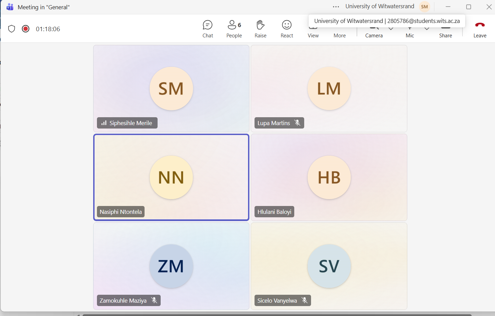
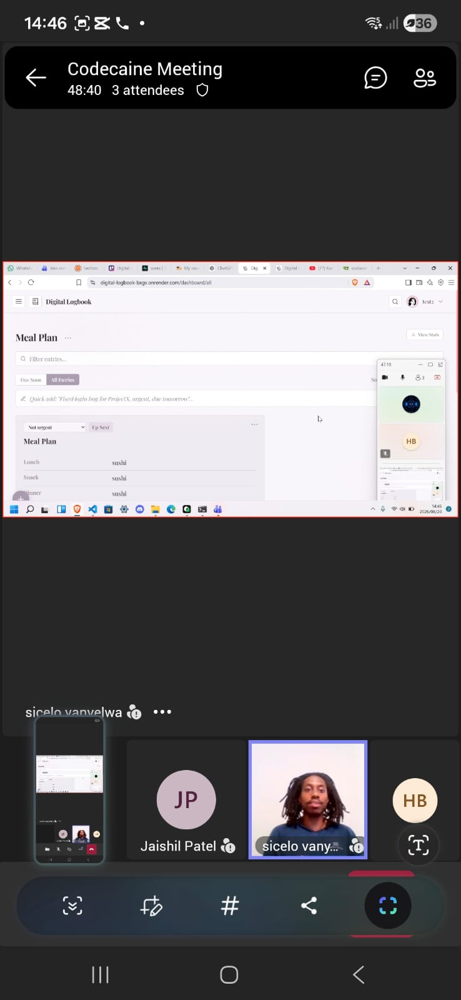
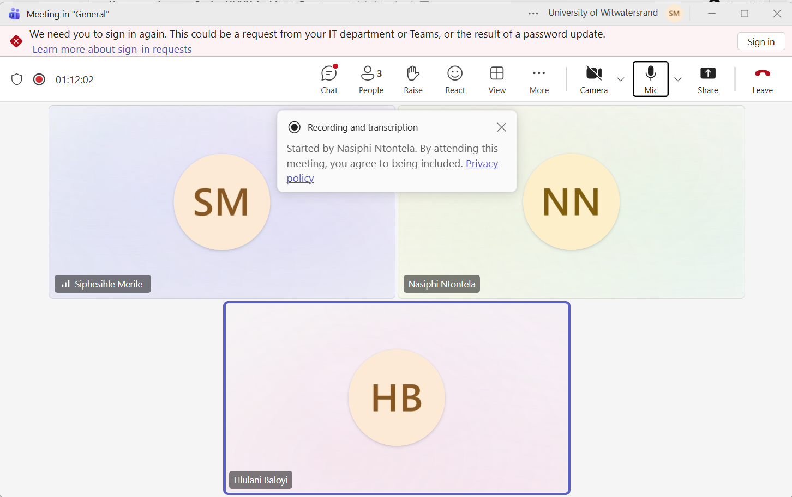

# Meeting Log

Short, factual notes from each team meeting — attendees, what was discussed,
decisions made, and what's still open. This is our evidence for the Stakeholder
Interaction (10%) and Project Methodology (10%) lines of each sprint rubric.

---

## Sprint 1

## Meeting 1 — 27 July 2026

**Venue:** Wartenweiler Library, Focus Room 2
**Attendees:** Hlulani, Siphesihle, Lupa, Sicelo, Zamo, Nasiphi (full team)

**Context:** First meeting as a group. No project had been assigned yet.

**What we did:**

- Introductions — first time meeting as a team
- Read through the COMS3011A project brief together to work out which
  project best suited the group
- Narrowed the eight project options down to our top 5 and submitted them

**Decisions made:** Shortlist of 5 preferred projects submitted.

**Open questions:** None yet raised — pre-assignment stage.

---

## Meeting 2 — 3 August 2026

**Venue:** Commerce Library, Room 3
**Attendees:** Hlulani, Siphesihle, Lupa, Sicelo, Zamo, Nasiphi (full team)

**Context:** The Digital Logbook project had now been officially assigned to us.

**What we did:**

- First deep read of the Digital Logbook project-specific brief
- Discussed what "the owner can customise the format of their logbook"
  actually requires in practice

**Decisions made:** None finalised — surfaced disagreement rather than resolved it.

**Open questions / disagreements:**

- Significant disagreement on how to interpret the custom entry-format
  requirement (how flexible it needs to be, what it means practically for
  the data model)
- Topic was handed to us later than expected, which compressed the time
  available to properly digest it before this meeting

**Next step decided:** Take the format-flexibility question to our tutor/client.

---

## Meeting 3 — 4 August 2026

**Venue:** MSL005
**Attendees:** Hlulani, Siphesihle, Lupa, Sicelo + tutor/client

**Context:** First meeting with our assigned tutor/client.

**What we did:**

- Asked our tutor the open questions from Meeting 2, primarily around the
  custom entry-format requirement
- Consolidated the team's understanding of the project based on the tutor's answers

**Decisions made:**

- The team agreed to use **Supabase** as the primary backend platform instead of Firebase.
- Supabase would provide authentication and PostgreSQL database hosting for the project.
- The team confirmed that application logic would still be implemented through our own backend services rather than relying directly on auto-generated database APIs.
- This decision simplified the technology stack by combining authentication and database management within a single platform.
- The team's future database schema and backend implementation would therefore be designed around Supabase.

**Open questions:** _(carry forward anything not resolved)_

---

## Meeting 4 — 7 August 2026

**Venue:** Wartenweiler Library, Focus Room 2
**Attendees:** Hlulani, Siphesihle, Lupa, Sicelo, Zamo, Nasiphi (full team)

**Context:** Team now had a clear, shared understanding of project requirements.

**What we did:**

- Wrote Sprint 1 user stories with Given/When/Then acceptance tests
  (see [Sprint 1 User Stories](user-stories.md))
- Assigned tasks to team members via Trello
- Set up the project repository on Gitea

**Decisions made:**

- Sprint 1 user stories and acceptance criteria finalised
- Task ownership assigned via Trello
- Repository created and initialised

**Open questions:** See [Open Questions & Decisions](decisions.md) for what
was still outstanding after this point (e.g. microservices vs. single-backend
approach, which surfaced later during initial implementation).

---

!!! note "Keeping this current"
Add a new entry after every future meeting — attendees, what was
discussed, decisions made, and anything left open. Even a few lines per
meeting is enough to count as evidence.

### Meeting 5 — 13 August 2026

**Venue:** Wartenweiler Library, Focus Room 2  
**Attendees:** Hlulani, Siphesihle, Lupa, Sicelo, Zamo, Nasiphi (full team)

**Context:** Authentication functionality had reached a working structure, including sign-up and login. The team met to discuss how to proceed with Sprint 1 implementation and establish a database design that would support the project requirements efficiently.

**What we did:**

- Reviewed progress on the sign-up and login implementation
- Discussed the next development priorities for Sprint 1
- Analysed the project brief and user stories to determine what data needed to be stored
- Explored different approaches for structuring the database schema
- Discussed how project data, logbook entries, and user information should be related
- Considered how to support customisable logbook formats while keeping the design efficient and maintainable

**Decisions made:**

- Database design would be treated as a priority before implementing additional features
- The schema should be driven by the project brief and user story acceptance criteria rather than by assumptions about future features
- The dashboard and project-management functionality would be built around the core entities required for Sprint 1

**Open questions:**

- Whether project records should be linked to users via Supabase Auth UUIDs rather than email addresses
- How dynamic/custom fields should be represented in the database
- Whether projects should use a dedicated UUID primary key instead of relying on project names
- Final review and approval of the proposed schema before implementation begins

**Next step decided:**

- Refine and finalise the database schema
- Begin implementation of the dashboard and project-creation functionality once the schema has been agreed upon

---

## Meeting 6 — 17 August 2026

**Venue:** Online (Microsoft Teams)
**Attendees:** Missy (Nasiphi), Siphesihle, Hlulani, Sicelo, Zamo, Lupa (full team)

**Context:** Sprint 1 implementation is underway. The team met to share progress updates and confirm who is doing what before the next tutor/client check-in.

**What we did:**

- Each member reported on their current Sprint 1 task:
  - **Missy (Nasiphi):** Properly implemented the login structure.
  - **Siphesihle:** Implemented the project/create-button functionality.
  - **Hlulani:** Created the updated UI and implemented entry-side features.
  - **Sicelo:** Committed to implementing the Stats feature.
  - **Zamo:** Committed to implementing activity logs.
  - **Lupa:** Was busy over the weekend; committed to completing the archive button before the tutor/client meeting.
- Reviewed how the individual pieces fit together for the dashboard and entry flow.

**Decisions made:**

- Task ownership for the remaining Sprint 1 features confirmed as above.
- Everyone agreed to have their assigned parts ready before the upcoming tutor/client session.

**Open questions / disagreements:**

- Frustration over local testing limitations because localhost was not working reliably. The team had to commit code they could not fully verify locally and rely on the deployed environment to confirm behaviour.

**Next step decided:**

- Lupa to finish the archive button before the tutor/client meeting.
- Rest of the team to continue with their assigned features and be ready to demonstrate progress.

**Proof of meeting:**

---

## Meeting 7 — 20 August 2026

**Venue:** Wartenweiler Library, Focus room 2 (team in person; client/tutor JP joined online via Microsoft Teams)
**Attendees:** Missy (Nasiphi), Siphesihle, Hlulani, Sicelo, Zamo, Lupa (full team) + JP (client/tutor)

**Context:** Sprint 1 progress demonstration to the client/tutor. The team showed the current Digital Logbook build and collected feedback before continuing with the remaining Sprint 1 work.

**What we did:**

- Demonstrated the current progress on the Digital Logbook application.
- Captured client feedback and requested changes:
  - Add a voice feature.
  - Show how many tasks are being completed / add task-completion visibility.
  - Make the entry button more visible.
  - Make the dashboard toggleable.
  - Add a pin feature.
  - Fix the entry card taking up half the space.
- Discussed two competing ideas for the dashboard:
  - One view: show projects/recent projects first, then drill into project entries.
  - Alternative view: show entries directly on the dashboard with a clear project label for quick recording.
- The client/tutor directed the team to use a bit of both approaches.

**Decisions made:**

- Dashboard will support both project-centric and entry-centric views (hybrid approach as suggested by the client).
- Client feedback items (voice, stats/visibility, entry button, toggle, pin, entry-card sizing) were accepted as the next priorities.

**Open questions / disagreements:**

- Team members disagreed on what should appear on the dashboard by default. This was resolved by the client/tutor’s “bit of both” guidance.

**Next step decided:**

- Start implementing the client feedback items listed above.
- Continue Sprint 1 work with the agreed dashboard direction.

**Proof of meeting:**

---

## Meeting 8 — 24 August 2026

**Venue:** Wartenweiler Library, Focus Room 2  
**Attendees:** Hlulani, Siphesihle, Lupa, Sicelo, Zamo, Nasiphi (full team)

**Context:** Final Sprint 1 team meeting before the Sprint Review scheduled for 25 August 2026. The purpose of the meeting was to verify that all Sprint 1 commitments had been completed, review completed work against the user stories and acceptance tests, and identify any remaining tasks that needed attention before the review.

**What we did:**

- Reviewed the Sprint 1 backlog and Trello board to confirm progress on all assigned tasks.
- Checked completed work against the Sprint 1 user stories and acceptance criteria.
- Verified the status of implemented features, including authentication, dashboard functionality, project creation, entries, statistics, activity logs, and archive-related functionality.
- Discussed integration issues between individual components developed by different team members.
- Reviewed repository commits and documentation to ensure Sprint 1 evidence was available.
- Identified any remaining bugs, UI issues, and incomplete features requiring attention before the Sprint Review.
- Discussed how the Sprint 1 demonstration would be presented during the review session.

**Decisions made:**

- Sprint 1 work was considered substantially complete and ready for final testing and review.
- Team members were assigned responsibility for resolving any remaining minor issues before the Sprint Review.
- Existing documentation, meeting logs, and development evidence would be updated and finalised before submission.

**Open questions / disagreements:**

- Minor discussion remained around dashboard behaviour and the presentation of certain features, but no major architectural or implementation disagreements remained.
- Any outstanding issues would be prioritised based on Sprint 1 acceptance criteria rather than additional feature requests.

**Next step decided:**

- Complete final testing and bug checks.
- Update remaining documentation where required.
- Prepare for the Sprint Review and demonstration on 25 August 2026.
- Begin planning for Sprint 2 based on feedback received during the review.

---

## Sprint 2

## Meeting 9 — 2 September 2026

**Venue:** Online (Microsoft Teams call)
**Attendees:** Siphesihle Merile, Nasiphi Ntontela, Hlulani Baloyi

**Context:** The team met after Sprint 1 to plan the Sprint 2 work and address issues identified in the previous sprint.

**What we did:**

- Planned the work to be completed during Sprint 2.
- Diagnosed what was broken from Sprint 1.
- Discussed and planned fixes for the Sprint 1 issues.

**Decisions made:**

- Sprint 2 work will be planned around the agreed priorities.
- The identified Sprint 1 issues will be addressed as part of the planned fixes.

**Open questions / disagreements:**

- Specific implementation details for the Sprint 1 fixes will be resolved as the work is assigned and completed.

**Next step decided:**

- Break the Sprint 2 plan into assigned tasks.
- Implement and verify fixes for the Sprint 1 issues.

**Proof of meeting:**

---

## Daily Standup — 7 September 2026

**Venue:** Online (Microsoft Teams)
**Attendees:** Hlulani, Siphesihle, Lupa, Sicelo, Zamo, Nasiphi (full team)

**Context:** First daily standup of Sprint 2. The team synced on progress since
the Sprint 2 planning meeting and made sure everyone was unblocked before the
first client check-in of the sprint.

**What we did:**

- Each team member provided a brief update on their current progress:
  - **Hlulani:** Refining the entry-card UI — tightening spacing, aligning the
    status and priority tags, and making the entry button more prominent as
    requested by the client in the Sprint 1 review.
  - **Siphesihle:** Diagnosing a backend blocker where the dashboard service
    was failing to bind to its port on startup; traced it to a port conflict
    with the project service and documented the fix (explicit `PORT` per
    service).
  - **Lupa:** Continuing work on the archive flow and verifying archived
    entries no longer appear in the main feed.
  - **Sicelo:** Syncing the Stats module with the entry data model so the
    "Time Tracked" figures stay accurate as entries are edited.
  - **Zamo:** Extending the activity log to cover entry updates and status
    changes, not just creation events.
  - **Nasiphi:** Regression-testing the auth flow after the Sprint 1 fixes and
    confirming the account-deletion grace period behaves as specified.
- Discussed blockers: the port-conflict issue was the main one — it was
  resolved during the call and the fix was committed.
- Coordinated on integration points for the Timer/Stats feature so the elapsed
  time shown on an entry card matches the totals reported by the Stats module.

**Decisions made:**

- Every backend service must document its default port in the service README
  to prevent future port conflicts.
- The Timer/Stats work will be treated as one integrated feature so the live
  timer, the dashboard banner, and the statistics panel all read from the same
  duration calculation.

**Next step decided:**

- Siphesihle to commit the port-conflict fix and update the service READMEs.
- Hlulani to share the updated entry-card styling for review before the next
  standup.

---

## Daily Standup — 9 September 2026

**Venue:** Online (Microsoft Teams)
**Attendees:** Hlulani, Siphesihle, Lupa, Sicelo, Zamo, Nasiphi (full team)

**Context:** Mid-week standup ahead of the client demonstration on 10
September. The team reviewed what would be demo-ready, agreed what to hold
back, and closed out remaining blockers.

**What we did:**

- Each team member provided a brief update on their current progress:
  - **Hlulani:** Walked through the final UI refinements — dashboard layout,
    entry-card sizing (fixing the card taking up half the screen from Sprint
    1 feedback), and the toggleable dashboard view.
  - **Siphesihle:** Reported the backend blockers cleared — services now start
    reliably on their assigned ports — and demonstrated the Timer feature
    counting elapsed time on an in-progress entry with the Stats module
    totals updating in sync.
  - **Lupa:** Confirmed the archive and pin features are stable and ready for
    the demo.
  - **Sicelo:** Showed the project-level statistics cards (time tracked,
    completion counts) rendering correctly with live data.
  - **Zamo:** Verified the activity log captures the full history of an entry
    (created, updated, started, completed).
  - **Nasiphi:** Finalised auth regression checks and prepared a clean test
    account for the client to use during user testing.
- Synced on the demo plan for the client meeting: feature order, who presents
  which part, and the user-testing script (tasks for participants to attempt).
- Agreed to freeze non-essential merges after this standup so the demo build
  stays stable.

**Decisions made:**

- The client demo will follow the user journey end-to-end: sign in, create a
  project, capture an entry with the timer, view the dashboard, and check the
  stats — with the user-testing session run straight after.
- Code freeze on non-essential merges until after the 10 September client
  meeting.

**Next step decided:**

- Team to deploy the latest stable build and smoke-test it before the client
  meeting.
- Nasiphi to send the meeting invitation and user-testing instructions.

---

## Client Meeting — 10 September 2026

**Venue:** Discussion Room 3, Wartenweiler Library (in person)
**Attendees:** Hlulani, Siphesihle, Lupa, Sicelo, Zamo, Nasiphi (full team) + client/tutor

**Context:** Sprint 2 progress demonstration and user testing session with the client.

**What we did:**

- Demonstrated our current progress on the Digital Logbook application to the client. The demo followed the full user journey agreed in the 9 September standup: signing in, creating a project, capturing an entry with the live timer running, viewing the dashboard (both project-centric and entry-centric views), and reviewing the statistics panel.
- The client responded positively and liked what was shown. Specific praise went to the toggleable dashboard, the more prominent entry button, and the entry-card sizing fixes carried over from the Sprint 1 feedback.
- Conducted a user testing session where participants tested the app and provided comments and feedback. Participants completed a scripted set of tasks (create a project, log an entry, start and stop the timer, archive a completed item) and narrated any points of confusion.
- Captured the user-testing comments for review — most feedback concerned small UI wording issues and a request for clearer timer labels, which the team agreed were quick wins for the next cycle.

**Decisions made:**

- Client feedback and user testing comments will be reviewed and incorporated into the next development cycle.
- The requested timer-label clarification will be handled together with the ongoing Timer/Stats work rather than as a separate item.

**Next step decided:**

- Transcribe the user-testing comments into the project documentation and convert them into backlog items for Sprint 2.
- Schedule the next client check-in after the Timer/Stats feature is finalised.

**Proof of meeting:**

---

## Daily Standup — 12 September 2026

**Venue:** Online (Microsoft Teams)
**Attendees:** Hlulani, Siphesihle, Lupa, Sicelo, Zamo, Nasiphi (full team)

**Context:** Sprint 2 sync two days after the client meeting. The team reviewed
the feedback collected during the 10 September demonstration and user-testing
session, and replanned the remaining Sprint 2 work around it.

**What we did:**

- Reviewed the client feedback and user-testing comments from the 10
  September client meeting and grouped them into quick wins versus items that
  need design discussion.
- Each team member provided a brief update on their current progress:
  - **Hlulani:** Finalising the timer label and entry-card copy changes
    requested during user testing; confirmed the UI now clearly distinguishes
    the deadline countdown from the work-session timer.
  - **Siphesihle:** Demonstrated the updated Timer behaviour — pause/resume
    with the Stats module totals staying in sync — and walked through the
    remaining edge cases (entries started before the fix).
  - **Lupa:** Incorporating the archive-flow comments from user testing and
    tightening the confirmation prompts.
  - **Sicelo:** Verified the statistics panel against the user-testing
    scenarios so the figures participants questioned are now explained
    in-app.
  - **Zamo:** Linking activity-log entries to the user actions observed
    during the testing session for traceability.
  - **Nasiphi:** Scheduling the next client check-in and preparing the
    feedback summary for the stakeholder log.
- Re-planned the Sprint 2 backlog: quick-win feedback items were pulled into
  the current sprint, while larger items were logged for the next sprint
  planning session.
- Confirmed the merge-request pipeline is green so the Timer/Stats changes can
  be merged into main safely.

**Decisions made:**

- All quick-win feedback from the user-testing session will be completed
  within the current sprint; larger items go to the Sprint 3 backlog.
- The next client check-in will focus on a demonstration of the corrected
  timer and stats behaviour.

**Next step decided:**

- Finalise and merge the Timer/Stats changes via merge request.
- Publish the updated documentation, including the expanded meeting logs and
  stakeholder-interaction evidence.

**Proof of meeting:**

